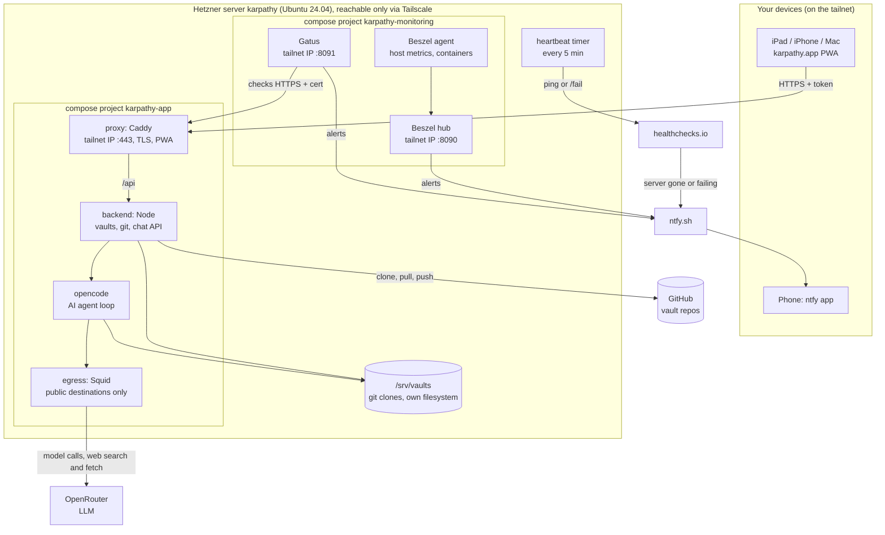

# Deploying karpathy.app

Everything that runs the app: the compose stack, its images, the release workflow and the Ansible
playbook that puts a release on a server. The design and its decisions are in
[`specs/system/deployment.md`](../specs/system/deployment.md); this page is the how-to.

## What runs on the server



The app and the monitoring are separate compose projects, so a deploy of the app never restarts the
monitoring that watches it. healthchecks.io sits outside the server: it is the only part that notices
when the whole box is gone.

## How it works

```
 git tag v0.3.0 ──► GitHub Actions (release.yml)
                     checks → images for amd64 + arm64 → GHCR
                     GitHub release v0.3.0 with compose.yml attached
                                       │
 Mac: just deploy hetzner 0.3.0 ──► Ansible (deploy/ansible) ──ssh──► server
                                       downloads compose.yml, pulls the images,
                                       starts the stack, runs the smoke check
```

- **A release** is a tag `vX.Y.Z` (or a pre-release `vX.Y.Z-rc.N`). CI builds the four images
  (`ghcr.io/tillg/karpathy.app-{proxy,backend,opencode,egress}:X.Y.Z`, public) and attaches
  `compose.yml` to the GitHub release. Nothing is ever built on a server, and the server holds no
  copy of the source.
- **A deployment** is one `just deploy <target> [version]`. The playbook brings the host to the
  desired state (users, SSH hardening, Docker, the vaults filesystem, Tailscale), switches it to
  the release and ends with a **smoke check**: all containers healthy, `/api/health` reachable
  through the proxy, and it reports the requested version. Running it again changes nothing.
- **Rollback** is a deployment of an older version. Each release's `compose.yml` stays on the
  host under `/opt/karpathy.app/releases/`, and `current` points at the running one.
- **Monitoring** is deployed with the app as its own compose project: Beszel (host and container
  metrics, disk/memory/container alerts), Gatus (HTTPS and certificate expiry) and a heartbeat
  every 5 minutes to healthchecks.io, which raises the alert when the server is gone. All alerts go
  to the phone via ntfy.

## Where it runs

| Stack | URL | What it's for | Start |
|---|---|---|---|
| **dev** stack N (1–9) | https://localhost:80N0 | Working on the code: sources bind-mounted, hot reload, the Mac's native Ollama as the model; one per checkout, side by side (`just dev stacks`) | `just dev up [N]` |
| **prodtest** | https://localhost:80N5 | The prod images built from the working tree, paired with dev stack N | `just prodtest` |
| **local** target | https://localhost:9444 | A released version on an Ubuntu VM (Lima) sized like the server: tests the whole playbook | `just vm up`, `just deploy local` |
| **hetzner** target | https://app.karpathy.app | Production: Hetzner server, reachable only over Tailscale | `just deploy hetzner` |

dev and prodtest run in the Mac's Docker (Rancher Desktop); the two targets are real Ubuntu hosts
managed by Ansible.

## The `just` recipes

`just` alone lists them all.

**Develop and test**

| Recipe | Does |
|---|---|
| `just install` | `npm install` for the workspace (after a clone or in a fresh worktree). |
| `just dev [up [N]\|down\|logs\|ps\|token\|stacks]` | This checkout's dev stack N on :80N0 (`up` without N: the remembered one, else the first free); `stacks` lists who owns which stack; `token` prints the access token. |
| `just ollama install\|uninstall\|status` | The dev model server: native Ollama on 127.0.0.1:11434 as a LaunchAgent, shared by all dev stacks (`brew install ollama` first). |
| `just check` | Lint, typecheck, the unit + integration tests and the dev-stack tooling tests. |
| `just test [args]` | The unit + integration tests only. |
| `just e2e [args]` | Playwright against this checkout's dev stack. |
| `just prodtest [up\|down\|e2e]` | The prod images on :80N5 (paired with dev stack N), and the e2e suite against them. |

**Release and deploy**

| Recipe | Does |
|---|---|
| `just release 0.3.0` | Tags `v0.3.0` on HEAD and pushes it; prints the workflow run. Refuses a dirty tree, and a final version unless HEAD is on `main` (`0.3.0-rc.1` may come from any commit). |
| `just deploy <target> [version]` | Deploys a release (default: the newest final release). Log in `tmp/deploy-<target>-*.log`. |
| `just deploy <target> [version] --only app` | Only the app role (or `--only monitoring`); assumes a full deploy ran before. The fast path for upgrades and rollbacks. |
| `just deploy hetzner --bootstrap <public-ip>` | The first run against a fresh server: as `root` on its public IP. Every later run goes as `ops` over Tailscale. |
| `just deploy-check <target> [version] [--only app\|monitoring]` | Dry run with diff; changes nothing. Needs a host that was deployed before (a fresh one has no Docker or Tailscale to check against). |
| `just deploy-e2e local [args]` | The Playwright suite (without the `@llm` tests) against the local target. |

**The local target VM**

| Recipe | Does |
|---|---|
| `just vm up` | Creates the Lima VM the first time, starts it after that. |
| `just vm down` | Stops it (keeps its disk). |
| `just vm reset` | Deletes and recreates it: the from-scratch test. |
| `just vm ssh [-- cmd]` | A shell in the VM, or one command. |

**Secrets and logging in**

| Recipe | Does |
|---|---|
| `just secrets <target>` | Fills the target's encrypted vault interactively: asks for what only you have (hidden input, Enter keeps the current value) and generates the rest once (access token, Beszel secrets, ntfy topic). Run it in your own terminal. |
| `just token <target>` | Copies the target's access token to the clipboard. |
| `just token <target> --qr` | Also prints a QR code of the login link `<app url>/#token=…`: scan it on the iPad or phone and the app opens, logged in. The QR code is a credential: don't screenshot or share it. |
| `just ntfy-topic <target>` | Copies the target's ntfy alert topic to the clipboard, to subscribe to it in the ntfy app (and in healthchecks.io's ntfy integration). `dev` copies the dev-progress topic (`karpathy-development-…`, Keychain item `karpathy-ntfy-dev`; agents post progress there, never on the alert topics). |

**Operations**

| Recipe | Does |
|---|---|
| `just hetzner-watch install\|uninstall\|now` | Checks at 08:00 and 14:00 whether a cheaper Hetzner server (CX23, CAX11) can be booked again and pushes to ntfy when it can. Needs a read-only Hetzner API token in the Keychain (`karpathy-hetzner-api`). |

## Settings

A target's app settings (model and gateway, domain and TLS, timezone, commit author, web caps) are
`settings/settings.yaml` plus `settings/<target>.yaml` (see the main README, *Settings*); `just settings show
<target>` prints them. `just deploy` renders them on this Mac with the target's secrets and copies the result
to `shared/` (`.env`, `opencode.env`, `opencode-providers.json`, `settings.json`). The inventory keeps only
what configures the host (Tailscale, disk size, monitoring, `domain` for the monitoring, which must equal
the settings' `proxy.domain`).

## Secrets

Each target has its own encrypted Ansible Vault,
`ansible/inventories/<target>/group_vars/all/vault.yml`, committed to git. Its password is in the
macOS Keychain as `karpathy-ansible-<target>`; keep a copy in your password manager. On a new Mac:

```sh
security add-generic-password -a "$USER" -s karpathy-ansible-hetzner -w   # prompts for the password
```

The access token is a fixed value in the vault, not generated at startup; it changes only when you
change it in the vault (and the next deploy restarts the stack with it). The `local` vault holds
test values only.

### The GitHub token

The app uses **one** GitHub token for every vault: to check a repo when you add it, and to clone, pull and push.
It comes from the app's **Settings → GitHub** if one is set there, otherwise from the `GITHUB_TOKEN` secret that
`just secrets <target>` asks for. Use a **fine-grained personal access token** that can reach only the vault repos.

**Create it** at GitHub → Settings → Developer settings → Personal access tokens → **Fine-grained tokens**
(<https://github.com/settings/personal-access-tokens>) → **Generate new token**:

| Field | Value |
|---|---|
| Token name | e.g. `karpathy.app hetzner` (one token per target) |
| Resource owner | the account that owns the vault repos |
| Expiration | your choice; the app's **Test token** shows the expiry date |
| Repository access | **Only select repositories**: every repo you use as a vault |
| Permissions → Repository permissions | **Contents: Read and write** (Metadata: read-only is added by GitHub) |

Then paste it in the app (**Settings → GitHub → Save token**, takes effect on the next git operation, no restart)
or put it in the vault with `just secrets <target>` and deploy.

**Every new vault repo must be added to the token.** Before you add a vault in the app (or right after you
created its repo), edit the token: Fine-grained tokens → the token → **Edit** → Repository access → add the repo
→ **Update**. The token's value doesn't change, so nothing needs to be re-entered in the app.

**Why this is easy to miss:** a fine-grained token can *read* every public repo, also ones it wasn't given. So a
public repo that isn't on the token's list attaches, clones and passes **Test token** (which checks read access
only) — and then **Commit & Push** fails with:

```text
remote: Permission to <owner>/<repo>.git denied to <user>.
… The requested URL returned error: 403
```

The commit stays local ("1 unpushed commit · retry"); add the repo to the token and press **retry**. A private
repo that isn't on the list fails earlier, already when you add the vault: the form shows git's error
(GitHub answers "Repository not found" rather than revealing that the repo exists).

**Renaming a repo** on GitHub keeps it on the token's list (GitHub tracks the repo, not its name), but update the
vault's repo name in the app (vault details → Edit vault) so it doesn't rely on GitHub's redirect.

**When it expires,** git operations fail with 401 and **Test token** says "GitHub rejected the token (401)":
regenerate the token on the same page (**Regenerate token**, same repos and permissions) and save the new value in
the app.

## A new server, start to finish

1. Book it (Ubuntu 24.04, your SSH key, firewalls `no-inbound` + `setup-ssh`, backups on) and note
   its public IP. Background: [prod-env report §8](../specs/research/prod-env/prod-env-report.md#guide)
   (its steps 8.3–8.10 are what the playbook does).
2. In the Tailscale admin console, add `tag:server` to `tagOwners` and create an auth key: tagged
   `tag:server`, pre-approved, single-use.
3. `just secrets hetzner`: GoDaddy key, GitHub token, OpenRouter key, the Tailscale key, the
   healthchecks.io ping URL, the git author. Subscribe to the printed ntfy topic on your phone.
4. `just deploy hetzner --bootstrap <public-ip>`. At the end root login is off and the server is
   on the tailnet as `karpathy`; you and Ansible log in as `ops` (sudo); `deploy`, the app's own
   user (uid 1000), has no login.
5. In GoDaddy, point `app.karpathy.app` (A record) at the server's tailnet IP (`100.x.y.z`).
6. Detach the `setup-ssh` firewall in Hetzner: from now on no port is open to the internet.
7. `just deploy hetzner` again (over Tailscale) to see it report `changed=0`, then
   `just token hetzner --qr` and scan it on the iPad.

## Rebuilding the server

For a replacement server (a cheaper type, a broken box, a fresh start). The vaults live in GitHub, so
commit and push everything first; only uncommitted changes would be lost.

1. Book the new server as in step 1 above, with **`setup-ssh` attached** again.
2. Tailscale admin console → Machines: **delete the old `karpathy`**, or the new one comes up as
   `karpathy-1` (the playbook stops with that message).
3. Create a **new auth key** (the old one is used up) and put it in: `just secrets hetzner` (only
   the Tailscale prompt needs input; Enter keeps the rest).
4. `ssh-keygen -R karpathy`: the new server has a new host key under the old name.
5. `just deploy hetzner <version> --bootstrap <new-public-ip>` (it forgets the old host key of that
   IP by itself).
6. Point the A record at the new tailnet IP and detach `setup-ssh`, as in steps 5–6 above.
7. Delete the old server in Hetzner.

Each fresh server requests a new certificate; Let's Encrypt allows 5 for the same name per week.

## Where things are

```
deploy/
  compose.yml              the stack (one definition for dev, prodtest and every target)
  compose.dev.yml          dev overrides (bind mounts, Ollama relay, Vite)
  compose.prodtest.yml     prodtest overrides
  dev.sh                   behind `just dev`
  backend/ proxy/ opencode/ web/   Dockerfiles and their config (Caddyfile, opencode.json)
  lima/karpathy-vm.yaml    the local target VM
  ansible/                 the playbook: site.yml, roles/, inventories/{local,hetzner}/,
                           deploy.sh (just deploy), fill_vault.py (just secrets), token.sh (just token)
  hetzner-watch/           the availability check behind `just hetzner-watch`
```

On a target: the app in `/opt/karpathy.app` (`releases/`, `current`, `shared/` with the rendered
settings and the secrets), monitoring in `/opt/karpathy-monitoring`, the vaults on the loop-mounted `/srv/vaults`.

## When something goes wrong

- **A deploy fails:** the log is in `tmp/deploy-<target>-*.log`; the failing task is the last
  `TASK [...]` before `fatal:`. Tasks that handle secrets show `censored`; rerun that one task
  without `no_log` only if you have to, and never paste its output anywhere.
- **The smoke check fails:** the new release is running but unhealthy. Deploy the previous
  version (`just deploy <target> <previous> --only app`) and look at the containers:
  `ssh ops@karpathy docker compose -p karpathy-app ps` and `… logs backend`.
- **Monitoring:** the Beszel hub is at `http://<tailnet-ip>:8090` (`local`: http://localhost:9090),
  Gatus at `:8091`. Alerts arrive on the target's ntfy topic.
