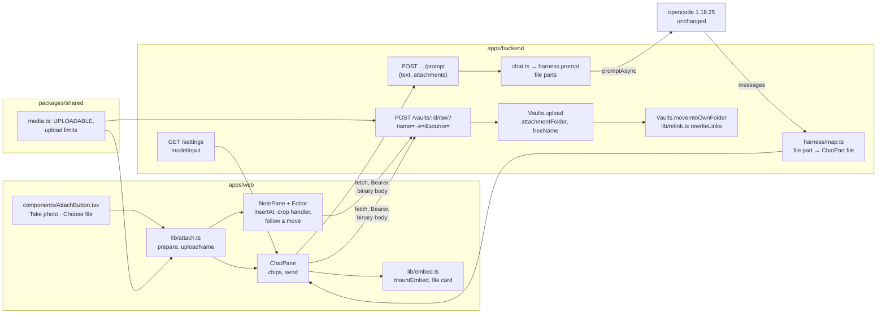
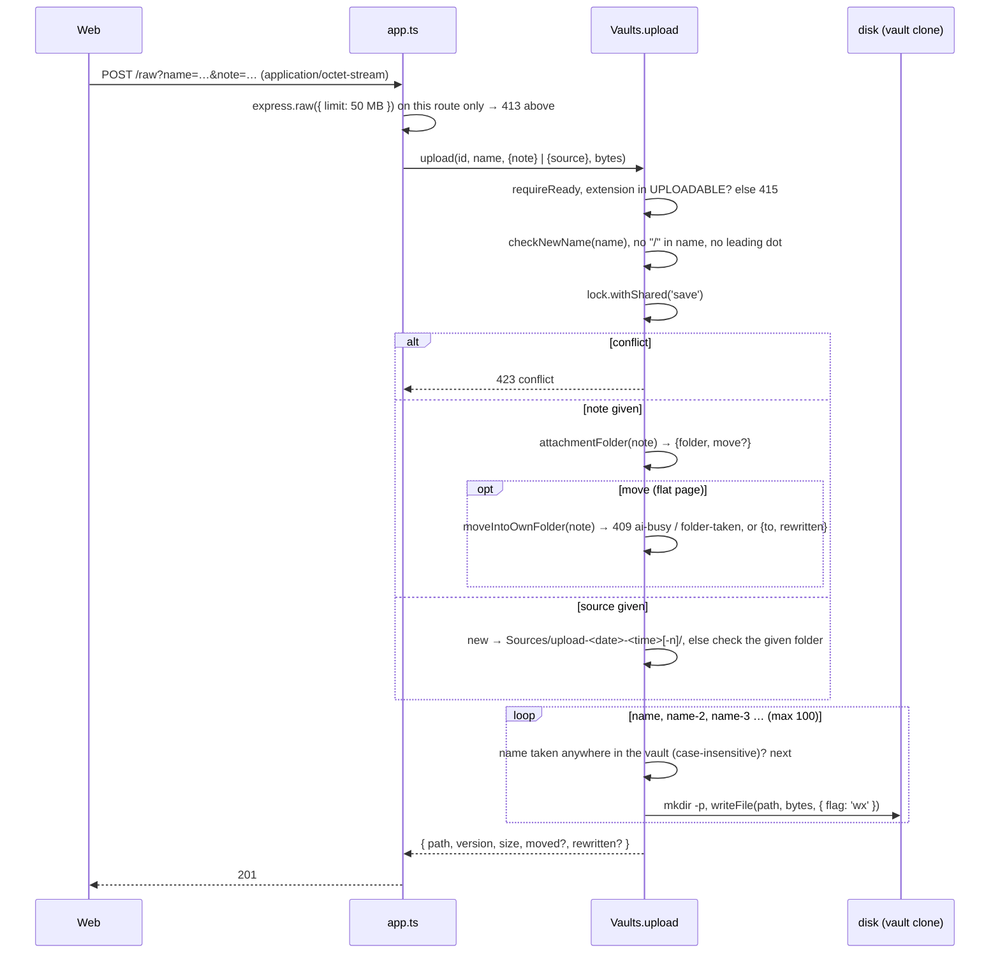
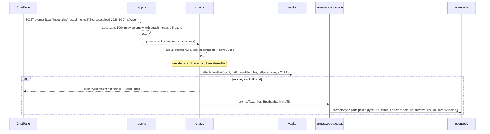

# Architecture: uploads and chat attachments

## Overview



Three entry points share one upload route.

- **Editor button and drop:** the editor inserts an embed after the upload. If the upload moved the page into its
  own folder, the editor follows the page first.
- **Chat:** the chat sends the uploaded paths with the prompt. opencode does the rest: it reads the file, resizes
  images and drops what the model can't take.

## Verified facts

Checked on 2026-10-04 against the pinned versions. Paths in opencode are in `packages/opencode/src` at tag `v1.18.25`
(commit `cb7d8b2`).

| # | Fact | Evidence |
|---|---|---|
| F1 | `session.promptAsync` takes `parts: Array<TextPartInput \| FilePartInput \| …>`; a file part is `{ type: "file", mime, filename?, url, source? }`. | `node_modules/@opencode-ai/sdk` 1.18.25, `dist/v2/gen/types.gen.d.ts` lines 2111–2118 (`FilePartInput`) and 8660–8675 (`SessionPromptAsyncData`) |
| F2 | A `file:` URL with a mime other than `text/plain` or a directory: opencode reads the bytes from disk and stores the part as a `data:<mime>;base64,…` URL, keeping our `filename`. It does no directory check on that path itself, so the backend must check it. | `session/prompt.ts` 808 (`case "file:"`) to 970 (`Buffer.from(yield* fsys.readFile(filepath)…)` at 964) |
| F3 | Every `image/*` part then goes through `image.normalize`: scaled to at most 2000×2000 px and 5 MB base64, re-encoded as PNG or JPEG. Only `ResizerUnavailableError` is caught, so an image the decoder (photon) can't read, such as HEIC, fails the prompt. | `session/prompt.ts` 1011–1019; `image/image.ts` 10–12 (limits), 92 (`new_from_byteslice`) |
| F4 | A part the model can't read is replaced by the text `ERROR: Cannot read "<filename>" (this model does not support <image\|pdf> input). Inform the user.`. The turn goes on. | `provider/transform.ts` 10–16 (`mimeToModality`), 409–445 (`unsupportedParts`) |
| F5 | The model's input capabilities are in opencode's model list: `capabilities.input.{text, image, audio, video, pdf}`. | `types.gen.d.ts` 1650–1680 (`Model`); `config.providers()` already used by `OpencodeHarness.models()` |
| F6 | The `read` tool returns JPEG, PNG, GIF, WebP and PDF files as file attachments (whole file, base64), sniffing the type from the first bytes. Other binaries fail "Cannot read binary file". It extracts no text from PDFs. | `tool/read.ts` 19 (`SUPPORTED_IMAGE_MIMES`), 303–325, 328; `util/media.ts` (`sniffAttachmentMime`) |
| F7 | Tool-result images and PDFs reach the model as media content, or as an extra user message for providers that can't take media in tool results. | `session/message-v2.ts` 160–190, 296–305 |
| F8 | Production model `openrouter/z-ai/glm-5.3`: input `["text"]`. `anthropic/claude-sonnet-5`: `["text","image","pdf"]`. `openrouter/z-ai/glm-5.3-flash`: `["text","image","video"]`. Dev `ollama/qwen2.5:3b` is a custom model in `dev-ollama.json` with no `modalities`, so text only. | `https://models.dev/api.json`, fetched 2026-10-04; `deploy/opencode/opencode.json`, `deploy/opencode/dev-ollama.json` |
| F9 | iOS Safari since WebKit 275726@main (2024-03-05) transcodes HEIC to JPEG **only** when the accepted image types are an explicit list without HEIC. Before that, iOS transcoded unconditionally. `accept="image/*"` alone now delivers HEIC. | [WebKit bug 267277](https://bugs.webkit.org/show_bug.cgi?id=267277) "[iOS] Avoid transcoding images on file inputs unless the set of image types is explicitly restricted" |
| F10 | With an explicit list, Safari transcodes to the **first** listed type. Mixing a wildcard (`image/jpeg,image/*`) broke the conversion until a fix (2024-04-30); `image/heic` in the list makes Safari convert JPEG/PNG *to* HEIC. | [WebKit bug 292350](https://bugs.webkit.org/show_bug.cgi?id=292350), [WebKit bug 273444](https://bugs.webkit.org/show_bug.cgi?id=273444), [Apple forum 743049](https://developer.apple.com/forums/thread/743049) |
| F11 | `capture` asks for a new capture with the camera (`user` / `environment`); it is not Baseline; a browser without support shows the normal file picker. Supported in Safari on iOS since 6; not in desktop Safari, Chrome or Firefox. | [MDN: capture](https://developer.mozilla.org/en-US/docs/Web/HTML/Reference/Attributes/capture), [caniuse: html-media-capture](https://caniuse.com/html-media-capture) |
| F12 | Safari 17+ (desktop and iOS) decodes HEIC/HEIF images; Chrome and Firefox don't. | [caniuse: heif](https://caniuse.com/heif) |
| F13 | `express.json({ limit: '10mb' })` parses only `application/json` bodies; the API has no binary body parser. Caddy sets no `request_body` limit. | `apps/backend/src/app.ts`; `deploy/proxy/Caddyfile` |
| F14 | The queue of prompts is persisted in `config.json` (`saveQueue`), text only. | `apps/backend/src/chat.ts` (`prompt`, `saveQueue`) |
| F15 | `harness/map.ts` maps `text` (skipping `synthetic`), `reasoning` and `tool` parts; a `file` part falls to `default` and is dropped. | `apps/backend/src/harness/map.ts` 80–88 |
| F16 | Obsidian: the attachment location has four options (vault folder, a specified folder, same folder as the note, a subfolder under the note's folder, created on demand). Paste creates a file there. Dropping a file from the file system "copies the file to the default attachment location and embeds it in the note". "Use Wikilinks" switches `![[x]]` / ``, and Markdown links encode spaces as `%20`. "Automatically update internal links" rewrites links on rename. The app reads none of these settings (Key decisions). **Link resolution** (`MetadataCache.getLinkpathDest`, read in the installed app's code): candidates are the files with the link's base name (`.md` appended if the name has no dot). A single candidate is returned only if the link is the bare name. Otherwise the result is an exact path match, else the candidates whose lower-cased path **ends with** the link, those under the linking note's folder first. So `[[serien/foo]]` does **not** resolve to `Wiki/serien/foo/foo.md` (it ends `foo/foo.md`): a path-form link breaks when its page moves. A bare `[[foo]]` keeps resolving, and with several `foo.md` the one under the linking note's folder wins. | [obsidian.md/help/attachments](https://obsidian.md/help/attachments), [/help/settings](https://obsidian.md/help/settings), [/help/links](https://obsidian.md/help/links), `obsidian.d.ts` (`getAvailablePathForAttachment`, `renameFile`), fetched 2026-10-04; `getLinkpathDest` in `app.js` of `~/Library/Application Support/obsidian/obsidian-1.13.7.asar`, read 2026-10-04 || F17 | The vaults keep pages with images in their own folders (`Wiki/<slug>/<slug>.md`; sources as `Sources/<slug>/<slug>.md`, 1 458 + 82, or `Sources/<slug>/index.md`, 264 + 31). They embed with `![[name]]` only and set no `useMarkdownLinks`. They gitignore `.obsidian/`, so the app's clones never see `app.json`. The user's local Obsidian has been set to `attachmentFolderPath: "./"` since 2026-10-04. Path-form wikilinks: 540 of 9 871 in `mylife_wiki/Wiki`, 379 of 2 977 in `frechen_wiki/Wiki`. Relative Markdown links: 0 and 1. | the user's vault clones, counted 2026-10-04 |
| F18 | The app's resolver finds `[[serien/foo]]` after a move to `serien/foo/foo.md` through its basename fallback. So only Obsidian (and other tools) would break. | `apps/web/src/lib/wikilink.ts` 50–63 (`resolveWikilink`) |
| F19 | CodeMirror inserts a dropped file's name or path as text unless the `drop` event is handled. `EditorView.domEventHandlers({ dragover, drop })` returning `true` takes over, and `view.posAtCoords({x, y})` gives the document position under the pointer. | CodeMirror 6 `@codemirror/view` docs (`domEventHandlers`, `posAtCoords`) |

Not verified, checked by hand on a real iPhone (plan, last phase): the exact iOS menu without `capture`, the format
of a photo taken through `capture="environment"`, and Files-app HEIC picks with the explicit `accept` list. The
browser's photo preparation (below) turns any HEIC that still arrives into JPEG, so none of these blocks the design.

## Backend: the upload route

`POST /vaults/:id/raw?name=<file name>[&note=<note path> | &source=new&at=<YYYY-MM-DD-HHMMSS> | &source=<folder name>]`.
The body is the file's bytes, behind the bearer auth. Exactly one of `note` (editor) and `source` (chat) is given.
`at` is the browser's local time, required with `source=new`.



- **Body parsing:** `express.raw({ type: () => true, limit: MAX_UPLOAD_BYTES })` on this one route. The global
  `express.json` skips non-JSON bodies (F13), so the two don't collide. The body is buffered in memory: one user, at
  most 50 MB, acceptable. Streaming to a temp file was considered and left out (more code, a cleanup path).
- **Never overwrite:** `writeFile(…, { flag: 'wx' })` fails with `EEXIST` if a file appeared since the name check, and
  the loop takes the next suffix. Two uploads of `photo.jpg` at once both succeed with different names.
- **Unique in the vault** (decided 2026-10-04): a name counts as taken if any file in the vault has it as its base
  name, compared case-insensitively, not only in the target folder. So the bare `![[name]]` resolves to this file in
  every tool, without relying on a resolver preferring the note's folder. The check uses the vault's file list
  (the one `GET /files` builds). Case twins in the folder are covered by it. Folders are matched case-insensitively
  and the existing spelling is kept (`sources/upload-…/`), the same idea as the attach preflight.
- **Errors** (`HttpError` JSON):
  - `400 bad-name`;
  - `413 too-large`;
  - `415 not-uploadable` ("Only JPEG, PNG, GIF, WebP and PDF can be uploaded.");
  - `423 conflict`;
  - `400 bad-path` for a `note` outside the vault, or for a `source` folder that isn't an existing
    `Sources/upload-…` folder;
  - `400` for `source=new` without a valid `at` (`YYYY-MM-DD-HHMMSS`);
  - `400` when both or neither of `note` and `source` are given;
  - `409 ai-busy` and `409 folder-taken` from the move.
- **Version:** `versionOf(bytes)`, the same hash `GET /file` gives, so Delete works on the new file at once.
- **Watcher:** the write triggers `files-changed` like every write; the tree, the Changes list and the object-URL
  cache update on their own.
- **Not AI-touched:** `aiTouched` is untouched; a commit of only uploads has no agent trailer.

### Attachment folder

`Vaults.attachmentFolder(note: string): { folder: string; move: boolean }`, a pure function of the path. Let the
note be `dir/stem.md`:

- It is in its own folder if `base(dir)` equals `stem` case-insensitively, or if `stem` is `index`. Then →
  `{ folder: dir, move: false }`.
- Otherwise → `{ folder: dir/stem, move: true }`.

`.obsidian/app.json` is not read: the vaults gitignore `.obsidian/` (F17), so the clones never have one.

`Vaults.sourceFolder(id, source)`:

- `new` → `Sources/upload-<at>`, taking `-2`, `-3` … if the folder exists. `at` is the browser's local time,
  because the server runs on UTC and the camera names use the device's clock too. The first segment matches an
  existing `Sources` folder case-insensitively.
- A folder name → it must exist directly under that `Sources` folder and start with `upload-`.

### Move into own folder

`Vaults.moveIntoOwnFolder(id, note): { to: string; rewritten: string[] }` runs inside the upload's shared `save`
lock, before the file is written:

1. **Refuse:**
   - `409 ai-busy` while the vault's busy state is `turn`, because a running turn could write the old path again;
   - `409 folder-taken` if `dir/stem/stem.md`, or a case twin of it, exists.

   Nothing has changed at this point. An existing `dir/stem/` folder without that file is fine: the page moves in
   next to what's there.
2. **Find inbound links:**
   - `rg --fixed-strings` over `*.md` in the vault root for the note's stem (one ripgrep call, the same binary as
     `/search`) narrows the candidate files.
   - `lib/relink.ts` parses each candidate's links: wikilinks and embeds `[[…]]`/`![[…]]` with `|alias` and
     `#heading`, and Markdown links `[…](…)`/``.
   - It skips fenced code blocks and code spans.
3. **Pick the ones to rewrite:** a link is rewritten only if it is **path-form** (its target contains `/`) and it
   resolves to the old path with the backend's port of the app's resolver. Wikilinks resolve the way
   `resolveWikilink` does, and Markdown links the way `resolveRelativeLink` does. The port lives in
   `packages/shared`, moved from `apps/web/src/lib/wikilink.ts` so both sides use one implementation.
   - A rewritten wikilink keeps its style. `[[serien/foo]]` → `[[serien/foo/foo]]`: the same suffix depth plus the
     new folder. With an `.md` in the old target, the new one keeps it.
   - A Markdown link gets a new relative path from its page to the new location, with spaces as `%20`.
4. **Relative links inside the moved page:** Markdown links and embeds that don't start with `/` or a scheme get
   recomputed relative paths. Wikilinks inside it stay as they are.
5. **Write:**
   - Each rewritten page is written with `writeFile`, which does the stale check against the version just read;
     a page changed in between makes the move fail with `409 stale` before the rename.
   - Then `rename(old, new)` and the attachment.
   - The AI-touched set renames the entry if the old path was in it.
6. If any step fails after a rewritten page was written, the step stops and the error is returned. There's no
   rollback: the rewritten pages are ordinary uncommitted changes, and Discard undoes them. This is rare, because
   every check runs before the first write.

The response adds `moved: { from, to }` and `rewritten: string[]`. `files-changed` fires for all of them, as for any
write. Git sees a delete and an add until the commit, and the commit records it as a rename (git's rename detection).

### Shared table

`packages/shared/src/media.ts` gains:

```ts
export const UPLOADABLE = ['jpg', 'jpeg', 'png', 'gif', 'webp', 'pdf'] as const;
export const MAX_UPLOAD_BYTES = 50 * 1024 * 1024;      // server cap, 413 above
export const WARN_UPLOAD_BYTES = 10 * 1024 * 1024;     // browser asks above
export const MAX_ATTACHMENT_BYTES = 20 * 1024 * 1024;  // per chat attachment
export const MAX_ATTACHMENTS = 5;                      // per prompt
export function isUploadable(path: string): boolean;
export function uploadMime(path: string): string;      // image/jpeg … application/pdf
```

The list is the intersection of what Obsidian shows, what browsers show and what opencode reads as an image or PDF
(F6). SVG, AVIF and BMP are left out because opencode's read tool and its resizer don't take them (F3, F6); HEIC
because photon can't decode it (F3).

## Web: picking and preparing a file

### `AttachButton`

One **+** button opens a small menu with two entries, each a hidden `<input type="file">`:

| Entry | Input | Why |
|---|---|---|
| **Take photo** | `accept="image/jpeg" capture="environment"` | Opens the back camera on a phone (F11). Shown everywhere: where `capture` isn't supported (desktop) it falls back to the normal file picker, so no device check is needed. |
| **Choose file** | `accept="image/jpeg,image/png,image/gif,image/webp,application/pdf"` | No wildcard and no `image/heic`, with JPEG first, so iOS converts HEIC library photos to JPEG (F9, F10). On iOS this picker also offers the camera, the library and Files. |

The editor shows the button only in Write mode with a note open, online and not in conflict. The composer shows it
online and not in conflict. Picking several files in the composer adds several chips (`multiple`, up to 5).

The composer keeps one source folder per draft message:

- The first upload sends `source=new`, and the composer stores the folder from the returned path.
- Later uploads for the same draft send `source=<folder name>`.
- Sending the message, or clearing the composer, forgets the folder.
- **✕ on a chip** deletes its file with `DELETE /file` and the version from the upload's response. When it was the
  folder's last file, the folder goes too, and the next upload sends `source=new` again.
- **Unsent chips survive a reload:** the composer keeps `{ path, version, mime, size }[]` and the folder per chat in
  localStorage (`karpathy.chips:<vault>:<chat>`), wrapped in try/catch like the drafts. On load, a chip whose path
  is no longer in the file list is dropped. Sending clears the entry.

### `lib/attach.ts`

```ts
export function uploadName(file: File, fromCamera: boolean, now: Date): string;
export async function prepare(file: File): Promise<{ blob: Blob; name: string }>;
```

- **`uploadName`:** stem + `.` + lower-case extension, with no date prefix (the page's folder says what the file
  belongs to).
  - A camera photo's stem is `photo-YYYYMMDD-HHMMSS`.
  - Otherwise it is the file's stem, cleaned:
    - `<>:"|?*\#^[]` and control characters replaced by `-`;
    - runs of `-` collapsed;
    - leading dots, and trailing dots and spaces, dropped;
    - at most 80 characters;
    - empty → `file`;
    - a Windows-reserved stem (`con`, `nul`, `com1` …) gets `-file`.

    Spaces are kept, as in Obsidian.
  - `.jpeg` stays `.jpeg`; a converted HEIC gets `.jpg`.
- **`prepare`:** JPEG and HEIC (by type or extension) are decoded with `createImageBitmap(file)` (EXIF orientation is
  applied by default), drawn on a canvas scaled to at most 2048 px on the long edge, and encoded with
  `canvas.toBlob('image/jpeg', 0.85)`. That drops all metadata. HEIC decodes in Safari 17+ (F12); in Chrome it
  fails, and the app says "HEIC photos can't be converted in this browser". PNG, GIF, WebP and PDF are passed through.
- **Size checks before sending:** over `MAX_UPLOAD_BYTES` → refused in the browser; over `WARN_UPLOAD_BYTES` →
  `confirm` with the size. A chat attachment over `MAX_ATTACHMENT_BYTES` is refused for the chat ("too large to send
  to the AI; attach it in a note instead").
- **Transport:** `api.upload(vault, name, { note } | { source }, blob)` = `fetch` `POST` with the Bearer header and
  `Content-Type: application/octet-stream`. No progress bar (fetch has no upload progress in Safari); the chip or the
  editor shows "Uploading…". No CSP change: `connect-src 'self'` covers the request, and a chip's thumbnail is a
  `blob:` URL, which `img-src` already allows.

## Web: the editor

After a `201`, `NotePane` asks the editor to insert the embed:

- **`EditorHandle.insertAt(pos, text)`** is one CodeMirror transaction. For the button, `pos` is the main
  selection's head; for a drop, it is the drop point (below). The embed goes on its own line (`\n![[name]]\n`,
  without doubling an existing line break), so the block widget shows below it. Several files from one drop or pick
  go in as consecutive lines, in order.
- **The embed text** is `![[<file name>]]`: the file sits in the note's own folder and its name is unique in the
  vault.
- **Undo** (Cmd+Z) of the insert removes the text only. The file and a move stay on the server and show in Changes.
- **The insert is a normal edit:** autosave, drafts and stale saves work as today. The editor's file list learns the
  new path from `files-changed`. Until then the embed resolves against the path returned by the upload (the store
  adds it to the list right away), so the image shows without a "missing" flash.
- **Typing during the upload:** the insert position is read when the upload **starts** and mapped through later
  changes (`ChangeSet.mapPos`), so typing doesn't misplace the embed.

### Following a move

An editor upload may move the open page, so the store wraps it:

1. Before the POST: `flush()` the note, so the server moves the latest text, and **pause autosave** for it. Typing
   continues into the draft. A save to the old path while the server moves the page would recreate the old file.
2. On `201` with `moved`: `retarget(from, to)`.
   - `noteRef.current.path` becomes `to`, and the version is re-read from the response.
   - The local draft moves from the old `karpathy.draft:*` key to the new one.
   - The hash route is replaced (`history.replaceState`, no new history entry).
   - Back links in open lists update through `files-changed`.

   Then autosave resumes and saves anything typed meanwhile to the new path.
3. On an error: autosave resumes on the old path and the toast shows the server's message.

**Several files** from one drop or pick are uploaded **one after another**, in order, with the same flush and pause
around the whole batch. Each POST names the note's current path, so after the first one moves the page, the rest
name `to`. In parallel, the later POSTs would name the old path and fail with `bad-path`. A failed file is skipped
with a toast, and the rest still go in.

### Drop

- **Handler:** `EditorView.domEventHandlers` in `lib/cm.ts`.
  - **`dragover`:** if the data transfer contains files, `preventDefault` (to allow the drop) and show a drop outline
    on the editor (`cm-drop-target`).
  - **`drop`:** with files, `preventDefault`. The drop point is `view.posAtCoords({ x, y })`, or the end of the
    document if that is null. Hand the `File`s to the same path as the button: `prepare`, the growth check, upload,
    insert.
  - Returning `true` keeps CodeMirror from inserting the file name as text (F19).
  - A drag without files (text moved within the editor) is left to CodeMirror.
- **Where it works:** in Write mode with a note open, online and not in conflict. Elsewhere a file drop is caught
  and ignored, so the browser doesn't navigate to the file.
- **Refusals:** non-uploadable files in a drop are refused with one toast naming them, and the rest still go in.
- **Not built:** dropping a file that's already in the vault, for example from the tree (the tree has no drag
  source today), and paste (`paste` with `clipboardData.files`). Paste would reuse this path.

## Backend: prompts with attachments



- **`promptBody`:** `{ text: string (trim, ≤ 100 000), attachments?: string[] (≤ 5) }`, refined so that text or at
  least one attachment is present. The chat title for an empty text is the first attachment's file name.
- **Queue:** `Turn` gains `attachments?: string[]`; `saveQueue` persists them with the text. Bytes never enter
  `config.json` (F14).
- **Checks at turn start**, not at prompt time: the file may be discarded while the turn waits. `Vaults.rawFile`
  (no dot segment, no symlink, inside the vault root, exists, not a directory), `isUploadable`, and `stat` size ≤
  `MAX_ATTACHMENT_BYTES`. These checks are the only guard on the path, because opencode reads a `file:` URL without
  its own directory check (F2).
- **`PromptInput.files`:** `{ path; url; mime }[]`. `OpencodeHarness.prompt` appends one `FilePartInput` per file
  after the text part (the text part is left out when empty). `url` = `pathToFileURL(posix.join(dir, path))`, where
  `dir` is `chat.ts dir(vaultId)`, the vault root as opencode sees it (both containers mount `/vaults`). `filename` =
  the vault path, so the model and the chat history see where the file lives.
- **No mime from the client:** `uploadMime(path)` from the shared table.
- **`promptSync`** (commit message) never gets files.

## Backend: chat history and model input

- **Mapping:** a stored user `file` part (its `url` is a `data:` URL by then, F2) maps to a new
  `ChatPart { type: 'file'; id; path: filename; mime }`. The `data:` URL is never sent to the browser; it can be MBs.
  Synthetic text parts opencode adds ("Called the Read tool with …") are already skipped (F15). A file part without a
  `filename` maps to nothing.
- **Rendering:** `ChatPane` renders a user message's file parts above its text with `mountEmbed` (image →
  thumbnail through `/raw` and the object-URL cache; PDF → file card with Open). A deleted file shows the "missing"
  card.
- **Model input:** `Harness.models()` returns `{ id, input: { image, pdf } }[]` from `capabilities.input` (F5);
  `availableModels` keeps using the ids. `GET /settings` and `PATCH /settings` add
  `modelInput: { image: boolean; pdf: boolean } | null` for the current model (`null` when opencode is down or the
  model is unknown). The composer reads it from the settings it already loads:
  - chip of an image when `image` is false, or of a PDF when `pdf` is false: a warning line "`<model>` can't see
    images / PDFs: the AI only gets the file's path";
  - `null`: no warning.
- Nothing is filtered on our side: opencode replaces what the model can't read (F4), and the model tells the user.

## Security

- **Same auth, same path rules:** the upload route is behind the bearer token; names go through `checkNewName`,
  `normalizeRel` and the symlink check; dot segments and harness config are refused, so an upload can't plant
  `.opencode/`, `opencode.json` or a git hook.
- **Kind from the extension:** the upload stores bytes as given; `GET /raw` serves them with the media table's type and
  `nosniff` (unchanged). PDFs keep `Content-Disposition: attachment`.
- **No SVG upload:** keeps the one active image format out of the upload path.
- **Chat attachment paths are checked by the backend** (F2): an attacker-controlled path can't make opencode read
  `/vaults/<other>` or `.env`.
- **Risk statement in security.md, replacing "The LLM provider sees every note the AI reads":** "The LLM provider sees
  every note, image and PDF the AI reads, and every image or PDF the user attaches to a prompt. Photos are re-encoded
  in the browser, which drops their location metadata; PNGs and PDFs are sent as they are."
- **Storage:** opencode keeps attachments in its session database (base64, after its resize). Deleting the chat
  deletes them.

## Decisions and tradeoffs

| Decision | Chosen | Rejected because |
|---|---|---|
| Upload transport | `POST /raw?name=&note=` with a binary body | JSON with base64: the 10 MB JSON limit, a third more bytes, and a parse of the whole string. Multipart: needs a parser dependency (`multer`/`busboy`) for one file. `PUT /raw?path=`: PUT means "store at this path", but the server picks the final name and folder. |
| Who picks folder and name suffix | Server (own-folder rule, `-2` on collisions, `wx` write) | Client: races between two uploads. |
| Editor upload folder | Always the page's own folder | A fixed `Sources/media/`: pages and their images end up far apart, unlike the vaults' existing layout (F17). The note's folder without a move: a flat `Wiki/` would collect every page's images in one folder. |
| Obsidian's settings (2026-10-04) | Not read: always the own folder and `![[name]]` | Read `attachmentFolderPath` and `useMarkdownLinks` from `.obsidian/app.json`: the vaults gitignore `.obsidian/` (F17), so the code, a manual Obsidian check and three test steps would serve a vault that doesn't exist. A vault that commits `app.json` later gets the own-folder rule anyway. |
| Move in this change (2026-10-04) | Upload and move in one change | A prerequisite change for the move: ceremony without less risk. Uploads first, move later: files land next to flat pages and need cleaning up later. |
| Flat page on first upload | Move it into `dir/stem/stem.md` and rewrite path-form links | Leave it flat and put the file next to it: breaks the user's rule "a page with attachments has its own folder". Ask each time: one more dialog for a rule that has no exceptions. Move without rewriting: about 1 in 20 links in the vaults is path-form (F17) and would break in Obsidian. |
| Which links to rewrite | Path-form links that resolve to the old path, plus relative links inside the moved page | All links to the page: bare `[[foo]]` still resolves, and rewriting it adds diff noise. Leave the app's basename fallback (F18) to cope: only the app would see working links. |
| Move during an AI turn | Refused (`409 ai-busy`) | Allowed: the turn may write the old path and recreate it. Take the exclusive lock and wait: an upload would hang for a whole turn. |
| Chat attachments | Upload into a source folder first, send the path, opencode reads the `file:` URL | base64 in the prompt: over the JSON limit for PDFs, bytes in the persisted queue, and the file is gone after the chat. Not storing chat photos: the AI can't link to or re-read them, a PDF can't be ingested. |
| Chat attachment folder | A new `Sources/upload-YYYY-MM-DD-HHMMSS/` per message (2026-10-04) | `Sources/media/`: one shared pile, unlike the per-source folders (`mail-…`, `insta-…`) the ingest skills write. Next to the open note: chat files are sources, not part of the page on screen. `upload-<date>-<stem>`: a camera photo repeats the date (`upload-2026-10-04-photo-20261004-091500`). |
| Source page name in an upload folder (2026-10-04) | Not prescribed; the vault's ingest skill picks `index.md` or `<folder>.md` | Always `index.md`: the vaults mostly use `<slug>/<slug>.md` (F17), and the app shouldn't override the skill. |
| Removing a chat chip (2026-10-04) | Deletes the uploaded file, and the folder once empty | Keep the file: orphan uploads pile up in `Sources/` and get ingested later by mistake. |
| Several files to one page (2026-10-04) | Uploaded one after another, each naming the note's current path | In parallel: after the first moves the page, the rest name the old path. The server accepting a just-moved path: state to keep for one client's ordering problem. |
| Discarding a move (2026-10-04) | Two independent Changes rows (old path deleted, new added), as git sees them | One paired "moved" row: a Changes-list feature of its own. Discarding only the added row loses the uncommitted edits, but the committed version comes back by discarding the deleted row. |
| Unsent chips (2026-10-04) | Remembered per chat in localStorage; a chip whose file is gone is dropped | Lost on reload: orphan uploads again (see chip removal). Server-side draft state: a new store for one device's composer. |
| Upload name uniqueness (2026-10-04) | Unique across the vault, case-insensitively | Unique in the folder only: `![[name]]` then depends on each tool preferring the note's folder when the name exists elsewhere. Both the app and Obsidian do (F16, F18), so this is a safeguard for other tools, not a fix. Cost: an occasional `-2` with no visible reason. |
| Undo of an inserted embed (2026-10-04) | Removes the text only | Delete the file on undo: redo would need a re-upload, and a move can't be undone that way. |
| Time in the chat folder name (2026-10-04) | The browser's local time, sent as `at` | Server time: UTC, so it disagrees with the camera names. `TZ=Europe/Berlin` on the backend: wrong when travelling, and one more deploy setting. |
| Markdown links in the move (2026-10-04) | Rewrite inbound Markdown links and relative links inside the moved page | Wikilinks only: the vaults have almost no relative Markdown links (F17), but a silently broken link is what the move promises to avoid, and the resolver port handles them already. |
| Production model (2026-10-04) | Not a release gate; the chip warns | Switch the prod model in this change: an operator decision about cost and provider, separate from uploads. |
| HEIC | iOS converts (explicit `accept` list), the browser converts what still arrives (Safari 17+), server refuses HEIC (415) | Server-side conversion with `sharp`/libvips: a native dependency (libvips) per architecture in the backend image, with its own security updates, for files that iOS already converts. `heic2any`-style WASM in the browser: ~1 MB for a path that Safari covers natively. |
| Photo resizing | Browser canvas, 2048 px, JPEG 0.85, JPEG/HEIC only | Server: needs `sharp` too, and the full photo crosses the phone's network first. No resize: 3–5 MB per photo in git forever, plus GPS location in git and at the provider. opencode's own resize only shrinks what the model sees, not what the vault stores. |
| PNG, GIF, WebP | Uploaded unchanged | Re-encoding: screenshots get JPEG artifacts, GIFs lose animation; these rarely carry GPS. |
| Size limits | 50 MB cap, warning above 10 MB, 20 MB per chat attachment | No cap: a 500 MB video-sized upload into git. Lower cap (10 MB): scanned PDFs of books are often 20–40 MB. The 20 MB chat cap keeps the base64 request (a third larger) under request limits such as Anthropic's 32 MB. |
| Formats | JPEG, PNG, GIF, WebP, PDF | Any file: the vault isn't a file store, and the AI can't read the rest (F6). Video and audio: large, and no model path; a later change. |
| Text-only model | Warn on the chip, send anyway; opencode substitutes an error note (F4) | Block the attachment: the file is still useful in the vault and the model can say what to do. Strip the part on our side: duplicates opencode's capability logic. |
| Model capability source | opencode's `capabilities.input` via `config.providers` | A list of our own: goes stale, and ADR 0002 keeps provider knowledge in opencode. |
| Camera entry | Separate **Take photo** input with `capture` | Only `capture` on the one input: hides the photo library and Files on iOS. No `capture`: one more tap to the camera, the main use. |
| Embed text | `![[name]]`, the bare name (the file sits next to the page) | Markdown ``: the vaults use `![[x]]` everywhere (F17), and Obsidian's default is wikilinks. The full path: longer than Obsidian writes. |
| Drag and drop | CodeMirror `drop` handler, insert at the drop point, same upload path | Insert at the cursor: the user aimed somewhere else. A separate drop zone: Obsidian drops onto the text. |
| Paste | Not built | Same handler shape, noticed as a small follow-up; not asked for. |
| Upload from the editor in Read mode | Not offered | Read mode has no cursor; appending at the end surprises. |

## Risks

- **iOS behavior drifts:** WebKit changed HEIC handling twice since 2024 (F9, F10). The browser conversion and the 415
  keep the vault safe if it changes again; the manual device check catches it.
- **Memory on old phones:** a canvas of 2048 px is about 16 MB of pixels; decoding a 48-megapixel photo first takes
  ~190 MB briefly. `createImageBitmap` with `resizeWidth`/`resizeHeight` lowers that where supported (Safari 17+,
  Chrome); the plan measures on the iPhone project.
- **Text-only production model:** chat attachments are inert until the model changes (proposal, Risks).
- **Link rewrite misses or over-reaches:**
  - Unusual link forms (HTML ``, links in frontmatter, links built by Dataview) are not rewritten.
  - A path-form link in a code block is skipped on purpose.

  The rewrite only touches links that resolved to the old path, so it can't redirect a link that pointed elsewhere.
  The Changes list shows every touched page before the commit.
- **Many touched pages:** a much-linked page can rewrite dozens of pages at once, and each one is an uncommitted
  change. The response lists them, and the toast says "Moved to … · updated links in N pages".
- **Repo growth:** bounded per file, not per vault.
