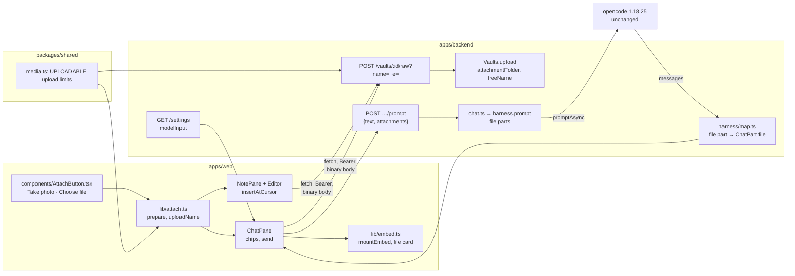
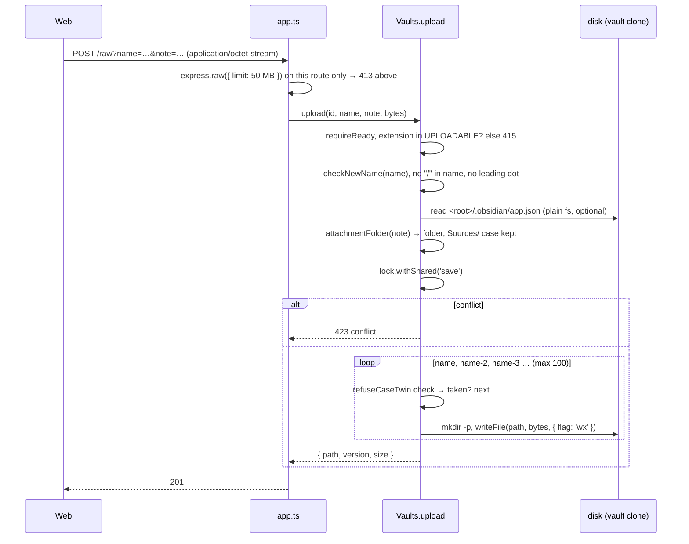
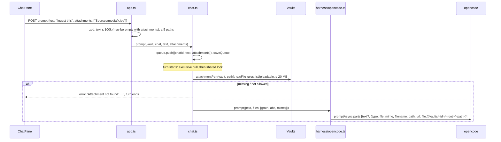

# Architecture: uploads and chat attachments

## Overview



Two flows share one upload route. The editor inserts an embed after the upload; the chat sends the uploaded paths with
the prompt. opencode does the rest: it reads the file, resizes images and drops what the model can't take.

## Verified facts

Checked on 2026-10-04 against the pinned versions. Paths in opencode are in `packages/opencode/src` at tag `v1.18.25`
(commit `cb7d8b2`).

| # | Fact | Evidence |
|---|---|---|
| F1 | `session.promptAsync` takes `parts: Array<TextPartInput \| FilePartInput \| …>`; a file part is `{ type: "file", mime, filename?, url, source? }`. | `node_modules/@opencode-ai/sdk` 1.18.25, `dist/v2/gen/types.gen.d.ts` lines 2111–2118 (`FilePartInput`) and 8660–8675 (`SessionPromptAsyncData`) |
| F2 | A `file:` URL with a mime other than `text/plain` or a directory: opencode reads the bytes from disk and stores the part as a `data:<mime>;base64,…` URL, keeping our `filename`. It does no directory check on that path itself, so the backend must check it. | `session/prompt.ts` 808 (`case "file:"`) to 970 (`Buffer.from(yield* fsys.readFile(filepath)…)` at 964) |
| F3 | Every `image/*` part then goes through `image.normalize`: scaled to at most 2000×2000 px and 5 MB base64, re-encoded as PNG or JPEG. Only `ResizerUnavailableError` is caught, so an image the decoder (photon) can't read, such as HEIC, fails the prompt. | `session/prompt.ts` 1011–1019; `image/image.ts` 10–12 (limits), 92 (`new_from_byteslice`) |
| F4 | A part the model can't read is replaced by the text `ERROR: Cannot read "<filename>" (this model does not support <image\|pdf> input). Inform the user.`. The turn goes on. | `provider/transform.ts` 10–16 (`mimeToModality`), 409–445 (`unsupportedParts`) |
| F5 | The model's input capabilities are in opencode's model list: `capabilities.input.{text, image, audio, video, pdf}`. | `types.gen.d.ts` 1650–1680 (`Model`); `config.providers()` already used by `OpencodeHarness.models()` |
| F6 | The `read` tool returns JPEG, PNG, GIF, WebP and PDF files as file attachments (whole file, base64), sniffing the type from the first bytes. Other binaries fail "Cannot read binary file". It extracts no text from PDFs. | `tool/read.ts` 19 (`SUPPORTED_IMAGE_MIMES`), 303–325, 328; `util/media.ts` (`sniffAttachmentMime`) |
| F7 | Tool-result images and PDFs reach the model as media content, or as an extra user message for providers that can't take media in tool results. | `session/message-v2.ts` 160–190, 296–305 |
| F8 | Production model `openrouter/z-ai/glm-5.3`: input `["text"]`. `anthropic/claude-sonnet-5`: `["text","image","pdf"]`. `openrouter/z-ai/glm-5.3-flash`: `["text","image","video"]`. Dev `ollama/qwen2.5:3b` is a custom model in `dev-ollama.json` with no `modalities`, so text only. | `https://models.dev/api.json`, fetched 2026-10-04; `deploy/opencode/opencode.json`, `deploy/opencode/dev-ollama.json` |
| F9 | iOS Safari since WebKit 275726@main (2024-03-05) transcodes HEIC to JPEG **only** when the accepted image types are an explicit list without HEIC. Before that, iOS transcoded unconditionally. `accept="image/*"` alone now delivers HEIC. | [WebKit bug 267277](https://bugs.webkit.org/show_bug.cgi?id=267277) "[iOS] Avoid transcoding images on file inputs unless the set of image types is explicitly restricted" |
| F10 | With an explicit list, Safari transcodes to the **first** listed type. Mixing a wildcard (`image/jpeg,image/*`) broke the conversion until a fix (2024-04-30); `image/heic` in the list makes Safari convert JPEG/PNG *to* HEIC. | [WebKit bug 292350](https://bugs.webkit.org/show_bug.cgi?id=292350), [WebKit bug 273444](https://bugs.webkit.org/show_bug.cgi?id=273444), [Apple forum 743049](https://developer.apple.com/forums/thread/743049) |
| F11 | `capture` asks for a new capture with the camera (`user` / `environment`); it is not Baseline; a browser without support shows the normal file picker. Supported in Safari on iOS since 6; not in desktop Safari, Chrome or Firefox. | [MDN: capture](https://developer.mozilla.org/en-US/docs/Web/HTML/Reference/Attributes/capture), [caniuse: html-media-capture](https://caniuse.com/html-media-capture) |
| F12 | Safari 17+ (desktop and iOS) decodes HEIC/HEIF images; Chrome and Firefox don't. | [caniuse: heif](https://caniuse.com/heif) |
| F13 | `express.json({ limit: '10mb' })` parses only `application/json` bodies; the API has no binary body parser. Caddy sets no `request_body` limit. | `apps/backend/src/app.ts`; `deploy/proxy/Caddyfile` |
| F14 | The queue of prompts is persisted in `config.json` (`saveQueue`), text only. | `apps/backend/src/chat.ts` (`prompt`, `saveQueue`) |
| F15 | `harness/map.ts` maps `text` (skipping `synthetic`), `reasoning` and `tool` parts; a `file` part falls to `default` and is dropped. | `apps/backend/src/harness/map.ts` 80–88 |

Not verified, checked by hand on a real iPhone (plan, last phase): the exact iOS menu without `capture`, the format
of a photo taken through `capture="environment"`, and Files-app HEIC picks with the explicit `accept` list. The
browser's photo preparation (below) turns any HEIC that still arrives into JPEG, so none of these blocks the design.

## Backend: the upload route

`POST /vaults/:id/raw?name=<file name>[&note=<note path>]`, body = the file's bytes, behind the bearer auth.



- **Body parsing:** `express.raw({ type: () => true, limit: MAX_UPLOAD_BYTES })` on this one route. The global
  `express.json` skips non-JSON bodies (F13), so the two don't collide. The body is buffered in memory: one user, at
  most 50 MB, acceptable. Streaming to a temp file was considered and left out (more code, a cleanup path).
- **Never overwrite:** `writeFile(…, { flag: 'wx' })` fails with `EEXIST` if a file appeared since the name check, and
  the loop takes the next suffix. Two uploads of `photo.jpg` at once both succeed with different names.
- **Case twins:** a name that differs from an existing one only in case counts as taken (next suffix), instead of the
  `409 exists-case` of `writeFile`. Folders are matched case-insensitively and the existing spelling is kept
  (`sources/media/`), the same idea as the attach preflight.
- **Errors** (`HttpError` JSON): `400 bad-name`, `413 too-large`, `415 not-uploadable` ("Only JPEG, PNG, GIF, WebP and
  PDF can be uploaded."), `423 conflict`, `400 bad-path` for a `note` outside the vault.
- **Version:** `versionOf(bytes)`, the same hash `GET /file` gives, so Delete works on the new file at once.
- **Watcher:** the write triggers `files-changed` like every write; the tree, the Changes list and the object-URL
  cache update on their own.
- **Not AI-touched:** `aiTouched` is untouched; a commit of only uploads has no agent trailer.

### Attachment folder

`Vaults.attachmentFolder(id, note?: string): string`:

1. No `note` → `Sources/media`.
2. Read `<vault root>/.obsidian/app.json` with plain `fs` (the raw route refuses dot paths; this is server-internal).
   Missing, unreadable or invalid JSON, or no string `attachmentFolderPath`, or `''` → `Sources/media`.
3. `/` → vault root. `./` → the note's folder. `./x` → `x` inside the note's folder. Anything else → that path from
   the vault root.
4. `normalizeRel` and a dot-segment check on the result; on a `PathError` → `Sources/media`.
5. The first segment `Sources` matches an existing folder case-insensitively.

No cache: it's one small file read per upload.

### Shared table

`packages/shared/src/media.ts` gains:

```ts
export const UPLOADABLE = ['jpg', 'jpeg', 'png', 'gif', 'webp', 'pdf'] as const;
export const MAX_UPLOAD_BYTES = 50 * 1024 * 1024;      // server cap, 413 above
export const WARN_UPLOAD_BYTES = 10 * 1024 * 1024;     // browser asks above
export const MAX_ATTACHMENT_BYTES = 20 * 1024 * 1024;  // per chat attachment
export const MAX_ATTACHMENTS = 5;                      // per prompt
export function isUploadable(path: string): boolean;
export function uploadMime(path: string): string;      // image/jpeg … application/pdf
```

The list is the intersection of what Obsidian shows, what browsers show and what opencode reads as an image or PDF
(F6). SVG, AVIF and BMP are left out because opencode's read tool and its resizer don't take them (F3, F6); HEIC
because photon can't decode it (F3).

## Web: picking and preparing a file

### `AttachButton`

One **+** button opens a small menu with two entries, each a hidden `<input type="file">`:

| Entry | Input | Why |
|---|---|---|
| **Take photo** | `accept="image/jpeg" capture="environment"` | Opens the back camera on a phone (F11). Shown everywhere: where `capture` isn't supported (desktop) it falls back to the normal file picker, so no device check is needed. |
| **Choose file** | `accept="image/jpeg,image/png,image/gif,image/webp,application/pdf"` | No wildcard and no `image/heic`, with JPEG first, so iOS converts HEIC library photos to JPEG (F9, F10). On iOS this picker also offers the camera, the library and Files. |

The editor shows the button only in Write mode with a note open, online and not in conflict. The composer shows it
online and not in conflict. Picking several files in the composer adds several chips (`multiple`, up to 5).

### `lib/attach.ts`

```ts
export function uploadName(file: File, fromCamera: boolean, now: Date): string;
export async function prepare(file: File): Promise<{ blob: Blob; name: string }>;
```

- **`uploadName`:** `YYYY-MM-DD-` + stem + `.` + lower-case extension. Stem: `photo-HHMMSS` from the camera, else the
  file's stem with `<>:"|?*\#^[]` and control characters replaced by `-`, runs of `-` collapsed, leading dots and
  trailing dots and spaces dropped, at most 80 characters; empty → `file`. A stem that already starts with a date is
  not prefixed twice. `.jpeg` stays `.jpeg`; a converted HEIC gets `.jpg`.
- **`prepare`:** JPEG and HEIC (by type or extension) are decoded with `createImageBitmap(file)` (EXIF orientation is
  applied by default), drawn on a canvas scaled to at most 2048 px on the long edge, and encoded with
  `canvas.toBlob('image/jpeg', 0.85)`. That drops all metadata. HEIC decodes in Safari 17+ (F12); in Chrome it
  fails, and the app says "HEIC photos can't be converted in this browser". PNG, GIF, WebP and PDF are passed through.
- **Size checks before sending:** over `MAX_UPLOAD_BYTES` → refused in the browser; over `WARN_UPLOAD_BYTES` →
  `confirm` with the size. A chat attachment over `MAX_ATTACHMENT_BYTES` is refused for the chat ("too large to send
  to the AI; attach it in a note instead").
- **Transport:** `api.upload(vault, name, note, blob)` = `fetch` `POST` with the Bearer header and
  `Content-Type: application/octet-stream`. No progress bar (fetch has no upload progress in Safari); the chip or the
  editor shows "Uploading…". No CSP change: `connect-src 'self'` covers the request, and a chip's thumbnail is a
  `blob:` URL, which `img-src` already allows.

## Web: the editor

After a `201`, `NotePane` asks the editor to insert the embed at the cursor:

- `EditorHandle.insertAtCursor(text)`: one CodeMirror transaction at the main selection's head. The embed goes on its
  own line (`\n![[name]]\n`, without doubling an existing line break), so the block widget shows below it.
- Embed text: `![[<basename>]]` if no other path in the file list has that basename, else `![[<vault path>]]`.
- The insert is a normal edit: autosave, drafts and stale saves work as today. The editor's file list learns the new
  path from `files-changed`; until then the embed resolves against the path returned by the upload (the store adds it
  to the list right away), so the image shows without a "missing" flash.
- The cursor position is read when the upload **starts** and mapped through later changes (`ChangeSet.mapPos`), so
  typing during the upload doesn't misplace the embed.

## Backend: prompts with attachments



- **`promptBody`:** `{ text: string (trim, ≤ 100 000), attachments?: string[] (≤ 5) }`, refined so that text or at
  least one attachment is present. The chat title for an empty text is the first attachment's file name.
- **Queue:** `Turn` gains `attachments?: string[]`; `saveQueue` persists them with the text. Bytes never enter
  `config.json` (F14).
- **Checks at turn start**, not at prompt time: the file may be discarded while the turn waits. `Vaults.rawFile`
  (no dot segment, no symlink, inside the vault root, exists, not a directory), `isUploadable`, and `stat` size ≤
  `MAX_ATTACHMENT_BYTES`. These checks are the only guard on the path, because opencode reads a `file:` URL without
  its own directory check (F2).
- **`PromptInput.files`:** `{ path; url; mime }[]`. `OpencodeHarness.prompt` appends one `FilePartInput` per file
  after the text part (the text part is left out when empty). `url` = `pathToFileURL(posix.join(dir, path))`, where
  `dir` is `chat.ts dir(vaultId)`, the vault root as opencode sees it (both containers mount `/vaults`). `filename` =
  the vault path, so the model and the chat history see where the file lives.
- **No mime from the client:** `uploadMime(path)` from the shared table.
- **`promptSync`** (commit message) never gets files.

## Backend: chat history and model input

- **Mapping:** a stored user `file` part (its `url` is a `data:` URL by then, F2) maps to a new
  `ChatPart { type: 'file'; id; path: filename; mime }`. The `data:` URL is never sent to the browser; it can be MBs.
  Synthetic text parts opencode adds ("Called the Read tool with …") are already skipped (F15). A file part without a
  `filename` maps to nothing.
- **Rendering:** `ChatPane` renders a user message's file parts above its text with `mountEmbed` (image →
  thumbnail through `/raw` and the object-URL cache; PDF → file card with Open). A deleted file shows the "missing"
  card.
- **Model input:** `Harness.models()` returns `{ id, input: { image, pdf } }[]` from `capabilities.input` (F5);
  `availableModels` keeps using the ids. `GET /settings` and `PATCH /settings` add
  `modelInput: { image: boolean; pdf: boolean } | null` for the current model (`null` when opencode is down or the
  model is unknown). The composer reads it from the settings it already loads:
  - chip of an image when `image` is false, or of a PDF when `pdf` is false: a warning line "`<model>` can't see
    images / PDFs: the AI only gets the file's path";
  - `null`: no warning.
- Nothing is filtered on our side: opencode replaces what the model can't read (F4), and the model tells the user.

## Security

- **Same auth, same path rules:** the upload route is behind the bearer token; names go through `checkNewName`,
  `normalizeRel` and the symlink check; dot segments and harness config are refused, so an upload can't plant
  `.opencode/`, `opencode.json` or a git hook.
- **Kind from the extension:** the upload stores bytes as given; `GET /raw` serves them with the media table's type and
  `nosniff` (unchanged). PDFs keep `Content-Disposition: attachment`.
- **No SVG upload:** keeps the one active image format out of the upload path.
- **Chat attachment paths are checked by the backend** (F2): an attacker-controlled path can't make opencode read
  `/vaults/<other>` or `.env`.
- **Risk statement in security.md, replacing "The LLM provider sees every note the AI reads":** "The LLM provider sees
  every note, image and PDF the AI reads, and every image or PDF the user attaches to a prompt. Photos are re-encoded
  in the browser, which drops their location metadata; PNGs and PDFs are sent as they are."
- **Storage:** opencode keeps attachments in its session database (base64, after its resize). Deleting the chat
  deletes them.

## Decisions and tradeoffs

| Decision | Chosen | Rejected because |
|---|---|---|
| Upload transport | `POST /raw?name=&note=` with a binary body | JSON with base64: the 10 MB JSON limit, a third more bytes, and a parse of the whole string. Multipart: needs a parser dependency (`multer`/`busboy`) for one file. `PUT /raw?path=`: PUT means "store at this path", but the server picks the final name and folder. |
| Who picks folder and name suffix | Server (folder from `app.json`, `-2` on collisions, `wx` write) | Client: races between two uploads, and the client can't read `.obsidian/` (raw route refuses dot paths). |
| Chat attachments | Upload to `Sources/media/` first, send the path, opencode reads the `file:` URL | base64 in the prompt: over the JSON limit for PDFs, bytes in the persisted queue, and the file is gone after the chat. Not storing chat photos: the AI can't link to or re-read them, a PDF can't be ingested. |
| Chat attachment folder | Always `Sources/media/` | Obsidian's attachment folder: chat files are sources to ingest, and `Sources/` is where ingest skills look. |
| HEIC | iOS converts (explicit `accept` list), the browser converts what still arrives (Safari 17+), server refuses HEIC (415) | Server-side conversion with `sharp`/libvips: a native dependency (libvips) per architecture in the backend image, with its own security updates, for files that iOS already converts. `heic2any`-style WASM in the browser: ~1 MB for a path that Safari covers natively. |
| Photo resizing | Browser canvas, 2048 px, JPEG 0.85, JPEG/HEIC only | Server: needs `sharp` too, and the full photo crosses the phone's network first. No resize: 3–5 MB per photo in git forever, plus GPS location in git and at the provider. opencode's own resize only shrinks what the model sees, not what the vault stores. |
| PNG, GIF, WebP | Uploaded unchanged | Re-encoding: screenshots get JPEG artifacts, GIFs lose animation; these rarely carry GPS. |
| Size limits | 50 MB cap, warning above 10 MB, 20 MB per chat attachment | No cap: a 500 MB video-sized upload into git. Lower cap (10 MB): scanned PDFs of books are often 20–40 MB. The 20 MB chat cap keeps the base64 request (a third larger) under request limits such as Anthropic's 32 MB. |
| Formats | JPEG, PNG, GIF, WebP, PDF | Any file: the vault isn't a file store, and the AI can't read the rest (F6). Video and audio: large, and no model path; a later change. |
| Text-only model | Warn on the chip, send anyway; opencode substitutes an error note (F4) | Block the attachment: the file is still useful in the vault and the model can say what to do. Strip the part on our side: duplicates opencode's capability logic. |
| Model capability source | opencode's `capabilities.input` via `config.providers` | A list of our own: goes stale, and ADR 0002 keeps provider knowledge in opencode. |
| Camera entry | Separate **Take photo** input with `capture` | Only `capture` on the one input: hides the photo library and Files on iOS. No `capture`: one more tap to the camera, the main use. |
| Embed text | `![[basename]]`, full path only when ambiguous | Always the full path: longer than Obsidian writes. Markdown links (`useMarkdownLinks`): not honored in this change; the vaults use wikilinks. |
| Upload from the editor in Read mode | Not offered | Read mode has no cursor; appending at the end surprises. |

## Risks

- **iOS behavior drifts:** WebKit changed HEIC handling twice since 2024 (F9, F10). The browser conversion and the 415
  keep the vault safe if it changes again; the manual device check catches it.
- **Memory on old phones:** a canvas of 2048 px is about 16 MB of pixels; decoding a 48-megapixel photo first takes
  ~190 MB briefly. `createImageBitmap` with `resizeWidth`/`resizeHeight` lowers that where supported (Safari 17+,
  Chrome); the plan measures on the iPhone project.
- **Text-only production model:** chat attachments are inert until the model changes (proposal, Risks).
- **Repo growth:** bounded per file, not per vault.
