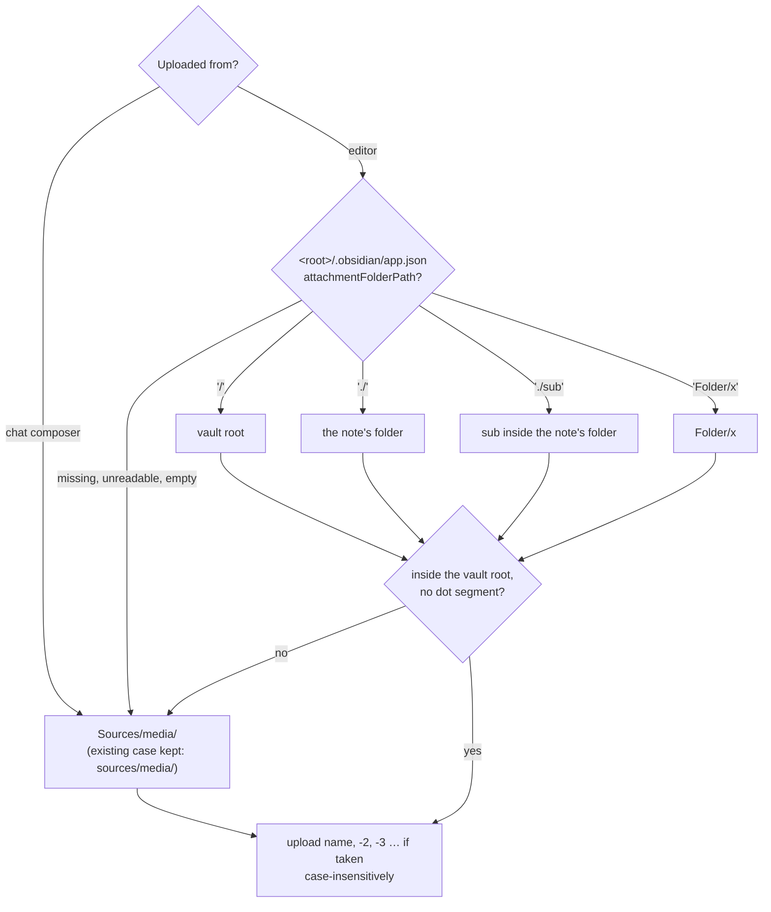
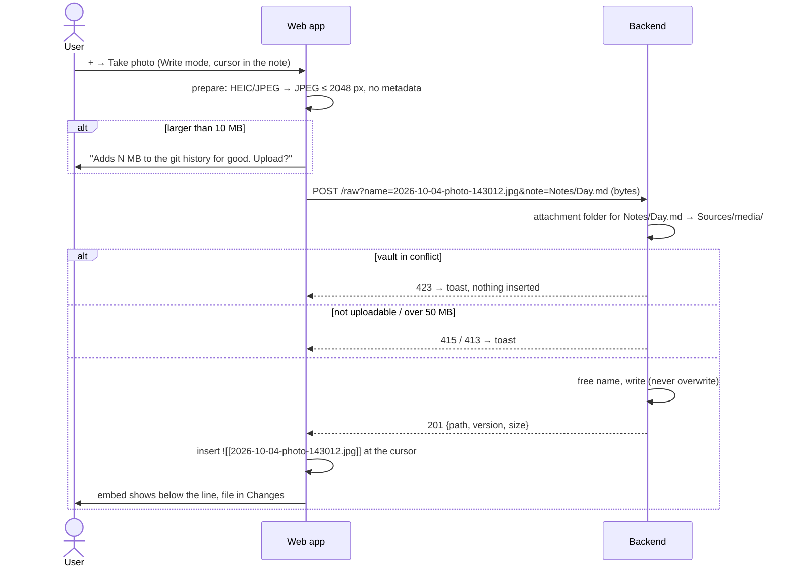
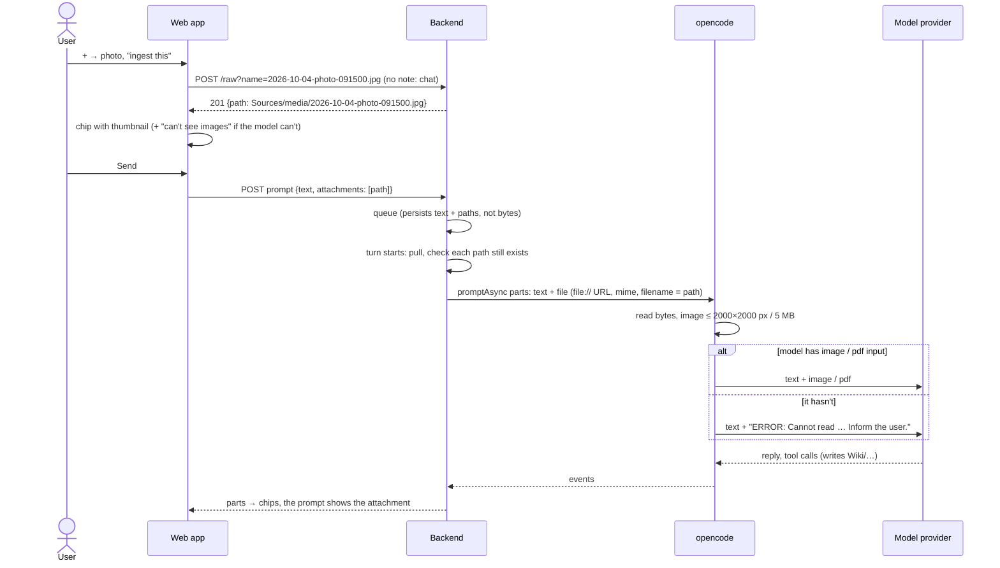

# Domain: uploads and chat attachments

## New and changed terms

| Term | Meaning | Code |
|---|---|---|
| **Upload** *(new)* | The user putting a file from the device into the vault: a photo or a PDF. Creates a new vault file; never overwrites one. The result is an uncommitted change. *Avoid:* import, add file, attach (that's the button). | `POST /vaults/:id/raw?name=&note=`, `Vaults.upload` |
| **Attach button** *(new)* | The **+** button in the editor's toolbar (Write mode) and in the chat composer. Offers **Take photo** and **Choose file**; both end in an upload. | web `AttachButton` |
| **Uploadable file** *(new)* | A file whose extension is `jpg`, `jpeg`, `png`, `gif`, `webp` or `pdf`. Only these can be uploaded. They are the formats opencode reads as images or PDFs and that model providers accept. HEIC, SVG, video and audio are not uploadable. | shared `UPLOADABLE` |
| **Attachment folder** *(new)* | Where an upload from the editor lands: Obsidian's `attachmentFolderPath` from `<vault root>/.obsidian/app.json` if set, else `Sources/media/`. Uploads from the chat always land in `Sources/media/`. | `Vaults.attachmentFolder` |
| **Upload name** *(new)* | The file name an upload gets: `YYYY-MM-DD-<stem>.<ext>`, the stem from the device's file name, or `photo-HHMMSS` for a camera photo. Characters that break file names or wikilinks become `-`. A taken name gets `-2`, `-3`, …. | web `lib/attach.ts` `uploadName`; server `freeName` |
| **Photo preparation** *(new)* | What the browser does to a JPEG or HEIC before upload: decode, scale to at most 2048 px on the long edge, re-encode as JPEG (quality 0.85). Drops the metadata (GPS location, camera). Other formats are uploaded unchanged. | web `lib/attach.ts` `prepare` |
| **Upload cap** *(new)* | 50 MB per file. The server refuses bigger bodies (413). | `MAX_UPLOAD_BYTES` |
| **Growth warning** *(new)* | The question before an upload over 10 MB: the file stays in the git history for good, even if deleted later. | `WARN_UPLOAD_BYTES` |
| **Chat attachment** *(new)* | A vault file sent with a prompt, so the model receives its content (image or PDF), not only its path. Always uploaded first; the prompt carries its vault path. Up to 5 per prompt, each at most 20 MB. "Attachment" names the relation to a prompt; the file itself is still a vault file (a media file or a binary file). *Avoid:* attachment for a file in general. | `PromptBody.attachments`, harness `FilePartInput` |
| **Model input** *(new)* | What the chat's model can read besides text: images, PDFs, both or neither. Comes from opencode's model list. A chat attachment the model can't read reaches it only as a note that it couldn't read the file. | `SettingsView.modelInput` |
| **Media file** *(changed)* | Unchanged meaning. "Shown, never edited" stays; it may now also be **created** by an upload. | |
| **Raw file** *(changed)* | Was read-only. `GET /raw` still reads; `POST /raw` creates one by upload. Same path rules. | `GET`/`POST /vaults/:id/raw` |

`CONTEXT.md` gets **Upload**, **Chat attachment** and **Attachment folder** at archive time. The "*Avoid:*
attachment" notes on **Media file** and **Embed** stay: they keep "attachment" from meaning "a file".

## Where an upload lands

- The four `attachmentFolderPath` forms are Obsidian's: `/` vault root, `./` same folder as the note, `./sub` a
  subfolder of the note's folder, anything else a fixed folder from the vault root.
- `Sources/` is found case-insensitively, as the attach preflight does: a vault with `sources/` gets
  `sources/media/`. Creating `Sources/` next to `sources/` would be a case twin, which the vault refuses.
- The user's real vaults set no `attachmentFolderPath` (their `app.json` has only `userIgnoreFilters: ["Sources/"]`
  and display settings), and the demo vault keeps its images in `Sources/media/`.
- Why the chat ignores the Obsidian setting: a file sent to the AI is a source to ingest. `Sources/` is where sources
  live, and where the ingest skills look.

## Upload from the editor

The embed text is the basename when no other vault file has that basename, else the vault path. That is Obsidian's
default ("shortest path when possible"), and it resolves with the existing embed rules.

## Send a chat attachment

- A chat attachment is a vault file before the prompt is sent. That answers the open question in the issue ("should
  chat photos be stored in the vault at all?") with yes: the queue survives a restart without holding bytes, the AI
  can read the file again in later turns and link to it from wiki pages, and a PDF in `Sources/` stays ingestible.
  The cost: every chat photo is an uncommitted change. The user discards it if it was only for the question.
- A path that vanished before the turn starts (discarded, deleted) fails the turn with "Attachment not found:
  `<path>`", like a failed pull.
- The sent prompt shows its attachments from the stored chat (thumbnail through `/raw`, file card for a PDF). A file
  deleted later shows the existing "missing" file card.

## Rules

Changed rules (replacing the system's wording):

- ~~**Media is read-only** for the user and the AI; there is no upload or paste.~~ → **The user may upload images and
  PDFs** (uploadable files, at most 50 MB). An upload creates a new file and never overwrites one. Existing vault
  files can't be replaced or edited through the app if they aren't notes. The AI creates no binary files. Pasting and
  drag-and-drop of images are not built. Offline, nothing can be uploaded.
- **Conflict blocks writes:** saves, deletes, discards, commits **and uploads** are refused (423). So no chat
  attachment can be added during a conflict; a turn during a conflict runs read-only as before.
- **New file names** (unchanged list) apply to uploads too: no `<>:"|?*\` or control characters, no Windows-reserved
  names, no trailing dot or space, no case twin, no harness config. On top, upload names avoid `#^[]|` (they break
  wikilinks) and leading dots; the browser replaces them, the server refuses what's left.
- **Uploads are uncommitted changes** of the user, never AI-touched. They are recorded only by the user's commit
  (ADR 0001).
- **Kind from the extension only** (unchanged). The server checks the extension, not the bytes. A `.jpg` holding
  something else is stored and served as `image/jpeg` with `nosniff`, as today.
- **A chat attachment is a path in the vault root.** The backend checks it with the raw-file rules before it turns it
  into a file part; opencode reads the file it's given without its own directory check.

## Actors (changed rows)

| Actor | What changes |
|---|---|
| **User** | Can also upload images and PDFs, and attach them to prompts. |
| **AI** | Unchanged tools. Receives attached images and PDFs as message content when its model supports them. |
| **LLM provider** | Sees the prompts, the notes the AI reads, **and every image or PDF the user attaches or the AI reads**. |
| **Device (iOS)** | Converts HEIC photos to JPEG when the picker's accepted types are an explicit list without HEIC. |
