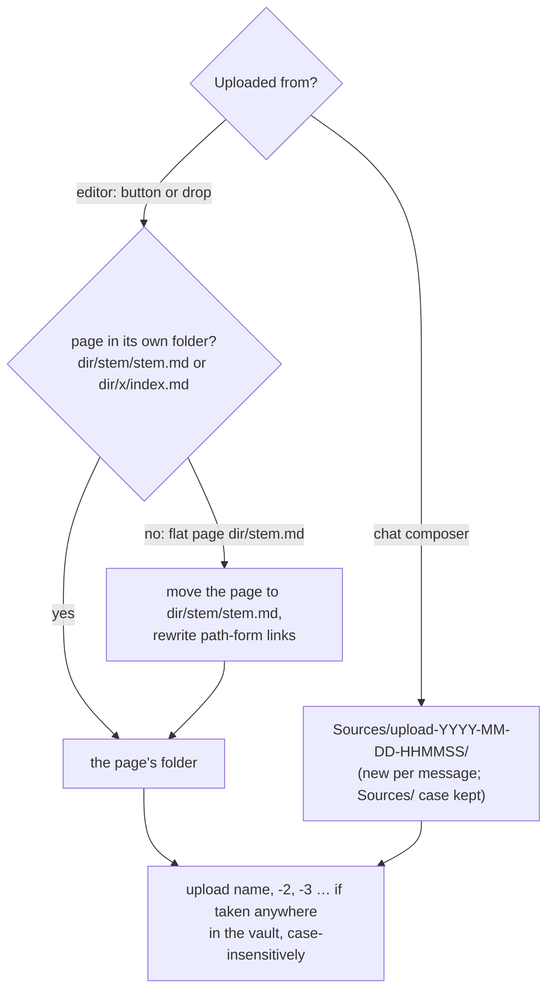
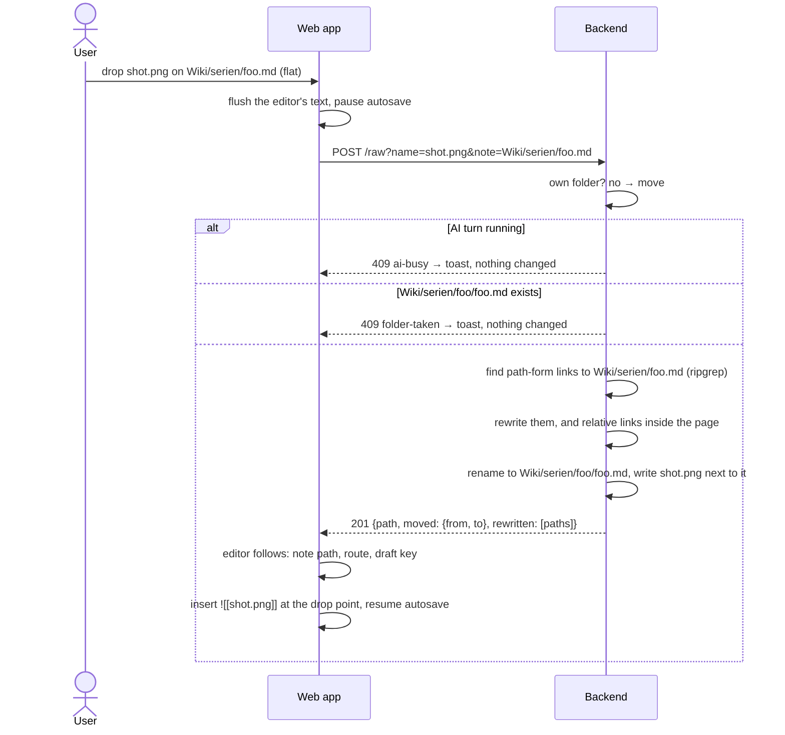
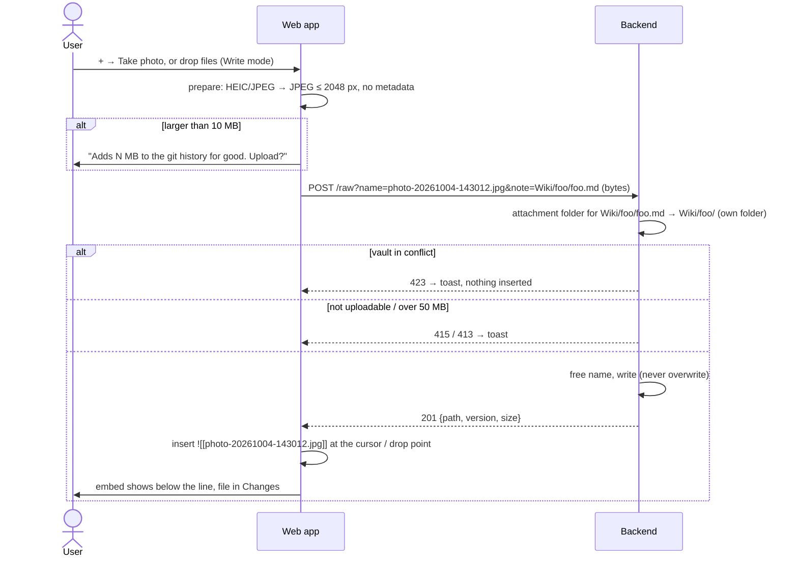
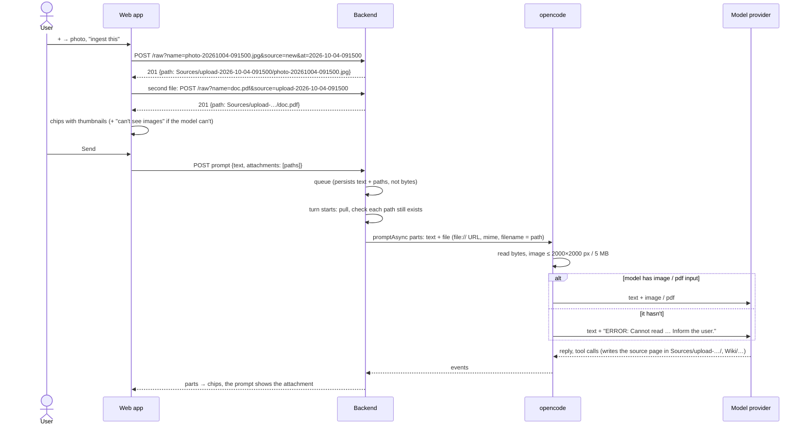

# Domain: uploads and chat attachments

## New and changed terms

| Term | Meaning | Code |
|---|---|---|
| **Upload** *(new)* | The user putting a file from the device into the vault: a photo or a PDF. It creates a new vault file and never overwrites one. The result is an uncommitted change. *Avoid:* import, add file, attach (that's the button). | `POST /vaults/:id/raw?name=&note=`, `Vaults.upload` |
| **Attach button** *(new)* | The **+** button in the editor's toolbar (Write mode) and in the chat composer. It offers **Take photo** and **Choose file**, and both end in an upload. | web `AttachButton` |
| **Drop** *(new)* | Dragging one or more files from the device's file system onto the note in Write mode. Each file becomes an upload, embedded at the drop point. | web `Editor` drop handler |
| **Uploadable file** *(new)* | A file whose extension is `jpg`, `jpeg`, `png`, `gif`, `webp` or `pdf`. Only these can be uploaded. They are the formats opencode reads as images or PDFs and that model providers accept. HEIC, SVG, video and audio are not uploadable. | shared `UPLOADABLE` |
| **Own folder** *(new)* | A folder that belongs to exactly one page and holds that page's attachments. A page is **in its own folder** when its folder carries its name (`Wiki/foo/foo.md`, compared case-insensitively) or when it is the folder's `index.md` (`Sources/x/index.md`). A page that isn't is **flat** (`Wiki/foo.md`). | `Vaults.ownFolder` |
| **Move into own folder** *(new)* | What the app does to a flat page before its first attachment lands: `Wiki/foo.md` → `Wiki/foo/foo.md`, plus the link rewrite. It is the only move the app makes. *Avoid:* rename (no general rename exists). | `Vaults.moveIntoOwnFolder` |
| **Path-form link** *(new)* | A link that names a folder on the way to its target: `[[serien/foo]]`, `[[Wiki/serien/foo.md\|Foo]]`, `[Foo](../serien/foo.md)`, ``. It is the opposite of a **bare link** (`[[foo]]`), which resolves by name alone. A move breaks path-form links to the moved page in Obsidian, so the app rewrites them. Bare links keep resolving. | `rewriteLinks` |
| **Attachment folder** *(changed)* | Where an upload from the editor lands: always the page's own folder. Obsidian's attachment-location setting is not read. Uploads from the chat land in a new source folder. | `Vaults.attachmentFolder` |
| **Source folder (upload)** *(new)* | The folder a chat message's attachments go into: `Sources/upload-YYYY-MM-DD-HHMMSS/`, named after the device's local time of the message's first upload, with `-2`, `-3` … if the name is taken. One per message. The AI writes the source page into it when it ingests; its name (`index.md` or `<folder>.md`) is up to the vault's ingest skill. | `Vaults.upload` with `source` |
| **Embed** *(unchanged)* | An inserted embed is always `![[name]]`. Obsidian's "Use Wikilinks" setting is not read. | web `NotePane` insert |
| **Upload name** *(changed)* | The file name an upload gets: the device's file name, cleaned, or `photo-YYYYMMDD-HHMMSS.jpg` for a camera photo. There is no date prefix any more. Characters that break file names or wikilinks become `-`. A name taken anywhere in the vault (case-insensitively) gets `-2`, `-3`, …, so the bare `![[name]]` is unambiguous. | web `lib/attach.ts` `uploadName`; server `freeName` |
| **Photo preparation** *(new)* | What the browser does to a JPEG or HEIC before upload: decode, scale to at most 2048 px on the long edge, and re-encode as JPEG (quality 0.85). This drops the metadata (GPS location, camera). Other formats are uploaded unchanged. | web `lib/attach.ts` `prepare` |
| **Upload cap** *(new)* | 50 MB per file. The server refuses bigger bodies (413). | `MAX_UPLOAD_BYTES` |
| **Growth warning** *(new)* | The question asked before an upload over 10 MB: the file stays in the git history for good, even if it is deleted later. | `WARN_UPLOAD_BYTES` |
| **Chat attachment** *(new)* | A vault file sent with a prompt, so the model receives its content (image or PDF), not only its path. It is always uploaded first, and the prompt carries its vault path. Up to 5 per prompt, each at most 20 MB. "Attachment" names the relation to a prompt; the file itself is still a vault file (a media file or a binary file). *Avoid:* attachment for a file in general. | `PromptBody.attachments`, harness `FilePartInput` |
| **Model input** *(new)* | What the chat's model can read besides text: images, PDFs, both or neither. It comes from opencode's model list. A chat attachment the model can't read reaches it only as a note that it couldn't read the file. | `SettingsView.modelInput` |
| **Media file** *(changed)* | The meaning is unchanged: shown, never edited. It may now also be **created** by an upload. | |
| **Raw file** *(changed)* | Was read-only. `GET /raw` still reads, and `POST /raw` creates one by upload. Same path rules. | `GET`/`POST /vaults/:id/raw` |

At archive time, `CONTEXT.md` gets **Upload**, **Own folder**, **Path-form link** and **Chat attachment**. The
"*Avoid:* attachment" notes on **Media file** and **Embed** stay, because they keep "attachment" from meaning "a file".

## Where an upload lands

- **Obsidian's settings are not read** (decided 2026-10-04). The vaults ignore `.obsidian/` in git, so the app's
  clones never see `app.json`. The user's Obsidian is set to "Same folder as current file" since 2026-10-04, which
  agrees with the own-folder rule: a page already in its own folder gets the file next to it in both tools. A flat
  page is moved first by the app, which Obsidian doesn't do but doesn't contradict: afterwards Obsidian also puts
  that page's images in its own folder.
- `Sources/` is found case-insensitively, as the attach preflight does: a vault with `sources/` gets
  `sources/upload-…/`. Creating `Sources/` next to `sources/` would be a case twin, which the vault refuses.
- The vaults already keep pages with images in their own folders
  (`Wiki/korsika-unterkunft-2026/korsika-unterkunft-2026.md` and five `.jpeg` files next to it).
- Why the chat makes a source folder: a file sent to the AI is a source to ingest. `Sources/<slug>/` with a source
  page is how the vaults hold sources (`mail-…`, `insta-…`), and it is where ingest skills look. The source page is
  mostly `<slug>/<slug>.md` (1 458 + 82 in the two vaults), sometimes `<slug>/index.md` (264 + 31); both count as
  the page's own folder.

## Move a page into its own folder

What the rewrite changes, for a page moved from `Wiki/serien/foo.md` to `Wiki/serien/foo/foo.md`:

| Where | Before | After |
|---|---|---|
| any page | `[[serien/foo]]`, `[[serien/foo\|Foo]]`, `[[serien/foo#Plot]]` | `[[serien/foo/foo]]`, `[[serien/foo/foo\|Foo]]`, `[[serien/foo/foo#Plot]]` |
| any page | `[[Wiki/serien/foo.md]]` | `[[Wiki/serien/foo/foo.md]]` |
| `Wiki/x.md` | `[Foo](serien/foo.md)` | `[Foo](serien/foo/foo.md)` |
| any page | `[[foo]]` (bare) | unchanged: still resolves by name |
| the moved page | ``, `[x](../other.md)` | ``, `[x](../../other.md)`: one level deeper |
| the moved page | `![[a.png]]`, `[[other]]` | unchanged |

- The rewrite looks only at links that resolve to the moved page **before** the move. A path-form link to another
  page that happens to share the name is left alone.
- Text inside code spans and fenced code blocks is not rewritten.
- Images the page already embeds are not moved. Bare embeds find them by name, and relative ones get the `../`
  above.

## Upload from the editor

- **The embed text is the name alone**, `![[photo.jpg]]`: the file is in the note's own folder, and its name is
  unique in the vault, so every tool resolves it.
- **Undo** of the inserted embed removes the text only; the file and a move stay.
- **Several files** from one drop or pick upload one after another, in order. If the first moves the page, the rest
  name the moved page.

## Send a chat attachment

- **A chat attachment is a vault file before the prompt is sent.** That answers the open question in the issue
  ("should chat photos be stored in the vault at all?") with yes, for three reasons:
  - the queue survives a restart without holding bytes;
  - the AI can read the file again in later turns and link to it from wiki pages;
  - a PDF in `Sources/` stays ingestible.

  The cost: every chat photo is an uncommitted change. The user discards it if it was only for the question.
- **The first file of a message makes the folder** (`source=new`), and the following ones join it
  (`source=<folder name>`). The server accepts a folder name only if it exists, sits directly in `Sources/` and
  starts with `upload-`.
- **Removing a chip deletes its file** (`DELETE /file` with the version from the upload), and the folder too once
  it is empty. The file is new and uncommitted, so nothing is lost, and no orphan is left for a later ingest.
- **Unsent chips survive a reload:** the composer remembers them per chat on the device, and drops one whose file is
  gone.
- **A vanished path fails the turn.** If a path was discarded or deleted before the turn starts, the turn fails with
  "Attachment not found: `<path>`", like a failed pull.
- **The sent prompt shows its attachments** from the stored chat: a thumbnail through `/raw`, or a file card for a
  PDF. A file deleted later shows the existing "missing" file card.

## Rules

Changed rules (replacing the system's wording):

- ~~**Media is read-only** for the user and the AI; there is no upload or paste.~~ → **The user may upload images and
  PDFs** (uploadable files, at most 50 MB), with the button or by dropping them on the note:
  - An upload creates a new file and never overwrites one.
  - Existing vault files that aren't notes can't be replaced or edited through the app.
  - The AI creates no binary files.
  - Pasting images is not built.
  - Offline, nothing can be uploaded.
- **A page with attachments lives in its own folder:**
  - The first editor upload to a flat page moves it there.
  - Path-form links to it, and relative links inside it, are rewritten in the same step.
  - The move is refused while an AI turn runs, or when the target `<stem>/<stem>.md` exists. A refused move uploads
    nothing.
  - The app moves pages only in this case. There is no general rename.
- **Obsidian's settings are not read:** no `attachmentFolderPath`, no `useMarkdownLinks`. Uploads always go to the
  own folder and are embedded as `![[name]]`.
- **Conflict blocks writes:** saves, deletes, discards, commits, **uploads and moves** are refused (423). So no chat
  attachment can be added during a conflict. A turn during a conflict runs read-only as before.
- **New file names** (unchanged list) apply to uploads and moved pages too:
  - no `<>:"|?*\` or control characters;
  - no Windows-reserved names;
  - no trailing dot or space;
  - no case twin;
  - no harness config.

  On top, upload names avoid `#^[]|` (they break wikilinks) and leading dots. The browser replaces them, and the
  server refuses what's left.
- **Uploads, moves and rewritten links are the user's uncommitted changes**, never AI-touched. A moved page that was
  AI-touched keeps that mark under its new path. The changes are recorded only by the user's commit (ADR 0001).
- **Kind from the extension only** (unchanged). The server checks the extension, not the bytes. A `.jpg` holding
  something else is stored and served as `image/jpeg` with `nosniff`, as today.
- **A chat attachment is a path in the vault root.** The backend checks it with the raw-file rules before it turns
  it into a file part. opencode reads the file it's given without its own directory check.

## Actors (changed rows)

| Actor | What changes |
|---|---|
| **User** | Can also upload images and PDFs (button or drop), and attach them to prompts. Their first upload to a flat page moves it into its own folder. |
| **AI** | Unchanged tools. Receives attached images and PDFs as message content when its model supports them. Writes the source page into the chat's upload folder when it ingests. |
| **LLM provider** | Sees the prompts, the notes the AI reads, **and every image or PDF the user attaches or the AI reads**. |
| **Device (iOS)** | Converts HEIC photos to JPEG when the picker's accepted types are an explicit list without HEIC. |
| **Obsidian** | Unchanged. Its settings are not read; the user's "Same folder as current file" agrees with the own-folder rule. |
