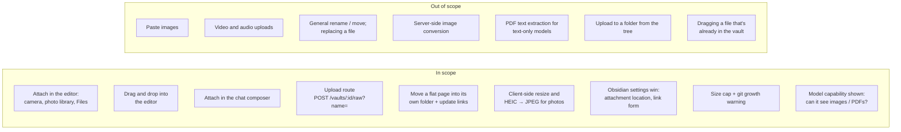
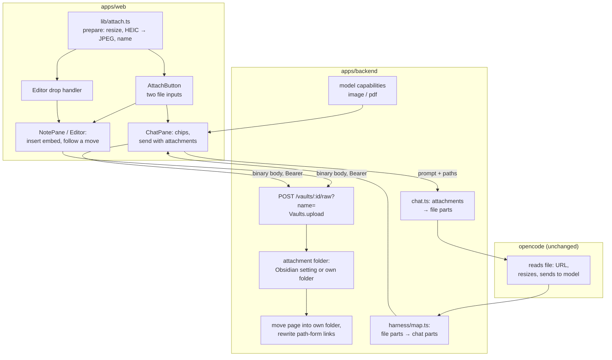

# Proposal: attach photos and PDFs

Covers issue [#87](https://github.com/tillg/karpathy.app/issues/87) "Attach photos and PDFs (camera → raw/, chat
attachments)" and [feature report §24](../../research/features/feature-report.md#24-attach-photos-and-pdfs-camera--raw-chat-attachments).

## What

A photo or a PDF from the device goes into the vault **next to the page that uses it**. The page then embeds it by
its bare file name (`![[hello.jpg]]`), so nobody has to think about paths. There are three ways in:

1. **Attach in the editor** (Write mode). Take a photo or pick a file. The app uploads it into the page's folder and
   inserts the embed at the cursor. The embed shows at once, through the media embeds that already exist.
2. **Drag and drop into the editor** (Mac, and any browser with drag and drop). Drop one or more images or PDFs from
   Finder onto the note. Each file is uploaded the same way and embedded where it was dropped.
3. **Attach in the chat composer.** Take a photo or pick a file, type "ingest this" (or nothing) and send. The app
   uploads the file into a new source folder in `Sources/`. Then the prompt goes to the AI with the file attached,
   so a model that can see images or PDFs reads it directly. The AI writes the source page next to the file.

**A page with attachments lives in its own folder.** The folder has the page's name, and so does the `.md` file in
it. This is how the vaults already hold pages with images: `Wiki/werkbank-frechen/werkbank-frechen.md` sits next to
`werkbank-v2-staender-seitenansicht.png`. Sources follow the same idea as `Sources/<slug>/index.md`. So when a flat
page (`Wiki/foo.md`) gets its first attachment, the app first **moves it into its own folder**
(`Wiki/foo/foo.md`). Links to it that name its path are updated, so they keep working in Obsidian. A page that
already sits in its own folder stays where it is.

If a vault sets Obsidian's **Default location for new attachments** to anything other than "Same folder as current
file", that setting wins: the app puts the file where Obsidian would and moves nothing. "Same folder as current
file" means the folder rule above. The same goes for Obsidian's **Use Wikilinks** setting. The vaults get the folder
rule and `![[name]]` embeds, the form every existing page uses. A vault that
switches to Markdown links gets `` instead.

Every uploaded file, moved page and updated link is an **uncommitted change** like any other. It reaches GitHub
(and Obsidian) only when the user commits ([ADR 0001](../../../docs/adr/0001-user-triggered-commits.md)). Discard
undoes it.

## Why

- The phone camera becomes a capture device for the wiki: a whiteboard after a meeting, a book page, a slide at a
  talk. Today that needs a laptop and Obsidian.
- On the Mac, dragging a screenshot onto a note is the fastest way to illustrate it, as in Obsidian.
- PDFs downloaded on the phone have no way into `Sources/` from the app.
- It is the write side of the media embeds that were just built. Pages written in the app then look the same in
  Obsidian, and they keep the folder layout the vaults already use.

## How Obsidian handles images

Checked against [obsidian.md/help/attachments](https://obsidian.md/help/attachments),
[obsidian.md/help/settings](https://obsidian.md/help/settings), [obsidian.md/help/links](https://obsidian.md/help/links)
and `obsidian.d.ts` on 2026-10-04.

| | Obsidian | This change |
|---|---|---|
| Where a new attachment goes | Setting "Default location for new attachments": vault folder, a fixed folder, the same folder as the note, or a subfolder under the note's folder (created on demand). | That setting if the vault sets it. Otherwise the page's own folder, moving the page into one first. |
| Paste an image | "Obsidian creates a file with the pasted content in the default attachment location." | Not built (see Scope). |
| Drag a file from the file system | "Obsidian copies the file to the default attachment location and embeds it in the note." | The same, into the folder above. |
| Embed text | "Use Wikilinks" on → `![[image.png]]`, off → Markdown ``. Spaces in Markdown links are written as `%20`. "New link format": shortest path when possible, relative, or absolute. | The same switch. The file sits next to the page, so the name alone is enough in both forms. |
| Name collisions | `getAvailablePathForAttachment` "dedupes the filename if the destination filename already exists". | `-2`, `-3`, … before the extension. An upload never overwrites a file. |
| Moving a note | Never moves a note by itself. "Automatically update internal links" rewrites links when the user renames or moves one. | Moves a page into its own folder on its first attachment, and updates path-form links to it. |
| Formats shown | avif, bmp, gif, jpeg, jpg, png, svg, webp (and PDF). No HEIC. | Uploads accept jpg, jpeg, png, gif, webp and pdf. HEIC becomes JPEG. |
| Resizing | Not documented. | Photos are scaled down in the browser before upload (see below). |

The research could not confirm these points:

- the `app.json` values (`attachmentFolderPath` `/`, `./`, `./sub`, `Folder`; `useMarkdownLinks`);
- the default when unset (probably the vault root);
- the "Pasted image …" naming;
- whether Obsidian resolves a path-form link (`[[serien/foo]]`) after its note moved to `serien/foo/foo.md`.

The plan treats that last one as "no", which is why the move rewrites those links.

**Both tools now use the same rule.** Until 2026-10-04 both vaults left the attachment location unset, so Obsidian's
own paste and drop put images at the vault root. Since then, both are set to "Same folder as current file"
(`attachmentFolderPath: "./"` in the local `.obsidian/app.json`). The app treats exactly that setting as the
own-folder rule:

- a page in its own folder gets the file next to it, in both tools;
- a flat page is moved into its own folder first by the app, while Obsidian leaves it flat and puts the file next
  to it.

The vaults gitignore `.obsidian/`, so the app's clones see no `app.json` at all and use the own-folder rule anyway.

## This reverses three documented rules

The system description says today:

- [domain.md › Rules](../../system/domain.md#rules-and-constraints): "**Media is read-only** for the user and the AI;
  there is no upload or paste."
- [functional.md › Inputs](../../system/functional.md): "No uploads (also no pasting images), exports, e-mail or push
  notifications."
- The app has no rename or move. A page keeps its path until someone moves it outside the app.

This change lifts all three for the **user**:

- the user may add images and PDFs to the vault;
- the app may move a page into its own folder when it gets its first attachment.

Existing media files stay read-only: no editing, no replacing, no rename. A general rename or move of pages is still
not built. The AI still can't create binary files, because its tools write text only.

## Scope

Pasting an image is noticed but not added. It would be the same handler as the drop, so it is a small follow-up.

### Decisions visible to the user

- **Formats:** JPEG, PNG, GIF, WebP and PDF. These are the formats opencode and the model providers accept. HEIC
  photos from an iPhone arrive as JPEG (iOS converts them, or the app does). Anything else is refused with a plain
  message.
- **Where files land:**
  - **From the editor (button or drop):**
    - If the vault sets Obsidian's attachment location, the file goes there.
    - Otherwise it goes into the page's own folder:
      - `Wiki/foo/foo.md` → `Wiki/foo/`;
      - `Sources/x/index.md` → `Sources/x/`;
      - `Wiki/foo.md` → moved to `Wiki/foo/foo.md` first, then `Wiki/foo/`.
  - **From the chat:** a new source folder `Sources/upload-YYYY-MM-DD-<name>/`, one per message. This follows the
    vaults' `mail-…` and `insta-…` pattern. All files of one message share that folder. The AI writes the source page
    (`index.md`) into it when it ingests.
- **Moving a page into its own folder:**
  - It happens once, on the first attachment, and only without an Obsidian attachment location.
  - The editor stays on the page, and the address bar shows the new path.
  - Links that name the page's path (`[[serien/foo]]`, `[x](../serien/foo.md)`) are rewritten across the vault.
    Links by bare name (`[[foo]]`) already keep working, so they stay as they are.
  - The rewritten pages show up in Changes, together with the move. The move shows as the old path deleted and the
    new one added, until the commit.
  - Refused in two cases, and the file isn't uploaded:
    - while an AI turn runs ("The AI is working. Attach again when it's done."), so a running turn can't recreate
      the old path;
    - when `Wiki/foo/foo.md` already exists.
- **Names:** the device's file name, cleaned. Characters that break file names or wikilinks become `-`. A camera
  photo is `photo-YYYYMMDD-HHMMSS.jpg`. There's no date prefix, because the page's folder already says what the file
  belongs to. A taken name gets `-2`, `-3`, …; an upload never overwrites a file.
- **Photos are made smaller before upload:** at most 2048 px on the long edge, JPEG quality 0.85. That keeps a
  12-megapixel photo near 0.5–1 MB instead of 3–5 MB. It also **drops the photo's metadata (GPS location)**, which
  would otherwise go into git and to the model provider. PNG, GIF and WebP are uploaded as they are: screenshots stay
  sharp, and GIFs keep their animation.
- **Size:** at most **50 MB** per file, the same as the preview limit (GitHub warns about files over 50 MB). Above
  **10 MB** the app asks first: "This adds 23 MB to the vault's git history for good, even if you delete it later.
  Upload anyway?"
- **The picker:** the **+** button offers **Take photo** (opens the camera directly on a phone) and **Choose file**
  (on iOS: photo library, camera or Files).
- **Drag and drop:** works in Write mode with a note open. While files are dragged over the note, it shows a drop
  outline. Dropping several files embeds each on its own line, in order. A file that isn't uploadable is refused
  with a toast; the others still go in. Text dragged within the editor behaves as before.
- **Chat attachments:**
  - Up to 5 files per prompt, each at most 20 MB. A bigger PDF can still be uploaded from a note, but not sent to
    the AI.
  - Each file shows as a removable chip with a thumbnail, or with the PDF's name and size.
  - The text may be empty when a file is attached.
  - The sent prompt shows its attachments as thumbnails or file cards, also after a reload.
- **Models that can't see images or PDFs:** the chip says so ("glm-5.3 can't see images: the AI only gets the
  file's path"), and the file can still be sent. opencode then tells the model it couldn't read the file, and the
  model says so. Before this change ships to production, the production model has to change, because today it is
  text-only (see Risks).
- **Conflict and offline:** Attach and drop are disabled in both. Uploads are writes, and a vault in conflict
  refuses writes (423).

## Impact

- **Backend:**
  - one new write route for binary files;
  - the attachment folder lookup;
  - the page move with the link rewrite;
  - file parts in prompts;
  - model capabilities in the settings view;
  - chat history that shows attached files.
- **Web:**
  - an Attach button, a drop handler and photo preparation in the browser;
  - embed insertion;
  - the editor following its page to the new path;
  - composer chips.
- **No change** to opencode's image or config, the CSP, the proxy, git handling or the AI's tools.

## Expected outcome

- **iPhone, editor:** in `Wiki/korsika-2026.md` in Write mode, tap **+** → Take photo. The photo shows below the
  cursor's line within a few seconds. The page is now `Wiki/korsika-2026/korsika-2026.md` and contains
  `![[photo-20261004-143012.jpg]]`. The photo is `Wiki/korsika-2026/photo-20261004-143012.jpg`. Changes lists the
  photo, the move, and every page whose `[[…/korsika-2026]]` link was updated. After a commit, Obsidian on the Mac
  shows the same page, photo and working links.
- **Mac, drag and drop:** drag two screenshots from Finder onto line 5 of `Wiki/werkbank-frechen/werkbank-frechen.md`.
  Both land in `Wiki/werkbank-frechen/`, and two `![[…png]]` lines appear at line 5. Nothing moves, because the page
  already has its own folder.
- **Chat, vision-capable model:** a photo of a book page + "ingest this into the wiki". The AI reads the photo, writes
  `Sources/upload-2026-10-04-photo-091500/index.md` next to it, and writes wiki pages that link to it.
- **Chat, PDF:** a PDF attached in the chat lands in its own `Sources/upload-…/` folder and is sent to the model. A
  PDF-capable model reads it.
- **Chat, text-only model:** the user sees before sending that the AI can't see the file.

## Risks

- **The production model is text-only.** models.dev lists `openrouter/z-ai/glm-5.3` with input `["text"]`. Images and
  PDFs reach it only as an "ERROR: Cannot read …" note. Chat attachments are useful only after the operator picks a
  model with image input, ideally also PDF input. Examples: `anthropic/claude-sonnet-5` (text, image, pdf) or
  `openrouter/z-ai/glm-5.3-flash` (text, image, no PDF). Editor uploads don't depend on the model.
- **The move roughly doubles this change.** Moving a page and rewriting links is new behavior with its own failure
  modes:
  - a page whose links are written in an unusual form;
  - a rewrite that touches many pages at once.

  Path-form links are common: about 540 of 9 900 links in one vault name a folder (`[[filme/…]]`). The move can be
  split into its own prerequisite change if that's preferred. The upload itself would then fall back to the page's
  folder without moving the page.
- **PDFs need a PDF-capable model.** opencode's `read` tool returns a PDF only as a file attachment for the model. It
  doesn't extract text, and `bash` (for `pdftotext`) is denied. With a model without PDF input, a PDF in `Sources/` is
  inert for the AI. Text extraction is a possible follow-up.
- **Git growth.** Binaries stay in the history forever. The 50 MB cap and the 10 MB warning bound it, but there is no
  per-vault quota. Vaults are full clones today, so every device and every clone pays for it.
- **More data goes to the model provider.** Attached images and PDFs leave the server, as notes the AI reads do today.
  The resize drops photo metadata, but a PNG or PDF keeps whatever it contains.
- **opencode stores attachments in its session database** (base64, after its own resize to at most 2000×2000 px and
  5 MB). The `opencode-data` volume grows with each attached file, until the chat is deleted.

## Relation to other plans

The [V1 plan draft](../v1/v1-plan.md) lists #87 as out of V1 ("Capture via #65 first"). This change doesn't touch
that draft. The upload route here is also the binary write path a later capture or share feature (#65) can reuse.

[`chat-commands-research`](../chat-commands-research/proposal.md) changes the same chat composer (`/` palette,
chips) and the same prompt path in `chat.ts` (hidden skill parts, `tools` forced off for `/research`). Whichever is
applied second rebases onto the first: the **+** button sits next to the palette, and file parts and the `tools` map
go into the same `promptAsync` call.
