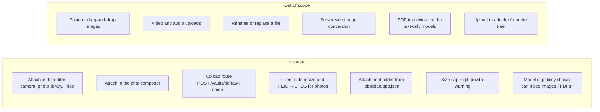
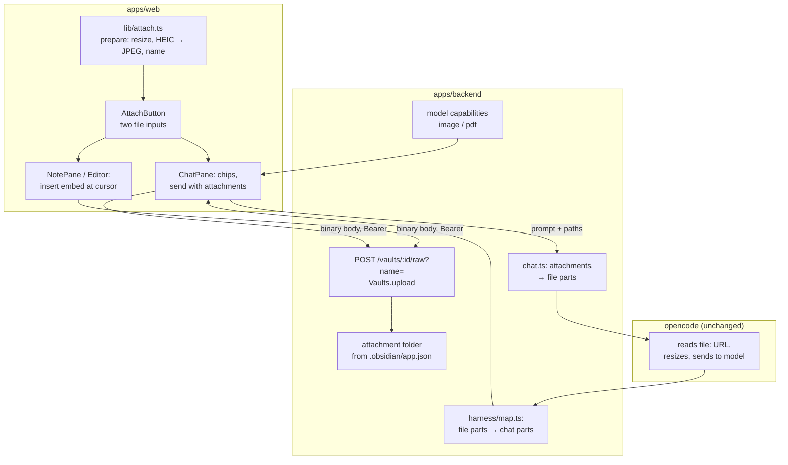

# Proposal: attach photos and PDFs

Covers issue [#87](https://github.com/tillg/karpathy.app/issues/87) "Attach photos and PDFs (camera → raw/, chat
attachments)" and [feature report §24](../../research/features/feature-report.md#24-attach-photos-and-pdfs-camera--raw-chat-attachments).

## What

An **Attach** button in two places puts a photo or a PDF from the device into the vault:

1. **In the editor** (Write mode): take a photo or pick a file. The app uploads it to the vault's attachment folder
   and inserts an embed (`![[2026-10-04-whiteboard.jpg]]`) at the cursor. The embed shows right away, through the
   media embeds that already exist.
2. **In the chat composer:** take a photo or pick a file, type "ingest this" (or nothing) and send. The app uploads
   the file to `Sources/media/` first. Then the prompt goes to the AI with the file attached, so a model that can see
   images or PDFs reads it directly. The file stays in `Sources/` as a source the AI can ingest and link to.

Every uploaded file is an **uncommitted change** like any other. It reaches GitHub (and Obsidian) only when the user
commits ([ADR 0001](../../../docs/adr/0001-user-triggered-commits.md)). Discard removes it again.

## Why

- The phone camera becomes a capture device for the wiki: a whiteboard after a meeting, a book page, a slide at a
  talk. Today that needs a laptop and Obsidian.
- PDFs downloaded on the phone have no way into `Sources/` from the app.
- It is the write side of the media embeds that were just built. Notes written on the phone then look the same in
  Obsidian.

## This reverses two documented rules

The system description says today:

- [domain.md › Rules](../../system/domain.md#rules-and-constraints): "**Media is read-only** for the user and the AI;
  there is no upload or paste."
- [functional.md › Inputs](../../system/functional.md): "No uploads (also no pasting images), exports, e-mail or push
  notifications."

This change lifts both for the **user**: the user may add images and PDFs to the vault. Existing media files stay
read-only (no editing, no replacing, no rename). The AI still can't create binary files: its tools write text only.
Pasting an image into the editor stays out of scope.

## Scope

### Decisions visible to the user

- **Formats:** JPEG, PNG, GIF, WebP and PDF. These are the formats opencode and the model providers accept. HEIC
  photos from an iPhone arrive as JPEG (iOS converts them, or the app does). Anything else is refused with a plain
  message.
- **Where files land:**
  - From the editor: the folder set in Obsidian (`attachmentFolderPath` in `.obsidian/app.json`), like Obsidian
    does. If the vault sets none, `Sources/media/`. None of the user's vaults sets one today, so in practice it's
    `Sources/media/`.
  - From the chat: always `Sources/media/`. A file sent to the AI is a source.
- **Names:** `YYYY-MM-DD-<name>.<ext>`, matching the `Sources/` naming of the vaults. A camera photo is
  `YYYY-MM-DD-photo-HHMMSS.jpg`. Characters that break file names or wikilinks become `-`. A taken name gets `-2`,
  `-3`, …; an upload never overwrites a file.
- **Photos are made smaller before upload:** at most 2048 px on the long edge, JPEG quality 0.85. That keeps a
  12-megapixel photo near 0.5–1 MB instead of 3–5 MB, and it **drops the photo's metadata (GPS location)**, which
  would otherwise go into git and to the model provider. PNG, GIF and WebP are uploaded as they are (screenshots stay
  sharp, GIFs keep their animation).
- **Size:** at most **50 MB** per file (the same as the preview limit; GitHub warns about files over 50 MB). Above
  **10 MB** the app asks first: "This adds 23 MB to the vault's git history for good, even if you delete it later.
  Upload anyway?"
- **The picker:** the **+** button offers **Take photo** (opens the camera directly on a phone) and **Choose file**
  (on iOS: photo library, camera or Files).
- **Chat attachments:** up to 5 files per prompt, each at most 20 MB (a bigger PDF can still be uploaded from a note,
  but not sent to the AI), each shown as a removable chip with a thumbnail (or the PDF name
  and size). The text may be empty when a file is attached. The sent prompt shows the attachments as thumbnails or
  file cards, also after a reload.
- **Models that can't see images or PDFs:** the chip says so ("glm-5.3 can't see images: the AI only gets the
  file's path"), and the file can still be sent. opencode then tells the model it couldn't read the file, and the
  model says so. Before this change ships to production, the production model has to change: today it is
  text-only (see Risks).
- **Conflict and offline:** Attach is disabled in both. Uploads are writes, and a vault in conflict refuses writes
  (423).

## Impact

- **Backend:** one new write route for binary files, the attachment folder lookup, file parts in prompts, model
  capabilities in the settings view, chat history that shows attached files.
- **Web:** an Attach button, photo preparation in the browser, embed insertion, composer chips.
- **No change** to opencode's image or config, the CSP, the proxy, git handling or the AI's tools.

## Expected outcome

- On an iPhone, in a note in Write mode: **+** → Take photo → the photo shows below the cursor's line within a few
  seconds. The note contains `![[2026-10-04-photo-143012.jpg]]`, and `Sources/media/2026-10-04-photo-143012.jpg` is
  in the Changes list. After a commit, Obsidian on the Mac shows the same photo.
- In the chat, with a vision-capable model: photo of a book page + "ingest this into the wiki" → the AI reads the
  photo and writes wiki pages that link to `Sources/media/…jpg`.
- A PDF attached in the chat lands in `Sources/media/` and is sent to the model. A PDF-capable model reads it.
- With a text-only model, the user sees before sending that the AI can't see the file.

## Risks

- **The production model is text-only.** models.dev lists `openrouter/z-ai/glm-5.3` with input `["text"]`. Images and
  PDFs reach it only as an "ERROR: Cannot read …" note. Chat attachments are useful only after the operator picks a
  model with image (and ideally PDF) input, e.g. `anthropic/claude-sonnet-5` (text, image, pdf) or
  `openrouter/z-ai/glm-5.3-flash` (text, image, no PDF). Editor uploads don't depend on the model.
- **PDFs need a PDF-capable model.** opencode's `read` tool returns a PDF only as a file attachment for the model; it
  doesn't extract text, and `bash` (for `pdftotext`) is denied. With a model without PDF input, a PDF in `Sources/` is
  inert for the AI. Text extraction is a possible follow-up.
- **Git growth.** Binaries stay in the history forever. The 50 MB cap and the 10 MB warning bound it; there is no
  per-vault quota. Vaults are full clones today, so every device and every clone pays for it.
- **More data goes to the model provider.** Attached images and PDFs leave the server, as notes the AI reads do today.
  The resize drops photo metadata; a PNG or PDF keeps whatever it contains.
- **opencode stores attachments in its session database** (base64, after its own resize to at most 2000×2000 px and
  5 MB). The `opencode-data` volume grows with each attached file, until the chat is deleted.

## Relation to other plans

The [V1 plan draft](../v1/v1-plan.md) lists #87 as out of V1 ("Capture via #65 first"). This change doesn't touch
that draft. The upload route here is also the binary write path a later capture or share feature (#65) can reuse.
