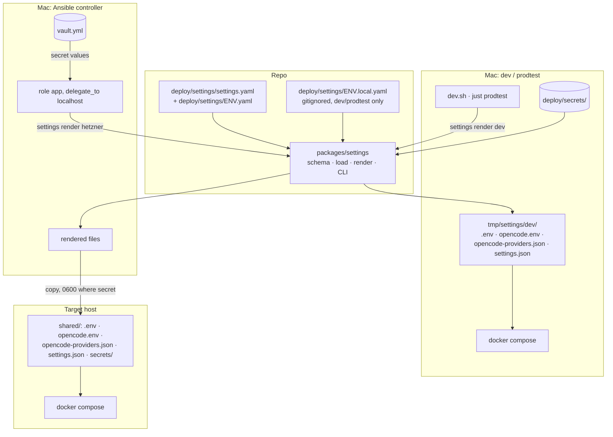
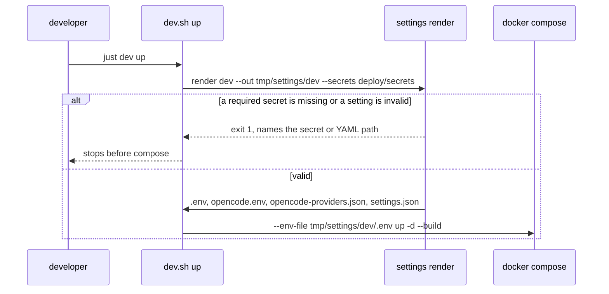
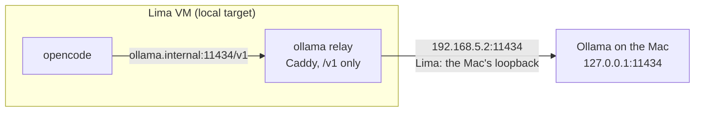

# Architecture: settings file, renderer and consumers

## Overview



One renderer, two callers (dev scripts and Ansible). Compose consumes the rendered directory the same
way in dev and on a target. The backend reads `settings.json`; opencode gets its provider config and API
keys; Caddy gets `DOMAIN`/`TLS_MODE` from `.env` as today.

## The settings files

```text
deploy/settings/
  settings.yaml        central: every setting, with the shared value
  dev.yaml             overrides for dev stacks
  prodtest.yaml        overrides for prodtest
  test.yaml            overrides for CI and integration tests
  local.yaml           overrides for the local VM target
  hetzner.yaml         overrides for production
  dev.local.yaml       gitignored: a developer's own dev overrides (optional)
  prodtest.local.yaml  gitignored: same for prodtest (optional)
```

The central file, `deploy/settings/settings.yaml` (every key that exists after this change; values are today's):

```yaml
# Central app settings; deploy/settings/<env>.yaml overrides them per environment. Secrets are references only.
ai:
  gateway: openrouter            # a key of `gateways`
  model: openrouter/z-ai/glm-5.3 # default model; Admin may override it per installation
  web:
    access: true                 # default of the Admin "web access" switch
    fetch_cap: 20
    search_cap: 20
    exa_api_key: { secret: exa_api_key, optional: true }
auth:
  bearer_token: { secret: bearer_token }
  opencode_password: { secret: opencode_password }
git:
  remote_base: https://github.com/
  author: { name: karpathy.app user, email: user@karpathy.app }
  github_token: { secret: github_token, optional: true }
proxy:
  domain: localhost
  tls: internal                  # internal | dns
  dns: { provider: godaddy, api_token: { secret: dns_api_token, optional: true } }
timezone: Etc/UTC
commit_reminder_threshold: 4
files:
  visible_dot_dirs: [.agents]    # dot-dirs the file tree shows (names start with '.', never .git)
gateways:
  openrouter:
    kind: openrouter
    api_key: { secret: openrouter_api_key }
    models:
      z-ai/glm-5.3:
        options:
          provider: { order: [mistral/zdr, mistral, fireworks, together, parasail], only: [...], zdr: true, data_collection: deny }
  ollama:
    kind: openai-compatible
    name: Ollama (native on the Mac)
    base_url: http://ollama.internal:11434/v1   # the relay on the stack's internal network
    relay_upstream: host.docker.internal:11434  # where the relay finds the Mac's Ollama
    models:
      qwen2.5:3b:  { tool_call: true, limit: { context: 16384, output: 4096 } }
      qwen3-vl:2b: { tool_call: true, limit: { context: 16384, output: 4096 }, modalities: { input: [text, image], output: [text] } }
```

The environment files, each listing only what differs:

```yaml
# deploy/settings/dev.yaml
ai: { gateway: ollama, model: ollama/qwen2.5:3b }
git: { remote_base: file:///remotes/, author: { name: Dev User, email: dev@example.com } }
```

```yaml
# deploy/settings/prodtest.yaml
ai: { gateway: ollama, model: ollama/qwen2.5:3b }
git: { remote_base: file:///remotes/ }
```

```yaml
# deploy/settings/test.yaml
ai: { gateway: ollama, model: ollama/qwen2.5:3b, vision_model: ollama/qwen3-vl:2b }
```

```yaml
# deploy/settings/local.yaml
ai: { gateway: ollama, model: ollama/qwen2.5:3b }
gateways: { ollama: { relay_upstream: 192.168.5.2:11434 } }   # the Mac as the Lima guest sees it
git: { remote_base: file:///remotes/, author: { name: karpathy.app local, email: local@karpathy.app } }
timezone: Europe/Berlin
```

```yaml
# deploy/settings/hetzner.yaml
proxy: { domain: app.karpathy.app, tls: dns }
git: { author: { name: { secret: git_author_name }, email: { secret: git_author_email } } }
timezone: Europe/Berlin
```

```yaml
# deploy/settings/dev.local.yaml (gitignored, example): my dev stack talks to OpenRouter
ai: { gateway: openrouter, model: openrouter/z-ai/glm-5.3 }
```

Rules:

- **Environments** are the `deploy/settings/*.yaml` files other than `settings.yaml` and `*.local.yaml`. An
  unknown environment name fails with the list of existing ones.
- **Merge:** `settings.yaml` ← `<env>.yaml` ← `<env>.local.yaml` (read only for `dev` and `prodtest`;
  a `local.local.yaml` or `hetzner.local.yaml` is an error, so nobody thinks it applies). Maps merge
  recursively; scalars and lists replace. Gateways merge too, so an environment can add one.
- **Partial vs. complete:** the central file must validate on its own as complete settings (every
  required key present). Environment and local files are validated as *partial* (same keys, all
  optional, unknown keys still fail); the merged result is validated as complete again.
- **Validation** (zod, strict objects): unknown keys fail; `ai.gateway` must name a gateway; `ai.model`
  must be `<provider id>/<model id>` of a model the chosen gateway lists, unless the gateway kind has
  built-in models (`openrouter`, `anthropic`, `openai`: their `models` only add options); `ai.vision_model` is optional (only `test` sets it), same
  rule; `proxy.tls: dns` requires `proxy.dns.api_token`. Every error
  names the file and the YAML path (`deploy/settings/hetzner.yaml: ai.model`); errors found only after the
  merge name the environment and the files that set the key.
- **Secret reference** `{ secret: name, optional?: bool }`, `name` matches `^[a-z][a-z0-9_]*$` (it is a
  file name in the secret store). Resolving reads `<store>/<name>`; a missing or empty file fails unless
  `optional`. Values are trimmed of one trailing newline (Caddy reads the DNS token verbatim).

## `packages/settings`

New workspace package, plain TypeScript run with Node's type stripping (like `e2e/stack.unit.ts`), deps
`yaml` and `zod` (both already in the workspace).

| Module | Does |
|---|---|
| `schema.ts` | The zod schema and the `Settings` / `SecretRef` types. Exported to the backend. |
| `load.ts` | `loadSettings(env, { dir })`: read `settings.yaml`, `<env>.yaml` and (dev/prodtest) `<env>.local.yaml` from `dir` (default `deploy/settings/`), validate each, merge, validate the result. `environments(dir)` lists the environment files. |
| `secrets.ts` | `secretRefs(settings)` lists every reference with its path; `resolveSecrets(settings, storeDir)` returns values or a list of missing names. |
| `render.ts` | Pure functions, one per output: `renderComposeEnv`, `renderOpencodeEnv`, `renderOpencodeProviders`, `renderBackendSettings`. Input: effective settings + resolved secrets. Output: file contents. |
| `cli.ts` | `settings render <env> --out <dir> --secrets <dir>`, `settings show <env>` (effective settings, refs not values), `settings check` (validates every environment; CI). |

Pure render functions keep the tests file-free: fixture settings in, expected text out.

### Rendered files

| File | Read by | Contents |
|---|---|---|
| `.env` | compose interpolation | `DOMAIN`, `TLS_MODE`, `DNS_PROVIDER`, `TZ`, `GIT_AUTHOR_NAME`/`EMAIL`, `GIT_REMOTE_BASE`, `DEFAULT_MODEL` (= `ai.model`), `SETTINGS_DIR`. Ansible appends its host facts (`APP_VERSION`, `DEPLOYED_AT`, `BIND_IP`, `HTTPS_PORT`, `APP_UID/GID`) as `env.j2` does today. |
| `opencode.env` | opencode (`env_file`) | The gateway's API key under its provider's variable (`OPENROUTER_API_KEY`, `ANTHROPIC_API_KEY`, …), `EXA_API_KEY` if set, `WEB_FETCH_CAP`, `WEB_SEARCH_CAP`, `OPENCODE_MODEL`. Mode 0600. |
| `opencode-providers.json` | opencode via `OPENCODE_CONFIG` | `{ provider: { <id>: … } }` for the chosen gateway, in opencode's config schema (the `ollama` gateway renders exactly today's `dev-ollama.json`; `openrouter` exactly today's routing block). The managed `/etc/opencode/opencode.json` still wins for policy. |
| `settings.json` | backend (`SETTINGS_FILE`) | Effective settings with secret refs replaced by `{ file: "/run/secrets/<name>" }`. No secret values. |
| `secrets/<name>` | compose secrets | Only for a target: Ansible writes the resolved values (today's task, now driven by `secretRefs`). In dev the store already *is* the compose secrets dir. |

Why `.env` keeps `DEFAULT_MODEL` and friends: on a target, compose runs a **downloaded release's**
`compose.yml`. A rollback to a release from before this change runs an old `compose.yml` that
interpolates those names. The renderer's `.env` is a superset of the old `env.j2` output, so today's
playbook can still deploy every older release (deployment.md, "Rollback").

## Compose

- `compose.yml`:
  - backend: `SETTINGS_FILE: /etc/karpathy/settings.json`, volume
    `${SETTINGS_DIR:-.}/settings.json:/etc/karpathy/settings.json:ro`; drop `GIT_AUTHOR_*`,
    `DEFAULT_MODEL`, `TZ` stays (the container needs it as env).
  - opencode: `env_file: ${SETTINGS_DIR:-.}/opencode.env` (required), `OPENCODE_CONFIG:
    /etc/opencode-providers.json` with the rendered file mounted read-only; drop `OPENCODE_MODEL` from
    `environment` (now in `opencode.env`).
  - No literal model or gateway defaults remain (`${DEFAULT_MODEL:-anthropic/claude-sonnet-5}` goes).
- `compose.dev.yml` / `compose.prodtest.yml`: drop `DEFAULT_MODEL`, `OPENCODE_MODEL`, `OPENCODE_CONFIG`,
  the `dev-ollama.json` mount, `GIT_REMOTE_BASE`, `GIT_AUTHOR_*`, `DOMAIN`, `TLS_MODE`. They keep only
  what is *stack plumbing*: ports, build targets, source mounts, the Ollama relay, `NO_PROXY` for
  `ollama.internal`.
- `dev.sh up` and `just prodtest up` run `settings render <env> --out tmp/settings/<env> --secrets
  <store>` first, then `docker compose --env-file ../tmp/settings/<env>/.env …`. `SETTINGS_DIR` in that
  `.env` points compose at the same directory. dev and prodtest no longer share `deploy/.env`.
- **Where a dev stack reads from:** the checkout it is started in. `just dev up` in the main clone or in
  `.worktrees/<name>` renders that checkout's `deploy/settings/settings.yaml` + `deploy/settings/dev.yaml` +
  (if present) `deploy/settings/dev.local.yaml`, with secrets from that checkout's `deploy/secrets/`, into that
  checkout's `tmp/settings/dev/`. So a branch that changes a setting runs with it, and parallel stacks
  never read each other's settings. The gitignored local overlay and secrets are per checkout (as
  `deploy/secrets/` is today): a fresh worktree without them runs the committed dev settings (Ollama).
- `deploy/opencode/dev-ollama.json` and `deploy/.env.example` / `opencode.env.example` are deleted; the
  Ollama gateway lives in `deploy/settings/settings.yaml`.
- **Legacy guard:** `dev.sh` stops with a message if `deploy/.env` or `deploy/opencode.env` still
  exists: "move your model choice to `deploy/settings/dev.local.yaml` and your keys to `deploy/secrets/<name>`,
  then delete these files" (one line per key found, values never printed).



## Backend

- `main.ts`: `const settings = loadBackendSettings(process.env.SETTINGS_FILE ?? '/etc/karpathy/settings.json')`,
  which parses with the shared schema and reads each `{ file }` secret. Replaces `GIT_REMOTE_BASE`,
  `GIT_AUTHOR_*`, `DEFAULT_MODEL`, `BEARER_TOKEN(_FILE)`, `GITHUB_TOKEN(_FILE)`, `OPENCODE_PASSWORD(_FILE)`.
  Stays env: `APP_VERSION`, `BUILT_AT`, `DEPLOYED_AT` (image/deploy facts), `PORT`, `VAULTS_DIR`,
  `CONFIG_DIR`, `OPENCODE_URL`, `OPENCODE_VAULTS_DIR` (container wiring, fixed per image, not settings).
- Missing or invalid file → the backend refuses to start with the path and the zod message (as it does
  today for a missing bearer token).
- Tests construct settings in code; no file needed except one test of `loadBackendSettings`.

### Model default and override

`config.json.settings.model` becomes `modelOverride?: string`. `ConfigStore.open(dir, { model })`
computes the effective model as `modelOverride ?? defaultModel`.

| Event | Before | After |
|---|---|---|
| Admin saves, model unchanged | persists `model` (pins it forever) | nothing stored |
| Admin picks the default | persists it | removes `modelOverride` |
| Admin picks another model | persists it | stores `modelOverride` |
| Deployment changes `ai.model` | ignored once persisted | applies unless overridden |
| Existing `config.json` with `settings.model` | — | migrated on open: kept as `modelOverride` only if ≠ the default |

`GET /api/settings` adds `defaultModel` and returns `model` (effective) plus `modelOverridden: boolean`.
`PATCH /api/settings` takes `model: string | null` (`null` = back to default). Admin's picker shows
`Default (<model>)` as its first entry; picking it sends `null`. The `PATCH` check against
`harness.models()` stays.

## Ansible

Role `app`:

1. **Render on the controller** (`delegate_to: localhost`, `run_once`, `no_log`): write the target's
   vault secrets to a temp dir `T` (0700, removed in an `always:` block), then run:
   `node packages/settings/cli.ts render {{ target }} --out T/out --secrets T/secrets`.
2. Copy `opencode.env`, `opencode-providers.json`, `settings.json` to `shared/` (0600 where secret); write
   `shared/.env` from the rendered `.env` plus the host facts (a short template that `include`s the
   rendered file, so `DEPLOYED_AT` stays stable and an unchanged `.env` still recreates nothing).
3. Secret files: loop over `secretRefs` of the target (the CLI prints them with `--list-secrets`)
   instead of today's hard-coded list. The opencode password stays generated on the host (not in the
   vault), so it is excluded from the vault lookup but still a secret ref.
4. `group_vars/all/main.yml` loses the app settings (`domain`, `tls_mode`, `timezone` for the app,
   `default_model`, `git_*`, `opencode_env`). It keeps host provisioning, `app_url`, `bind_ip`,
   `https_port`, and the `vault_*` mapping. `vault_opencode_env` (a dict) becomes one vault entry per
   secret name (`vault_openrouter_api_key`, `vault_exa_api_key`); `fill_vault.py` prompts per secret ref.
5. `env.j2` and the opencode.env task are removed; `roles/app/templates/env.j2`'s keys are covered by the
   golden test below.

The controller needs Node ≥ 22 (already true: the repo is a Node workspace and `just deploy` runs from a
checkout).

### The `local` target uses the Mac's Ollama

Today `local` names `ollama/qwen2.5:3b` but its opencode has no `ollama` provider. After this change it
works like a dev stack: the `ollama` gateway's provider config is rendered for it, and a relay gives
opencode a route to the native Ollama on the Mac (`just ollama install`: Homebrew `ollama` as the
LaunchAgent `app.karpathy.ollama`, `127.0.0.1:11434`).



- `Caddyfile.ollama-relay` takes its upstream from `{$OLLAMA_UPSTREAM}` instead of the fixed
  `host.docker.internal:11434`. The renderer writes `OLLAMA_UPSTREAM` (the gateway's `relay_upstream`)
  to `.env` when the gateway is `ollama`. Dev and prodtest keep `host.docker.internal:11434`;
  `local.yaml` overrides it with `192.168.5.2:11434`, Lima's user-mode address for the host, which
  forwards to the Mac's loopback, so Ollama can stay bound to `127.0.0.1`.
- `compose.target.yml.j2` adds the relay service (as `compose.prodtest.yml`'s `ollama-bridge`) and
  `NO_PROXY=…,ollama.internal` for opencode when the rendered `settings.json` says `ai.gateway: ollama`.
  Role `app` copies `Caddyfile.ollama-relay` from the controller's checkout to `shared/`: the release
  asset is only `compose.yml`.
- Role `app` checks, on the controller, that Ollama answers on `127.0.0.1:11434` and has the model,
  and stops with "run `just ollama install`" otherwise.
- **To verify first** (the plan's first local step): that a container inside the VM reaches
  `192.168.5.2:11434` with `vmType: vz`. If not, the fallback is the guest-side address Lima documents
  for vz, set in `local.yaml`, without changing the design.

## Tests and CI

- `packages/settings`: vitest units for merge, schema errors, secret resolution, each renderer (golden
  strings: today's `dev-ollama.json`, today's OpenRouter block, a `.env` whose key set ⊇ `env.j2`'s).
- `just settings check` in `just check` and `ci.yml`: every environment validates.
- `deploy/stack.test.sh`: compose config of dev and prodtest with a rendered dir has no model literal,
  mounts the provider config, and fails clearly without a render.
- Integration tests (`apps/backend/test/opencode-container.ts`): the default test model and vision model
  come from `loadSettings('test')`; `LLM_TEST_MODEL` / `LLM_VISION_MODEL` remain as overrides.
- e2e on the dev stack: Admin model picker (default entry, override, reset).
- Ansible: `ansible-playbook --syntax-check` (CI) and a real `just deploy local <rc>` before release.

## Tradeoffs

| Choice | Instead of | Because |
|---|---|---|
| Render files for each component | Every component parses YAML | Caddy/Squid/opencode/compose can't; the release `compose.yml` is fixed per version |
| TypeScript renderer, called by Ansible | Jinja templates reading the YAML | One implementation for dev, CI and targets; Jinja would duplicate merge + validation |
| Secret refs + existing stores | Values in a gitignored YAML | Public repo; targets need the vault anyway; one reviewed file |
| Keep legacy keys in `.env` | Clean break | Rollback to pre-change releases with today's playbook |
| Container wiring (`PORT`, `VAULTS_DIR`, …) stays env | Move into the file | Fixed per image, never chosen per environment |

## Risks

- **Rollback compatibility** depends on the `.env` superset; the golden test pins it.
- **Dev friction** at the switch (legacy guard) — one-time, with a precise message.
- **Secret leakage via `show`/logs:** `show` prints refs only; render never logs values; Ansible tasks
  are `no_log`; the temp secret dir is removed in `always:`.
