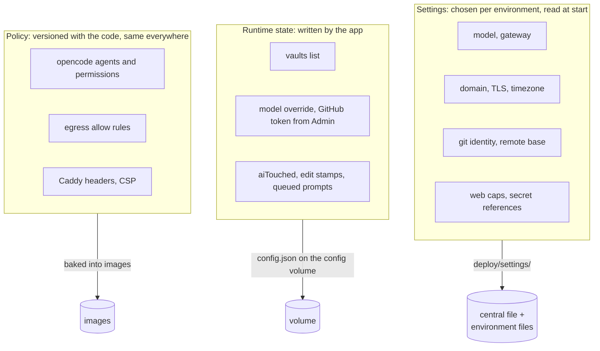
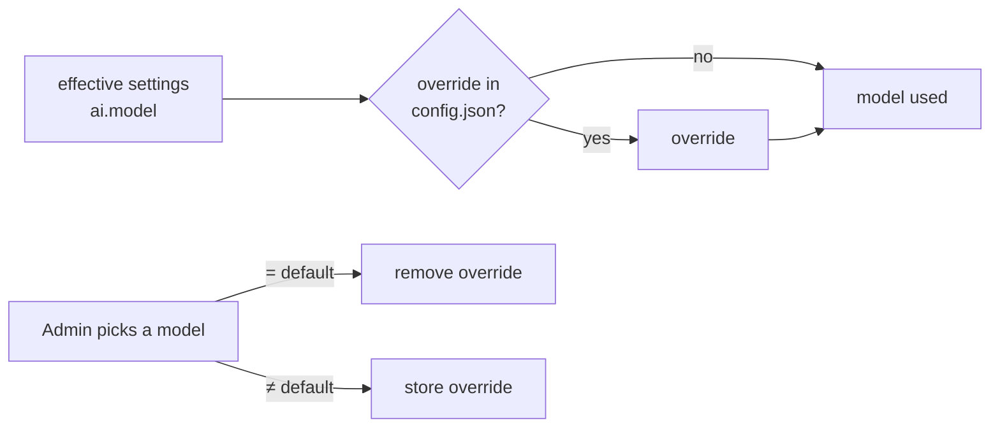
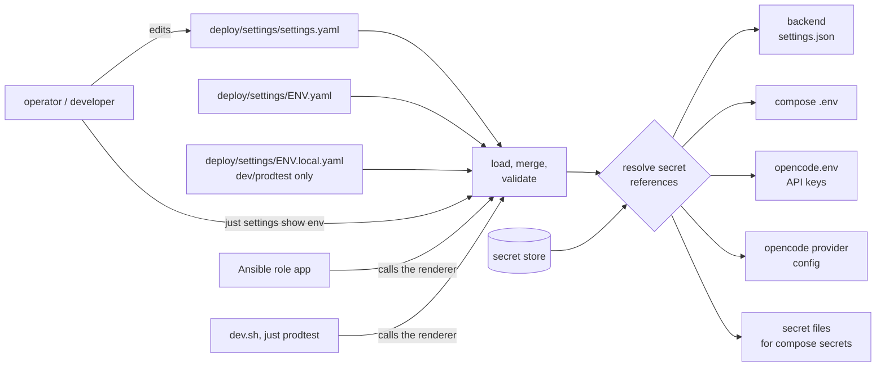

# Domain: settings, environments and secret references

## New terms

| Term | Meaning |
|---|---|
| **Central settings file** | `deploy/settings/settings.yaml`, committed. Declares every app setting with the value all environments share. |
| **Environment file** | `deploy/settings/<env>.yaml`, committed. Same shape as the central file, but holds only the settings that environment overrides. Its existence defines the environment. |
| **Setting** | A value an operator chooses per environment and that the app reads at start: model, gateway, domain, TLS mode, timezone, git identity, web caps. Not changed by the app itself. |
| **Environment** | A named way the stack runs: `dev` (dev stack N on the Mac), `prodtest`, `local` (Lima VM target), `hetzner` (production target), `test` (CI and integration tests). Every **target** is an environment; not every environment is a target. |
| **Effective settings** | The central file deep-merged with the environment file and, for `dev` and `prodtest` only, the **local overlay**. Maps merge key by key; lists and scalars replace. |
| **Local overlay** | Optional, gitignored `deploy/settings/dev.local.yaml` or `deploy/settings/prodtest.local.yaml`: one developer's own choices (e.g. "use OpenRouter"). Never read for a target. Replaces hand-edited `deploy/.env`. |
| **Secret reference** | A setting value of the form `{ secret: <name> }` (optionally `optional: true`). Says *which* secret a component needs, never its value. Any string setting may be one. |
| **Secret store** | Where a secret's value lives: a directory with one file per secret name. Dev: `deploy/secrets/`. Prodtest: `tmp/prodtest/secrets/`. Target: `shared/secrets/` on the host, written from the target's Ansible Vault. |
| **Gateway** | A named way to reach LLMs: kind (`openrouter`, `anthropic`, `openai-compatible`, …), base URL, API key (a secret reference) and the models it offers with their options (e.g. OpenRouter ZDR routing). The settings choose one gateway per environment. |
| **Default model** | `ai.model` in the effective settings. Used by the backend and opencode unless overridden. |
| **Model override** | The model an admin picked in the app, stored in `config.json`. Exists only while it differs from the default model; picking the default again removes it. |
| **Rendered files** | What the renderer writes from the effective settings for components that can't read the settings file: compose `.env`, `opencode.env`, the opencode provider config, and the backend's `settings.json`. Generated, never edited, never committed. |

## Settings vs. state vs. policy

Three kinds of configuration exist; only the first moves into the settings file.

The **model** spans the first two: the settings file holds the default, `config.json` holds an optional
override. The **GitHub token** too: the secret reference names the deployment's token, and a token set
in Admin (runtime state) still wins, as today.

## Model precedence

Before: after the first Admin save the persisted model won forever, whatever the deployment said.
After: a deployment's default change reaches every user without an override.

## Who uses which part

## Changed terms

- **Target** (deployment.md): unchanged meaning; its *app* settings now come from the central file plus
  `deploy/settings/<target>.yaml`. The inventory keeps host provisioning and the vault (secret store).
- **`default_model` / `DEFAULT_MODEL`**: replaced by `ai.model`. `DEFAULT_MODEL` is still written to the
  rendered `.env` so an older release's `compose.yml` keeps working on rollback.
- **`deploy/.env`, `deploy/opencode.env`**: no longer edited by hand; generated by the renderer.
