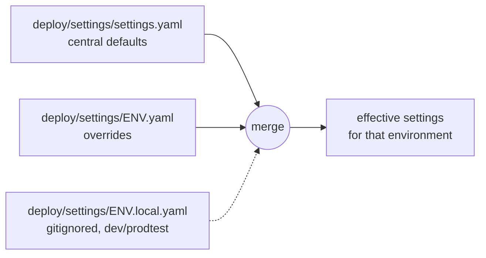
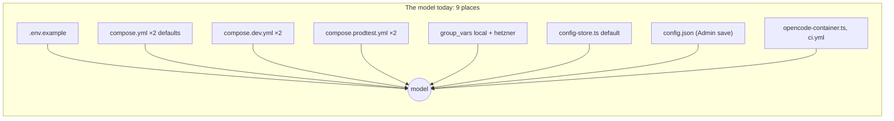

# Proposal: one central settings file

**Issue:** [#133](https://github.com/tillg/karpathy.app/issues/133)

## What

A **`deploy/settings/` directory** holds every app setting for every environment: which LLM
gateway and model, domain and TLS mode, timezone, git identity, web access limits and which secret each
component needs.

- **`deploy/settings/settings.yaml`** is the central file: the defaults every environment shares.
- **`deploy/settings/<env>.yaml`** (`dev`, `prodtest`, `test`, `local`, `hetzner`) holds only what that
  environment overrides. It has the same shape as the central file, just sparser.
- **`deploy/settings/<env>.local.yaml`** (gitignored, `dev` and `prodtest` only) is a developer's own override
  on top, e.g. "use OpenRouter in my dev stack".

Every component gets its settings from the merged result:

- the **backend** reads a resolved copy of it directly (no more `process.env` settings);
- **compose, opencode and Caddy**, which can only read their own formats, get files **rendered** from it
  by one small tool (`packages/settings`, run as `just settings render`);
- **Ansible** renders the same files for a target with the same tool instead of its own Jinja templates.

Secret **values** never go into these files. A setting that is secret holds a **secret reference**
(`{ secret: openrouter_api_key }`); the value lives where secrets live today (gitignored
`deploy/secrets/` in dev, the target's Ansible Vault on a server).

```yaml
# deploy/settings/settings.yaml (excerpt; full shape in architecture.md)
ai:
  gateway: openrouter
  model: openrouter/z-ai/glm-5.3
  web: { fetch_cap: 20, search_cap: 20, exa_api_key: { secret: exa_api_key, optional: true } }
auth:
  bearer_token: { secret: bearer_token }
gateways:
  openrouter: { kind: openrouter, api_key: { secret: openrouter_api_key }, models: { … } }
  ollama:     { kind: openai-compatible, base_url: http://ollama.internal:11434/v1, models: { … } }
```

```yaml
# deploy/settings/dev.yaml: only what dev changes
ai: { gateway: ollama, model: ollama/qwen2.5:3b }
git: { remote_base: file:///remotes/ }
```

```yaml
# deploy/settings/hetzner.yaml
proxy: { domain: app.karpathy.app, tls: dns }
git: { author: { name: { secret: git_author_name }, email: { secret: git_author_email } } }
```



## Why

Today one setting has many homes, and they drift:



- **The model has three live sources** that disagree. The backend uses `DEFAULT_MODEL` only until the
  first Admin save; after that `config.json` wins forever (`config-store.ts:59`, `{ ...DEFAULT_SETTINGS,
  ...defaults, ...raw.settings }`), so changing `default_model` on hetzner has no effect, while opencode's
  `OPENCODE_MODEL` still follows the env. The literal `qwen2.5:3b` alone sits in 8 files.
- **The gateway lives in JSON chosen by compose overrides** (`dev-ollama.json` mounted in dev and
  prodtest; the OpenRouter routing block baked into `opencode.json`). Switching dev to OpenRouter means
  editing the gitignored `deploy/.env` and `deploy/opencode.env` by hand — and prodtest silently
  inherits that.
- **Secrets travel two pipes:** compose secret files (bearer, opencode password, GitHub, DNS) and an env
  file (provider keys, Exa — plus two non-secret caps, `WEB_FETCH_CAP`/`WEB_SEARCH_CAP`, that only live
  there because it was handy).
- **Each target re-declares the same settings** in `group_vars/all/main.yml` and maps them through
  `env.j2`; dev and prodtest declare them again in compose overrides. There is no single place to read
  "what does hetzner run with?".
- **Found while inventorying:** the `local` target sets `default_model: ollama/qwen2.5:3b` but nothing
  gives its opencode an `ollama` provider (`compose.target.yml.j2` sets no `OPENCODE_CONFIG`). This
  change fixes it: `local` uses the Mac's native Ollama through the same relay as dev (see "Decided in
  review").

## Scope

In:

- `deploy/settings/settings.yaml` (central defaults) and one override file per **environment**:
  `deploy/settings/dev.yaml`, `prodtest.yaml`, `test.yaml`, `local.yaml`, `hetzner.yaml` (all committed). An
  environment exists exactly when its file exists. Optional gitignored `deploy/settings/dev.local.yaml` /
  `prodtest.local.yaml` for a developer's own choices (replaces hand-editing `deploy/.env`).
- A schema (zod) that rejects unknown keys, wrong types and bad secret references, with the YAML path in
  the message.
- `packages/settings`: load → merge → validate → resolve secrets → render. CLI `just settings
  render|show|check <env>`.
- Rendered outputs: compose `.env`, `opencode.env`, opencode provider config (from the gateway), and
  `settings.json` for the backend.
- Backend reads `settings.json`; env settings in `main.ts` go away (build/deploy metadata `APP_VERSION`,
  `BUILT_AT`, `DEPLOYED_AT` stay env: they are facts about the image and the deploy, not settings).
- **Model default vs. override:** the file sets the default; the Admin dialog sets an override that is
  stored only while it differs from the default. Admin shows which one is in effect.
- dev, prodtest, CI/integration tests and the Ansible role `app` all render from the file.
- Docs: README, `deploy/README.md`, demo run book (Admin model chapter).

Out (unchanged):

- **Runtime state** in `config.json`: vaults, `aiTouched`, edit stamps, queued prompts, the in-app GitHub
  token. That is data the app owns, not settings.
- **Browser preferences** in localStorage.
- **Policy baked into images:** opencode agents/permissions (`opencode.json`), Squid rules, Caddy
  headers. They are security policy, versioned with the code, not per-environment settings.
- **Host provisioning** in Ansible: Tailscale, `vaults_fs_size`, admin keys, users, monitoring/Beszel,
  hetzner-watch. They configure the machine, not the app. Decided in review: not now.
- **Hard-coded tuning constants** (poll intervals, timeouts, upload limit). Moving them is speculative
  until someone needs to change one.
- Dev stack numbers and ports: computed per checkout by `stack.sh`, not settings.

## Expected outcome

- "What model does hetzner use?" is answered by `deploy/settings/hetzner.yaml`, or the central file if it doesn't
  override the model; `just settings show
  hetzner` prints the effective, merged settings (secrets shown as references only).
- Model and gateway names appear only in `deploy/settings/` (a test in the plan proves it).
- Switching dev to OpenRouter = two lines in `deploy/settings/dev.local.yaml` plus one secret file.
- Changing the hetzner default model and redeploying changes the model for every user who hasn't
  overridden it in Admin.
- Rolling back to an older release still works: the rendered `.env` keeps every key the old
  `env.j2` wrote.

## Decisions taken in this proposal (please review)

1. **Secrets as references, values elsewhere.** The repo is public, so a committed file can't hold
   values. *Alternative not taken:* fully gitignored settings files with values inline — simple in
   dev, but then the files aren't shared, aren't reviewed, and targets still need the vault. References
   keep the files reviewed and reuse the two secret stores that already work.
2. **A central file plus one override file per environment** (your review input). The central file
   holds the defaults; an environment file lists only what differs, so reading `hetzner.yaml` shows what
   makes production different. *Alternative not taken:* one file with `defaults` and `environments`
   sections — one place, but a long file in which an environment's differences are spread out.
3. **Render, don't teach every component YAML.** Caddy, Squid, opencode and compose read their own
   formats, and on a target `compose.yml` is a downloaded release asset. One renderer (TypeScript, the
   project's language) feeds them; the backend reads the resolved file.
4. **Not "just reuse Ansible `group_vars`".** That is already per-target YAML, but dev, prodtest, tests
   and the backend don't run Ansible, and the targets' file would still be split from dev's. Ansible
   becomes a *consumer*: it calls the renderer on the controller with secrets from the vault.

## Decided in review (2026-10-08)

- **Admin model override:** kept. Admin stores a model only while it differs from the settings'
  default; the picker's first entry is *Default (model)*, which removes the override. (Not taken:
  dropping the picker so the file is the only source.)

- **Place:** `deploy/settings/`, next to compose. A dev stack reads the files of the checkout it is
  started in (main clone or worktree), wherever they sit.
- **Host provisioning** (Tailscale, disk size, monitoring): not now.
- **`test` environment:** yes. CI and integration tests take their default models from
  `deploy/settings/test.yaml`; `LLM_TEST_MODEL` and friends stay as one-off overrides.
- **`local` target:** uses the native Ollama on the Mac (`just ollama install`, the Homebrew `ollama`
  run as a LaunchAgent on `127.0.0.1:11434`), the same one the dev stacks use. The VM's stack gets the
  same `/v1`-only relay as dev, pointed at the Mac as the Lima guest sees it.
