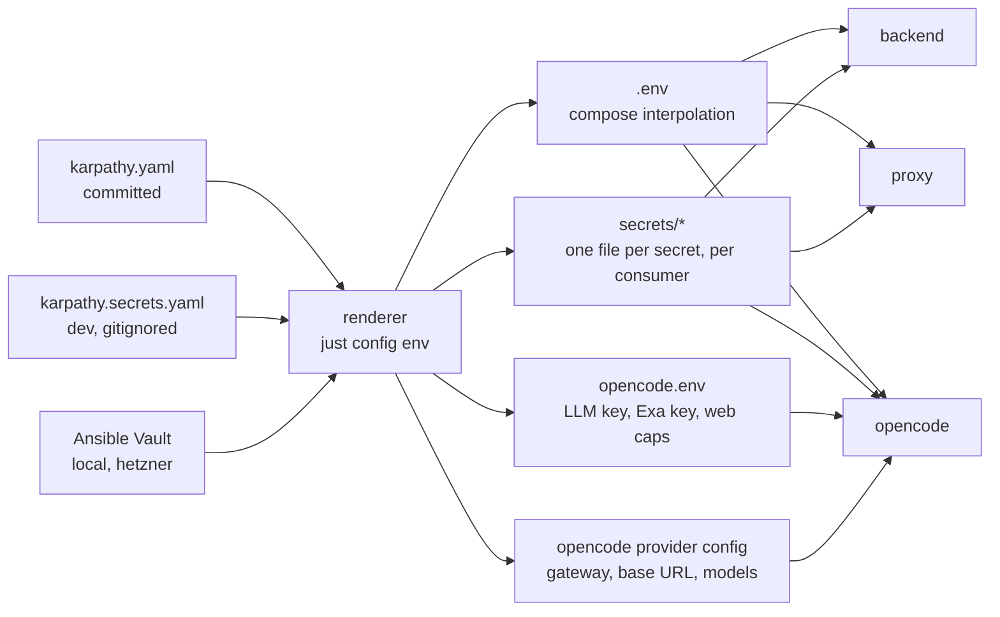

# Proposal: one settings file for the whole stack

## TL;DR

All settings of the stack move into **one YAML file at the repo root, `karpathy.yaml`**, with a section
per environment (`dev`, `prodtest`, `local`, `hetzner`). Secrets are **declared** in the same file (name,
which component gets it, whether it can be generated) but their **values** never enter the public repo:
they live in a gitignored `karpathy.secrets.yaml` on the dev machine and in the target's Ansible Vault on a
server, under the same names.

Components keep reading what they read today (env vars, `*_FILE` secrets, an opencode config), but none of
it is hand-written any more: **one renderer** (`just config <env>`) turns `karpathy.yaml` into each
component's input, and Ansible calls the same renderer. Recommendation: render, don't mount the YAML into
containers. Mounting would hand every container every secret and would need a YAML reader in Caddy and
opencode.

## What

- **`karpathy.yaml`** (committed): every non-secret setting, grouped by concern, with `defaults` and one
  override block per environment.
- **Secret registry** in the same file: each secret's name, consumers, and whether it is generated or must
  be entered. No values.
- **Secret values**: `karpathy.secrets.yaml` (gitignored) for `dev` and `prodtest`; the target's encrypted
  `vault.yml` for `local` and `hetzner`, keyed by the registry names.
- **Renderer** `just config <env>`: validates both files against one schema, then writes each component's
  input. `just dev`, `just prodtest` and `just deploy` call it first.
- **Schema check** in `just check` and CI: unknown keys, missing required secrets and an LLM gateway
  without a key fail fast, before any container starts.

## Why

The same value is written by hand in many places today. The LLM model is the clearest case:

| Setting | Written today in |
|---|---|
| Model (`DEFAULT_MODEL` / `OPENCODE_MODEL`) | `compose.yml` ×2, `compose.dev.yml` ×2, `compose.prodtest.yml` ×2, both inventories' `group_vars`, `opencode-container.ts` (`LLM_TEST_MODEL`), `dev.sh` (pull), `ci.yml` (pull) |
| LLM gateway (Ollama vs. OpenRouter) and its address | `dev-ollama.json` (base URL, model list), `opencode.json` (OpenRouter routing), `NO_PROXY` in two compose overrides, `OPENCODE_CONFIG` in two compose overrides |
| Provider keys, Exa key, web caps | `deploy/opencode.env` (dev), `vault_opencode_env` (targets), `opencode.env.example` |
| Git author, remote base, timezone, domain, TLS mode, ports | compose defaults, compose overrides, `env.j2`, `compose.target.yml.j2`, inventory `main.yml` |
| Generated secrets (bearer token, opencode password) | `dev.sh`, the `prodtest` recipe in `justfile`, role `app` |

Switching the dev stack from Ollama to OpenRouter touches four files and an env file today, and a miss
(model in the backend but not in opencode, `NO_PROXY` without the Ollama host) only shows up as a failed
chat turn. The goal: **change one line, run one command.**

## The file

A sketch, not the final schema:

```yaml
# karpathy.yaml: every setting of the stack. Secrets: names only (values: karpathy.secrets.yaml
# in dev, the target's Ansible Vault on a server). `just config <env>` renders it.
defaults:
  llm:
    gateway: openrouter            # ollama | openrouter | anthropic | openai
    model: openrouter/z-ai/glm-5.3
    vision_model: null             # null = same as model
  web: { fetch_cap: 20, search_cap: 20 }
  git:
    remote_base: https://github.com/
    author: { name: karpathy.app user, email: user@karpathy.app }
  proxy: { domain: localhost, tls_mode: dns, dns_provider: godaddy, bind_ip: 0.0.0.0, https_port: 443 }
  timezone: Etc/UTC

environments:
  dev:
    llm:
      gateway: ollama
      base_url: http://ollama:11434/v1
      model: ollama/qwen2.5:3b
      vision_model: ollama/qwen3-vl:2b
    git: { remote_base: file:///remotes/, author: { name: Dev User, email: dev@example.com } }
    proxy: { tls_mode: internal, https_port: 8443 }
  prodtest: { extends: dev, proxy: { https_port: 9443 } }
  local:    { extends: dev, proxy: { https_port: 443 }, timezone: Europe/Berlin }
  hetzner:
    proxy: { domain: app.karpathy.app, tls_mode: dns }
    git: { author: secret }        # personal data: from the vault, not this public file
    timezone: Europe/Berlin

secrets:
  bearer_token:      { to: [backend],           generate: true }
  opencode_password: { to: [backend, opencode], generate: true }
  github_token:      { to: [backend],  optional: true }   # the in-app token still wins
  dns_api_token:     { to: [proxy],    required_if: "proxy.tls_mode == dns" }
  llm_api_key:       { to: [opencode], required_if: "llm.gateway != ollama" }  # env name from the gateway
  exa_api_key:       { to: [opencode], optional: true }
```

Ops-only settings (Tailscale, Beszel, Gatus, ntfy, heartbeat, SSH keys, disk sizes) stay in the Ansible
inventory: they configure the host, not the app, and only Ansible reads them.

## How components get their values



- **Compose files lose their hard-coded values.** `${DEFAULT_MODEL:-anthropic/claude-sonnet-5}` becomes
  `${LLM_MODEL}` with no default: a missing render fails loudly instead of silently picking a model.
  `compose.dev.yml` and `compose.prodtest.yml` keep only what is structural (bind mounts, the Ollama and
  bridge services), not values.
- **`NO_PROXY` and the Ollama provider block are derived** from `llm.gateway` and `llm.base_url`, so they
  can't disagree with the model. `dev-ollama.json` is replaced by the rendered provider config.
- **Secrets stay per consumer.** The renderer writes each secret only where `to:` says, with the file modes
  role `app` uses today. The security model in `specs/system/security.md` (backend never sees provider
  keys, opencode never sees the bearer or GitHub token) is unchanged and is checked by the schema.
- **Tests and CI read the file too.** `opencode-container.ts` and the CI model pull take `dev.llm` from
  `karpathy.yaml`; `LLM_TEST_MODEL` stays as an override for the `@llm` tier.
- **Ansible** loads `karpathy.yaml` (`include_vars`), merges `environments.<target>`, and renders through
  the same code path. `env.j2`, the `opencode_env` task and most of the inventory `main.yml` go away.
  `just secrets <target>` asks for exactly the secrets the registry marks as entered, not generated.

## Decisions to confirm

1. **Secret values outside the file** (recommended) vs. **encrypted inline** in `karpathy.yaml` with SOPS
   and age. Inline is literally one file, but it adds a tool, replaces Ansible Vault, and puts ciphertext
   for every environment in the public repo. The registry already gives "one place to look"; the values
   just live next to it.
2. **Render** (recommended) vs. **mount `karpathy.yaml` and parse it in each component.** Rendering keeps
   Caddy and opencode unchanged and secrets per container; parsing would make the backend nicer but not
   the rest.
3. **Renderer language:** a small Node/TS script under `deploy/config/` using `zod` (already a backend
   dependency) and `yaml`, so the schema is typed once. Ansible's controller is the Mac, which has Node.
4. **In-app settings stay runtime state.** The model picked in the app and the GitHub token set in the app
   live in the config volume's `config.json` and still win; `llm.model` only seeds a fresh store, as
   `DEFAULT_MODEL` does today.

## Scope

- **In:** every value in the "Why" table; the renderer, schema and check; compose, `dev.sh`, `justfile`,
  role `app`, inventories, test helpers and CI rewired to it; `opencode.env.example` replaced by a
  `karpathy.secrets.example.yaml`; `specs/system/deployment.md` and `security.md` updated.
- **Out:** the opencode agent and permission config in `opencode.json` (behaviour, not settings); Caddyfiles;
  monitoring thresholds and other ops-only Ansible settings; in-app settings; a secrets manager.

## Impact

- **Migration:** one-time. `just config` offers the values it finds in today's `deploy/opencode.env` and
  `deploy/secrets/*` as defaults (as `just secrets` already does), so nothing has to be re-entered. Vault
  keys are renamed from `vault_*` to the registry names in one `just secrets <target>` run per target.
- **Release `compose.yml`** downloaded by role `app` no longer has defaults, so a target needs a rendered
  `.env` before the first `up`; role `app` already renders `shared/` before switching `current`.
- **No change** to the backend's code paths beyond reading a renamed variable or two, and none to the web
  app, git flow or the AI's tools.

## Expected outcome

- Switching the dev stack from Ollama to OpenRouter: set `environments.dev.llm.gateway: openrouter` and the
  model, put the key in `karpathy.secrets.yaml`, `just dev`. Nothing else.
- `grep -r qwen2.5` finds the model in `karpathy.yaml` only (and in prose).
- Forgetting the OpenRouter key fails `just config dev` with "llm_api_key is required for gateway
  openrouter", not a chat turn that never answers.
- A new target is a new block under `environments` plus its vault; no new compose override.
