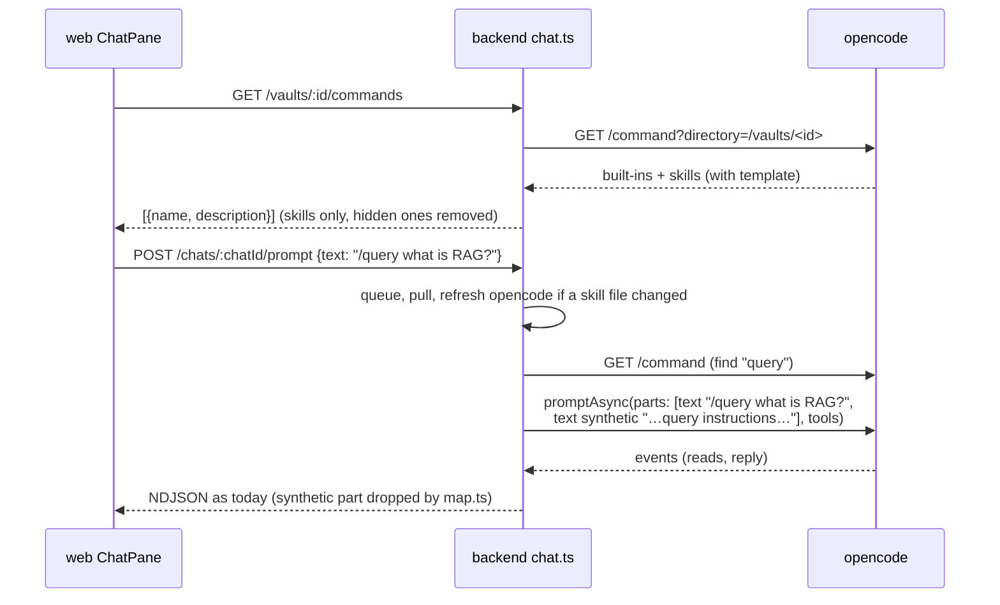
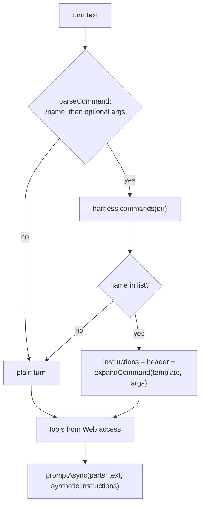
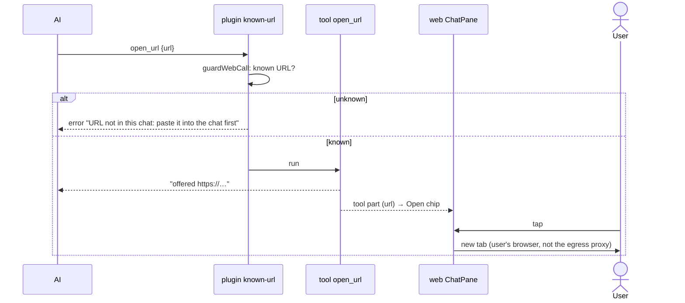

# Architecture: chat commands, deep research and web links

## Approach in one picture

- **Commands are skills, listed by opencode.** The backend asks opencode for the vault's command list
  (`GET /command`) and keeps only the skills.
- **A command turn is a normal turn.** The backend sends the user's text plus the skill's instructions
  as a hidden (`synthetic`) part through the same `promptAsync` call as every turn. It never uses
  opencode's command endpoint, because that one runs shell snippets from skill files.
- **Research is a skill that ships in the opencode image**, next to `open_note`. The backend treats it like
  any command: no special tools map, no special rule.
- **`open_url` is a custom tool in the image.** The `known-url` plugin guards it like `webfetch`. The web
  app shows its call as a link chip.



## Facts this design rests on (verified at opencode v1.18.25)

From the source at tag `v1.18.25` (`anomalyco/opencode`, commit `cb7d8b2`, paths under
`packages/opencode/src/`) and from the running dev container on the pinned image, on 2026-10-04.

| # | Fact | Evidence |
|---|---|---|
| F1 | **Skills appear in `GET /command`.** The list holds the built-ins `init` and `review` (`source: "command"`, `review` with `subtask: true`), then config commands and MCP prompts, then one entry per skill with `source: "skill"`, `hints: []` and a `template`. A command of the same name wins over a skill. `GET /skill` lists the same skills separately (with `location`, `content`); we don't need it. | `command/index.ts` (`for (const item of yield* skill.all())`); container: `my-life-wiki` → `init, review, customize-opencode, archify`; `mein-llm-wiki` → `…, query`; `small` → only the three built-ins |
| F2 | **The list is per directory.** `?directory=/vaults/<id>` returns that vault's skills: `.claude/skills/**/SKILL.md` and `.agents/skills/**/SKILL.md` walking up from the directory, the same in `$HOME` (empty for us), then `{skill,skills}/**/SKILL.md` in every config dir, the global one (`/opt/opencode-config/opencode`) included. A later skill of the same name replaces an earlier one, so **a skill in the image wins over a vault skill** of that name. | `skill/index.ts` lines 180–230 (scan order), 125–134 (`state.skills[name] =` after a duplicate warning) |
| F3 | **Command files (`.md`) come only from config dirs**: `{command,commands}/**/*.md` in the global config dir and in `.opencode/` dirs up the tree. `.claude/commands/` is not read. A vault `.opencode/` disables chat (security.md), so a vault can't add command files. | `config/command.ts` (`Glob.scan("{command,commands}/**/*.md")`), `config/paths.ts` (`directories`) |
| F4 | **`POST /session/:id/command` runs shell.** It replaces every `` !`cmd` `` in the template with the output of `cmd`, run through a shell with no permission check (`bash: deny` doesn't apply), and resolves `@file` references into file parts. The prompt path (`promptAsync`) does neither. | `session/prompt.ts` lines 1397–1407 (`ConfigMarkdown.shell`, `Process.text`), 1432 (`resolvePromptParts`), only inside `command()`; container probe: a skill with `` !`id -u; echo $OPENCODE_MODEL` `` sent through the endpoint stored the user message `1000\nopenrouter/z-ai/glm-5.3` |
| F5 | **The command endpoint can't carry the per-turn tools map.** `CommandInput` has `messageID, sessionID, agent, model, arguments, command, variant, parts` and no `tools`. A command turn would run with whatever permission the session's last prompt set. | `session/prompt.ts` line 1536 |
| F6 | **Argument rules:** `$1`…`$N` take positional arguments (the highest takes the rest), `$ARGUMENTS` takes all; with neither, the arguments are appended after a blank line. A skill's template is its body plus two lines naming its base directory. | `session/prompt.ts` lines 1372–1395; `command/index.ts` (skill `template` getter) |
| F7 | **The list is cached per directory** until the instance is disposed. A skill added after the first listing doesn't show; after `POST /instance/dispose?directory=…` it does. Disposing re-runs config loading for that directory. | container test: `late` skill absent on the second listing, present after dispose; `effect/instance-state.ts` (`ScopedCache` per directory) |
| F8 | **A `synthetic` text part reaches the model.** Only `ignored` parts are dropped when building the model messages. `map.ts` already drops `synthetic` text parts from what the app shows. | `session/message-v2.ts` line 206 (`!part.ignored`); `apps/backend/src/harness/map.ts` `mapPart` |
| F9 | **SDK names:** `client.command.list({ directory })` and `client.instance.dispose({ directory })`; `TextPartInput` has `synthetic?: boolean`. | `@opencode-ai/sdk` 1.18.25, `dist/v2/gen/sdk.gen.d.ts`, `types.gen.d.ts` |
| F10 | **The `skill` tool is offered and allowed** (default `"*": "allow"`; tool ids for `/vaults/small` include `skill`). The model can load a skill by itself, as today. | `agent/agent.ts` line 120; `GET /experimental/tool/ids` |
| F13 | **Instruction files are read as plain text, first name wins.** opencode looks up `AGENTS.md`, then `CLAUDE.md` (unless `disableClaudeCodePrompt`), then `CONTEXT.md` from the directory up, and stops at the first name found. The content goes to the model as `Instructions from: <path>` plus the text; Claude Code's `@path` imports are **not** expanded. | Bundled source, `Instruction.systemPaths` / `Instruction.system` (`readFileString`, no import handling), 2026-10-05 |
| F11 | **A page can't open a tab on its own.** `window.open` without a recent user tap (transient activation) is blocked by the popup blocker. An `<a target="_blank">` the user taps always works. | HTML Standard, "transient activation" / "allowed to show a popup" |
| F12 | **`OPENCODE_DISABLE_CLAUDE_CODE_SKILLS=1` drops only `.claude/skills/`.** It sets `disableClaudeCodeSkills`, which only skill discovery reads; `.agents/skills/` and the config-dir skills stay. `CLAUDE.md` is loaded unless `disableClaudeCodePrompt` is set, and that comes only from `OPENCODE_DISABLE_CLAUDE_CODE` (broad) or `_PROMPT`. | Bundled source in the pinned binary (`RuntimeFlags`: `disableClaudeCodeSkills = CLAUDE_CODE \|\| CLAUDE_CODE_SKILLS`, `disableClaudeCodePrompt = CLAUDE_CODE \|\| CLAUDE_CODE_PROMPT`; `Instruction` lists `CLAUDE.md` unless `disableClaudeCodePrompt`); container probe 2026-10-05: `opencode debug skill` in a dir with `.claude/skills/old` and `.agents/skills/new` lists `old, new` without the flag and only `new` with it |

**Consequences:**

- **F4 + F5** rule out the command endpoint. Any vault author could put `` !`cat /run/secrets/…` `` in a
  `SKILL.md`; the env holds the provider keys and the opencode password. The prompt path keeps every
  existing guard.
- **F1 + F3:** for us, commands are exactly the skills. The built-ins are useless here: `init` writes an
  `AGENTS.md` for code repos and wants the denied `question` tool, `review` runs as a subtask (`task` is
  denied) and needs git, which the image lacks.
- **F2 + F12:** with `OPENCODE_DISABLE_CLAUDE_CODE_SKILLS=1` on the opencode service, a vault's commands
  come from `.agents/skills/` only, for the palette and the AI's `skill` tool alike. This changes the
  system rule "no `OPENCODE_DISABLE_*` flags" (security.md) to "only `OPENCODE_DISABLE_CLAUDE_CODE_SKILLS`".
  `CLAUDE.md` and `AGENTS.md` keep loading (F12). An opencode upgrade has to re-check this, like the other
  confinement rules; the phase 0 tests pin it.
- **F2:** the app's `research` skill can't be shadowed by a vault. A vault that wants its own research
  flow names its skill differently.
- **F7:** without a refresh, a skill pulled from GitHub never shows until opencode restarts. The skill
  tool reads the same cache, so the AI couldn't load it either.

## Components

### 0. The `.agents` standard and the automatic move (image, backend, web)

- **opencode image:** `ENV OPENCODE_DISABLE_CLAUDE_CODE_SKILLS=1` in `deploy/opencode/Dockerfile` (F12),
  so compose and the test container (`test/opencode-container.ts`) get it alike, and opencode
  reads a vault's skills from `.agents/skills/` only. `security.md`'s rule becomes "only this one
  `OPENCODE_DISABLE_*` flag; the others would drop `CLAUDE.md` or `AGENTS.md`". A vault not yet moved
  keeps its `CLAUDE.md` rules; a moved one is read from `AGENTS.md` (F13).
- **When it runs:** automatically, with no tap: after every successful clone or pull of a vault (the
  pull before each turn included) and on `POST /vaults/:id/open`, whenever `scanLegacy` finds something.
  It runs in the same exclusive-lock section as the pull, so no turn is running. It is skipped while the
  vault is in conflict (it would only add to the conflict) and runs on the next pull or open after the
  conflict is resolved (`POST /vaults/:id/conflicts/resolve` doesn't trigger it itself).
- **Editor coherence:** the move's file writes go through the same file-change events a pull emits, so an
  open `CLAUDE.md` in the editor updates like after any remote change (overlap with `remote-changes`).
- **`agents-standard.ts` (new, backend):**
  - `scanLegacy(vaultRoot)`: names in `.claude/skills/*/` (directories only; a plain file
    `.claude/skills` is the link stub and means "already moved"), `.claude/commands/*.md`, and
    `CLAUDE.md` unless its content is exactly `@AGENTS.md` (trimmed). Vault root only. Items that clashed
    before are not reported again unless they changed, so a clash doesn't repeat the move or the notice on
    every pull.
  - `migrateToAgents(vault)`:
    - **`CLAUDE.md` → `AGENTS.md`**, unless `AGENTS.md` exists (clash: both stay, reported). Each line
      that is only `@<path>` is replaced by that file's content, one level deep, resolved relative to
      `CLAUDE.md` and kept inside the vault root (a path outside, or a missing file, stays as text). Then
      `CLAUDE.md` is rewritten to `@AGENTS.md` (Claude Code's import), so the Mac loads the same text.
      The pasted files are left in place and returned as `inlined`. Only whole lines `@<path>` count; an
      `@path` inside a sentence stays text. A `CLAUDE.md` with `@AGENTS.md` plus other lines is a clash;
    - **`AGENTS.md` without `CLAUDE.md`:** writes `CLAUDE.md` = `@AGENTS.md`, so Claude Code on the Mac
      reads the same rules (`scanLegacy` reports this case too);
    - each `.claude/skills/<n>/` → `.agents/skills/<n>/` (whole folder), unless `.agents/skills/<n>` exists;
    - each `.claude/commands/<n>.md` → `.agents/skills/<n>/SKILL.md`: frontmatter `name: <n>` and
      `description` (the command's own `description`, else its first non-empty line, cut at 200 chars), the
      other frontmatter keys dropped, body unchanged (`$ARGUMENTS`, `$1` work the same, F6); skipped when
      the name exists;
    - `.claude/commands/` is removed only when empty afterwards;
    - when the move put anything into `.agents/skills/` (moved skills or converted commands) and
      `.claude/skills` is not a directory with content left (a clash keeps it): remove what is left of it
      and add the **skill link**, so converted commands reach the Mac too. The clones run with
      `core.symlinks=false` (security.md), so a link can't be made on disk; the backend writes the stub
      file `.claude/skills` (content `../.agents/skills`, **no trailing newline**, or the link target is wrong) and
      stages it as a link: `git rm -r --cached -q .claude/skills`, then
      `git update-index --add --cacheinfo 120000,<blob>,.claude/skills` with
      `<blob>` = `printf '%s' '../.agents/skills' | git hash-object -w --stdin`. The
      commit's `git add -A` keeps the index mode for a stub under `core.symlinks=false`, so the commit
      carries a real symlink and the Mac checks it out as one;
    - returns `{ moved, converted, instructions: boolean, inlined, skipped }` (`skipped` = name clashes).
  - Staging the link is the only index write outside a commit; it commits nothing (ADR 0001 holds).
- **Reporting:** a non-empty result is published as a vault event `agents-move` on
  `GET /vaults/:id/events` and kept as the vault's last move result (in memory) for a client that
  connects later.
- **Web:** on `agents-move`, a notice "Moved to the `.agents` standard: N changes · **Review**" (opens
  the changes view). It lists clashes ("not moved, name exists: …") and pasted files ("now inside
  `AGENTS.md`: `Schema/CLAUDE.md`, delete?"). The web reloads the command list and the file tree.
- **Undo:** discarding the changes undoes the move; the next pull or open moves again. To keep
  `.claude/` on purpose, there is no switch (the standard is the rule).
- **After the move** the skill stamp changes, so the next `GET /commands` refreshes opencode (section 1).
- No route of its own: nothing waits for a tap.

### 1. Command list (backend)

- **`harness/opencode.ts`:**
  - `commands(dir): Promise<HarnessCommand[]>` calls `command.list({ directory: dir })` and keeps entries
    with `source === 'skill'` whose name isn't in `HIDDEN = ['customize-opencode']`. Each entry is
    `{ name, description, template, source, hides }`; a lazy MCP template can't occur (no MCP servers).
    - `source`: `'app'` when the skill's `location` (from `GET /skill` for the same directory) lies under
      the image's config dir `/opt/opencode-config/`, else `'vault'`.
    - `hides`: for an app skill, `true` when the vault's skill folder also has `<name>/SKILL.md` (the
      skill stamp's file list already holds those names). opencode keeps only the app's (F2), so the
      vault's skill is otherwise invisible.
  - `refresh(dir): Promise<void>` calls `instance.dispose({ directory: dir })`.
  - Both join the `Harness` interface, so the boundary stays small and harness-neutral.
- **Refresh rule (`chat.ts`).** A **skill stamp** per vault: the sorted list of `path:mtime:size` of every
  `SKILL.md` under `.agents/skills/` in the vault root and each of its folders up to the clone root. The stamp is cheap (a few `stat`s) and lives in memory.
  - When the stamp differs from the one last seen, the backend calls `refresh(dir)`, but only when **no
    turn runs or is adopted in that vault**, i.e. nobody holds its turn lock. Disposing tears down the
    instance, so it must never hit a running turn. While a turn runs, `GET /commands` returns the cached
    list, and the stamp stays "changed" until the next check.
  - Checked in two places: inside `kick()`'s exclusive-lock callback right after the pull **and the
    agents move** (the turn's slot is reserved, its prompt not sent), so a skill the same pull brought into
    `.claude/skills/` is moved and listed before the command is looked up; and in `GET /commands` when the
    vault is idle.
  - The first check after a backend start counts as "changed": opencode may have outlived the backend
    with an old list.
  - A user's or the AI's edit of a `SKILL.md` changes the stamp too, so it is picked up the same way.
- **Route `GET /vaults/:id/commands`** (`app.ts`) → `ChatService.commands(vaultId)`:
  - same checks as the chat routes: `409 not-ready`, `409 unsafe-config`, `503` when opencode is down;
  - returns `Command[] = { name, description, source: 'vault' | 'app', hides?: true }[]`, vault skills
    first, each group A–Z; the template stays on the server.
  - `Command` goes into `@karpathy/shared`.

### 2. Command turns (backend)



- **`harness/command.ts` (new, pure):**
  - `parseCommand(text): { name, args } | null`: the text must start with `/` and a name of
    `[A-Za-z0-9][\w.:-]*`, then whitespace or the end. Everything after the name is `args`.
  - `expandCommand(template, args): string` follows opencode's rules (F6) for `$1…$N` and
    `$ARGUMENTS`, with one difference: with no placeholder, nothing is appended, because the user's own
    text already carries the arguments. `` !`…` `` and `@file` stay literal text (F4).
  - The instructions part reads: "The user started the command `/<name>`. Its arguments are the text after
    the name in their message. Follow these instructions for this turn:" plus the expanded template.
- **`PromptInput` gets `instructions?: string`.** `OpencodeHarness.prompt` and `promptSync` send it as a
  second text part with `synthetic: true` (F8, F9). Nothing outside `harness/` sees the part shape.
- **`ChatService.kick()`:** after the pull and the refresh, it parses the turn text. Only a name in the
  vault's list makes a command turn; anything else stays a plain turn, so `/etc/hosts is…` is a question.
  A failing `commands()` call fails the turn like a failing prompt (error event, turn ends).
- **Queue and restart:** the queue still stores only `{ chatId, text }`. The command is found again from
  the text when the turn starts, so a queued command survives a backend restart unchanged.
- **Title:** the first prompt names the chat as today (`/research nanoGPT vs. llm.c`).

### 3. Command palette and chips (web)

- **`lib/commands.ts` (new, pure):**
  - `paletteQuery(text): string | null`: the partial name while the text is `/` plus name characters and
    nothing else; `null` once there is a space or other text.
  - `filterCommands(list, q)`: case-insensitive; within each group (vault, app): prefix matches first,
    then other substring matches, each A–Z.
  - `chipCommands(list, recent, n = 4)`: names in `recent` (newest first) that are still in the list,
    then the rest A–Z, cut at `n`.
  - `recentCommands(vaultId)` / `recordCommand(vaultId, name)`: `localStorage` key
    `karpathy.recentCommands.<vaultId>`, at most 10 names. Every access sits in `try/catch`; without
    storage the chips fall back to A–Z.
- **`api.commands(vaultId)`** in `lib/api.ts`.
- **`ChatPane` › `Conversation`:**
  - loads the command list when it mounts and again when the palette opens and the list is older than
    60 s, so a pulled skill shows without a reload;
  - **palette:** a `listbox` above the composer while `paletteQuery(text) !== null` and the list isn't
    empty. Each row shows `/name`, a source tag and the description (two lines at most, cut with "…").
    - **Two groups** with headers "This vault" (vault skills) and "karpathy.app" (app skills); filtering
      keeps the groups. Each row's tag (`vault` / `app`) repeats it for screen readers and single rows.
    - An app skill with `hides` shows a warning line: "Hides this vault's `/<name>`: rename it in
      `.agents/skills/`."
    - The textarea keeps focus and points at the active row with `aria-activedescendant`.
    - ↑/↓ move, Enter or Tab picks, Escape closes; tapping a row picks it.
    - Picking sets the text to `/name ` and puts the cursor at the end.
  - **chips:** in an empty chat (no messages, nothing pending), below "New chat · ask about this vault",
    a row of up to four buttons `/name`, with the description and the source ("from this vault" / "built
    into karpathy.app") as tooltip; an app skill's chip carries a small app icon. A tap puts `/name ` in front of
    the composer's text (empty or a draft), focuses it and puts the cursor at the end; it sends nothing.
  - `recordCommand` runs on every send whose text parses to a listed command.
  - **The list is optional.** When `GET /commands` fails (opencode down, vault not ready, harness config),
    the palette and chips don't render and the composer works as today. Sending never waits for the list.
- **Bubble:** unchanged. The user message shows its non-synthetic text, i.e. what the user typed.

### 4. Research skill (opencode image)

- **`deploy/opencode/skills/research/SKILL.md` (new)**, copied by the `Dockerfile` to
  `/opt/opencode-config/opencode/skills/`, like `tools/` and `plugins/`. It is listed in every vault (F2)
  and can't be shadowed by one.
- **It must be self-contained:** its base directory lies outside the vault, where `external_directory:
  deny` blocks reads.
- **Frontmatter:** `name: research`, and a `description` that says what to type: "Research a topic on the
  web and write cited wiki pages. Type /research and the topic."

What the skill tells the AI:

| Part | Instructions |
|---|---|
| **Conventions first** | Follow the vault's own instructions (`AGENTS.md`, `CLAUDE.md`, an ingest skill) for where sources and pages go and what their frontmatter looks like. Use the rest of this skill where they say nothing. |
| **Plan turn** (the turn that starts with `/research`) | Read the wiki's index and the pages on the topic. If web tools are there, scout: at most 3 searches and 2 fetches, nothing saved to `Sources/`. If they aren't, say at the start that Web access must be turned on in Settings before the run. Write the plan note `Research/<YYYY-MM-DD>-<slug>.md` (folder per the vault's rules): topic, 3–6 sub-questions as a `- [ ]` checklist, what the wiki already covers, the budget (at most 8 sources per run turn). End with: "Edit the note if you like, then reply **go**." Write nothing else. With no topic, ask for one. When writing is denied (conflict), put the plan in the reply. |
| **Run turn** (the user's reply) | Read the plan note again (the user may have edited it). No web tools → answer and tick off the sub-questions the wiki already covers, then tell the user to turn on Web access in Settings for the rest and stop. Otherwise: per open sub-question at most 2 web searches; pick useful results; before fetching, search `Sources/` for the URL and skip it if it's there; fetch; save a source file; at most 8 new sources per run. Then create or update wiki pages that answer the questions and cite the source files; update the index and log pages if the vault has them; tick off answered sub-questions in the plan note and link the pages that answer them. |
| **Source file** | `Sources/<YYYY-MM-DD>-<slug>.md` (the vault's existing `Sources/` folder, any case). Frontmatter `type: source`, `url`, `title`, `fetched` (date). Body: a summary in the vault's language plus short quotes, never the whole page, even when the vault's rules ask for full sources (they decide folder, name and frontmatter only). |
| **Citations** | Every claim from the web names its source file: frontmatter `sources:` and an inline `[[Sources/…]]` link. |
| **Stop and ask** | At a cap error ("limit reached") or after 8 sources: stop, list the open sub-questions, ask "Reply **continue** to go on." |
| **Read-only** | When an edit is denied (conflict), answer in the chat with the URLs, save nothing, and say why. |
| **Resume** | When the argument names an existing plan note (its path, or a topic that matches one in `Research/`), skip the plan: this turn is a run turn on the note's open sub-questions. Works in any chat, days later. |
| **Close** | List the source files saved and the pages changed. The plan note stays as the run's record (ticked questions, links to the sources and pages); the user deletes it in the diff review if not wanted. |

- **No backend rule for the plan turn.** A `/research` turn gets the tools map of every turn (web per
  Web access, writes per agent). The plan step, its scouting budget and the stop before the run are skill
  instructions; a model that ignores them still stops at the 20 / 20 caps.
- **How a run fits the caps.** The caps count tool calls after the last user message, per turn
  (`callsThisTurn`). Budget of one run turn: at most 12 searches (6 × 2) and about 8–12 fetches, under 20 /
  20 with room for a failed fetch. A larger topic continues in a new turn after the user's "continue",
  and that turn has fresh caps. Search results are tool output, so their URLs are known and fetches of
  chosen hits pass the known-URL check.
- **Not a dollar cap.** The app doesn't count tokens or money. The bounds are the turn caps, the 8-source
  budget and the user's reply before each block.

```mermaid
sequenceDiagram
  actor U as User
  participant B as backend
  participant O as opencode + AI
  participant X as Exa / web
  U->>B: "/research nanoGPT vs. llm.c"
  B->>O: text + research instructions, tools: web from settings
  O->>X: scouting: websearch × ≤ 3, webfetch × ≤ 2
  O->>O: write Research/2026-10-04-nanogpt-vs-llm-c.md (checklist)
  O-->>U: "plan in Research/…; edit it if you like, then reply go"
  U->>U: edits the plan note (optional)
  U->>B: "go"
  B->>O: plain turn, tools: web from settings
  O->>O: read the plan note
  O->>X: websearch × ≤ 12
  O->>X: webfetch (known URLs from results) × ≤ 12
  O->>O: write Sources/…, Wiki/…, tick the plan note (uncommitted)
  O-->>U: "saved 6 sources, changed 3 pages"
```

### 5. `open_url` (opencode image, backend map, web)

- **`deploy/opencode/tools/open_url.ts` (new)**, baked like `open_note`:
  - args `{ url: string }`;
  - `execute` parses the URL (WHATWG), refuses anything but `http:`/`https:` ("Only http(s) pages can be
    opened"), and returns `offered <url>`. It fetches nothing.
  - Description: "Offer a web page to the user, who opens it in their browser with a tap. Use it only
    when the user asks to open, show or see a web page. The URL must already appear in this chat (the
    user's messages, notes you read, search results). For vault notes use open_note; to read a page
    yourself use webfetch."
- **`deploy/opencode/plugins/known-url.ts`:** the hook runs for `open_url` too and applies the known-URL
  check (no cap: the user taps each chip). The decision moves into a pure function in
  `lib/known-url.ts`, `guardWebCall(tool, args, messages, caps): string | null` (the error message, or
  `null` to allow), so it is unit-tested without opencode. The hook loads the messages and throws what it
  returns.
- **`deploy/opencode/opencode.json`:** `"open_url": "allow"` in `vault` and `vault-readonly`, next to
  `open_note`; `commit-message` keeps `"*": "deny"`. It doesn't depend on Web access: the server makes no
  request.
- **`Dockerfile` bake probe:** waits for `open_url` in the tool ids as well.
- **`harness/map.ts`:** `ToolCall.url` is set for `open_url` as for `webfetch`. `opens` stays `false`:
  `opens` drives the automatic note opening, and a link offer never opens by itself.
- **`lib/chat.ts`:** `toolLabel` → `open <host><path…>`; `toolHref` returns the URL for a completed
  `open_url` too.
- **`ChatPane` › `ToolChip`:** a completed `open_url` is an `<a target="_blank" rel="noopener noreferrer">`
  styled as an action chip (arrow icon, label "Open <host/path>", full URL as tooltip). A refused one is
  the usual error chip; tapping it shows "URL not in this chat: …".



## Security

| Risk | Guard | What remains |
|---|---|---|
| Shell in a skill file (`` !`…` ``) runs in opencode and reads the env (F4) | Commands go through `promptAsync` only; the skill text is sent as plain text. A test pins that a `` !`id -u` `` stays literal. | None known. |
| A command turn runs with stale web permission (F5) | Same as above: every turn sends its tools map. | — |
| Vault data leaves through a **link offer** | Known-URL check for `open_url` (same function as `webfetch`), plus the user's tap on a chip that shows the host | The AI can offer an attacker URL that is already in a note, without added data. |
| A URL inside a skill becomes known | Skill text counts as user text in `knownTexts`. A skill is vault content, as trusted as a note the AI reads, whose URLs are known too. | Same as for notes. |
| Research spends before the user agreed | Skill instruction only: the plan turn scouts ≤ 3 searches / ≤ 2 fetches and stops (Grilling 2026-10-04: no backend rule) | A model that ignores the skill can run a full 20 / 20 block in the plan turn. |
| Research runs away | Web caps per turn; 8-source budget; the next block needs the user's reply | A model that ignores the budget still stops at 20 / 20. |
| Injected web content lands in `Sources/` and `Wiki/` | None at fetch time (as today) | Diff review before commit (ADR 0001). |
| A refresh kills a running turn (F7) | Dispose only when the vault has no running or adopted turn, under the turn lock | — |
| Links in AI reply text | Not in this change | Listed as a gap in the proposal. |
| A new `OPENCODE_DISABLE_*` flag drops more than `.claude/skills` (`CLAUDE.md`, `.agents/skills`) | Verified in the pinned binary (F12); phase 0 tests pin it against upgrades | An upgrade that changes the flag fails those tests. |
| The skill link on the server | `core.symlinks=false`: the server sees a plain stub file, never follows it; `paths.ts` refuses real symlinks as before | The Mac follows it; it points inside the repo (`../.agents/skills`). |
| The agents move writes vault files without a tap | Runs only after a clone, pull or open, under the exclusive lock, never in conflict, never over an existing name, `@` imports only from inside the vault root; result is uncommitted, announced by a notice, reviewed before commit, discardable | Uncommitted changes nobody typed appear after a pull (decided, Q23). |

## Key decisions

| Decision | Alternatives considered | Why |
|---|---|---|
| A command chip fills the composer with `/name `; it doesn't send | Send `/name` at once; send at once and give the turn after a bare `/research` no web either | A bare `/research` would get its topic in a later plain turn, outside the command; a bare `/query` wastes a turn. Backend state for "the turn after a bare command" isn't worth it. (Grilling 2026-10-04) |
| Source file content is always a summary with short quotes; the vault's rules decide only folder, name and frontmatter | Vault rules decide everything, full text allowed | Copyright and repo size don't depend on the vault's taste. (Grilling 2026-10-04) |
| No backend rule for `/research`: the plan turn gets the tools of every turn (web, writes) | Plan turn without web tools (and read-only), enforced in `kick()` | The plan is better after a little scouting, and the plan turn writes the plan note. The stop before the main run is the skill's job; the caps remain the hard bound. Removes the only command-specific branch in the backend. (Grilling 2026-10-04) |
| Two turns: the plan turn scouts (≤ 3 searches, ≤ 2 fetches), writes the plan, stops for "go" | One turn straight through; two turns with no scouting budget | Scouting gives better sub-questions; the expensive part still waits for the user. (Grilling 2026-10-04) |
| The research plan is a note `Research/<date>-<slug>.md` with a checklist, ticked off by run turns | Plan only in the reply text | Editable in the editor on a phone, survives sessions, so "continue" works days later. (Grilling 2026-10-04) |
| Commands come from `.agents/skills/` only, enforced with `OPENCODE_DISABLE_CLAUDE_CODE_SKILLS=1` | Palette-only filter (the AI's `skill` tool still sees `.claude/skills`); keep both folders; app syncs between them | One folder, one list, the same for palette and AI. `.agents/` is harness-neutral (ADR 0002). Changes the security.md rule on `OPENCODE_DISABLE_*` flags. (Grilling 2026-10-04) |
| The app moves `.claude/skills/*`, `.claude/commands/*.md` and `CLAUDE.md` to the `.agents` standard **automatically** after every clone, pull and open | On the user's tap (decided first, 2026-10-04, then reversed); automatic once per vault; by hand | The user expects a vault opened in the app to be in the app's structure. Safety stays: no overwrite, uncommitted, notice + review, discard undoes. (Grilling 2026-10-05) |
| The move leaves a git symlink `.claude/skills → ../.agents/skills`, staged with mode 120000 | Move only (Mac loses skills); copy (drift) | Claude Code reads only `.claude/skills/`; the link keeps one copy working for both. Costs one index write outside a commit. (Grilling 2026-10-04) |
| Keep the skill link although some git clients don't support symlinks | Copy instead of link from the start | The user runs no git client on the phone; the clients that matter are git on the Mac (follows the link) and the app's clone (plain stub, ignored). (Grilling 2026-10-05) |
| Commands become skills: `foo.md` → `.agents/skills/foo/SKILL.md`, body unchanged; a clashing name stays and is reported | Drop commands; overwrite on clash | Same `$ARGUMENTS` rules (F6); Claude Code offers skills as `/foo` too. (Grilling 2026-10-04) |
| The vault follows the open `.agents` standard: the move also turns `CLAUDE.md` into `AGENTS.md` and leaves `CLAUDE.md` = `@AGENTS.md` for Claude Code | Skills only; instructions later | `AGENTS.md` + `.agents/skills/` is the cross-harness standard, `CLAUDE.md`/`.claude/` is Anthropic's. The `@AGENTS.md` import keeps the Mac on the same text without a symlink; opencode prefers `AGENTS.md` anyway (F13). (Grilling 2026-10-05) |
| A vault with `AGENTS.md` and no `CLAUDE.md` gets `CLAUDE.md` = `@AGENTS.md` | Leave compliant vaults alone | Every vault then behaves the same in Claude Code on the Mac; one line, never overwrites. (Grilling 2026-10-05) |
| Vault skills and app skills are distinct terms and always distinguished in the UI (palette groups + tags, chip tooltip and icon) | One undifferentiated list | They differ in who owns them, where they apply and whether Claude Code on the Mac has them; the user must see which one runs. (Grilling 2026-10-05) |
| On a name clash the app skill wins, and the palette says the vault skill is hidden | Vault skill wins (needs a workaround against opencode's scan order); app wins silently | Matches opencode (F2) with no workaround, and the user is never left wondering why their skill doesn't run. (Grilling 2026-10-05) |
| Narrow flag `OPENCODE_DISABLE_CLAUDE_CODE_SKILLS=1`, not the broad `OPENCODE_DISABLE_CLAUDE_CODE` | Broad flag (ignore `CLAUDE.md` too) | A vault not yet moved keeps its `CLAUDE.md` rules; a moved vault gets `AGENTS.md` anyway (F13). Silently losing the rules is worse than a missing command. (Grilling 2026-10-05) |
| The move pastes `@path` imports of `CLAUDE.md` into `AGENTS.md` (one level; a missing file stays as text) and lists the pasted files as "now inside `AGENTS.md`: delete?" | Rename only; expand imports at runtime | opencode doesn't expand imports (F13), so a pointer-only `CLAUDE.md` (`frechen_wiki`) gives the app's AI no rules today. One file with the full text fixes that. (Grilling 2026-10-05) |
| Only `.claude/` is migrated | Also `.cursor/`, `.codex/`, `.gemini/` | That's what the vaults have. (Grilling 2026-10-04) |
| The move is phase 0 of this change | A separate change before this one | Kept together with the palette it serves. (Grilling 2026-10-04) |
| `/research <existing plan note>` resumes the run in any chat | `/research-continue`; resume only in the same chat | One command; the plan note carries the state. (Grilling 2026-10-04) |
| The plan note stays after the run | The last run turn deletes it | It records why the pages exist; deleting is one click in the diff review. (Grilling 2026-10-04) |
| A chip puts `/name ` in front of a draft in the composer | Replace the draft; hide chips while there is a draft | Typing the question first and picking the command after is natural on a phone; nothing is lost. (Grilling 2026-10-04) |

## Tradeoffs considered

| Option | Why not |
|---|---|
| opencode's `POST /session/:id/command` (the issue's plan) | Runs shell snippets from skill files (F4), can't set the per-turn tools map (F5), runs `subtask` commands through the denied `task` tool. |
| Hidden part "call the skill tool with name X" instead of the skill text | Depends on the model calling the tool; the small dev model often doesn't. Inlining the text works with every model. |
| Backend scans `.claude/skills` itself | Re-implements opencode's discovery (ADR 0002), and the AI's `skill` tool would still see the stale list. |
| `/research` as a `command` in the managed `opencode.json` | Shows as `source: "command"`, the kind we hide; a skill can be reloaded by the AI with the `skill` tool in later turns. |
| Approval dialog or "Start" button for the plan | Approval inside a turn needs `ask`, which security.md rules out. A button that sends "go" is possible later; the reply already works on every device. |
| Research as a background job | Turns already outlive the connection; jobs and push notifications are a separate roadmap item. |
| GPT Researcher as an MCP server | A new service, its own keys and its own outbound path past the known-URL guard. |
| Open the tab automatically when the call completes | Blocked by browsers without a tap (F11); the tap is also the user's check. |
| `open_url` only with Web access on | The server makes no request; the switch is about what the server sends out. |
| Variables `{activeNote}` / `{selection}` | Skills have no such placeholders; it needs a template format of our own. Later, if wanted. |

## Integration points

- **Shared types:** `Command { name; description; source: 'vault' | 'app'; hides?: true }` in
  `@karpathy/shared`. `ToolCall` is unchanged (the
  `url` field gets a second producer).
- **Shared types:** the `agents-move` vault event and its result in `@karpathy/shared`.
- **Docs at archive:** `functional.md` (Chat, Skills: the `.agents` standard, the automatic agents move,
  plugin skills don't show), an ADR "vaults follow the `.agents` standard" (hard to reverse, surprising
  without context, a real trade-off), `domain.md` (terms above, AI capabilities), `security.md` (command path rule, the
  `OPENCODE_DISABLE_CLAUDE_CODE_SKILLS` exception, the skill link under `core.symlinks=false`, the rule
  "`/vaults` and `/` must never contain `AGENTS.md`, `CLAUDE.md` or `.claude/`" extended by `.agents/`, `open_url`
  row in Web access, the custom-tools paragraph), `architecture.md` (routes, harness methods, image
  contents). A short ADR "commands never use opencode's command endpoint" is worth adding then.
- **`README.md`** is updated in the plan, with the feature: vaults follow the open `.agents` standard
  (`AGENTS.md`, `.agents/skills/`) rather than Anthropic's `CLAUDE.md`/`.claude/` (why: one layout shared
  by opencode and other harnesses; opencode runs with `OPENCODE_DISABLE_CLAUDE_CODE_SKILLS`); the app moves
  a vault there automatically (imports pasted in, `CLAUDE.md` = `@AGENTS.md` and the `.claude/skills` link
  keep Claude Code on the Mac working); plugin skills must be copied in.
