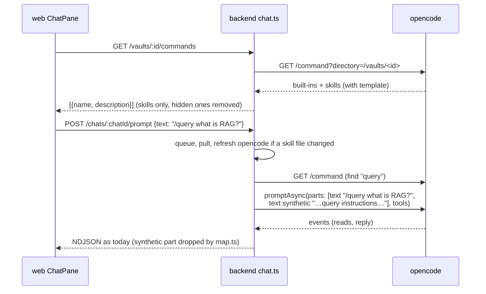
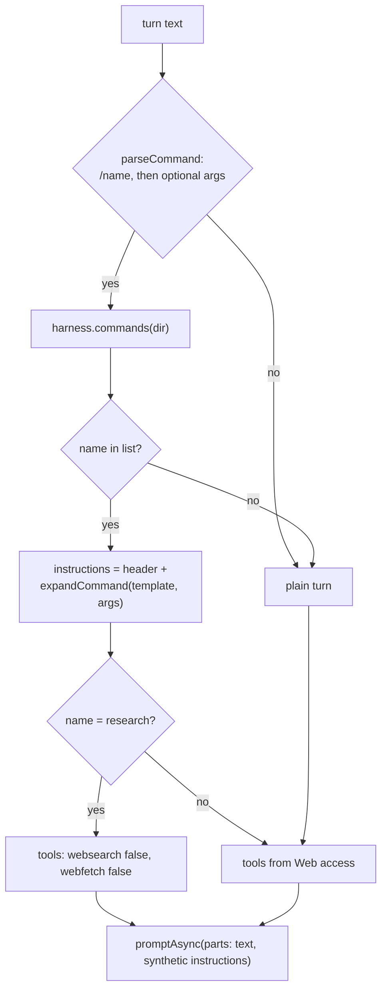
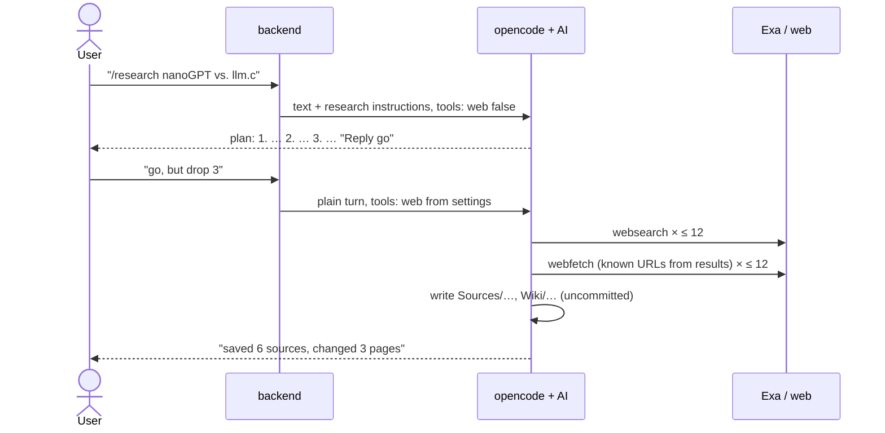
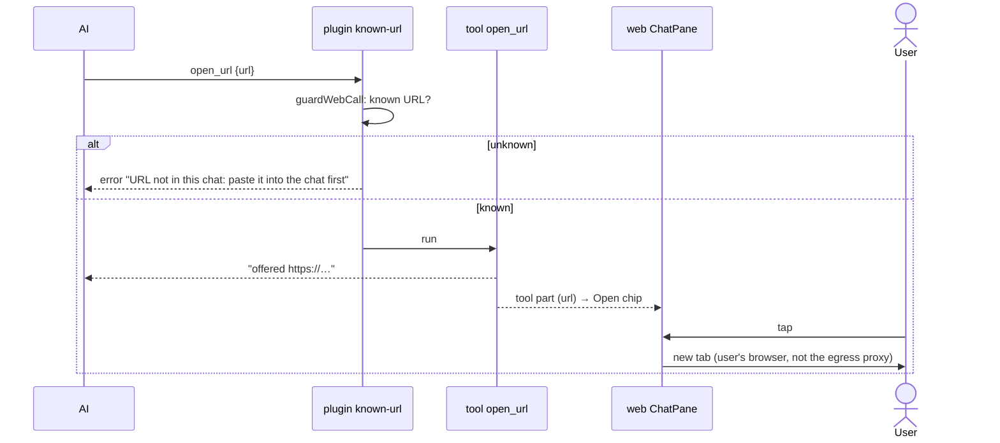

# Architecture: chat commands, deep research and web links

## Approach in one picture

- **Commands are skills, listed by opencode.** The backend asks opencode for the vault's command list
  (`GET /command`) and keeps only the skills.
- **A command turn is a normal turn.** The backend sends the user's text plus the skill's instructions
  as a hidden (`synthetic`) part through the same `promptAsync` call as every turn. It never uses
  opencode's command endpoint, because that one runs shell snippets from skill files.
- **Research is a skill that ships in the opencode image**, next to `open_note`. The only backend rule
  for it: the turn that starts it gets no web tools.
- **`open_url` is a custom tool in the image.** The `known-url` plugin guards it like `webfetch`. The web
  app shows its call as a link chip.

## Facts this design rests on (verified at opencode v1.18.25)

From the source at tag `v1.18.25` (`anomalyco/opencode`, commit `cb7d8b2`, paths under
`packages/opencode/src/`) and from the running dev container on the pinned image, on 2026-10-04.

| # | Fact | Evidence |
|---|---|---|
| F1 | **Skills appear in `GET /command`.** The list holds the built-ins `init` and `review` (`source: "command"`, `review` with `subtask: true`), then config commands and MCP prompts, then one entry per skill with `source: "skill"`, `hints: []` and a `template`. A command of the same name wins over a skill. `GET /skill` lists the same skills separately (with `location`, `content`); we don't need it. | `command/index.ts` (`for (const item of yield* skill.all())`); container: `my-life-wiki` → `init, review, customize-opencode, archify`; `mein-llm-wiki` → `…, query`; `small` → only the three built-ins |
| F2 | **The list is per directory.** `?directory=/vaults/<id>` returns that vault's skills: `.claude/skills/**/SKILL.md` and `.agents/skills/**/SKILL.md` walking up from the directory, the same in `$HOME` (empty for us), then `{skill,skills}/**/SKILL.md` in every config dir, the global one (`/opt/opencode-config/opencode`) included. A later skill of the same name replaces an earlier one, so **a skill in the image wins over a vault skill** of that name. | `skill/index.ts` lines 180–230 (scan order), 125–134 (`state.skills[name] =` after a duplicate warning) |
| F3 | **Command files (`.md`) come only from config dirs**: `{command,commands}/**/*.md` in the global config dir and in `.opencode/` dirs up the tree. `.claude/commands/` is not read. A vault `.opencode/` disables chat (security.md), so a vault can't add command files. | `config/command.ts` (`Glob.scan("{command,commands}/**/*.md")`), `config/paths.ts` (`directories`) |
| F4 | **`POST /session/:id/command` runs shell.** It replaces every `` !`cmd` `` in the template with the output of `cmd`, run through a shell with no permission check (`bash: deny` doesn't apply), and resolves `@file` references into file parts. The prompt path (`promptAsync`) does neither. | `session/prompt.ts` lines 1397–1407 (`ConfigMarkdown.shell`, `Process.text`), 1432 (`resolvePromptParts`), only inside `command()`; container probe: a skill with `` !`id -u; echo $OPENCODE_MODEL` `` sent through the endpoint stored the user message `1000\nopenrouter/z-ai/glm-5.3` |
| F5 | **The command endpoint can't carry the per-turn tools map.** `CommandInput` has `messageID, sessionID, agent, model, arguments, command, variant, parts` and no `tools`. A command turn would run with whatever permission the session's last prompt set. | `session/prompt.ts` line 1536 |
| F6 | **Argument rules:** `$1`…`$N` take positional arguments (the highest takes the rest), `$ARGUMENTS` takes all; with neither, the arguments are appended after a blank line. A skill's template is its body plus two lines naming its base directory. | `session/prompt.ts` lines 1372–1395; `command/index.ts` (skill `template` getter) |
| F7 | **The list is cached per directory** until the instance is disposed. A skill added after the first listing doesn't show; after `POST /instance/dispose?directory=…` it does. Disposing re-runs config loading for that directory. | container test: `late` skill absent on the second listing, present after dispose; `effect/instance-state.ts` (`ScopedCache` per directory) |
| F8 | **A `synthetic` text part reaches the model.** Only `ignored` parts are dropped when building the model messages. `map.ts` already drops `synthetic` text parts from what the app shows. | `session/message-v2.ts` line 206 (`!part.ignored`); `apps/backend/src/harness/map.ts` `mapPart` |
| F9 | **SDK names:** `client.command.list({ directory })` and `client.instance.dispose({ directory })`; `TextPartInput` has `synthetic?: boolean`. | `@opencode-ai/sdk` 1.18.25, `dist/v2/gen/sdk.gen.d.ts`, `types.gen.d.ts` |
| F10 | **The `skill` tool is offered and allowed** (default `"*": "allow"`; tool ids for `/vaults/small` include `skill`). The model can load a skill by itself, as today. | `agent/agent.ts` line 120; `GET /experimental/tool/ids` |
| F11 | **A page can't open a tab on its own.** `window.open` without a recent user tap (transient activation) is blocked by the popup blocker. An `<a target="_blank">` the user taps always works. | HTML Standard, "transient activation" / "allowed to show a popup" |

**Consequences:**

- **F4 + F5** rule out the command endpoint. Any vault author could put `` !`cat /run/secrets/…` `` in a
  `SKILL.md`; the env holds the provider keys and the opencode password. The prompt path keeps every
  existing guard.
- **F1 + F3:** for us, commands are exactly the skills. The built-ins are useless here: `init` writes an
  `AGENTS.md` for code repos and wants the denied `question` tool, `review` runs as a subtask (`task` is
  denied) and needs git, which the image lacks.
- **F2:** the app's `research` skill can't be shadowed by a vault. A vault that wants its own research
  flow names its skill differently.
- **F7:** without a refresh, a skill pulled from GitHub never shows until opencode restarts. The skill
  tool reads the same cache, so the AI couldn't load it either.

## Components

### 1. Command list (backend)

- **`harness/opencode.ts`:**
  - `commands(dir): Promise<HarnessCommand[]>` calls `command.list({ directory: dir })` and keeps entries
    with `source === 'skill'` whose name isn't in `HIDDEN = ['customize-opencode']`. Each entry is
    `{ name, description, template }`; a lazy MCP template can't occur (no MCP servers).
  - `refresh(dir): Promise<void>` calls `instance.dispose({ directory: dir })`.
  - Both join the `Harness` interface, so the boundary stays small and harness-neutral.
- **Refresh rule (`chat.ts`).** A **skill stamp** per vault: the sorted list of `path:mtime:size` of every
  `SKILL.md` under `.claude/skills/` and `.agents/skills/` in the vault root and each of its folders up to
  the clone root. The stamp is cheap (a few `stat`s) and lives in memory.
  - When the stamp differs from the one last seen, the backend calls `refresh(dir)`, but only when **no
    turn runs or is adopted in that vault**, i.e. nobody holds its turn lock. Disposing tears down the
    instance, so it must never hit a running turn. While a turn runs, `GET /commands` returns the cached
    list, and the stamp stays "changed" until the next check.
  - Checked in two places: inside `kick()`'s exclusive-lock callback right after the pull (the turn's
    slot is reserved, its prompt not sent), and in `GET /commands` when the vault is idle.
  - The first check after a backend start counts as "changed": opencode may have outlived the backend
    with an old list.
  - A user's or the AI's edit of a `SKILL.md` changes the stamp too, so it is picked up the same way.
- **Route `GET /vaults/:id/commands`** (`app.ts`) → `ChatService.commands(vaultId)`:
  - same checks as the chat routes: `409 not-ready`, `409 unsafe-config`, `503` when opencode is down;
  - returns `Command[] = { name, description }[]`, sorted by name; the template stays on the server.
  - `Command` goes into `@karpathy/shared`.

### 2. Command turns (backend)

- **`harness/command.ts` (new, pure):**
  - `parseCommand(text): { name, args } | null`: the text must start with `/` and a name of
    `[A-Za-z0-9][\w.:-]*`, then whitespace or the end. Everything after the name is `args`.
  - `expandCommand(template, args): string` follows opencode's rules (F6) for `$1…$N` and
    `$ARGUMENTS`, with one difference: with no placeholder, nothing is appended, because the user's own
    text already carries the arguments. `` !`…` `` and `@file` stay literal text (F4).
  - The instructions part reads: "The user started the command `/<name>`. Its arguments are the text after
    the name in their message. Follow these instructions for this turn:" plus the expanded template.
- **`PromptInput` gets `instructions?: string`.** `OpencodeHarness.prompt` and `promptSync` send it as a
  second text part with `synthetic: true` (F8, F9). Nothing outside `harness/` sees the part shape.
- **`ChatService.kick()`:** after the pull and the refresh, it parses the turn text. Only a name in the
  vault's list makes a command turn; anything else stays a plain turn, so `/etc/hosts is…` is a question.
  A failing `commands()` call fails the turn like a failing prompt (error event, turn ends).
- **Queue and restart:** the queue still stores only `{ chatId, text }`. The command is found again from
  the text when the turn starts, so a queued command survives a backend restart unchanged.
- **Title:** the first prompt names the chat as today (`/research nanoGPT vs. llm.c`).

### 3. Command palette and chips (web)

- **`lib/commands.ts` (new, pure):**
  - `paletteQuery(text): string | null`: the partial name while the text is `/` plus name characters and
    nothing else; `null` once there is a space or other text.
  - `filterCommands(list, q)`: case-insensitive; prefix matches first, then other substring matches, each
    A–Z.
  - `chipCommands(list, recent, n = 4)`: names in `recent` (newest first) that are still in the list,
    then the rest A–Z, cut at `n`.
  - `recentCommands(vaultId)` / `recordCommand(vaultId, name)`: `localStorage` key
    `karpathy.recentCommands.<vaultId>`, at most 10 names. Every access sits in `try/catch`; without
    storage the chips fall back to A–Z.
- **`api.commands(vaultId)`** in `lib/api.ts`.
- **`ChatPane` › `Conversation`:**
  - loads the command list when it mounts and again when the palette opens and the list is older than
    60 s, so a pulled skill shows without a reload;
  - **palette:** a `listbox` above the composer while `paletteQuery(text) !== null` and the list isn't
    empty. Each row shows `/name` and the description (two lines at most, cut with "…").
    - The textarea keeps focus and points at the active row with `aria-activedescendant`.
    - ↑/↓ move, Enter or Tab picks, Escape closes; tapping a row picks it.
    - Picking sets the text to `/name ` and puts the cursor at the end.
  - **chips:** in an empty chat (no messages, nothing pending), below "New chat · ask about this vault",
    a row of up to four buttons `/name`, with the description as tooltip. A tap sends `/name` through the
    normal `send` path. Disabled while offline or busy, like Send.
  - `recordCommand` runs on every send whose text parses to a listed command.
  - **The list is optional.** When `GET /commands` fails (opencode down, vault not ready, harness config),
    the palette and chips don't render and the composer works as today. Sending never waits for the list.
- **Bubble:** unchanged. The user message shows its non-synthetic text, i.e. what the user typed.

### 4. Research skill (opencode image)

- **`deploy/opencode/skills/research/SKILL.md` (new)**, copied by the `Dockerfile` to
  `/opt/opencode-config/opencode/skills/`, like `tools/` and `plugins/`. It is listed in every vault (F2)
  and can't be shadowed by one.
- **It must be self-contained:** its base directory lies outside the vault, where `external_directory:
  deny` blocks reads.
- **Frontmatter:** `name: research`, and a `description` that says what to type: "Research a topic on the
  web and write cited wiki pages. Type /research and the topic."

What the skill tells the AI:

| Part | Instructions |
|---|---|
| **Conventions first** | Follow the vault's own instructions (`AGENTS.md`, `CLAUDE.md`, an ingest skill) for where sources and pages go and what their frontmatter looks like. Use the rest of this skill where they say nothing. |
| **Plan turn** (the turn that starts with `/research`) | Read the wiki's index and the pages on the topic. Propose 3–6 numbered sub-questions; mark what the wiki already covers. Say the budget: at most 8 sources. End with: "Reply **go** to start, or send the list changed." Don't search, fetch or write anything. With no topic, ask for one. |
| **Run turn** (the user's reply) | No web tools → tell the user to turn on Web access in Settings and stop. Otherwise: per sub-question at most 2 web searches; pick useful results; before fetching, search `Sources/` for the URL and skip it if it's there; fetch; save a source file; at most 8 new sources per run. Then create or update wiki pages that answer the questions and cite the source files; update the index and log pages if the vault has them. |
| **Source file** | `Sources/<YYYY-MM-DD>-<slug>.md` (the vault's existing `Sources/` folder, any case). Frontmatter `type: source`, `url`, `title`, `fetched` (date). Body: a summary in the vault's language plus short quotes, never the whole page. |
| **Citations** | Every claim from the web names its source file: frontmatter `sources:` and an inline `[[Sources/…]]` link. |
| **Stop and ask** | At a cap error ("limit reached") or after 8 sources: stop, list the open sub-questions, ask "Reply **continue** to go on." |
| **Read-only** | When an edit is denied (conflict), answer in the chat with the URLs, save nothing, and say why. |
| **Close** | List the source files saved and the pages changed. |

- **Plan turn without web, enforced by the backend.** `kick()` sends
  `tools: { websearch: false, webfetch: false }` when the command is `research`, whatever Web access says.
  The tools map replaces the session's rules on every turn (system fact, web-search change), so the next
  turn gets the user's setting back.
- **How a run fits the caps.** The caps count tool calls after the last user message, per turn
  (`callsThisTurn`). Budget of one run turn: at most 12 searches (6 × 2) and about 8–12 fetches, under 20 /
  20 with room for a failed fetch. A larger topic continues in a new turn after the user's "continue",
  and that turn has fresh caps. Search results are tool output, so their URLs are known and fetches of
  chosen hits pass the known-URL check.
- **Not a dollar cap.** The app doesn't count tokens or money. The bounds are the turn caps, the 8-source
  budget and the user's reply before each block.

### 5. `open_url` (opencode image, backend map, web)

- **`deploy/opencode/tools/open_url.ts` (new)**, baked like `open_note`:
  - args `{ url: string }`;
  - `execute` parses the URL (WHATWG), refuses anything but `http:`/`https:` ("Only http(s) pages can be
    opened"), and returns `offered <url>`. It fetches nothing.
  - Description: "Offer a web page to the user, who opens it in their browser with a tap. Use it only
    when the user asks to open, show or see a web page. The URL must already appear in this chat (the
    user's messages, notes you read, search results). For vault notes use open_note; to read a page
    yourself use webfetch."
- **`deploy/opencode/plugins/known-url.ts`:** the hook runs for `open_url` too and applies the known-URL
  check (no cap: the user taps each chip). The decision moves into a pure function in
  `lib/known-url.ts`, `guardWebCall(tool, args, messages, caps): string | null` (the error message, or
  `null` to allow), so it is unit-tested without opencode. The hook loads the messages and throws what it
  returns.
- **`deploy/opencode/opencode.json`:** `"open_url": "allow"` in `vault` and `vault-readonly`, next to
  `open_note`; `commit-message` keeps `"*": "deny"`. It doesn't depend on Web access: the server makes no
  request.
- **`Dockerfile` bake probe:** waits for `open_url` in the tool ids as well.
- **`harness/map.ts`:** `ToolCall.url` is set for `open_url` as for `webfetch`. `opens` stays `false`:
  `opens` drives the automatic note opening, and a link offer never opens by itself.
- **`lib/chat.ts`:** `toolLabel` → `open <host><path…>`; `toolHref` returns the URL for a completed
  `open_url` too.
- **`ChatPane` › `ToolChip`:** a completed `open_url` is an `<a target="_blank" rel="noopener noreferrer">`
  styled as an action chip (arrow icon, label "Open <host/path>", full URL as tooltip). A refused one is
  the usual error chip; tapping it shows "URL not in this chat: …".

## Security

| Risk | Guard | What remains |
|---|---|---|
| Shell in a skill file (`` !`…` ``) runs in opencode and reads the env (F4) | Commands go through `promptAsync` only; the skill text is sent as plain text. A test pins that a `` !`id -u` `` stays literal. | None known. |
| A command turn runs with stale web permission (F5) | Same as above: every turn sends its tools map. | — |
| Vault data leaves through a **link offer** | Known-URL check for `open_url` (same function as `webfetch`), plus the user's tap on a chip that shows the host | The AI can offer an attacker URL that is already in a note, without added data. |
| A URL inside a skill becomes known | Skill text counts as user text in `knownTexts`. A skill is vault content, as trusted as a note the AI reads, whose URLs are known too. | Same as for notes. |
| Research spends before the user agreed | Plan turn without web tools, by the backend | Model tokens of the plan turn. |
| Research runs away | Web caps per turn; 8-source budget; the next block needs the user's reply | A model that ignores the budget still stops at 20 / 20. |
| Injected web content lands in `Sources/` and `Wiki/` | None at fetch time (as today) | Diff review before commit (ADR 0001). |
| A refresh kills a running turn (F7) | Dispose only when the vault has no running or adopted turn, under the turn lock | — |
| Links in AI reply text | Not in this change | Listed as a gap in the proposal. |

## Tradeoffs considered

| Option | Why not |
|---|---|
| opencode's `POST /session/:id/command` (the issue's plan) | Runs shell snippets from skill files (F4), can't set the per-turn tools map (F5), runs `subtask` commands through the denied `task` tool. |
| Hidden part "call the skill tool with name X" instead of the skill text | Depends on the model calling the tool; the small dev model often doesn't. Inlining the text works with every model. |
| Backend scans `.claude/skills` itself | Re-implements opencode's discovery (ADR 0002), and the AI's `skill` tool would still see the stale list. |
| `/research` as a `command` in the managed `opencode.json` | Shows as `source: "command"`, the kind we hide; a skill can be reloaded by the AI with the `skill` tool in later turns. |
| Approval dialog or "Start" button for the plan | Approval inside a turn needs `ask`, which security.md rules out. A button that sends "go" is possible later; the reply already works on every device. |
| Research as a background job | Turns already outlive the connection; jobs and push notifications are a separate roadmap item. |
| GPT Researcher as an MCP server | A new service, its own keys and its own outbound path past the known-URL guard. |
| Open the tab automatically when the call completes | Blocked by browsers without a tap (F11); the tap is also the user's check. |
| `open_url` only with Web access on | The server makes no request; the switch is about what the server sends out. |
| Variables `{activeNote}` / `{selection}` | Skills have no such placeholders; it needs a template format of our own. Later, if wanted. |

## Integration points

- **Shared types:** `Command { name; description }` in `@karpathy/shared`. `ToolCall` is unchanged (the
  `url` field gets a second producer).
- **Docs at archive:** `functional.md` (Chat, Skills), `domain.md` (terms above, AI capabilities), `security.md`
  (command path rule, `open_url` row in Web access, the custom-tools paragraph), `architecture.md` (route,
  harness methods, image contents). A short ADR "commands never use opencode's command endpoint" is
  worth adding then. `README.md` is updated in the plan, with the feature.
