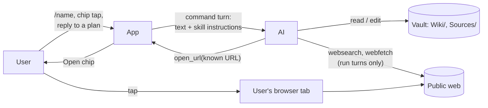
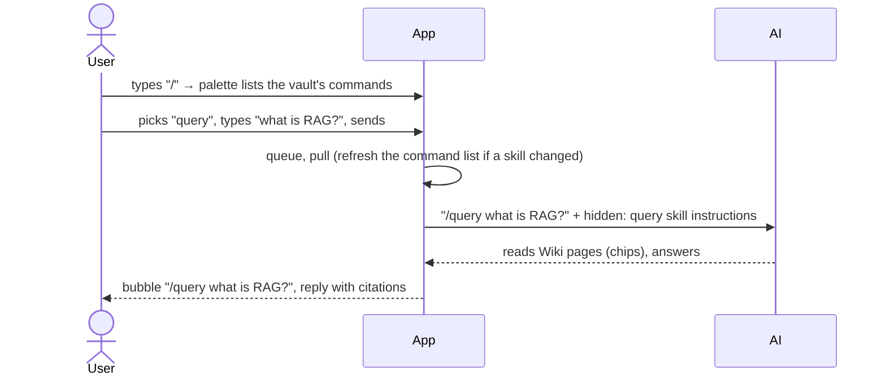
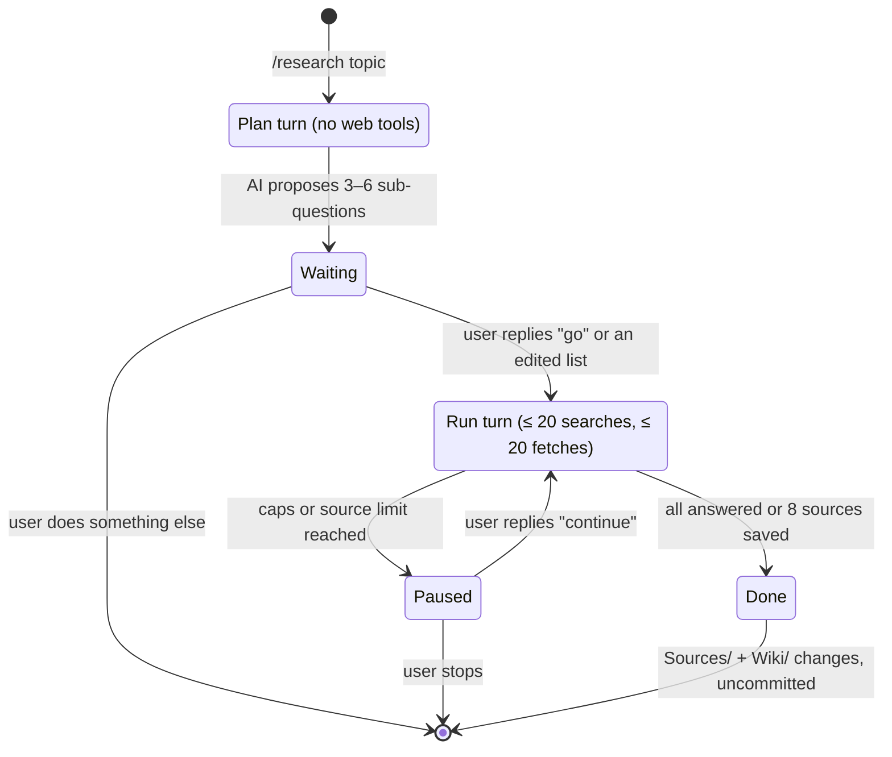
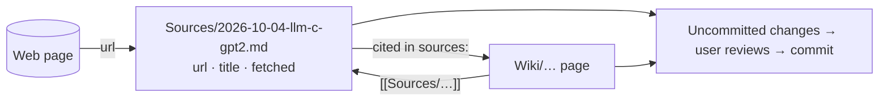
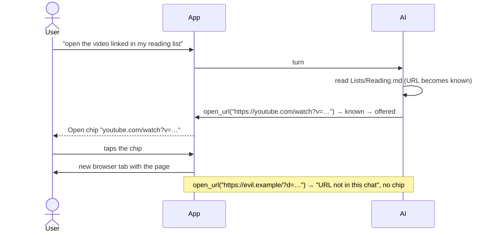

# Domain: chat commands, deep research and web links

## New and changed terms

opencode uses "command" for several things (built-in prompts, `.md` command files, skills, MCP prompts).
In this app a **command** is always a skill the user can start by name. The UI says "command"; the code
says `command` for the palette entry and `skill` only where it means opencode's skill.

| Term | Meaning | In code |
|---|---|---|
| **Command** *(new)* | A skill the chat can start by name with `/name`. Comes from the vault (`.claude/skills/<name>/SKILL.md`, `.agents/skills/…`) or ships with the app (`research`). opencode's built-ins `init`, `review` and `customize-opencode` are never commands. | `Command { name, description }` |
| **Command list** *(new)* | The commands of one vault. Differs per vault; refreshed after a pull or edit changed a skill file. | `GET /vaults/:id/commands` |
| **Command palette** *(new)* | The popover over the composer while the text is `/` plus a partial name. Filters the command list; picking an entry fills in `/name `. | `ChatPane`, `lib/commands.ts` |
| **Command chip** *(new)* | One of up to four buttons in an empty chat. A tap sends `/name` at once. Order: last used in this browser and vault first, then A–Z. | `lib/commands.ts` |
| **Command turn** *(new)* | A turn whose text starts with `/name` where `name` is in the vault's command list. The user's text is what the chat shows; the skill's instructions go to the AI as a hidden part of the same message. Any other text is a plain turn. | `chat.ts`, `harness/command.ts` |
| **Research run** *(new)* | The work started by `/research <topic>`: a plan turn, then one or more run turns. | `research` skill |
| **Research plan** *(new)* | The 3–6 sub-questions the AI proposes in the plan turn. The user confirms by replying, or edits them in the reply. | AI reply text |
| **Plan turn** *(new)* | The first turn of a research run. It always runs without web tools, so nothing goes out before the user replied. | `chat.ts` |
| **Run turn** *(new)* | A turn after the plan: web search, web fetch, saving sources, writing pages. Bound by the web caps; if questions remain, it ends by asking to continue. | |
| **Source file** *(new)* | A file in `Sources/` that a research run saved for one web page: frontmatter `url`, `title`, `fetched`, then a summary with short quotes. Never rewritten afterwards, like every source. | |
| **Citation** *(new)* | A wiki page naming the source files it rests on: frontmatter `sources:` and inline `[[Sources/…]]` links, unless the vault's own instructions say otherwise. | |
| **Link offer** *(new)* | One call of the AI's `open_url` tool. It succeeds only for a known URL. It shows an **Open chip**; nothing opens until the user taps it. | `open_url` tool, `ToolCall.url` |
| **Open chip** *(new)* | `Open <host/path>`: the chip of a completed link offer, a link that opens the page in a new tab. It joins the consulted, changed, opened, searched and fetched chip kinds. | `ToolCall` with `tool: 'open_url'` |
| **Known URL** *(changed)* | Now guards link offers too, not only web fetch. The hidden instructions of a command turn count as user text, so a URL written in a skill is known. | `lib/known-url.ts` |
| **Open request** *(unchanged)* | Still means `open_note` only: the app shows a vault note by itself. A link offer is not an open request, because it never opens anything by itself. | |

## Actors and capabilities

| Party | New relation |
|---|---|
| **User** | Starts commands from the palette or a chip; confirms or edits a research plan by replying; decides whether to open a page the AI offers. |
| **AI** | Follows a command's instructions; in a plan turn it has no web tools; offers known URLs to the user. It still can't fetch URLs it built, run commands, or commit. |
| **Vault author** (whoever pushes to the repo) | Adds commands by adding skills. A skill is instructions for the AI, not code: its shell snippets are never run. |
| **User's browser** *(new party)* | Loads a page the user opened from an Open chip, with the user's own cookies and network. The app's egress proxy is not involved. |

## Process: command turn (new)

## Process: research run (new)

What a run leaves behind:

## Process: link offer (new)

## Rules

- **A command is instructions, not code.** The app sends a skill's text to the AI as written. Shell
  snippets (`` !`…` ``) and `@file` references in it stay plain text.
- **The plan turn has no web tools.** The confirmation "before spending" is the user's next message, not a
  dialog. The app never asks for approval inside a turn.
- **Caps per turn, user reply per block.** The web caps (20 searches, 20 fetches) bound every run turn. A
  research run that needs more asks, and only the user's reply starts the next turn.
- **Sources keep their URL.** Every source file names the page it came from. A URL already in `Sources/`
  isn't saved again.
- **Link offers follow the known-URL rule** and need the user's tap. The AI offers a page only when the
  user asked to see one.
