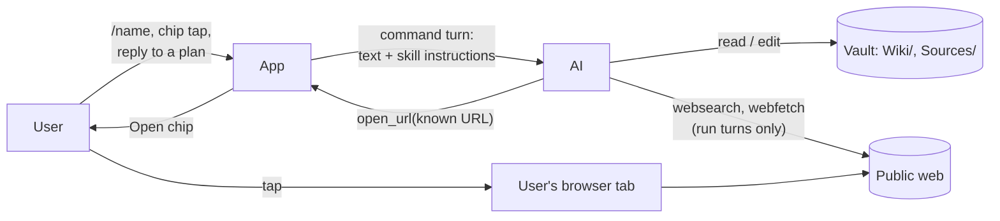
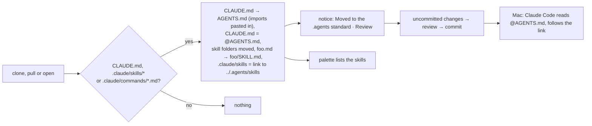
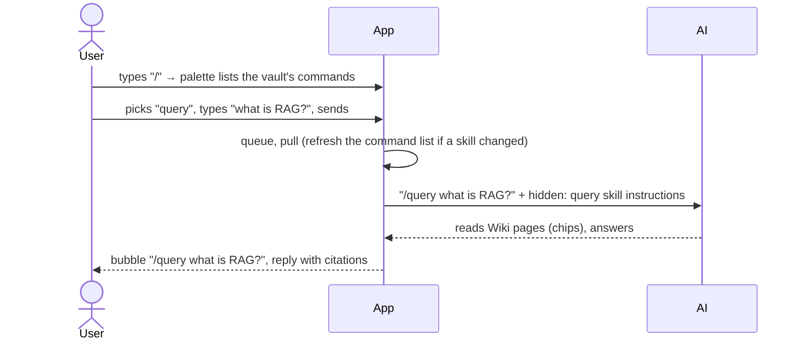
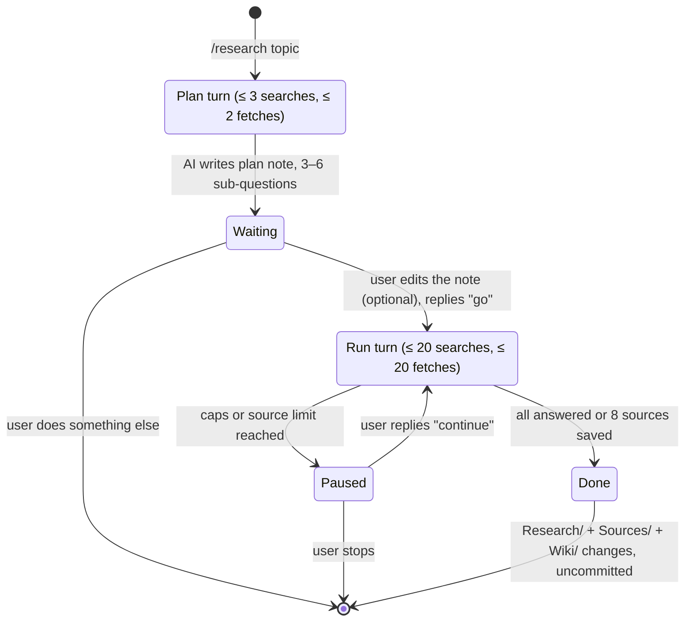
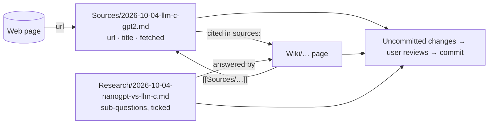
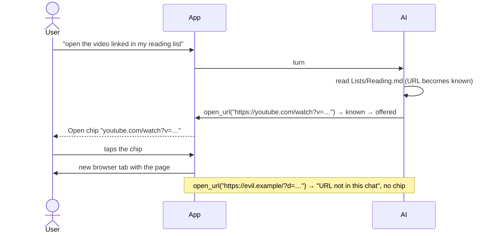

# Domain: chat commands, deep research and web links

## New and changed terms

opencode uses "command" for several things (built-in prompts, `.md` command files, skills, MCP prompts).
In this app a **command** is always a skill the user can start by name. The UI says "command"; the code
says `command` for the palette entry and `skill` only where it means opencode's skill.

| Term | Meaning | In code |
|---|---|---|
| **Command** *(new)* | A skill the chat can start by name with `/name`: a **vault skill** (from `.agents/skills/` only; `.claude/skills/` and Claude Code plugin skills are not commands) or an **app skill** (`research`). The UI always shows which of the two it is. opencode's built-ins `init`, `review` and `customize-opencode` are never commands. | `Command { name, description, source, hides? }` |
| **Vault skill** *(new)* | A skill that lives in the vault's skill folder (`.agents/skills/<name>/`). Written by the vault author, synced by git, only in that vault; Claude Code on the Mac sees it too. Examples: `query`, `lint`, `ingest`. | `Command.source = 'vault'` |
| **App skill** *(new)* | A skill that ships with karpathy.app (in the opencode image), so every vault has it; changes only with an app release; Claude Code on the Mac doesn't see it. Today only `research`. | `Command.source = 'app'` |
| **Hidden vault skill** *(new)* | A vault skill with the same name as an app skill. The app skill wins; the vault skill never runs, and the app says so and asks to rename it. | `Command.hides = true` on the app skill |
| **Skill folder** *(new)* | `.agents/skills/` in the vault root: the only place a vault's skills are read from, by the palette and by the AI. Shared with other harnesses (Codex, Cursor, Gemini CLI). | `OPENCODE_DISABLE_CLAUDE_CODE_SKILLS=1` |
| **`.agents` standard** *(new)* | The open, cross-harness layout a vault follows in this app: instructions in `AGENTS.md`, skills in the skill folder. Anthropic's `CLAUDE.md` / `.claude/` remain only as pointers for Claude Code on the Mac. | |
| **Agents move** *(new)* | What the app does by itself after every clone, pull and open of a vault that isn't in the `.agents` standard yet: moves `.claude/skills/*` into the skill folder, turns `.claude/commands/*.md` into skills, turns `CLAUDE.md` into `AGENTS.md` with its `@` imports pasted in, rewrites `CLAUDE.md` to `@AGENTS.md` (or writes it when only `AGENTS.md` exists), and leaves the **skill link** `.claude/skills → ../.agents/skills`. Never overwrites (clashes stay and are listed), skipped in conflict. Its result is uncommitted changes, announced by a notice and reviewed like any edit. | `agents-standard.ts`, event `agents-move` |
| **Command list** *(new)* | The commands of one vault. Differs per vault; refreshed after a pull or edit changed a skill file. | `GET /vaults/:id/commands` |
| **Command palette** *(new)* | The popover over the composer while the text is `/` plus a partial name. Filters the command list; picking an entry fills in `/name `. | `ChatPane`, `lib/commands.ts` |
| **Command chip** *(new)* | One of up to four buttons in an empty chat. A tap puts `/name ` in front of the composer's text (empty or a draft) and focuses it; it sends nothing. Order: last used in this browser and vault first, then A–Z. | `lib/commands.ts` |
| **Command turn** *(new)* | A turn whose text starts with `/name` where `name` is in the vault's command list. The user's text is what the chat shows; the skill's instructions go to the AI as a hidden part of the same message. Any other text is a plain turn. | `chat.ts`, `harness/command.ts` |
| **Research run** *(new)* | The work started by `/research <topic>`: a plan turn, then one or more run turns. `/research <plan note or its topic>` resumes a run in any chat, skipping the plan. | `research` skill |
| **Research plan** *(new)* | The 3–6 sub-questions of a research run, kept as a checklist in a **plan note** `Research/<YYYY-MM-DD>-<slug>.md` (folder per the vault's rules). The user may edit the note before confirming; run turns tick off answered questions and link the answering pages, so a run can resume later. The note stays after the run as its record. In conflict (read-only) the plan goes into the reply instead. | `research` skill |
| **Plan turn** *(new)* | The first turn of a research run: reads the wiki, scouts the web a little (≤ 3 searches, ≤ 2 fetches), writes the plan note and stops for the user's "go". Its tools are those of every turn; the scouting budget and the stop are skill instructions, not a backend rule. | `research` skill |
| **Run turn** *(new)* | A turn after the plan: reads the plan note, web search, web fetch, saving sources, writing pages, ticking off the note. Bound by the web caps; if questions remain, it ends by asking to continue. | |
| **Source file** *(new)* | A file in `Sources/` that a research run saved for one web page: frontmatter `url`, `title`, `fetched`, then a summary with short quotes. The vault's own rules may change folder, name and frontmatter, never the content (always a summary, never the full page). Never rewritten afterwards, like every source. | |
| **Citation** *(new)* | A wiki page naming the source files it rests on: frontmatter `sources:` and inline `[[Sources/…]]` links, unless the vault's own instructions say otherwise. | |
| **Link offer** *(new)* | One call of the AI's `open_url` tool. It succeeds only for a known URL. It shows an **Open chip**; nothing opens until the user taps it. | `open_url` tool, `ToolCall.url` |
| **Open chip** *(new)* | `Open <host/path>`: the chip of a completed link offer, a link that opens the page in a new tab. It joins the consulted, changed, opened, searched and fetched chip kinds. | `ToolCall` with `tool: 'open_url'` |
| **Known URL** *(changed)* | Now guards link offers too, not only web fetch. The hidden instructions of a command turn count as user text, so a URL written in a skill is known. | `lib/known-url.ts` |
| **Open request** *(unchanged)* | Still means `open_note` only: the app shows a vault note by itself. A link offer is not an open request, because it never opens anything by itself. | |

## Actors and capabilities

| Party | New relation |
|---|---|
| **User** | Starts commands from the palette or a chip; confirms or edits a research plan by replying; decides whether to open a page the AI offers. |
| **AI** | Follows a command's instructions; in a plan turn it scouts only a little and stops for the user's reply; offers known URLs to the user. It still can't fetch URLs it built, run commands, or commit. |
| **Vault author** (whoever pushes to the repo) | Adds commands by adding skills to `.agents/skills/` (or to `.claude/`, which the agents move picks up on the next pull). A skill is instructions for the AI, not code: its shell snippets are never run. |
| **User's browser** *(new party)* | Loads a page the user opened from an Open chip, with the user's own cookies and network. The app's egress proxy is not involved. |

## Process: agents move (new)

A name present in both places is not moved; the notice lists it. `.claude/commands/` is removed only
when every file in it was moved. Files pasted into `AGENTS.md` stay where they are; the notice offers
deleting them. Discarding the changes undoes the move until the next pull.

## Process: command turn (new)

## Process: research run (new)

What a run leaves behind:

## Process: link offer (new)

## Rules

- **App skill beats vault skill, visibly.** On a name clash the app skill runs; the palette says that the
  vault's skill of that name is hidden and should be renamed. Vault and app skills are always marked as
  such in the UI.
- **One skill folder.** A vault's commands come from `.agents/skills/` only. The app moves skills there
  automatically, never over an existing name, and always as uncommitted changes the user reviews.
- **A command is instructions, not code.** The app sends a skill's text to the AI as written. Shell
  snippets (`` !`…` ``) and `@file` references in it stay plain text.
- **Research plans before the main run, by instruction.** The plan turn scouts at most 3 searches and 2
  fetches, writes the plan note and stops; the user's next message is the confirmation, not a dialog. The
  backend gives a `/research` turn the same tools as any turn, so this rests on the model; the hard bound
  is the web caps. The app never asks for approval inside a turn.
- **Caps per turn, user reply per block.** The web caps (20 searches, 20 fetches) bound every turn. A
  research run that needs more asks, and only the user's reply starts the next turn.
- **Sources keep their URL.** Every source file names the page it came from. A URL already in `Sources/`
  isn't saved again.
- **Link offers follow the known-URL rule** and need the user's tap. The AI offers a page only when the
  user asked to see one.
