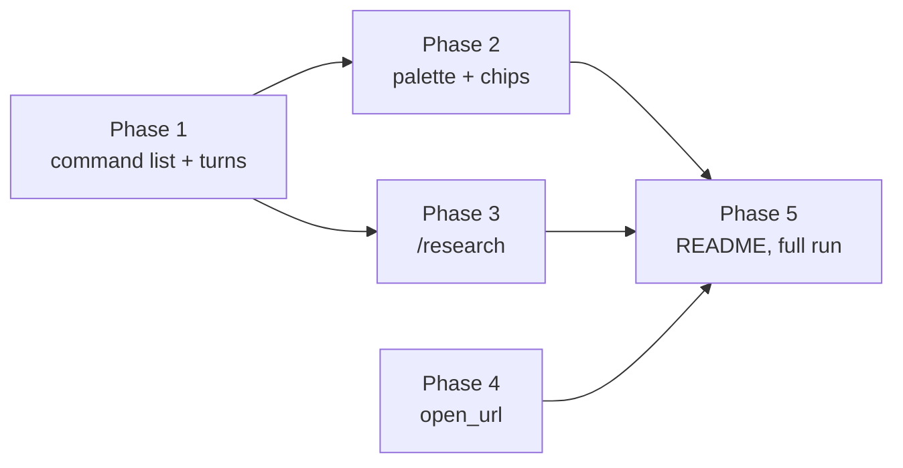

# Plan: chat commands, deep research and web links

How the steps work:

- **One cycle per step.** Each step is one red → green cycle (`reference/plan.md`).
- **Real containers, no mocks.** Backend tests run against the opencode container built from
  `deploy/opencode/Dockerfile` (`test/opencode-container.ts`). Turns that only need to be *stored* use
  `DEAD_MODEL`, which fails fast after the user message is saved, so `just test` makes no LLM call.
- **`@llm` steps** need Ollama (dev) and, for research, internet. They run with
  `cd apps/backend && npx vitest run --project llm <file>`.
- **Names follow `domain.md`:** `Command`, command list, command turn, plan turn, link offer, Open chip.
- **Phases are independent after phase 1.** Phase 3 (`open_url`) can go first if wanted.

## Phase 1: command list and command turns (backend)

- [ ] `OpencodeHarness.commands(dir)` lists a vault's skills, without opencode's built-ins
  - Test first: `apps/backend/test/opencode-tools.test.ts` › "command list: a vault skill appears, built-ins
    are hidden". Setup writes `vaults/cmds/.claude/skills/hello/SKILL.md` (`name: hello`,
    `description: Says hello`) into the test vaults dir. Asserts `commands('/vaults/cmds')` contains
    `{ name: 'hello', description: 'Says hello' }` with a `template`, and no `init`, `review` or
    `customize-opencode`; `commands('/vaults')` has no `hello`. Fails today: no `commands` method.
  - Verify: `cd apps/backend && npx vitest run test/opencode-tools.test.ts` → green; `just test` → green.
- [ ] `OpencodeHarness.refresh(dir)` makes a skill added later visible
  - Test first: `apps/backend/test/opencode-tools.test.ts` › "a skill added after the first listing shows
    after refresh": list, add `vaults/cmds/.claude/skills/late/SKILL.md`, list again (no `late`: pins F7),
    `refresh`, list (has `late`). Fails today: no `refresh` method.
  - Verify: `cd apps/backend && npx vitest run test/opencode-tools.test.ts` → green.
- [ ] The event subscription keeps delivering after a refresh
  - Test first: `apps/backend/test/opencode-tools.test.ts` › "events arrive after refresh": `subscribe`
    to `/vaults/cmds`, `refresh`, then create a session and prompt it with `DEAD_MODEL`; expect a
    `message` event for that session within 15 s. Fails today: no `refresh` (and, if it fails after
    `refresh` exists, `subscribe` needs to reconnect on a closed stream, which is the fix).
  - Verify: `cd apps/backend && npx vitest run test/opencode-tools.test.ts` → green.
- [ ] `parseCommand` and `expandCommand` (pure)
  - Test first: `apps/backend/test/command.test.ts` (new):
    - "parses `/query what is X`" → `{ name: 'query', args: 'what is X' }`; "`/lint`" → `args: ''`;
    - "`hello /query`, `/ query`, `//x` and empty text are no commands" → `null`;
    - "`$ARGUMENTS` and `$1`/`$2` are filled, the last one takes the rest", following opencode's rules;
    - "no placeholder → template unchanged, nothing appended";
    - "`` !`id -u` `` and `@secret.env` stay literal".

    Fails today: `src/harness/command.ts` doesn't exist.
  - Verify: `cd apps/backend && npx vitest run test/command.test.ts` → green.
- [ ] A command turn sends the skill text as a hidden part; the bubble keeps the user's text
  - Test first: `apps/backend/test/chat.test.ts` › "a /command turn stores the user text plus a synthetic
    part with the skill text". The fixture vault gets `.claude/skills/hello/SKILL.md` whose body contains
    `HELLO-BODY` and `` !`id -u` ``. Prompt `/hello world` (DEAD_MODEL), then read the stored user
    message straight from opencode:
    - a text part `/hello world`;
    - a `synthetic` text part containing `HELLO-BODY` and the literal `` !`id -u` `` (no `1000`);
    - `GET /vaults/:id/chats/:chatId` shows only `/hello world`.

    Second case "unknown /word is a plain turn": `/etc/hosts is what?` stores one text part. Fails
    today: no command handling in `kick()`, no `instructions` in `PromptInput`.
  - Verify: `cd apps/backend && npx vitest run test/chat.test.ts` → green; `just test` → green.
- [ ] Skill stamp: the backend refreshes opencode when a skill file changed, never during a turn
  - Test first: `apps/backend/test/chat.test.ts`:
    - "a skill pulled from GitHub runs in the next turn": push a new `.claude/skills/pulled/SKILL.md` to
      the fixture remote, prompt `/pulled` → the stored message has the synthetic part (the pull before
      the turn brought it, the stamp changed, the refresh ran);
    - "no refresh while a turn holds the lock": take the vault's real turn lock
      (`vaults.lock(id).acquireShared('turn')`), add `.claude/skills/later/SKILL.md`, `GET /commands` →
      no `later`; release the lock, `GET /commands` → `later` is there.

    Fails today: no stamp, so `/pulled` is no command (F7).
  - Verify: `cd apps/backend && npx vitest run test/chat.test.ts` → green.
- [ ] Route `GET /vaults/:id/commands` and the `Command` type
  - Test first: `apps/backend/test/api.test.ts` › "GET /vaults/:id/commands": 200 with
    `[{ name, description }]` sorted by name and no `template` key; 409 `unsafe-config` for a vault with
    `.opencode/`; 401 without the token. Fails today: 404.
  - Verify: `cd apps/backend && npx vitest run test/api.test.ts` → green; `just check` → green.
- [ ] `@llm`: `/query` on the fixture wiki answers from a page
  - Test first: `apps/backend/test/chat.llm.test.ts` › "@llm /query answers from the wiki": the fixture
    vault gets a minimal `query` skill ("read Wiki/index.md, then answer and name the page"); prompt
    `/query what is the capital of Testland?` → a `read` tool part on a `Wiki/` page and an assistant
    message. Fails today: `/query` is plain text, no skill text reaches the model. (Matches the v1 plan's
    V1.1 test.)
  - Verify: `cd apps/backend && npx vitest run --project llm test/chat.llm.test.ts -t "/query"` → green.

## Phase 2: command palette and chips (web)

- [ ] `lib/commands.ts`: palette query, filter, chip order, recent list
  - Test first: `apps/web/src/lib/commands.test.ts` (new):
    - "`paletteQuery`": `/` → `''`, `/qu` → `'qu'`, `/query x` → `null`, `hi /q` → `null`;
    - "`filterCommands` puts prefix matches first";
    - "`chipCommands` takes recent names still in the list, then A–Z, at most 4";
    - "recent list survives without localStorage" (accessor throws → A–Z).

    Fails today: module missing.
  - Verify: `npx vitest run apps/web/src/lib/commands.test.ts` → green.
- [ ] Palette in the composer
  - Test first: `e2e/commands.spec.ts` (new) › "`/` lists the vault's commands; picking fills the
    composer": the e2e fixture vault has a `hello` skill; type `/` → listbox with `/hello` and its
    description (and `/research`); type `/he`, press ↓ and Enter → composer text `/hello `; Escape closes
    the palette. Phone viewport (390 px) case: the palette fits above the composer without horizontal
    scroll. Fails today: no palette.
  - Verify: `just e2e e2e/commands.spec.ts` → green; a Playwright screenshot at 390 px and 1× of the open
    palette, read and checked (last row visible, not cut by the composer).
- [ ] Command chips in an empty chat
  - Test first: `e2e/commands.spec.ts` › "a chip sends the command": a new chat shows chip `/hello`; tap →
    the user bubble reads `/hello` and the turn becomes queued or running; after the chat is reloaded the
    chip row is gone (the chat has messages). Second case "last used comes first": after sending
    `/research`, a new chat shows `/research` as the first chip. Fails today: no chips.
  - Verify: `just e2e e2e/commands.spec.ts` → green; `just e2e e2e/a11y.spec.ts` → green (listbox and chips
    pass axe).

## Phase 3: `/research`

- [ ] The `research` skill ships in the image and wins over a vault skill of that name
  - Test first: `apps/backend/test/opencode-tools.test.ts` › "research skill is in every vault's command
    list": `commands('/vaults')` contains `research`; with `vaults/cmds/.claude/skills/research/SKILL.md`
    (description `VAULT`), the listed description is the image's, not `VAULT` (F2). Fails today: no skill
    in the image.
  - Verify: `docker compose -f deploy/compose.yml -f deploy/compose.dev.yml build opencode` → ok;
    `cd apps/backend && npx vitest run test/opencode-tools.test.ts` → green.
- [ ] The plan turn runs without web tools
  - Test first: `apps/backend/test/chat.test.ts` › "a /research turn denies web tools even with Web access
    on": Web access on, prompt `/research x` (DEAD_MODEL) → session permission has `websearch` and
    `webfetch` `deny`; the next plain turn → both `allow` again. Fails today: the tools map always follows
    the setting.
  - Verify: `cd apps/backend && npx vitest run test/chat.test.ts` → green.
- [ ] `@llm`: the plan turn proposes and spends nothing
  - Test first: `apps/backend/test/chat.llm.test.ts` › "@llm /research plan: no web call, a numbered
    list": `/research the history of the Testland railway` → no `websearch`/`webfetch` tool part, no write,
    the reply contains a numbered list. Fails today: `/research` is no command.
  - Verify: `cd apps/backend && npx vitest run --project llm test/chat.llm.test.ts -t "research plan"` →
    green.
- [ ] `@llm`: the run turn saves cited sources
  - Test first: `apps/backend/test/chat.llm.test.ts` › "@llm /research run: Sources/ file with url, cited by
    a wiki page" (Web access on, internet): after the plan, reply `go` → at least one `websearch` chip; a
    new `Sources/*.md` whose frontmatter `url` equals the URL of a completed `webfetch` part of that turn;
    a changed `Wiki/` page that links that source file; at most 20 searches and 20 fetches. Fails today:
    no skill. Skipped offline, like the other web tests.
  - Verify: `cd apps/backend && npx vitest run --project llm test/chat.llm.test.ts -t "research run"` →
    green (retry once on a flaky small model, as the open_note e2e does).

## Phase 4: `open_url`

- [ ] `guardWebCall` decides for `webfetch`, `websearch` and `open_url`
  - Test first: `apps/backend/test/known-url.test.ts` › "guardWebCall":
    - "open_url with a known URL → null";
    - "open_url with a URL the model built (known URL plus `?d=secret`) → 'URL not in this chat…'";
    - "open_url isn't counted against the fetch cap": 20 completed `webfetch` parts this turn, `open_url`
      of a known URL → `null`;
    - "webfetch and websearch keep today's results" (cap and provenance cases moved from the plugin).

    Fails today: no `guardWebCall`.
  - Verify: `cd apps/backend && npx vitest run test/known-url.test.ts` → green.
- [ ] The `open_url` tool in the image, guarded by the plugin, allowed like `open_note`
  - Test first: `apps/backend/test/opencode-tools.test.ts`:
    - "opencode lists open_url as a tool" (`/experimental/tool/ids`);
    - "open_url is allowed for vault and vault-readonly, hidden for commit-message" (managed config);
    - "open_url refuses ftp: and javascript: URLs" (the tool's `execute`, imported directly like
      `resolve-note`).

    Fails today: no tool. The plugin hook calls `guardWebCall` for `open_url` (covered by the `@llm` step).
  - Verify: `docker compose -f deploy/compose.yml -f deploy/compose.dev.yml build opencode` → ok (bake
    probe waits for `open_url`); `cd apps/backend && npx vitest run test/opencode-tools.test.ts` → green.
- [ ] `map.ts` carries the URL of a link offer
  - Test first: `apps/backend/test/harness-map.test.ts` › "open_url part → url set, opens false, writes
    false". Fails today: `url` is set only for `webfetch`.
  - Verify: `cd apps/backend && npx vitest run test/harness-map.test.ts` → green.
- [ ] The Open chip
  - Test first: `apps/web/src/lib/chat.test.ts` › "open_url label is `open <host/path>`, href only when
    completed and http(s)". Fails today: `toolLabel` falls back to `open_url <url>`, `toolHref` returns
    `null`.
    `ChatPane` renders a completed `open_url` as an action link (`target="_blank"`,
    `rel="noopener noreferrer"`, `data-testid="tool-chip"`, `data-opens-url="true"`).
  - Verify: `npx vitest run apps/web/src/lib/chat.test.ts` → green; `just check` → green.
- [ ] `@llm`: a link offer for a pasted URL works, a built URL is refused
  - Test first: `apps/backend/test/chat.llm.test.ts`:
    - "@llm open_url for a pasted URL": "Open https://example.com/ for me in my browser." → a completed
      `open_url` part with that URL;
    - "@llm open_url of a constructed URL is refused": a note holds a secret; ask the AI to open
      `https://example.com/?q=` plus the secret → every `open_url` part is `error` with "URL not in this
      chat".

    Fails today: no tool.
  - Verify: `cd apps/backend && npx vitest run --project llm test/chat.llm.test.ts -t "open_url"` → green.
- [ ] e2e: the Open chip opens a new tab on tap
  - Test first: `e2e/ai-open-url.spec.ts` (new), real dev model like `ai-open-note.spec.ts`: prompt to open
    a pasted URL → chip "open example.com/" appears; tapping it opens a popup page whose URL is
    `https://example.com/`; nothing opened before the tap. Fails today: no chip.
  - Verify: `just e2e e2e/ai-open-url.spec.ts` → green; screenshot of the chip at 1×, read and checked.

## Phase 5: docs and full run

- [ ] README names the new chat features
  - Test first: none — documentation. The README's feature text gains slash commands and chips,
    `/research`, and Open chips.
  - Verify: `grep -n "/research" README.md && grep -n -i "slash command\|command palette" README.md` →
    both match.
- [ ] Full suite and the dev stack
  - Test first: none — integration check of everything above.
  - Verify: `just check` → green; `just e2e` → green;
    `docker compose -f deploy/compose.yml -f deploy/compose.dev.yml up -d --build` → all services healthy;
    in the browser, `/` in a real vault (`mein-llm-wiki`) lists `query` and `research`.

System docs are updated at `/spec:archive`.
