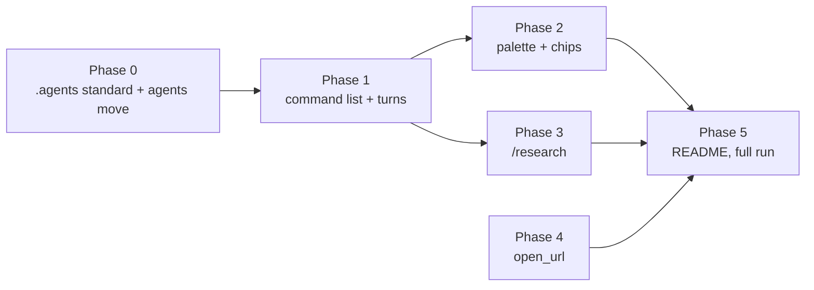

# Plan: chat commands, deep research and web links

How the steps work:

- **One cycle per step.** Each step is one red → green cycle (`reference/plan.md`).
- **Real containers, no mocks.** Backend tests run against the opencode container built from
  `deploy/opencode/Dockerfile` (`test/opencode-container.ts`). Turns that only need to be *stored* use
  `DEAD_MODEL`, which fails fast after the user message is saved, so `just test` makes no LLM call.
- **`@llm` steps** need Ollama (dev) and, for research, internet. They run with
  `cd apps/backend && npx vitest run --project llm <file>`.
- **Names follow `domain.md`:** `.agents` standard, agents move, skill folder, `Command`, command list, command turn, plan turn, link offer, Open chip.
- **Phase 0 comes first** (the skill folder decides what phase 1 lists). After phase 1 the phases are
  independent; phase 4 (`open_url`) can go first if wanted.

## Phase 0: the `.agents` standard and the agents move

- [ ] opencode reads skills from `.agents/skills/` only, and still loads the vault's `CLAUDE.md`
  - Test first: `apps/backend/test/opencode-tools.test.ts` › "only .agents/skills are skills": setup writes
    `vaults/flag/.claude/skills/old/SKILL.md` and `vaults/flag/.agents/skills/new/SKILL.md`; `GET /skill`
    (or `command.list`) for `/vaults/flag` has `new`, not `old`, and still has the image's skills. Fails
    today: `old` is listed (no flag). Pins F12.
  - Test first: `apps/backend/test/chat.llm.test.ts` › "@llm the vault's CLAUDE.md still applies with the
    flag": the fixture vault's `CLAUDE.md` says "end every reply with the word PINEAPPLE"; a plain turn's
    reply contains `PINEAPPLE`. Pins F12 (verified in the binary 2026-10-05) against opencode upgrades.
  - Implement: `ENV OPENCODE_DISABLE_CLAUDE_CODE_SKILLS=1` in `deploy/opencode/Dockerfile`.
  - Verify: `docker compose -f deploy/compose.yml -f deploy/compose.dev.yml build opencode` → ok;
    `cd apps/backend && npx vitest run test/opencode-tools.test.ts` → green;
    `npx vitest run --project llm test/chat.llm.test.ts -t "CLAUDE.md"` → green.
- [ ] opencode reads `AGENTS.md` over `CLAUDE.md` (pins F13)
  - Test first: `apps/backend/test/chat.llm.test.ts` › "@llm AGENTS.md wins over CLAUDE.md": the vault has
    `AGENTS.md` ("end every reply with MANGO") and `CLAUDE.md` = `@AGENTS.md`; a plain turn's reply
    contains `MANGO` and not the literal `@AGENTS.md` instruction. Fails today only if F13 is wrong; it
    guards upgrades.
  - Verify: `cd apps/backend && npx vitest run --project llm test/chat.llm.test.ts -t "AGENTS.md wins"` →
    green.
- [ ] `scanLegacy` finds what to move
  - Test first: `apps/backend/test/agents-standard.test.ts` (new), on a temp git repo with
    `core.symlinks=false`: `.claude/skills/a/SKILL.md` + `.claude/commands/b.md` + `CLAUDE.md` → all three
    found; a plain file `.claude/skills` (the stub), no commands, `CLAUDE.md` = `@AGENTS.md\n` → nothing;
    no `.claude/`, no `CLAUDE.md` → nothing. Fails today: module missing.
  - Verify: `cd apps/backend && npx vitest run test/agents-standard.test.ts` → green.
- [ ] `migrateToAgents`: `CLAUDE.md` → `AGENTS.md` with imports pasted in
  - Test first: `apps/backend/test/agents-standard.test.ts`:
    - "imports pasted in": `CLAUDE.md` = `# Entry\n@Schema/CLAUDE.md\nmore` and `Schema/CLAUDE.md` =
      `RULES` → `AGENTS.md` = `# Entry\nRULES\nmore`, `CLAUDE.md` = `@AGENTS.md`, `inlined:
      ['Schema/CLAUDE.md']`, `Schema/CLAUDE.md` still there;
    - "a missing or outside import stays as text": `@nope.md` and `@../../etc/passwd` lines unchanged;
    - "only one level": an import inside `Schema/CLAUDE.md` stays as its `@` line;
    - "`AGENTS.md` exists → clash": both files unchanged, `skipped: ['AGENTS.md']`;
    - "`AGENTS.md` without `CLAUDE.md`": `CLAUDE.md` = `@AGENTS.md` written, `AGENTS.md` unchanged;
    - "an `@path` inside a sentence stays text"; "`@AGENTS.md` plus extra lines → clash".

    Fails today: no `migrateToAgents`.
  - Verify: `cd apps/backend && npx vitest run test/agents-standard.test.ts` → green.
- [ ] `migrateToAgents`: skills moved, commands converted, clashes skipped
  - Test first: `apps/backend/test/agents-standard.test.ts`:
    - "skill folder moved whole": `.claude/skills/a/{SKILL.md,ref.md}` → `.agents/skills/a/{SKILL.md,ref.md}`;
    - "command becomes a skill": `.claude/commands/b.md` with frontmatter `description: Bee` and body
      `Do $ARGUMENTS` → `.agents/skills/b/SKILL.md` with `name: b`, `description: Bee`, body unchanged;
      without frontmatter the first non-empty line is the description;
    - "a clashing name stays": `.agents/skills/a/` exists → `.claude/skills/a/` untouched, `skipped: ['a']`,
      no link written;
    - "commands only still get the link": no `.claude/skills/`, only `.claude/commands/b.md` → `b` converted,
      `.claude/skills` stub written and staged as a link;
    - "`.claude/commands/` removed only when empty".

    Fails today: no skill handling in `migrateToAgents`.
  - Verify: `cd apps/backend && npx vitest run test/agents-standard.test.ts` → green.
- [ ] The skill link is committed as a real symlink
  - Test first: `apps/backend/test/agents-standard.test.ts` › "the commit carries a symlink": after
    `migrateToAgents`, run the app's commit path (`repo.ts`, `git add -A` + commit) in the temp clone, then
    `git ls-files -s .claude/skills` → mode `120000`, blob content `../.agents/skills`; a fresh clone with
    `core.symlinks=true` has `.claude/skills` as a symlink resolving to `.agents/skills`, and
    `.claude/skills/a/SKILL.md` readable through it. Fails today: no link.
  - Verify: `cd apps/backend && npx vitest run test/agents-standard.test.ts` → green.
- [ ] The move runs by itself after clone, pull and open, and is announced
  - Test first: `apps/backend/test/api.test.ts` › "agents move":
    - "on open": fixture vault with `CLAUDE.md` and `.claude/skills/x/`; `POST /vaults/:id/open` → the
      events stream delivers `agents-move` with `moved: ['x'], instructions: true`; `GET /vaults/:id/changes`
      lists `AGENTS.md`, `CLAUDE.md`, the moved files and `.claude/skills` as uncommitted;
    - "after a pull": push `.claude/commands/y.md` to the fixture remote, then a turn (DEAD_MODEL) pulls →
      `.agents/skills/y/SKILL.md` exists, a second `agents-move` event;
    - "not in conflict": a vault in conflict with `CLAUDE.md` → no move, no event;
    - "a clash is reported once": `.agents/skills/x` and `.claude/skills/x` both exist → one event with
      `skipped: ['x']`; a second pull → no new event;
    - "discard undoes the move": `POST /vaults/:id/discard` of all changes → `.claude/skills/x/` and the
      original `CLAUDE.md` are back, `AGENTS.md` gone, `git ls-files -s .claude/skills` shows no `120000`.
      Likely touch point: discard in `repo.ts`; if it only restores the work tree (`git checkout --`), the
      staged `120000` entry survives and the index must be reset for those paths too.

    Fails today: no move.
  - Verify: `cd apps/backend && npx vitest run test/api.test.ts` → green.
- [ ] `@llm`: after the move, the AI follows the rules that were behind an import
  - Test first: `apps/backend/test/chat.llm.test.ts` › "@llm imported rules reach the AI after the move":
    the vault's `CLAUDE.md` = `@Schema/CLAUDE.md`, and that file says "end every reply with KIWI"; open the
    vault (the move runs), then a plain turn → the reply contains `KIWI`. Fails today: opencode sees only
    the `@` line (F13).
  - Verify: `cd apps/backend && npx vitest run --project llm test/chat.llm.test.ts -t "imported rules"` →
    green.

The move notice is tested in phase 2.

## Phase 1: command list and command turns (backend)

- [ ] `OpencodeHarness.commands(dir)` lists a vault's skills, without opencode's built-ins
  - Test first: `apps/backend/test/opencode-tools.test.ts` › "command list: a vault skill appears, built-ins
    are hidden". Setup writes `vaults/cmds/.agents/skills/hello/SKILL.md` (`name: hello`,
    `description: Says hello`) into the test vaults dir. Asserts `commands('/vaults/cmds')` contains
    `{ name: 'hello', description: 'Says hello', source: 'vault' }` with a `template`, and no `init`, `review` or
    `customize-opencode`; `commands('/vaults')` has no `hello`. Fails today: no `commands` method.
  - Verify: `cd apps/backend && npx vitest run test/opencode-tools.test.ts` → green; `just test` → green.
- [ ] `OpencodeHarness.refresh(dir)` makes a skill added later visible
  - Test first: `apps/backend/test/opencode-tools.test.ts` › "a skill added after the first listing shows
    after refresh": list, add `vaults/cmds/.agents/skills/late/SKILL.md`, list again (no `late`: pins F7),
    `refresh`, list (has `late`). Fails today: no `refresh` method.
  - Verify: `cd apps/backend && npx vitest run test/opencode-tools.test.ts` → green.
- [ ] The event subscription keeps delivering after a refresh
  - Test first: `apps/backend/test/opencode-tools.test.ts` › "events arrive after refresh": `subscribe`
    to `/vaults/cmds`, `refresh`, then create a session and prompt it with `DEAD_MODEL`; expect a
    `message` event for that session within 15 s. Fails today: no `refresh` (and, if it fails after
    `refresh` exists, `subscribe` needs to reconnect on a closed stream, which is the fix).
  - Verify: `cd apps/backend && npx vitest run test/opencode-tools.test.ts` → green.
- [ ] `parseCommand` and `expandCommand` (pure)
  - Test first: `apps/backend/test/command.test.ts` (new):
    - "parses `/query what is X`" → `{ name: 'query', args: 'what is X' }`; "`/lint`" → `args: ''`;
    - "`hello /query`, `/ query`, `//x` and empty text are no commands" → `null`;
    - "`$ARGUMENTS` and `$1`/`$2` are filled, the last one takes the rest", following opencode's rules;
    - "no placeholder → template unchanged, nothing appended";
    - "`` !`id -u` `` and `@secret.env` stay literal".

    Fails today: `src/harness/command.ts` doesn't exist.
  - Verify: `cd apps/backend && npx vitest run test/command.test.ts` → green.
- [ ] A command turn sends the skill text as a hidden part; the bubble keeps the user's text
  - Test first: `apps/backend/test/chat.test.ts` › "a /command turn stores the user text plus a synthetic
    part with the skill text". The fixture vault gets `.agents/skills/hello/SKILL.md` whose body contains
    `HELLO-BODY` and `` !`id -u` ``. Prompt `/hello world` (DEAD_MODEL), then read the stored user
    message straight from opencode:
    - a text part `/hello world`;
    - a `synthetic` text part containing `HELLO-BODY` and the literal `` !`id -u` `` (no `1000`);
    - `GET /vaults/:id/chats/:chatId` shows only `/hello world`.

    Second case "unknown /word is a plain turn": `/etc/hosts is what?` stores one text part. Fails
    today: no command handling in `kick()`, no `instructions` in `PromptInput`.
  - Verify: `cd apps/backend && npx vitest run test/chat.test.ts` → green; `just test` → green.
- [ ] Skill stamp: the backend refreshes opencode when a skill file changed, never during a turn
  - Test first: `apps/backend/test/chat.test.ts`:
    - "a skill pulled from GitHub runs in the next turn": push a new `.agents/skills/pulled/SKILL.md` to
      the fixture remote, prompt `/pulled` → the stored message has the synthetic part (the pull before
      the turn brought it, the stamp changed, the refresh ran); the same with `.claude/skills/moved/` pushed
      and `/moved` prompted (the move runs before the stamp check);
    - "no refresh while a turn holds the lock": take the vault's real turn lock
      (`vaults.lock(id).acquireShared('turn')`), add `.agents/skills/later/SKILL.md`, `GET /commands` →
      no `later`; release the lock, `GET /commands` → `later` is there.

    Fails today: no stamp, so `/pulled` is no command (F7).
  - Verify: `cd apps/backend && npx vitest run test/chat.test.ts` → green.
- [ ] Route `GET /vaults/:id/commands` and the `Command` type
  - Test first: `apps/backend/test/api.test.ts` › "GET /vaults/:id/commands": 200 with
    `[{ name, description }]` sorted by name and no `template` key; 409 `unsafe-config` for a vault with
    `.opencode/`; 401 without the token. Second case "moved skills show": a vault with `.claude/skills/x/`,
    opened (the move runs) → `x` is listed (the stamp refreshed opencode). Fails today: 404.
  - Verify: `cd apps/backend && npx vitest run test/api.test.ts` → green; `just check` → green.
- [ ] `@llm`: `/query` on the fixture wiki answers from a page
  - Test first: `apps/backend/test/chat.llm.test.ts` › "@llm /query answers from the wiki": the fixture
    vault gets a minimal `query` skill ("read Wiki/index.md, then answer and name the page"); prompt
    `/query what is the capital of Testland?` → a `read` tool part on a `Wiki/` page and an assistant
    message. Fails today: `/query` is plain text, no skill text reaches the model. (Matches the v1 plan's
    V1.1 test.)
  - Verify: `cd apps/backend && npx vitest run --project llm test/chat.llm.test.ts -t "/query"` → green.

## Phase 2: command palette and chips (web)

- [ ] `lib/commands.ts`: palette query, filter, chip order, recent list
  - Test first: `apps/web/src/lib/commands.test.ts` (new):
    - "`paletteQuery`": `/` → `''`, `/qu` → `'qu'`, `/query x` → `null`, `hi /q` → `null`;
    - "`filterCommands` keeps vault skills before app skills, prefix matches first in each group";
    - "`chipCommands` takes recent names still in the list, then A–Z, at most 4";
    - "recent list survives without localStorage" (accessor throws → A–Z).

    Fails today: module missing.
  - Verify: `npx vitest run apps/web/src/lib/commands.test.ts` → green.
- [ ] Palette in the composer
  - Test first: `e2e/commands.spec.ts` (new) › "`/` lists the vault's commands; picking fills the
    composer": the e2e fixture vault has a `hello` skill; type `/` → listbox with `/hello` and its
    description under the header "This vault" with tag `vault`, and `/research` under "karpathy.app" with
    tag `app`; type `/he`, press ↓ and Enter → composer text `/hello `; Escape closes the palette. Second
    case "a hidden vault skill is flagged": a second e2e vault with `.agents/skills/research/` → the
    `/research` row shows "Hides this vault's /research". Chips: the `/research` chip has the app icon and
    the tooltip "built into karpathy.app". Phone viewport (390 px) case: the palette fits above the
    composer without horizontal scroll. Fails today: no palette.
  - Verify: `just e2e e2e/commands.spec.ts` → green; a Playwright screenshot at 390 px and 1× of the open
    palette, read and checked (last row visible, not cut by the composer; both group headers and the
    `vault` / `app` tags legible).
- [ ] Command chips in an empty chat
  - Test first: `e2e/commands.spec.ts` › "a chip fills the composer": a new chat shows chip `/hello`; tap →
    composer text `/hello `, focused, nothing sent (no user bubble); with the draft `what is X` typed first,
    tap → `/hello what is X`. After sending, the chip row is gone (the chat has messages). Second case "last
    used comes first": the list has `hello` and `research`; after sending `/research x` (recorded on send;
    the test doesn't wait for the reply), a new chat shows `/research` as the first chip. Fails
    today: no chips.
  - Verify: `just e2e e2e/commands.spec.ts` → green; `just e2e e2e/a11y.spec.ts` → green (listbox and chips
    pass axe).
- [ ] The move notice
  - Note: the move runs on every open, so the shared e2e fixture vault must already follow the standard
    (`AGENTS.md`, `CLAUDE.md` = `@AGENTS.md`, `.agents/skills/hello`), or every e2e test would trigger
    it. The notice test uses a vault
    of its own.
  - Test first: `e2e/commands.spec.ts` › "opening a .claude vault moves it and says so": a separate e2e
    vault has `CLAUDE.md` and `.claude/commands/greet.md`; opening it shows the notice "Moved to the
    .agents standard" with **Review**; Review opens the changes view listing `AGENTS.md` and
    `.agents/skills/greet/SKILL.md`; typing `/` lists `/greet`. A clash case shows "not moved, name
    exists: …". Fails today: no notice.
  - Verify: `just e2e e2e/commands.spec.ts` → green; screenshot of the notice at 390 px and 1×, read and
    checked (fully visible, Review tappable).

## Phase 3: `/research`

- [ ] The `research` skill ships in the image and wins over a vault skill of that name
  - Test first: `apps/backend/test/opencode-tools.test.ts` › "research skill is in every vault's command
    list": `commands('/vaults')` contains `research`; with `vaults/cmds/.agents/skills/research/SKILL.md`
    (description `VAULT`), the listed description is the image's, not `VAULT` (F2), with `source: 'app'`
    and `hides: true`; without the vault skill, `hides` is absent. Fails today: no skill in the image.
  - Verify: `docker compose -f deploy/compose.yml -f deploy/compose.dev.yml build opencode` → ok;
    `cd apps/backend && npx vitest run test/opencode-tools.test.ts` → green.
- [ ] A `/research` turn gets the tools of every turn
  - Test first: `apps/backend/test/chat.test.ts` › "a /research turn follows Web access like any turn": Web
    access on, prompt `/research x` (DEAD_MODEL) → session permission has `websearch` and `webfetch`
    `allow`, edits allowed. Pins the decision that the backend has no research rule (it passes once
    command turns exist; it guards against a special case creeping back).
  - Verify: `cd apps/backend && npx vitest run test/chat.test.ts` → green.
- [ ] `@llm`: the plan turn writes a plan note, scouts little, saves no source
  - Test first: `apps/backend/test/chat.llm.test.ts` › "@llm /research plan: plan note, ≤ 3 searches":
    Web access off (no internet needed) → `/research the history of the Testland railway` → a new
    `Research/*.md` with at least three `- [ ]` lines; no `Sources/` file; the reply mentions Web access
    (Settings). Fails today: `/research` is no command.
  - Verify: `cd apps/backend && npx vitest run --project llm test/chat.llm.test.ts -t "research plan"` →
    green.
- [ ] `@llm`: `/research <plan note>` resumes in a new chat
  - Test first: `apps/backend/test/chat.llm.test.ts` › "@llm /research resumes a plan note": the fixture
    vault has `Research/2026-10-01-testland.md` with two open `- [ ]` questions answerable from `Wiki/`;
    Web access off; in a new chat `/research Research/2026-10-01-testland.md` → no new `Research/` file, the
    note has at least one `- [x]`. Fails today: no skill.
  - Verify: `cd apps/backend && npx vitest run --project llm test/chat.llm.test.ts -t "research resumes"` →
    green.
- [ ] `@llm`: the run turn saves cited sources
  - Test first: `apps/backend/test/chat.llm.test.ts` › "@llm /research run: Sources/ file with url, cited by
    a wiki page" (Web access on, internet): after the plan, reply `go` → at least one `websearch` chip; a
    new `Sources/*.md` whose frontmatter `url` equals the URL of a completed `webfetch` part of that turn;
    a changed `Wiki/` page that links that source file; the plan note has at least one `- [x]`; at most 20
    searches and 20 fetches. Fails today:
    no skill. Skipped offline, like the other web tests.
  - Verify: `cd apps/backend && npx vitest run --project llm test/chat.llm.test.ts -t "research run"` →
    green (retry once on a flaky small model, as the open_note e2e does).

## Phase 4: `open_url`

- [ ] `guardWebCall` decides for `webfetch`, `websearch` and `open_url`
  - Test first: `apps/backend/test/known-url.test.ts` › "guardWebCall":
    - "open_url with a known URL → null";
    - "open_url with a URL the model built (known URL plus `?d=secret`) → 'URL not in this chat…'";
    - "open_url isn't counted against the fetch cap": 20 completed `webfetch` parts this turn, `open_url`
      of a known URL → `null`;
    - "webfetch and websearch keep today's results" (cap and provenance cases moved from the plugin).

    Fails today: no `guardWebCall`.
  - Verify: `cd apps/backend && npx vitest run test/known-url.test.ts` → green.
- [ ] The `open_url` tool in the image, guarded by the plugin, allowed like `open_note`
  - Test first: `apps/backend/test/opencode-tools.test.ts`:
    - "opencode lists open_url as a tool" (`/experimental/tool/ids`);
    - "open_url is allowed for vault and vault-readonly, hidden for commit-message" (managed config);
    - "open_url refuses ftp: and javascript: URLs" (the tool's `execute`, imported directly like
      `resolve-note`).

    Fails today: no tool. The plugin hook calls `guardWebCall` for `open_url` (covered by the `@llm` step).
  - Verify: `docker compose -f deploy/compose.yml -f deploy/compose.dev.yml build opencode` → ok (bake
    probe waits for `open_url`); `cd apps/backend && npx vitest run test/opencode-tools.test.ts` → green.
- [ ] `map.ts` carries the URL of a link offer
  - Test first: `apps/backend/test/harness-map.test.ts` › "open_url part → url set, opens false, writes
    false". Fails today: `url` is set only for `webfetch`.
  - Verify: `cd apps/backend && npx vitest run test/harness-map.test.ts` → green.
- [ ] The Open chip
  - Test first: `apps/web/src/lib/chat.test.ts` › "open_url label is `open <host/path>`, href only when
    completed and http(s)". Fails today: `toolLabel` falls back to `open_url <url>`, `toolHref` returns
    `null`.
    `ChatPane` renders a completed `open_url` as an action link (`target="_blank"`,
    `rel="noopener noreferrer"`, `data-testid="tool-chip"`, `data-opens-url="true"`).
  - Verify: `npx vitest run apps/web/src/lib/chat.test.ts` → green; `just check` → green.
- [ ] `@llm`: a link offer for a pasted URL works, a built URL is refused
  - Test first: `apps/backend/test/chat.llm.test.ts`:
    - "@llm open_url for a pasted URL": "Open https://example.com/ for me in my browser." → a completed
      `open_url` part with that URL;
    - "@llm open_url of a constructed URL is refused": a note holds a secret; ask the AI to open
      `https://example.com/?q=` plus the secret → every `open_url` part is `error` with "URL not in this
      chat".

    Fails today: no tool.
  - Verify: `cd apps/backend && npx vitest run --project llm test/chat.llm.test.ts -t "open_url"` → green.
- [ ] e2e: the Open chip opens a new tab on tap
  - Test first: `e2e/ai-open-url.spec.ts` (new), real dev model like `ai-open-note.spec.ts`: prompt to open
    a pasted URL → chip "open example.com/" appears; tapping it opens a popup page whose URL is
    `https://example.com/`; nothing opened before the tap. Fails today: no chip.
  - Verify: `just e2e e2e/ai-open-url.spec.ts` → green; screenshot of the chip at 1×, read and checked.

## Phase 5: docs and full run

- [ ] README names the new chat features and explains the `.agents` standard
  - Test first: none — documentation. The README's feature text gains slash commands and chips,
    `/research` (plan note, resume), and Open chips. A "Vault layout" paragraph explains: vaults follow the
    open `.agents` standard, `AGENTS.md` + `.agents/skills/` (shared by opencode, Codex, Cursor, Gemini CLI),
    not Anthropic's `CLAUDE.md` / `.claude/`; opencode runs with `OPENCODE_DISABLE_CLAUDE_CODE_SKILLS=1`, so
    `.claude/skills/` is ignored; the app moves a vault there automatically after clone, pull and open
    (imports pasted into `AGENTS.md`, `.claude/commands/` converted), and `CLAUDE.md` = `@AGENTS.md` plus
    the `.claude/skills` symlink keep Claude Code on the Mac working; skills from Claude Code plugins must
    be copied into the vault. It also explains vault skills vs. app skills (`research`), how the palette
    shows them, and that an app skill hides a vault skill of the same name.
  - Verify: `grep -n "/research" README.md && grep -n -i "slash command\|command palette" README.md &&
    grep -n "OPENCODE_DISABLE_CLAUDE_CODE_SKILLS" README.md && grep -n "AGENTS.md" README.md &&
    grep -n ".agents/skills" README.md && grep -n -i "app skill" README.md` → all match.
- [ ] Full suite and the dev stack
  - Test first: none — integration check of everything above.
  - Verify: `just check` → green; `just e2e` → green;
    `docker compose -f deploy/compose.yml -f deploy/compose.dev.yml up -d --build` → all services healthy;
    in the browser, opening a real vault with `.claude/skills/` (`mein-llm-wiki`) shows the move notice and
    `/` lists `query` and `research`; opening `frechen_wiki` gives an `AGENTS.md` with the text of
    `Schema/CLAUDE.md` pasted in. The user decides whether to commit (the move recurs on the next pull
    otherwise).
- [ ] The skill link and `CLAUDE.md` = `@AGENTS.md` work on the Mac
  - Test first: none — manual check of Claude Code, which we can't drive from the tests. After a vault's
    move is committed and pushed, pull it on the Mac.
  - Verify: Claude Code in that vault lists the moved skills (through `.claude/skills`) and follows the
    `AGENTS.md` rules (through `@AGENTS.md`).

System docs are updated at `/spec:archive`.
