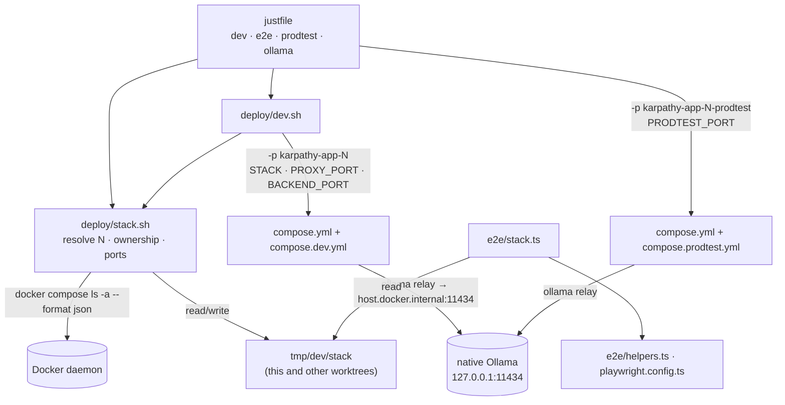
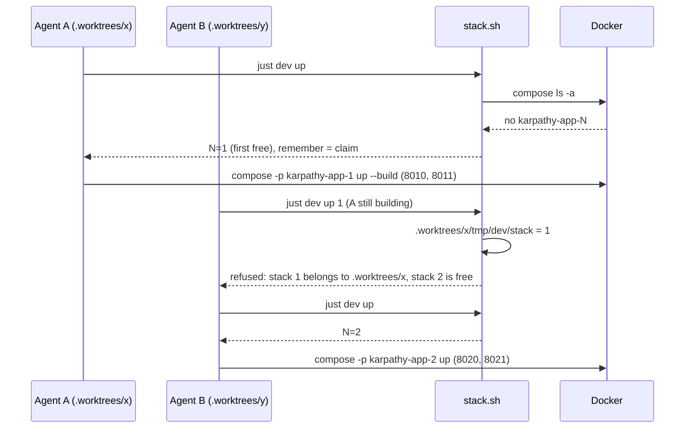

# Architecture: numbered dev stacks

## Overview

The stack number turns into compose inputs: a project name and a few port variables. All of that lives in one
small sourced shell library, `deploy/stack.sh`. Everything that starts or targets a dev stack goes through it:
`dev.sh`, the `justfile` and the e2e helpers (which have a TypeScript twin of the resolution logic). The compose
files only interpolate variables. They know nothing about numbering.

The dev LLM is **outside** every stack. One native Ollama runs on the Mac, and each stack reaches it through a
small relay container (user decision, 2026-10-08).



## Components

### `deploy/stack.sh` (new, sourced)

Bash functions with no side effects except `stack_remember`. It uses `jq`, which the `justfile` already needs.

| Function | Does |
|---|---|
| `stack_ports N` | Exports `STACK=N`, `PROXY_PORT=80N0`, `BACKEND_PORT=80N1`, `PRODTEST_PORT=80N5` and `STACK_PROJECT=karpathy-app-N`. Rejects N outside 1–9. |
| `stack_owner_in JSON N` | Pure. From `docker compose ls -a --format json` output, prints the owning checkout of project `karpathy-app-N`: the directory of its `ConfigFiles` entry that ends in `/deploy/compose.yml`, with `/deploy/compose.yml` stripped. Prints nothing if there is no such project. |
| `stack_claimant N` | The checkout of this repo (`git worktree list`) whose `tmp/dev/stack` says N. |
| `stack_state N` | Prints `mine`, `free`, `other:<checkout>`, `orphan` or `port-busy`. The owner comes from Docker, else from the claimant. A Docker owner whose directory is gone makes the stack `orphan`. Without an owner, the stack is `port-busy` if any port it publishes (80N0, 80N1, 80N5) accepts connections (`nc -z`). Fails (non-zero, with a hint) when Docker isn't reachable or outside a git checkout. |
| `stack_first_free` | The first stack in 1–9 whose state is `free`. |
| `stack_resolve [ARG] [--new]` | Picks N in this order: ARG, then `$STACK`, then `tmp/dev/stack`, then (only with `--new`) `stack_first_free`. Exits non-zero with a hint if nothing resolves. |
| `stack_remember N` | Writes `tmp/dev/stack`, this checkout's claim. |
| `stack_ollama_ready URL` | True if a native Ollama answers at URL (`/api/version`). |

The checkout root is `$(git rev-parse --show-toplevel)`. In a worktree that is the worktree, which is exactly the
owner identity Docker records.

**Why a claim on top of Docker:** `compose up --build` builds for minutes before any container exists, and
`docker compose ls` only lists projects that have containers. In the first acceptance run, a second `just dev up`
started 20 seconds later took the same stack. Other checkouts' `tmp/dev/stack` closes that window without an
extra registry. A claim goes stale only while its worktree exists, and `git worktree remove` clears it.

### `deploy/dev.sh`

```text
deploy/dev.sh up [N] | down | logs | ps | token | stacks
```

- `up`: `stack_resolve "$N" --new`, then refuse if the state is `other:*` or `port-busy` (naming the owner and
  the first free stack). Also refuse if this checkout holds a different stack M ≠ N. Refuse if
  `stack_ollama_ready http://127.0.0.1:11434` fails ("run just ollama install"). An `orphan` stack may be taken
  over. Then `stack_remember`, pull the dev model on the Mac unless `ollama show` finds it,
  `compose up -d --build`, and print `Stack N: https://localhost:80N0  token: …`.
- `down | logs | ps`: `stack_resolve` without `--new`, refuse a stack that is `other:*` or `port-busy`, then
  compose with `-p karpathy-app-N`. `down` keeps the volumes and deletes `tmp/dev/stack` if it holds N, which
  releases the stack.
- `token`: prints this checkout's bearer token.
- `stacks`: one line per stack, 1–9: `N  state  https://localhost:80N0  owner`. Read-only.

`compose()` becomes `docker compose -p "$STACK_PROJECT" -f compose.yml -f compose.dev.yml`. The `-p` flag takes
precedence over `name: karpathy-app` in `compose.yml` (checked:
`docker compose -p karpathy-app-2 … config` prints `name: karpathy-app-2`). Prod is unaffected.

### Native Ollama: `just ollama install | uninstall | status`

A LaunchAgent `app.karpathy.ollama` (same pattern as `just hetzner-watch`) runs `ollama serve` from Homebrew with
`OLLAMA_HOST=127.0.0.1:11434` and `OLLAMA_CONTEXT_LENGTH=16384`. The default context of a few thousand tokens
silently cuts opencode's system prompt (#57). Ollama on macOS uses the Metal GPU, so it is faster than the old
CPU-only container in the Rancher VM. Models live in `~/.ollama`. It binds to loopback only, and containers still
reach it: `host.docker.internal` (192.168.5.2) is forwarded to the Mac's loopback (checked 2026-10-08 with
`wget` from a container). `install` refuses when another server already answers on 11434 (Ollama.app,
`brew services`): that one would serve without the context length. It fails when its own server never answers.

### `deploy/compose.dev.yml`

```yaml
services:
  proxy:
    ports: !override ["${PROXY_PORT:?start dev stacks with just dev up}:443"]
  backend:
    image: !reset null            # → karpathy-app-N-backend, one tag per stack
    ports: ["127.0.0.1:${BACKEND_PORT:?}:8787"]
  opencode:
    image: !reset null
  egress:
    image: !reset null            # dev no longer shares ghcr…-egress:dev with prodtest
  # The native Ollama on the Mac, reachable from the internal network as ollama.internal, /v1 API only.
  ollama:
    image: caddy:2.10-alpine
    volumes: ["./proxy/Caddyfile.ollama-relay:/etc/caddy/Caddyfile:ro"]
    networks:
      internal: { aliases: [ollama.internal] }
      egress: {}
  web:
    environment:
      HMR_CLIENT_PORT: "${PROXY_PORT:?}"
      VITE_STACK: "${STACK:?}"    # header brand "karpathy #N"
```

- `:?` makes a raw `docker compose -f … -f compose.dev.yml up` fail with a pointer to `just dev up`. It can no
  longer silently start a stack on a default port that might collide.
- `image: !reset null` makes compose derive `<project>-<service>` (verified with `config --images` →
  `karpathy-app-2-backend`). Today's fixed `karpathy-app-dev/*` tags are what lets parallel builds clobber each
  other.
- The backend can publish a port because it is also on the non-internal `egress` network. opencode and web are
  only on `internal` and stay unpublished.
- opencode reaches the relay as **`ollama.internal`**. `dev-ollama.json` (`http://ollama.internal:11434/v1`) and
  opencode's `NO_PROXY` use that name.
- The relay is a small Caddy (`deploy/proxy/Caddyfile.ollama-relay`, shared with prodtest's `ollama-bridge`) and
  not raw socat. It passes only `/v1/*`, the OpenAI-compatible API opencode calls, and answers 403 to everything
  else. That keeps Ollama's admin API (pull, delete, create) out of a prompt-injected AI's reach. Raw socat had
  exposed it, and since Ollama runs on the Mac, `/api/pull` against an "insecure" registry could have made the Mac
  request LAN or loopback addresses that the egress proxy forbids (adversarial review, 2026-10-08).
- The relay sets `Host: localhost:11434`, because a loopback-bound Ollama answers 403 to any other `Host` (its
  DNS-rebinding guard). The plain `ollama` name failed in the acceptance run for exactly that reason. opencode
  still has no route out except the egress proxy and this one allowlisted forward.

### Header label: `karpathy #N`

Vite exposes `VITE_*` env vars to the client as `import.meta.env.VITE_STACK`. A pure helper,
`apps/web/src/lib/brand.ts` › `brandName(stack?: string)`, returns `karpathy #N` for a stack number in 1–9 and
`karpathy.app` otherwise. `VaultSwitcher.tsx` renders `brandName(import.meta.env.VITE_STACK)` in place of the
literal `karpathy.app` in its `<b>`. Only the dev `web` service sets `VITE_STACK`. The prod PWA is built in the
proxy image without it, so prod, prodtest and the deploy targets are unchanged. The token screen, the chat
author line and `<title>` keep `karpathy.app`, because the user asked only for the header.

### `deploy/compose.prodtest.yml` and `just prodtest`

Prodtest takes its port from the checkout's dev stack N: project `karpathy-app-N-prodtest`, proxy on
`${PRODTEST_PORT}` (80N5). Its `ollama-bridge` is the same Caddy relay as dev's, so it no longer joins the dev
stack's network and works without a running dev stack. The `just prodtest` recipe sources `stack.sh` and takes N
from `tmp/prodtest/stack` (written by `up`, removed by `down`), else resolves it without `--new`. That way `e2e`
and `down` still find a running prodtest after `just dev down`. It passes `E2E_BASE_URL=https://localhost:80N5`
and `E2E_BACKEND_CONTAINER=karpathy-app-N-prodtest-backend-1` to e2e.

### e2e: `e2e/stack.ts` (new)

`e2e/stack.ts` is a TypeScript twin of `stack_resolve` without `--new` (the e2e suite never claims a stack):
`E2E_BASE_URL` wins (a non-dev target), then `STACK`, then `<root>/tmp/dev/stack`. Otherwise it throws "no dev
stack: run `just dev up`". It returns `{ baseURL, backendContainer }`, and `helpers.ts`, `playwright.config.ts`
and `global-setup.ts` use that instead of the 8443 and dev-container literals.

`E2E_BASE_URL` keeps its meaning of "not the dev stack". The `justfile` never sets it for dev stacks, so
`attach.spec.ts` (which skips when it is set) keeps running against every numbered stack.

### `CLAUDE.md`

The new section "Parallel dev stacks" covers:

- Start a stack only through `just dev up`. It picks a free stack and remembers it, and `just dev up N` pins one.
- Check `just dev stacks` before choosing.
- Never `down`, restart or exec into a stack owned by another checkout.
- `just dev down` when the work is done.
- Hand-written `tmp/compose.*.yml` port overrides are obsolete.

The runtime line ("nothing native in dev") gets one exception: the dev Ollama.

## Sequence: two agents



## Decisions and tradeoffs

| Decision | Chosen | Rejected because |
|---|---|---|
| Ports per service | Proxy, plus backend on loopback for debugging. Block reserved for the rest. | Publishing opencode or web would need a non-internal network for them, which weakens the isolation that dev is meant to mirror (user decision, 2026-10-08). |
| Ownership record | Docker's `ConfigFiles` per project, plus other worktrees' `tmp/dev/stack` as a claim | Docker alone misses stacks that are still building. A separate lock or registry can go stale and needs cleanup. Cost: a same-second race between two `up`s is still possible. |
| Remembered stack | `tmp/dev/stack` per checkout | Env-only (`STACK=2` on every command) is exactly how agents end up talking to the wrong stack. |
| Default with nothing remembered | First free stack | Always using stack 1 would make the second agent's bare `just dev up` fail instead of just working. |
| Ollama | Native on the Mac, one for all stacks, relay per stack (user decision, 2026-10-08) | One Ollama container per stack duplicates memory and model files. A shared Ollama container is still CPU-only in the VM. Cost: a host dependency (`brew install ollama`), the one exception to "nothing native in dev". |
| Stack 0 / 8443 | Dropped | Two schemes (8443 *and* 80N0) is what the hand-rolled overrides already show going wrong. |

## Risks

- **Prodtest images still share `ghcr…:dev` tags** across checkouts (`compose.yml`'s `${APP_VERSION:-dev}`).
  Parallel `just prodtest` in two worktrees can still clobber each other. Noted, not fixed here, because changing
  the tag touches the release path.
- **Integration tests keep their own Ollama container** (`kai-test-ollama`). They could use the native one later.
  Out of scope.
- **Migration.** The running `karpathy-app` (8443), `karpathy-graph` and `karpathy-outline` projects are not
  managed by the new `dev.sh`. They are taken down once by hand, and their dev vaults are re-added on the new
  stacks.
