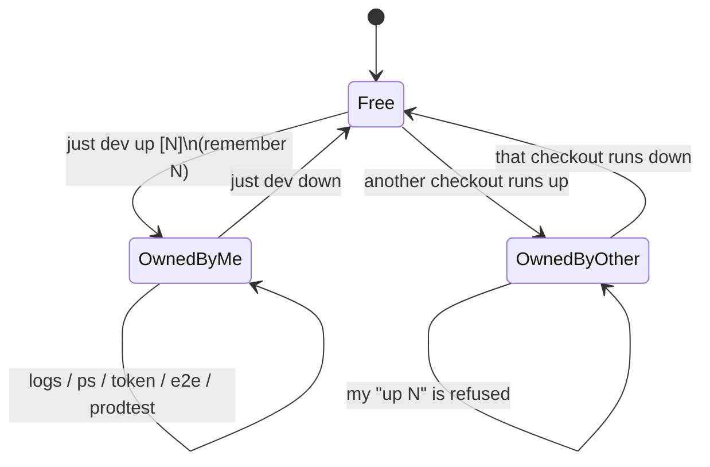
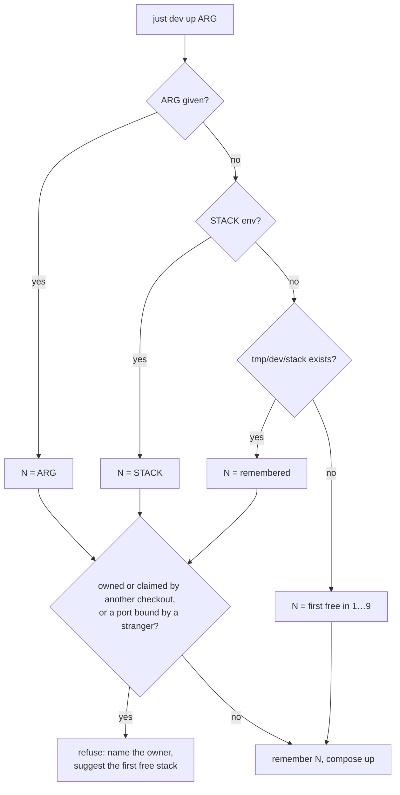

# Domain: dev stacks, port blocks and ownership

## Terms

| Term | Meaning |
|---|---|
| **Checkout** | A working copy of the repo: the main clone or a worktree under `.worktrees/<name>`. Its compose files live at `<checkout>/deploy/`. |
| **Dev stack N** | The dev compose stack (`compose.yml` + `compose.dev.yml`) running as compose project `karpathy-app-N`, N ∈ 1…9. It is built from the sources of exactly one checkout, which are bind-mounted for hot reload. |
| **Stack label** | `karpathy #N`: the brand in the web header on dev stack N, so a browser tab shows which stack it is. Without a stack number (prod, prodtest, deploy targets) the brand stays `karpathy.app`. |
| **Port block** | The ten host ports 80N0–80N9 that belong to stack N. Nothing outside stack N binds them. |
| **Owner** | The checkout whose `deploy/compose.yml` the running (or stopped) project `karpathy-app-N` was started from (Docker records this as the project's `ConfigFiles`). Before the containers exist, it is the checkout of this repo (`git worktree list`) whose `tmp/dev/stack` says N: its **claim**, from `just dev up` until `just dev down`. |
| **Native Ollama** | The dev LLM server, running on the Mac itself (`just ollama install`, `127.0.0.1:11434`) and shared by all stacks. An outside service, like a cloud provider. |
| **Ollama relay** | The `ollama` service of each stack: a small Caddy on the internal and egress networks, reached as `ollama.internal:11434`, passing only the OpenAI-compatible `/v1` API to the native Ollama (not its admin API). opencode (internal-only) has no other route to the Mac. |
| **Free stack** | A stack N with no compose project `karpathy-app-N` and no claim from another checkout, and nothing listening on 80N0, 80N1 or 80N5. |
| **Orphan stack** | A project `karpathy-app-N` whose owning checkout was deleted. Any checkout's `just dev up N` may take it over. |
| **Remembered stack** | The number in `<checkout>/tmp/dev/stack`. Written by `just dev up` and read by every later `dev`, `e2e` and `prodtest` command in that checkout. |
| **Paired prodtest** | The prod-image stack `karpathy-app-N-prodtest` on 80N5. It takes its port block from dev stack N and uses the native Ollama for chat. |
| **Prod / deploy targets** | `deploy/compose.yml` alone (project `karpathy-app`) on Hetzner and the Lima VM. Not a numbered stack, and unchanged by this change. |

## Port block

| Port | Service | Bound to | Note |
|---|---|---|---|
| 80N0 | proxy (Caddy, HTTPS) | all interfaces | **The app.** The Vite HMR socket also goes through it. |
| 80N1 | backend (HTTP :8787) | 127.0.0.1 | Debugging: `curl` the API without TLS. |
| 80N2 | — | — | Spare. Ollama is native on the Mac at `127.0.0.1:11434`, outside every stack. |
| 80N3 | opencode | — | Reserved. Not published: internal network only, by security design. |
| 80N4 | web (Vite :5173) | — | Reserved. Not published: internal network only. |
| 80N5 | prodtest proxy (HTTPS) | all interfaces | Only while the paired prodtest stack runs. |
| 80N6–80N9 | — | — | Spare. |

Stack 9 (8090–8099) can clash with other tools on this Mac. `w12-free` uses 8090, and `just site` defaults to
8099. Something outside Docker on this Mac also holds 8021. The free check probes every port the stack
publishes (80N0, 80N1, 80N5) and skips a stack with a busy one.

## Lifecycle of a stack, seen from one checkout

## Choosing a stack

Every other command (`down`, `logs`, `ps`, `token`, `just e2e`, `just prodtest`) resolves N the same way, minus
the "first free" branch. Without a remembered stack it stops and says "run `just dev up` first".

## Rules

- A checkout holds **at most one** dev stack at a time. `up N` while it holds a different stack M is refused:
  run `down` first.
- An agent never runs `docker compose` against another checkout's project. `just dev stacks` is read-only.
- A stopped project still counts as owned, because its owner may restart it. `just dev down` removes the
  containers and deletes `tmp/dev/stack` (if it holds that number), which releases the claim. `down`, `logs`
  and `ps` refuse a stack another checkout owns.
- A running prodtest remembers its stack in `tmp/prodtest/stack`, so `just prodtest down` still finds it after
  `just dev down`.
- Volumes (`vaults`, `config`, `caddy-data`) are per project, so each stack has its own vaults and its own Caddy
  CA. Models live with the native Ollama (`~/.ollama`), outside every stack.
