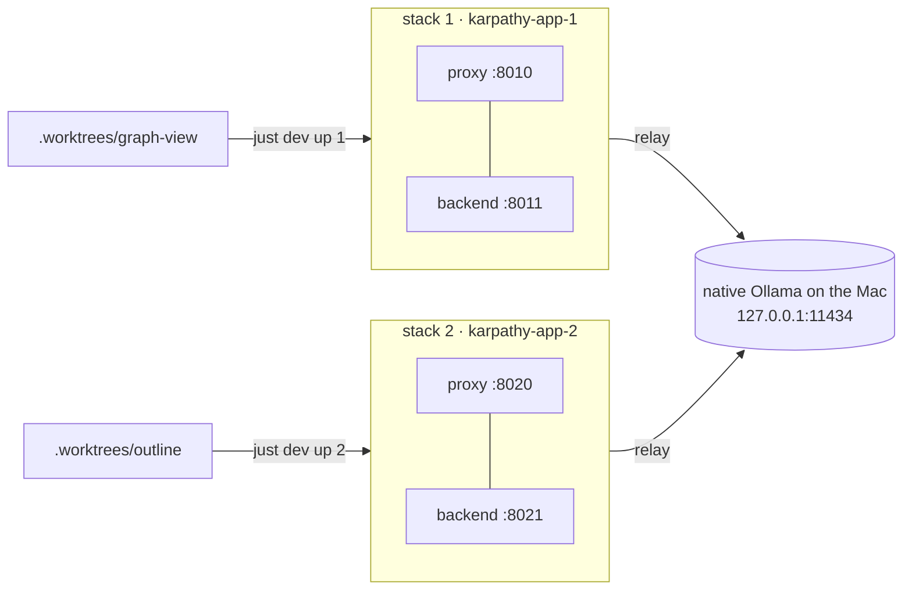

# Proposal: numbered dev stacks side by side

## Why

Several agents develop on the Mac at the same time, each in its own worktree under `.worktrees/`.
Each one needs a running stack for e2e tests and screenshots. Today there is exactly one dev stack.
`deploy/dev.sh` always starts compose project `karpathy-app` on `https://localhost:8443`, and
Playwright, `e2e/helpers.ts` and the docs all hard-code that port and the container name
`karpathy-app-backend-1`.

So agents work around it by hand, and the results differ from agent to agent. On 2026-10-08 the Docker
daemon runs:

| Project | Port | How |
|---|---|---|
| `karpathy-app` (main checkout) | 8443 | `just dev` |
| `karpathy-graph` (`.worktrees/graph-view`) | 8444 | hand-written `tmp/compose.graph.yml`, **without** the HMR port fix |
| `karpathy-outline` (`.worktrees/note-outline-properties`) | 8445 | hand-written `tmp/compose.outline.yml` |
| `karpathy-app-prodtest` | 9443 | `just prodtest` |

The hand-rolled stacks have three problems:

- **Silent breakage.** The graph stack forgot `HMR_CLIENT_PORT`, so hot reload doesn't work on it.
- **Shared image tags.** Every dev stack builds `karpathy-app-dev/backend` and `karpathy-app-dev/opencode`.
  If two worktrees run `up --build`, each one overwrites the image the other is running.
- **Wrong target.** `just dev down|logs|token` and `just e2e` in a worktree still talk to the main stack on
  8443 unless the agent remembers to override everything.

## What

Numbered dev stacks: **stack N** (N = 1…9) owns the port block **80N0–80N9**. One command starts it, and
every other command finds it again.

- **Contiguous ports per stack.** Stack N gets 80N0 (proxy, the app over HTTPS), 80N1 (backend HTTP, loopback
  only) and 80N5 (the prodtest proxy that goes with this stack). 80N2 is spare. 80N3 and 80N4 are
  reserved for opencode and web. Both stay unpublished, because Docker can't publish a port for a container that
  sits only on the `internal: true` network, and opencode must stay internal-only anyway. 80N6–80N9 are spare.
- **Choose the stack, or let it choose.** `just dev up 2` starts stack 2. A bare `just dev up` reuses the stack
  this checkout used last, and otherwise takes the first free one. The number is remembered per checkout in
  `tmp/dev/stack`. `down`, `logs`, `ps`, `token`, `just e2e` and `just prodtest` all use it, so nobody has to
  repeat the number.
- **No stealing.** `up` refuses a stack that another checkout owns, or whose port is already bound by something
  else. `just dev stacks` lists stacks 1–9 with their state, URL and owning checkout.
- **Separate images per stack.** Dev images are tagged by compose project (`karpathy-app-N-backend`, …), so
  parallel builds don't overwrite each other.
- **One Ollama, outside the stacks** (user decision, 2026-10-08). The dev model runs natively on the Mac
  (`just ollama install`: a LaunchAgent on `127.0.0.1:11434`, Metal GPU). Like OpenRouter or Anthropic, it is an
  outside service. Each stack keeps only a small `ollama` relay container, so opencode's config doesn't change. No
  Ollama container or model download per stack.
- **You can see which stack a tab shows.** On dev stack N, the header brand (vault switcher) reads
  **`karpathy #N`** instead of `karpathy.app`. Prod, prodtest and the deploy targets keep `karpathy.app`.
- **Agents are told.** `CLAUDE.md` gets a short section: start the stack only through `just dev up` (which picks a
  free one), check `just dev stacks`, never touch a stack another checkout owns, and run `just dev down` when done.

## Scope

In scope:

- `deploy/dev.sh` and a new `deploy/stack.sh` (stack resolution, ownership, ports)
- `deploy/compose.dev.yml` and `deploy/compose.prodtest.yml`
- `justfile` (`dev`, `e2e` and `prodtest`, plus `check` for the new shell test)
- `e2e/helpers.ts`, `e2e/global-setup.ts`, `playwright.config.ts`
- `apps/web`: the header brand shows the stack number (`karpathy #N`)
- `CLAUDE.md`, `README.md`, `deploy/README.md`, and the comments that mention 8443

Out of scope (non-goals):

- **Prod and the deploy targets.** `deploy/compose.yml` keeps `name: karpathy-app` and `HTTPS_PORT`. Hetzner and
  the Lima VM (`:9444`) don't change.
- **Integration tests.** `npm test` uses fixed names (`kai-test-net`, `kai-test-ollama`, `kai-test-egress`). These
  are already shared across worktrees by design and are not part of the port scheme.
- **A real lock.** Two agents running `up` in the same second could still pick the same stack. Ownership is read
  from Docker, which is good enough for agents that start minutes apart. A follow-up can add an atomic lock if it
  ever happens.
- **The demo run book.** This is dev tooling, not an app feature, so there's no chapter to add.

## Expected outcome

- In two worktrees, `just dev up` brings up stacks 1 and 2. `https://localhost:8010` and `https://localhost:8020`
  both serve the app, and hot reload works on both. Their headers read `karpathy #1` and `karpathy #2`.
- In each worktree, `just e2e` runs against that worktree's own stack, and the attach specs still run (they skip
  only for non-dev stacks).
- `just dev stacks` shows who owns which stack.
- The legacy `:8443` dev stack is gone. Migration costs one `docker compose -p karpathy-app down`. Dev vaults
  live in the old project's volumes, so they are added again on stack 1.
