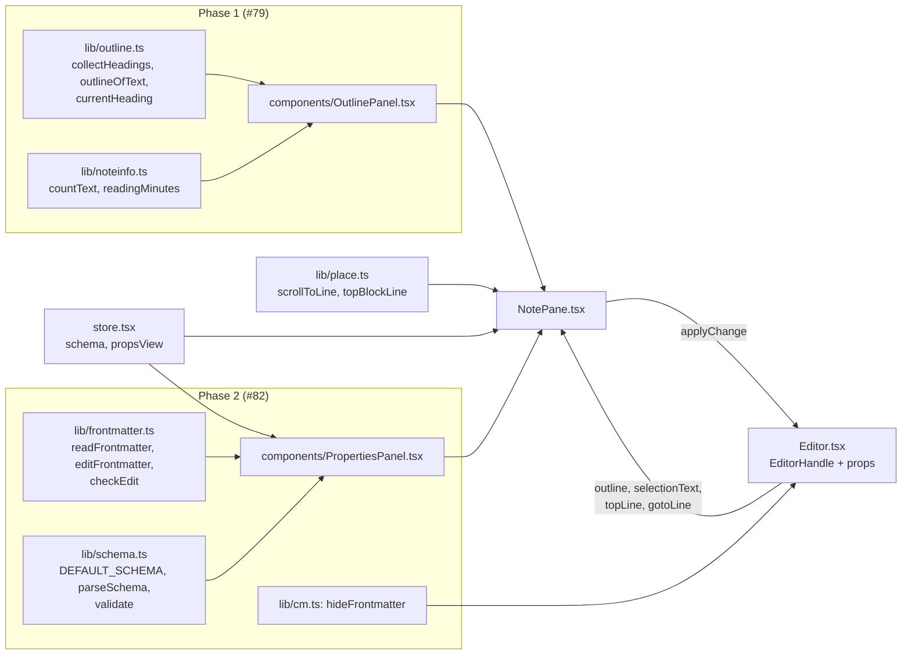
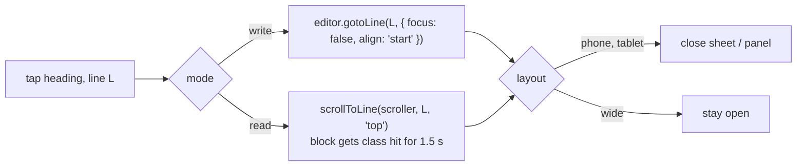
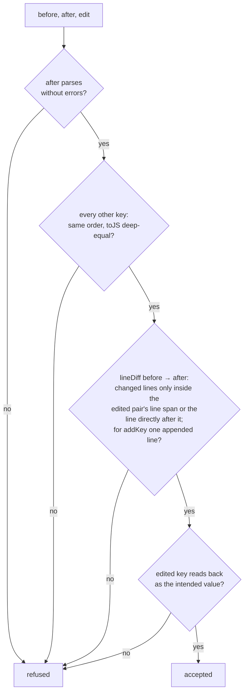
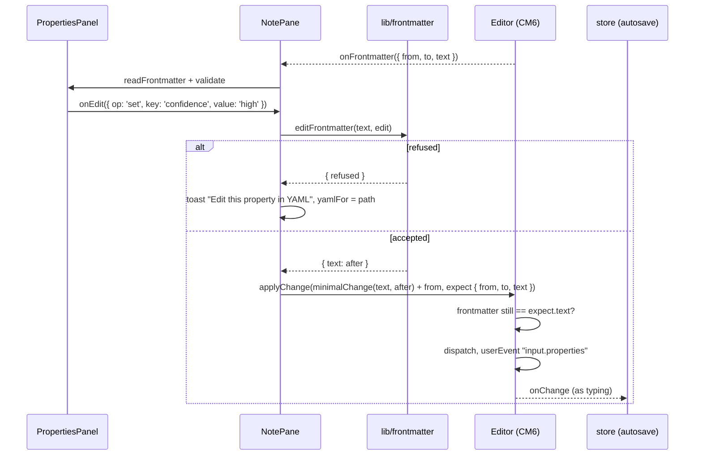

# Architecture: note outline, note info and a properties editor

## Overview



Everything is in `apps/web`. The backend, opencode and the API stay as they are. Phase 1 adds two pure
modules and one component. Phase 2 adds the `yaml` dependency, two pure modules, one component and one
CodeMirror extension. All parsing is pure and unit-tested; the components only wire it up.

## Phase 1: outline

### One parser for both modes

The editor uses `markdown()` from `@codemirror/lang-markdown`, whose base language is
`commonmarkLanguage`. Its Lezer parser also runs without an editor, on a plain string. So both modes
build the outline from the same parser and get the same list.

```ts
// lib/outline.ts
interface OutlineItem { level: 1 | 2 | 3 | 4 | 5 | 6; text: string; line: number }

/** Headings of a parsed note; `slice(from, to)` reads the text, `lineAt(pos)` maps to 1-based lines. */
function collectHeadings(tree: Tree, slice: (from: number, to: number) => string, lineAt: (pos: number) => number, skip: { fmEnd: number; comments: [number, number][] }): OutlineItem[];
/** Read mode: parses `text` with `commonmarkLanguage.parser`, then collectHeadings. */
function outlineOfText(text: string): OutlineItem[];
/** Index of the heading whose section holds `topLine`, or -1 above the first heading. */
function currentHeading(items: OutlineItem[], topLine: number): number;
```

- **Nodes:** `ATXHeading1`–`ATXHeading6`, `SetextHeading1`, `SetextHeading2`. The level comes from the
  node name. Headings inside `FencedCode`/`CodeBlock` are not heading nodes, so code drops out by itself.
- **Frontmatter must be skipped explicitly.** CommonMark reads `title: x` followed by the closing `---`
  as a setext heading level 2. Every heading whose line is ≤ the frontmatter's last line is dropped.
  `frontmatterEnd(state)` in `lib/cm.ts` already finds that line; it moves to `lib/outline.ts` as a
  text-based `frontmatterEndLine(text)` (built on `splitFrontmatter`), and `cm.ts` imports it.
- **Comments:** Read mode hides `%%…%%`, so headings inside are dropped. `inComment` in `cm.ts` counts
  `%%` before a position; a text version `commentRanges(text)` is shared the same way.
- **Display text:** the heading line without `#` marks, closing `#`s and setext underline, then
  `[[target|alias]]` → its label (`wikilinkLabel`), `**`, `__`, `*`, `_`, `` ` ``, `==` removed. Empty →
  "(untitled)".
- **Line:** the line of the node's start (for setext, the text line), the same line `toHtml` puts into
  `data-line` for that block.
- **Write mode** calls `collectHeadings` on `ensureSyntaxTree(state, state.doc.length, 100)`; if that
  isn't done in time (very long note), it falls back to `outlineOfText(doc.toString())`.
  `EditorHandle.outline()` returns the list.
- **Read mode** calls `outlineOfText(s.currentText())`, memoized on the text.

### Jumping



- Write mode doesn't reuse `note.goto`. Its Write path calls `gotoLine(line)` with focus and a cursor
  move, which opens the phone keyboard. `align: 'start'` with `focus: false` is what the mode switch
  already uses: it only scrolls, and it retries while CodeMirror measures lines.
- Read mode uses `lib/place.ts` as it is. A heading nested in a callout, quote or list has no
  `data-line` of its own; `blockAtLine` finds the enclosing top-level block. That is the granularity
  limit, and it matches how search hits land today.
- No history entry is pushed and `note.restore` is not touched.

### Current section

While the outline is open, a `scroll` listener on `s.scrollRef` (rAF-throttled) reads the top line,
`editor.topLine()` in Write mode, `topBlockLine(scroller)` in Read mode, and sets
`current = currentHeading(items, topLine)`. The current item gets `aria-current="location"` and is kept in
view inside the list (`scrollIntoView({ block: 'nearest' })`).

### Note info

```ts
// lib/noteinfo.ts
const WORDS_PER_MINUTE = 220;
function countText(s: string): { words: number; chars: number };
function readingMinutes(words: number): number; // Math.ceil(words / 220); 0 words → 0
```

- **Words:** `new Intl.Segmenter(undefined, { granularity: 'word' })`, count of segments with
  `isWordLike`. Markdown punctuation (`#`, `*`, `-`, `[[`, `|`) is not word-like, so it doesn't count.
  Code and comments count as written. All supported browsers have `Intl.Segmenter` (Safari 14.1+,
  Chrome 87+, Firefox 125+).
- **Characters:** grapheme segments (`granularity: 'grapheme'`), without `\r` and `\n`. An emoji or `é`
  counts once.
- **Body:** `splitFrontmatter(text).body`.
- **Selection, Write mode:** `EditorHandle.selectionText()` joins the non-empty selection ranges after
  clipping each to start after the frontmatter; `null` when nothing is selected. The Editor reports
  selection changes through a new `onSelection()` prop (`updateListener`, `u.selectionSet`).
- **Selection, Read mode:** `document.getSelection()`, used only when its range lies inside the
  note's `.rd` element (the #58 properties table is outside `.rd`, so frontmatter can't be counted).
  Updated on `selectionchange`.
- **Selection survives the tap:** on iOS, tapping a button can clear the DOM selection. The outline
  button reads the selection on `pointerdown`, before focus moves, and passes it to the panel. In Write
  mode CodeMirror keeps its selection in state anyway.

### `OutlinePanel`

```ts
function OutlinePanel(props: {
  variant: 'sheet' | 'panel';
  items: OutlineItem[]; current: number;
  info: { words: number; chars: number; minutes: number; selection: boolean };
  onJump(line: number): void; onClose(): void;
}): JSX.Element;
```

| | Phone (`phone`) | Tablet (neither) | Wide (`wide`) |
|---|---|---|---|
| Form | Bottom sheet over the note pane, scrim behind, grabber, max 70 vh | Panel at the top right of the note pane, below the header, `min(320px, 100% - 32px)` wide, max 70 vh | Same panel |
| Role | `role="dialog" aria-modal="true" aria-label="Outline"`; focus moves to the current item | `role="dialog" aria-modal="false"` | `role="dialog" aria-modal="false"` |
| Closes on | Jump, scrim tap, Escape | Jump, tap outside, Escape | Outline button, Escape |

- The list is a flat `<ol>` of buttons, indented by `level - minLevel` (12 px per level, capped at 5
  steps), at least 44 px high. A flat list keeps the indent correct when levels skip (`#` then `###`).
- Note info is the panel's footer: `2,418 words · 14,902 characters · ~11 min read`, or
  `Selection: 312 words · 1,904 characters`. Numbers use `toLocaleString()`.
- Escape: `Shell`'s tablet Escape handler already ignores keys while an `[aria-modal="true"]` element
  exists, and the panel handles its own Escape with `preventDefault`, which Shell also respects.
- Open state lives in `NotePane` (`outlineOpen`). Phone and tablet close it on note change; wide keeps
  it open across notes.
- Test ids: `outline-button`, `outline`, `outline-item` (with `data-line`, `data-level`), `note-info`.

### Header button

`NotePane`'s bar gets `<button className="ib" title="Outline" data-testid="outline-button">` with the
`list_bullet` icon, before the mode switch, for notes only (`!note.binary`). The phone bar has room: back
(with label), outline, mode switch, delete, chat fit in 390 px.

## Phase 2: properties

### Library and why not `Document.toString()`

`yaml@2` (installed and tried for this spec: **2.9.1**). Its docs for `yaml@2`
([eemeli.org/yaml](https://eemeli.org/yaml/)) give the facts this design rests on:

- `Document.toString()` is **not** lossless. Section "Comments and blank lines": "the library's comment
  handling is not completely stable, in particular for trailing comments. When creating, writing, and
  then reading a YAML file, comments may sometimes be associated with a different node." It also picks
  its own scalar style. So the report's sketch (`doc.setIn` → `doc.toString()`) is rejected.
- The CST is lossless. Section "Working with CST tokens": `CST.stringify` "Stringify a CST document,
  token, or collection item. Fair warning: This applies no validation whatsoever." It concatenates the
  tokens' source, so parse → stringify gives the input back.
- `CST.setScalarValue(token, value, context)` overwrites a scalar token's value and type and keeps the
  comments attached to it. "Values that represent an actual string but may be parsed as a different type
  should use a `type` other than `'PLAIN'`, as this function does not support any schema operations."
- Option `keepSourceTokens` (section "Options"): "Include a `srcToken` value on each parsed `Node`,
  containing the CST token that was composed into this node." And `node.range` is "`[start, value-end,
  node-end]` character offsets for the part of the source parsed into this node."

Tried in a scratch project with 2.9.1 on a frontmatter with comments, mixed quoting, flow and block
lists and a block scalar:

| Operation | Result |
|---|---|
| `Parser` → `CST.stringify` of all tokens | Byte-identical to the input. |
| `setScalarValue` on `confidence: 'high'` and `updated: 2026-10-02` | Only those values changed; single quotes kept, trailing comment on another line kept. |
| Appending an item by pushing a cloned item token into a block sequence's `items` | **Broke the document**: the indent lives in the previous item's tokens; the re-parse had 3 errors. |
| Text splice at `range`: new line `  - "[[c]]"` after the last block item; `, "[[x]]"` after the last flow item | Re-parses without errors, all other values equal. |
| `related: [[a]], [[b]]` | Parse error `UNEXPECTED_TOKEN`; `x: [[a]]` alone parses as `[["a"]]`, a nested list. |

So: **scalars through `setScalarValue`, list items and new keys through text splices at node ranges, and
every result through one invariant check.** No edit goes through `Document.toString()`.

### `lib/frontmatter.ts`

```ts
type PropertyKind = 'text' | 'enum' | 'date' | 'number' | 'boolean' | 'list' | 'links' | 'raw';
interface Prop {
  key: string;
  value: unknown;                       // toJS() of the value node
  kind: PropertyKind;                   // schema rule, else inferred (below)
  lines: [number, number];              // first and last line of the pair in the frontmatter text
  list?: { flow: boolean; style: 'wikilink' | 'bare'; ext: boolean };  // item style, `.md` suffix
  editable: boolean;                    // false → kind 'raw', "Edit in YAML"
}
interface Frontmatter { from: number; to: number; text: string; props: Prop[]; error?: string }

type Edit =
  | { op: 'set'; key: string; value: string | number | boolean }
  | { op: 'add'; key: string; item: string }
  | { op: 'remove'; key: string; index: number }
  | { op: 'addKey'; key: string; value: string | string[] };

/** The frontmatter of a note, in the editor's coordinates (`\n` line breaks); null when there is none. */
function readFrontmatter(note: string, rules?: Schema['fields']): Frontmatter | null;
/** The text after the edit, or why it was refused. Pure. */
function editFrontmatter(text: string, edit: Edit): { text: string } | { refused: string };
/** The invariant; editFrontmatter returns `refused` when it fails. */
function checkEdit(before: string, after: string, edit: Edit): string | null;
```

- **Parsing:** `new Parser().parse(text)` → tokens, `new Composer({ keepSourceTokens: true })` → the
  document. Errors or warnings → `error` set; the form shows the YAML view. A frontmatter that isn't a
  map (a bare scalar, a list) is an error too.
- **Editable values:** plain or quoted scalars on one line, flow lists of such scalars on one line, and
  block lists whose items are such scalars on one line each. Everything else (block scalars `|` `>`,
  nested maps, multi-line flow, anchors `&`, aliases `*`, tags `!`, complex keys) is `raw`.
- **Kind inference** when the schema has no rule for the key: boolean → `boolean`; number → `number`;
  string matching `YYYY-MM-DD` → `date`; other string → `text`; list whose items all are `[[…]]` →
  `links`; other list of scalars → `list`; anything else → `raw`. `sources` and `related` are `links`
  through the default schema, which is how bare names become link chips.

#### Edits

| Edit | How the new text is made |
|---|---|
| `set` on a scalar | `setScalarValue(pair.value.srcToken, str, { type })`, then `CST.stringify` of all tokens. `type` = the token's current type when the new string, read back in that style, gives the intended value and JS type; else `QUOTE_DOUBLE`. Example: `"true"` typed into a text field stays a string, so it is written `"true"`. |
| `set` on an empty value (`key:`) | Text splice: ` value` after `key:` on that line. |
| `add` to a flow list | Splice `, <item>` after the last item's `range[1]`; into `[]`, the item between the brackets. |
| `add` to a block list | A new line after the last item's line, with the same prefix (indent and `- `) as that line. |
| `remove` from a flow list | Remove the item's range plus the separator before it (after it for the first item). |
| `remove` from a block list | Remove the item's whole line. A trailing comment on that line goes with it (it describes nothing anymore); comments on other lines stay. |
| `addKey` | A new line `key: value` at the end of the frontmatter text; lists as a flow list. |

**Item format:** `style: 'wikilink'` → `"[[name]]"` (double quotes, `"` and `\` escaped).
`style: 'bare'` → plain if a plain scalar reads back as that string, else double-quoted. The list's style
is the style of its existing items: any item that starts with `[[` makes it `wikilink`. An empty list
takes the schema rule's `linkStyle`, default `wikilink`. A suggestion picked from the vault becomes the
note's name without `.md`, or with `.md` when the existing items carry it (`list.ext`), as the demo
vault's `sources` do.

#### The invariant



`lineDiff` is the existing `lib/linediff.ts`. Deep equality compares `toJS()` results. The invariant is
the guarantee; the property tests below check that it holds and that refusals are rare.

### `lib/schema.ts`

```ts
interface FieldRule { kind: PropertyKind; values?: string[]; required?: boolean; linkStyle?: 'wikilink' | 'bare' }
interface Schema { appliesTo: string[]; fields: Record<string, FieldRule> }

const DEFAULT_SCHEMA: Schema = {
  appliesTo: ['Wiki/'],
  fields: {
    type: { kind: 'enum', values: ['entity', 'concept', 'topic', 'source', 'synthesis'], required: true },
    tags: { kind: 'list', required: true },
    updated: { kind: 'date', required: true },
    sources: { kind: 'links' },
    related: { kind: 'links' },
    confidence: { kind: 'enum', values: ['high', 'medium', 'low'] },
  },
};

function parseSchema(json: string): Schema | { error: string };
function applies(schema: Schema, path: string): boolean;   // folder prefix, case-insensitive
function validate(fm: Frontmatter, schema: Schema, path: string): Violation[];
interface Violation { key: string; message: string }
```

- **Schema file:** `.karpathy/schema.json`, same shape as `Schema`. `parseSchema` checks it by hand
  (known kinds, `values` only on `enum`, strings only): no JSON-Schema validator, it's six rules. It
  replaces the default as a whole; merging would make a vault unable to drop a default rule.
- **Why this path:** a dot-folder is hidden in the tree, like `.obsidian`, so it doesn't look like a
  note or a source to the ingest skills (the same reason attach creates `.gitkeep`, not a README). It
  isn't harness config (`.opencode/`, `opencode.json(c)`), so it neither disables chat nor is refused as
  a file name. The AI may edit it like any vault file. `GET /vaults/:id/file` serves it (`normalizeRel`
  refuses only `.git`); `files-changed` reports it (the watcher ignores only `.git`).
- **`appliesTo`:** vault-root-relative folder prefixes; `Wiki/` also matches `wiki/`. Outside, `validate`
  returns nothing.
- **Violations** (only where the schema applies): missing required key ("required on wiki pages"), enum
  value outside `values` ("must be high, medium or low"), `date` not a valid calendar date ("not a date
  (YYYY-MM-DD)"), `list`/`links` given as a scalar ("should be a list"), a list item that parsed as a
  nested list from an unquoted `[[…]]` (found by `[[` at the item's range; "wikilinks in lists need
  quotes"), a frontmatter parse error (one violation on the panel).

### Store

- `schema: Schema` for the active vault. Loaded when a vault becomes usable:
  `api.file(vault, '.karpathy/schema.json')`. 404 → `DEFAULT_SCHEMA`; invalid → `DEFAULT_SCHEMA` and one
  toast `Schema file ignored: <reason>`. Reloaded when a `files-changed` event names that path.
- `propsView: 'open' | 'closed' | 'yaml'`, localStorage `karpathy.propsView`, read and written in
  `try/catch` like `karpathy.mode`. Default `open`.
- A per-note override `yamlFor: string | null` (note path): set when the frontmatter can't be parsed, an
  edit is refused, or a search hit, `goto` or selection lands inside the frontmatter. It shows the YAML
  view for that note without changing the preference, and clears on note change.

### Editor and CodeMirror



- **Coordinates:** the frontmatter text comes from `state.doc.sliceString(from, to)` with the default
  `\n` separator, so positions match CodeMirror's 1:1. `eolExtension` writes CRLF back on save, as for
  typing. The change sent is `minimalChange(before, after)` from `lib/diff.ts`, shifted by `from`.
- **New `Editor` props:** `onFrontmatter(fm: { from; to; text } | null)`, fired on create and when a
  transaction changes the frontmatter's text (compared, not on every keystroke elsewhere);
  `onSelection()`; `hideFrontmatter: boolean`.
- **New `EditorHandle` methods:** `outline()`, `selectionText()`, and
  `applyChange(change, expect): boolean`. It checks `sliceString(expect.from, expect.to) ===
  expect.text` first: if an AI reload or a pull changed the frontmatter since the form was built, it
  returns `false` and nothing is written; the form is rebuilt from the new text. The transaction is a
  normal user change (not `External`), so autosave, drafts and undo treat it like typing.
- **`hideFrontmatter`** (`lib/cm.ts`): a `StateField` in a `Compartment` that, when on and the note has
  frontmatter, holds one `Decoration.replace({ block: true })` from line 1's start to the last
  frontmatter line's end, plus `EditorView.atomicRanges` over the same range so arrow keys skip it. A
  block replace must come from state, not a view plugin, as with embeds. The text stays in the
  document. Recomputed on `docChanged`.
- **Cursor and hits in the hidden range:** a new note's cursor starts at 0; on focus the selection moves
  to the start of the line after the frontmatter. When a selection lands inside the hidden range by
  other means (find-in-note, a search hit's `goto`), the Editor calls `onRevealFrontmatter()`, and
  NotePane sets `yamlFor` so the lines show.
- `topLine()`, `gotoLine()` and the embed field keep working: the hidden lines have no `.cm-line`, and
  line numbers don't change.

### `PropertiesPanel`

- Placed in `NotePane` between `.note-title` and `<Editor>`, in Write mode, when the note has
  frontmatter and the view isn't `yaml`.
- Header: "Properties", count, violation count (`⚠ 1`), a collapse chevron and a **YAML** toggle
  button (`aria-pressed`). The toggle lives in the panel, not the crowded note header. In the YAML view
  a small "Properties form" bar above the editor switches back.
- One row per property in document order: label (the key), field, violation text under it
  (`aria-describedby`, `role="status"` on change).
- Fields: `enum` → `<select>` (a value outside the list shows as an extra, flagged option, so it is never
  lost by opening the picker); `date` → `<input type="date">` + **Today**; `number` →
  `<input inputmode="decimal">`; `boolean` → a switch; `text` → `<input>`; `list` / `links` → chips with
  ✕ and an Add `<input enterkeyhint="done" autocapitalize="off" autocorrect="off" spellcheck="false">`.
  Text edits commit on blur and on Enter, not per keystroke, so one change = one edit = one undo step.
- Link chips use `Linked` from `NotePane` (same resolution and missing-page marking as Read mode);
  suggestions are the 8 best note-name matches from `paths` (basename prefix first, then substring).
- **Add property:** a "+ Property" row offers the schema's keys that are missing, then a free key.
- Disabled when `readOnly` or the note is deleted.
- Test ids: `props`, `props-row` (`data-key`), `props-yaml`, `props-violation`, `props-add`.

## Decisions

| Decision | Why | Rejected |
|---|---|---|
| One Lezer parser for the outline in both modes | Same list in both modes; code fences handled by the grammar | Reading rendered `h1`–`h6` in Read mode: a second source that can differ from Write mode |
| Read-mode jumps through `data-line` blocks | Already built and tested (`lib/place.ts`); no ids injected into note HTML | Heading `id` attributes: collide with note HTML and footnote ids, and DOMPurify clobbering rules |
| Floating panel on tablet and wide | The wide note column can be ~360 px with chat open | A pinned outline column |
| Fixed 220 wpm | Simple, honest with "~"; German and French adult reading rates are in the same range | Per-language rates (needs language detection) |
| `yaml` CST + text splices + invariant | Only way found that keeps every other byte; verified on 2.9.1 | `Document.toString()` (moves comments, re-styles); hand-written YAML editing without a parser (no way to check the result) |
| Refuse instead of best effort | The non-negotiable rule is lossless round trips (ADR 0003) | Writing the closest possible text |
| Form only in Write mode | Editing belongs where the editor is (undo, autosave); Read mode stays a reading view | Editable #58 table |
| Schema file replaces the default | Predictable; a vault can drop a rule | Merging |
| `.karpathy/schema.json` | Hidden, not harness config, no backend change | `opencode.json` / `.opencode/` (forbidden), a visible `schema.md` (looks like a note to ingest), parsing `AGENTS.md` prose (fragile) |
| No auto-bump of `updated` | A bump on every save is diff noise; the AI sets it on ingest | Bump on save |

## Testing

- **Units (vitest, `apps/web/src/lib/*.test.ts`):** `outline.test.ts`, `noteinfo.test.ts`,
  `frontmatter.test.ts`, `schema.test.ts`. jsdom has `Intl.Segmenter` through Node's ICU.
- **Property-based (fast-check, phase 2):** generators build frontmatters from parts: keys, plain /
  single / double quoted scalars (with `#`, `:`, quotes, unicode), flow and block lists of them, quoted
  and bare wikilinks, comments (own line and trailing), blank lines, block scalars, uneven spacing.
  Properties: (1) parse → `CST.stringify` is the identity; (2) for any edit, `editFrontmatter` either
  refuses, or the invariant holds and only the edited pair's lines differ; (3) set to a new value, then
  set back to the original value → byte-identical when the original style can hold it; (4) add then
  remove the same item → byte-identical; (5) refusals stay under 5 % of edits on editable values (a
  rising number means a gap, not data loss). 1,000 runs per property in CI; a failing seed is printed and
  becomes a fixed case.
- **Corpus test:** every frontmatter of the demo vault's `Wiki/` pages (copied into a fixture) is read,
  each editable property is set to a new value and back, and each note round-trips byte for byte.
- **e2e (Playwright, `just e2e`):** `e2e/outline.spec.ts` and `e2e/properties.spec.ts`, desktop plus
  `@iphone` / `@ipad` tagged cases. The properties spec checks the file the backend wrote through the
  `api` fixture: exactly one line differs from before.
