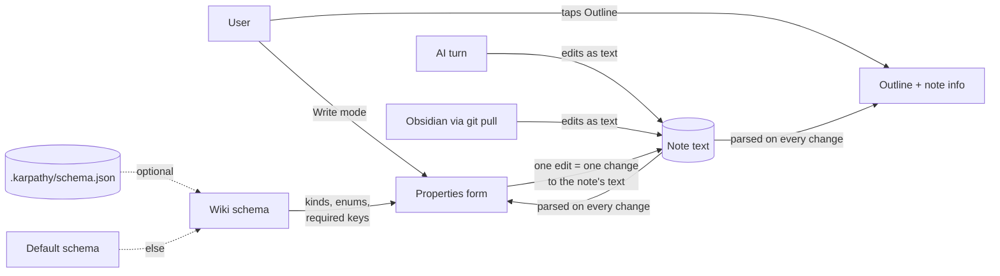
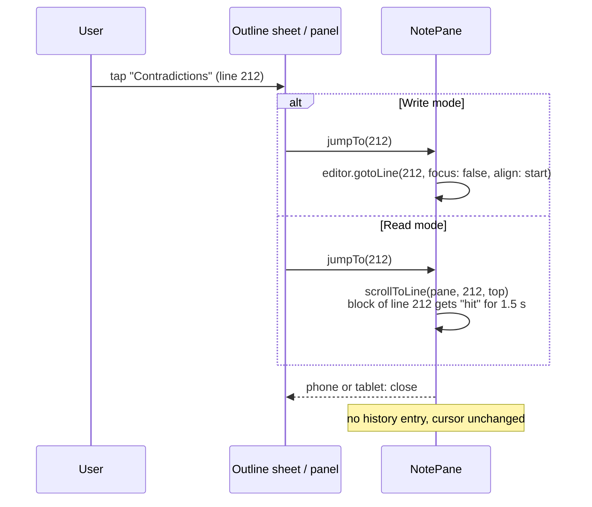
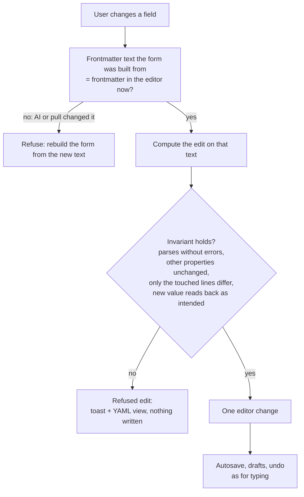
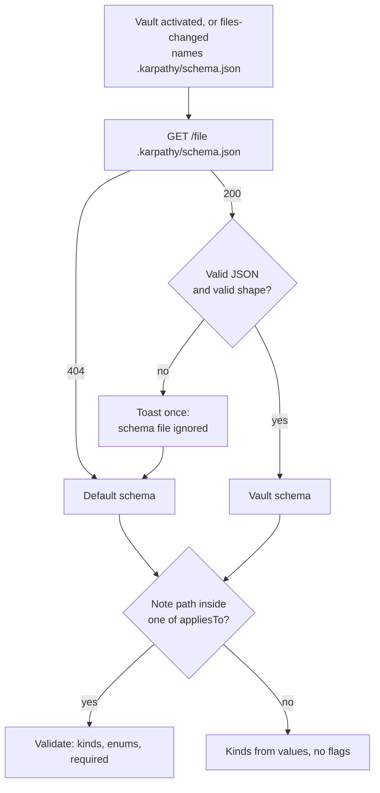

# Domain: outline, note info, properties and the wiki schema

## New and changed terms

| Term | Meaning | Code |
|---|---|---|
| **Outline** | The note's headings in document order, nested by level. Built from the note's current text, the same in Write and Read mode. Headings in code, frontmatter and `%%comments%%` are not part of it. *Avoid:* table of contents, TOC, navigator. | web `lib/outline.ts` `outline()` |
| **Heading** *(outline entry)* | One ATX (`## Title`) or setext (`Title` + `===`) heading: level 1–6, display text, source line. A heading's **section** runs to the next heading of the same or a higher level. | `OutlineItem { level, text, line }` |
| **Current section** | The heading whose section holds the line at the top of the visible pane. Marked in the outline while scrolling. | `currentHeading(items, topLine)` |
| **Jump** | Scrolling the open note so a heading is at the top of the pane. Not a navigation: no history entry, the cursor doesn't move, the phone keyboard stays closed. *Avoid:* go to, navigate. | NotePane `jumpTo(line)` |
| **Note info** | Words, characters and reading time of the note's body, or of the selection when there is one. The frontmatter is never counted. *Avoid:* statistics, word count (as the name of the whole). | web `lib/noteinfo.ts` |
| **Reading time** | Words ÷ 220, rounded up to whole minutes, shown with "~". One rate for every language. | `WORDS_PER_MINUTE = 220` |
| **Frontmatter** *(existing, sharpened)* | The YAML block between `---` lines at the very start of a note. Part of the note's text: the AI and Obsidian edit it as text, and the app keeps it byte for byte unless the user changes a property. | `splitFrontmatter` |
| **Property** | One top-level key of the frontmatter with its value. *Avoid:* field (that's the form element), metadata, attribute. | `yaml` `Pair` |
| **Properties form** | The typed view of a note's properties in Write mode, with one field per property. Writes back through the editor, one edit at a time. | web `PropertiesPanel` |
| **Properties view** | Which way Write mode shows the frontmatter: `open` (the properties form), `closed` (the form collapsed to one line) or `yaml` (the raw lines in the editor). Only `yaml` shows the frontmatter lines; `open` and `closed` hide them. Per browser, survives a reload. *Avoid:* source mode (Obsidian's term for the whole note). | localStorage `karpathy.propsView` |
| **Property kind** | How a property is shown and edited: `text`, `enum`, `date`, `number`, `boolean`, `list`, `links`, or `raw` (read-only, edit in YAML). From the schema, else from the value. | `PropertyKind` |
| **Link list** | A `links` property: each item names a note, either bare (`dolomites`, `2026-09-13-clip.md`) or as a quoted wikilink (`"[[openai]]"`). Items resolve like `[[links]]`. | `sources`, `related` by default |
| **Wiki schema** | The rules a wiki page's properties should follow: per property its kind, allowed values and whether it is required, plus the folders the rules apply to. *Avoid:* template, frontmatter spec. | web `lib/schema.ts` |
| **Default schema** | The LLM-wiki schema built into the app: `type`, `tags`, `updated` required, `sources`, `related`, `confidence` optional, for notes in `Wiki/`. | `DEFAULT_SCHEMA` |
| **Schema file** | `.karpathy/schema.json` in the vault root. If present and valid, it replaces the default schema for that vault. A vault file like any other: hidden in the tree, editable by the AI, committed by the user. Not harness config. | store `schema` per vault |
| **Schema violation** | A property that doesn't follow the schema: wrong kind, a value outside an enum, a missing required property, a wikilink in a list without quotes. Shown, never fixed by the app, never blocks saving. *Avoid:* error (saving still works), lint (the AI skill). | `validate()` → `Violation[]` |
| **Refused edit** | A form edit the app can't make while keeping every other byte of the frontmatter. Nothing is written; the user is sent to the YAML view. | `editFrontmatter()` → `{ refused }` |

## Who sees what

The note's text is the only state. The outline, the note info and the form are views computed from it;
none of them is stored.

## Process: jump to a heading

## Process: edit a property

## Process: which schema applies

## Rules

- **The note text is the truth.** A form edit is a text edit of the touched property's lines, made
  through the editor. Every other byte of the note stays as it was (ADR 0003).
- **No edit is better than a lossy edit.** If an edit can't keep every other byte, it is refused.
- **Never fix silently.** Violations are shown; values change only when the user changes them.
- **Unknown properties are kept** and shown, in their place, with their quoting.
- **Wikilinks inside YAML lists are quoted** when the app writes them (`"[[x]]"`). Bare names stay bare
  when the list already uses bare names.
- **The outline and the note info never change the note.**
- **Same outline in both modes:** one parser, one list, positions by source line.

## Contradictions noticed

- The user's global LLM-wiki schema includes `confidence: high | medium | low`; the demo vault's
  `AGENTS.md` doesn't list `confidence` and adds tour keys (`kind`, `activity`, `region`, …). The
  default schema includes `confidence` as optional, so neither kind of vault gets false flags. Tour
  keys are unknown properties and are shown, not flagged.
- `AGENTS.md` says every wiki page has `sources` and `related`, but hub pages (`index.md`, `log.md`,
  topic hubs) often have none. The default schema keeps them optional.
