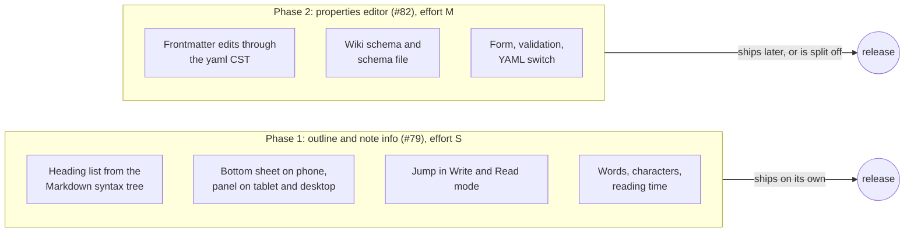
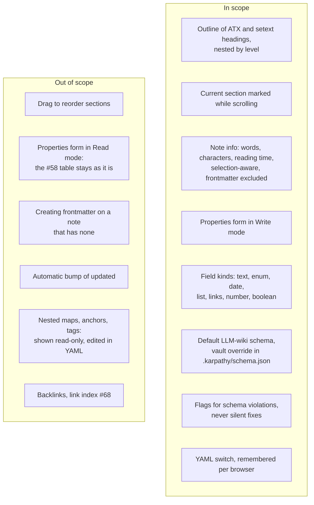
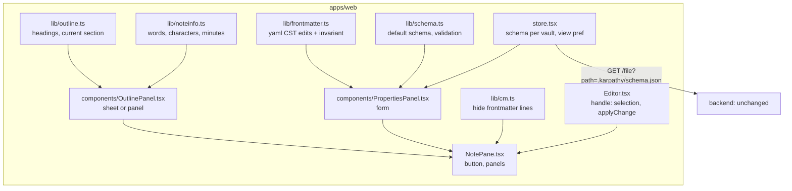

# Proposal: note outline, note info and a properties editor

## What

Two note-pane features, built in two phases:

1. **Outline and note info** ([#79](https://github.com/tillg/karpathy.app/issues/79), report §16). An
   **Outline** button in the note header opens the note's heading tree. Tapping a heading jumps there, in
   Write mode and in Read mode. The same sheet shows **note info**: words, characters and reading time.
   The frontmatter is never counted. With a selection, only the selection is counted.
2. **Properties editor** ([#82](https://github.com/tillg/karpathy.app/issues/82), report §19). In Write
   mode, the frontmatter shows as a form of typed fields: text, picker, date, list chips and link chips.
   The form checks the fields against the **wiki schema** and flags what doesn't fit. A **YAML** switch
   shows the raw frontmatter in the editor again. A form edit changes only the YAML lines of the field
   that was touched.

## Why

- LLM-written synthesis and source pages are long and heavily sectioned. On a phone, scrolling to
  "Contradictions" takes many swipes. An outline is a table of contents one tap away. The word count also
  shows when an ingest has made a page big enough to split.
- The LLM wiki depends on consistent frontmatter: the index, lint and Dataview queries read `type`,
  `sources` and `updated`. On a phone keyboard, a wrong indent or an unquoted `[[link]]` in a list breaks
  that. Bumping `updated`, adding a source or lowering `confidence` should be a tap, not YAML typing.
  Validation catches what the AI got wrong.

## Phases

**Phase 1 comes first and is shippable on its own.** Every #79 step is ordered before every #82 step in
the plan. Phase 1 adds no dependency and touches no frontmatter text. If phase 2 stalls (the round-trip
property tests are the risky part), phase 1 ships and phase 2 moves to its own change without rework.

The open roadmap ([`specs/changes/v1/v1-plan.md`](../v1/v1-plan.md)) lists #79 under SHOULD and #82 under
OUT (V2, "builds on the link index from #68"). This change pulls #82 forward behind #79. It does not need
the link index: link chips resolve with today's `resolveWikilink` and file list. The roadmap file itself
is not changed here.

## Scope

## Decisions visible to the user

### Outline and note info

- **Where the button is.** An **Outline** button (list icon) in the note header, left of the
  Write/Read switch, for notes only (not for media or binary files). On the phone it replaces nothing:
  the header keeps back, mode switch, delete and chat.
- **Phone (≤ 699 px): a bottom sheet** over the note, up to 70 % of the screen high. Tapping a heading
  jumps and closes the sheet. A tap on the dimmed note, the grabber or Escape closes it too.
- **Tablet (700–1023 px) and wide (≥ 1024 px): a panel** that floats at the top right of the note pane,
  320 px wide at most and never wider than the pane. On tablet it closes after a jump, like the sheet.
  On wide it stays open until the button is tapped again, so it works as a table of contents while
  reading. It is a floating panel, not a column: with the sidebar and chat open, the note column on a
  1024 px screen is only about 360 px wide.
- **Same outline in both modes.** Both modes read the headings from the same Markdown parser, so the list
  doesn't change when the user switches mode. Headings in code blocks, in the frontmatter and in
  `%%comments%%` don't appear.
- **Jumping.** In Write mode the heading's line moves to the top of the pane. The cursor doesn't move and
  the phone keyboard stays closed. In Read mode the heading's block scrolls to the top and is briefly
  highlighted, as a search hit is today. A heading inside a callout or a quote lands on that callout
  or quote, because Read mode knows positions per top-level block.
- **Current section.** The heading of the section at the top of the pane is marked in the list, and it
  follows the scrolling.
- **A jump is not a navigation.** It adds no history entry, so Back still leaves the note, as today.
  The place Back restores later is wherever the user was when leaving the note.
- **Note info** sits at the bottom of the sheet or panel: `2,418 words · 14,902 characters · ~11 min
  read`. Words and characters follow the user's language rules (the browser's word segmenter), so German
  compounds and French elisions count as a reader would count them. Characters exclude line breaks.
  Reading time uses a fixed 220 words per minute for every language. It's an estimate, and the label
  says "~".
- **Selection.** With text selected (in the editor, or in the rendered note), the info line says
  `Selection: 312 words · 1,904 characters` instead. The frontmatter is never counted, even when it is
  part of the selection.

### Properties editor

- **Write mode only.** The form sits between the note title and the editor text, collapsed to one
  line ("Properties · 6 · ⚠ 1") or open. While the form is shown, the frontmatter lines are hidden in the
  editor. The text itself stays in the note, unchanged. Read mode keeps the properties table from #58.
- **YAML switch.** A **YAML** button in the form's header hides the form and shows the raw frontmatter in
  the editor again. The choice holds for every note and survives a reload, per browser, like the mode
  preference. If the frontmatter can't be parsed, the form shows "Can't read these properties" and the
  YAML view opens by itself for that note.
- **Only the touched lines change.** Changing `updated` changes the `updated` line and nothing else:
  key order, quoting style, comments, blank lines and line endings stay. (Removing a list item removes
  a comment on that item's own line with it.) If the app can't make an edit
  that way, it refuses it ("Edit this property in YAML") and writes nothing. This is a hard rule, not a
  best effort.
- **Field kinds.** `enum` → a native picker. `date` → the native date picker plus a **Today** button.
  `list` → chips with ✕ and an **Add** field. `links` → link chips that open the note, with suggestions
  from the vault's note names while typing. `number`, `boolean` and `text` → plain inputs. A value the
  form can't edit (nested map, multi-line text, anchors) shows as read-only text with "Edit in YAML".
- **Unknown keys stay.** Keys the schema doesn't know (`kind`, `region`, `summit_m` on tour pages) show
  as fields of the kind their value suggests. Nothing is ever dropped or re-ordered.
- **Wikilinks in lists stay quoted.** A new item in a link list follows the list's existing style: bare
  names (`related: [dolomites]`, as in the demo vault) stay bare; `[[…]]` items are always written in
  double quotes (`"[[openai]]"`). An unquoted `[[…]]` in a list is flagged: YAML reads it as a nested
  list, not as a link.
- **Flags, never fixes.** A violation shows under its field: "must be high, medium or low", "not a date
  (YYYY-MM-DD)", "required on wiki pages", "wikilinks in lists need quotes". The form never corrects a
  value on its own. Saving is never blocked by a violation.
- **`updated` is not bumped automatically.** The **Today** button sets it in one tap. An automatic bump
  would change a line on every save, also for a typo fix, and the AI's ingest sets it already.
- **Default schema = the LLM-wiki schema.** On pages in the vault's `Wiki/` folder: `type` (entity,
  concept, topic, source, synthesis; required), `tags` (list; required), `updated` (date; required),
  `sources` and `related` (link lists), `confidence` (high, medium, low). Outside `Wiki/` the form still
  works, with kinds taken from the values, and flags nothing.
- **A vault can bring its own schema** in `.karpathy/schema.json`. It replaces the default as a whole.
  The file is hidden in the file tree like other dot-folders (`.obsidian`); the user or the AI edits it
  like any vault file and commits it. It is not harness config, so chat stays enabled. A broken schema
  file shows a toast once and the default applies.
- **Phone keyboard.** Inputs use the right keyboard (`inputmode="decimal"` for numbers), no
  auto-capitalization or auto-correct for tags and link names, and `enterkeyhint="done"`. Enter in an Add
  field adds the chip and keeps the field focused for the next one. Tap targets are 44 px.
- **Read-only vaults** (conflict, offline, deleted note): the form shows the values, disabled.
- **Undo.** A form edit is one editor change, so the editor's undo reverts it, and autosave and drafts
  treat it like typing.

## Impact

- **Web only.** No backend route, no API change. The schema file is read through today's
  `GET /vaults/:id/file` (it serves dot paths; only `.git` is refused) and refreshed on `files-changed`
  (the watcher reports dot paths too).
- **New dependencies (phase 2):** `yaml` (runtime) and `fast-check` (tests).
- **No change** to opencode, git flow, the AI's tools, the data model or the Read-mode table.

## Expected outcome

- On the phone, a long source page in Read mode: tap Outline, tap "Contradictions", and the section is at
  the top. The sheet shows "4,120 words · ~19 min read".
- On the iPad in Write mode, select a paragraph: the info says "Selection: 87 words".
- On a wiki page with `confidence: very-high`, the form shows the flag. Picking "high" changes only that
  line, and `git diff` shows one line.
- Adding `[[tesla]]` to `related: ["[[openai]]"]` writes `related: ["[[openai]]", "[[tesla]]"]`; adding
  `tesla` to `related: [dolomites]` writes `related: [dolomites, tesla]`.
- A note whose frontmatter has a comment, a block scalar and odd spacing round-trips byte for byte
  through any number of form edits that are then undone.
