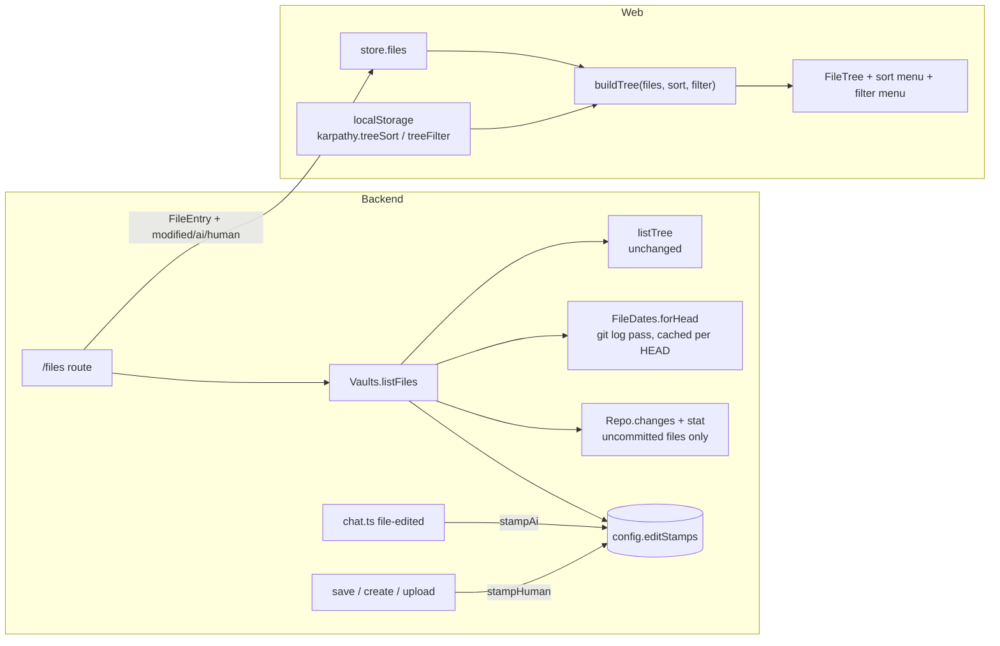
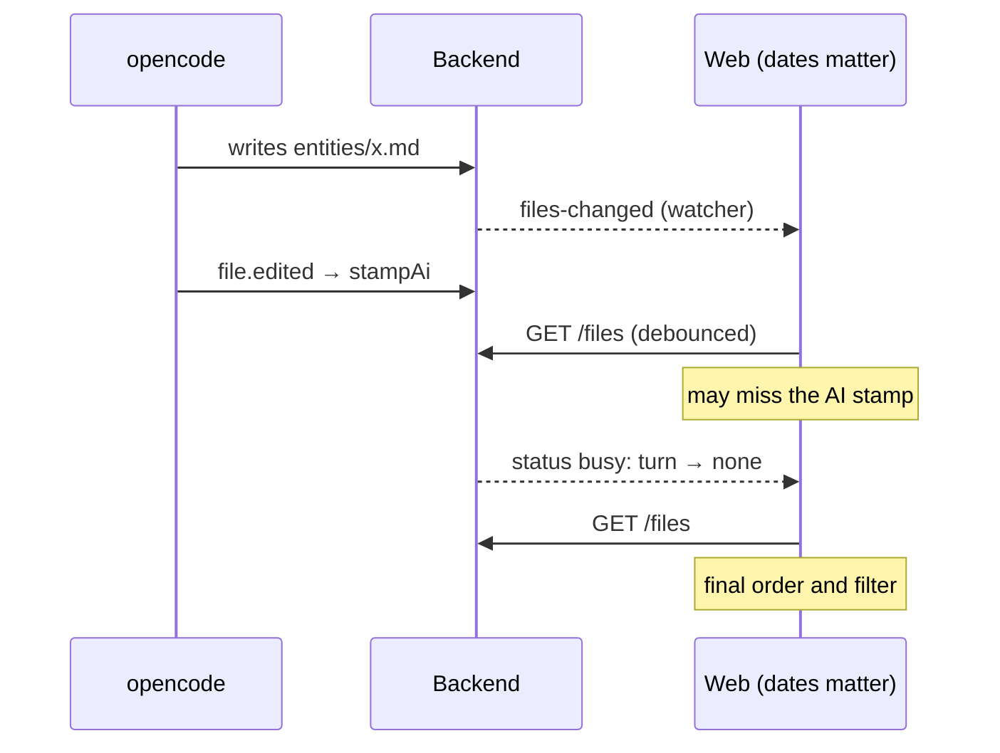

# Architecture: sort and filter the file tree

## Overview

The backend adds three optional dates to each file of `GET /vaults/:id/files`. The web app sorts and
filters client-side, so switching costs no request and works on the service worker's cached listing.



## Wire format

`packages/shared` — `FileEntry` gains three optional fields, epoch milliseconds, only on files:

```ts
export interface FileEntry {
  path: string;
  type: 'file' | 'dir';
  /** Last modified: uncommitted → mtime; else last commit time. */
  modified?: number;
  /** AI stamp. */
  ai?: number;
  /** Newer of human stamp and last commit time without the AI trailer. */
  human?: number;
}
```

Optional so older cached listings (service worker) and other `listTree` callers stay valid. Epoch ms
rather than ISO strings: the client only compares them, and they are shorter in a listing of hundreds
of files.

## Backend

### Where the dates are added

Only `Vaults.listFiles` (the `/files` route) adds dates. `listTree` stays as it is: search, uploads and
relinking use it and don't need dates.

```mermaid
sequenceDiagram
    participant W as Web
    participant V as Vaults.listFiles
    participant T as listTree
    participant G as git
    participant C as config store
    W->>V: GET /files
    V->>T: walk the vault root
    V->>G: rev-parse HEAD
    alt HEAD differs from the cached one
      V->>G: log --format=… --name-only -- <root>
      V->>V: build per-path {last, lastHuman}
    end
    V->>G: status (Repo.changes)
    V->>V: stat each uncommitted file → mtime
    V->>C: read editStamps[id]; drop stamps of missing paths
    V-->>W: entries with modified / ai / human
```

### Git history pass (`file-dates.ts`, new)

One `git log` over the vault root, newest first:

```
git log -z --format=%x1e%ct%x1f%(trailers:key=Co-authored-by,valueonly) --name-only -- <pathspec>
```

- Walks the output once; for each path keeps the **first** commit time seen (`last`) and the first
  commit time of a commit whose trailers don't contain the app agent (`lastHuman`). Paths outside the
  vault root are dropped through `Repo.toVaultPath`.
- The result is cached per vault, keyed by the HEAD hash. A commit or pull moves HEAD, so the next
  listing recomputes; every other listing reuses it. The cache lives in the vault runtime (memory only).
- No `--follow`: a renamed file's last commit is the rename commit, which is right for "last modified".
- Cost: linear in history size. Typical vaults (a few thousand commits) take well under a second, once
  per HEAD. Revisit if a vault's history makes the first listing slow.

Trailer detection uses `AI_TRAILER`'s name and e-mail from `repo.ts`, so the two can't drift apart.

### Uncommitted files

`Repo.changes()` lists uncommitted paths (modified, added, untracked, renamed). For each that still
exists, `stat` gives `mtime` → `modified`. Deleted paths are not in the tree anyway. Only uncommitted
files are stat'ed, so a large vault costs a handful of `stat`s, not hundreds.

### Edit stamps (`config-store.ts`)

```ts
editStamps: Record<string /* vaultId */, Record<string /* path */, { ai?: number; human?: number }>>;
```

Next to `aiTouched`, loaded with `raw.editStamps ?? {}` so existing config files keep working.
`Vaults` gets `stampAi(id, paths)` and `stampHuman(id, paths)`, and folds the lifecycle from the domain
table into the existing code paths:

| Code path | Change |
|---|---|
| `chat.ts` `file-edited` → `markAiTouched` | also `stampAi` (same event, same path rules: absolute paths are ignored) |
| `PUT /vaults/:id/file` (save, create) | `stampHuman` after the write |
| upload (`Vaults.upload`) | `stampHuman` for each written file |
| move into own folder (`vaults.ts` relink) | rename the stamp keys, like `aiTouched` |
| discard | delete the path's stamps newer than its last commit time (from the history cache); untracked → delete all |
| vault removed / replaced | delete `editStamps[id]`, like `aiTouched` |
| `listFiles` | drop stamps of paths not in the tree; write back only if something was dropped |

`aiTouched` and the commit trailer logic stay untouched. They could later be derived from the stamps
(touched = AI stamp newer than the last commit), but that is a separate refactor.

### Combining

```
modified = mtime (uncommitted) ?? history.last
ai       = stamps.ai
human    = max(stamps.human, history.lastHuman)
```

Each field is left out when it has no value.

## Web app

### Sort, filter and tree (`lib/tree.ts`)

```ts
type TreeSort = { by: 'name' | 'changed'; dir: 'asc' | 'desc' };
type TreeFilter = 'any' | 'ai' | 'human';
const DEFAULT_SORT: TreeSort = { by: 'name', dir: 'asc' };

function dateOf(e: FileEntry, filter: TreeFilter): number | undefined; // any→modified, ai→ai, human→human
function buildTree(entries: FileEntry[], sort = DEFAULT_SORT, filter: TreeFilter = 'any'): TreeNode[];
```

- At the defaults the result is identical to today's.
- With `filter ≠ 'any'`: files without `dateOf` are skipped. Folders are created only on the way to a kept
  file (`dirOf` already creates them lazily). Folder entries from the listing (`type: 'dir'`) are skipped
  under a filter, so empty folders don't appear.
- `TreeNode` gains `date?: number`: the file's `dateOf`, or for a folder the max over its children. It is
  computed bottom-up in the same pass as the sort, which then follows the domain's rule.
- `loadView(storage)` / `saveView(storage, {sort, filter})` with keys `karpathy.treeSort` and
  `karpathy.treeFilter`, in the same try/catch style as `loadExpanded`. Unknown or broken stored values
  read as the defaults.

### Controls (`FileTree.tsx`)

The `gh` header gets two buttons before **New note**:

| Button | testid | Menu | Closes |
|---|---|---|---|
| Sort (⇅) | `tree-sort` | group "Sort by" (Name, Last changed) + group for the direction, with labels that follow the criterion (A → Z / Z → A or Newest first / Oldest first), all `menuitemradio` + `aria-checked` | outside tap, Escape (stays open on choice) |
| Filter (funnel) | `tree-filter` | group "Changed by" (Anyone, AI, Human), `menuitemradio` | on choice, outside tap, Escape |

- Both buttons get `aria-haspopup="menu"` and `aria-expanded`. A button that is not at its default gets
  the accent tint (`.on`).
- Choosing a criterion also sets its natural direction (name → asc, changed → desc). Choosing a direction
  keeps the criterion.
- While the filter is `ai` or `human`, a chip under the header (`data-testid="tree-filter-chip"`) shows
  "Changed by AI" or "Changed by human", with a ✕ button (`aria-label="Clear filter"`) that resets the
  filter to `any`.
- Empty result under a filter: "No notes changed by the AI yet." / "No notes changed by a human yet.", with
  the same ✕.
- Both menus are one small `TreeMenu` component (a positioned list of radio groups). It's used twice, so
  it earns its own file. No menu library is added.
- The tree builds through `useMemo([files, sort, filter])`. Expansion state is keyed by path and isn't
  touched by the filter. Revealing the open note is a no-op when the note is filtered out.

### Live updates (`store.tsx`)

Today `onEvent` refetches `/files` only when a path is new or deleted, so a plain modification never
reaches the listing's dates. Change: when the dates matter (sort by `changed`, or filter ≠ `any`), every
`files-changed` schedules a refetch, debounced by 500 ms, so a burst of AI writes costs one request. At the
defaults nothing changes.

The race: the watcher's `files-changed` (chokidar, 300 ms debounce) and opencode's `file.edited` →
`stampAi` arrive independently. A refetch can see the new mtime before the AI stamp. To converge, the
store also refetches once when the vault status's `busy` leaves `turn`. After that the listing is final
for the turn.



The sort and filter preferences live in `store.tsx` (state + setters), so `onEvent` can read them
through a ref, as it does for `paths`.

## Decisions and tradeoffs

| Decision | Chosen | Rejected because |
|---|---|---|
| Date for committed files | last commit time | clone mtime: a fresh clone or pull stamps every file with the same time |
| Human attribution of pulled edits | git history, commits without the AI trailer | stamping at pull time: needs a pull hook and loses the original time |
| Where the AI/human record lives | backend config volume | in the vault (`.karpathy/…`): would be committed and synced to Obsidian, noise in every commit |
| Per-file AI attribution in commits | not added | a per-file trailer would make the AI date survive re-clones, but it lengthens every commit message; stamps suffice for one backend |
| UI shape | two controls: sort (criterion + direction) and filter (author) | one list of four combined orders: "by AI" is about *which* notes, not order. As an order it left hundreds of undated notes at the bottom, and it gave no way to reverse direction |
| What Last changed means under a filter | the filter's author's date | always the overall date: "Human + newest first" would then rank a note by the AI's later edit |
| Sorting and filtering | client-side | server-side `?sort=&filter=`: every switch would need a request and wouldn't work offline |
| Folder placement | folders first, ranked by newest descendant | Obsidian's alphabetical folders hide the activity in collapsed folders |
| Live refresh | debounced refetch + refetch at turn end | dates in the `files-changed` event: the AI stamp can still lag, so the turn-end refetch is needed either way |

## Known limits

- A re-cloned vault (vault replaced, new server) loses its stamps: AI dates restart empty, human dates
  fall back to git history.
- A file the AI and the user both changed before one commit keeps both stamps; the trailer commit itself
  adds neither.
- A gitignored file is in the tree but in neither history nor `git status`: it has no `modified` and
  sorts into the undated tail.
- `modified` of an uncommitted file is the server's mtime; a pull that re-applies uncommitted changes
  (stash pop) rewrites it to pull time. Rare and harmless: it only affects files changed around a pull.

## Testing

| Level | What | Where |
|---|---|---|
| Unit (web) | sort rule both directions, folder rank, undated tail, filter (files, folders, empty folders), filter picks the date, defaults identical to today, preference load/save | `apps/web/src/lib/tree.test.ts` |
| Integration (backend, real git) | `modified` from commits vs mtime; `human` from a commit without trailer, not from one with it; stamps from save/upload/`markAiTouched`; discard and move rules; survive restart and commit; HEAD cache recomputes after commit | `apps/backend/test/api.test.ts` |
| LLM (real opencode) | a chat turn that writes a file yields an `ai` date for it in `/files` | `apps/backend/test/chat.llm.test.ts` |
| e2e (Playwright, dev stack) | sort menu sets criterion and direction; filter menu + chip + ✕; a save moves the note to the top under Last changed; choices survive reload | `e2e/tree-sort.spec.ts` (new) |
