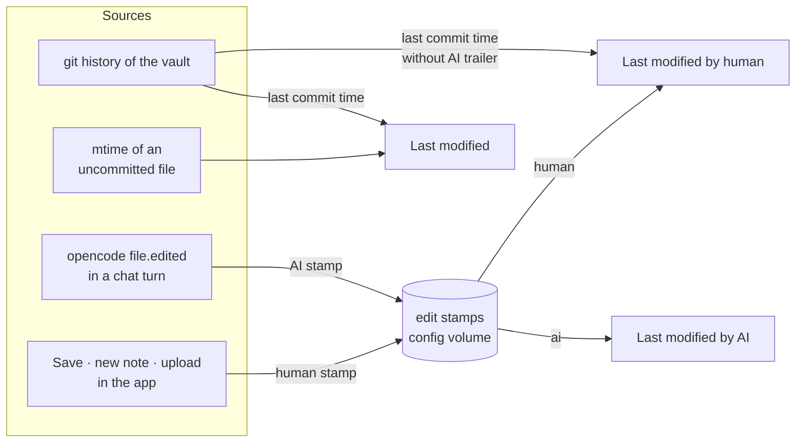
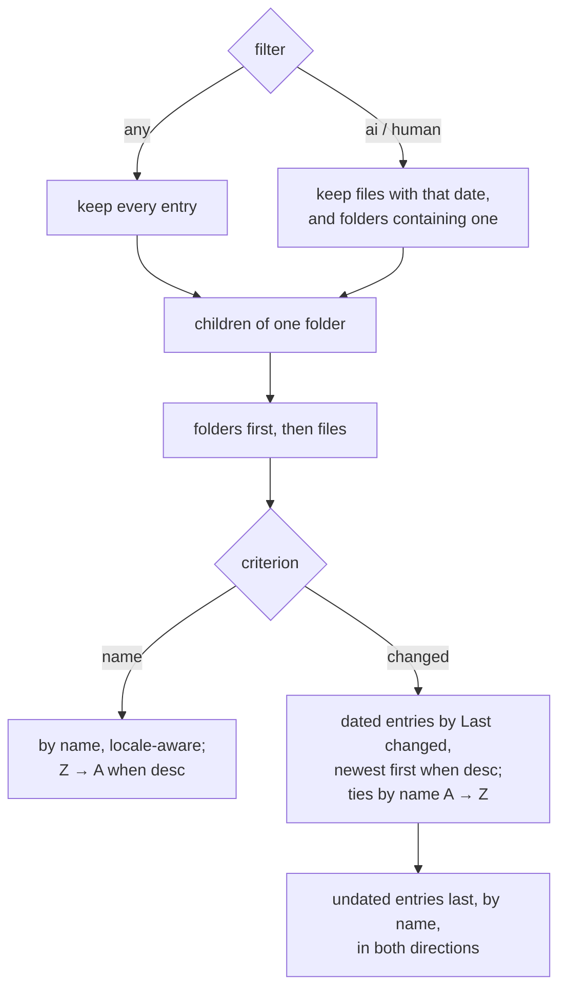

# Domain: sort and filter the file tree

## New and changed terms

| Term | Meaning | In code |
|---|---|---|
| **Tree sort** | How the file tree orders the entries of each folder: a **criterion** (`name` or `changed`) and a **direction** (`asc` or `desc`). Name A → Z = `asc`; Last changed newest first = `desc`. Picking a criterion sets its natural direction (name → `asc`, changed → `desc`). *Avoid:* order by, view. | web `TreeSort`; localStorage `karpathy.treeSort` |
| **Tree filter** | Whose changes the tree shows: `any` (default), `ai`, `human`. A file matches when it has a date for that author. A folder is shown when a matching file is somewhere inside it. The filter also chooses which date **Last changed** uses. *Avoid:* view, scope. | web `TreeFilter`; localStorage `karpathy.treeFilter` |
| **Last changed** | The user-facing name for the date a file is sorted by. Which date that is depends on the filter: `any` → **last modified**, `ai` → **last modified by AI**, `human` → **last modified by human**. | web `dateOf(entry, filter)` |
| **Last modified (of a vault file)** | For a file with an uncommitted change: its server-side write time (mtime). Otherwise: the commit time of the last commit that changed it. Never the clone's mtime of a committed file. | `FileEntry.modified` |
| **Edit stamp** | The time the app last saw the AI (**AI stamp**) or a person (**human stamp**) write a file. Persisted per vault and path in the backend config; survives commits and restarts. | `config.editStamps` |
| **Last modified by AI** | The file's AI stamp. No stamp → no date. | `FileEntry.ai` |
| **Last modified by human** | The newer of the file's human stamp and the commit time of the last commit that changed it **without** the AI trailer. No either → no date. | `FileEntry.human` |
| **Folder rank** | Under **Last changed**: the newest Last-changed date of any matching file inside the folder, at any depth. It is the same in both directions; only the comparison flips. A folder with no dated file has no rank. | web `buildTree` |
| **AI-touched** *(unchanged)* | Still the set of paths the AI changed since the last commit, used only for the commit trailer. It and the edit stamps are fed by the same event but live independently: a commit empties the set and keeps the stamps. | `config.aiTouched` |

## Where the dates come from

## Stamp lifecycle

| Event | AI stamp | Human stamp |
|---|---|---|
| The AI writes the file in a turn | set to now | — |
| The user saves, creates or uploads the file in the app | — | set to now |
| The app moves a page into its own folder (with its uploads) | moves with the path | moves with the path |
| The user discards the file's uncommitted change | removed if newer than the file's last commit | removed if newer than the file's last commit |
| The file is deleted (by anyone) | removed when the file is gone at listing time | removed when the file is gone at listing time |
| Commit (with or without trailer) | kept | kept |
| Pull brings a new commit for the file | — | not stamped; the commit counts through git history if it has no AI trailer |
| Vault removed or replaced | removed | removed |

Rules:

- A discarded change is undone, so a stamp newer than the file's last commit points at a write that no
  longer exists and is removed. Stamps older than the last commit describe the committed content and
  stay: an AI-written page that was committed, then edited and discarded, keeps its AI date. An
  untracked file disappears on discard and loses all stamps.
- Stamps for paths that no longer exist are dropped lazily, the next time the file list is built. A path
  that comes back later starts without stamps.
- A commit with the AI trailer is mixed by definition (the trailer covers the whole commit). It never
  counts as a human edit; the stamps recorded while the edits happened say who wrote which file.
- History before the change ships: commits without the trailer count as human edits (they were made in
  Obsidian, on GitHub, or by the app with no AI involved). Commits with it count for nothing. No AI
  dates are guessed from the past.

## Filter and ordering rule

A folder's date in this rule is its **folder rank**. Under the `ai` and `human` filters every shown file
has a date, so the undated tail occurs only with `any`, for example with gitignored files.

## Parties

- **The user** chooses sort and filter; their edits in the app and elsewhere make human dates.
- **The AI** (opencode, in a chat turn) makes AI dates.
- **Other devices** (Obsidian, GitHub) reach the vault only as commits; they count as human unless the
  commit carries the app's AI trailer.
