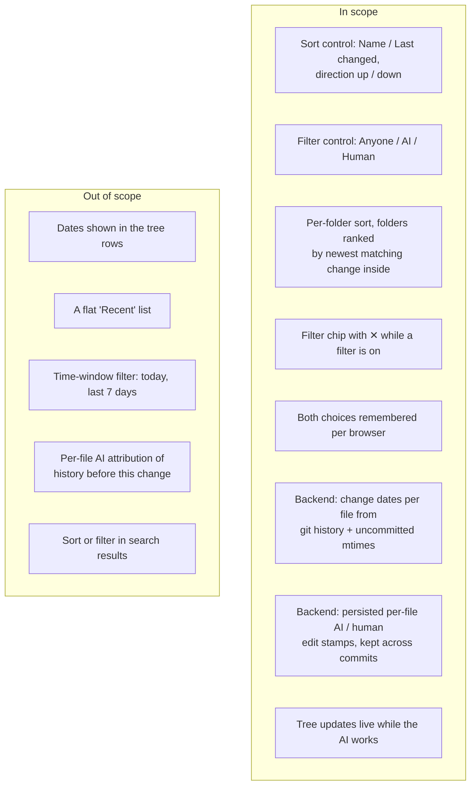

# Proposal: sort and filter the file tree

## What

The file tree gets two small controls in its **Notes** header
([#122](https://github.com/tillg/karpathy.app/issues/122)):

1. **Sort**: what to sort by (**Name** or **Last changed**) and the direction (up or down).
2. **Filter**: whose changes to show (**Anyone**, **AI** or **Human**).

Each control answers one question: sort is "in what order", filter is "whose work". Together they cover
the issue's cases:

| The user wants… | Sort | Filter |
|---|---|---|
| today's tree | Name, A → Z | Anyone |
| what changed recently | Last changed, newest first | Anyone |
| what the AI just did | Last changed, newest first | AI |
| what I wrote lately | Last changed, newest first | Human |

**AI** and **Human** are attributed per file: the app records who wrote a file through it, and git history
supplies the rest. The tree stays a tree: entries are sorted inside each folder, and under **Last changed**
a folder moves up when something inside it changed recently.

## Why

- The AI writes many pages in one ingest: a source page, three entities, two concepts, the index and the
  log. Afterwards the user wants to see *what the AI just did* without opening the Changes panel (which
  only knows about uncommitted files) or the chat transcript (which only knows one chat).
- The reverse matters too. "What did I write last week" is the question when picking up a thought, and
  today that means remembering the name.
- With a wiki of a few hundred pages in `entities/`, `concepts/`, `sources/`, alphabetical order hides
  recent activity completely once the folders are collapsed.
- Two controls instead of one list of combined orders: "by AI" is a question about *which* notes, not
  about order. As a filter it also drops the hundreds of notes the AI never touched, instead of piling
  them up at the bottom of the tree.

## Scope



## The UI

### Notes header

```
Notes                        [⇅] [⏷] [✎]
```

Three icon buttons, right-aligned as **New note** is today: **Sort** (⇅), **Filter** (funnel ⏷), **New
note** (✎). They look like the header's other icon buttons. A button that is not at its default (Name, A → Z,
Anyone) gets the soft accent background the app uses for active buttons (`.ib.on`), so a changed tree is
never a surprise.

### Sort menu

```
┌──────────────────────────┐
│ SORT BY                  │
│ ✓ Name                   │
│   Last changed           │
│ ──────────────────────── │
│ ✓ Newest first           │   ← with Name: "A → Z"
│   Oldest first           │   ← with Name: "Z → A"
└──────────────────────────┘
```

- Two radio groups in one menu. The direction labels follow the criterion: **A → Z / Z → A** for Name,
  **Newest first / Oldest first** for Last changed. Plain words instead of an arrow icon nobody can read.
- Switching the criterion sets its natural direction: Name → A → Z, Last changed → newest first. The
  user rarely wants "oldest first" by accident.
- The menu stays open after a choice, so criterion and direction can be set in one visit. It closes on
  tap outside or Escape.

### Filter menu and chip

```
┌──────────────────────────┐        Notes                 [⇅] [⏷] [✎]
│ CHANGED BY               │        ┌─────────────────────────────┐
│ ✓ Anyone                 │        │ ✦ Changed by AI          ✕  │  ← chip under the header
│   AI                     │        └─────────────────────────────┘
│   Human                  │        ▸ concepts                      
└──────────────────────────┘        ▾ entities
                                       Andrej Karpathy
                                    ▸ sources
```

- One radio group. The menu closes on choice: there is only one decision to make.
- While **AI** or **Human** is on, a chip under the header says what is shown ("Changed by AI" with the
  sparkle icon, "Changed by human" with the person icon) and has a ✕ that resets to Anyone. On a phone this
  chip is the reminder that the tree is filtered, since nobody looks at a tinted icon.
- The filter shows the files the AI (or a person) ever changed, and the folders that contain them.
  Empty folders are hidden. Expanded folders stay as the user left them.
- Nothing matches: "No notes changed by the AI yet." with the ✕ to reset.

### How sort and filter combine

**Last changed** means the last change *by whoever the filter selects*:

| Filter | Last changed = |
|---|---|
| Anyone | the last change by anyone (last commit, or the server write time of an uncommitted file) |
| AI | the last change the AI made |
| Human | the last change a person made, in this app or elsewhere (Obsidian, GitHub) |

So "Human + newest first" puts the note the user edited this morning on top, even if the AI changed it
an hour later. Under **Name** the filter only hides; it doesn't change the order.

## Decisions visible to the user

- **Folders stay on top.** Folders come first, then files, as today, under both criteria. Under **Last
  changed**, a folder is ranked by the newest matching change anywhere inside it, in the chosen direction.
  Obsidian keeps folders alphabetical under every order. That would hide exactly the activity the user is
  looking for when `entities/` and `concepts/` are collapsed.
- **Ties** (same time) fall back to the name, A → Z.
- **Files without a date** (a gitignored file has neither history nor an uncommitted change) go last under
  **Last changed**, whatever the direction.
- **What "last changed" means.** For a file with uncommitted changes: when it was last written on the
  server. For a committed file: the time of the last commit that changed it. It is **not** the clone's file
  time alone, because a fresh clone or a pull would otherwise give every file the clone or pull time.
- **What counts as AI and as human.**
  - *AI*: every file the AI writes in a chat turn, from the moment this change ships. Commits keep the
    stamp (unlike the AI-touched set, which a commit empties).
  - *Human*: every save, new note and upload in this app, and every commit that reached the vault without
    the app's AI trailer. That is how edits made in Obsidian or on GitHub show up.
  - A commit made by the app *with* the AI trailer counts for neither. It mixes both, and the app already
    recorded which one wrote each file when it happened.
  - Older history is not re-attributed. Files the AI changed before this change ships don't match **AI**
    until the AI changes them again. **Human** matches nearly every note in a long-lived vault, so it is
    mostly useful sorted by Last changed.
- **The open note may be filtered out.** It stays open in the note pane. The tree just doesn't show it,
  and "reveal the open note" does nothing while it is hidden.
- **Live.** While the AI works, the tree re-orders and the AI filter fills in as files change. The tree is
  final by the end of the turn at the latest. A re-order never collapses a folder.
- **Remembered per browser**, for all vaults, like the Write/Read mode preference: criterion, direction
  and filter. Default: Name, A → Z, Anyone.
- **Offline**: the cached file list carries the dates and authors, so sort and filter work on the last
  known state.

## Expected outcome

- After an ingest, **AI** + **Last changed, newest first** shows only the touched folders, each with the
  new or changed pages first.
- An edit made in Obsidian and pulled into the vault rises to the top under **Last changed** with filter
  **Anyone** or **Human**.
- At the defaults, everything behaves exactly as today.

## Impact on existing behavior and docs

- `specs/system/functional.md` §Notes says "folders first, alphabetical". At `/spec:archive` this becomes
  "folders first, in the chosen order, optionally filtered".
- `README.md` gets one line for sort and filter, in the implementation.
- `GET /vaults/:id/files` returns more fields per file. Existing tests that compare the listing exactly
  are updated in plan step 2, which needs the user's OK.
- Overlap: `chat-commands-research` (applying) has uncommitted edits in `files.ts`, `vaults.ts` and
  `packages/shared/src/index.ts`. This change touches the same files, so apply it after that change's
  edits are committed, or merge with care.
