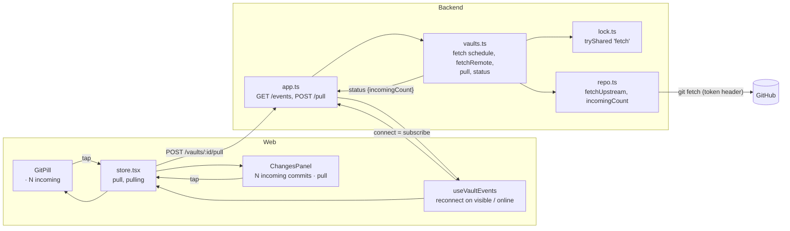
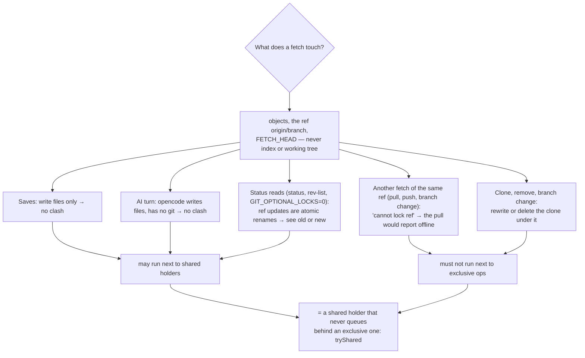
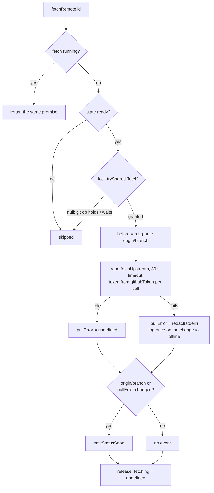

# Architecture: background fetch, incoming count and the user's pull

## Overview

Three small additions on top of what exists. No new service, no new event type.



## Shared: `VaultStatus`

```ts
export interface VaultStatus {
  state: VaultState;
  changedCount: number;
  unpushedCount: number;
  /** Commits on GitHub's branch, as of the last fetch, not in HEAD and touching the vault root. */
  incomingCount: number;
  busy: Busy;
  conflictPaths: string[];
  /** Set when the last pull or background fetch couldn't reach GitHub (git's error, redacted). */
  pullError?: string;
}
```

`incomingCount` is required and `0` while the vault isn't `ready`. It goes out on the existing `status` event and in
the replies of `GET /status`, `POST /open` and the new `POST /pull`.

## Backend: `repo.ts`

Two methods next to `unpushedCount()`:

```ts
/** Commits on origin/<branch> not in HEAD that touch the vault root. Local refs only, no network. */
async incomingCount(): Promise<number> {
  const r = await this.git.run(['rev-list', '--count', `HEAD..${this.upstream}`, ...this.pathspec], { allowFail: true });
  return r.code === 0 ? Number(r.stdout.trim()) : 0;
}

/** Updates origin/<branch> only: no merge, no index, no working tree. */
async fetchUpstream(): Promise<{ ok: true } | { ok: false; error: string }> {
  const r = await this.git.run(['fetch', '-q', '--no-auto-maintenance', '--end-of-options', 'origin', this.branch], { allowFail: true });
  return r.code === 0 ? { ok: true } : { ok: false, error: r.stderr.trim() || `git fetch failed (exit ${r.code})` };
}
```

- **The count** is `HEAD..origin/<branch>`, the mirror of `unpushedCount`'s `origin/<branch>..HEAD`. With unpushed
  commits it still counts only GitHub's side. The `-- <root>` pathspec drops commits that only touch files outside a
  subfolder vault root, like every other git query of the app. When the histories share no commit (the remote was
  replaced, #36), it counts all of GitHub's commits; the pull then resets onto them, as today.
- **`--no-auto-maintenance`** keeps a background fetch to "objects + one ref": no `gc --auto` repack while a turn or
  status read runs next to it. The pull's own fetch is unchanged.
- **Timeout.** The background fetch runs on a `Repo` built with `timeoutMs: 30_000` (`runGit` kills git and its
  helpers). A stalled GitHub can't hold the lock for long (see below). The pull keeps no timeout, as today.

## Backend: `lock.ts` — how a fetch fits the vault lock

Today every git operation takes the vault lock exclusively; saves and AI turns share it. A background fetch gets a
third, opportunistic way in:

```ts
export type SharedLabel = 'save' | 'turn' | 'fetch';

/** Shared lock only if no exclusive op holds or waits for it, else null (background fetch). */
tryShared(label: SharedLabel): Release | null {
  if (this.exclusiveHeld || this.queue.some((w) => w.kind === 'exclusive')) return null;
  return this.grantShared(label);
}
```

`busy` is unchanged: a `fetch` holder is neither `turn` nor `sync`, so the pill doesn't show "Syncing…" every 2
minutes.

### Why shared, and not exclusive or no lock



- **Exclusive** was rejected. It would show "Syncing…" on every tick, could not run during an AI turn (the count would
  go stale for the whole turn), and an exclusive request queued behind a turn blocks every new save until the turn
  ends (writer preference). That is acceptable for a user's commit, not for a timer.
- **No lock** was rejected. Two fetches of the same ref race on `refs/remotes/origin/<branch>.lock`; when the pull's
  fetch loses, `Repo.pull` returns `offline`. Clone, remove and branch change would also run under a fetch. Every
  exclusive call site would need its own "wait for the fetch". `GIT_OPTIONAL_LOCKS=0` doesn't help: ref locks aren't
  optional.
- **Shared via `tryShared`** gets both for free: exclusive ops wait for a running fetch through the lock they already
  take, and the fetch never waits. The cost: an exclusive op that arrives during a fetch waits for it, normally well
  under a second, at most the 30 s timeout. While it waits, new saves queue (writer preference); the editor keeps its
  draft meanwhile, as during any git operation.
- **One special case: the pull on open** uses `tryExclusive` and skips when the lock isn't free. A fetch started by
  the same app load would make it skip. `open()` therefore first awaits a running background fetch, then tries.

## Backend: `vaults.ts`

### Runtime state

```ts
interface Runtime {
  // … existing fields
  /** The running background fetch; a second caller joins it. */
  fetching?: Promise<FetchOutcome>;
  /** Interval timer while the vault has event-stream subscribers. */
  fetchTimer?: NodeJS.Timeout;
}
type FetchOutcome = 'fetched' | 'offline' | 'skipped';
```

`VaultsEnv` gains `fetchIntervalMs?: number` (default `120_000`). Tests pass a short one; production doesn't
configure it.

### `fetchRemote(id)`



- Runs in conflict too: it only moves `origin/<branch>`. The UI hides the count during a conflict.
- Emits a status only when something changed, so a quiet vault doesn't refetch the Changes list every 2 minutes
  (each `status` event bumps `changesNonce` in the web store).
- The token goes the same way as for every git operation: `this.repo(v)` reads `githubToken()` per call, `runGit`
  sends it as `http.https://github.com/.extraheader`, never in the URL or `.git/config`; the error passes through
  `this.redact`.

### Schedule: subscribe and unsubscribe

```ts
subscribe(id, fn) {
  const r = this.runtime(id);
  r.listeners.add(fn);
  if (!r.fetchTimer) r.fetchTimer = setInterval(() => void this.fetchRemote(id), this.fetchInterval);
  void this.fetchRemote(id);               // fresh count on every connect
  return () => {
    r.listeners.delete(fn);
    if (r.listeners.size === 0) { clearInterval(r.fetchTimer); r.fetchTimer = undefined; }
  };
}
```

`close()` and `remove()` clear the timer; `remove()` does it before `this.rt.delete(id)`, so no tick fires for a
vault that is gone. `fetchRemote` never rejects: a missing vault (`config(id)` would throw 404) and every git or
store error end as `'skipped'` or `'offline'`, because a rejected `void` promise from a timer is an unhandled rejection
that ends the Node process. The only subscriber is the event-stream route (`app.ts`), so "a browser
has the vault open" is exactly "someone listens".

### `pull(id)` and `open(id)`

```ts
async pull(id: string): Promise<VaultStatus> {
  this.requireReady(id);
  const r = this.runtime(id);
  await r.lock.withExclusive(async () => {
    if (r.conflict) throw new HttpError(423, 'vault is in conflict; resolve it first', 'conflict');
    await this.pullUnlocked(id);
  });
  return this.status(id);
}
```

- The same `pullUnlocked` as open, commit, push and the turn. A conflict it causes is recorded there and shows in the
  returned status (`state: 'conflict'`), not as an HTTP error: the user asked for the pull and it happened.
- An offline result shows as `pullError` in the returned status.
- During an AI turn the exclusive request waits until the turn releases its shared lock (`busy` stays `turn`, then
  `sync` while the pull runs).
- `open()`: `await r.fetching` before `tryExclusive()` (see the lock section).

### `status(id)`

Adds `repo.incomingCount()` to the existing `Promise.all` with `changes()` and `unpushedCount()`. Read-only, local,
no lock, like the other two.

## Backend: `app.ts`

| Route | Body | Reply |
|---|---|---|
| `POST /vaults/:id/pull` | none | `200 VaultStatus`; `409 not-ready`; `423 conflict` |

Next to `POST /vaults/:id/push`. Bearer-guarded like every route.

## Web

### `lib/api.ts` and `store.tsx`

- `api.pull(id) → VaultStatus`.
- Store action `pull()` and flag `pulling`: calls `api.pull(activeId)`, sets the status, toasts
  "Couldn't reach GitHub" when the reply has `pullError`, and toasts `errorText(e)` on an HTTP error. Changed files
  arrive as `files-changed` events from the watcher; the open note reloads through the existing path ("Updated by AI
  or another device"), and a note with unsaved text goes through the stale-save flow as today.
- No new timer and no new `visibilitychange` handler: `useVaultEvents` already reconnects the stream when the app
  becomes visible or comes back online, and each connect triggers a fetch on the server.

### `GitPill.tsx`

The pill stays one button (`changes-badge`, opens Changes). Right after it, a second button joined to it visually:

```tsx
{showIncoming && (
  <button className={`gitpill-incoming${small ? ' small' : ''}`} data-testid="incoming-badge" data-count={k}
    disabled={pulling || status.busy === 'sync'}
    aria-label={`Pull ${k} incoming commit${k === 1 ? '' : 's'} from GitHub`}
    title={`${k} new on GitHub. Tap to pull.`}
    onClick={() => void pull()}>
    · {k} incoming
  </button>
)}
```

- `showIncoming = status.state === 'ready' && status.incomingCount > 0`.
- A nested button inside the pill would be invalid HTML, and the pill's own click must keep opening Changes (several e2e
  specs use `changes-badge`). A sibling keeps `changes-badge` and its text untouched.
- CSS: the pill loses its right rounding when followed by the segment (`.gitpill:has(+ .gitpill-incoming)`), the
  segment has the same height, background and font, and the left-pointing rounding removed. Enabled during an AI
  turn (the pull waits), disabled while a pull or other git operation runs.

### `ChangesPanel.tsx`

The phone layout has no pill (only the Changes tab badge). So the Changes panel gets a banner next to the existing
"N unpushed commits · retry": `N incoming commit(s) · pull` (`data-testid="incoming"`), same action, same
conditions. The phone tab badge keeps showing only the uncommitted count.

## Interval and load

- **2 minutes** while a browser is connected, plus one fetch per connect.
- GitHub's REST rate limits are for the API, not for git's smart-HTTP fetches. Those have no published fixed limit;
  GitHub throttles abusive clients. A fetch with nothing new is one small round trip
  (protocol v2 asks for the one ref). One open tab costs 30 fetches per hour for one vault; only the active vault of
  each connected browser is fetched, so the number of configured vaults doesn't matter.
- Faster (every 30 s) buys little: the user mostly looks right after switching to the app, and that connect fetches
  anyway. Slower (5 min) would leave "I just pushed from Obsidian" invisible for too long on a desktop that stays in
  the foreground.

## Decisions and tradeoffs

| Decision | Chosen | Rejected and why |
|---|---|---|
| Lock for the background fetch | shared `fetch` holder via `tryShared`, skip when a git op holds or waits | exclusive (flicker, blocks saves behind turns, no count during turns); no lock (ref-lock race makes the pull report offline; clone/remove under a fetch) |
| Trigger | server timer per vault while subscribed + one fetch per event-stream connect | client `POST /fetch` on `visibilitychange` (#74's sketch): a second trigger path for what the reconnect already does; fetching all vaults always: traffic for vaults nobody looks at |
| Interval | 2 min | 30 s, 5 min (above) |
| Count | `rev-list HEAD..origin/<branch> -- <root>`, computed in `status()` | stored counter (goes stale after a pull, a commit, a branch change); counting all commits (shows changes the vault can't show) |
| Channel | `incomingCount` on `VaultStatus` / the `status` event | a new event type |
| Tap target | sibling segment `incoming-badge` + banner in Changes | repurposing the pill's click (breaks "pill opens Changes"); nested button (invalid HTML) |
| Pull route | new `POST /vaults/:id/pull` returning `VaultStatus` | reusing `POST /push` (it runs the same pull, but the name says push and the reply is a `CommitResult`) |
| Failed fetch | sets/clears the existing `pullError` | a separate `fetchError` field: same cause (GitHub unreachable), same "· offline" |
| Conflict | fetch runs, segment hidden, `/pull` → 423 | stop fetching (the count after resolving would be stale) |

## Risks

- **A desktop tab left open fetches forever** (30/hour). Acceptable for one user; if GitHub ever throttles, raise the
  interval or stop the timer when no `visibilitychange` keepalive arrives.
- **A hung fetch** delays a commit or turn by up to 30 s. The timeout bounds it; the pull's own fetch has no timeout
  today, a separate issue.
- **Pull tapped during a long AI turn** holds new saves until the turn ends and the pull is done (writer preference),
  the same as a commit during a turn. The editor's local draft keeps the text meanwhile.
- **`--no-auto-maintenance`** needs git ≥ 2.29; the backend image is `node:22-alpine` with Alpine's current git.
