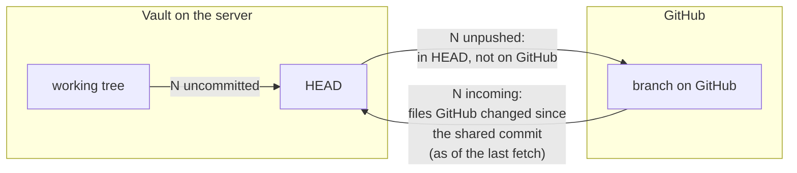
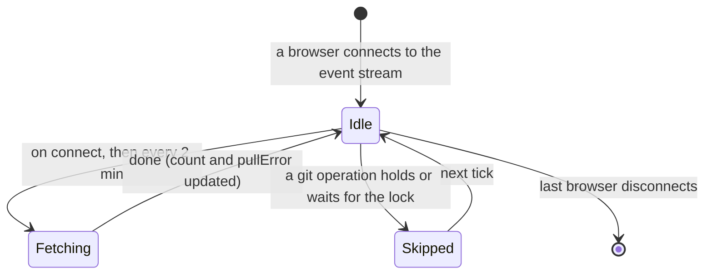
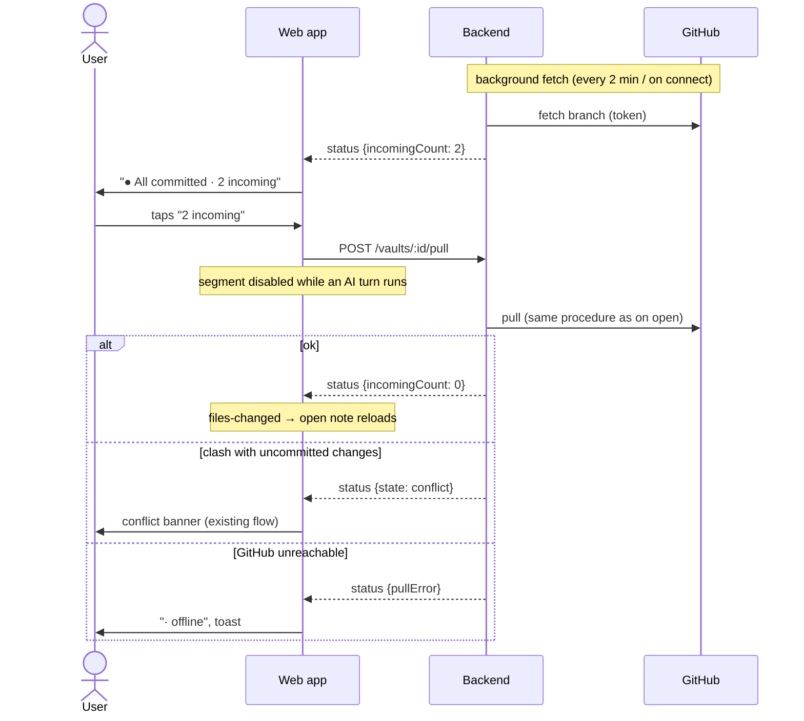

# Domain: incoming changes, background fetch and the user's pull

## New and changed terms

| Term | Meaning | In code |
|---|---|---|
| **Incoming change** (new) | A vault file that GitHub's branch changed since the last commit the vault and GitHub share, and that the vault doesn't have yet. Counted in files, not commits, like an uncommitted change. Only files inside the vault root count. Known as of the last fetch, so it can be up to one fetch interval old. The mirror image of an uncommitted change. *Avoid:* incoming commit, behind, remote change, pending change. | `VaultStatus.incomingCount`, `incomingPaths` |
| **Background fetch** (new) | A `git fetch` of the vault's branch that the backend runs on its own while a browser has the vault open: every 2 minutes and whenever a browser connects to the vault's event stream. It only updates the clone's copy of GitHub's branch; files, uncommitted changes and unpushed commits stay as they are. Never shown as "Syncing…". *Avoid:* sync, poll, auto-pull. | `Vaults.fetchRemote` |
| **Pull** (changed) | The backend's sync with GitHub (fetch, fast-forward, re-apply uncommitted changes). Runs on open, before every commit and push, before every AI turn, **and when the user taps the incoming count** (pill segment, Changes banner or the open-note bar). The sentence "There is no user-facing pull button" is dropped. | `Repo.pull`, `POST /vaults/:id/pull` |
| **pullError** (widened) | Set when the last contact with GitHub failed: a pull **or a background fetch**. Cleared by the next one that succeeds. Shown as "· offline". | `VaultStatus.pullError` |
| **Git status pill** (changed) | Gains the segment "N incoming" after "· N unpushed", as its own tap target. | web `GitPill` |

### Why the rule "no pull button" is reversed

The rule kept the UI small while pulls happened often enough on their own (open, commit, turn). Issues #74 and #117
show that this isn't enough when the user switches between Obsidian and the app: the app can't tell that GitHub moved
on, and the user can't take the changes without committing or starting a turn. The pull itself doesn't change, so
the reversal adds a trigger, not a new way to sync. ADR 0001 still holds: a pull never commits, and it only pushes
commits the user made earlier.

## Counts on both sides

The three numbers in the pill are independent. Each answers one question:

**Files, not commits.** Obsidian Git can commit every few minutes, so an afternoon in Obsidian could read "47
incoming" while it touched five notes. The pill counts files on both sides: "N uncommitted" and "N incoming" are both
files; only "N unpushed" counts commits.

| Situation | Pill | What a tap on "incoming" does |
|---|---|---|
| Clean, GitHub moved on | `● All committed · 2 incoming` | Fast-forward. |
| Uncommitted changes, GitHub moved on | `● 3 uncommitted · 2 incoming` | Stash, fast-forward, re-apply. A clash → conflict. |
| Unpushed commit, GitHub moved on (diverged) | `● All committed · 1 unpushed · 2 incoming` | The unpushed commit becomes uncommitted changes again, then as above. The next commit pushes everything. |
| GitHub only changed files outside a subfolder vault root | no segment | Nothing to show; the next pull brings them in silently. |
| Fetch failed | last count, `· offline` | The pull fails too and keeps `· offline`; nothing changes. |
| Conflict | `● Conflict` | Segment hidden; resolve first. |
| AI turn running | `● AI working… · 2 incoming` | Segment disabled; the turn's own pull takes the changes in. |

## Background fetch

- **Only while someone looks.** The schedule runs per vault while at least one browser is connected to that
  vault's event stream. The app connects only to the active vault, so other vaults are never fetched in the
  background. A phone in the pocket disconnects; a desktop tab left open keeps fetching every 2 minutes.
- **On connect.** The web app reconnects the stream when the app comes to the foreground and when the device comes
  back online. Each connect starts one fetch, so the count is fresh when the user looks.
- **Never in the way.** A background fetch runs next to saves and AI turns. It doesn't run while a pull, commit,
  discard or other git operation holds or waits for the vault; that operation is a pull anyway or comes right before
  one. The vault's `busy` state doesn't change, so the pill never shows "Syncing…" for it.
- **At most one per vault at a time.** A connect while a fetch runs joins that fetch.

## The user's pull

## Rules

- **A fetch never changes the vault's files**, its uncommitted changes, its unpushed commits or its conflict state.
  Only a pull does.
- **The count is GitHub's side only:** files inside the vault root that GitHub's branch changed since the last
  commit it shares with HEAD. Unpushed commits and uncommitted changes don't change it.
- **No automatic pull,** not even when the tree is clean. A background fetch only updates the count; a file never
  changes under the reader's eyes without a tap (or open, commit, turn). Auto-pull on a clean tree can come later on
  top of the same count.
- **The user's pull is the same pull** as on open, commit and turn: same lock, same steps, same conflict handling.
  ADR 0001 is unchanged.
- **No user pull during an AI turn.** The segment and the banner are disabled while a turn runs: the next turn starts
  with a pull anyway, and a pull queued behind a turn would block every save until the turn ends. The route itself
  still waits for a turn (a request that races the turn's start stays correct).
- **A successful user pull says so:** a toast "Pulled N changes from GitHub".
- **The open note shows when it is one of the incoming changes** ("Changed on GitHub · Pull" above the editor), so
  the user doesn't start editing a stale copy. It warns; editing stays allowed.
- **The Changes panel lists the incoming files** by name (no diff), at most 200, then "…and N more".
- **On the phone the Changes tab badge signals incoming changes** with a "↓" next to the uncommitted count (or
  alone), so the user sees them without opening the tab.
- **No pull during a conflict;** the incoming segment is hidden and the route refuses (423).
- **Offline keeps the last count.** A failed fetch sets `pullError`; the count stays what the last successful fetch
  saw.
- **The token is handled as for every git operation:** read per command, sent as an HTTP header, never in the URL or
  `.git/config`, redacted from every error message.

## Updates to the system docs at archive

- `specs/system/domain.md`: the **Pull** row (new trigger, drop "There is no user-facing pull button"); new rows
  **Incoming change** and **Background fetch**; `pullError` meaning; the "Pull and conflict" section gets the
  background fetch and the user's pull.
- `specs/system/functional.md`: the pill texts (add "· N incoming"); remove "no manual pull button" from the limits;
  the Changes and commits list gets the one-tap pull.
- `specs/system/architecture.md`: the lock row and the lock design decision ("exclusive: every git operation" gets
  the exception for the background fetch); `POST /vaults/:id/pull`; the fetch schedule.
- `CONTEXT.md`: new term **Incoming change**; **Pull** gains the user trigger.
