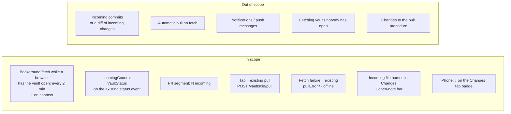
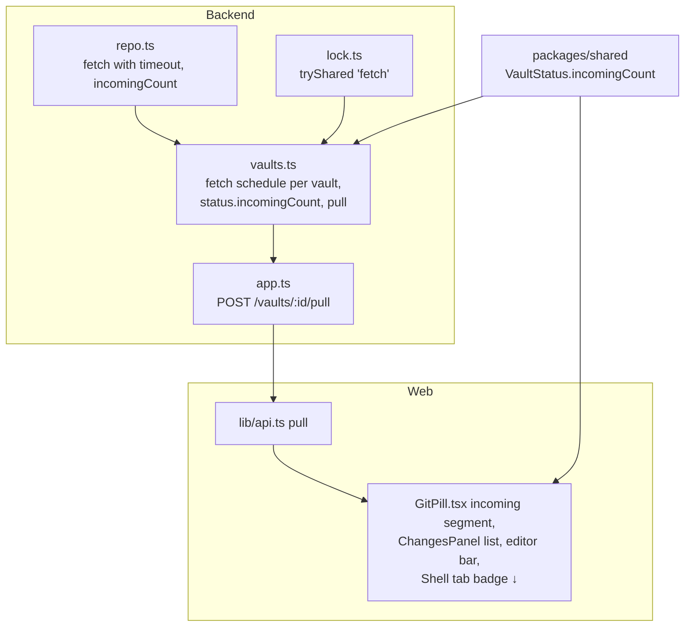

# Proposal: show incoming changes from GitHub and pull them with one tap

## What

The app learns about new commits on GitHub on its own and lets the user take them in with one tap.

1. **Background fetch.** While a browser has a vault open, the backend runs `git fetch` for that vault every
   2 minutes, and once each time the browser connects (app opened, tab back in the foreground, back online). A
   fetch only updates the clone's copy of GitHub's branch. It never touches the vault's files.
2. **Incoming count.** The git status pill shows how many files GitHub changed that the vault doesn't have yet:
   `● 2 uncommitted · 1 unpushed · 3 incoming`. The count and the file names ride on the existing `status` event of
   the vault event stream.
3. **One-tap pull.** Tapping "3 incoming" runs the existing pull (`Repo.pull`): the same procedure that already runs
   on open, before every commit and before every AI turn. Uncommitted changes are stashed and re-applied as today; a
   clash ends in the existing conflict flow. A toast confirms "Pulled 3 changes from GitHub".
4. **What's waiting.** The Changes panel lists the incoming files by name, and the open note shows "Changed on GitHub
   · Pull" when it is one of them.

Covers [#117](https://github.com/tillg/karpathy.app/issues/117) ("Show pending changes on remote") and
[#74](https://github.com/tillg/karpathy.app/issues/74) ("Auto-fetch on open with a 'behind remote' badge and one-tap
pull"). #74 is listed in the V1 plan (`specs/changes/v1/v1-plan.md`, milestone V1.4 "Trust & sync": "remote commit
pushed from outside → badge appears → one-tap pull"); this change delivers that slice.

## Why

- The vault is shared with Obsidian on the Mac and the phone. Today the app shows only its own side ("N
  uncommitted", "N unpushed"). Whether Obsidian pushed something is invisible until the next commit or AI turn pulls
  it in.
- Editing a stale copy on the iPad is the main source of conflicts (#74). Seeing "3 incoming" before starting to
  type, and taking them with one tap, avoids most of them.
- The user asked for it twice (#74, #117).

## This reverses a documented rule

`specs/system/domain.md` says of **Pull**: "There is no user-facing pull button." `specs/system/functional.md` lists
"no manual pull button" under the deliberate limits. This change adds one: the incoming count is a button that pulls.

The reason: the automatic pulls (open, commit, AI turn) bring remote changes in only as a side effect of something
else. The user wants to see what is waiting on GitHub and take it now, e.g. right after editing in Obsidian, without
committing or asking the AI. The button runs the same pull as the automatic ones, so nothing new can go wrong: the
same stash, fast-forward, re-apply and conflict handling. ADR 0001 is untouched: a pull never commits and never pushes
anything the user didn't commit before.

## Scope

### Decisions visible to the user

- **Wording.** The new segment reads "N incoming", next to "N uncommitted" and "N unpushed". "Incoming" says the
  direction without git jargon ("behind", "ahead"). It is its own tap target inside the pill; tapping the rest of the
  pill still opens the Changes list.
- **On the phone** there is no pill. The Changes tab badge gets a "↓" (`3 ↓`, or `↓` alone) when changes are
  incoming; the count and the pull live in the Changes panel as "N incoming changes · pull", next to the existing "N
  unpushed commits · retry", with the file names below.
- **What the number counts.** Files, not commits: the files inside the vault root that GitHub's branch changed since
  the last commit it shares with the vault. Obsidian Git's auto-commits would otherwise turn five edited notes into
  "47 incoming". Files outside a subfolder vault root don't count (the app never shows them).
- **The open note warns.** When the open note is one of the incoming files, a bar above the editor reads "Changed on
  GitHub · Pull". Editing stays allowed; the pull's conflict flow protects the text.
- **The file list is capped** at 200 names ("…and N more"); the count stays exact.
- **After a pull** a toast says "Pulled N changes from GitHub".
- **It counts GitHub's side only.** Unpushed commits and uncommitted changes don't change it. With "1 unpushed · 2
  incoming", the two histories have diverged; the pull folds the unpushed commit back into uncommitted changes, as it
  does today, and the next commit pushes everything.
- **No automatic pull,** not even on a clean tree. Fetching only updates the number. Pulling rewrites files the user
  may be reading or editing, so it stays a user action (or a side effect of open, commit and AI turn, as today).
- **During an AI turn the pull controls are disabled.** The turn pulls before it starts anyway, and a pull queued
  behind a turn would block every save until the turn ends.
- **During a conflict** the segment is hidden: nothing can be pulled until the conflict is resolved.
- **Offline.** A failed fetch keeps the last count and shows "· offline", the marker a failed pull already sets.
- **How fresh the count is.** At most 2 minutes old while the app is open and in the foreground, and fresh within a
  second or two of switching back to the app.

## Expected outcome

- An Obsidian push shows up as "1 incoming" within 2 minutes while the app is open, or right away when the user
  switches back to the app.
- If the open note is among them, it says "Changed on GitHub · Pull" before the user starts typing.
- One tap brings it in: "Pulled 1 change from GitHub", the open note reloads ("Updated by AI or another device"), the
  segment disappears.
- A dirty tree that clashes goes into the existing conflict flow, never loses data.
- Saves and AI turns are never blocked by a background fetch, and the pill doesn't flicker "Syncing…" every 2 minutes.
- Only the vault a browser has open is fetched. Vaults nobody looks at cause no traffic.

## Impact

No new service, no new event type, no new setting.
