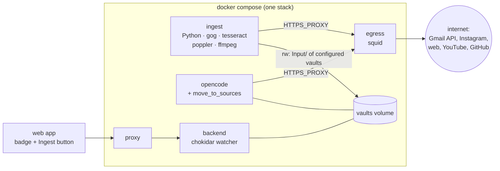
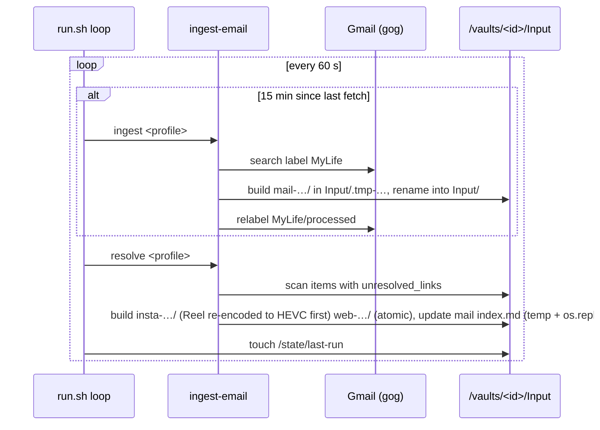
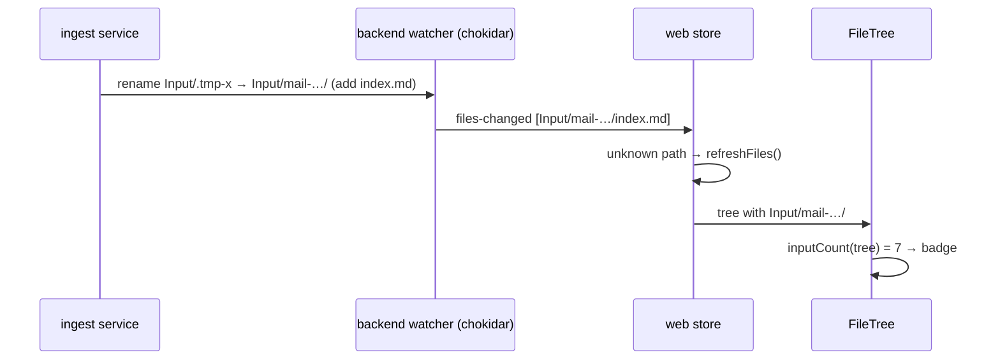
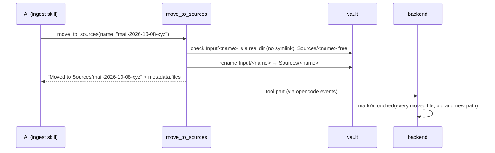
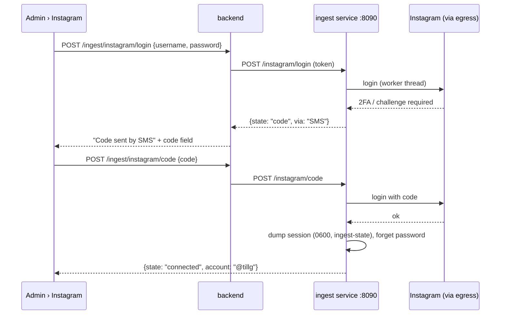
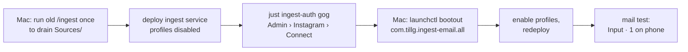

# Architecture: server-side ingestion pipeline

## Overview



## Key decisions

| Decision | Alternatives considered | Why |
|---|---|---|
| Folder `Input/` (capitalised) | `input/` (issue), `Inbox/` | Matches the vault's `Sources/`, `Wiki/`, `Schema/` |
| `Input/` is tracked by git | `Input/` in `.gitignore` (server-only queue) | The queue is visible and backed up on GitHub and can be fed from the Mac; accepted cost: waiting items show in Changes and are committed twice (in `Input/`, then moved to `Sources/`) |
| Real ingest profiles only on the `hetzner` target | profiles in every stack | Any stack with the `mylife` profile would take mails from the real `MyLife` label before prod sees them. Dev, prodtest and `local` run the service with no profiles (idle); a real test uses a separate `MyLifeTest` label |
| Badge counts every direct sub-folder of `Input/` | only items ready to ingest | One number, as the issue asks; the skill skips unfinished items and says so |
| The app sends a bare `/ingest`; the vault skill handles any queue size in that one call | app passes a batch size or repeats turns | Batch handling is ingest logic and belongs to the vault skill; the user taps once |
| A commit that meets a newly arrived item fails with the existing "changes differ from what you reviewed" (409); the user reviews again | leave new `Input/` paths out of the check and the commit (partial commits) | Rare (mail every 15 min, Instagram siblings every 1–3 min in a burst); same behaviour as for AI changes; partial commits are a bigger change |
| A long `/ingest` turn holds the vault lock (commits and pulls wait); the skill finishes one item completely (pages, then `move_to_sources`) before the next, so Stop always leaves a consistent state | per-item turns driven by the app; a turn time limit | Keeps the app free of ingest logic; Stop is the user's control |
| `ingest_email` also completes hand-made items: an `index.md` without `unresolved_links` frontmatter is scanned for URLs once and gets the link state added | resolve only pipeline-made items; leave URLs to the AI's web fetch | Same promise for every item: drop it in, it gets completed. Code lives in `ingest_email`, not in the app |
| Changes under `Input/` don't count toward the commit reminder | count everything | Waiting items are pending work, not unsaved results; one Instagram item is 3–4 files |
| Before the cutover, sources the Mac already fetched are drained with the old `/ingest` on the Mac; what remains stays in `Sources/` | move uncited sources into `Input/` once | One command; avoids re-deciding "uncited" by the heuristic this change removes |
| The vault skill also runs in Claude Code on the Mac: `move_to_sources` when the tool exists, else `mv Input/<x> Sources/<x>` | app-only skill | Ingesting from the terminal stays possible at the cost of one line in the skill |
| Instagram fallback (if Hetzner is blocked) decided after a week of use | decide now | Links wait instead of being lost, so nothing breaks while watching |

Five pieces, mostly independent:

| Piece | Where | New / changed |
|---|---|---|
| Ingest service | `deploy/ingest/` (Dockerfile, `run.sh`, `config.example.json`), `deploy/compose.yml`, Ansible role `app` | new container running `ingest-email` from its own repo |
| `Input/` badge | `apps/web/src/lib/tree.ts` (`inputCount`), `FileTree.tsx`, `Shell.tsx` (phone tab) | new, client-only |
| Ingest button | `FileTree.tsx` + store action `ingestNow()` | new, uses the existing chat API |
| `move_to_sources` | `deploy/opencode/tools/move_to_sources.ts`, `deploy/opencode/lib/move-to-sources.ts`, `opencode.json`, `apps/backend/src/harness/map.ts` | new tool, following `save_url` |
| Instagram connection | `deploy/ingest/server.py`, `apps/backend/src/ingest.ts` + routes in `app.ts`, Admin section in the web app | new: browser form, login on the server |

## 1. Ingest service

### Image

`deploy/ingest/Dockerfile`: `python:3.13-slim` + `tesseract-ocr tesseract-ocr-deu tesseract-ocr-eng poppler-utils ffmpeg`
+ the static `gog` binary (pinned release, checksum-verified) + ingest-email and `instascraper` (at its own tag, newer
than ingest-email's `[instagram]` extra pins) installed in a build stage, so git stays out of the runtime image.
`ingest_email` is a **private** repo, pinned to the commit in `deploy/ingest/ingest-email.ref` until the prerequisite
tag exists. Its source comes in as the named build context `ingest_email`: `deploy/ingest/fetch-source.sh` clones it with
the developer's own git access (dev, prodtest, tests); CI and the release workflow check it out with a read-only deploy
key (repo secret `INGEST_EMAIL_DEPLOY_KEY`). The build itself needs no credentials. Built and published like the other
images (`ghcr.io/tillg/karpathy.app-ingest:${APP_VERSION}`). Non-root (`APP_UID`), `cap_drop: [ALL]`,
`no-new-privileges`, `init: true`, bounded logs.

We **reuse** `ingest-email` instead of porting it to the Node backend: ~4.6k lines with resolvers, OCR, Instagram pacing,
retry state and its own spec; a port would duplicate it and lose the Mac CLI. Rejected: Python + tools in the backend image
(the backend holds the GitHub token and bearer token; the pipeline parses untrusted mail and web pages) and in the opencode
image (bash is denied there on purpose; the pipeline is not AI work).

### Compose service

```yaml
ingest:
  image: ghcr.io/tillg/karpathy.app-ingest:${APP_VERSION:-dev}
  build: { context: .., dockerfile: deploy/ingest/Dockerfile }
  user: *app-user
  environment:
    HTTP_PROXY: http://egress:3128
    HTTPS_PROXY: http://egress:3128
    NO_PROXY: localhost,127.0.0.1
    GOG_HOME: /state/gog
    GOG_KEYRING_BACKEND: file
    # run.sh exports the secret's content as GOG_KEYRING_PASSWORD (what gog's file keyring reads)
    HOME: /state/home            # instascraper keeps its session under ~/.config/instascraper
  secrets: [gog_keyring_password, ingest_token]   # ingest_token also goes to the backend (section 6)
  volumes:
    - ingest-state:/state            # gog token store (file keyring), instascraper session + activity ledger, locks
    - ./ingest/config.json:/etc/ingest/config.json:ro
    # vault mounts: added by the deploy (prod) or the dev/prodtest overrides, see "Mounts" below
  networks: [internal]               # no route out except the egress proxy
  depends_on: { egress: { condition: service_healthy } }
```

- **Network:** `internal` only, `HTTPS_PROXY` to squid — the same confinement as opencode, because the service fetches any
  URL a mail contains (SSRF: squid already refuses loopback, private, link-local and tailnet ranges, also after redirects).
  `httpx`, `gog` (Go) and `instagrapi` (requests) all honour `HTTPS_PROXY`; step 2 of the plan proves it per client.
- **Mounts:** the service needs only the `Input/` and `Sources/` (duplicate lookup) of the configured vaults. The vault ids
  are deploy data, so the role `app` renders `compose.target.yml` with one bind-mount pair per profile from the vaults
  filesystem (`<vaults_fs_mount>/<id>/Input` → `/vaults/<id>/Input` rw, `…/Sources` ro; the `vaults` volume is itself a
  bind of that mount, so this equals a `volume.subpath`). Only vaults already cloned get mounts (an `Input/` created
  before the clone would make `git clone` fail); the role creates `Input/` and `Sources/` in them first (an empty
  `Input/` is not a git change). The base `compose.yml` mounts no vault at all; dev and prodtest mount the whole volume.
  A vault's `root` (subfolder vaults) is not taken into account: `Input/` sits at the clone root.
- **Profiles per target:** only `hetzner` gets real profiles. Dev stacks, prodtest and the `local` VM render an empty
  `profiles` map, so the loop idles (heartbeat still written, healthcheck green). End-to-end tests with real mail use a
  separate `MyLifeTest` label, never `MyLife`.
- **Secrets / state:** Gmail OAuth uses gog's **file keyring** (`gog auth keyring file`), its store encrypted with
  `gog_keyring_password` (compose secret, generated once on the target like `opencode_password`, so it needs no Ansible
  Vault entry; `ingest_token` likewise). `just ingest-auth <target> <email>` (targets `dev`, `local`, `hetzner`) pipes
  this Mac's gog OAuth client and the account's refresh token (Keychain, `gogcli` / `token:default:<email>`) into the
  container: `gog auth credentials set`, then `gog auth import --refresh-token-stdin`; nothing is printed or stored on
  the way. Instagram is connected from the browser (section 6). Both live in
  the `ingest-state` volume (backed up with the server, not in git).
- **Health:** a heartbeat file `/state/last-run` written after each loop; the healthcheck fails when it is older than
  20 min. Gatus already alerts on unhealthy containers via the ops ntfy topic.

### Loop (`deploy/ingest/run.sh`)



- One process per container, profiles in sequence; ingest-email's per-profile lock stays (protects against an overlap
  with a manual `docker compose exec ingest ingest-email run …`).
- **Why a poll loop and not a watcher:** "as soon as a folder appears" within ≤ 60 s is good enough; `resolve` is already a
  cheap scan of `Input/*/index.md`; inotify on a bind/volume mount adds a failure mode for little gain. Mail is polled
  every 15 min as today (`run_interval_s`).
- **Instagram pacing** (1–3 min per post, 08:00–23:00, daily caps) stays inside ingest-email; a long resolve run just
  delays the next loop. It never holds any app lock.

### Writing into a live vault without the backend's lock

The backend's `VaultLock` is in-process; the ingest service can't take it. Rejected alternative: the backend drives every
run under a shared lock — Instagram pacing makes a run minutes long, and writer-preferred locking would then stall pulls
and commits. Instead the service only does operations that are safe against concurrent git and editor work:

| Operation | How | Safe because |
|---|---|---|
| New item | build in `Input/.tmp-<rand>/`, `rename` to `Input/<name>/` (`-2`… if taken) | rename is atomic on one filesystem; `listTree` skips dot-folders, so a half-built item never shows; an interrupted `.tmp-*` is removed at the next start (so it never lingers for git to see) |
| Update link state | `frontmatter.write` = temp file + `os.replace` (exists today) | never a half-written `index.md` |
| Touch an item | only while it has `unresolved_links` | once ready, the item belongs to the AI and the user |

Not protected (accepted): the user editing an item's `index.md` in the same second the service rewrites it (last
writer wins; the editor's version check then shows the stale-file conflict it shows today), and the Mac editing a committed `Input/<name>/index.md` while the server resolves it (an ordinary git conflict, resolved
in the app as today). A pull that brings a new `Input/` folder from the Mac is just a new item: the next resolve picks
it up. Commit stays safe: it refuses when the changed set differs from what the user reviewed (Key decisions).

**Pull keeps `Input/` in place:** the pull procedure stashes uncommitted changes with `--include-untracked`, which removes
and later recreates untracked folders. That would break the service's bind mount of `Input/` (new mail lands in a
detached folder) and race its writes. So the pull's dirty check and stash leave `Input/` out
(`:(exclude)<root>/Input`); waiting items stay where they are while the pull fast-forwards around them.

**Commit reminder:** `VaultStatus` gains `inputChangedCount` (changed paths under `Input/`, computed with
`changedCount`); the reminder uses `changedCount - inputChangedCount`. The Changes list itself still shows everything.

Required changes in `ingest_email` (prerequisites, own repo and tests): hand-made items (an `index.md` without
`unresolved_links`, or none at all) scanned once for URLs and given link state, marked so they aren't scanned again;
atomic item creation (today `eml.py` writes in
place), duplicate lookup across `target_dir` **and** a `archive_dirs` list (`Sources/`, so a moved item isn't fetched
again), Reel re-encoding inside the Instagram resolver before the item is renamed into place (moved from
`llm-wiki-reel-compress`; a separate pass would rewrite items that are already ready), and tolerance for being run as a non-login
user with `GOG_HOME`.

### Config

`deploy/ingest/config.json` (rendered by Ansible from the target's vars; example in the repo):

```json
{
  "defaults": { "max_per_poll": 20, "resolve_max_urls_per_mail": 5, "run_interval_s": 900 },
  "profiles": {
    "mylife": { "vault": "mylife", "label": "MyLife", "allowed_senders": ["…"] },
    "frechen": { "vault": "frechen", "label": "FrechenHelper", "max_per_poll": 50, "allowed_senders": ["…"] }
  }
}
```

`vault` is the backend vault id; `run.sh` maps it to `target_dir=/vaults/<id>/Input` and
`archive_dirs=[/vaults/<id>/Sources]`. A vault that isn't cloned yet is skipped with a log line. Configuring this in the
admin area is out of scope.

## 2. `Input/` badge



No backend change: chokidar ignores `addDir` but reports the `add` of `index.md` (`apps/backend/src/watcher.ts:27`), the
store re-lists the tree on an unknown path (`apps/web/src/store.tsx:770-800`), and `listTree` lists folders
(`apps/backend/src/files.ts:23-39`). The renamed folder appears with its files at once, so there is exactly one event per
item.

- `inputCount(tree)` in `lib/tree.ts`: number of direct child **folders** of the root folder `Input` (exact name), not
  starting with `.`. Pure, unit-tested.
- `FileTree.tsx`: the `Input` row shows a red count bullet (`.input-badge`, `aria-label="7 sources waiting to be
  ingested"`), hidden at 0. Also visible when the folder is collapsed and under an active filter.
- Phone: the Files tab in the tab bar (`Shell.tsx`) gets the same red dot with the count, like the Changes tab count.
- Dark and light mode use the existing danger colour token.

Why client-side: the tree is already complete and live in the browser; a `status.inputCount` field would duplicate it
and need its own invalidation. Cost: a vault whose tree is huge re-lists on each new item — same as any new file today.

## 3. Ingest button

- Rendered in the `Input` row next to the badge (also in the phone Files tab, which shows the same tree) when `inputCount > 0` **and** the
  vault's command list (`GET /vaults/:id/commands`) contains `ingest`. Without the skill: no button; the badge's tooltip
  says "Add an `ingest` skill to `.agents/skills/` to ingest from here".
- Tap → store `ingestNow()`: `POST /vaults/:id/chats` (new chat), switch to it, then the same send path a typed message
  uses with the text `/ingest`. So ADR 0004 holds (skill text expanded by the backend, never opencode's command
  endpoint), the turn queues like any other, and the chat shows every file read, written and moved.
- Disabled (with the reason as title) when offline, in conflict, or while a turn of this vault is running. Unlike the
  command chips it **sends** — that is the point of the button.

## 4. `move_to_sources` tool



- `deploy/opencode/lib/move-to-sources.ts` (pure fs, tested in `apps/backend/test/move-to-sources.test.ts` like
  `save-url.test.ts`) + `deploy/opencode/tools/move_to_sources.ts`.
- Argument `name`: a single path segment (no `/`, no `..`, not hidden). Source must be a directory under `Input/` with no
  symlink on the path (realpath check, as `save-url.ts` does). Target `Sources/<name>` must not exist; if it does: error
  `"Sources/<name> exists: rename or merge by hand"` (the turn goes on). `Sources/` is created if missing. One `rename` —
  atomic, no copy of media.
- Refuses an item that still has `unresolved_links` in its `index.md` ("still being processed").
- `opencode.json`: `"move_to_sources": "deny"` globally, `"allow"` in agent `vault` only — so read-only turns and conflict
  can't move.
- The tool returns `metadata.files: [{filePath: "Input/<name>/<f>", movePath: "Sources/<name>/<f>"}]` for every moved
  file (the shape `apply_patch` reports; opencode passes a custom tool's metadata into the tool part).
- `harness/map.ts`: add to `WRITE_TOOLS`; `writtenPaths` reports each moved file's old and new path, so all of them show
  as AI changes (changed chips, AI-flagged commit, edit stamps — all file-level). The chip shows `Sources/<name>`.
- The ingest skill cites the final path `Sources/<name>/index.md` in the wiki pages it writes **before** moving, then moves
  — a page never points into `Input/`.

## 5. The `ingest` vault skill

**The app contains no ingest logic.** Its only coupling to the skill is the name `ingest` (the button shows when the vault
has a command of that name and sends `/ingest`), and the generic `move_to_sources` tool the skill may call. Tapping
Ingest never fetches mail: mail arrives only through the ingest service's 15-minute loop; the skill processes what is
already in `Input/`.

Lives in each vault at `.agents/skills/ingest/SKILL.md` and is maintained there, in the vault repo: no dependency on
the `llm_wiki` repo or plugin. Everything the skill reads must lie inside the vault (functional.md, Skills): the
vaults' `Schema/methodology.md` symlink to `../../llm_wiki/methodology.md` dangles on the server and is refused by the
symlink checks, so it becomes a real file. Starting point is today's llm-wiki plugin skill, with these changes: drop step 1 (`ingest-email run`) and 1b (reel compress) — the server does both;
"unprocessed" = folders in `Input/` without `unresolved_links` instead of the cited-check + log cutoff; end each item with
`move_to_sources`; no shell commands. Requirements the skill must meet (the app relies on them, nothing enforces them):
it handles a queue of any size in one call (the user taps once), and it finishes one item completely — pages written,
then moved — before starting the next, so Stop leaves finished items in `Sources/` and the rest untouched in `Input/`.
It moves with `move_to_sources` where that tool exists (the app) and with `mv Input/<x> Sources/<x>` elsewhere (Claude
Code on the Mac). Questions still go to `Wiki/ingest-fragen.md`. Because a vault skill wins over an
app skill and is visible in Claude Code on the Mac, no app-shipped `ingest` skill is added.

## 6. Instagram connection from the browser

Why not take the session from the user's browser: the `sessionid` cookie belongs to instagram.com and is HttpOnly, so no
karpathy page can read it, and Instagram has no OAuth API that reads other people's posts (Basic Display was retired
2024-12; the Graph API reads only a business account's own media). So the browser carries the **form**, the server does
the **login** — instascraper's primary, "durable" path (`auth.py`: password login with a stable emulated device). A
session minted on the server's IP is also the one Instagram then sees in use, instead of a Mac session that suddenly
shows up from a Hetzner IP.



- **Ingest service endpoint:** a small HTTP server (`deploy/ingest/server.py`, stdlib `http.server`, port 8090) next to
  the loop, on the `internal` network only, every request needs the `ingest_token` compose secret (opencode shares that
  network; its web tools can't reach it through the egress proxy, the token is the second wall). Routes:
  `GET /instagram/status`, `POST /instagram/login`, `POST /instagram/code`, `POST /instagram/disconnect`. `run.sh`
  starts it and restarts it when it dies.
- **Pending login:** the login runs in a worker thread through instascraper's `login_interactive_free(username,
  password, code)` (instascraper ≥ 1.1.0): when Instagram asks for a 2FA or challenge code, `code(via)` blocks on a
  queue that `POST /instagram/code` fills. One pending login at a time, dropped after 5 min (`expired-code`) or on a
  new login. Errors: `wrong-password` (400), `expired-code` (400), `login-failed` (502, the exception type only).
- **No clash with the loop:** the login writes its session to a staging dir under `/state` and moves it into place
  (`~/.config/instascraper/session-<user>.json`, 0600) only on success, then sets `IG_USERNAME` in instascraper's
  config so the resolver's `get_client` uses it. A pending login never touches a working session.
- **Status:** read from the vaults, not from a status file (ingest_email stays as it is): Instagram links in an
  `Input/` item's `unresolved_links` with reason `no-session` are "waiting"; `expired` = a session is in place and an
  item was rewritten by the resolver *after* that session file with such a link still in it (a fresh connect reads
  `connected` until the resolver tried again); no session is `not-connected`. `GET /instagram/status` never logs in.
- **Username:** an Instagram username (`^[A-Za-z0-9._]{1,30}$`, not only dots), checked in the backend's zod schema and
  again in the service; each login attempt gets its own `mkdtemp` staging dir; the session is installed under the
  service lock, so a superseded login never installs. A login that doesn't answer within 90 s (504) is cancelled.
- **Dev and e2e:** compose.dev.yml sets `INGEST_FAKE_INSTAGRAM_LOGIN=1`: a built-in fake login (password `wrong`
  fails, user `twofa…` asks for code 000000 by SMS). Prod and prodtest never set it (`compose.test.sh`).
- **Password:** passed through to instagrapi once, never written to disk or logs (request bodies are not logged); the
  session file holds cookies and device ids only.
- **Backend:** `GET /ingest/instagram`, `POST /ingest/instagram/login|code|disconnect` (bearer-guarded like every route;
  zod-validated; proxied to `INGEST_URL` = `http://ingest:8090` with `ingest_token`, `apps/backend/src/ingest.ts`). The
  service's errors keep their status as `{ error, code }`, except a 401/403 from the service (token mismatch), which
  becomes `502` `ingest-auth`: the web app treats every 401 as "log out". `503` "Ingest service not running"
  (`ingest-down`) when it can't be reached or isn't configured.
- **Web:** the Settings dialog gets an **Instagram** section (`InstagramSettings.tsx`): status line, a form (username,
  password → Connect, Reconnect when expired; then "Code sent by SMS" + code → Verify), Disconnect. When the status is
  `expired`, the Vaults list shows a notice "Instagram disconnected — N links waiting" with a link to Settings.
- **Waiting links (prerequisite, open):** `ingest_email` should change `no-session` from a counted attempt to "wait".
  At the pinned commit, 5 polls without a session still give the link up for good.

## 7. Cutover



Stopping the Mac agent before enabling a profile avoids two pollers on one Gmail label. Items already in the vaults'
`Sources/` stay there; nothing is migrated into `Input/`.

## Security

- New attack surface: a container parsing untrusted mail, HTML, PDFs and images (OCR, ffmpeg). Contained by: no published
  port (only `:8090` on the internal network, token-guarded), internal network + egress proxy, non-root, dropped caps, mounts limited to `Input/` (rw) and `Sources/` (ro) of
  configured vaults, no app tokens (no bearer, GitHub, opencode, provider keys).
- `allowed_senders` stays an allowlist; an empty list admits nobody.
- The Instagram password crosses browser → proxy (TLS) → backend → ingest service once and is never stored or logged;
  the backend holds it only for the duration of the proxied request.
- Items are untrusted input for the AI (prompt injection in a mail) exactly as ingested notes are today; the
  `move_to_sources` tool can only move within `Input/` → `Sources/`, never overwrite, never delete.
- `security.md` gains a section on the ingest service at archive.

## Testing

- `ingest_email`: its own pytest suite (atomic creation, archive-dir duplicate lookup, proxy honoured).
- karpathy2 unit: `inputCount` (web vitest), `move-to-sources` (backend vitest, real fs), `map.ts` written paths.
- karpathy2 web components (new harness): `@testing-library/react` in jsdom (`// @vitest-environment jsdom` per file,
  vitest include widened to `.tsx`); `src/test/fake-api.tsx` renders the real `AppProvider` against a fake `fetch` at the
  HTTP boundary. Badge and button: `FileTree.test.tsx`, `Shell.test.tsx`; `ingestNow`: `store.test.tsx`.
- karpathy2 compose: `deploy/ingest/compose.test.sh` asserts on `docker compose config` (internal network, proxy env,
  no app secrets); `deploy/ingest/run.test.sh` runs the loop against a fake `ingest-email`.
- karpathy2 container: `apps/backend/test/ingest-egress.test.ts` (like `egress.test.ts`): the `ingest` container cannot
  reach the backend or a private IP, and reaches a public URL through the proxy.
- e2e (`just e2e`): a folder written into `Input/` shows the badge; the Ingest button sends `/ingest` in a new chat
  (deterministic); the full move through the model is an extra `@llm` case.
