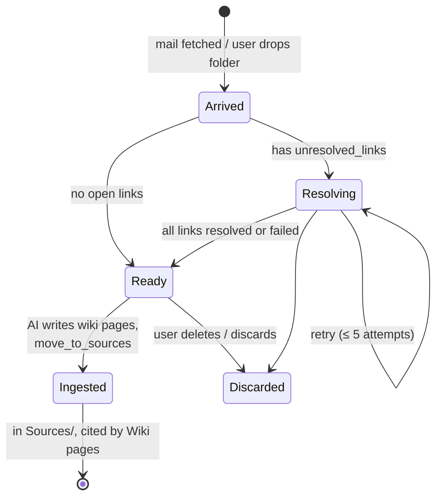
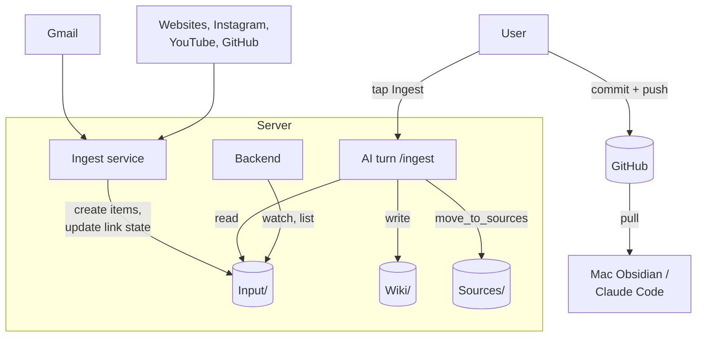

# Domain: input queue and ingestion

## New and changed terms

| Term | Meaning | In code |
|---|---|---|
| **Input** (new) | `Input/` in the vault root: the queue of sources not yet ingested. One sub-folder per item. Written by the ingest service, by the user (Obsidian, upload) and emptied by the AI's ingest. Created on demand; a vault without it simply has nothing waiting. **Tracked by git** like any folder: waiting items are uncommitted changes, a commit pushes the queue to GitHub, and a folder dropped into `Input/` on the Mac and pushed arrives on the server with the next pull. | `INPUT_DIR = 'Input'` (shared) |
| **Input item** (new) | One direct sub-folder of `Input/` with an `index.md` (frontmatter + body) and its files (`original.eml`, attachments, images, video, PDF + text extract). Named `<kind>-YYYY-MM-DD-<slug>` (`mail-…`, `insta-…`, `web-…`, `youtube-…`, `gh-…`, `contact-…`). Loose files directly in `Input/` are not items. | folder |
| **Input count** (new) | Number of direct sub-folders of `Input/`, with or without `index.md` (a folder the user drops counts too), shown as the red badge on `Input/`. Hidden folders and loose files don't count. | `inputCount(tree)` (web) |
| **Sources** (changed) | `Sources/` is now the **archive of ingested sources**. Before: "immutable source documents … that humans or ingest skills add". Items reach it by being moved out of `Input/`; new sources no longer land there directly. Existing content stays. | folder |
| **Open link** (new) | A URL in an item's `index.md` that the ingest service hasn't fetched yet: frontmatter `unresolved_links`. Becomes `resolved_links: [{url, source}]` (the source is a sibling item) or `failed_links: [{url, attempts, reason}]`. An item with open links is still being processed. | ingest_email frontmatter |
| **Ingest service** (new) | The compose service `ingest`: fetches mail and resolves open links into `Input/` on a timer. Deterministic, no LLM, never commits. | `deploy/ingest/` |
| **Ingest profile** (new) | One mail source → one vault: Gmail label set (`MyLife`, `MyLife/processed`, `/failed`, `/rejected`), allowed senders, limits, and the backend vault id whose `Input/` it writes. | `deploy/ingest/config.json` |
| **Ingest** (changed) | The AI step: the vault skill `ingest` turns input items into wiki pages, then moves each finished item to `Sources/`. Before: a Claude Code plugin skill on the Mac that also fetched mail. | vault skill `.agents/skills/ingest` |
| **Ingest button** (new) | Button next to the `Input/` badge: opens a new chat and sends `/ingest` in one tap. | web |
| **Instagram connection** (new) | The ingest service's logged-in Instagram session (one account per deploy). States: `not connected`, `waiting for code` (Instagram asked for a 2FA/challenge code, ≤ 5 min), `connected as @x`, `expired` (Instagram rejected the session). Made and renewed in Admin › Instagram; the password is used once and not kept. | ingest service `/instagram/*` |
| **Waiting link** (new) | An Instagram link that couldn't be fetched because there is no live session. Stays in `unresolved_links` without using up attempts; resolved after the next connect. | ingest_email `no-session` |
| **Move to sources** (new) | AI tool: moves one input item `Input/<name>` to `Sources/<name>`, never overwriting. | opencode tool `move_to_sources` |

## Lifecycle of an input item

- **Arrived / Resolving / Ready** all count in the badge: the user sees the queue length, not the processing state. The
  ingest skill skips items that still have `unresolved_links` (it says so) and leaves them for the next run.
- A resolved link produces a **new sibling item** (`insta-…/` next to `mail-…/`), which is itself in `Input/` and is
  ingested on its own; the mail's `resolved_links` names it by folder name, so the reference survives the move to
  `Sources/`.

## Who does what

- **Ingest service** — fetches and resolves; owns an item while it has open links.
- **AI (ingest skill)** — interprets; owns an item once it is ready; the only one that moves items to `Sources/`.
- **User** — triggers ingest, reviews and commits; may drop items into `Input/` or delete them.
- **Mac** — no longer fetches anything; a git clone like any other. It may still feed the queue (a folder in `Input/`,
  pushed) and run the vault's `ingest` skill in Claude Code.

## Rules

- An item leaves `Input/` only through the ingest skill — `move_to_sources` in the app, `mv` in Claude Code — or by the
  user deleting it. The badge going to zero means "all
  ingested", not "all resolved".
- Nothing in the pipeline commits (ADR 0001): fetched items, moves and wiki pages are uncommitted changes until the user
  commits.
- Vault content stays in its language; the pipeline adds no translation.
