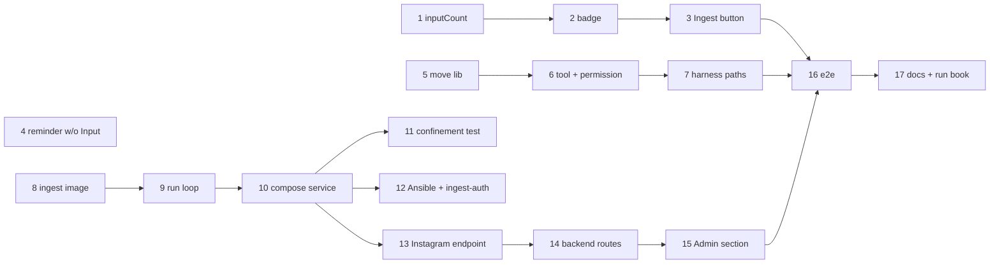

# Plan: server-side ingestion pipeline

Four tracks (web badge + button, `move_to_sources`, ingest service, Instagram connection) meet in the e2e step.

## Prerequisites in other repos

Not checkbox steps (they don't count toward this change's progress); each is done and tagged in its own repo before the
step that needs it.

- **`ingest_email`** (needed by step 8): atomic item creation (build in `.tmp-*`, rename), `archive_dirs` duplicate
  lookup, hand-made items scanned once for URLs (link state added), Reel re-encoding inside the Instagram resolver
  (before the rename), `GOG_HOME`-only operation, `no-session` waits instead of using up attempts. Verify: `pytest`
  green in `~/git/ingest_email`, tag `vX.Y.0` pushed.
- **`instascraper`** (needed by step 13): non-interactive login API — `login(username, password, code=callback)`
  where the callback supplies the 2FA / challenge code instead of `input()`; raises a typed error for a wrong password
  or a timed-out code. Verify: `pytest` green in `~/git/instascraper`, tag pushed, `ingest_email` pins it.
- **`mylife_wiki`, `frechen_wiki`** (before cutover): self-contained, no `llm_wiki` dependency. Own `ingest` skill in
  `.agents/skills/ingest/SKILL.md` (reads `Input/`, skips items with `unresolved_links`, cites
  `Sources/<name>/index.md`, handles any queue size in one call, finishes each item — pages, then `move_to_sources` —
  before the next, moves with `move_to_sources` or, without that tool (Claude Code), `mv`; no other shell steps);
  `Schema/methodology.md` a real file. Verify in each clone:
  `test -f .agents/skills/ingest/SKILL.md && ! grep -q "ingest-email run" .agents/skills/ingest/SKILL.md && ! find .
  -path ./.git -prune -o -type l -lname '*llm_wiki*' -print | grep -q .`

## Web: badge, button, reminder

- [x] Count input items in the tree (`inputCount`)
  - Depends on: none
  - Test first: `apps/web/src/lib/tree.test.ts` › "inputCount counts direct sub-folders of root Input/" — cases: 0 without
    `Input/`, 3 folders + 1 loose file → 3, `.tmp-x` ignored, nested folders not counted, `Wiki/Input/` not counted. Fails
    today: `inputCount` doesn't exist.
  - Verify: `npm test -w apps/web` → all green
- [x] Show the red count badge on the `Input` row and the phone Files tab
  - Depends on: 1
  - Test first: `apps/web/src/components/FileTree.test.tsx` › "Input row shows a badge with the item count, none at 0" and
    `Shell.test.tsx` › "Files tab shows the input count" (the phone tab bar is in `Shell.tsx`) (testing-library, real store fixture). Fails today: no badge rendered.
  - Verify: `npm test -w apps/web` → all green; `just check` → lint/typecheck clean
- [x] Ingest button: new chat + send `/ingest` in one tap
  - Depends on: 2
  - Test first: `apps/web/src/store.test.ts` › "ingestNow creates a chat and sends /ingest" (asserts the two API calls in
    order against a fake fetch at the HTTP boundary) and `FileTree.test.tsx` › "Ingest button only with an ingest command,
    disabled offline / in conflict / while a turn runs". Fails today: no `ingestNow`, no button.
  - Verify: `npm test -w apps/web` → all green
- [x] Leave `Input/` changes out of the commit reminder
  - Depends on: none
  - Test first: `apps/backend/test/api.test.ts` › "status counts changed paths under Input/ as inputChangedCount" and
    `apps/web/src/lib/reminder.test.ts` › "3 changes under Input/ + 2 elsewhere with threshold 4 → no reminder" (the
    reminder takes `changedCount - inputChangedCount`). Fails today: no `inputChangedCount`, the reminder counts all 5.
  - Verify: `npm test` → all green

## AI: `move_to_sources`

- [x] Move an input item to `Sources/` (pure fs lib)
  - Depends on: none
  - Test first: `apps/backend/test/move-to-sources.test.ts` › real temp vault: moves `Input/x/` with media to
    `Sources/x/`; refuses existing target, `../x`, `a/b`, `.x`, a symlinked `Input/x`, a symlinked `Sources`, an item with
    `unresolved_links`; creates missing `Sources/`. Fails today: `deploy/opencode/lib/move-to-sources.ts` doesn't exist.
  - Verify: `npm test -w apps/backend` → all green
- [x] Register the `move_to_sources` tool, allowed only for agent `vault`
  - Depends on: 5
  - Test first: `apps/backend/test/opencode-tools.test.ts` (real opencode container) › "move_to_sources moves an item in
    agent vault" and "move_to_sources is not available in vault-readonly" — fails today: tool not in the image, no
    permission key.
  - Verify: `npm test -w apps/backend` → all green; `docker build -f deploy/opencode/Dockerfile .` succeeds
- [x] Report both paths of a move as AI changes
  - Depends on: 6
  - Test first: `apps/backend/test/harness-map.test.ts` › "move_to_sources part yields file-edited for Input/x and
    Sources/x" — fails today: tool not in `WRITE_TOOLS`.
  - Verify: `npm test -w apps/backend` → all green

## Server: ingest service

- [x] Build the ingest image (Python, gog, tesseract, poppler, ffmpeg, ingest-email at its tag)
  - Depends on: none
  - Test first: none — image only; the check is that every binary runs inside it.
  - Verify: `docker build -t karpathy-ingest:test -f deploy/ingest/Dockerfile . && docker run --rm karpathy-ingest:test
    sh -c 'ingest-email --version && gog --version && tesseract --list-langs | grep -q deu && pdftoppm -v && ffmpeg
    -version'` → exit 0
- [x] Run loop: fetch every 15 min, resolve every minute, heartbeat
  - Depends on: 8
  - Test first: `deploy/ingest/run.test.sh` › with a fake `ingest-email` on `PATH` that logs its args and
    `INGEST_LOOP_S=1`, `INGEST_FETCH_S=3`: after 4 s the log has `ingest mylife` once and `resolve mylife` ≥ 3 times,
    `/state/last-run` is fresh, a missing vault is skipped with a log line, a leftover `Input/.tmp-*` is removed at start,
    an empty `profiles` map idles with a fresh heartbeat. Fails today: no `run.sh`.
  - Verify: `bash deploy/ingest/run.test.sh` → exit 0
- [x] Add the `ingest` compose service (internal network, egress proxy, state volume, config, healthcheck) and the dev
      override with no profiles
  - Depends on: 9
  - Test first: `deploy/ingest/compose.test.sh` › "ingest service is internal-only with HTTPS_PROXY, healthcheck and no
    app secrets" and "dev and prodtest config have no profiles" (asserts on `docker compose … config --format json`;
    added to `just check`) — fails today: no service.
  - Verify: `bash deploy/ingest/compose.test.sh` → exit 0; `just dev up` → the stack's `ingest` container is healthy
- [x] Prove the confinement in a running container
  - Depends on: 10
  - Test first: `apps/backend/test/ingest-egress.test.ts` (style of `egress.test.ts`, real ingest + egress containers) ›
    a public URL through the proxy succeeds (skipped offline); the backend, `169.254.169.254` and a private IP fail;
    `python -c "import httpx; httpx.get(…)"` and `gog` both honour `HTTPS_PROXY` (no direct route exists, so success
    proves it). Fails today: no ingest image in the test helpers.
  - Verify: `npm test -w apps/backend` → all green
- [ ] Ansible: render `ingest/config.json` (real profiles only for `hetzner`) and the per-vault subpath mounts,
      `gog_keyring_password` and `ingest_token` secrets, `just ingest-auth <target>` (Gmail only)
  - Depends on: 10
  - Test first: none for the role itself (the other roles have no unit tests either); the check is a real deploy to the
    `local` target (Lima VM): `just deploy-check local` shows `shared/ingest/config.json` with an empty `profiles` map
    and the subpath mounts, and `just ingest-auth local` with a test account makes `gog auth list` in the container
    list it. Fails today: no tasks, no recipe.
  - Verify: `just vm up && just deploy local && just deploy-e2e local` → green, `ingest` healthy on the VM

## Instagram connection

Instagram itself can't be called from tests (a real login is a flag-risk event and needs a phone for 2FA). Steps 13
and 16 therefore replace instascraper's login function with a fake that answers "connected" / "code needed" / "wrong
password", and step 14 talks to a local HTTP stand-in for the ingest service — **both are mocks and need your OK**
before `/spec:apply` writes them. The real login is checked once by hand on the `local` VM (step 15's Verify).

- [x] Ingest service endpoint: status, login, code, disconnect (token-guarded, one pending login, 5-min timeout)
  - Depends on: 10
  - Test first: `deploy/ingest/test_server.py` (pytest, run in the image) › no token → 401; login → `code` → code →
    `connected`, session file 0600 and no password anywhere under `/state`; second login replaces a pending one; code
    after 5 min → `expired-code`; status never calls login; while pending, the resolver sees `no-session`. Fails today:
    no `server.py`.
  - Verify: `docker run --rm karpathy-ingest:test pytest /opt/ingest/test_server.py` → all green
- [x] Backend routes `GET /ingest/instagram`, `POST /ingest/instagram/login|code|disconnect`
  - Depends on: 13
  - Test first: `apps/backend/test/ingest-routes.test.ts` › bearer required; bodies validated (zod); forwards with
    `ingest_token` to a real local HTTP server standing in for the ingest service; `503` "Ingest service not running"
    when it is down; the password never appears in the backend log. Fails today: routes don't exist.
  - Verify: `npm test -w apps/backend` → all green
- [x] Admin › Instagram section (status, connect form, code step, disconnect) and the "Instagram disconnected — N links
      waiting" notice
  - Depends on: 14
  - Test first: `apps/web/src/components/InstagramSettings.test.tsx` › form → code field when the API answers `code`
    (with "Code sent by SMS") → "Connected as @x"; error text for wrong password; expired status shows Reconnect.
    Fails today: no component.
  - Verify: `npm test -w apps/web` → all green; on the `local` VM a real connect with your account ends in "Connected as
    @…" and a pending Instagram link resolves on the next loop (manual, screenshot in `tmp/`)

## End to end and docs

- [ ] e2e: an item in `Input/` shows the badge; Ingest sends `/ingest` in a new chat; Instagram connect flow
  - Depends on: 3, 7, 15
  - Test first: `e2e/ingest.spec.ts` (deterministic, no model behaviour asserted) › write
    `Input/mail-2026-10-08-test/index.md` into the e2e vault (fixture vault has a stub `.agents/skills/ingest`) → badge
    shows 1 within a few seconds → tap Ingest → a new chat shows `/ingest`, the button is disabled while the turn runs.
    An extra case tagged `@llm` asserts the full move (badge gone, `Sources/mail-…/index.md` exists, Changes lists both
    paths); the move itself is already proven without a model in step 6. `e2e/instagram.spec.ts` › Admin › Instagram →
    connect → code → "Connected as @test" against the ingest service with the fake login (see the note above). Fails
    today: no badge, no button, no Instagram section.
  - Verify: `just e2e e2e/ingest.spec.ts` → green; `just e2e` → all green
- [ ] Docs: README (Input folder, ingest service, `just ingest-auth`, Admin › Instagram), demo run book chapter "Ingest
      from the inbox"
  - Depends on: 16
  - Test first: none — docs only.
  - Verify: `grep -q "Input/" README.md && grep -q "ingest-auth" README.md && grep -q "## .*Ingest" ~/git/karpathy_demo_wiki/"Karpathy Demo.md"`

## After release (ops, not steps)

0. On the Mac, per vault: run the old llm-wiki `/ingest` once so every source it already fetched is ingested; what's
   left stays in `Sources/`.
1. `just deploy hetzner <version>` with all profiles disabled, `just ingest-auth hetzner`, then Admin › Instagram ›
   Connect.
2. On the Mac: `launchctl bootout gui/$(id -u) ~/Library/LaunchAgents/com.tillg.ingest-email.all.plist`, move the plist away.
3. Enable the profiles, redeploy; send a test mail to `till.gartner+mylife@gmail.com` → `Input · 1` on the phone within
   15 min; tap Ingest.
4. Watch Instagram for a week (`failed_links` reasons); if Instagram is blocked from Hetzner, decide on the Mac fallback.
5. Push the demo vault (run book) once released.

System docs are updated at `/spec:archive`.
