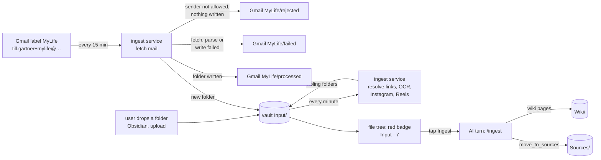

# Proposal: rework the ingestion pipeline

**Issue:** [#131](https://github.com/tillg/karpathy.app/issues/131)

## Why

Getting a mail, a link or an Instagram post into a wiki today needs the Mac:

- **Stage A (deterministic)** — `ingest-email` (Python, repo `~/git/ingest_email`) runs every 15 min from a launchd agent
  (`com.tillg.ingest-email.all.plist`). It reads Gmail labels through the `gog` CLI, writes `mail-…/` folders straight into
  the vault's `Sources/`, and resolves the links in them (`insta-…/`, `web-…/`, `youtube-…/`, `gh-…/`, PDFs with OCR).
  Gmail OAuth (Keychain), the Instagram session, tesseract, poppler and ffmpeg all live on the Mac.
- **Stage B (AI)** — the `/ingest` skill of the llm-wiki Claude Code plugin, run by hand in the terminal. It first runs
  stage A again, re-encodes Reels, then works out which sources are "new" by a heuristic (no wiki page cites them, newer
  than the last `## [date] ingest` in `Wiki/log.md`) and writes the wiki pages.

So when the Mac sleeps nothing arrives, the app can't tell how much is waiting, and ingesting from the phone isn't possible:
the plugin skill isn't in the vault, and the app's AI can't run Python or reach Gmail (functional.md, Skills: "Credentials
… not set up").

## What changes

Everything runs on the server; the Mac is no longer needed.

1. **New `Input/` folder per vault: the ingest queue.** Every not-yet-ingested source is a sub-folder of `Input/`. Mail
   fetching and link resolving write there instead of `Sources/`. `Sources/` stays the archive of ingested sources.
   "New" is no longer guessed: whatever is in `Input/` is new. `Input/` is tracked by git like any folder, so a folder
   dropped in on the Mac and pushed arrives with the next pull and gets its links completed too. Waiting items show in
   Changes but don't count toward the commit reminder.
2. **New compose service `ingest`.** It runs the existing `ingest-email` tool (not a rewrite) in its own container with
   Python, tesseract, poppler and ffmpeg: fetch mail every 15 min, resolve open links every minute (so a folder the user
   drops into `Input/` is picked up within a minute), and re-encode Reels. Like opencode it reaches the internet only
   through the egress proxy. Gmail credentials and the Instagram session become server secrets.

   **Gmail sub-labels** (unchanged from today; `MyLife` shown, `FrechenHelper/…` alike). Only the top label `MyLife`
   is read. Each mail leaves it in the same fetch run, once, and is never moved again:

   | Moved to | When |
   |---|---|
   | `MyLife/processed` | its folder (`index.md`, `original.eml`, attachments) is in `Input/`. Its links are resolved later and don't change the label — a failed link shows in `failed_links`, not in Gmail. |
   | `MyLife/rejected` | the sender is not in `allowed_senders`. Nothing is read or written. |
   | `MyLife/failed` | fetching, parsing or writing the mail failed (the error is logged). A real inbox for a human to look at. |

   If the folder was written but the label move failed, the mail stays in `MyLife`; the next run recognizes it by
   `message_id`, moves it to `processed` and writes nothing twice. Ingesting (the AI step) never touches Gmail.
3. **Badge on `Input/` in the file tree:** a red bullet with the number of sub-folders (all of them, also those whose
   links are still being fetched).
4. **Ingest button** next to the badge: one tap opens a new chat and sends `/ingest`. The vault's `ingest` skill (a vault
   skill in `.agents/skills/`, owned by the vault) writes the wiki pages and moves each finished folder from
   `Input/` to `Sources/` with a new AI tool `move_to_sources`. The badge counts down as it goes.
5. **Connect Instagram from the browser:** Admin › Instagram takes username and password, the server logs in (the same
   password login instascraper does today) and asks back for a 2FA or challenge code in the same form when Instagram
   wants one. The panel shows "Connected as @x" or "Expired — Reconnect". No Mac step, works from the phone. The password
   is not stored. (Reading the instagram.com cookie from the page is impossible — other origin, HttpOnly — and
   Instagram has no API for reading other people's posts.)
6. **Cutover:** first the old `/ingest` runs once on the Mac to ingest what it already fetched; then the Mac's launchd
   agent is removed and only the `hetzner` server gets real mail profiles (dev and test stacks never read `MyLife`). The
   Mac gets new sources the normal way: commit in the app, pull on the Mac (ADR 0001 — nothing is committed
   automatically). The vault's `ingest` skill keeps working in Claude Code on the Mac too.

## Scope

In scope:

- `deploy/ingest/` image and compose service, its config (profile → vault) and secrets through Ansible Vault, on dev and prod.
- The `Input/` badge and the Ingest button in the web app (desktop and phone).
- Instagram connect / reconnect in the admin area (backend routes, an internal endpoint in the ingest service).
- The opencode tool `move_to_sources`.
- Docs: system specs at archive, `README.md`, demo run book chapter.

Prerequisites in other repos (tracked in the plan, not as plan steps):

- `ingest_email`: create mail folders atomically, look up duplicates in `Sources/` as well as the target dir, a container
  entry point, and a `no-session` Instagram link no longer uses up its retry attempts (today 5 failed polls ≈ 75 min and
  the link is given up for good — the Mac's `mylife` log shows 50 Reels given up that way).
- `instascraper`: a non-interactive login API (code asked through a callback instead of `input()`).
- `mylife_wiki`, `frechen_wiki`: become self-contained. Each owns its `ingest` skill in `.agents/skills/ingest/`
  (written in the vault, without the stage-A steps, reading `Input/`, calling `move_to_sources`), and
  `Schema/methodology.md` becomes a real file instead of a symlink to `../../llm_wiki/methodology.md`.

**No dependency on `llm_wiki`.** Neither the app nor the vaults need the llm_wiki repo or plugin at runtime or to build.
Today the vaults do (the methodology symlink, the plugin skill); after this change llm_wiki is at most a place the user
copied the skill from once.

Out of scope:

- Configuring mail accounts or labels in the admin area (it's a deploy config file for now).
- Push notifications when something arrives, scheduled (unattended) AI ingests.
- TMDb importers and other Python vault scripts (`film-import.py`): bash stays denied for the AI.
- A different mail transport (IMAP): `gog` with a file keyring works headless.

## Risks

- **Instagram from a datacenter IP.** Instagram challenges or blocks logins from Hetzner IPs far more often than from a home
  connection. A blocked post ends in `failed_links` (retried, never blocks the mail), but Instagram may simply not work from
  the server. Fallback if so: keep only the Instagram resolver on the Mac against the server's `Input/` — decided after a
  week of real use, not now.
- **Instagram sessions die** every few weeks (yours: re-minted 2026-09-13 and 2026-10-01), mostly when Instagram flags
  activity. Renewing is a tap on **Reconnect** in the app plus the password and maybe a 2FA code (item 5 above); until
  then Instagram links wait instead of being given up.
- **Pipeline output is uncommitted.** The user can discard it, and media sits on the 20 GB vault disk until committed.
- **Two writers in one folder.** The ingest service and the AI/user both write in `Input/`; the design keeps them apart
  (atomic renames, the service never touches a folder after it has no open links), see architecture.
- **Gmail double-fetch** if the Mac agent and the server run at the same time: the cutover stops the Mac first.

## Expected outcome

A mail sent to `till.gartner+mylife@gmail.com` shows up as `Input · 1` on the phone within ~15 minutes, its links resolved
a minute later, and one tap on **Ingest** turns it into wiki pages while the Mac is closed.
