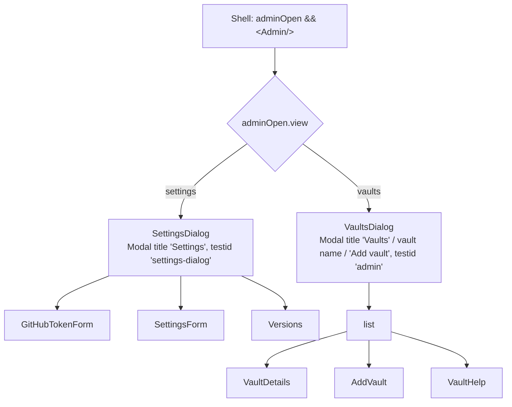
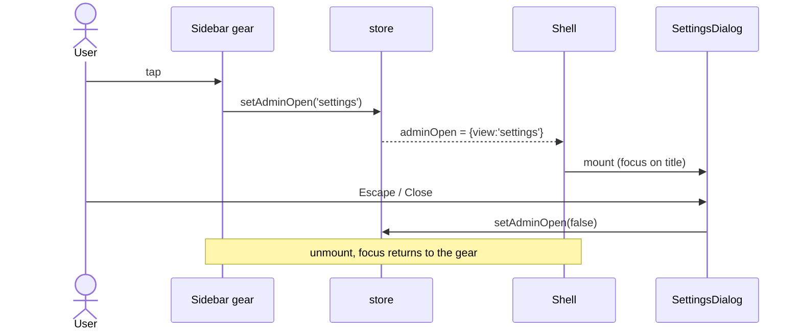

# Architecture: one open state, two dialogs

Frontend only (`apps/web`). No backend, API or data change.

## Today

- `store.tsx:475-476`: `adminOpen: false | { vault?: string }`, `setAdminOpen(open: boolean, vault?: string)`.
- `Shell.tsx:105`: `{s.adminOpen && <Admin />}`; the modal unmounts on close.
- `Admin.tsx` (330 lines): one `Modal` (`testid="admin"`) with local view state
  `list | details | add | settings`. Title per view; "Vaults & settings" for the list. Every view but the
  list shows the "All vaults" back button (`admin-back`). The list has `admin-open-settings` and
  `admin-open-add`.
- Four callers: `Sidebar.tsx:28` gear (`open-admin`) and `VaultSwitcher.tsx:72` (`manage-vaults`) open the
  list; `NotePane.tsx:329` (`manage-vaults-cta`) and `ChangesPanel.tsx:165` open one vault's details.

## Approach

### Store: the open state names the dialog

```ts
type AdminOpen = false | { view: 'vaults'; vault?: string } | { view: 'settings' };
const [adminOpen, setAdminOpenState] = useState<AdminOpen>(false);
const setAdminOpen = useCallback(
  (open: false | 'vaults' | 'settings', vault?: string) =>
    setAdminOpenState(open === false ? false : open === 'settings' ? { view: 'settings' } : { view: 'vaults', vault }),
  [],
);
```

The union makes "settings with a vault id" unrepresentable. Callers:

| Caller | Today | After |
|---|---|---|
| `Sidebar.tsx:28` gear | `setAdminOpen(true)` | `setAdminOpen('settings')` |
| `VaultSwitcher.tsx:72` Manage vaults… | `setAdminOpen(true)` | `setAdminOpen('vaults')` |
| `NotePane.tsx:329` Edit vault | `setAdminOpen(true, id)` | `setAdminOpen('vaults', id)` |
| `ChangesPanel.tsx:165` Edit vault | `setAdminOpen(true, id)` | `setAdminOpen('vaults', id)` |
| `Admin.tsx` close | `setAdminOpen(false)` | unchanged |

TypeScript flags every old `setAdminOpen(true…)` call, so `just check` proves no caller was missed.

### `Admin.tsx`: two dialogs, one file

`Admin` reads `adminOpen.view` and renders one of two components. Both keep using `Modal` (`Dialogs.tsx`), so
Escape, the Tab trap and focus return to the opener stay as they are.



- **`SettingsDialog`**: the body of today's settings view (lines 317-326: the three `.gh` groups GitHub, App,
  Version) moved into its own `Modal` with `title="Settings"`, `testid="settings-dialog"`, `wide`,
  `focusTitle`. No back button.
- **`VaultsDialog`**: today's `Admin` body with `View = list | details | add` (the `settings` kind removed),
  list title **"Vaults"**, the `admin-open-settings` button removed, `testid="admin"` kept (fewer test
  changes; it is not user-visible). `reloadVaults()` on mount moves here; the Settings dialog doesn't need
  the vault list (the token test gets its vault rows from the test response).

`GitHubTokenForm`, `SettingsForm`, `Versions`, `VaultDetails`, `AddVault`, `VaultHelp` are unchanged.

### Labels

- Gear (`Sidebar.tsx:28`): `title="Settings"`, `aria-label="Settings"`, `data-testid="open-settings"`
  (renamed from `open-admin`: it no longer opens the admin list, and every use in the tests changes anyway).
- Vault menu entry: text stays "Manage vaults…", subtitle "Add / configure GitHub repos" (drops
  "settings"). Its icon changes from `gear_alt` to `rectangle_stack` (Framework7 Icons, already bundled):
  the gear now means Settings, so it must not also mark the vault manager.
- Vaults dialog list title: "Vaults"; the section header inside stays "Vaults" with the `(?)` help button.

## Sequence: opening Settings



## Tests

No vitest covers these components; e2e is the layer.

- **Helpers** in `e2e/helpers.ts`, the one seam every test goes through:
  - `openVaults(page)`: click `vault-switcher`, then `manage-vaults`; wait for `admin` visible.
  - `openSettings(page)`: click `open-settings`; wait for `settings-dialog` visible.
  Introduced first against today's UI (`openSettings` = `open-admin` → `admin-open-settings`), so the
  migration of existing tests is a pure refactor that is green before and after. The behaviour change then
  only edits the helper's body.
- **New spec** `e2e/settings-split.spec.ts`: gear → only settings; Manage vaults… → only vaults; Edit vault
  still lands on details; both dialogs return focus to their opener.
- `a11y-keyboard.spec.ts:71-73`: dialog name "Vaults" (exact match). `expectTabTrapped(page, 12)` presses
  Tab 12 times and checks focus stays inside; it counts presses, not stops, so it stays.
- `a11y.spec.ts:100` and `mobile.spec.ts:49` scan/measure the Settings dialog via `openSettings` instead of
  list → settings → back.

## Tradeoffs considered

| Option | Verdict |
|---|---|
| **One `Admin` with a start view** (keep `settings` as a view of the same modal, open it directly) | Rejected: the back button and the shared title logic would still tie them; "All vaults" from Settings is exactly the mix the user wants gone. |
| **Two components, two store flags** (`vaultsOpen`, `settingsOpen`) | Rejected: two flags can both be true; one union value can't. |
| **One store value, two components** (chosen) | Smallest change; illegal states unrepresentable; `Shell` unchanged. |
| Split into `Vaults.tsx` + `Settings.tsx` files | Not now: a pure move without behaviour; can follow once the split is stable. Noted, not done (surgical-change rule). |

## Risks

- **Missed caller**: guarded by the type change (`boolean` → union); `just check` fails on any old call.
- **Tests that silently relied on the list's Settings button**: all go through the helpers after step 1, and
  `grep -rn "admin-open-settings\|open-admin" e2e apps` must find nothing at the end.
- **Discoverability of Settings** on phone: the gear sits in the sidebar header, which on phone is the
  Files tab. Unchanged from today, so no new risk; checked in the `@iphone` case.
