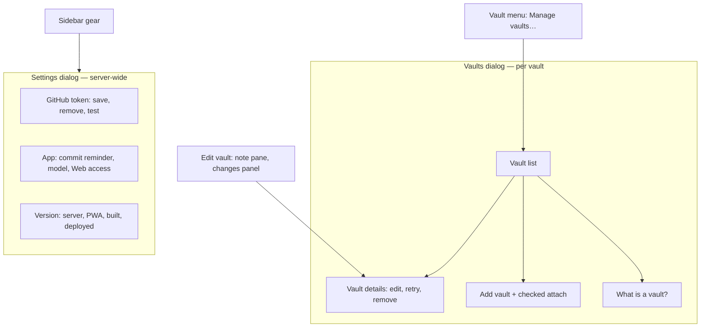

# Domain: Vaults dialog and Settings dialog

No new domain entity. The change renames and separates two UI concepts that `specs/system/` today calls
one "admin modal 'Vaults & settings'".

## Terms

| Term | Meaning | Code |
|---|---|---|
| **Vaults dialog** (was: admin modal, list view) | Where the user manages vaults: the vault list, a vault's details (edit, retry, remove), Add vault and "What is a vault?". Opened from the vault menu's **Manage vaults…** or, on one vault's details, from **Edit vault**. Holds nothing that isn't per vault. *Avoid:* admin area, "Vaults & settings". | `adminOpen.view = 'vaults'` |
| **Settings dialog** (was: admin modal, settings view) | Where the user edits the server-wide **Settings**, the **GitHub token** and reads the version. Opened from the sidebar gear only. Holds nothing per vault (the token's "Test token" lists each vault's reachability as a result, not as vault management). | `adminOpen.view = 'settings'` |
| **Settings** (unchanged) | The server-wide values: commit reminder threshold, model, Web access. Shown in the Settings dialog's **App** group. | `Settings` |

"Admin modal" stays the name of the code component (`Admin.tsx`) that renders either dialog; it is not a
user-facing term any more.

## What belongs where

Rule of thumb: a value that applies to every vault goes into the Settings dialog; anything with a vault id
goes into the Vaults dialog.

## Actor

Unchanged: the single **User** "manages vaults and settings" — now in two dialogs instead of one.
