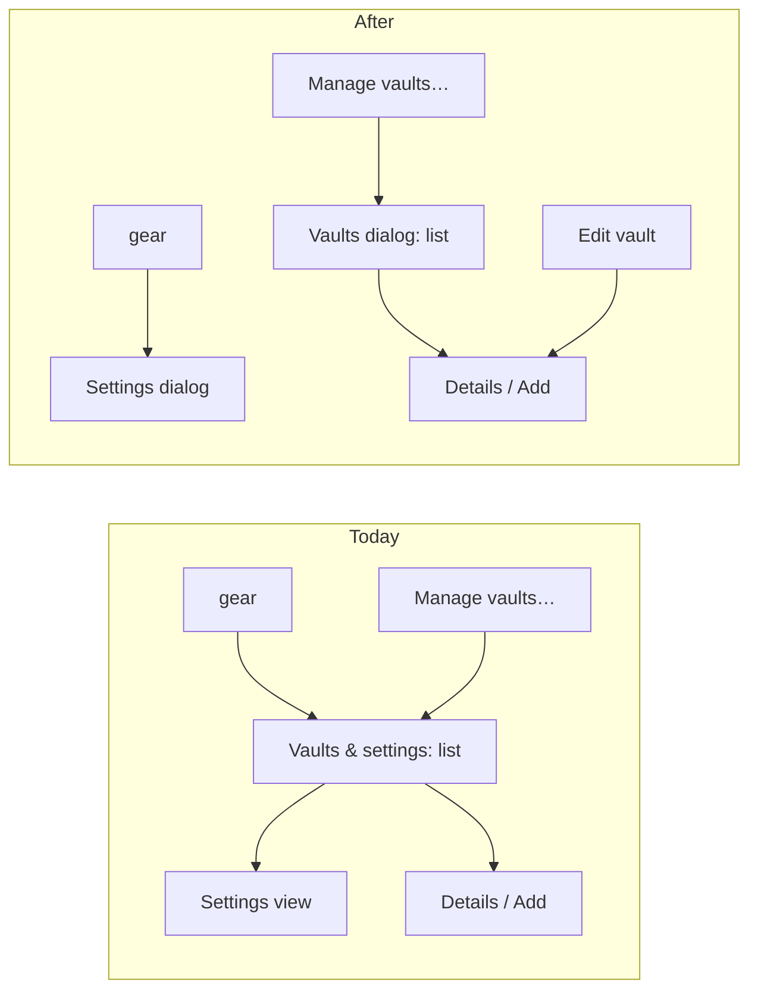

# Proposal: separate settings from vault management

## What

Today vault management and the app settings live in **one** modal, "Vaults & settings", and two entry points
open it on the same vault list:

1. the vault menu's **Manage vaults…** entry (subtitle "Add / configure repos, settings"),
2. the sidebar's **gear** button (tooltip "Vaults & settings").

To reach a setting, the user taps the gear, then **Settings** in the vault list, then reads a view with an
"All vaults" back button. Two entry points lead to the same place, and settings sit one level below vaults.

After this change there are two separate dialogs, one per entry point:

| Entry point | Opens | Contains | Doesn't contain |
|---|---|---|---|
| Vault menu → **Manage vaults…** | **Vaults** dialog | vault list, vault details (edit, retry, remove), Add vault, "What is a vault?" | any setting, no **Settings** button |
| Sidebar **gear** | **Settings** dialog | GitHub token, App (commit reminder, model, Web access), Version | any vault list, no "All vaults" back button |
| **Edit vault** (note pane, changes panel) | **Vaults** dialog on that vault's details | unchanged | — |

The original request (the note `separate-settings-and-vault-management.md` in this change) asks for exactly
this: "Manage vaults" → vaults only, gear → settings only.

## Why

- **Fewer taps.** A setting is one tap away (gear) instead of two (gear → Settings).
- **No duplicate entry points.** Each button opens one thing, and its label says what. Today the gear and
  "Manage vaults…" do the same, so neither label is quite right.
- **Clearer mental model.** Vaults are per-repo things in a list; settings are server-wide values. Mixing them
  in one dialog suggests the settings belong to a vault.

## Scope

In scope:

- The store state that opens the admin modal says *which* dialog to open (`vaults` or `settings`).
- The Settings dialog: title "Settings", the three existing groups, no back button.
- The Vaults dialog: title "Vaults" (was "Vaults & settings"), the **Settings** button removed from the list.
- Gear: tooltip and accessible name "Settings"; vault menu subtitle drops "settings".
- e2e tests: shared helpers `openVaults(page)` / `openSettings(page)`, the new behaviour tests, and the
  path updates in existing tests (see below).
- `README.md` wording ("admin area → Settings" → "the gear → Settings").

Out of scope:

- Any change to what a view does (token form, settings form, add/edit/remove vault, checked attach).
- A router or URL state for the dialogs (still modal-internal, as today).
- Cross-links between the dialogs (e.g. "Set the GitHub token" from a failed Add vault). Possible later.
- Moving the GitHub token to the Vaults dialog. It stays a setting: it is server-wide, not per vault.

## Tests this change has to touch

Splitting the modal changes the path every admin test takes, so existing e2e tests change. **This needs
your OK** (house rule: no test changes without permission). The changes are of two kinds:

1. **Path only, assertions unchanged:** every test that opens the modal via `open-admin` (+ `admin-open-settings`)
   switches to `openVaults(page)` or `openSettings(page)`. 18 uses in 10 specs: `admin`, `a11y`,
   `a11y-keyboard`, `fix-15`, `fix-16`, `fix-24`, `git`, `mobile`, `version`, `web-access`.
2. **Assertion changes because the behaviour changes on purpose:** `a11y-keyboard.spec.ts:71-73` expects the
   dialog name "Vaults & settings"; it becomes "Vaults". Its `expectTabTrapped(page, 12)` (12 Tab presses
   that must stay inside the dialog) stays as is. `a11y.spec.ts:100` and `mobile.spec.ts:49` walk list → settings via
   the back button; they open the Settings dialog separately instead.

## Expected outcome

- Gear → Settings dialog, one tap. Manage vaults… → Vaults dialog, no settings in it.
- `just check` and `just e2e` green, the axe scans of both dialogs clean, both fit 375 px without
  horizontal scroll.
- `specs/system/functional.md` §"Vaults and settings" (lines 43-66) and `architecture.md` "Admin modal"
  (lines 100-105) are rewritten at `/spec:archive`.
