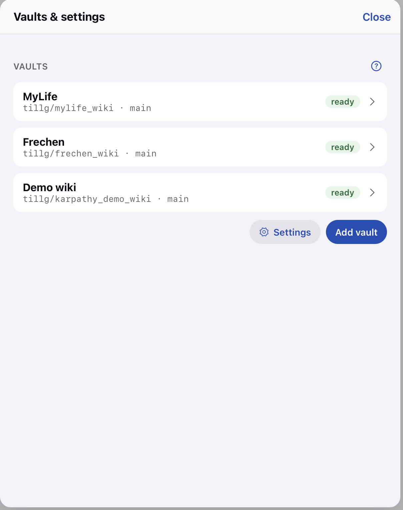

# Notes: original request

Currently we have a mix of settings & vault management: It's one dialogue that can be reached from 2 menues / buttons:

The "Vaults & settings" window that can be reached 
1. from the drop-down menu with the vaults
2. from the Zahnrad icon

This is confusing and adds clicking burden. 

It should be that

- When selecting "Manage vaults" from the drop doen menu, the user gets to manage vaults - no setting here
- When clicking the little Zahnrad, the user gets to edit settings - no vaults here.