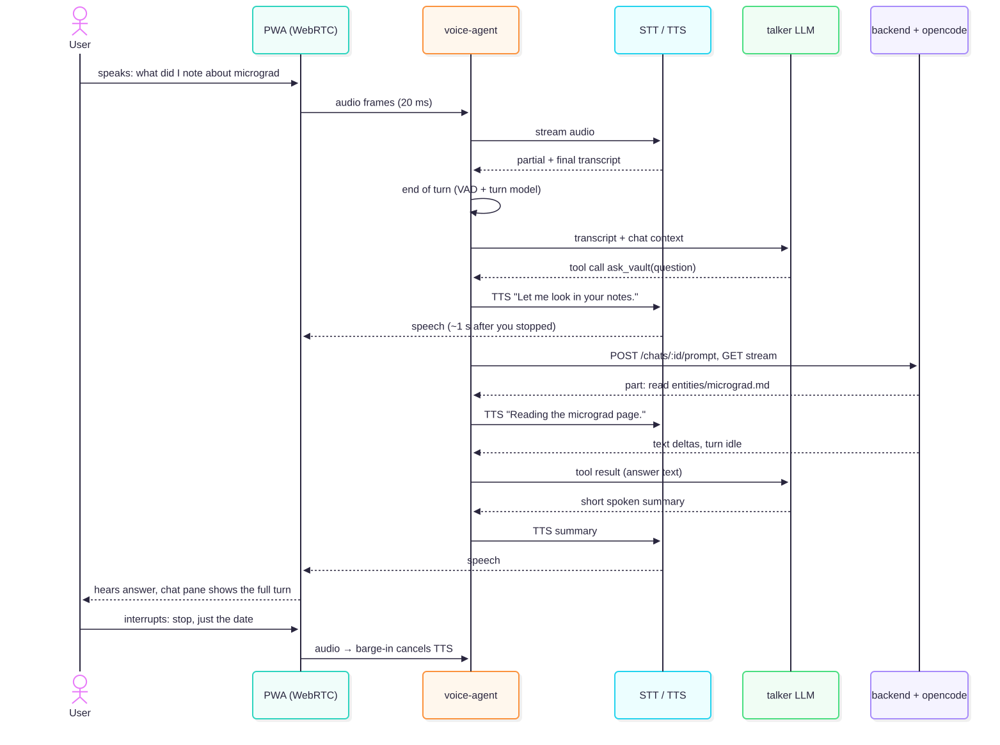

:::tldr
**Yes, LiveKit works, and it is the right kind of infrastructure. But it solves only half the problem: audio transport and turn-taking. The other half is our agent: an opencode turn takes seconds to minutes, so it can't be the voice. The setup that feels instant is a talker/thinker split. A fast voice agent answers within about a second and hands vault work to opencode through the existing chat API, saying what it is doing while it waits.**

1. **Instant comes from streaming every step, not from a faster model** ([§2](#instant)). Audio flows over WebRTC in 20 ms frames. Speech-to-text transcribes while you speak. A turn detector decides when you have finished, the reply starts before that is final, and speech playback begins with the first words. You can interrupt at any time (barge-in). Record → upload → transcribe → send → wait → read aloud does none of this.
2. **LiveKit provides exactly these parts, open source and self-hostable** ([§3](#livekit)). `livekit-server` is a WebRTC media server, one container that needs no Redis on a single node. **LiveKit Agents** is the voice-agent framework (Node/TS SDK 1.9, Python 1.8): voice-activity detection, a turn-detector model (German and French included), barge-in, preemptive replies and plugins for 20+ speech and LLM vendors. That keeps us provider-agnostic.
3. **The hard part is opencode, not the audio** ([§4](#brain)). A voice reply has to start within about a second, but opencode often reads files for many seconds before it writes a word. So a small, fast **talker** LLM holds the conversation and calls one tool, `ask_vault`. That tool runs a normal chat turn in opencode (the **thinker**), turns its tool events into spoken progress ("I'm reading the micrograd page") and summarises the answer. LiveKit has a documented pattern for this: **async tools** with progress updates, filler speech and cancellation.
4. **It fits our stack and our network** ([§5](#setup)). Two new compose services: `livekit` and `voice-agent`. The backend mints the room tokens. Audio travels over the tailnet straight to the VPS: no new public port and no audio through a third-party media server. Voice turns land in the same chat, so the chat pane shows the full answer, the files read and the files changed.
5. **iOS limits it to the foreground** ([§6](#ios)). Microphone access over WebRTC works in the installed PWA. The browser's built-in speech recognition does not, and the microphone stops when the app goes to the background or the screen locks. So we build a conversation mode for while you look at the app, not hands-free in your pocket.
6. **It costs about $1–2.50 per hour of talking** ([§7](#cost)): streaming speech-to-text, text-to-speech and a small talker LLM, with LiveKit self-hosted. opencode's own LLM costs come on top, as with typed chat.

**Recommendation** ([§10](#recommendation)): build a **spike first**: a self-hosted LiveKit server plus a Node `voice-agent` with Deepgram, Cartesia and a small LLM, a talk button in the chat pane, and `ask_vault` wired to the chat API. Measure the time from the end of speech to the first audio, on the iPhone over Tailscale. Write the spec (`proposal.md`) only after that. If the spike feels too slow or too stiff, the fallback is OpenAI's **GPT-Live with delegation** ([§8](#alternatives)), which has the most natural feel but locks the voice layer to one vendor.
:::

## Context {#context}

Today you type into the chat pane, and opencode answers in text while it reads and writes the vault. The wish: talk to the app instead of typing, and hear it answer, like a phone call rather than walkie-talkie voice messages.

The obvious build is the slow one: record a clip, upload it, transcribe it, send the text as a prompt, wait for the whole answer, then turn it into speech. Every step waits for the one before it, so you hear nothing for 5–30 s and can't interrupt. This report asks:

- What makes a voice conversation feel instant, and is LiveKit the infrastructure for it?
- How does voice fit opencode, whose turns are slow because the agent works with tools?
- What would the setup look like on our VPS, behind Tailscale, on an iPad or iPhone?
- What does it cost, and what are the alternatives?

Constraints from the project: provider-agnostic (`CLAUDE.md`), opencode stays the agent loop ([ADR 0002](../../../docs/adr/0002-opencode-as-agent-harness.md)), the backend stays thin, single user, self-hosted on a 4 GB VPS reached over Tailscale ([prod environment](../../research/prod-env/prod-env-report.md#reco)), and vault content in German, French or English.

Related: feature 25 *Voice memos* ([feature report](../../research/features/feature-report.md), [#88](https://github.com/tillg/karpathy.app/issues/88)) is the asynchronous sibling: record, transcribe, save to `raw/voice/`. It is cheap and fully provider-agnostic, but it is not a conversation. Both can share the speech-to-text configuration.

## What makes voice feel instant {#instant}

People expect a reply about 0.5–1 s after they stop speaking. You get there only when every step streams and overlaps:

| Step | Slow version | Real-time version |
| --- | --- | --- |
| Transport | upload a file over HTTPS | WebRTC audio in 20 ms frames, both directions, with echo cancellation |
| Speech-to-text | transcribe the whole clip after recording | streaming: partial words while you speak, the final text about 150–300 ms after you stop |
| End of turn | you press *stop* | voice-activity detection plus a turn-detector model that can tell a pause from the end of a sentence |
| Reply | wait for the full answer | the LLM starts before the turn is confirmed ("preemptive generation") and streams tokens |
| Text-to-speech | synthesise the whole answer | streaming: the first audio about 75–150 ms after the first words |
| Interrupting | impossible | barge-in: your voice stops playback, and the agent listens again |

A rough budget from vendor figures (estimates, not measured): final transcript 0.2 s + end-of-turn decision 0.1–0.3 s + LLM first token 0.3–0.5 s + first audio 0.1 s ≈ **0.7–1.2 s**. A secondary source reports about 1.2–1.4 s (p95) for a default LiveKit setup and 0.5–0.65 s after tuning. LiveKit publishes no end-to-end figure itself.

Building this by hand (WebSocket speech-to-text, voice-activity detection, turn-taking, echo handling and interrupt logic in the browser) is a project of its own. Voice frameworks exist to provide exactly this, and that is what LiveKit is.

## LiveKit in short {#livekit}

:verdict[fits]{tone="go"} LiveKit is open source (Apache-2.0) and has two parts that matter here:

- **`livekit-server`**: a WebRTC media server (SFU). The browser and the agent both join a *room* and exchange audio through it. Docker image `livekit/livekit-server` (v1.13.8). A single node needs **no Redis**; Redis is only needed in distributed mode. Ports: 7880/TCP for signalling (behind our TLS proxy), and media over one multiplexed UDP port (7882), a UDP range (50000–60000) or a TCP fallback (7881).
- **LiveKit Agents**: the framework for the voice agent. A worker connects *outbound* to the server, is dispatched into a room and runs an `AgentSession`: speech-to-text → LLM → text-to-speech, or one speech-to-speech model instead. It brings:
  - voice-activity detection (Silero) and the **turn-detector model**: 14 languages including German and French, run locally (`v1-mini`) or in LiveKit Cloud (`v1`);
  - **barge-in** with an adaptive mode that tells an "uh-huh" from a real interruption, and resumes after false interruptions;
  - **preemptive generation**, on by default;
  - plugins for OpenAI, Google, Mistral, xAI and other LLMs, Deepgram, AssemblyAI, Cartesia, ElevenLabs and more. Each step is a plugin, so each vendor can be swapped;
  - **`llmNode` override**: the LLM step can be our own code that streams plain strings (for example from opencode);
  - **async tools**: a long-running tool reports progress with `ctx.update()`, which the agent speaks; filler speech plays after a set idle time; the result is spoken when the agent is idle; running tasks can be cancelled.
- **SDKs:** Node/TS `@livekit/agents` 1.9.1, called production-ready in its README, and Python `livekit-agents` 1.8.5. A few features are Python-only (dynamic endpointing, automatic gain control, some realtime plugins). Node fits our TypeScript stack; whether its async tools are complete is an open question (the docs disagree, [§9](#risks)).
- **Browser:** `livekit-client` 2.22 and `@livekit/components-react` 2.9 (React hooks, audio visualiser). The browser gets a short-lived JWT, signed with the LiveKit API secret, from our backend.
- **LiveKit Cloud** is the hosted version. Its free *Build* plan includes 1,000 agent-session minutes and 5,000 WebRTC minutes a month. Cloud adds **LiveKit Inference** (one key for speech-to-text, LLM and text-to-speech vendors), the larger turn detector and hosted agents. Inference is **not available** with a self-hosted server: there, each vendor's plugin uses its own API key.

## The core problem: opencode is slow {#brain}

opencode is the brain we want: it knows the vault, the skills, `AGENTS.md` and the tools. But a turn usually starts with tool calls (search, read 3 files) before the first word of text, and long turns take minutes. A voice that is silent for 20 s feels broken. There are three ways to put opencode behind a voice:

| | A. opencode is the voice | B. Talker + thinker | C. Speech-to-speech model + thinker |
| --- | --- | --- | --- |
| How | `llmNode` sends the transcript as a chat prompt and streams opencode's text to speech | a small, fast LLM talks; its tool `ask_vault` runs an opencode turn as an async tool | a realtime voice model (OpenAI Realtime, Gemini Live) talks; same `ask_vault` tool |
| First sound after you stop | as soon as opencode writes text: 2 s up to minutes | ~1 s ("Let me look that up"), then progress lines | ~0.5 s, most natural prosody |
| Small talk, "repeat that", "shorter" | every utterance is an opencode turn (slow, costly) | answered by the talker directly | answered by the model directly |
| Answer style | opencode writes Markdown for a screen; needs a voice prompt | the talker turns opencode's answer into short spoken sentences | same as B |
| Provider-agnostic | yes | yes (every step is a plugin) | partly: swappable between realtime vendors, not to self-hosted models |
| Complexity | lowest | medium | medium |
| Verdict | :verdict[too slow]{tone="no"} | :verdict[recommended]{tone="go"} | :verdict[fallback]{tone="partial"} |

**B is the recommendation.** It is the "talker/thinker" pattern that GPT-Live (delegation), Gemini Live (non-blocking tools) and LiveKit (async tools) all build in: one fast layer for conversation, one slow layer for work.

How it plays out:

- **The talker** gets short instructions: speak in short sentences, never read Markdown, links or paths aloud; anything about the notes goes through `ask_vault`; while waiting, say what is happening. It keeps the voice conversation's history and the last vault answer, so "and what was the date?" can be answered without a new turn when the answer is already known.
- **`ask_vault(question)`** creates or reuses the chat, posts the prompt and reads the NDJSON stream, exactly as the PWA does. It maps tool events to progress: a read of `entities/micrograd.md` becomes `ctx.update("reading micrograd")`, and the talker turns that into a spoken line. The final text goes back as the tool result, and the talker summarises it in two or three sentences.
- **Writes stay visible.** When opencode changes files, the talker says so ("I added it to the Dune note"), and the chat pane and *Changes* show the diff. Nothing is committed: [ADR 0001](../../../docs/adr/0001-user-triggered-commits.md) stays as is.
- **Interrupting and cancelling:** barge-in stops the talker's speech at once. "Stop, never mind" can cancel the opencode turn through the existing abort route (a cancellable async tool).
- **opencode can get a `voice` hint**: one line in the prompt ("the user is listening; keep the final answer short and spoken") makes its answers easier to summarise. That is a prompt, not a new endpoint, in line with [ADR 0004](../../../docs/adr/0004-commands-as-prompts-not-command-endpoint.md).

## Proposed setup {#setup}

**New compose services**

| Service | What | Network |
| --- | --- | --- |
| `livekit` | `livekit/livekit-server`, single node, no Redis; `use_external_ip: false`, `node_ip` = tailnet IP; media on UDP 7882 (TCP 7881 fallback) bound to the tailnet IP; signalling 7880 behind Caddy (`wss://app.karpathy.app/rtc`) | `internal` + port on the tailnet IP |
| `voice-agent` | Node worker with `@livekit/agents`, Silero voice-activity detection, local turn detector, plugins for speech-to-text, text-to-speech and the talker LLM; calls the backend's chat API | `internal` + `egress` (vendor APIs) |

**Changes to existing parts**

- **Backend:** one route, `POST /api/vaults/:id/voice/token`. It checks the bearer token, creates a room name, puts `{vaultId, chatId}` into the token's room configuration and dispatches the agent by name. LiveKit API key and secret are compose secrets. The backend stays thin: no audio passes through it.
- **voice-agent → backend:** a service token on the internal network, calling the same chat routes the PWA uses. opencode stays reachable only from the backend.
- **PWA:** a talk button in the chat pane opens a voice sheet: connect, mic level, live transcript, the agent's state (listening / thinking / speaking), *mute* and *end*. Text and tool chips keep streaming into the chat pane as usual, because it is the same chat. Push-to-talk as an option for noisy places.
- **Caddy:** a route for the LiveKit signalling WebSocket; CSP `connect-src` gets the `wss:` URL.
- **Settings:** speech-to-text, text-to-speech and talker model chosen in the admin area, like the chat model; keys server-side only.

**Why self-hosted, not LiveKit Cloud:** audio of your notes stays on our server and goes only to the speech vendors we choose; no public port is needed, because the phone reaches the VPS through the tailnet; and there is no minute quota. LiveKit doesn't document Tailscale, so the spike has to confirm it (the WireGuard MTU of 1280 bytes is fine for audio). LiveKit Cloud's free plan remains the quickest way to try things on a laptop, and the code is the same: only `LIVEKIT_URL` and the keys change.

**Footprint:** the media server is light for one user. LiveKit's sizing guidance for agent servers is generous (4 cores, 8 GB for many agents; 30 agents peaked at 2.8 GB). One session with the local turn detector should fit next to the current ~1 GB on our 4 GB VPS, but the spike has to measure it.

## iOS and PWA constraints {#ios}

- **Microphone over WebRTC works in the installed PWA** (since iOS 13.4). It needs a tap to start (a user gesture) and a permission prompt.
- **`webkitSpeechRecognition` does not work in home-screen apps** (WebKit bug 225298, "RESOLVED LATER"). Browser-native dictation is not an option, so speech-to-text has to run on the server side, which the LiveKit setup does anyway.
- **Foreground only.** An installed web app loses the microphone when it goes to the background or the screen locks (WebKit bug 226620). The voice sheet should keep the screen awake (Screen Wake Lock API), reconnect when the app becomes visible again, and say clearly when the call ended.
- **Audio session:** Safari 17+ has `navigator.audioSession.type = "play-and-record"`, with known bugs around volume and other apps' audio. WebRTC echo cancellation is on by default; how well it works on the iPad speaker has to be tested.
- **Tailscale must be on** on the device, as it already is for the app.

## Cost {#cost}

Assumptions: one hour with the microphone open, the agent speaking about 24 minutes (~19,000 characters), about 100 talker turns. opencode's own LLM costs are not included: they are the same as for typed chat.

| Part | Choice | Per hour (approx.) |
| --- | --- | --- |
| Media server | LiveKit self-hosted | $0 (Cloud: first 1,000 agent minutes a month free, then $0.01/min) |
| Speech-to-text | Deepgram Nova-3 streaming | $0.29–0.46 |
| Text-to-speech | Cartesia Sonic or ElevenLabs Flash | $0.40–1.25 |
| Talker LLM | GPT-4.1 mini class | $0.15–0.25 |
| **Total, option B** | | **≈ $1–2 per hour** |
| Option C | OpenAI `gpt-realtime-2.1` / mini | ≈ $3–8 / $1–3 per hour (context is re-sent on every reply) |
| | GPT-Live voice layer | $3 per hour |
| | Gemini Live | ≈ $0.75 per hour plus text and context |
| All-in-one services | Deepgram, Cartesia, ElevenLabs voice agents | $3.60–4.80 per hour |

For a single user who talks for minutes a day, this is a few euros a month. Self-hosted speech models (Whisper, Kokoro, Piper) would remove the per-hour cost, but on a 4 GB VPS without a GPU they are too slow for real time.

## Alternatives {#alternatives}

::::cards
:::card{title="Pipecat"}
:verdict[good second choice]{tone="partial"} Open-source voice framework. Its **SmallWebRTC** transport connects browser and bot directly, without a media server, so there is one service fewer. Many plugins, including local Whisper/Kokoro/Piper and EU vendors (Speechmatics, Gladia, Mistral). But the server side is Python only, a second language in our stack, and its turn-taking is less polished than LiveKit's.
:::

:::card{title="OpenAI GPT-Live with delegation"}
:verdict[fallback]{tone="partial"} A full-duplex voice layer (it listens while it speaks), $0.05/min. **Client delegation** is the talker/thinker pattern built in: GPT-Live hands a task to our backend and keeps talking; we feed progress back. The most natural feel with the least code, and it runs in the browser over WebRTC. But the voice layer is OpenAI only, against our provider-agnostic rule.
:::

:::card{title="Gemini Live"}
:verdict[possible]{tone="partial"} Speech-to-speech over WebSocket, cheap, with non-blocking tools. Sessions are capped (about 15 min audio, about 10 min per connection, extended with resume handles), non-blocking tools are not supported on every model, and the model names in Google's docs disagree. Usable as option C inside LiveKit.
:::

:::card{title="ElevenLabs Agents"}
:verdict[hosted only]{tone="partial"} A hosted voice agent that can call our own LLM through an OpenAI-compatible endpoint, so opencode could sit behind it. $0.08/min, audio goes through ElevenLabs, EU data residency unverified, and we'd have to expose an endpoint to the internet.
:::

:::card{title="Browser-only"}
:verdict[no]{tone="no"} The Web Speech API is not available in the installed PWA on iOS. Streaming speech-to-text over a WebSocket plus streaming text-to-speech works, but then we build voice-activity detection, turn-taking, echo handling and barge-in ourselves: the hard parts a framework gives us.
:::

:::card{title="Voice memos (feature 25)"}
:verdict[complementary]{tone="go"} Record, transcribe, save to `raw/voice/`, optionally run a preset. Not a conversation, but cheap, works for long monologues and on any provider. Worth building anyway; it shares the speech-to-text settings.
:::
::::

## Risks and open questions {#risks}

- **Talker quality.** The talker has to know when to call `ask_vault` and when to answer itself, and its summaries must not distort what opencode found. That needs prompt work and tests with real vault questions.
- **Long turns.** A 2-minute ingest turn needs a sensible voice behaviour: progress lines at a calm rate, then "I'll tell you when it's done" with the result spoken when it is ready, or shown in the chat.
- **Node SDK gaps.** Some LiveKit pages list async tools with Node examples, while a search snippet says "only available in Python". The spike has to check `@livekit/agents` 1.9 first; if it is missing, use Python for the worker or build progress lines with `session.say()`.
- **LiveKit over Tailscale** is undocumented: `node_ip` on the tailnet address and UDP 7882 are an educated guess.
- **Mixed languages.** Speech-to-text has to handle German, French and English, sometimes mid-sentence; the vendor and its language settings matter.
- **Privacy.** Audio goes to the chosen speech vendors. EU options exist (Speechmatics, Gladia, Mistral) and can be swapped in as plugins.
- **Memory on the VPS** with the local turn detector: unmeasured.

## Recommendation {#recommendation}

1. **Spike (about 2–3 days), outside the main code:** `livekit` and `voice-agent` services in the dev compose; Deepgram + Cartesia + a small talker LLM; `ask_vault` wired to the chat API with progress lines; a bare talk button in the PWA. Test on the iPhone over Tailscale against the demo vault, in German and English.
2. **Measure:** time from the end of speech to the first audio (target < 1.2 s), how fast the first progress line comes during an opencode turn, how barge-in feels, echo on the iPad speaker, and memory use on the VPS.
3. **Decide:** if B feels good, write the spec under this change (`proposal.md` etc.) and an ADR "LiveKit as voice transport, talker/thinker split". If it feels stiff, try option C (a realtime model as the talker) in the same worker before looking at GPT-Live.
4. **Independently:** feature 25 *voice memos* can go ahead at any time; it doesn't depend on this.

## Sources {#sources}

All checked on 2026-10-06.

- LiveKit server: [github.com/livekit/livekit](https://github.com/livekit/livekit), [local dev](https://docs.livekit.io/home/self-hosting/local/), [ports and firewall](https://docs.livekit.io/home/self-hosting/ports-firewall/), [config sample](https://raw.githubusercontent.com/livekit/livekit/master/config-sample.yaml), [distributed mode / Redis](https://docs.livekit.io/transport/self-hosting/distributed/), [VM guide](https://docs.livekit.io/transport/self-hosting/vm/), [benchmark](https://docs.livekit.io/home/self-hosting/benchmark/)
- LiveKit Agents: [github.com/livekit/agents](https://github.com/livekit/agents), [agents-js](https://github.com/livekit/agents-js), [turns and interruptions](https://docs.livekit.io/agents/build/turns/), [turn detector](https://docs.livekit.io/agents/build/turns/turn-detector/), [audio and preemptive generation](https://docs.livekit.io/agents/build/audio/), [pipeline nodes / `llm_node`](https://docs.livekit.io/agents/build/nodes/), [tools](https://docs.livekit.io/agents/build/tools/), [async tools](https://docs.livekit.io/agents/logic/tools/async/), [realtime models](https://docs.livekit.io/agents/models/realtime/), [models and Inference](https://docs.livekit.io/agents/models/), [agent dispatch](https://docs.livekit.io/agents/server/agent-dispatch/), [custom deployment and sizing](https://docs.livekit.io/agents/ops/deployment/custom/)
- LiveKit frontends and auth: [tokens](https://docs.livekit.io/frontends/authentication/tokens/), [frontend starters](https://docs.livekit.io/frontends/start/frontends/)
- LiveKit pricing: [livekit.com/pricing](https://livekit.com/pricing), [inference pricing](https://livekit.com/pricing/inference), [Inference not on self-hosted (community forum)](https://community.livekit.io/t/livekit-inference-on-self-hosted/1743)
- Package versions: npm (`@livekit/agents`, `livekit-client`, `@livekit/components-react`, `livekit-server-sdk`, `@pipecat-ai/client-js`), PyPI (`livekit-agents`, `pipecat-ai`), Docker Hub (`livekit/livekit-server`)
- Pipecat: [SmallWebRTC transport](https://docs.pipecat.ai/server/services/transport/small-webrtc), [supported services](https://docs.pipecat.ai/server/services/supported-services)
- OpenAI: [Realtime over WebRTC](https://developers.openai.com/api/docs/guides/realtime-webrtc), [Realtime costs](https://developers.openai.com/api/docs/guides/realtime-costs), [gpt-live-1](https://developers.openai.com/api/docs/models/gpt-live-1), [Live delegation](https://developers.openai.com/api/docs/guides/live-delegation), [voice over WebRTC](https://developers.openai.com/api/docs/guides/voice-webrtc)
- Google: [Gemini Live API](https://ai.google.dev/gemini-api/docs/live), [sessions](https://ai.google.dev/gemini-api/docs/live-session), [tools](https://ai.google.dev/gemini-api/docs/live-tools)
- ElevenLabs: [custom LLM](https://elevenlabs.io/docs/agents-platform/customization/llm/custom-llm), [API pricing](https://elevenlabs.io/pricing/api)
- Speech vendors: [Deepgram pricing](https://deepgram.com/pricing), [Cartesia pricing](https://cartesia.ai/pricing)
- WebKit / iOS: [Speech recognition not in home-screen apps (bug 225298)](https://bugs.webkit.org/show_bug.cgi?id=225298), [getUserMedia in standalone PWAs (bug 185448)](https://bugs.webkit.org/show_bug.cgi?id=185448), [mic lost in background (bug 226620)](https://bugs.webkit.org/show_bug.cgi?id=226620), [Audio Session API (MDN)](https://developer.mozilla.org/en-US/docs/Web/API/Audio_Session_API), [audio session bug 264473](https://bugs.webkit.org/show_bug.cgi?id=264473)
- Secondary (latency figures only): futureagi.com write-up on LiveKit latency tuning; unverified against LiveKit.
- Project: [`specs/system/architecture.md`](../../system/architecture.md), [prod environment report](../../research/prod-env/prod-env-report.md), [feature report §25](../../research/features/feature-report.md)
