# Architecture: karpathy.app

As built on 2026-10-02. This page describes what exists; the reasons behind it are in
[Design decisions](#design-decisions) and the [ADRs](../../docs/adr/).

## Overview

A thin backend in front of git and an agent harness, a PWA in front of the backend, and an ingest service that fills
the vaults' `Input/` from mail and the web, all in one docker compose stack. Only the reverse proxy publishes ports.

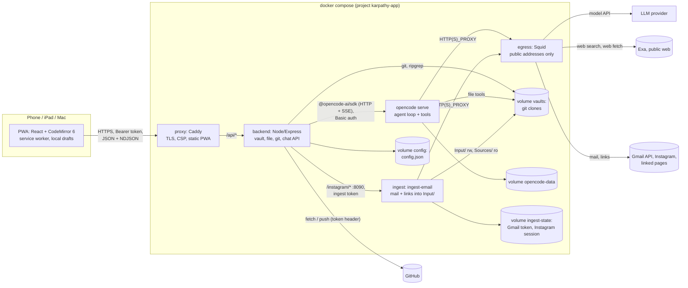

## Technology stack

| Layer | Technology |
|---|---|
| Web | React 19, Vite 8, TypeScript, CodeMirror 6 (`lang-markdown`, own live-preview decorations), `marked` 18 + DOMPurify, vite-plugin-pwa (Workbox), framework7-icons. No router library (hash routes), no state library (one context hook). |
| Backend | Node 22, Express, TypeScript run with `tsx` (no build step), zod validation, chokidar, `@opencode-ai/sdk` v2, `git` and `ripgrep` binaries. |
| Agent harness | `opencode serve` 1.18.25 (pinned image `ghcr.io/anomalyco/opencode`), provider-agnostic; gateway and default model per environment from `deploy/settings/` (OpenRouter `z-ai/glm-5.3` in production, the native Ollama `qwen2.5:3b` in dev, prodtest, tests and on `local`). |
| Proxy | Caddy 2.10 built with a `caddy-dns/<provider>` module (GoDaddy) for DNS-01. |
| Shared | `packages/shared`: TypeScript types for the API (no runtime schemas). |
| Settings | `packages/settings`: zod schema, loader, secret resolution and renderer for `deploy/settings/` (YAML), run with `tsx` as `just settings …` ([Settings](#settings)). |
| Ingest | Python 3.13 image running [ingest-email](https://github.com/tillg/ingest_email) (private repo, pinned commit) with instascraper 1.1.0, the `gog` Gmail CLI 0.43.0 (checksum-verified), tesseract (deu, eng), poppler and ffmpeg; a stdlib `http.server` endpoint ([Ingest service](#ingest-service-deployingest)). |
| Tests | Vitest (backend projects `default`, `github`, `llm`; web unit tests for `lib/` and component tests with `@testing-library/react` in jsdom), pytest (the ingest endpoint, in the image's test stage), shell tests (`*.test.sh`), Playwright e2e (desktop, iPad, iPhone in Chromium and WebKit), axe-core. |
| Website | Plain HTML + CSS in `site/`, no framework or dependencies; tests with `node:test`; GitHub Pages. |
| Tooling | npm workspaces (`apps/*`, `packages/*`, `site`), ESLint flat config, `just`, GitHub Actions CI. |

## Components

### Web app (`apps/web`)

- **Shell** with three panes (sidebar, note, chat) laid out per breakpoint: phone ≤ 699 px (tab bar, push navigation),
  tablet 700–1023 px (overlays), wide ≥ 1024 px (columns). On the wide layout the **swap button** (`#main-swap`,
  rendered by `Shell` while the chat is open) toggles the main pane: class `chatmain` on `#app` swaps the two columns
  with CSS `order`/`flex` only, so no DOM node moves (a running stream, typed text, focus, scroll and undo history
  survive). The button is one absolutely positioned 44 px element on the divider (`right: 380px + inset`, the side
  column is always 380 px); the bar ends next to it get 32 px padding. The choice lives in the store (`chatMain`,
  localStorage `karpathy.chatMain`).
- **Note graph** (`GraphPane`, #130): a layer inside `#detail` (absolute, over the note), shown while the store's
  `graphOpen` is set (sidebar graph button; `openNote` clears it). The note underneath stays mounted and `inert`, so
  drafts, cursor and scroll survive. It fetches `GET /vaults/:id/graph` on the first open per vault and keeps the
  result in a module-level `Map` for the session (Refresh drops it); the `3d-force-graph` instance is built once per
  data and only paused while hidden, so reopening is instant. three.js is imported dynamically so the main bundle
  stays without it; the chunk (~1.4 MB) stays under Workbox's 2 MiB precache limit. Offline, a first open shows the
  fetch error. `lib/graph.ts` decides what is shown (`shownGraph`: the `Wiki` folder, any case, unless "Show all" or
  the vault has none) and the colours (`typeColors`: the node's frontmatter `type`, read by the backend; `entity` =
  `--tint`, untyped = `--label3`, other types `--graph-1…6` by name; `withoutTypes` drops the types unchecked in the
  legend, kept in localStorage `karpathy.graphHiddenTypes`). The same node objects feed both views, so
  toggling keeps the layout. A CSS-only "breathing graph" shows until the first engine tick. Node labels are DOM
  elements with `textContent`, never HTML strings; a `ResizeObserver` keeps the canvas at the pane size.
- **Chat opens notes** (`lib/chat.ts`, `ChatPane` `useChat`): a pure open tracker per chat view (`seen`, `later`,
  `loaded`). The first history load only marks completed `open_note` calls as seen; later loads (reattach,
  visibility change) and live events open unseen completed calls. Outside the wide layout the last open of the turn
  waits for `idle`. `show(path)` checks `isEditing()` (editor focused or unsaved text) at that moment: open the note,
  or toast "AI opened …". A completed open renders as an "opened" chip that reopens the note.
- **Store** (`store.tsx`): one `useAppState` hook in a React context holds the token, vaults, status, open note, save
  pipeline (autosave 1.5 s, drafts, retries), the vault event stream and routing (`#/<vault>/<path>`).
- **Editor** (`Editor.tsx`, `lib/cm.ts`): CodeMirror 6 with decorations only, so the Markdown text, frontmatter and
  `[[wikilinks]]` round-trip losslessly; CRLF kept; external reloads applied as one minimal change. Embeds come from a
  `StateField` (block decorations must come from state): per line with an embed, a block widget after the line end
  (`side: 1`) that calls `mountEmbed`; not in fenced code or frontmatter; recomputed on `docChanged` and on
  `refreshLinks`. `EditorHandle` has `topLine()` and `gotoLine(line, { focus: false, align: 'start' })` for mode
  switches (no keyboard on a phone), `track(at?)` (a position mapped through later changes, whose `insert(embed)`
  puts `![[name]]` on its own line as one isolated undo step and returns false once the editor is gone) and
  `setDoc(text)` (the reload's minimal change, applied at once). A `domEventHandlers` drop handler takes file drops
  (`posAtCoords`, outline class `cm-drop-target`) and leaves text drags to CodeMirror. See [Uploads](#uploads).
  For the outline and the properties form the handle also has `outline()` (headings from the syntax tree),
  `selectionText()`, `applyChange(change, expect)`, and the props `onFrontmatter`, `hideFrontmatter`,
  `onRevealFrontmatter`, `onSelection`; see [Outline and properties](#outline-and-properties).
- **Outline and note info** (`lib/outline.ts`, `lib/noteinfo.ts`, `OutlinePanel`): see
  [Outline and properties](#outline-and-properties).
- **Properties form** (`lib/frontmatter.ts`, `lib/schema.ts`, `PropertiesPanel`, `Linked`): see
  [Outline and properties](#outline-and-properties).
- **Commands** (`lib/commands.ts`, `ChatPane`, `Dialogs.tsx` `MoveNotice`): the command palette, command chips and the
  agents-move notice; see [Commands](#commands) and [The agents move](#the-agents-move).
- **Media** (`lib/media.ts`, `lib/embed.ts`, shared `MEDIA` table): see [Media embeds](#media-embeds).
- **File tree sort and filter** (`lib/tree.ts`, `FileTree.tsx`, `TreeMenu.tsx`): see [File dates](#file-dates).
  `buildTree(entries, sort, filter)` sorts and filters client-side (no request on a switch, works on the cached
  listing). The choice is `sortFilter` in the store (localStorage `karpathy.treeSort` / `karpathy.treeFilter`).
  `TreeMenu` is the header's icon button with a menu of `menuitemradio` groups.
- **Input count and Ingest button** (`lib/tree.ts` `inputCount`, `FileTree.tsx`, `Shell.tsx`, store `ingestNow`): see
  [Ingest](#ingest).
- **Mode preference** (`store.tsx`): `mode` is read from and written to localStorage `karpathy.mode`; `openNote` never
  changes it. An in-memory `places` map (`vault\0path` → scroll top, top line, mode) is filled when a note is left
  and restored on Back/Forward; `lib/place.ts` maps between source lines and Read-mode blocks.
- **Renderer** (`lib/markdown.ts`): `marked` with extensions (wikilinks and embeds, highlights, footnotes; callouts and
  task markers via renderer overrides; `%%comments%%` stripped outside code) + DOMPurify for Read mode and chat text. A
  per-call `afterSanitizeAttributes` hook sets link targets: wikilinks and resolved relative links get app routes,
  external links `target="_blank" rel="noopener noreferrer"`. `renderMarkdown(md, ctx)` takes `{ exists,
  resolveEmbed }`; `![[…]]` (an inline extension before `wikilink`) and `` (the `image` renderer) emit a
  `<span class="embed" data-path data-kind data-width data-alt>` placeholder, never an ``. Each top-level
  block carries `data-line` (its source line, frontmatter included) on its own tag, no wrapper elements; Read mode
  uses it for hit positions and mode switches.
- **API client** (`lib/api.ts`, `lib/ndjson.ts`): fetch wrapper with Bearer token, typed `ApiError`, NDJSON reader.
- **Admin modal** (`Admin.tsx`): renders one of two dialogs from the store's
  `adminOpen: false | { view: 'vaults'; vault?: string } | { view: 'settings' }`, set by
  `setAdminOpen(false | 'vaults' | 'settings', vault?)`. `Shell` mounts it while `adminOpen` is set; closing unmounts it.
  - `VaultsDialog` (`testid="admin"`, title "Vaults"): local view state `list | details | add` (no router), "All
    vaults" back button on details and add, `reloadVaults()` on mount. The list opens details on a row click; "Edit
    vault" in `NotePane` / `ChangesPanel` opens that vault's details directly (`setAdminOpen('vaults', vaultId)`);
    the vault switcher's **Manage vaults…** opens the list. A nested help `Modal` ("What is a vault?", static, no
    backend) and a nested confirm `Modal` for missing folders. The list shows `InstagramNotice` while the Instagram
    connection is `expired`.
  - `SettingsDialog` (`testid="settings-dialog"`, title "Settings"): the GitHub token form, `InstagramSettings`
    ([Ingest](#ingest)), `SettingsForm` and the versions; no back button. Opened by the sidebar gear (`open-settings`).
- **Service worker**: precaches the app shell; `vault-api` NetworkFirst cache (5 s timeout) for the vault list, file
  tree and opened notes; auto-update with a re-check whenever the app becomes visible.

### Website (`site/`)

Not part of the app or its stack: the public product page at https://karpathy.app, deployed to GitHub Pages
on its own ([deployment.md › Website](deployment.md#website)).

- `index.html` (start page: hero with logo, features, how it works, "Code, not a service" with what self-hosting
  takes, a hosting contact) and `style.css` (the app's `:root` token blocks, copied, plus the page's layout).
- `build.sh` assembles `_site/` from the page files and `assets/icons/`; all paths are relative, so the page also
  works under `tillg.github.io/karpathy.app/`.
- `site.test.mjs` runs the build and checks the output, including token equality with `apps/web/src/styles.css`.

### Backend (`apps/backend`)

| Module | Responsibility |
|---|---|
| `main.ts` | Loads the settings (`SETTINGS_FILE`, default `/etc/karpathy/settings.json`), reads the container wiring from env (`PORT`, `VAULTS_DIR`, `CONFIG_DIR`, `OPENCODE_URL`, `OPENCODE_VAULTS_DIR`; `INGEST_URL` and `INGEST_TOKEN_FILE` for the ingest endpoint, both or none) and the build/deploy facts (`APP_VERSION`, `BUILT_AT`, `DEPLOYED_AT`), wires the services, graceful shutdown. |
| `settings.ts` | `loadBackendSettings(path)`: parses the rendered `settings.json` with the backend's own zod schema and reads each `{ file }` secret; a missing or invalid file stops the start with the path and the failing key. |
| `app.ts` | Express routes under `/api`, error mapping, NDJSON writer (15 s keepalive). `/healthz` outside auth; `/api/health` also reports the release version (`APP_VERSION`, `dev` for local builds), which the settings dialog shows next to the PWA's own. |
| `auth.ts` | Bearer token check (hashed, constant-time compare). |
| `vaults.ts` | Vault lifecycle (add with preflight, clone, patch, remove), file API, search, status (incl. `inputChangedCount`), events, commit/push/discard, conflict resolution; per-vault runtime state; per-vault token access check (`checkAccess`). Reads the GitHub token through a getter per git operation. Runs the agents move after clone, pull and open (`agentsMove`), keeps the last result (`lastAgentsMove`) and counts running commit-message proposals (`proposing`, `isProposing`). |
| `agents-standard.ts` | The agents move: `scanLegacy`, `migrateToAgents`, `restageSkillLink` ([The agents move](#the-agents-move)); also `readFrontmatter`. |
| `preflight.ts` | `preflight()`: the attach check ([Attach preflight](#attach-preflight)); `REQUIRED_FOLDERS`. |
| `github-token.ts` | `GitHubToken`: the server-wide token (stored over secret), its source, `GET /user` identity check, redaction of every value seen. |
| `ingest.ts` | `callIngest`: proxies the Instagram routes to the ingest service's endpoint ([Ingest](#ingest)). |
| `repo.ts`, `git.ts` | All git commands for one clone: changes, diff, pull procedure (its dirty check and stash leave `<root>/Input` out), commit, push, conflict sides and resolution; hardened `runGit`. `Repo.stageSymlink` / `stagedAsSymlink` stage a path as a symlink (mode 120000) without committing. |
| `files.ts`, `paths.ts` | Tree listing, versions (content hash), ripgrep search (also `filesMentioning` for the move's link scan), the note graph (`graph`: notes + links via the shared `noteLinks`, for `GET /vaults/:id/graph`); path normalization and symlink-safe resolution. `Vaults.rawFile` resolves a raw-file path with the same rules; `Vaults.upload` writes uploads ([Uploads](#uploads)). |
| `lock.ts` | Per-vault reader/writer lock with writer preference (shared: `save`, `turn`, and `fetch` and `refresh` through `tryShared`, which never queues; exclusive: every other git operation). `fetch` and `refresh` are quiet: they don't change `busy`. `holds(label)` tells whether a shared holder with that label exists. |
| `watcher.ts` | chokidar on the vault root, 300 ms debounce → `files-changed` + status events. |
| `chat.ts` | Chats and turns: per-vault queue (one running turn), pull before each turn, stream fan-out, abort, adoption of busy sessions after a restart. Also the command list (`commands()`, name-clash rule, skill stamp and refresh) and command turns (`instructionsFor`) ([Commands](#commands)). |
| `harness/opencode.ts`, `harness/map.ts` | The only code that knows opencode: an ACP-shaped `Harness` interface (`commands(dir)`, `refresh(dir)` next to prompt, models and events) and the mapping of opencode events to app events. Tool names live only here: `WRITE_TOOLS` set `ToolCall.writes`, `OPEN_TOOLS` (`open_note`) set `ToolCall.opens`; `ToolCall.url` is set for `webfetch`, `open_url` and `save_url` (also in `WRITE_TOOLS`, so a download is a changed file and gets an AI stamp). `move_to_sources` is in `WRITE_TOOLS` too: its chip path is `Sources/<name>`, `writtenPaths` reports every moved file's old and new path from the tool's `metadata.files`. |
| `harness/command.ts` | Pure: `parseCommand`, `expandCommand`, `withoutBaseDir`, `commandInstructions`. |
| `commit-message.ts` | Proposes commit messages with a throwaway, tool-less session; marked as a running proposal so a skill refresh doesn't cut it off. |
| `config-store.ts` | Atomic, serialized writes to `/config/config.json`; also holds the GitHub token set in the app. Knows the deployment's default model (`defaultModel`) and stores the model only as `modelOverride` while it differs from it ([Settings](#settings)). |

### opencode (`deploy/opencode`)

The pinned stock image (`deploy/opencode/Dockerfile`) plus a **managed config** at `/etc/opencode/opencode.json` (merged last, so a vault can't override it; it holds policy only, no provider):
agents `vault` (edits allowed except `.git` and harness config), `vault-readonly` (default; used during conflicts) and
`commit-message` (no tools); `bash`, `webfetch`, `websearch`, `save_url`, `move_to_sources`, `task`, `question` and `external_directory` denied
(`save_url` and `move_to_sources` are allowed for `vault` only; `websearch`, `webfetch` and `save_url` are switched on per turn by the backend, see [Web access](#web-access); `move_to_sources` is not in that map, the agent alone decides);
reading `*.env` denied; snapshots, sharing and auto-update off. The image sets `OPENCODE_ENABLE_EXA=true` and
`OPENCODE_WEBSEARCH_PROVIDER=exa`; its entrypoint exports the `opencode_password` secret as
`OPENCODE_SERVER_PASSWORD` (HTTP Basic on every route, health included). The image sets `OPENCODE_DISABLE_CLAUDE_CODE_SKILLS=1`:
opencode then reads a vault's skills from `.agents/skills/` only, and still loads `CLAUDE.md` and `AGENTS.md` (`AGENTS.md`
first). The image has no git binary, so opencode can't detect
a worktree and stays confined to the session directory (the vault root).

**Model and provider** come from the environment's settings, through the rendered `opencode.env` (`env_file`):
`OPENCODE_MODEL` (the default model), the gateway's API key under its provider's variable (`OPENROUTER_API_KEY`, …)
and `OPENCODE_CONFIG_CONTENT`, the gateway's provider config as JSON (for OpenRouter the model's zero-data-retention
routing, for Ollama the `openai-compatible` provider with base URL and model limits). opencode merges its configs in
this order, later wins:

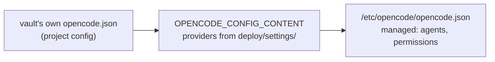

So a vault can't switch off the zero-data-retention routing or point the gateway elsewhere. An `OPENCODE_CONFIG`
file would be merged *before* the project config, which is why the providers don't travel that way (a vault's
`zdr: false` won in the check that found it).

The global config dir (`/opt/opencode-config/opencode/`) holds everything the image adds: `tools/` (`open_note`, `open_url`, `save_url`, `move_to_sources`),
`plugins/` (`known-url`), `lib/` (helpers) and `skills/` (the **app skills**, today `research`). The bake step waits for
the four tools in the tool ids and for the plugin before it makes the dir read-only.

**Custom tool `open_note`** (`deploy/opencode/tools/open_note.ts`, path check in `deploy/opencode/lib/resolve-note.ts`):
checks that `path` resolves inside `context.directory`, exists, is a file and has no dot segment, then returns
`opened <path>`; it reads no content and opens nothing itself — the web app reacts to the completed tool part. It is
loaded from a global config dir that comes only from the image (`XDG_CONFIG_HOME=/opt/opencode-config`), allowed
explicitly for `vault` and `vault-readonly`. opencode writes `package.json` etc. into every config dir and installs
`@opencode-ai/plugin` there on startup, so the Dockerfile pre-bakes the dir with one throwaway `opencode serve`
(each poll bounded by a 2 s `wget` timeout; on failure the build prints opencode's log), then makes it root-owned and
read-only; at runtime it loads offline. Helpers can't live in `tools/` (every export there becomes a tool).

```mermaid
sequenceDiagram
  participant O as opencode (open_note)
  participant H as backend harness/map.ts
  participant C as backend chat.ts
  participant S as web useChat (ChatPane)
  participant A as web store openNote
  O->>O: resolve path in the vault root; missing / outside → tool error
  O-->>H: tool part completed (input.path)
  H->>C: part {call: {path, opens: true, writes: false}}
  C-->>S: NDJSON part event
  S->>S: open tracker: unseen + completed?
  S->>A: wide: now · phone / tablet: on idle · editing: toast instead
```

**Custom tool `open_url`** (`deploy/opencode/tools/open_url.ts`, check in `deploy/opencode/lib/offer-url.ts`): args `{ url }`;
refuses anything but `http:`/`https:` ("Only http(s) pages can be opened"), then returns `offered <url>`. It fetches
nothing and needs no Web access (the server makes no request). Baked like `open_note`, allowed for `vault` and
`vault-readonly` (`commit-message` keeps `"*": "deny"`). The web app turns the completed call into an Open chip ([Link
offers](#link-offers)).

**Custom tool `save_url`** (`deploy/opencode/tools/save_url.ts`, logic in `deploy/opencode/lib/save-url.ts`): args `{ url, filePath }`.
Downloads one http(s) URL into the vault as a **new** media file or PDF (`SAVE_TYPES`: the media table without SVG, plus
`pdf`; a test keeps it in sync with `packages/shared`) and returns `saved <path> (<size>). Embed it in a note with
![[<path>]]`; the AI then edits the note itself. It never overwrites (`wx`: "already exists: …; choose another name"),
creates missing folders, and refuses a path outside the vault (symlinks resolved), a dot-segment, a non-http(s) URL, an HTTP
error, a Content-Type that doesn't fit the extension (an HTML page saved as `.png`; `application/octet-stream` passes) and
a file over 50 MB (the upload cap; the partial file is removed). Timeout 120 s. The download always goes through the egress
proxy, passed explicitly as Bun's `fetch` `proxy` option from `HTTP(S)_PROXY`; without a proxy env the tool refuses. Bun
still fetches `NO_PROXY` hosts directly, so redirects are followed by hand (at most 5) and every hop to a `NO_PROXY` host is
refused ("internal host refused") ("No egress proxy configured"). Baked like `open_note`; allowed for `vault` only, not `vault-readonly`.

**Custom tool `move_to_sources`** (`deploy/opencode/tools/move_to_sources.ts`, logic in
`deploy/opencode/lib/move-to-sources.ts`, import-free so the backend tests load it): args `{ name }`, one input item
folder name. Moves `Input/<name>` to `Sources/<name>` with one `rename` (atomic, no copy of media) and returns `Moved to
Sources/<name>` plus `metadata.files: [{ filePath: "Input/<name>/<f>", movePath: "Sources/<name>/<f>" }]` for every
moved file (the shape `apply_patch` reports; opencode passes a custom tool's metadata into the tool part). Refuses a
name that is empty, `.`/`..`, hidden or has a `/` or `\`; `Input`, `Input/<name>` or `Sources` that is a symlink (`lstat`)
or not a directory; an item whose `index.md` frontmatter still has `unresolved_links` (a small reader for that one key:
inline value or block list, quoted key, blank and comment lines skipped); and an existing target, which it claims first
with a non-recursive `mkdir` so `rename` only ever replaces that empty folder ("Sources/<name> exists: rename or merge by
hand"). Creates `Sources/` if missing. Baked like `open_note`; allowed for `vault` only, so a read-only or conflict turn
can't move.

**Plugin `known-url`** (`deploy/opencode/plugins/known-url.ts`, pure decision in `deploy/opencode/lib/known-url.ts`,
baked into the same global config dir): a `tool.execute.before` hook for `webfetch`, `websearch`, `open_url` and `save_url`
(`GUARDED_TOOLS`). It loads the session's messages through opencode's plugin client (failing closed without them) and
throws what `guardWebCall(tool, args, messages, caps)` returns, or lets the call run on `null`. `guardWebCall`: for `webfetch`,
`open_url` and `save_url` it collects user text and completed tool outputs and refuses "URL not in this chat: paste it into the
chat first" unless the URL is known (`extractUrls`, `isKnownUrl`); for `webfetch`, `save_url` and `websearch` it counts the calls
after the last user message and refuses once the per-turn cap is reached (`capFromEnv`: `WEB_FETCH_CAP` /
`WEB_SEARCH_CAP` in `opencode.env`, rendered from `ai.web.fetch_cap` / `search_cap`, default 20; `webfetch` and `save_url` calls together count against the fetch cap). `save_url` is also in the
plugin's `WRITE_TOOLS`: a file it saved and the AI reads back is not a known source. `open_url` has no cap: the user taps each chip. Stateless, so it survives an opencode
restart.

### Ingest service (`deploy/ingest`)

The compose service `ingest` runs the existing ingest-email tool (Python, ~4.6k lines with resolvers, OCR, Instagram
pacing and retry state) in its own container instead of porting it: not in the backend image (it holds the GitHub and
bearer tokens while this parses untrusted mail and web pages), not in opencode's (bash is denied there on purpose, and
fetching is not AI work). Deterministic, no LLM, never commits.

- **Image** (`deploy/ingest/Dockerfile`, the fifth release image `ghcr.io/tillg/karpathy.app-ingest`): a build stage
  installs ingest-email and instascraper (at its own tag, `v1.1.0`, newer than ingest-email's `[instagram]` extra pins:
  it has the code callback) into a venv, so git stays out of the runtime image; the runtime stage is
  `python:3.13-slim` plus `tesseract-ocr` (`deu`, `eng`), `poppler-utils`, `ffmpeg` and the static `gog` binary (pinned
  release, sha256 per arch). ingest-email is a **private** repo pinned to the commit in `deploy/ingest/ingest-email.ref`;
  its source comes in as the **named build context `ingest_email`**, so the build itself needs no credentials:
  `deploy/ingest/fetch-source.sh` clones it into `tmp/ingest_email-src` with the developer's own git access (`just dev
  up`, `just prodtest`, the shell tests), CI and the release workflow check it out with a read-only deploy key
  ([deployment.md](deployment.md#releases)). A `test` stage adds pytest and `test_server.py`; it is never published.
  Runs as `APP_UID`, `init: true`.
- **Loop** (`deploy/ingest/run.sh`, the container's command): every `INGEST_LOOP_S` (60 s) it renders ingest-email's own
  config from `/etc/ingest/config.json` and runs `ingest-email resolve <profile>` per profile, every `INGEST_FETCH_S`
  (900 s) first `ingest-email ingest <profile>`. Per profile the render maps `vault` (+ `root`) to
  `target_dir=/vaults/<id>[/<root>]/Input` and `archive_dirs=[…/Sources]`, `label` to the four Gmail labels
  (`<label>`, `/processed`, `/failed`, `/rejected`), and passes `account`, `allowed_senders` and `settings` on; a vault
  that isn't cloned is skipped with a log line, `Input/` is created in a cloned one. Profiles run in sequence, one
  process per container; ingest-email's per-profile lock stays (against a manual `docker compose exec ingest
  ingest-email …`). At start it removes leftover `Input/.tmp-*` folders. It exports the `gog_keyring_password` secret
  as `GOG_KEYRING_PASSWORD`, starts `server.py` and restarts it whenever it died.
- **Health:** the loop touches the last-run file `/state/last-run` before and after every ingest-email call (a long
  resolve with Instagram pacing is not a stuck loop); the healthcheck fails when it is older than 20 min. With no
  profiles the loop idles and the file stays fresh.
- **Why a poll loop, not a watcher:** "within a minute" is enough, `resolve` is a cheap scan of `Input/*/index.md`, and
  inotify on a bind or volume mount adds a failure mode. Instagram pacing (1–3 min per post, 08:00–23:00, daily caps)
  stays inside ingest-email and only delays the next round; it never holds an app lock.
- **Endpoint** (`deploy/ingest/server.py`, stdlib `ThreadingHTTPServer` on `:8090`, `internal` network only): the
  Instagram connection ([Ingest](#ingest)). Every request needs `Authorization: Bearer <ingest_token>` (compose
  secret, compared with `hmac.compare_digest`); only request lines are logged, never bodies.
- **Compose:** `user` = the app uid, `cap_drop: [ALL]`, `no-new-privileges`, bounded logs; network `internal` only
  with `HTTP(S)_PROXY=http://egress:3128` (httpx, `gog` and instagrapi all honour it); `GOG_HOME=/state/gog`,
  `GOG_KEYRING_BACKEND=file`, `HOME=/state/home` (instascraper's session and activity ledger); secrets
  `gog_keyring_password` and `ingest_token`; volume `ingest-state` at `/state`; `ingest.json` (rendered from
  `deploy/settings/`) bind-mounted read-only at `/etc/ingest/config.json` (`create_host_path: false`); depends on a
  healthy `egress`. The base `compose.yml` mounts no vault: a target adds one `Input/` (rw) and `Sources/` (ro) bind
  mount per profile vault in `compose.target.yml`; dev and prodtest mount the whole `vaults` volume.

### Egress proxy (`deploy/egress`)

Squid 6 in an own Alpine image (base pinned by digest; the fourth release image), on networks `internal` and
`egress`. Used by opencode and by the ingest service. `squid.conf` has one `dst` ACL of internal ranges (loopback, RFC 1918, link-local, CGNAT/tailnet, ULA,
multicast, …) that is denied, then allows everything else; Squid checks after DNS resolution on every request, so
each redirect hop is re-checked. opencode gets `HTTP_PROXY`/`HTTPS_PROXY=http://egress:3128` and
`NO_PROXY=localhost,127.0.0.1,0.0.0.0` (its plugin client calls its own server directly; dev and tests add the
Ollama host). Gotcha: `::ffff:0:0/96` or `0.0.0.0/8` in the ACL make Squid read `0.0.0.0/0`, so they stay out.

### Proxy (`deploy/proxy`)

Serves the built PWA from `/srv` with SPA fallback, proxies `/api/*` to the backend unbuffered (`flush_interval -1`),
sets CSP and security headers (`img-src` and `media-src` allow `blob:` for media embeds; `frame-src` and
`object-src` stay closed), and gets its certificate by DNS-01 (`TLS_MODE=dns`; GoDaddy, with a 90 s wait for
GoDaddy's nameservers) or from Caddy's internal CA (`TLS_MODE=internal`: dev, prodtest and the `local` target).
`DOMAIN`, `TLS_MODE` and `DNS_PROVIDER` come from the rendered `.env` (settings `proxy.domain`, `proxy.tls`,
`proxy.dns.provider`). A
plain-HTTP site on `127.0.0.1:8081` answers the container healthcheck.

## Communication

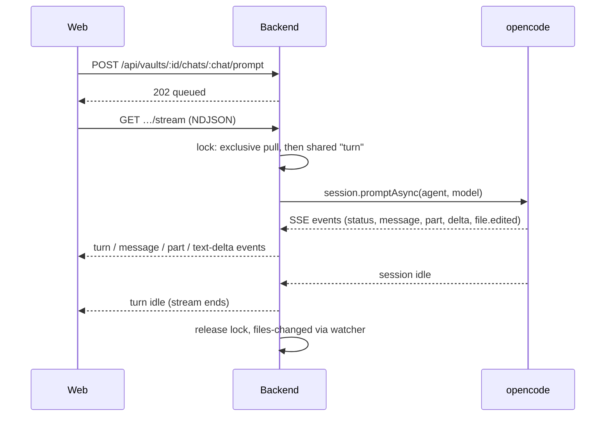

- **Request/response** JSON over `fetch`; **streams** as NDJSON over `fetch` (no WebSockets, no SSE to the browser):
  the vault event stream (`status`, `files-changed`; never ends) and the chat stream (ends when the turn is idle).
- Turns outlive connections: a client reattaches to a running turn from any device.

## Incoming changes and the user's pull

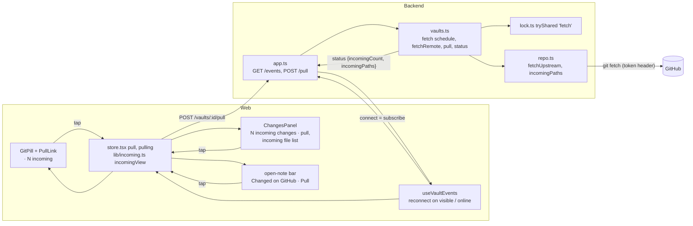

- **`VaultStatus`** gains `incomingCount` (files inside the root that `origin/<branch>` changed since the merge base
  with HEAD) and `incomingPaths` (the first `INCOMING_PATHS_MAX` = 200); `0`/`[]` while not `ready`. `status()` adds
  `repo.incomingPaths()` (`git diff --name-only -z HEAD...origin/<branch> -- <root>`, local refs only; without a
  merge base, after a replaced remote, the plain `HEAD` ↔ `origin/<branch>` diff) to its `Promise.all`. They go out on
  the existing `status` event and in the replies of `GET /status`, `POST /open` and `POST /pull`.
- **Background fetch** (`Vaults.fetchRemote`): `subscribe()` (the event-stream route is the only subscriber; unknown
  vault ids are refused) starts a per-vault `setInterval` (`fetchIntervalMs`, default 2 min) and one fetch per
  connect; the last unsubscribe, `close()` and `remove()` clear it. A running fetch is joined, not repeated. It takes
  `lock.tryShared('fetch')` (skipped when a git operation holds or waits), runs `repo.fetchUpstream()` (`git fetch -q
  --no-auto-maintenance --end-of-options origin <branch>`, 30 s timeout, the token as for every git command), sets or
  clears `pullError` (redacted), and emits a status only when `origin/<branch>` or `pullError` changed. It never
  rejects (a rejected promise from a timer would end the process). It runs in conflict too; the UI hides the count.
- **Git robustness:** on a timeout `runGit` sends SIGTERM and SIGKILL only after 2 s; `fetchUpstream` and the pull
  drop a stale `refs/remotes/origin/<branch>.lock` before fetching. A repo change clears `pullError` (`startClone`).
- **`POST /vaults/:id/pull`** → `Vaults.pull`: exclusive lock, `423` in conflict, then the same `pullUnlocked` as
  open, commit, push and turn; a conflict it causes shows in the returned `VaultStatus`, not as an HTTP error.
  `open()` first awaits a running background fetch, so its `tryExclusive` doesn't skip.
- **Web:** `lib/incoming.ts` `incomingView(status, pulling)` decides every incoming control (`show`, `disabled` while
  pulling or `busy !== 'none'`, label, title, `moreCount`), so the pill segment, the Changes banner, the open-note bar
  and the phone tab badge can't drift apart. The pill segment is a sibling button (`incoming-badge`) joined to the pill
  visually, so the pill's own click still opens Changes; pill and banners use `PullLink`. The store's `pull()` first
  saves the open note's pending draft (`leave()`), pulls once for a double tap, sets the status and toasts "Pulled N
  changes from GitHub" or "Couldn't reach GitHub". No new client timer: the event stream's reconnect on visibility and
  online already triggers a fetch.

## Web access

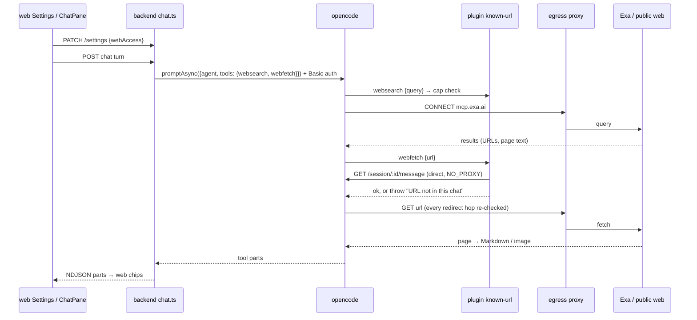

- **Setting:** `Settings.webAccess`; its default is the environment's `ai.web.access` (`true`), and a value saved
  in the app wins (an old `config.json` without it reads the default through the defaults merge).
- **Per turn:** `chat.ts` sends `tools: { websearch: webAccess, webfetch: webAccess, save_url: webAccess && !readonly }` with every prompt of both chat
  agents, `false` included: opencode stores the map as the session's permission, replacing earlier rules and merged
  after the agent's. Any later per-turn rule must go into the same map.
- **Mapping:** `harness/map.ts` sets `ToolCall.query` (websearch `input.query`) and `ToolCall.url` (webfetch
  `input.url`); `writes`/`opens` stay false, no `path`. `save_url` is the exception: `writes` is true and `input.filePath` feeds
  `writtenPaths`, so a download shows in Changes and gets an AI stamp.
- **Chips:** `toolLabel(call)` (`lib/chat.ts`) → `searched the web: "<query>"` and `fetched <host><path>` (path cut at
  60 characters, full URL as tooltip). A completed fetch chip with an `http(s)` URL is a link (new tab, `noopener
  noreferrer`); a search chip is a label; a refused fetch shows the guard's message.

## Commands

A **command** is a skill the chat starts by name (`/name args`). The backend asks opencode for the vault's skills,
the web app offers them in a palette and as chips, and a command turn is an ordinary prompt with the skill's text added
as a hidden part.

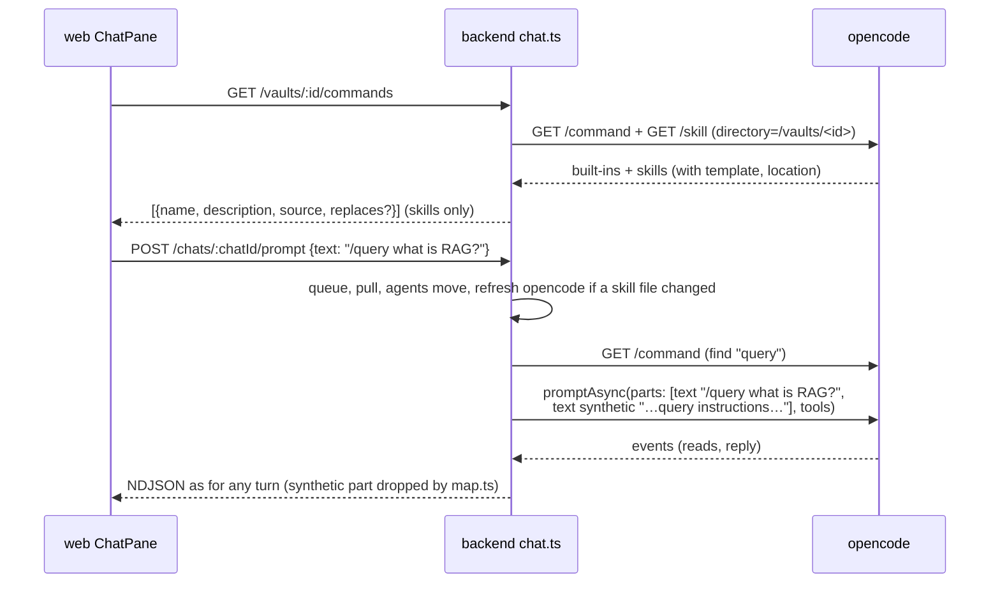

- **Route `GET /vaults/:id/commands`** → `ChatService.commands`: same checks as the chat routes (`409 not-ready`,
  `409 unsafe-config`, `503` when opencode is down). Returns `Command[]` (`@karpathy/shared`: `name`, `description`,
  `source: 'vault' | 'app'`, `replaces?: true`), vault skills first, each group A–Z; the template stays on the server.
- **`Harness.commands(dir)`** (`OpencodeHarness`): `command.list` plus `app.skills` for the same directory; keeps entries
  with `source === 'skill'` that aren't in `HIDDEN_COMMANDS` (`customize-opencode`; the built-ins `init` and `review` aren't
  skills). A skill is an **app skill** when its `location` lies under `/opt/opencode-config/`, else a **vault skill**.
- **Name clash.** opencode's pick between a vault skill and an image skill of the same name isn't stable, so
  `ChatService.vaultCommands` decides: the app skills' names come from the list for `/vaults` itself (which never holds vault
  skills), and for such a name the vault skill is read from `.agents/skills/<folder>/SKILL.md` (frontmatter `name`,
  `description`, body plus a base-directory line) and listed with `replaces: true`; command turns use that text too. The AI's
  own `skill` tool may still load either.
- **Skill refresh.** opencode caches a directory's skill list until the instance is disposed, so a skill that arrived with
  a pull would never show. `Harness.refresh(dir)` calls `instance.dispose` and returns once the directory's event
  subscriptions have reconnected (at most 5 s; the subscription treats the disposal as no outage). The **skill stamp** per
  vault is the sorted `path:mtime:size` of every `SKILL.md` under `.agents/skills/` in the vault root and each folder up to
  the clone root (in memory; the first check after a start counts as changed). When it differs from the last one seen,
  the backend refreshes, but never while a turn runs, because disposing ends the directory's sessions:
  - in `kick()`, inside the exclusive-lock section right after the pull and the agents move, unless a commit-message
    proposal runs for the vault (`Vaults.isProposing`; proposals take no lock);
  - in `GET /commands`, only while the vault is idle (`busy === 'none'`, no running or adopted turn, no proposal), holding the
    lock shared under the label `refresh` (`tryShared`, quiet) so no turn can start meanwhile. A pull or commit that is
    running is waited for first (at most 10 s, without queueing for the lock). Otherwise the cached list is returned.
  - `Vaults.open` waits up to 5 s for a `refresh` holder before its `tryExclusive` pull, so the pull of the same app load
    doesn't skip.
  - Known gap (#134): a skill folder *created* in the vault on the server (in the app or by the AI) isn't in opencode's
    list until the next pull; e2e therefore delivers its stub `ingest` skill by push and pull.
- **Command turns.** `harness/command.ts`: `parseCommand(text)` needs `/` and a name `[A-Za-z0-9][\w.:-]*` at the start, then
  whitespace or the end. `expandCommand(template, args)` follows opencode's rules (`$1…$N`, the highest taking the rest;
  `$ARGUMENTS`), but appends nothing when there is no placeholder, because the user's message already carries the arguments;
  `` !`…` `` and `@file` stay literal. `commandInstructions` prefixes a short header ("The user started the command
  `/<name>`…; paths to notes are relative to the vault root") and, for an app skill, `withoutBaseDir` drops the base-directory
  line, since that directory lies outside the vault. `PromptInput.instructions` becomes a second text part with
  `synthetic: true` (it reaches the model; `map.ts` drops synthetic parts from what the app shows, so the bubble is what the
  user typed). In `kick()`, only a name in the vault's list makes a command turn; anything else, `/etc/hosts is…`
  included, is a plain turn. A failing `commands()` fails the turn like a failing prompt. The queue still stores only
  `{ chatId, text }`, so a queued command survives a restart.
- **Never opencode's command endpoint** (`POST /session/:id/command`): it replaces `` !`cmd` `` in a skill with the output of
  `cmd`, run through a shell with no permission check, resolves `@file` references, and takes no per-turn `tools` map
  ([security.md](security.md#confining-the-ai), [ADR 0004](../../docs/adr/0004-commands-as-prompts-not-command-endpoint.md)).
- **Web: `lib/commands.ts`** (pure): `paletteQuery(text)` (the partial name while the text is `/` plus name characters, else
  `null`), `filterCommands` (case-insensitive; vault skills before app skills, prefix matches before other matches, each
  A–Z), `chipCommands(list, recent, 4)` (recent names still in the list first, then A–Z), `recentCommands` /
  `recordCommand` (localStorage `karpathy.recentCommands.<vaultId>`, at most 10 names, every access in `try/catch`).
  `ChatPane` › `Conversation` loads the list on mount, when the app reports an agents move (`commandsNonce`) and each time
  the palette opens; the list is optional: if the GET fails, palette and chips don't render and sending never waits for it.
  - **Palette:** a `listbox` above the composer while `paletteQuery(text) !== null`, grouped "This vault" and "karpathy.app",
    each row `/name`, a `vault`/`app` tag and the description; a `replaces` row adds "Replaces karpathy.app's /name; rename
    it in .agents/skills/ to get both." The textarea keeps focus (`aria-activedescendant`); ↑/↓, Enter or Tab pick, Escape
    closes, a row is picked on pointer-down. Picking sets the text to `/name ` and sends nothing.
  - **Chips:** up to four `/name` buttons in an empty chat (no messages, nothing pending); tooltip = description plus "from
    this vault" / "built into karpathy.app"; an app skill's chip has the app icon. A tap puts `/name ` in front of the
    composer's text and focuses it. `recordCommand` runs on every send that starts with a listed command.

### The `research` skill

`deploy/opencode/skills/research/SKILL.md`, copied to `/opt/opencode-config/opencode/skills/` by the `Dockerfile`: an app
skill listed in every vault unless the vault has a `research` skill of its own. It is self-contained (its base directory is
outside the vault, where `external_directory: deny` blocks reads) and the backend treats it like any command: no special
tools map, no special rule. What it tells the AI:

| Part | Instructions |
|---|---|
| Conventions | The vault's own instructions (`AGENTS.md`, `CLAUDE.md`, an ingest skill) decide folder, name and frontmatter of sources and pages; a source file is always a summary with short quotes. |
| Plan turn | Read the wiki index and topic pages; with web tools, scout at most 3 searches and 2 fetches and save nothing; without them, say Web access must be turned on. Write `Research/<YYYY-MM-DD>-<slug>.md` (topic, 3–6 sub-questions as `- [ ]`, what the wiki covers, budget of 8 sources per run turn) and end with "Edit the note if you like, then reply **go**." In conflict, put the plan in the reply. |
| Run turn | Re-read the plan note; per open sub-question at most 2 searches; skip URLs already in `Sources/`; fetch, save `Sources/<date>-<slug>.md` (`type: source`, `url`, `title`, `fetched`); at most 8 new sources; write or update cited wiki pages (`sources:` and `[[Sources/…]]`), update index and log, tick off the note. |
| Stop and ask | At a "limit reached" error or after 8 sources: list the open questions and ask for "continue". |
| Resume | `/research <plan note or matching topic>` skips the plan and runs on the note's open questions, in any chat. |

The plan step, the scouting budget and the stop are instructions to the model. The hard bounds are the per-turn web caps
and the user's reply before each block; no money or token cap exists.

## Link offers

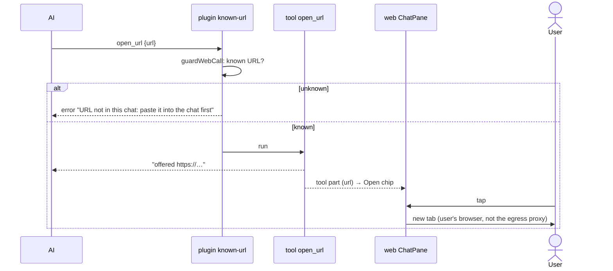

- **Mapping:** `map.ts` sets `ToolCall.url` for `open_url` as for `webfetch`; `opens` stays `false`, because `opens` drives the
  automatic note opening and a link offer never opens by itself (browsers block `window.open` without a tap, and the tap is the
  user's check of the host on the chip).
- **Web:** `toolLabel` → `open <host><path…>`; `toolHref` returns the URL of a completed `open_url` too. `ToolChip` renders it as
  an `<a target="_blank" rel="noopener noreferrer">` action chip (arrow icon, full URL as tooltip). A refused one is the usual error
  chip; tapping it shows "URL not in this chat: …".

## Ingest

Five pieces, mostly independent (#131): the ingest service ([above](#ingest-service-deployingest)), the input count,
the Ingest button, `move_to_sources` ([opencode](#opencode-deployopencode)) and the Instagram connection. **The app
contains no ingest logic:** its only coupling to the vault's skill is the name `ingest` and the generic
`move_to_sources` tool.

### Input count

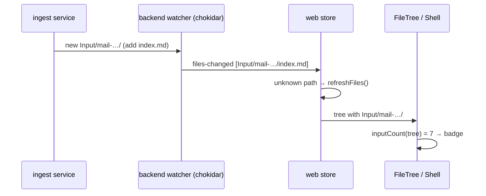

- **No backend change:** chokidar reports the `add` of the item's `index.md` (it ignores `addDir`), the store re-lists
  the tree on an unknown path, and `listTree` lists folders (dot-folders hidden, so a `.tmp-*` never shows).
- `inputCount(tree)` (`lib/tree.ts`, pure): the direct child folders of the root folder named exactly `Input`, not
  starting with `.`. Client-side because the tree is already complete and live in the browser; a status field would
  duplicate it with its own invalidation.
- `FileTree.tsx` computes it from the unfiltered tree; the `Input` row shows `.input-badge` (`aria-label="7 sources
  waiting to be ingested"`, danger colour token), hidden at 0. Under a tree filter that hides every item, a synthetic
  empty `Input` row keeps the badge visible. `Shell.tsx` puts the same count on the phone's Files tab.
- **Commit reminder:** `VaultStatus.inputChangedCount` (changed paths under `Input/`, from the same `changes()` as
  `changedCount`); the web's `reminderCount` is `changedCount - inputChangedCount`. The Changes list and the pill show
  everything.

### Ingest button

- Rendered in the `Input` row (`trow-act`, `data-testid="ingest-now"`) when the count is > 0 **and** the vault's command
  list (`GET /vaults/:id/commands`, loaded while the count is > 0 and on `commandsNonce`) has `ingest`. The phone's Files
  tab shows the same tree, so it needs no second button (no button in the phone header).
- Disabled with the reason as `title` when offline, in conflict, while `status.busy === 'turn'`, and while starting.
- Store `ingestNow()`: `POST /vaults/:id/chats`, switch to the new chat (wide/tablet: open the chat; phone: the Chat
  tab), `recordCommand(vault, 'ingest')`, then the same prompt path a typed message uses with the text `/ingest`. So
  ADR 0004 holds (the backend expands the skill text, never opencode's command endpoint) and the turn queues like any
  other. Unlike a command chip it sends.
- **The vault's skill** (`.agents/skills/ingest/SKILL.md`, owned by the vault, also used by Claude Code on the Mac): the
  app relies on, but can't enforce, that it handles any queue size in one call, skips items with `unresolved_links`,
  cites `Sources/<name>/index.md`, and finishes one item (pages, then `move_to_sources`, or `mv` without the tool)
  before the next. Everything it reads must lie in the vault. No app skill named `ingest` ships.

### Writing into a live vault without the backend's lock

The backend's `VaultLock` is in-process; the ingest service can't take it, and a backend-driven run under the lock was
rejected (Instagram pacing makes a run minutes long, and writer preference would stall pulls and commits). The service
keeps to operations that are safe next to git and editor work:

| Operation | How | Safe because |
|---|---|---|
| New item | build in `Input/.tmp-<rand>/`, rename to `Input/<name>/` | rename is atomic; `listTree` skips dot-folders; leftovers removed at start. **Not yet:** the pinned ingest-email still writes mail items in place (prerequisite open) |
| Update link state | `index.md` via temp file + `os.replace` | never a half-written `index.md` |
| Touch an item | only while it has `unresolved_links` | once ready, it belongs to the AI and the user |

- **Pull keeps `Input/` in place:** `git stash --include-untracked` removes and later recreates untracked folders, which
  would detach the service's bind mount of `Input/` and race its writes. So the pull's dirty check (`git status
  --porcelain`) and stash take the pathspec `-- . ':(exclude)<root>/Input'`; waiting items stay while the pull
  fast-forwards around them.
- **Commit:** a newly arrived item makes the changed set differ from the reviewed one, so the commit fails with the
  existing `409 changes-moved` and the user reviews again (no partial commits).
- **Accepted:** the user editing an item's `index.md` in the same second the service rewrites it (last writer wins; the
  editor's version check shows the stale-save dialog), and the Mac editing a committed `Input/<name>/index.md` while
  the server resolves it (an ordinary git conflict). A long `/ingest` turn holds the vault lock like any turn.

### Instagram connection

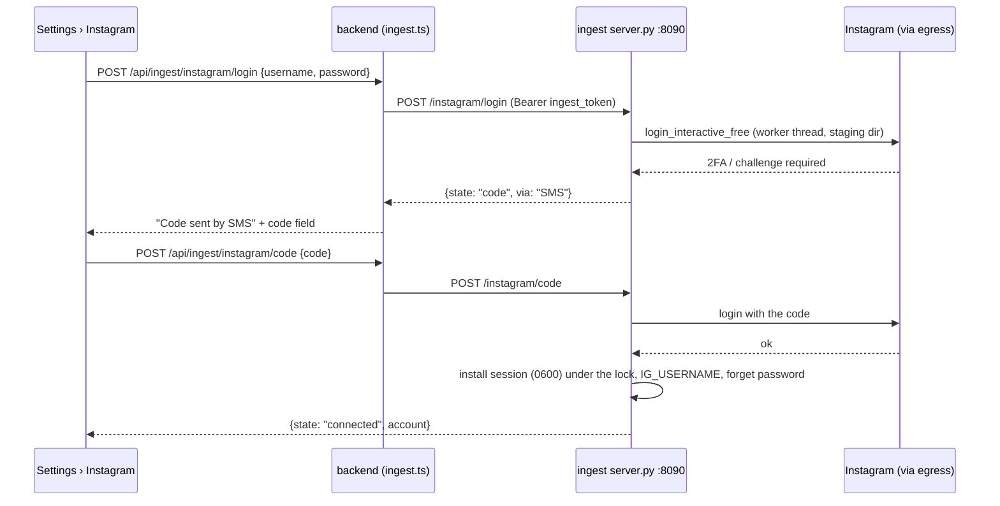

The browser carries the form, the server does the login: instascraper's password login with a stable emulated device.
The session cookie can't come from the user's browser (instagram.com's `sessionid` is HttpOnly on another origin), and
Instagram has no API for reading other people's posts. A session minted on the server's IP is also the one Instagram
then sees in use.

- **Endpoint routes:** `GET /instagram/status` → `{ state, account?, via?, waitingLinks }`; `POST /instagram/login
  {username, password}` → `{state: "connected", account}` or `{state: "code", via}`; `POST /instagram/code {code}`;
  `POST /instagram/disconnect` (drops a pending login and the session files) → status.
- **Pending login:** a worker thread runs instascraper's `login_interactive_free(username, password, code)`
  (instascraper ≥ 1.1.0); when Instagram wants a code, `code(via)` blocks on a queue that `POST /instagram/code` fills,
  at most 300 s (`expired-code`, 400). One pending login at a time; a new login supersedes it. `POST /login` and
  `/code` wait at most 90 s for the next answer, else `504 login-timeout` and the login is cancelled. Errors:
  `wrong-password` (400), `expired-code` (400), `no-pending-login` (409), `login-failed` (502, the exception's type
  only).
- **Sessions:** each attempt logs in into its own `mkdtemp` staging dir under `/state/instagram-login/` (a copy of the
  old session keeps the device ids stable); only a successful, still-current attempt installs
  `~/.config/instascraper/session-<user>.json` (0600) under the service lock and sets `IG_USERNAME` in instascraper's
  config, so the resolver's client uses it. A pending or superseded login never touches a working session.
- **Status, read from the vaults** (ingest-email stays as it is): `waitingLinks` = Instagram URLs in an
  `Input/*/index.md`'s `unresolved_links` with reason `no-session`; `waiting-for-code` while a login waits for a code;
  `not-connected` without a session; `expired` when such a link's item was rewritten by the resolver after the session
  file was installed (right after a connect it reads `connected` until the resolver has tried again). The status never
  logs in.
- **Username:** `^[A-Za-z0-9._]{1,30}$`, not only dots (a leading `@` is dropped), checked by the backend's zod schema
  and again in the service, because it becomes part of file names.
- **Backend** (`src/ingest.ts`, routes in `app.ts`): `GET /ingest/instagram`, `POST /ingest/instagram/login|code|
  disconnect`, bearer-guarded and zod-validated (`.strict()`, password ≤ 200, code ≤ 20 characters), proxied to
  `INGEST_URL` (`http://ingest:8090`) with the token from `INGEST_TOKEN_FILE` and a 120 s timeout. The service's errors
  keep their status as `{ error, code }`, except 401/403 (a token mismatch), which become `502 ingest-auth` because the
  web app treats every 401 as "log out"; unreachable or not configured is `503 ingest-down` "Ingest service not running".
- **Web** (`InstagramSettings.tsx`): status line, then the form (username, password → Connect, or Reconnect when
  `expired`), the code step ("Code sent by <via>", Verify, Cancel, which only resets the form), or Disconnect when
  connected; `InstagramNotice` in the Vaults list while `expired`. Types `InstagramStatus`, `InstagramLoginAnswer` in
  `packages/shared`.
- **Dev and e2e:** `compose.dev.yml` sets `INGEST_FAKE_INSTAGRAM_LOGIN=1`, a built-in fake login (password `wrong`
  fails, a user `twofa…` asks for code `000000` by SMS). Prod and prodtest never set it (`compose.test.sh` asserts it).

## The agents move

The app moves a vault to the `.agents` standard (`AGENTS.md`, `.agents/skills/`) by itself; see
[domain.md](domain.md#agents-move) for the rules and the user-facing result.

- **When:** after every successful clone or pull (the pull before each turn included) and on `POST /vaults/:id/open`
  (`Vaults.agentsMove`), under the exclusive lock the caller holds, so no turn runs. Skipped in conflict (it would only add to
  it); it runs on the next pull or open after the conflict is resolved. It never throws into the caller (failures are logged).
- **`scanLegacy(vaultRoot)`:** names in `.claude/skills/*/` (directories only; a plain file `.claude/skills` is the link stub and
  means "already moved"), `.claude/commands/*.md`, and whether `CLAUDE.md` is anything but `@AGENTS.md` (or `AGENTS.md` exists
  without a `CLAUDE.md`). Vault root only. The scan left after a move is remembered per vault (`legacySeen`), so clashes that
  haven't changed don't repeat the move or the notice on every pull.
- **`migrateToAgents(repo)`** never overwrites and commits nothing:
  - `CLAUDE.md` → `AGENTS.md`, unless `AGENTS.md` exists or `CLAUDE.md` mixes `@AGENTS.md` with other lines (clash: both stay,
    `AGENTS.md` goes into `skipped`). Each line that is only `@<path>` is replaced by that file's content, one level deep,
    relative to the vault root, only for an existing file inside it that is not gitignored (`AGENTS.md` gets committed; a
    path outside, a missing or an ignored file stays as text). Then `CLAUDE.md` becomes `@AGENTS.md`. The pasted files stay
    and are returned as `inlined`. `AGENTS.md` without `CLAUDE.md` gets `CLAUDE.md` = `@AGENTS.md`;
  - each `.claude/skills/<n>/` → `.agents/skills/<n>/` (whole folder), unless that exists (`skipped`);
  - each `.claude/commands/<n>.md` → `.agents/skills/<n>/SKILL.md` with `name` and `description` (its own, else its first line,
    at most 200 characters), other frontmatter dropped, body unchanged; `.claude/commands/` is removed only when empty;
  - when anything went into `.agents/skills/` and `.claude/skills` has no content left, the **skill link** replaces it. The
    clones run with `core.symlinks=false`, so the backend writes the stub file `.claude/skills` (content `../.agents/skills`,
    **no trailing newline**) and stages it as a link with `Repo.stageSymlink`: `git rm -r --cached`, then `git update-index
    --add --cacheinfo 120000,<blob>,.claude/skills`. The commit's `git add -A` keeps the index mode for the stub, so the
    commit carries a real symlink. Staging it is the only index write outside a commit. A pull resets the index and stashes the
    work tree, so `restageSkillLink` stages the link again whenever the stub is there but the index lost it;
  - returns `AgentsMove { moved, converted, instructions, inlined, skipped }` (`@karpathy/shared`).
- **Event:** a non-empty result is emitted as the vault event `{ type: 'agents-move', at, …AgentsMove }` on
  `GET /vaults/:id/events` and kept as the vault's last move (in memory), which a client that connects later receives before
  the live events. `at` identifies the move.
- **Web:** the store shows each move once (`karpathy.shownMoves` in localStorage, keyed `<vault>:<at>`, last 50), sets
  `agentsMove`, bumps `commandsNonce` and refreshes files and changes. `MoveNotice` (`Dialogs.tsx`, inside `#app`) shows
  "Moved to the .agents standard": skills now in `.agents/skills/`, rules now in `AGENTS.md`, "not moved, name exists: …", each
  pasted file with a **Delete** link (`DELETE /file`), and **Review** (the Changes view). It stays until dismissed or the
  vault changes.
- **Effects:** the move changes `SKILL.md` stamps, so the next command list refreshes opencode. The file writes reach the
  editor through the watcher's `files-changed` events like any change on disk. A moved skill folder shows as one delete plus
  one add per file in the uncommitted changes.

## Outline and properties

Two note-pane features (#79, #82), web only: no route, no API change.

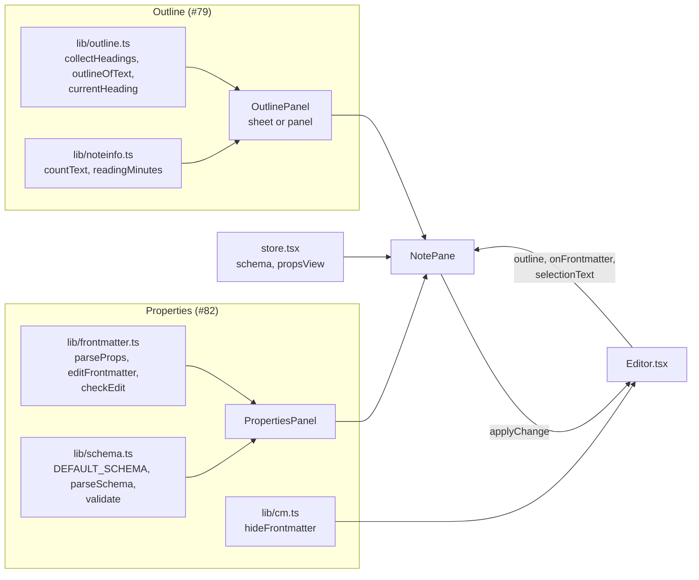

**Outline.** Both modes read the headings with the editor's Lezer Markdown parser (`commonmarkLanguage`), so the
list is the same in Write and Read mode; code drops out by the grammar, the frontmatter (its closing `---` would make
`title: x` a setext heading) and `%%comments%%` are skipped explicitly (`frontmatterEndLine`, `commentRanges` in
`lib/markdown.ts`, shared with the editor's embed and line plugins). Write mode reads them from CodeMirror's syntax
tree (`ensureSyntaxTree`, kept up to date incrementally; `outlineOfText` is the fallback for a tree not ready in
50 ms), Read mode from `outlineOfText(text)`. While typing, the outline and the note info follow a *settled* copy of
the text, set once no edit came for 300 ms (the pause is keyed on the editor's `onChange`, not on renders); the list of
outline items is memoized, so a note with thousands of headings re-renders only when they or the current one change.
A jump: Write mode `gotoLine(line, { focus: false, align: 'start' })`, Read mode `scrollToLine(scroller, line,
'top')` plus the `hit` class for 1.5 s; no history entry. The current section comes from a rAF-throttled scroll
listener (`topLine()` / `topBlockLine()` → `currentHeading`). Phone: a bottom sheet (`aria-modal`, scrim, grabber,
inside the transformed pane so it sits above the tab bar); tablet: a floating panel that closes on a jump or a tap
outside; wide: the same panel, open across notes. Escape is handled on `document` with `preventDefault`, so the
Shell's window handler skips it. Note info counts with `Intl.Segmenter` (words: `isWordLike`; characters: graphemes
without line breaks) on the body (`splitFrontmatter`), or the selection: Write mode `selectionText()` clipped past
the frontmatter, Read mode the DOM selection inside `.rd`, read on the button's `pointerdown` (iOS clears it on tap).

**Properties form.** The frontmatter comes from the editor (`onFrontmatter`: `{ from, to, text }` in CodeMirror's
positions, reported on create and when that text changes), so form edits and the editor agree on offsets also for
CRLF notes; NotePane keys it by note, so another note's report never shows. `parseProps` parses with `yaml`'s
`Parser` + `Composer({ keepSourceTokens })`; errors, warnings, a non-map, keys that print the same (`1` / `"1"`) and
an unresolvable alias make it unreadable (the YAML lines show). Editable: one-line plain or quoted scalars, one-line
flow lists and block lists of them; the rest is `raw`. Edits follow [ADR 0005](../../docs/adr/0005-frontmatter-edits-through-the-yaml-cst.md):

| Edit | How the new text is made |
|---|---|
| `set` on a scalar | `CST.setScalarValue` on the value's token, in its own style when that reads back as the value, else `PLAIN`, else double-quoted; then `CST.stringify` |
| `set` on an empty value | a splice after `key:` (a comment after it stays) |
| `add` | flow: `, item` after the last item (or into `[]`); block: a new line with the last item's prefix; empty value: `[item]` |
| `remove` | flow: the item and its separator; block: the item's line (its comment goes with it); the only block item: `key: []` |
| `addKey` | a new last line before trailing blank lines; lists as flow lists |

Every result passes `checkEdit` (parses, other properties equal and in order, only the pair's lines or the line after
them changed, the value reads back as intended) or is refused. `NotePane.editProp` computes the edit on the form's
text and calls `applyChange(minimalChange + from, expect)`, which writes only while the editor still holds `expect`
(an AI reload or pull meanwhile: nothing written, a toast); the transaction is a normal user change (`isolateHistory`,
`input.properties`), so autosave, drafts and undo treat it like typing. `hideFrontmatter(onBlocked)` is a
`StateField` with one block `Decoration.replace` over the frontmatter lines plus `atomicRanges`, and a
`transactionFilter` that clamps cursor moves and select-all to the body and drops typed or deleted changes that would
reach the hidden lines (Backspace at the body start) while calling `onBlocked`, which shows the lines. A search match
(`select.search`) or a `gotoLine` into the frontmatter shows them too. The store loads `.karpathy/schema.json` when a
vault becomes usable and on `files-changed` naming it (404 → default; invalid → default and a toast once per problem
and vault); `propsView` is localStorage `karpathy.propsView`; the per-note YAML override `yamlFor` lives in NotePane
and clears on a note change. `PropertiesPanel` renders one field per property (select with an extra flagged option
for a value outside the enum, date + Today, decimal input that keeps non-canonical numbers as typed, switch, chips
with an Add field and note suggestions for link lists, `raw` with "Edit in YAML"), violations under their field,
missing required keys as their own rows, and **+ Property** (a datalist of the schema's missing keys, any
`isPropertyName` key; starting value `[]`, today or `""` by kind).

## Media embeds

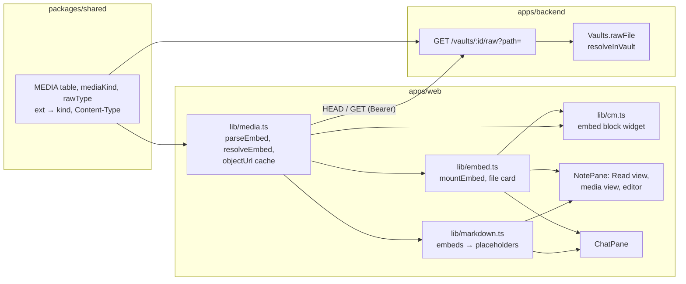

Four surfaces show media: Read mode, Write mode, chat replies and the media view (a file opened on its own). All of
them end in one plain-DOM function, `mountEmbed(el, resolved, ctx)`, which creates elements with `createElement` and
an object URL as `src` (no HTML strings). While bytes load, a skeleton holds the space, using the natural size the
cache remembered from an earlier load when there is one, so Back lands without layout jumps.

- **Raw route:** `GET /vaults/:id/raw?path=` behind the bearer auth. `Vaults.rawFile` applies the note path rules (no
  `..`, no `.git`, no hidden files, no symlinks); `res.sendFile` streams and answers `HEAD` and `Range`. Headers:
  `Content-Type` from `rawType` (media table; `application/pdf`; else `application/octet-stream`),
  `Content-Disposition: attachment` for everything that isn't a media kind, `nosniff`, `Cache-Control: no-store`. No
  ETag: hashing a large video per request is the waste avoided. `GET /file` is unchanged and still gives the version
  that Delete needs when a media file is opened from the tree.
- **Resolution** (`resolveEmbed(embed, notePath, paths)`): the wiki form goes through `resolveWikilink` (exact path,
  path suffix, basename; ties: the note's folder, then the shortest path, then A–Z); the Markdown form is URL-decoded
  and joined with the note's folder; `http(s):`, `//`, `data:` → `remote` (a plain link). Results: `media`, `file`,
  `note` (rendered as a wikilink), `missing`, `remote`.
- **Object-URL cache** (`objectUrl`, `invalidate`): key `vault\0path`, the pending promise is shared. A `HEAD` asks the
  size first; over 50 MB it resolves `tooLarge` without transferring bytes (not cached), unless `force` (Load anyway).
  SVGs are sanitized with DOMPurify's SVG profile before they become a blob. Budget 200 MB, least recently used entries
  revoked; entries in use are held (`release()`) and never evicted. `files-changed` invalidates the changed paths;
  switching vault or logging out invalidates the vault.
- **PDF Open:** `window.open('', '_blank')` synchronously in the click (Safari blocks it after an `await`), then the
  tab's location becomes a blob re-typed `application/pdf`, so only the browser's PDF viewer can show it.
- **Tap on an image** calls `onOpen(path)` → `store.openNote`, which pushes a history entry.

## Uploads

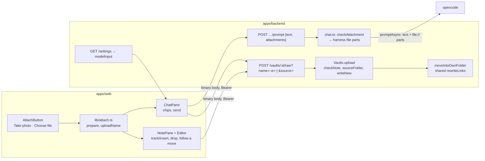

- **Route:** `POST /vaults/:id/raw?name=<file>` plus exactly one of `note=<page>` (editor) or `source=new&at=<local
  YYYY-MM-DD-HHMMSS>` / `source=<upload-… folder>` (chat). The body is the file's bytes: `express.raw({ type: () =>
  true, limit: MAX_UPLOAD_BYTES })` on this route only, so the JSON API is unchanged; `entity.too.large` → `413
  too-large`. Response `UploadResult { path, version, size, moved?, rewritten? }`, `201`. Under the shared `save` lock;
  `423` in conflict.
- **Name** (`checkUploadName`): no folder, no leading dot, no `#^[]|`, the new-file-name rules, then uploadable (`415
  not-uploadable`, extension only). **Note** (`checkNote`): an existing `.md`, no hidden segment, the new-file-name
  rules. **Free name** (`writeNew`): taken if any vault file has that base name (case-insensitive), then `-2` … `-100`;
  written with `flag: 'wx'`, so two uploads at once never overwrite each other. **Source folder** (`sourceFolder`):
  `Sources` matched case-insensitively; `new` claims `upload-<at>[-n]` with a non-recursive `mkdir`; a given name must
  exist directly in it and start with `upload-`.
- **Own folder** (`attachmentFolder`, pure): `dir/stem.md` is in its own folder when `base(dir)` equals `stem`
  (case-insensitive) or `stem` is `index`; otherwise it moves to `dir/stem/`.
- **Move** (`moveIntoOwnFolder`), all checks before the first write: `409 ai-busy` while a turn holds the lock;
  `409 folder-taken` when `dir/stem` is a file or `stem.md` exists in the folder; an existing folder in other case is
  used with its spelling. One ripgrep call (`filesMentioning`: the stem, with `%20`, and `encodeURI`'d) finds candidate
  pages; `rewriteLinks` (`packages/shared/src/relink.ts`, using the shared resolver moved from the web app) rewrites
  path-form wikilinks and Markdown links that resolve to the page, and relative links inside the moved page, skipping
  code blocks and spans; a percent-encoded link keeps its encoding. Then every touched page and the page itself are
  version-checked (`409 stale`), the attachment is written into the folder, the pages are rewritten, the page is
  renamed, its own text written, and its AI-touched mark renamed. `Vaults.afterRelinkScan` is a test seam between
  the scan and the checks.
- **Web, editor:** `NotePane.attach` filters non-uploadable files (one toast), `editor.track(at)` holds the cursor or
  drop point, and `store.uploadToNote` runs the files one after another: flush, pause autosave for that note,
  `prepare` (JPEG/HEIC: `createImageBitmap` with EXIF orientation → canvas ≤ 2048 px → JPEG 0.85, then APP1/APP13
  segments stripped, because WebKit's encoder writes an Exif block; else unchanged; HEIC that can't decode → error),
  50 MB refusal and 10 MB `confirm`, `api.upload` (a `Blob` body is sent as `application/octet-stream`), the path added
  to the file list at once, then the embed. A `moved` response runs `retarget`: the note's path, version and draft key
  follow, the route is replaced (no history entry), and the text becomes the server's (unedited) or the local draft
  through the same `rewriteLinks` (edited), pushed into the editor with `setDoc` before the embed goes in. The editor
  stays mounted (keyed by `openedAs`). If the editor is gone when an upload finishes, the embed is appended to the
  note's draft and saved.
- **Web, chat:** `ChatPane` keeps `{ chips: { path, version, mime, size }[], folder }` per chat in localStorage
  `karpathy.chips:<vault>:<chat>` (`lib/chips.ts`); chips whose file isn't in the first loaded file list are dropped.
  The first upload sends `source=new&at=`, later ones `source=<folder>`; ✕ is `DELETE /file` with the upload's version
  (the server removes the emptied folder). Send posts `{ text, attachments: paths }`. Chips and sent files render
  through `FileEmbed` → `mountEmbed` (an image through `/raw` and the object-URL cache, a PDF as a file card). The
  composer re-reads `GET /settings` when a chat opens.
- **Prompt:** `promptBody` = `{ text (≤ 100 000, may be empty with attachments), attachments? (≤ 5 paths) }`. The
  queued `Turn` keeps the paths (persisted in `config.json` `queued`, never bytes); an attachment-only prompt titles the
  chat with the first file name. At turn start `Vaults.checkAttachment` applies the raw-file rules, `isUploadable` and
  `MAX_ATTACHMENT_BYTES` (20 MB); a failure is a stream `error` and the turn ends before opencode. `PromptInput.files`
  become `FilePartInput { type: 'file', mime: uploadMime(path), filename: path, url: file:///vaults/<id>/<root>/<path> }`
  after the text part (left out when empty). opencode reads the bytes, stores them as a `data:` URL, normalizes images
  (≤ 2000 × 2000 px, 5 MB) and replaces what the model can't read with an "ERROR: Cannot read …" note.
- **History:** `mapPart` maps a `file` part with a `filename` to `ChatPart { type: 'file', path, mime }`; the `data:`
  URL never reaches the browser.
- **Model input:** `Harness.models()` returns `{ id, input: { image, pdf } }` from opencode's
  `capabilities.input`; `GET`/`PATCH /settings` add `modelInput` for the current model, `null` when opencode doesn't
  answer within 3 s or doesn't list it.

## Attach preflight

`POST /vaults` (`Vaults.add`) checks a repo before anything is stored:

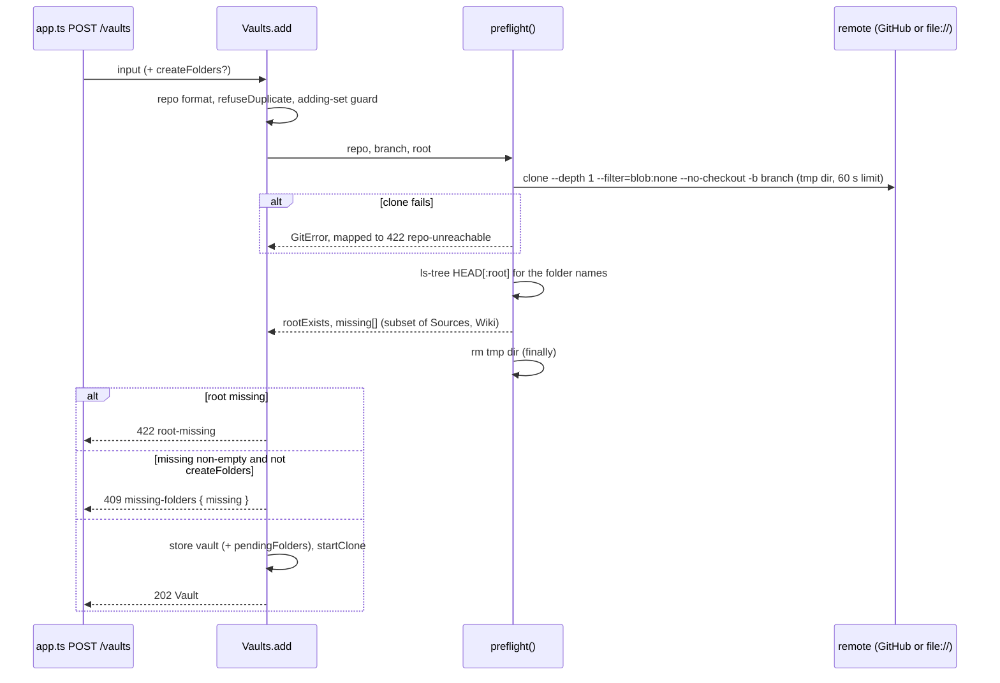

- The preflight clone is blobless, depth 1 and without checkout (commits and trees only, small even for media-heavy
  vaults), made in a random `pre-*` dir under `<vaultsDir>/.preflight/` on the vaults volume, and always removed.
  `Vaults.init()` removes `.preflight/` at startup (leftovers of a crash). The clone is killed after 60 s. It also
  works against `file://` remotes (setting `git.remote_base`, `file:///remotes/` in dev, prodtest and on `local`) in
  tests and dev.
- **Folder check:** `git ls-tree HEAD[:<root>]`; only entries of type tree count, so a *file* named `Wiki` is missing.
  Names match case-insensitively; missing ones are created as `Sources/` / `Wiki/`. A root that isn't in the tree
  gives `rootExists: false`.
- **Concurrency guard:** an in-memory set of `repo|branch|root` keys whose add is in flight; a second add of the same key
  gets `409 duplicate`. It bounds parallel preflights per repo and closes the window between duplicate check and store.
- **Persisting:** only after the preflight passed. With `createFolders` and missing folders, the stored vault carries
  `pendingFolders`; when the clone has finished, `createFolders()` writes `<root>/<folder>/.gitkeep` (skipping a folder
  that exists after the clone, failing with "a file with that name exists" if a file blocks it) and then `cloned: true`
  is stored and `pendingFolders` removed. A restart mid-clone re-clones and still creates them. The writes are
  uncommitted changes (ADR 0001), outside the AI-touched set. Folders deleted between preflight and clone aren't
  re-checked.
- **Errors** (`HttpError` JSON `{error, code}`): `422 repo-unreachable` (message from `cloneErrorText`, redacted),
  `422 root-missing`, `409 missing-folders` (body adds `missing: string[]`), `409 duplicate`. `clone-failed` remains
  for failures after the preflight. `PATCH /vaults/:id` has no preflight.
- Messages from preflight and clone failures go through `redact()` before they are returned, logged or stored.

## GitHub token

- **Storage:** `ConfigData.githubToken`, a top-level key of `config.json` and deliberately not part of `Settings`,
  because `GET /settings` returns settings verbatim. `GitHubToken.current()` returns the stored token, else the
  deployment's `github_token` secret (settings `git.github_token`, a compose secret file named in `settings.json`)
  read at startup; `source()` is `settings | secret | none`; `clear()` falls back to the secret.
  Existing deployments therefore keep working unchanged.
- **Live getter:** `Vaults` gets `githubToken: () => string | undefined` instead of a startup string and calls it
  per git operation (clone, pull, push, preflight, access check), so a changed token applies to the next one, no restart.
- **Routes:**

  | Route | Body | Reply |
  |---|---|---|
  | `GET /settings`, `PATCH /settings` | `PATCH`: `{ commitReminderThreshold?, model?, webAccess? }`; `model: null` = back to the default | `SettingsView`: settings (`model` = the effective one) + `defaultModel`, `modelOverridden` ([Settings](#settings)) + `githubToken: { source, last4 \| null }` (last4 of the current token, stored or secret), never the plaintext, + `modelInput` ([Uploads](#uploads)) |
  | `PUT /settings/github-token` | `{ token }` (trimmed, 20–255 chars, no whitespace; else 400) | `204` |
  | `DELETE /settings/github-token` | | `204`; falls back to the secret |
  | `POST /settings/github-token/test` | `{ token? }`, else the current token | `200 TokenTest` |

  The token routes answer 404 when no `GitHubToken` is wired (tests that omit it).
- **Token test:** `TokenTest { ok, login?, scopes?, expiresAt?, error?, vaults: {id, repo, ok, error?}[] }`. Identity is
  `GET {GITHUB_API_BASE}/user` (default `https://api.github.com`, 10 s timeout; `X-OAuth-Scopes`,
  `github-authentication-token-expiration`); it reports 401 as "GitHub rejected the token (401)." and network failure as
  "GitHub is not reachable from the server right now.". In parallel, `Vaults.checkAccess` runs
  `git ls-remote --exit-code --heads <remote><repo>.git <branch>` per configured vault with the tested token, which
  proves repo access (a fine-grained token passes `/user` without it). Nothing is stored. API base (env
  `GITHUB_API_BASE`) and remote base (setting `git.remote_base`) come from the server, never from the request.
- **Redaction:** `GitHubToken` remembers every value seen since startup (secret, stored, every set and every tested
  token) and `redact()` masks each as `***`; `Vaults` redacts clone, preflight and access-check messages with it.

## File dates

`GET /vaults/:id/files` gives every file three optional dates (epoch ms), so the tree can sort by Last changed and
filter by author (#122):

| Field | Value |
|---|---|
| `modified` | uncommitted file: its mtime; else the committer time of its last commit |
| `ai` | the AI edit stamp |
| `human` | the newer of the human edit stamp and the last commit without the AI trailer |

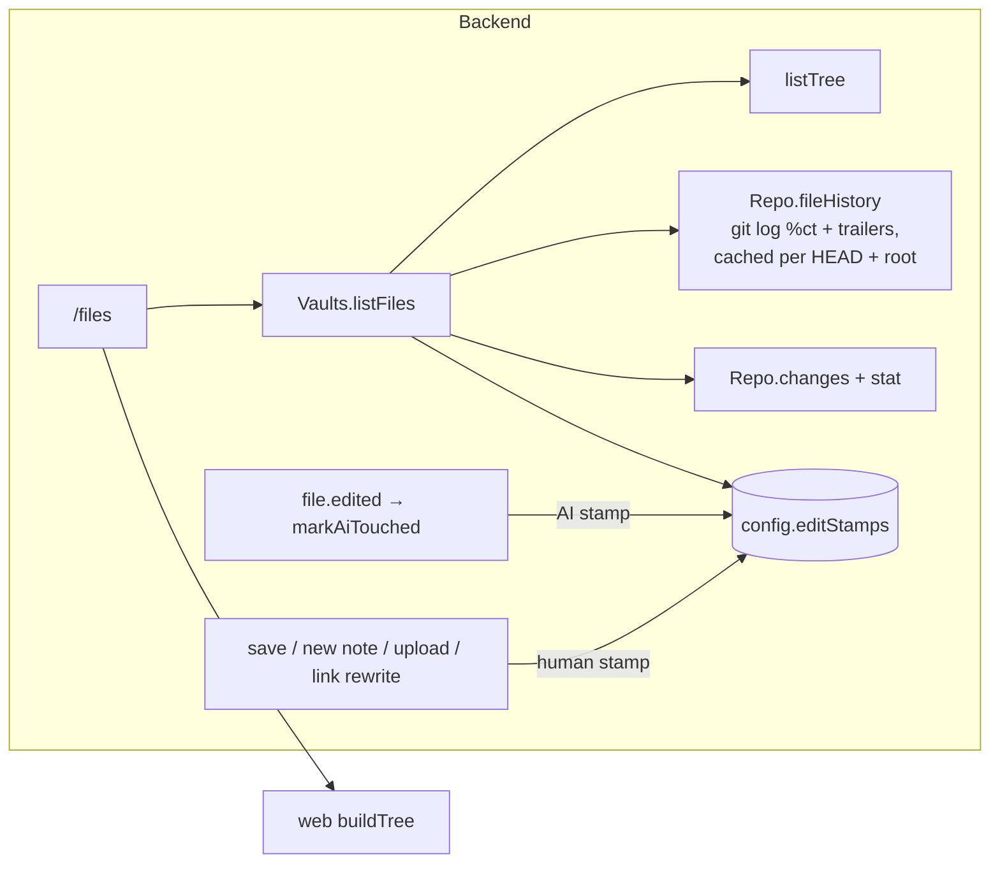

- **History pass:** one `git log -z --format=%x1e%ct%x1f%(trailers:key=Co-authored-by,valueonly) --name-only` over
  the vault root; the first commit seen per path is `last`, the first without the app agent's trailer `lastHuman`.
  Committer time, not author time: git log walks in that order, and a rebase keeps old author times. Cached in the
  vault runtime keyed by HEAD + root; concurrent listings share one run; a failed run is logged and not cached. Only
  `listFiles` adds dates: `listTree` stays date-free for search, uploads and relinking.
- **Stamps** follow the rules in [domain.md](domain.md) (Edit stamps). Human stamping is best-effort (a failed config
  write is logged, the save still succeeds). The cleanup of stamps of deleted files re-checks the disk and is skipped
  while the lock is `sync` or the vault is in Conflict.
- **Live updates:** while dates are in use (`usesDates`), the web refetches the listing 500 ms after a
  `files-changed` burst, once when `busy` leaves `turn` (the AI stamp can land after the watcher event), and when the
  user switches into such a view. Overlapping listings are numbered; only the newest sets the tree.
- **Known limits:** every new HEAD reruns the full history pass, also when sorting by name (fine for typical vault
  sizes; incremental `old..new` would fix it). Merge commits list no files, so a merge dates nothing. Stamps grow with
  every file the app ever wrote. Commit times are whole seconds, so a discard keeps a stamp less than 1 s newer than
  the last commit. A re-cloned vault starts without stamps.

## Data

| Store | Content | Owner |
|---|---|---|
| Volume `vaults` → `/vaults/<id>` | Full git clone of each vault repo (no shallow or sparse clone). The notes themselves. | backend (git), opencode (file tools) |
| `<vault root>/Input/` (in the clone, tracked by git) | The ingest queue: one folder per input item, its `index.md` frontmatter holding the link state (`unresolved_links`, `resolved_links`, `failed_links`). | ingest service (creates, updates while links are open), AI (`move_to_sources`), user |
| Volume `ingest-state` → `/state` | gog's encrypted file keyring (Gmail OAuth client and refresh token), instascraper's session and activity ledger (`home/.config/instascraper/`), login staging dirs, ingest-email's rendered config and locks, the last-run file. Backed up with the server, not in git. | ingest service |
| `deploy/settings/*.yaml` (git) | The settings of every environment: central file, environment files; gitignored local overlays for dev and prodtest. Secret references only. | operator / developer |
| `tmp/settings/<env>/` (dev, prodtest), `/opt/karpathy.app/shared/` (target) | Rendered files: `.env` (compose), `opencode.env` (0600), `settings.json` (backend, mounted read-only at `/etc/karpathy/settings.json`), `ingest.json` (0600, the ingest service's profiles, mounted read-only at `/etc/ingest/config.json`). | renderer; Ansible on a target |
| Volume `config` → `/config/config.json` | `vaults` (config + `cloned` / `cloneError` / `pendingFolders`), `settings` (threshold, web access, `modelOverride` only while ≠ the default model), `githubToken` (plaintext, if set in the app), `aiTouched`, `editStamps` (per vault and path: last AI / human write, epoch ms), `conflicts`, `queued` turns. | backend only |
| `/vaults/.preflight/` | Short-lived blobless clones of the attach preflight; emptied at startup. | backend |
| Volume `opencode-data` | opencode sessions = chat history, including attached files (base64, after opencode's resize), until the chat is deleted. | opencode |
| localStorage `karpathy.chips:<vault>:<chat>` | Unsent chat attachments (path, version, type, size) and their source folder. | web |
| Volume `caddy-data` | TLS certificates and keys. | proxy |
| Browser localStorage | Token, local drafts, tree expansion state, tree sort and filter (`karpathy.treeSort`, `karpathy.treeFilter`), main pane, mode preference (`karpathy.mode`), properties view (`karpathy.propsView`). | web |
| localStorage `karpathy.recentCommands.<vault>`, `karpathy.shownMoves` | The last 10 commands started in a vault (chip order); the agents moves already announced (last 50). | web |
| Backend memory | Per vault: the skill stamp of the last opencode refresh, the last agents move, the skill-link scan after it, running commit-message proposals. Lost on restart (the first check then refreshes). | backend |
| opencode image `/opt/opencode-config/opencode/` | Tools `open_note`, `open_url`, `save_url` and `move_to_sources`, plugin `known-url`, helpers, app skills (`skills/research/`). Read-only, from the release. | opencode |
| Browser memory | Object URLs of media (≤ 200 MB), places of notes seen this session. Lost on reload. | web |
| Service worker cache `vault-api` | Vault list, file trees, opened notes (for offline reading); cleared on 401. | web |

No database. Git is the source of truth for notes; GitHub is the sync hub.

## System boundaries

- **Exposed:** one HTTPS origin: the PWA plus `/api/*` (full route list in `apps/backend/src/app.ts`). Every `/api`
  route needs the bearer token; `/healthz` exists only inside the stack.
- **Consumed:** GitHub over HTTPS (clone, fetch, push), the opencode HTTP API and the ingest endpoint (`:8090`) on the
  internal network, the LLM provider APIs, Exa and public web pages (from opencode, through the egress proxy), the
  Gmail API, Instagram and the pages linked in mails (from the ingest service, through the egress proxy), and the DNS
  provider API (DNS-01, from the proxy only).

## External systems

| System | Used for | Status |
|---|---|---|
| GitHub | Vault repos; fine-grained token as an HTTP extra header, never in `.git/config`; `api.github.com/user` for the token test | in use |
| LLM providers (OpenRouter in production, any via opencode) | Model behind opencode, chosen as the environment's gateway in `deploy/settings/`; keys only in the rendered `opencode.env` | OpenRouter `z-ai/glm-5.3` on zero-data-retention hosts in production |
| Ollama | Dev, prodtest and the `local` target (native on the Mac, `just ollama install`); CI and integration LLM tests (container; models from `deploy/settings/test.yaml`) | in use |
| Exa | Web search backend (opencode `websearch`, MCP at `mcp.exa.ai`); optional `EXA_API_KEY`, else the anonymous, rate-limited endpoint | in use |
| Gmail (via `gog`) | The ingest profiles' labels: read, relabel; OAuth client and refresh token copied from the Mac by `just ingest-auth` | built; no profile enabled in production yet |
| Instagram (via instascraper / instagrapi) | Posts and Reels behind Instagram links in mails; password login from Settings › Instagram | built; the real login not yet tried from the server |
| `tillg/ingest_email`, `tillg/instascraper` (GitHub) | Sources of the ingest image: the private ingest-email at a pinned commit (deploy key in CI), instascraper at a tag | in use |
| Let's Encrypt + GoDaddy DNS | Certificate for `app.karpathy.app` via DNS-01; the A record points at the server's tailnet IP. The apex and `www` point at GitHub Pages | in use |
| GitHub Pages | Hosts the website at `karpathy.app` (with GitHub's own Let's Encrypt certificate) | in use |
| ghcr.io | The app's release images (public) and opencode's base image | in use |
| Docker Hub | Base images; Beszel and Gatus | in use |
| Hetzner Cloud | The production server | in use |
| Tailscale | The only way into the server (SSH, app, monitoring UIs) | in use |
| ntfy.sh, healthchecks.io | Alert delivery to the phone; heartbeat dead-man's switch | in use |

## Infrastructure

- **Runtime = docker compose** in dev and prod (`deploy/compose.yml`). Services `proxy` (networks `edge` +
  `internal`), `backend` and `egress` (`internal` + `egress`), `opencode` and `ingest` (`internal` only, which is
  `internal: true`: no route out but the egress proxy); backend, opencode and ingest run as uid 1000; all with
  `cap_drop: [ALL]`, `no-new-privileges` and log rotation. Settings come rendered from `deploy/settings/`
  ([Settings](#settings)): compose interpolates `.env`, the backend reads `settings.json` (`SETTINGS_FILE`),
  opencode gets `opencode.env`, ingest `ingest.json`. Secrets are files mounted as compose secrets (`deploy/secrets/`
  in dev, `tmp/prodtest/secrets/` in prodtest, `shared/secrets/` on a target: `bearer_token`, `github_token`,
  `opencode_password`, `dns_api_token`, `gog_keyring_password`, `ingest_token`; the last two generated like the
  opencode password); provider keys, `EXA_API_KEY` and the web caps come from `opencode.env`.
- **Dev** (`compose.dev.yml`, `just dev up [N]`): numbered dev stacks side by side, one per checkout; stack N on
  https://localhost:80N0 with Caddy's internal CA, Vite with HMR (`web` service), bind-mounted sources, local bare
  repos as remotes (`dev.yaml`: `git.remote_base: file:///remotes/`), the native Ollama on the Mac as the model
  unless the developer's `dev.local.yaml` picks another gateway. The `ingest` service mounts the whole `vaults` volume,
  idles (no profiles in `dev.yaml`) and has the fake Instagram login; `just dev up` first runs
  `deploy/ingest/fetch-source.sh` for its build context. Details: [Dev stacks](#dev-stacks).
- **Local prod test** (`compose.prodtest.yml`, `just prodtest`): the prod images as project
  `karpathy-app-N-prodtest` on https://localhost:80N5, paired with the checkout's dev stack N (ingest idle, whole
  `vaults` volume, no fake login).
- **CI** (`.github/workflows/ci.yml`): lint, typecheck, tests, web build, a compose config check, the ingest image
  (built from the private ingest-email, checked out with the read-only deploy key `INGEST_EMAIL_DEPLOY_KEY`) with its
  loop and endpoint tests, and `ansible-lint` + syntax checks of the playbook on every push and PR; weekly (and on
  demand) GitHub and LLM test suites. Fork and Dependabot PRs have no deploy key, so the ingest checkout fails there
  (#135).
- **Website** (`.github/workflows/pages.yml`): the site test, then `_site/` to GitHub Pages on every push to `main`
  that touches `site/`, `assets/icons/` or the app's stylesheet.
- **Releases and production:** a tag `vX.Y.Z` builds the images (amd64 + arm64) to GHCR; the Ansible playbook
  deploys a release to a **target**: `local` (a Lima VM on the Mac, https://localhost:9444) or `hetzner` (a
  Hetzner CPX22 reachable only over Tailscale, https://app.karpathy.app, running since 2026-10-02), with
  monitoring (Beszel, Gatus, a healthchecks.io heartbeat, alerts via ntfy). All of it:
  [deployment.md](deployment.md).

### Dev stacks {#dev-stacks}

Several agents develop on the Mac at once, each in its own checkout (main clone or `.worktrees/<name>`), and each
needs a running stack for e2e tests and screenshots. Stack N (1–9) is compose project `karpathy-app-N` and owns the
port block 80N0–80N9 (vocabulary: [domain.md](domain.md#development)).

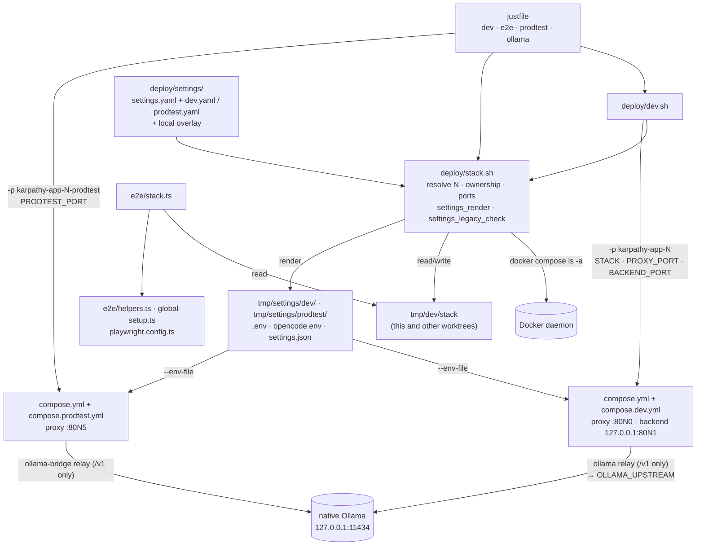

- **Ports.** 80N0 is the proxy (the app over HTTPS; the Vite HMR socket goes through it, `HMR_CLIENT_PORT`), 80N1
  the backend's HTTP API on `127.0.0.1` for debugging without TLS (the backend can publish because it is also on
  the `egress` network), 80N5 the paired prodtest's proxy. 80N3 (opencode) and 80N4 (web) are reserved but never
  published: both sit only on the `internal: true` network. The rest is spare.
- **`deploy/stack.sh`** (sourced; `jq`, `nc`) holds all of it; the compose files only interpolate `STACK`,
  `PROXY_PORT`, `BACKEND_PORT` and `PRODTEST_PORT`, and fail with a pointer to `just dev up` when they are unset
  (`:?`), so a raw `docker compose up` can't silently start a stack on a colliding port. `stack_resolve` picks N
  from the argument, then `$STACK`, then `tmp/dev/stack`, then (only for `up`) the first free stack. `stack_state`
  says `mine`, `free`, `other:<checkout>`, `orphan` or `port-busy`: the owner is the checkout in the project's
  Docker `ConfigFiles`, else another worktree (`git worktree list`) whose `tmp/dev/stack` claims N. The claim
  exists because `up --build` builds for minutes before `docker compose ls` lists the project; in the first
  acceptance run a second `up` 20 s later took the same stack. A same-second race between two `up`s is still
  possible (no lock).
- **`deploy/dev.sh up [N] | down | logs | ps | token | stacks`** runs
  `docker compose -p karpathy-app-N -f compose.yml -f compose.dev.yml` (`-p` overrides `name: karpathy-app`, so prod
  is untouched). `up` refuses a stack another checkout owns or whose ports a stranger holds (naming the owner and
  the first free stack), a second stack while this checkout holds one, and a missing native Ollama; it may take
  over an orphan, refuses a leftover hand-edited `deploy/.env` or `deploy/opencode.env` (`settings_legacy_check`:
  names their keys, never values, and where each goes now), creates the dev secrets, renders this checkout's
  `deploy/settings/` for `dev` into `tmp/settings/dev/` (`settings_render`; a missing secret or invalid setting stops
  it before compose), remembers N, pulls the default model if it is an Ollama one Ollama lacks, and prints URL and
  token. Compose gets `--env-file ../tmp/settings/dev/.env` whenever that file exists, so a stack started before
  the settings can still go down. `just prodtest up` does the same for `prodtest` (secrets in
  `tmp/prodtest/secrets/`, plus any `deploy/secrets/*_api_key` for a hosted gateway). `down` keeps the
  volumes and releases the claim. `stacks` lists 1–9 with state, URL and owner, read-only. Volumes (`vaults`,
  `config`, `caddy-data`) are per project, so each stack has its own vaults and Caddy CA.
- **Images per stack.** The dev services reset `image:`, so compose names them `karpathy-app-N-<service>` and
  parallel builds never overwrite each other's images. Prodtest still uses `ghcr…:dev` tags, shared across
  checkouts (known risk).
- **Native Ollama.** The dev model runs on the Mac, not in a container: `just ollama install` sets up the
  LaunchAgent `app.karpathy.ollama` (`ollama serve` from Homebrew, `OLLAMA_HOST=127.0.0.1:11434`,
  `OLLAMA_CONTEXT_LENGTH=16384`, Metal GPU, models in `~/.ollama`); `status` and `uninstall` go with it. It refuses
  when another server already answers on 11434 (it would lack the context length). One Ollama serves every stack
  and every prodtest, and the `local` target's VM as well. Containers reach the Mac's loopback as
  `host.docker.internal`.
- **Ollama relay.** Each stack keeps a small Caddy (`ollama` in dev, `ollama-bridge` in prodtest, `ollama-relay` on
  the `local` target, all `deploy/proxy/Caddyfile.ollama-relay`) on the `internal` network (alias `ollama.internal`)
  and `egress`. opencode's provider config (the `ollama` gateway's `base_url`, `http://ollama.internal:11434/v1`, in
  `OPENCODE_CONFIG_CONTENT`) and `NO_PROXY` use that name. The upstream is `{$OLLAMA_UPSTREAM}`, the gateway's
  `relay_upstream` in the rendered `.env`: `host.docker.internal:11434` (the compose default) for dev and prodtest,
  `192.168.5.2:11434` on `local` (Lima's user-mode address for the host, which forwards to the Mac's loopback, so
  Ollama stays bound to `127.0.0.1`).
  The relay passes only `/v1/*` and answers 403 to the rest, so Ollama's admin API (pull, delete, create) stays out
  of a prompt-injected AI's reach. It rewrites `Host` to `localhost:11434`, because a loopback-bound Ollama answers
  403 to any other `Host` (its DNS-rebinding guard).
- **Stack label.** The dev `web` service sets `VITE_STACK=N`; `brandName()` (`apps/web/src/lib/brand.ts`) makes the
  vault switcher's brand `karpathy #N`. The prod PWA is built without it and keeps `karpathy.app`, as do the token
  screen, the chat author line and `<title>`.
- **e2e target.** `e2e/stack.ts` is the TypeScript twin of `stack_resolve` without claiming: `E2E_BASE_URL` (a
  non-dev stack, with `E2E_BACKEND_CONTAINER`), then `STACK`, then `tmp/dev/stack` → `https://localhost:80N0` and
  container `karpathy-app-N-backend-1`; otherwise it throws "run just dev up". `just prodtest e2e` sets
  `E2E_BASE_URL=https://localhost:80N5`. The `justfile` never sets `E2E_BASE_URL` for dev stacks, so the dev-only
  specs (`attach.spec.ts`) run on every numbered stack.

## Settings {#settings}

Every app setting of every environment lives in `deploy/settings/` (issue #133; vocabulary:
[domain.md](domain.md#settings)). One renderer turns it into the files each component reads; dev scripts and Ansible
both call it.

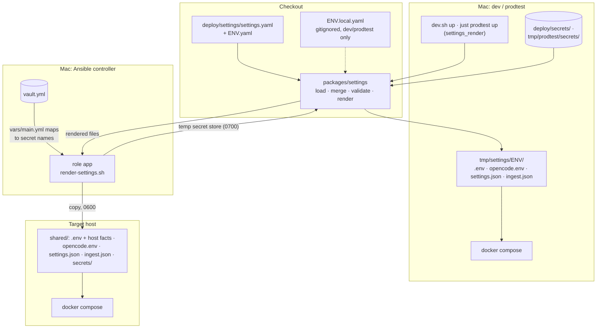

**Files.** `settings.yaml` (central: every setting with the shared value), one committed environment file each for
`dev`, `prodtest`, `test`, `local` and `hetzner` (only what differs), and the gitignored local overlays
`dev.local.yaml` / `prodtest.local.yaml`. The keys:

| Key | Holds | Overridden by |
|---|---|---|
| `ai.gateway`, `ai.model` | The gateway (a key of `gateways`) and the default model (`openrouter/z-ai/glm-5.3`) | `dev`, `prodtest`, `test`, `local`: `ollama`, `ollama/qwen2.5:3b` |
| `ai.vision_model` | The integration tests' vision model | `test`: `ollama/qwen3-vl:2b` |
| `ai.web` | `access` (default of the Web access switch), `fetch_cap`, `search_cap` (20 each), `exa_api_key` (optional secret) | — |
| `auth` | `bearer_token`, `opencode_password` (secret references) | — |
| `git` | `remote_base` (`https://github.com/`), `author` (`name`, `email`), `github_token` (optional secret) | `dev`, `prodtest`, `local`: `file:///remotes/`; author per environment; `hetzner`: author as secrets `git_author_name` / `git_author_email` |
| `proxy` | `domain` (`localhost`), `tls` (`internal` \| `dns`), `dns.provider` (`godaddy`), `dns.api_token` (optional secret) | `hetzner`: `app.karpathy.app`, `dns`, token required |
| `timezone` | `Etc/UTC` | `local`, `hetzner`: `Europe/Berlin` |
| `commit_reminder_threshold` | Default of the commit reminder (4) | — |
| `files.visible_dot_dirs` | Dot-folders the file tree shows (`[.agents]`; names start with `.`, never `.git`) | — |
| `ingest` | `defaults` (ingest-email options: `max_per_poll` 20, `resolve_max_urls_per_mail` 5, `run_interval_s` 900) and `profiles` (`{}`: the loop idles). A profile: `vault` (backend vault id), optional `root`, `label`, `account` and `allowed_senders` (each may be a secret reference, so no personal data lands in the public repo), optional `settings` (ingest-email options) | only `hetzner` may set profiles (none yet; a test asserts `dev`, `local`, `prodtest` and `test` have none) |
| `gateways.<id>` | `kind`, `name`, `base_url`, `relay_upstream`, `api_key`, `models` (opencode's per-model config, passed through): `openrouter` (built-in kind; `z-ai/glm-5.3` with its zero-data-retention provider routing) and `ollama` (`openai-compatible`, base URL `http://ollama.internal:11434/v1`, `qwen2.5:3b` and `qwen3-vl:2b` with limits) | `local`: `ollama.relay_upstream: 192.168.5.2:11434` |

**Load and validate** (`packages/settings`, plain TypeScript run with `tsx`, deps `yaml` and `zod`):

| Module | Does |
|---|---|
| `schema.ts` | Strict zod schema (`settingsSchema`, unknown keys fail), `partialSettingsSchema` for environment files (every key optional at any depth, secret references whole), `crossFieldErrors`: `ai.gateway` names a gateway; `ai.model` / `ai.vision_model` are `<gateway>/<model>` and, unless the kind is built in (`openrouter`, `anthropic`, `openai`), listed under the gateway's `models`; `proxy.tls: dns` needs `proxy.dns.api_token`. |
| `load.ts` | `environments(dir)`, `loadSettings(env, { dir, overlay })`: central file (complete) ← environment file (partial) ← local overlay (dev, prodtest; skipped with `overlay: false`; for other environments an error), merged map by map, validated complete again. Every error names the file (or `<env> (merged)`) and the YAML path. |
| `secrets.ts` | `secretRefs(settings)`: every reference with its path, from all settings except gateways other than the chosen one. `resolveSecrets(settings, store)`: reads `<store>/<name>`, trims one trailing newline, fails listing every missing non-optional secret. |
| `render.ts` | Pure functions, settings + resolved secrets in, file text out: `renderComposeEnv`, `renderOpencodeEnv`, `renderOpencodeProviders`, `renderBackendSettings`, `renderIngestConfig`. |
| `cli.ts` | `render <env> --out <dir> --secrets <dir> [--compose-dir <dir>]`, `show <env>` (effective settings, secrets as references), `get <env> <path>` (one value, e.g. CI's test models), `check` (every environment validates; in `just check` and CI), `--list-secrets <env>`; `--dir`, `--no-local`. `just settings …` runs it. |

**Rendered files:**

| File | Read by | Contents |
|---|---|---|
| `.env` (0600) | compose interpolation | `DOMAIN`, `TLS_MODE`, `DNS_PROVIDER`, `TZ`, `GIT_AUTHOR_NAME` / `GIT_AUTHOR_EMAIL` (resolved), `GIT_REMOTE_BASE`, `DEFAULT_MODEL` (= `ai.model`), `OLLAMA_UPSTREAM` (only for a gateway with `relay_upstream`), `SETTINGS_DIR` (dev, prodtest: the rendered dir relative to `deploy/`). A superset of the old Ansible `env.j2`, so an older release's `compose.yml` still finds every name (rollback); a target appends its host facts. |
| `opencode.env` (0600) | opencode (`env_file`) | The gateway's key under its provider's variable (`OPENROUTER_API_KEY`, `ANTHROPIC_API_KEY`, `OPENAI_API_KEY`; none for `openai-compatible`), `EXA_API_KEY` if set, `WEB_FETCH_CAP`, `WEB_SEARCH_CAP`, `OPENCODE_MODEL`, `OPENCODE_CONFIG_CONTENT` (`{ provider: { <gateway>: … } }`, merged after a vault's own config, see [opencode](#opencode-deployopencode)). Values compose's env-file parser reads back verbatim (`$` escaped). |
| `settings.json` | backend (`SETTINGS_FILE`) | Only what the backend needs: `auth`, `git` (remote base, resolved author, token), `ai.model`, `ai.web_access`, `commit_reminder_threshold`, `files`. The compose secrets (`bearer_token`, `opencode_password`, `github_token`, `dns_api_token`) become `{ file: "/run/secrets/<name>" }`; any other reference is resolved inline. |
| `ingest.json` (0600) | ingest service (`/etc/ingest/config.json`) | `{ defaults, profiles }`; per profile `vault`, `root`, `label`, `account` and `allowed_senders` with their secrets resolved, and the profile's `settings` merged in. `run.sh` turns it into ingest-email's own config ([Ingest service](#ingest-service-deployingest)). |

**Compose.** `compose.yml` mounts `${SETTINGS_DIR:-.}/settings.json` read-only at `/etc/karpathy/settings.json`
(`create_host_path: false`: a missing render fails instead of leaving a directory) and sets `SETTINGS_FILE`; opencode
takes `env_file: ${SETTINGS_DIR:-.}/opencode.env` (optional, so `compose config` works without a render), ingest mounts
`${SETTINGS_DIR:-.}/ingest.json` read-only at `/etc/ingest/config.json` (also `create_host_path: false`). On a target
`SETTINGS_DIR` is unset and `shared/` is the project dir. No model or gateway literal is left in any compose file;
`compose.dev.yml` / `compose.prodtest.yml` keep only stack plumbing (ports, builds, source mounts, the Ollama relay
with `OLLAMA_UPSTREAM`, `NO_PROXY` for `ollama.internal`). A dev stack renders the settings of the checkout it is
started in (main clone or worktree), with that checkout's overlay and secrets, so a branch that changes a setting runs
with it and parallel stacks never read each other's.

**Backend.** `settings.json` is parsed by the backend's own schema (`apps/backend/src/settings.ts`), not the
package's: the rendered shape differs (secrets as files) and the image needs no YAML code; a test in
`packages/settings` parses the renderer's output with it, so the two can't drift. Container wiring and build/deploy
facts stay env ([Backend](#backend-appsbackend)).

**Model default and override.** `ConfigStore.open(dir, { model, webAccess, commitReminderThreshold })` gets the
settings' values as defaults; there is no model literal in the code (`DEFAULT_SETTINGS.model` is `''`). In
`config.json` the model is stored only as `settings.modelOverride`, and only while it differs from the default:

| Event | Stored | Effective model |
|---|---|---|
| Admin saves with the default model in the field (or `PATCH model: null`) | no `modelOverride` | the default |
| Admin saves another model | `modelOverride` | the override |
| Deployment changes `ai.model` | unchanged | the new default, unless overridden |
| Old `config.json` with `settings.model` (before the settings) | on the next save: `modelOverride` only if ≠ the default | the stored model (an older Admin choice that differs from the new default stays in effect) |

`GET /api/settings` returns the effective `model`, `defaultModel` and `modelOverridden`; `PATCH` still checks a new
model against opencode's model list. The threshold and Web access keep "stored wins": the settings give their value
until one is saved in the app.

**Test environment.** `deploy/settings/test.yaml` names the integration tests' models: `apps/backend/test/opencode-container.ts`
takes `LLM_MODEL` / `LLM_VISION_MODEL` from `loadSettings('test')` (`LLM_TEST_MODEL` / `LLM_VISION_MODEL` env override
them for one run), and CI pulls those two into its Ollama volume with `settings get test ai.model` /
`ai.vision_model`. Tests of the committed files use `overlay: false` / `--no-local`, so a developer's overlay never
changes a result.

**Ansible** renders a target's settings on the controller with the same CLI (`render-settings.sh`) and copies the
result to `shared/`: [deployment.md](deployment.md#settings-on-a-target).

## Design decisions

The ones that shape the whole system:

- **Agent harness = opencode** ([ADR 0002](../../docs/adr/0002-opencode-as-agent-harness.md)): neither loop nor
  tools nor skills are reimplemented; the backend only relays. The boundary is ACP-shaped so the harness stays
  swappable.
- **Editor = CodeMirror 6 on raw Markdown** ([ADR 0003](../../docs/adr/0003-codemirror-raw-markdown-editor.md)):
  lossless round trip, clean git diffs, no fight with the AI's raw edits.
- **Form edits go through the YAML CST and are refused when lossy**
  ([ADR 0005](../../docs/adr/0005-frontmatter-edits-through-the-yaml-cst.md)): `Document.toString()` moves comments
  and re-styles scalars; js-yaml has no CST. One invariant (`checkEdit`) guards every edit kind.
- **Vault = GitHub repo, sync = git:** the app holds no content of its own; Obsidian on other devices uses the same
  remote. One GitHub token for all vaults, editable in the app (the deployment secret is the fallback); if vaults
  ever span several owners, the follow-up is one token per owner, not per vault.
- **Checked attach:** a vault is stored only after a preflight (reachable, branch, root, `Sources/` + `Wiki/`), so a typo
  or a missing token scope never leaves a `clone-failed` vault behind. One endpoint answers `409` and is retried with
  `createFolders`, instead of a separate check endpoint that could go stale; git does the check, not the GitHub API,
  so it works against `file://` test remotes. Created folders are `.gitkeep` placeholders, uncommitted (ADR 0001); a
  visible `README.md` would look like a source to ingest skills.
- **The user commits, the AI never does** ([ADR 0001](../../docs/adr/0001-user-triggered-commits.md)).
- **Explicit pull steps instead of `git pull --rebase --autostash`** (diagram in
  [domain.md](domain.md#pull-and-conflict)): unpushed commits are folded back with `reset --mixed`, never rebased, so no
  mid-rebase state can exist and stash pop is the only way into a conflict. If the remote history was replaced (no
  merge base), the pull resets onto the new upstream and everything local becomes uncommitted changes. During a
  conflict the clashing files hold the user's version, not `<<<<<<<` markers, which would leak into the editor,
  search and the AI. The unresolved paths are persisted in the config store, because after "keep theirs" on an
  untracked file git alone can't tell resolved from unresolved.
- **One in-memory lock per vault** (single backend process): saves and AI turns share it, git operations take it
  exclusively. A pull never runs during a turn, so a vault can't enter conflict mid-turn. The one exception is the
  background fetch: a shared `fetch` holder that is granted only when no exclusive operation holds or waits
  (`tryShared`). It touches only objects and `origin/<branch>`, so it may run next to saves and turns; exclusive would
  flicker "Syncing…", stall during turns and block saves behind a queued timer; no lock would race the pull's own
  fetch on the ref lock.
- **Incoming changes are counted in files on GitHub's side** (`diff --name-only HEAD...origin/<branch> -- <root>`),
  computed in `status()`, not stored; a timer fetches only vaults a browser has open; there is no automatic pull.
- **opencode runs the stock image without git.** Without git it can't detect the worktree, which is what confines
  its tools to a subfolder vault root and keeps session IDs stable (with git discovery, sessions vanished from the
  list once the project ID changed). If git ever goes into the image (e.g. for skill scripts), the git dirs must
  first move off the shared volume (`git clone --separate-git-dir`, a backend-only volume) and the confinement
  check must be re-run. Backend and opencode run as the same uid so files the AI writes stay committable.
- **Commit message proposals go through opencode** (agent `commit-message`, a throwaway session that is deleted
  afterwards), not a second LLM client, because only opencode holds provider keys.
- **Runtime = docker compose in dev and prod**, nothing native in dev except the dev Ollama. Rancher Desktop bind
  mounts deliver no inotify events, so the dev `web` and `backend` containers poll for source changes.
- **Numbered dev stacks, one scheme** (80N0, no stack 0 on 8443): two port schemes is what the hand-written
  `tmp/compose.*.yml` overrides showed going wrong (a missing `HMR_CLIENT_PORT`, shared image tags, commands
  hitting the wrong stack). The remembered stack per checkout beats `STACK=N` on every command, which is how agents
  end up on the wrong stack; a bare `up` takes the first free stack rather than always stack 1. Ownership comes from
  Docker plus the other worktrees' claims, not a separate registry that could go stale.
- **One native Ollama for all dev stacks, a relay per stack:** an Ollama container per stack duplicates memory and
  models, and a shared container is still CPU-only in the Rancher VM. The relay is a Caddy with a `/v1` allowlist,
  not raw socat: socat exposed the admin API, and since Ollama runs on the Mac, `/api/pull` from an "insecure"
  registry could have made the Mac request LAN or loopback addresses the egress proxy forbids. Cost: a host
  dependency (`brew install ollama`).
- **One settings directory, rendered for each component** (#133): before it, the model alone sat in nine places
  (compose defaults and overrides, `group_vars`, `env.j2`, `dev-ollama.json`, the config store) and a persisted Admin
  choice silently pinned it. A central file plus sparse environment files shows what makes an environment different;
  secrets are references because the repo is public and the targets need their vault anyway. Components that read
  only their own formats (compose, opencode, Caddy; on a target a release's fixed `compose.yml`) get rendered files
  from one TypeScript renderer that dev, CI and Ansible share, instead of Jinja templates repeating merge and
  validation. Container wiring (`PORT`, `VAULTS_DIR`, …) stays env: fixed per image, never chosen per environment.
  Policy (opencode permissions, egress rules, Caddy headers) stays baked into the images. The model default lives in
  the settings and the Admin's choice is an override stored only while it differs, so a changed default reaches
  every installation that didn't pick its own.
- **Read-only git commands run with `GIT_OPTIONAL_LOCKS=0`**: status polling raced with Discard on `index.lock`.
- **The AI shows notes through a server-side, check-only tool** (`open_note`), not a client-side function: the agent
  loop runs in opencode on the server, so the browser can't execute tools. The UI learns about it from the existing
  tool part (`ToolCall.opens`), not a new event type, so replay and reattach follow the same rules as every chip. The
  tool is baked into the image; a backend MCP endpoint was rejected because it would need an auth exemption or the
  bearer token inside opencode.
- **Commands are skills, sent as prompts** ([ADR 0004](../../docs/adr/0004-commands-as-prompts-not-command-endpoint.md)):
  opencode's command endpoint runs shell snippets from skill files with no permission check and can't carry the per-turn
  tools map, so the skill text goes as a hidden (`synthetic`) part of the normal `promptAsync` call and keeps every guard. A
  hidden part with "call the skill tool" was rejected (small models often don't), and so was scanning `.claude/skills` in the
  backend (re-implements opencode's discovery).
- **Vault skill beats app skill, decided by the backend:** opencode's pick on a clash isn't stable, so the backend reads the
  vault's `SKILL.md` itself for the list and for command turns.
- **The vault follows the `.agents` standard,** enforced with the narrow `OPENCODE_DISABLE_CLAUDE_CODE_SKILLS=1`, not the broad
  flag, which would also drop `CLAUDE.md` for vaults not yet moved. Palette and the AI's `skill` tool then see the same
  folder. The app moves vaults there automatically (uncommitted, never overwriting, notice + review) and keeps Claude Code on
  the Mac working with `CLAUDE.md` = `@AGENTS.md` and a staged symlink `.claude/skills → ../.agents/skills`. Imports are pasted
  into `AGENTS.md` because opencode doesn't expand `@path`. Only `.claude/` is migrated.
- **A chip fills the composer and sends nothing:** a bare `/research` would get its topic in a later plain turn, outside the
  command.
- **Research is a skill in the image, not backend code,** and its plan step is an instruction, not a rule: the plan is better
  after a little scouting, and the web caps stay the hard bound. Rejected: a backend rule for a tool-less plan turn, an
  approval dialog (needs `ask`), a background job, GPT Researcher as an MCP server (a new service and outbound path).
- **`open_url` is a check-only server tool; the tab opens on the user's tap** (browsers block `window.open` without one).
  It works with Web access off, since the server makes no request.
- **`save_url` is a custom tool, not `bash` + `curl`.** `bash` stays denied, and a tool can enforce what a shell can't: a new
  file only, media/PDF extensions, inside the vault, a size cap, the known-URL rule. The proxy is passed explicitly, not left to
  `HTTP(S)_PROXY`, and each redirect hop is checked against `NO_PROXY`, which Bun honors even for an explicit proxy: a direct
  fetch from the opencode container can reach `backend` and `opencode` on the compose network.
  The AI then embeds the file by editing the note itself, so there is no second write path into notes.
- **Ingest = a queue folder plus a deterministic service plus a vault skill** (#131): whatever is in `Input/` is new,
  instead of guessing "new" from uncited sources and the wiki log. `Input/` is capitalised like `Sources/` and `Wiki/`
  and tracked by git, so the queue is backed up, visible and can be fed from the Mac; the cost is that waiting items
  show in Changes and are committed twice. Fetching runs on the server so nothing needs the Mac; interpreting stays a
  vault skill, so the app holds no ingest logic and the same skill runs in Claude Code.
- **The ingest service reuses ingest-email in its own container,** behind the egress proxy and without app tokens
  (see [Ingest service](#ingest-service-deployingest)). Its source comes in as a named build context, checked out with
  a read-only deploy key in CI, not a personal token (one repo, read-only) and not by making the repo public.
- **The input count is computed in the browser** from the live tree; a backend field would duplicate it. It counts every
  item, ready or not: one number, the queue length.
- **One tap sends a bare `/ingest`;** batching is the skill's job. A long ingest holds the vault lock like any turn;
  Stop is the user's control, and the skill's item-by-item order keeps Stop consistent.
- **The ingest service writes without the backend's lock,** using only atomic renames and only items with open links;
  the pull leaves `Input/` out of its stash so the bind mount and the service's writes survive a pull.
- **Instagram is connected from the browser, logged in on the server:** the cookie can't be read cross-origin and
  Instagram has no reading API; a server-minted session is also the one Instagram sees in use. The status is read from
  the vaults' items, not from a status file in ingest-email, so the pinned ingest-email works as is.
- **Only production gets real ingest profiles;** any other stack with a real label would take mails before production
  sees them.
- **Swapping main and side column is CSS only** (`order`/`flex`): a keyed reorder in JSX keeps component state but
  moves DOM nodes, which drops keyboard focus and resets scroll positions. Cost: Tab order doesn't follow the visual
  order when the chat is in main.
- **Web access = opencode's own `websearch` + `webfetch` plus three guards** (known-URL plugin, egress proxy, server
  password), not provider server tools (one vendor, against ADR 0002) or own tools. URL permission patterns can't stop
  SSRF (webfetch follows redirects), so a network-level proxy does; the plugin client needs direct loopback, so the
  password is required. One global switch, on by default, fail-closed in the config. Search is pinned to Exa (one
  known recipient). Fetched pages live only in the chat; archiving a source is the ingest skill's job.
- **Media reaches the page as authed `fetch` → `blob:` object URL.** A token in the query string would land in proxy
  logs and history; cookie auth would add a second scheme and a CSRF surface; a service worker injecting the header
  could stream and seek but can't reach the token in page `localStorage`. Cost: whole files are fetched before they
  show, bounded by the 50 MB preview limit and the 200 MB cache budget.
- **Media embeds in Write mode are block widgets below the line**, not a replacement of the `![[…]]` text: the text
  stays editable and the round trip lossless, without cursor-in/out handling that is awkward on touch.
- **PDFs open in a new tab, not inline:** inline needs `frame-src blob:` and shows poorly on iOS and Android; pdf.js
  would add about 1 MB and its own UI and security updates.
- **Remote images stay blocked** (`img-src` has no `https:`): notes from git, web clips and AI ingests could otherwise
  phone home.
- **The mode preference is per browser in localStorage**, not per vault, note or server: it's a device habit (read on
  the phone, write on the Mac).
- **Uploads: a binary `POST /raw` body, the server picks folder and name.** Rejected: base64 JSON (the 10 MB limit, a
  third more bytes), multipart (a parser dependency for one file), `PUT /raw?path=` (the server decides the final
  path). The server owns the `-2` suffix and the `wx` write, so concurrent uploads can't race each other.
- **A page with attachments gets its own folder; Obsidian's settings aren't read.** The vaults already keep pages
  with images as `Wiki/<slug>/<slug>.md` and gitignore `.obsidian/`, so the clones never see `app.json`. A flat page
  moves on its first upload, with path-form links rewritten (about 1 in 20 links in the vaults is path-form and
  would break in Obsidian, whose resolver needs the path to end with the link). Bare links are left alone.
- **Upload names are unique in the whole vault**, so the bare `![[name]]` resolves to the new file in every tool,
  not only in those that prefer the note's folder.
- **Photos are prepared in the browser** (2048 px, JPEG 0.85, metadata dropped): no native image library in the
  backend, the full photo never crosses the phone's network, GPS never reaches git or the provider. HEIC is converted
  by iOS (an explicit `accept` list without HEIC, JPEG first) or by Safari's decoder; the server refuses HEIC.
- **Chat attachments are vault files first,** sent as `file:` parts: the queue survives a restart without bytes, the
  AI can re-read and link the file, a PDF in `Sources/` stays ingestible. The backend checks the path, because
  opencode reads a `file:` URL without its own directory check. A text-only model gets opencode's "cannot read" note
  rather than us filtering the part.

## Testing

- **Outline and properties tests:** units `outline.test.ts`, `noteinfo.test.ts`, `schema.test.ts`,
  `frontmatter.test.ts` (incl. the demo vault's 212 `Wiki/` frontmatters set-and-back, add-and-remove, byte for byte)
  and `frontmatter.prop.test.ts` (fast-check, 1,000 runs per property: stringify identity, every edit refused or
  byte-identical outside the edited pair, set-back and add/remove identity, refusals under 5 %); e2e
  `outline.spec.ts` (both modes, jumps, current section, sheet/panel rules, note info, selection, no recompute while
  typing in a 5,000-heading note) and `properties.spec.ts` (form/YAML, one field = one line, undo, CRLF, chips,
  stale edits, hits in the frontmatter, the guard, schema file, + Property, phone, read-only); a11y scans with both open.
- **Incoming-changes tests:** `repo.test.ts` (count in files, GitHub's side only, root pathspec, no merge base),
  `lock.test.ts` (`tryShared` never queues), `api.test.ts` (fetch schedule with a short `fetchIntervalMs`, joined
  fetches, `pullError`, `POST /pull` incl. 423 and a conflict), `incoming.test.ts` (the AI-turn rule, which the e2e
  stack can't hold without a real LLM), e2e `remote-changes.spec.ts` (an Obsidian push shows, one tap pulls, open-note
  bar, phone badge).
- **File date tests:** `api.test.ts` "file dates" (commit vs mtime, committer not author time, human vs AI trailer,
  HEAD and root changes, vault roots) and "edit stamps" (restart, commit, AI vs human, discard/move/removal, deleted
  files, rewritten links); the unpushed-AI-commit fold in "git API"; `tree.test.ts` (sort both ways, folder rank,
  undated last, filter, the filter's date, preferences); e2e `tree-sort.spec.ts` (menus, live re-sort, hidden open
  note, `@llm` AI filter) and the menus in `a11y.spec.ts`; `@llm` `chat.llm.test.ts` (a real turn stamps `ai`).
- **No mocks:** integration tests use real git (local bare repos as remotes, a second clone plays "Obsidian") and
  the real opencode container — built from `deploy/opencode/Dockerfile` (`kai-test-opencode`), so tests load the same
  config and tools as prod; CI builds it once before `npm test`. A scripted fake LLM provider would count as a mock.
  The one agreed exception is the Instagram login (a real one is a flag-risk event and needs a phone): a fake
  instascraper login in `test_server.py`, a local HTTP stand-in for the ingest service in `ingest-routes.test.ts`, and
  the dev-only fake login mode for e2e.
- **Three tiers:** *default* (`npm test`, every push: unit + git integration + opencode lifecycle, no secrets; chat
  tests use a model name Ollama doesn't have, so turns fail fast and the lifecycle is tested without an LLM),
  *`@github`* (weekly + locally: against the private throwaway repo `tillg/karpathy-app-test-vault`, pushing only
  to temporary `test-<ts>` branches) and *`@llm`* (weekly + locally: real model turns).
- **Attach and token tests:** test remotes carry `Sources/` and `Wiki/` (backend `makeRemote`, e2e `make-vault.py`, the
  GitHub test vault), so ordinary tests attach without a `409`; preflight tests opt out (`structure: false`). Token
  storage, precedence, masking and redaction run in the default tier; the `/user` identity check and a token changed
  at runtime need real GitHub (`@github`), because `file://` remotes never send the auth header.
- **Web access tests:** default tier: known-URL units, Basic auth (401 without the password), the session permission
  set by the `tools` map, settings round-trip, mapping on captured fixtures; `egress.test.ts` `docker exec`s into a
  test opencode container and proves loopback without the password, the backend stand-in, `169.254.169.254` and a
  redirect to an internal URL fail, and a public URL works (skipped offline). `@llm`: one search, one fetch of a
  pasted URL, one constructed URL refused.
- **`@llm` rules:** prompts name the tool explicitly; assertions check tool events and the file system, never answer
  text; a turn without any tool call fails as *inconclusive*, not as passed; at most one retry.
- **Model in dev and CI:** Ollama `qwen2.5:3b` (`deploy/settings/dev.yaml`, `test.yaml`) with
  `OLLAMA_CONTEXT_LENGTH=16384` and a matching context limit in the `ollama` gateway's model config. Ollama otherwise truncates opencode's prompt to about 2k tokens silently, and the model
  then ignores `AGENTS.md` and misuses tools. The vision test uses `qwen3-vl:2b` (`test.yaml` `ai.vision_model`, `LLM_VISION_MODEL` overrides it; declared with
  `modalities.input: [text, image]`); Ollama's `qwen2.5vl` has no tool support, so opencode refuses every turn with
  it. Both models must be where the tests' Ollama finds them (CI pulls both into `ollama-models`; the dev stacks use
  the native Ollama's `~/.ollama`, and `just dev up` pulls the dev model); a missing model fails the test
  fast as *inconclusive: no tool call*. The test container declares image input on the not-pulled `DEAD_MODEL_2`, so `modelInput` is tested without
  a model run.
- **Command and move tests:** default tier: `command.test.ts` (parse, expand; a `` !`id -u` `` stays literal),
  `agents-standard.test.ts` (scan, move, convert, clashes, inlined imports, the staged link), `api.test.ts` (the move on open and pull, the commit carrying a real symlink, the
  `agents-move` event), `harness-map.test.ts`, `chat.test.ts` (command turns, skill refresh), `known-url.test.ts` (`guardWebCall`),
  `save-url.test.ts` (against a real local HTTP server), `opencode-tools.test.ts` (`open_url`, and `save_url` incl. proxy enforcement: loopback variants, `NO_PROXY` hosts and an internal host refused, with Bun itself as the oracle, against the real container), web `commands.test.ts`; `@llm`: `/query`, the research
  plan and run turns, resume, a link offer; e2e `commands.spec.ts` (palette, chips, move notice) and `ai-open-url.spec.ts`.
- **Upload tests:** default tier: the upload route, collisions, refusals, the move and its link rewrite, source
  folders, prompts with attachments (a stored opencode user message with a file part is the
  `opencode-user-file.json` fixture); `@llm`: a vision model reads `word.png` ("KIWI"). e2e `attach.spec.ts`: photo
  preparation (dev stack only: it imports `/src/lib/attach.ts` from Vite), the editor button, a move the editor
  follows, drop (Chromium only: a synthesized file drop isn't reliable in WebKit), visibility, growth warning, chat
  chips, the phone layout. Uploads are held with `page.route` (not answered), which needs `serviceWorkers: 'block'`.
  The chat test sends a real prompt to the dev stack's model.
- **Ingest tests:** web units `tree.test.ts` (`inputCount`) and `reminder.test.ts`; web component tests with
  `@testing-library/react` in jsdom (`// @vitest-environment jsdom` per file, vitest includes `.tsx`;
  `src/test/fake-api.tsx` renders the real `AppProvider` against a fake `fetch` at the HTTP boundary):
  `FileTree.test.tsx` (badge, button only with an `ingest` command, disabled states), `Shell.test.tsx` (phone tab count),
  `store.test.tsx` (`ingestNow` creates a chat, then sends `/ingest`), `InstagramSettings.test.tsx` (code step,
  errors, Reconnect). Backend: `move-to-sources.test.ts` (real temp vault: moves with media, every refusal),
  `opencode-tools.test.ts` (`move_to_sources` in agent `vault`, absent in `vault-readonly`), `harness-map.test.ts`
  (both paths of a move), `api.test.ts` (`inputChangedCount`), `repo.test.ts` (a pull keeps `Input/` the same
directory with its items), `ingest-routes.test.ts`
  (bearer, zod, forwarding with the token to a real local HTTP stand-in for the service, 503, 401 → 502, no password in
  the log), `ingest-egress.test.ts` (a real ingest + egress container pair: the backend stand-in,
  `169.254.169.254` and a private IP refused, a public URL through the proxy, httpx and `gog` honouring
  `HTTPS_PROXY`), `plan-gaps.test.ts` (five services, ingest publishes nothing and has exactly its two secrets).
  Ingest service: `deploy/ingest/run.test.sh` (the loop against a fake `ingest-email` on `PATH`: fetch and resolve
  cadence, last-run file also during a long call, skipped vault, `.tmp-*` cleanup, the rendered ingest-email config,
  idle without profiles), `compose.test.sh`
  (`docker compose config` for prod, dev and prodtest: internal network only, proxy env, healthcheck, own secrets only,
  named build context, fake login only in dev), `server.test.sh` (pytest `test_server.py` in the image's test stage,
  with a fake instascraper login: token, code step, 0600 session and no password under `/state`, superseded logins,
  code timeout, status never logging in); all in `just check`. Settings: `render.test.ts` (`ingest.json`),
  `repo-settings.test.ts` (no profiles outside `hetzner`). e2e: `ingest.spec.ts` (an item written into `Input/` shows
  the badge; Ingest sends `/ingest` in a new chat and is disabled while the turn runs; no button without the skill;
  the stub skill arrives by push and pull, as a real skill does; `@llm`: the full move) and `instagram.spec.ts` (wrong
  password, connect with a code, disconnect, against the dev stack's fake login); the `@llm` and Instagram cases run in
  the `desktop` project only. The real Instagram login is never
  called from a test (flag risk, 2FA).
- **Dev stack tests** (in `just check`): `deploy/stack.test.sh` (ports, owner from `compose ls` JSON, states,
  resolution order, claims, refusals) and `e2e/stack.unit.ts` (the e2e target resolution).
- **Settings tests:** `packages/settings` units: merge, schema and cross-field errors with file and YAML path, secret
  resolution, each renderer (golden strings: the old `dev-ollama.json` and OpenRouter block, a `.env` whose keys ⊇ the
  old `env.j2`'s, `OLLAMA_UPSTREAM`, `settings.json` parsed by the backend's schema), the CLI, and the committed
  files (five environments, today's effective values, environment files hold only differences, model literals only
  in `deploy/settings/`). `just settings check` in `just check` and CI. `stack.test.sh`: compose config with a render
  has no model literal and mounts the rendered files, `settings_render` and `settings_legacy_check` (and that `dev.sh`
  and `just prodtest` call them), `render-settings.sh`, every secret a target uses has a source in role `app`, and
  `compose.target.yml` has the Ollama relay only for the Ollama gateway. Backend: `settings.test.ts`
  (`loadBackendSettings`), `config-store.test.ts` (override only while ≠ default, legacy model), `api.test.ts`
  (`defaultModel`, `modelOverridden`, `PATCH model: null`); e2e `admin.spec.ts` (the Default line, override, Use
  default, persisted after a reload).
- **e2e:** Playwright against the checkout's own dev stack N (`e2e/stack.ts`), or the prod images via
  `E2E_BASE_URL` (`just prodtest e2e`); every test fails on a
  CSP violation (so the media specs prove the prod `media-src` only when run with `just prodtest e2e`; the dev proxy
  sets no CSP). Media fixtures are tiny real files in `e2e/fixtures/media/`. Offline e2e in WebKit is skipped (Playwright's offline WebKit fails even service-worker-served
  requests).
