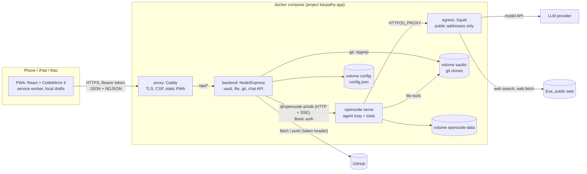
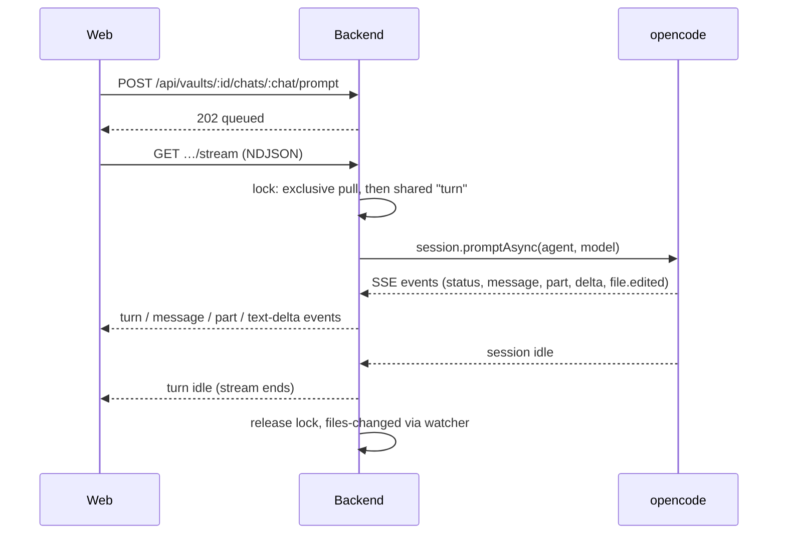
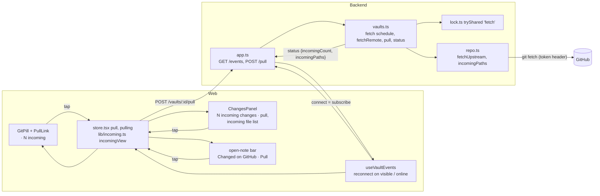
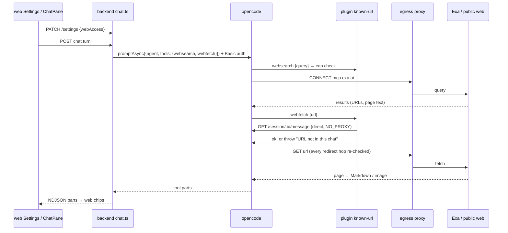
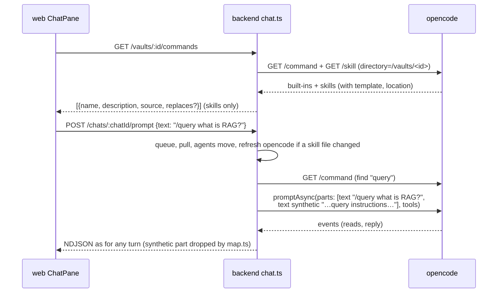
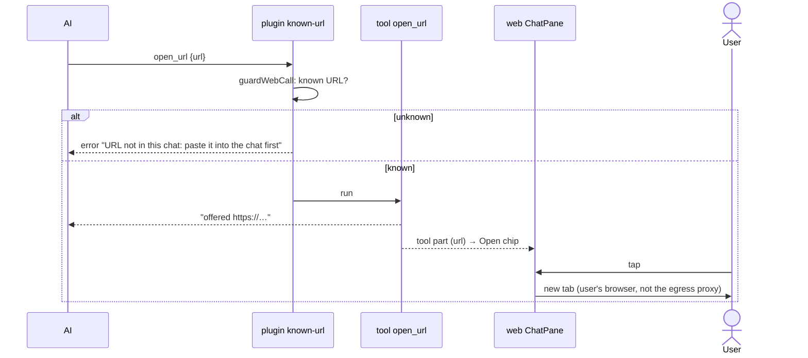
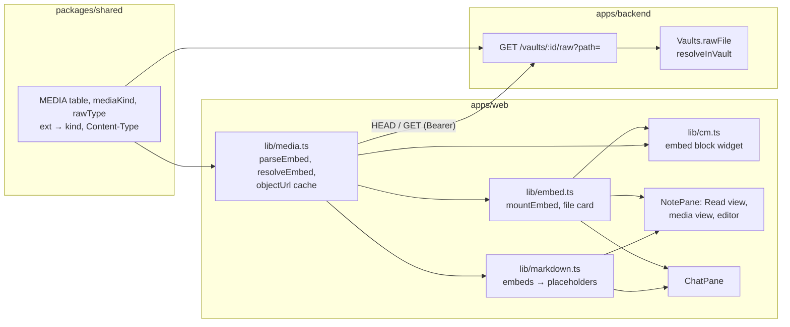
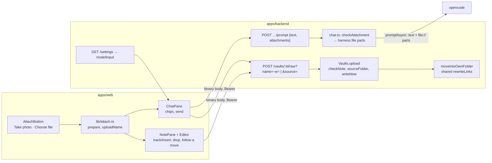
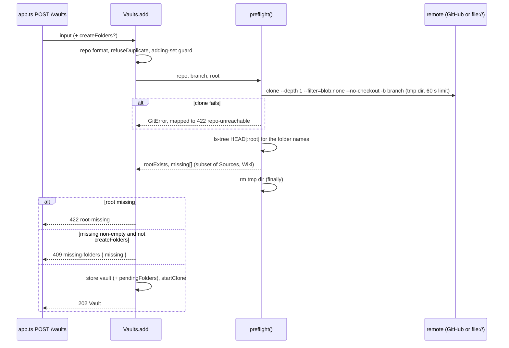
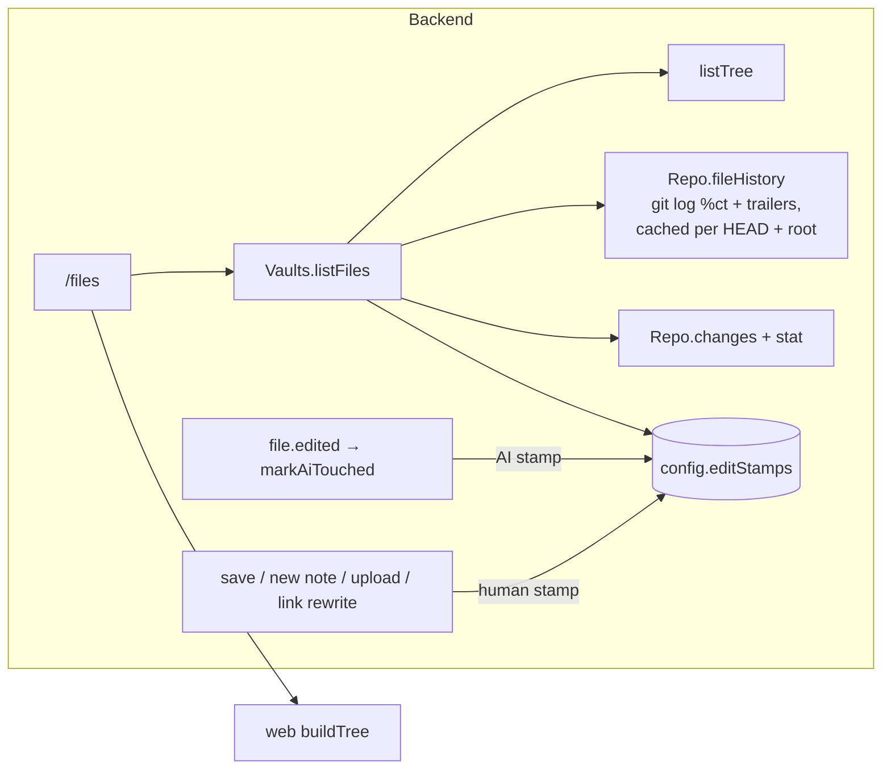

# Architecture: karpathy.app

As built on 2026-10-02. This page describes what exists; the reasons behind it are in
[Design decisions](#design-decisions) and the [ADRs](../../docs/adr/).

## Overview

A thin backend in front of git and an agent harness, a PWA in front of the backend, all in one docker compose
stack. Only the reverse proxy publishes ports.



## Technology stack

| Layer | Technology |
|---|---|
| Web | React 19, Vite 8, TypeScript, CodeMirror 6 (`lang-markdown`, own live-preview decorations), `marked` 18 + DOMPurify, vite-plugin-pwa (Workbox), framework7-icons. No router library (hash routes), no state library (one context hook). |
| Backend | Node 22, Express, TypeScript run with `tsx` (no build step), zod validation, chokidar, `@opencode-ai/sdk` v2, `git` and `ripgrep` binaries. |
| Agent harness | `opencode serve` 1.18.25 (pinned image `ghcr.io/anomalyco/opencode`), provider-agnostic; default model `anthropic/claude-sonnet-5`, Ollama `qwen2.5:3b` in dev and tests. |
| Proxy | Caddy 2.10 built with a `caddy-dns/<provider>` module (GoDaddy) for DNS-01. |
| Shared | `packages/shared`: TypeScript types for the API (no runtime schemas). |
| Tests | Vitest (backend projects `default`, `github`, `llm`; web unit tests for `lib/`), Playwright e2e (desktop, iPad, iPhone in Chromium and WebKit), axe-core. |
| Website | Plain HTML + CSS in `site/`, no framework or dependencies; tests with `node:test`; GitHub Pages. |
| Tooling | npm workspaces (`apps/*`, `packages/*`, `site`), ESLint flat config, `just`, GitHub Actions CI. |

## Components

### Web app (`apps/web`)

- **Shell** with three panes (sidebar, note, chat) laid out per breakpoint: phone ≤ 699 px (tab bar, push navigation),
  tablet 700–1023 px (overlays), wide ≥ 1024 px (columns). On the wide layout the **swap button** (`#main-swap`,
  rendered by `Shell` while the chat is open) toggles the main pane: class `chatmain` on `#app` swaps the two columns
  with CSS `order`/`flex` only, so no DOM node moves (a running stream, typed text, focus, scroll and undo history
  survive). The button is one absolutely positioned 44 px element on the divider (`right: 380px + inset`, the side
  column is always 380 px); the bar ends next to it get 32 px padding. The choice lives in the store (`chatMain`,
  localStorage `karpathy.chatMain`).
- **Chat opens notes** (`lib/chat.ts`, `ChatPane` `useChat`): a pure open tracker per chat view (`seen`, `later`,
  `loaded`). The first history load only marks completed `open_note` calls as seen; later loads (reattach,
  visibility change) and live events open unseen completed calls. Outside the wide layout the last open of the turn
  waits for `idle`. `show(path)` checks `isEditing()` (editor focused or unsaved text) at that moment: open the note,
  or toast "AI opened …". A completed open renders as an "opened" chip that reopens the note.
- **Store** (`store.tsx`): one `useAppState` hook in a React context holds the token, vaults, status, open note, save
  pipeline (autosave 1.5 s, drafts, retries), the vault event stream and routing (`#/<vault>/<path>`).
- **Editor** (`Editor.tsx`, `lib/cm.ts`): CodeMirror 6 with decorations only, so the Markdown text, frontmatter and
  `[[wikilinks]]` round-trip losslessly; CRLF kept; external reloads applied as one minimal change. Embeds come from a
  `StateField` (block decorations must come from state): per line with an embed, a block widget after the line end
  (`side: 1`) that calls `mountEmbed`; not in fenced code or frontmatter; recomputed on `docChanged` and on
  `refreshLinks`. `EditorHandle` has `topLine()` and `gotoLine(line, { focus: false, align: 'start' })` for mode
  switches (no keyboard on a phone), `track(at?)` (a position mapped through later changes, whose `insert(embed)`
  puts `![[name]]` on its own line as one isolated undo step and returns false once the editor is gone) and
  `setDoc(text)` (the reload's minimal change, applied at once). A `domEventHandlers` drop handler takes file drops
  (`posAtCoords`, outline class `cm-drop-target`) and leaves text drags to CodeMirror. See [Uploads](#uploads).
- **Commands** (`lib/commands.ts`, `ChatPane`, `Dialogs.tsx` `MoveNotice`): the command palette, command chips and the
  agents-move notice; see [Commands](#commands) and [The agents move](#the-agents-move).
- **Media** (`lib/media.ts`, `lib/embed.ts`, shared `MEDIA` table): see [Media embeds](#media-embeds).
- **File tree sort and filter** (`lib/tree.ts`, `FileTree.tsx`, `TreeMenu.tsx`): see [File dates](#file-dates).
  `buildTree(entries, sort, filter)` sorts and filters client-side (no request on a switch, works on the cached
  listing). The choice is `sortFilter` in the store (localStorage `karpathy.treeSort` / `karpathy.treeFilter`).
  `TreeMenu` is the header's icon button with a menu of `menuitemradio` groups.
- **Mode preference** (`store.tsx`): `mode` is read from and written to localStorage `karpathy.mode`; `openNote` never
  changes it. An in-memory `places` map (`vault\0path` → scroll top, top line, mode) is filled when a note is left
  and restored on Back/Forward; `lib/place.ts` maps between source lines and Read-mode blocks.
- **Renderer** (`lib/markdown.ts`): `marked` with extensions (wikilinks and embeds, highlights, footnotes; callouts and
  task markers via renderer overrides; `%%comments%%` stripped outside code) + DOMPurify for Read mode and chat text. A
  per-call `afterSanitizeAttributes` hook sets link targets: wikilinks and resolved relative links get app routes,
  external links `target="_blank" rel="noopener noreferrer"`. `renderMarkdown(md, ctx)` takes `{ exists,
  resolveEmbed }`; `![[…]]` (an inline extension before `wikilink`) and `` (the `image` renderer) emit a
  `<span class="embed" data-path data-kind data-width data-alt>` placeholder, never an ``. Each top-level
  block carries `data-line` (its source line, frontmatter included) on its own tag, no wrapper elements; Read mode
  uses it for hit positions and mode switches.
- **API client** (`lib/api.ts`, `lib/ndjson.ts`): fetch wrapper with Bearer token, typed `ApiError`, NDJSON reader.
- **Admin modal** (`Admin.tsx`): renders one of two dialogs from the store's
  `adminOpen: false | { view: 'vaults'; vault?: string } | { view: 'settings' }`, set by
  `setAdminOpen(false | 'vaults' | 'settings', vault?)`. `Shell` mounts it while `adminOpen` is set; closing unmounts it.
  - `VaultsDialog` (`testid="admin"`, title "Vaults"): local view state `list | details | add` (no router), "All
    vaults" back button on details and add, `reloadVaults()` on mount. The list opens details on a row click; "Edit
    vault" in `NotePane` / `ChangesPanel` opens that vault's details directly (`setAdminOpen('vaults', vaultId)`);
    the vault switcher's **Manage vaults…** opens the list. A nested help `Modal` ("What is a vault?", static, no
    backend) and a nested confirm `Modal` for missing folders.
  - `SettingsDialog` (`testid="settings-dialog"`, title "Settings"): the GitHub token form, `SettingsForm` and the
    versions; no back button. Opened by the sidebar gear (`open-settings`).
- **Service worker**: precaches the app shell; `vault-api` NetworkFirst cache (5 s timeout) for the vault list, file
  tree and opened notes; auto-update with a re-check whenever the app becomes visible.

### Website (`site/`)

Not part of the app or its stack: the public product page at https://karpathy.app, deployed to GitHub Pages
on its own ([deployment.md › Website](deployment.md#website)).

- `index.html` (start page: hero with logo, features, how it works, "Code, not a service" with what self-hosting
  takes, a hosting contact) and `style.css` (the app's `:root` token blocks, copied, plus the page's layout).
- `build.sh` assembles `_site/` from the page files and `assets/icons/`; all paths are relative, so the page also
  works under `tillg.github.io/karpathy.app/`.
- `site.test.mjs` runs the build and checks the output, including token equality with `apps/web/src/styles.css`.

### Backend (`apps/backend`)

| Module | Responsibility |
|---|---|
| `main.ts` | Reads env and `*_FILE` secrets, wires the services, graceful shutdown. |
| `app.ts` | Express routes under `/api`, error mapping, NDJSON writer (15 s keepalive). `/healthz` outside auth; `/api/health` also reports the release version (`APP_VERSION`, `dev` for local builds), which the settings dialog shows next to the PWA's own. |
| `auth.ts` | Bearer token check (hashed, constant-time compare). |
| `vaults.ts` | Vault lifecycle (add with preflight, clone, patch, remove), file API, search, status, events, commit/push/discard, conflict resolution; per-vault runtime state; per-vault token access check (`checkAccess`). Reads the GitHub token through a getter per git operation. Runs the agents move after clone, pull and open (`agentsMove`), keeps the last result (`lastAgentsMove`) and counts running commit-message proposals (`proposing`, `isProposing`). |
| `agents-standard.ts` | The agents move: `scanLegacy`, `migrateToAgents`, `restageSkillLink` ([The agents move](#the-agents-move)); also `readFrontmatter`. |
| `preflight.ts` | `preflight()`: the attach check ([Attach preflight](#attach-preflight)); `REQUIRED_FOLDERS`. |
| `github-token.ts` | `GitHubToken`: the server-wide token (stored over secret), its source, `GET /user` identity check, redaction of every value seen. |
| `repo.ts`, `git.ts` | All git commands for one clone: changes, diff, pull procedure, commit, push, conflict sides and resolution; hardened `runGit`. `Repo.stageSymlink` / `stagedAsSymlink` stage a path as a symlink (mode 120000) without committing. |
| `files.ts`, `paths.ts` | Tree listing, versions (content hash), ripgrep search (also `filesMentioning` for the move's link scan), the note graph (`graph`: notes + links via the shared `noteLinks`, for `GET /vaults/:id/graph`); path normalization and symlink-safe resolution. `Vaults.rawFile` resolves a raw-file path with the same rules; `Vaults.upload` writes uploads ([Uploads](#uploads)). |
| `lock.ts` | Per-vault reader/writer lock with writer preference (shared: `save`, `turn`, and `fetch` and `refresh` through `tryShared`, which never queues; exclusive: every other git operation). `fetch` and `refresh` are quiet: they don't change `busy`. `holds(label)` tells whether a shared holder with that label exists. |
| `watcher.ts` | chokidar on the vault root, 300 ms debounce → `files-changed` + status events. |
| `chat.ts` | Chats and turns: per-vault queue (one running turn), pull before each turn, stream fan-out, abort, adoption of busy sessions after a restart. Also the command list (`commands()`, name-clash rule, skill stamp and refresh) and command turns (`instructionsFor`) ([Commands](#commands)). |
| `harness/opencode.ts`, `harness/map.ts` | The only code that knows opencode: an ACP-shaped `Harness` interface (`commands(dir)`, `refresh(dir)` next to prompt, models and events) and the mapping of opencode events to app events. Tool names live only here: `WRITE_TOOLS` set `ToolCall.writes`, `OPEN_TOOLS` (`open_note`) set `ToolCall.opens`; `ToolCall.url` is set for `webfetch`, `open_url` and `save_url` (also in `WRITE_TOOLS`, so a download is a changed file and gets an AI stamp). |
| `harness/command.ts` | Pure: `parseCommand`, `expandCommand`, `withoutBaseDir`, `commandInstructions`. |
| `commit-message.ts` | Proposes commit messages with a throwaway, tool-less session; marked as a running proposal so a skill refresh doesn't cut it off. |
| `config-store.ts` | Atomic, serialized writes to `/config/config.json`; also holds the GitHub token set in the app. |

### opencode (`deploy/opencode`)

The pinned stock image (`deploy/opencode/Dockerfile`) plus a **managed config** at `/etc/opencode/opencode.json` (merged last, so a vault can't override it):
agents `vault` (edits allowed except `.git` and harness config), `vault-readonly` (default; used during conflicts) and
`commit-message` (no tools); `bash`, `webfetch`, `websearch`, `save_url`, `task`, `question` and `external_directory` denied
(`save_url` is allowed for `vault` only; `websearch`, `webfetch` and `save_url` are switched on per turn by the backend, see [Web access](#web-access));
reading `*.env` denied; snapshots, sharing and auto-update off. The image sets `OPENCODE_ENABLE_EXA=true` and
`OPENCODE_WEBSEARCH_PROVIDER=exa`; its entrypoint exports the `opencode_password` secret as
`OPENCODE_SERVER_PASSWORD` (HTTP Basic on every route, health included). The image sets `OPENCODE_DISABLE_CLAUDE_CODE_SKILLS=1`:
opencode then reads a vault's skills from `.agents/skills/` only, and still loads `CLAUDE.md` and `AGENTS.md` (`AGENTS.md`
first). The image has no git binary, so opencode can't detect
a worktree and stays confined to the session directory (the vault root).

The global config dir (`/opt/opencode-config/opencode/`) holds everything the image adds: `tools/` (`open_note`, `open_url`, `save_url`),
`plugins/` (`known-url`), `lib/` (helpers) and `skills/` (the **app skills**, today `research`). The bake step waits for
the three tools in the tool ids and for the plugin before it makes the dir read-only.

**Custom tool `open_note`** (`deploy/opencode/tools/open_note.ts`, path check in `deploy/opencode/lib/resolve-note.ts`):
checks that `path` resolves inside `context.directory`, exists, is a file and has no dot segment, then returns
`opened <path>`; it reads no content and opens nothing itself — the web app reacts to the completed tool part. It is
loaded from a global config dir that comes only from the image (`XDG_CONFIG_HOME=/opt/opencode-config`), allowed
explicitly for `vault` and `vault-readonly`. opencode writes `package.json` etc. into every config dir and installs
`@opencode-ai/plugin` there on startup, so the Dockerfile pre-bakes the dir with one throwaway `opencode serve`
(each poll bounded by a 2 s `wget` timeout; on failure the build prints opencode's log), then makes it root-owned and
read-only; at runtime it loads offline. Helpers can't live in `tools/` (every export there becomes a tool).

```mermaid
sequenceDiagram
  participant O as opencode (open_note)
  participant H as backend harness/map.ts
  participant C as backend chat.ts
  participant S as web useChat (ChatPane)
  participant A as web store openNote
  O->>O: resolve path in the vault root; missing / outside → tool error
  O-->>H: tool part completed (input.path)
  H->>C: part {call: {path, opens: true, writes: false}}
  C-->>S: NDJSON part event
  S->>S: open tracker: unseen + completed?
  S->>A: wide: now · phone / tablet: on idle · editing: toast instead
```

**Custom tool `open_url`** (`deploy/opencode/tools/open_url.ts`, check in `deploy/opencode/lib/offer-url.ts`): args `{ url }`;
refuses anything but `http:`/`https:` ("Only http(s) pages can be opened"), then returns `offered <url>`. It fetches
nothing and needs no Web access (the server makes no request). Baked like `open_note`, allowed for `vault` and
`vault-readonly` (`commit-message` keeps `"*": "deny"`). The web app turns the completed call into an Open chip ([Link
offers](#link-offers)).

**Custom tool `save_url`** (`deploy/opencode/tools/save_url.ts`, logic in `deploy/opencode/lib/save-url.ts`): args `{ url, filePath }`.
Downloads one http(s) URL into the vault as a **new** media file or PDF (`SAVE_TYPES`: the media table without SVG, plus
`pdf`; a test keeps it in sync with `packages/shared`) and returns `saved <path> (<size>). Embed it in a note with
![[<path>]]`; the AI then edits the note itself. It never overwrites (`wx`: "already exists: …; choose another name"),
creates missing folders, and refuses a path outside the vault (symlinks resolved), a dot-segment, a non-http(s) URL, an HTTP
error, a Content-Type that doesn't fit the extension (an HTML page saved as `.png`; `application/octet-stream` passes) and
a file over 50 MB (the upload cap; the partial file is removed). Timeout 120 s. The download always goes through the egress
proxy, passed explicitly as Bun's `fetch` `proxy` option from `HTTP(S)_PROXY`; without a proxy env the tool refuses. Bun
still fetches `NO_PROXY` hosts directly, so redirects are followed by hand (at most 5) and every hop to a `NO_PROXY` host is
refused ("internal host refused") ("No egress proxy configured"). Baked like `open_note`; allowed for `vault` only, not `vault-readonly`.

**Plugin `known-url`** (`deploy/opencode/plugins/known-url.ts`, pure decision in `deploy/opencode/lib/known-url.ts`,
baked into the same global config dir): a `tool.execute.before` hook for `webfetch`, `websearch`, `open_url` and `save_url`
(`GUARDED_TOOLS`). It loads the session's messages through opencode's plugin client (failing closed without them) and
throws what `guardWebCall(tool, args, messages, caps)` returns, or lets the call run on `null`. `guardWebCall`: for `webfetch`,
`open_url` and `save_url` it collects user text and completed tool outputs and refuses "URL not in this chat: paste it into the
chat first" unless the URL is known (`extractUrls`, `isKnownUrl`); for `webfetch`, `save_url` and `websearch` it counts the calls
after the last user message and refuses once the per-turn cap is reached (`capFromEnv`: `WEB_FETCH_CAP` /
`WEB_SEARCH_CAP`, default 20; `webfetch` and `save_url` calls together count against the fetch cap). `save_url` is also in the
plugin's `WRITE_TOOLS`: a file it saved and the AI reads back is not a known source. `open_url` has no cap: the user taps each chip. Stateless, so it survives an opencode
restart.

### Egress proxy (`deploy/egress`)

Squid 6 in an own Alpine image (base pinned by digest; the fourth release image), on networks `internal` and
`egress`. `squid.conf` has one `dst` ACL of internal ranges (loopback, RFC 1918, link-local, CGNAT/tailnet, ULA,
multicast, …) that is denied, then allows everything else; Squid checks after DNS resolution on every request, so
each redirect hop is re-checked. opencode gets `HTTP_PROXY`/`HTTPS_PROXY=http://egress:3128` and
`NO_PROXY=localhost,127.0.0.1,0.0.0.0` (its plugin client calls its own server directly; dev and tests add the
Ollama host). Gotcha: `::ffff:0:0/96` or `0.0.0.0/8` in the ACL make Squid read `0.0.0.0/0`, so they stay out.

### Proxy (`deploy/proxy`)

Serves the built PWA from `/srv` with SPA fallback, proxies `/api/*` to the backend unbuffered (`flush_interval -1`),
sets CSP and security headers (`img-src` and `media-src` allow `blob:` for media embeds; `frame-src` and
`object-src` stay closed), and gets its certificate by DNS-01 (`TLS_MODE=dns`; GoDaddy, with a 90 s wait for
GoDaddy's nameservers) or from Caddy's internal CA (`TLS_MODE=internal`: prodtest and the `local` target). A
plain-HTTP site on `127.0.0.1:8081` answers the container healthcheck.

## Communication



- **Request/response** JSON over `fetch`; **streams** as NDJSON over `fetch` (no WebSockets, no SSE to the browser):
  the vault event stream (`status`, `files-changed`; never ends) and the chat stream (ends when the turn is idle).
- Turns outlive connections: a client reattaches to a running turn from any device.

## Incoming changes and the user's pull



- **`VaultStatus`** gains `incomingCount` (files inside the root that `origin/<branch>` changed since the merge base
  with HEAD) and `incomingPaths` (the first `INCOMING_PATHS_MAX` = 200); `0`/`[]` while not `ready`. `status()` adds
  `repo.incomingPaths()` (`git diff --name-only -z HEAD...origin/<branch> -- <root>`, local refs only; without a
  merge base, after a replaced remote, the plain `HEAD` ↔ `origin/<branch>` diff) to its `Promise.all`. They go out on
  the existing `status` event and in the replies of `GET /status`, `POST /open` and `POST /pull`.
- **Background fetch** (`Vaults.fetchRemote`): `subscribe()` (the event-stream route is the only subscriber; unknown
  vault ids are refused) starts a per-vault `setInterval` (`fetchIntervalMs`, default 2 min) and one fetch per
  connect; the last unsubscribe, `close()` and `remove()` clear it. A running fetch is joined, not repeated. It takes
  `lock.tryShared('fetch')` (skipped when a git operation holds or waits), runs `repo.fetchUpstream()` (`git fetch -q
  --no-auto-maintenance --end-of-options origin <branch>`, 30 s timeout, the token as for every git command), sets or
  clears `pullError` (redacted), and emits a status only when `origin/<branch>` or `pullError` changed. It never
  rejects (a rejected promise from a timer would end the process). It runs in conflict too; the UI hides the count.
- **Git robustness:** on a timeout `runGit` sends SIGTERM and SIGKILL only after 2 s; `fetchUpstream` and the pull
  drop a stale `refs/remotes/origin/<branch>.lock` before fetching. A repo change clears `pullError` (`startClone`).
- **`POST /vaults/:id/pull`** → `Vaults.pull`: exclusive lock, `423` in conflict, then the same `pullUnlocked` as
  open, commit, push and turn; a conflict it causes shows in the returned `VaultStatus`, not as an HTTP error.
  `open()` first awaits a running background fetch, so its `tryExclusive` doesn't skip.
- **Web:** `lib/incoming.ts` `incomingView(status, pulling)` decides every incoming control (`show`, `disabled` while
  pulling or `busy !== 'none'`, label, title, `moreCount`), so the pill segment, the Changes banner, the open-note bar
  and the phone tab badge can't drift apart. The pill segment is a sibling button (`incoming-badge`) joined to the pill
  visually, so the pill's own click still opens Changes; pill and banners use `PullLink`. The store's `pull()` first
  saves the open note's pending draft (`leave()`), pulls once for a double tap, sets the status and toasts "Pulled N
  changes from GitHub" or "Couldn't reach GitHub". No new client timer: the event stream's reconnect on visibility and
  online already triggers a fetch.

## Web access



- **Setting:** `Settings.webAccess` (default `true`; an old `config.json` reads as `true` through the defaults merge).
- **Per turn:** `chat.ts` sends `tools: { websearch: webAccess, webfetch: webAccess, save_url: webAccess && !readonly }` with every prompt of both chat
  agents, `false` included: opencode stores the map as the session's permission, replacing earlier rules and merged
  after the agent's. Any later per-turn rule must go into the same map.
- **Mapping:** `harness/map.ts` sets `ToolCall.query` (websearch `input.query`) and `ToolCall.url` (webfetch
  `input.url`); `writes`/`opens` stay false, no `path`. `save_url` is the exception: `writes` is true and `input.filePath` feeds
  `writtenPaths`, so a download shows in Changes and gets an AI stamp.
- **Chips:** `toolLabel(call)` (`lib/chat.ts`) → `searched the web: "<query>"` and `fetched <host><path>` (path cut at
  60 characters, full URL as tooltip). A completed fetch chip with an `http(s)` URL is a link (new tab, `noopener
  noreferrer`); a search chip is a label; a refused fetch shows the guard's message.

## Commands

A **command** is a skill the chat starts by name (`/name args`). The backend asks opencode for the vault's skills,
the web app offers them in a palette and as chips, and a command turn is an ordinary prompt with the skill's text added
as a hidden part.



- **Route `GET /vaults/:id/commands`** → `ChatService.commands`: same checks as the chat routes (`409 not-ready`,
  `409 unsafe-config`, `503` when opencode is down). Returns `Command[]` (`@karpathy/shared`: `name`, `description`,
  `source: 'vault' | 'app'`, `replaces?: true`), vault skills first, each group A–Z; the template stays on the server.
- **`Harness.commands(dir)`** (`OpencodeHarness`): `command.list` plus `app.skills` for the same directory; keeps entries
  with `source === 'skill'` that aren't in `HIDDEN_COMMANDS` (`customize-opencode`; the built-ins `init` and `review` aren't
  skills). A skill is an **app skill** when its `location` lies under `/opt/opencode-config/`, else a **vault skill**.
- **Name clash.** opencode's pick between a vault skill and an image skill of the same name isn't stable, so
  `ChatService.vaultCommands` decides: the app skills' names come from the list for `/vaults` itself (which never holds vault
  skills), and for such a name the vault skill is read from `.agents/skills/<folder>/SKILL.md` (frontmatter `name`,
  `description`, body plus a base-directory line) and listed with `replaces: true`; command turns use that text too. The AI's
  own `skill` tool may still load either.
- **Skill refresh.** opencode caches a directory's skill list until the instance is disposed, so a skill that arrived with
  a pull would never show. `Harness.refresh(dir)` calls `instance.dispose` and returns once the directory's event
  subscriptions have reconnected (at most 5 s; the subscription treats the disposal as no outage). The **skill stamp** per
  vault is the sorted `path:mtime:size` of every `SKILL.md` under `.agents/skills/` in the vault root and each folder up to
  the clone root (in memory; the first check after a start counts as changed). When it differs from the last one seen,
  the backend refreshes, but never while a turn runs, because disposing ends the directory's sessions:
  - in `kick()`, inside the exclusive-lock section right after the pull and the agents move, unless a commit-message
    proposal runs for the vault (`Vaults.isProposing`; proposals take no lock);
  - in `GET /commands`, only while the vault is idle (`busy === 'none'`, no running or adopted turn, no proposal), holding the
    lock shared under the label `refresh` (`tryShared`, quiet) so no turn can start meanwhile. A pull or commit that is
    running is waited for first (at most 10 s, without queueing for the lock). Otherwise the cached list is returned.
  - `Vaults.open` waits up to 5 s for a `refresh` holder before its `tryExclusive` pull, so the pull of the same app load
    doesn't skip.
- **Command turns.** `harness/command.ts`: `parseCommand(text)` needs `/` and a name `[A-Za-z0-9][\w.:-]*` at the start, then
  whitespace or the end. `expandCommand(template, args)` follows opencode's rules (`$1…$N`, the highest taking the rest;
  `$ARGUMENTS`), but appends nothing when there is no placeholder, because the user's message already carries the arguments;
  `` !`…` `` and `@file` stay literal. `commandInstructions` prefixes a short header ("The user started the command
  `/<name>`…; paths to notes are relative to the vault root") and, for an app skill, `withoutBaseDir` drops the base-directory
  line, since that directory lies outside the vault. `PromptInput.instructions` becomes a second text part with
  `synthetic: true` (it reaches the model; `map.ts` drops synthetic parts from what the app shows, so the bubble is what the
  user typed). In `kick()`, only a name in the vault's list makes a command turn; anything else, `/etc/hosts is…`
  included, is a plain turn. A failing `commands()` fails the turn like a failing prompt. The queue still stores only
  `{ chatId, text }`, so a queued command survives a restart.
- **Never opencode's command endpoint** (`POST /session/:id/command`): it replaces `` !`cmd` `` in a skill with the output of
  `cmd`, run through a shell with no permission check, resolves `@file` references, and takes no per-turn `tools` map
  ([security.md](security.md#confining-the-ai), [ADR 0004](../../docs/adr/0004-commands-as-prompts-not-command-endpoint.md)).
- **Web: `lib/commands.ts`** (pure): `paletteQuery(text)` (the partial name while the text is `/` plus name characters, else
  `null`), `filterCommands` (case-insensitive; vault skills before app skills, prefix matches before other matches, each
  A–Z), `chipCommands(list, recent, 4)` (recent names still in the list first, then A–Z), `recentCommands` /
  `recordCommand` (localStorage `karpathy.recentCommands.<vaultId>`, at most 10 names, every access in `try/catch`).
  `ChatPane` › `Conversation` loads the list on mount, when the app reports an agents move (`commandsNonce`) and each time
  the palette opens; the list is optional: if the GET fails, palette and chips don't render and sending never waits for it.
  - **Palette:** a `listbox` above the composer while `paletteQuery(text) !== null`, grouped "This vault" and "karpathy.app",
    each row `/name`, a `vault`/`app` tag and the description; a `replaces` row adds "Replaces karpathy.app's /name; rename
    it in .agents/skills/ to get both." The textarea keeps focus (`aria-activedescendant`); ↑/↓, Enter or Tab pick, Escape
    closes, a row is picked on pointer-down. Picking sets the text to `/name ` and sends nothing.
  - **Chips:** up to four `/name` buttons in an empty chat (no messages, nothing pending); tooltip = description plus "from
    this vault" / "built into karpathy.app"; an app skill's chip has the app icon. A tap puts `/name ` in front of the
    composer's text and focuses it. `recordCommand` runs on every send that starts with a listed command.

### The `research` skill

`deploy/opencode/skills/research/SKILL.md`, copied to `/opt/opencode-config/opencode/skills/` by the `Dockerfile`: an app
skill listed in every vault unless the vault has a `research` skill of its own. It is self-contained (its base directory is
outside the vault, where `external_directory: deny` blocks reads) and the backend treats it like any command: no special
tools map, no special rule. What it tells the AI:

| Part | Instructions |
|---|---|
| Conventions | The vault's own instructions (`AGENTS.md`, `CLAUDE.md`, an ingest skill) decide folder, name and frontmatter of sources and pages; a source file is always a summary with short quotes. |
| Plan turn | Read the wiki index and topic pages; with web tools, scout at most 3 searches and 2 fetches and save nothing; without them, say Web access must be turned on. Write `Research/<YYYY-MM-DD>-<slug>.md` (topic, 3–6 sub-questions as `- [ ]`, what the wiki covers, budget of 8 sources per run turn) and end with "Edit the note if you like, then reply **go**." In conflict, put the plan in the reply. |
| Run turn | Re-read the plan note; per open sub-question at most 2 searches; skip URLs already in `Sources/`; fetch, save `Sources/<date>-<slug>.md` (`type: source`, `url`, `title`, `fetched`); at most 8 new sources; write or update cited wiki pages (`sources:` and `[[Sources/…]]`), update index and log, tick off the note. |
| Stop and ask | At a "limit reached" error or after 8 sources: list the open questions and ask for "continue". |
| Resume | `/research <plan note or matching topic>` skips the plan and runs on the note's open questions, in any chat. |

The plan step, the scouting budget and the stop are instructions to the model. The hard bounds are the per-turn web caps
and the user's reply before each block; no money or token cap exists.

## Link offers



- **Mapping:** `map.ts` sets `ToolCall.url` for `open_url` as for `webfetch`; `opens` stays `false`, because `opens` drives the
  automatic note opening and a link offer never opens by itself (browsers block `window.open` without a tap, and the tap is the
  user's check of the host on the chip).
- **Web:** `toolLabel` → `open <host><path…>`; `toolHref` returns the URL of a completed `open_url` too. `ToolChip` renders it as
  an `<a target="_blank" rel="noopener noreferrer">` action chip (arrow icon, full URL as tooltip). A refused one is the usual error
  chip; tapping it shows "URL not in this chat: …".

## The agents move

The app moves a vault to the `.agents` standard (`AGENTS.md`, `.agents/skills/`) by itself; see
[domain.md](domain.md#agents-move) for the rules and the user-facing result.

- **When:** after every successful clone or pull (the pull before each turn included) and on `POST /vaults/:id/open`
  (`Vaults.agentsMove`), under the exclusive lock the caller holds, so no turn runs. Skipped in conflict (it would only add to
  it); it runs on the next pull or open after the conflict is resolved. It never throws into the caller (failures are logged).
- **`scanLegacy(vaultRoot)`:** names in `.claude/skills/*/` (directories only; a plain file `.claude/skills` is the link stub and
  means "already moved"), `.claude/commands/*.md`, and whether `CLAUDE.md` is anything but `@AGENTS.md` (or `AGENTS.md` exists
  without a `CLAUDE.md`). Vault root only. The scan left after a move is remembered per vault (`legacySeen`), so clashes that
  haven't changed don't repeat the move or the notice on every pull.
- **`migrateToAgents(repo)`** never overwrites and commits nothing:
  - `CLAUDE.md` → `AGENTS.md`, unless `AGENTS.md` exists or `CLAUDE.md` mixes `@AGENTS.md` with other lines (clash: both stay,
    `AGENTS.md` goes into `skipped`). Each line that is only `@<path>` is replaced by that file's content, one level deep,
    relative to the vault root, only for an existing file inside it that is not gitignored (`AGENTS.md` gets committed; a
    path outside, a missing or an ignored file stays as text). Then `CLAUDE.md` becomes `@AGENTS.md`. The pasted files stay
    and are returned as `inlined`. `AGENTS.md` without `CLAUDE.md` gets `CLAUDE.md` = `@AGENTS.md`;
  - each `.claude/skills/<n>/` → `.agents/skills/<n>/` (whole folder), unless that exists (`skipped`);
  - each `.claude/commands/<n>.md` → `.agents/skills/<n>/SKILL.md` with `name` and `description` (its own, else its first line,
    at most 200 characters), other frontmatter dropped, body unchanged; `.claude/commands/` is removed only when empty;
  - when anything went into `.agents/skills/` and `.claude/skills` has no content left, the **skill link** replaces it. The
    clones run with `core.symlinks=false`, so the backend writes the stub file `.claude/skills` (content `../.agents/skills`,
    **no trailing newline**) and stages it as a link with `Repo.stageSymlink`: `git rm -r --cached`, then `git update-index
    --add --cacheinfo 120000,<blob>,.claude/skills`. The commit's `git add -A` keeps the index mode for the stub, so the
    commit carries a real symlink. Staging it is the only index write outside a commit. A pull resets the index and stashes the
    work tree, so `restageSkillLink` stages the link again whenever the stub is there but the index lost it;
  - returns `AgentsMove { moved, converted, instructions, inlined, skipped }` (`@karpathy/shared`).
- **Event:** a non-empty result is emitted as the vault event `{ type: 'agents-move', at, …AgentsMove }` on
  `GET /vaults/:id/events` and kept as the vault's last move (in memory), which a client that connects later receives before
  the live events. `at` identifies the move.
- **Web:** the store shows each move once (`karpathy.shownMoves` in localStorage, keyed `<vault>:<at>`, last 50), sets
  `agentsMove`, bumps `commandsNonce` and refreshes files and changes. `MoveNotice` (`Dialogs.tsx`, inside `#app`) shows
  "Moved to the .agents standard": skills now in `.agents/skills/`, rules now in `AGENTS.md`, "not moved, name exists: …", each
  pasted file with a **Delete** link (`DELETE /file`), and **Review** (the Changes view). It stays until dismissed or the
  vault changes.
- **Effects:** the move changes `SKILL.md` stamps, so the next command list refreshes opencode. The file writes reach the
  editor through the watcher's `files-changed` events like any change on disk. A moved skill folder shows as one delete plus
  one add per file in the uncommitted changes.

## Media embeds



Four surfaces show media: Read mode, Write mode, chat replies and the media view (a file opened on its own). All of
them end in one plain-DOM function, `mountEmbed(el, resolved, ctx)`, which creates elements with `createElement` and
an object URL as `src` (no HTML strings). While bytes load, a skeleton holds the space, using the natural size the
cache remembered from an earlier load when there is one, so Back lands without layout jumps.

- **Raw route:** `GET /vaults/:id/raw?path=` behind the bearer auth. `Vaults.rawFile` applies the note path rules (no
  `..`, no `.git`, no hidden files, no symlinks); `res.sendFile` streams and answers `HEAD` and `Range`. Headers:
  `Content-Type` from `rawType` (media table; `application/pdf`; else `application/octet-stream`),
  `Content-Disposition: attachment` for everything that isn't a media kind, `nosniff`, `Cache-Control: no-store`. No
  ETag: hashing a large video per request is the waste avoided. `GET /file` is unchanged and still gives the version
  that Delete needs when a media file is opened from the tree.
- **Resolution** (`resolveEmbed(embed, notePath, paths)`): the wiki form goes through `resolveWikilink` (exact path,
  path suffix, basename; ties: the note's folder, then the shortest path, then A–Z); the Markdown form is URL-decoded
  and joined with the note's folder; `http(s):`, `//`, `data:` → `remote` (a plain link). Results: `media`, `file`,
  `note` (rendered as a wikilink), `missing`, `remote`.
- **Object-URL cache** (`objectUrl`, `invalidate`): key `vault\0path`, the pending promise is shared. A `HEAD` asks the
  size first; over 50 MB it resolves `tooLarge` without transferring bytes (not cached), unless `force` (Load anyway).
  SVGs are sanitized with DOMPurify's SVG profile before they become a blob. Budget 200 MB, least recently used entries
  revoked; entries in use are held (`release()`) and never evicted. `files-changed` invalidates the changed paths;
  switching vault or logging out invalidates the vault.
- **PDF Open:** `window.open('', '_blank')` synchronously in the click (Safari blocks it after an `await`), then the
  tab's location becomes a blob re-typed `application/pdf`, so only the browser's PDF viewer can show it.
- **Tap on an image** calls `onOpen(path)` → `store.openNote`, which pushes a history entry.

## Uploads



- **Route:** `POST /vaults/:id/raw?name=<file>` plus exactly one of `note=<page>` (editor) or `source=new&at=<local
  YYYY-MM-DD-HHMMSS>` / `source=<upload-… folder>` (chat). The body is the file's bytes: `express.raw({ type: () =>
  true, limit: MAX_UPLOAD_BYTES })` on this route only, so the JSON API is unchanged; `entity.too.large` → `413
  too-large`. Response `UploadResult { path, version, size, moved?, rewritten? }`, `201`. Under the shared `save` lock;
  `423` in conflict.
- **Name** (`checkUploadName`): no folder, no leading dot, no `#^[]|`, the new-file-name rules, then uploadable (`415
  not-uploadable`, extension only). **Note** (`checkNote`): an existing `.md`, no hidden segment, the new-file-name
  rules. **Free name** (`writeNew`): taken if any vault file has that base name (case-insensitive), then `-2` … `-100`;
  written with `flag: 'wx'`, so two uploads at once never overwrite each other. **Source folder** (`sourceFolder`):
  `Sources` matched case-insensitively; `new` claims `upload-<at>[-n]` with a non-recursive `mkdir`; a given name must
  exist directly in it and start with `upload-`.
- **Own folder** (`attachmentFolder`, pure): `dir/stem.md` is in its own folder when `base(dir)` equals `stem`
  (case-insensitive) or `stem` is `index`; otherwise it moves to `dir/stem/`.
- **Move** (`moveIntoOwnFolder`), all checks before the first write: `409 ai-busy` while a turn holds the lock;
  `409 folder-taken` when `dir/stem` is a file or `stem.md` exists in the folder; an existing folder in other case is
  used with its spelling. One ripgrep call (`filesMentioning`: the stem, with `%20`, and `encodeURI`'d) finds candidate
  pages; `rewriteLinks` (`packages/shared/src/relink.ts`, using the shared resolver moved from the web app) rewrites
  path-form wikilinks and Markdown links that resolve to the page, and relative links inside the moved page, skipping
  code blocks and spans; a percent-encoded link keeps its encoding. Then every touched page and the page itself are
  version-checked (`409 stale`), the attachment is written into the folder, the pages are rewritten, the page is
  renamed, its own text written, and its AI-touched mark renamed. `Vaults.afterRelinkScan` is a test seam between
  the scan and the checks.
- **Web, editor:** `NotePane.attach` filters non-uploadable files (one toast), `editor.track(at)` holds the cursor or
  drop point, and `store.uploadToNote` runs the files one after another: flush, pause autosave for that note,
  `prepare` (JPEG/HEIC: `createImageBitmap` with EXIF orientation → canvas ≤ 2048 px → JPEG 0.85, then APP1/APP13
  segments stripped, because WebKit's encoder writes an Exif block; else unchanged; HEIC that can't decode → error),
  50 MB refusal and 10 MB `confirm`, `api.upload` (a `Blob` body is sent as `application/octet-stream`), the path added
  to the file list at once, then the embed. A `moved` response runs `retarget`: the note's path, version and draft key
  follow, the route is replaced (no history entry), and the text becomes the server's (unedited) or the local draft
  through the same `rewriteLinks` (edited), pushed into the editor with `setDoc` before the embed goes in. The editor
  stays mounted (keyed by `openedAs`). If the editor is gone when an upload finishes, the embed is appended to the
  note's draft and saved.
- **Web, chat:** `ChatPane` keeps `{ chips: { path, version, mime, size }[], folder }` per chat in localStorage
  `karpathy.chips:<vault>:<chat>` (`lib/chips.ts`); chips whose file isn't in the first loaded file list are dropped.
  The first upload sends `source=new&at=`, later ones `source=<folder>`; ✕ is `DELETE /file` with the upload's version
  (the server removes the emptied folder). Send posts `{ text, attachments: paths }`. Chips and sent files render
  through `FileEmbed` → `mountEmbed` (an image through `/raw` and the object-URL cache, a PDF as a file card). The
  composer re-reads `GET /settings` when a chat opens.
- **Prompt:** `promptBody` = `{ text (≤ 100 000, may be empty with attachments), attachments? (≤ 5 paths) }`. The
  queued `Turn` keeps the paths (persisted in `config.json` `queued`, never bytes); an attachment-only prompt titles the
  chat with the first file name. At turn start `Vaults.checkAttachment` applies the raw-file rules, `isUploadable` and
  `MAX_ATTACHMENT_BYTES` (20 MB); a failure is a stream `error` and the turn ends before opencode. `PromptInput.files`
  become `FilePartInput { type: 'file', mime: uploadMime(path), filename: path, url: file:///vaults/<id>/<root>/<path> }`
  after the text part (left out when empty). opencode reads the bytes, stores them as a `data:` URL, normalizes images
  (≤ 2000 × 2000 px, 5 MB) and replaces what the model can't read with an "ERROR: Cannot read …" note.
- **History:** `mapPart` maps a `file` part with a `filename` to `ChatPart { type: 'file', path, mime }`; the `data:`
  URL never reaches the browser.
- **Model input:** `Harness.models()` returns `{ id, input: { image, pdf } }` from opencode's
  `capabilities.input`; `GET`/`PATCH /settings` add `modelInput` for the current model, `null` when opencode doesn't
  answer within 3 s or doesn't list it.

## Attach preflight

`POST /vaults` (`Vaults.add`) checks a repo before anything is stored:



- The preflight clone is blobless, depth 1 and without checkout (commits and trees only, small even for media-heavy
  vaults), made in a random `pre-*` dir under `<vaultsDir>/.preflight/` on the vaults volume, and always removed.
  `Vaults.init()` removes `.preflight/` at startup (leftovers of a crash). The clone is killed after 60 s. It also
  works against `file://` remotes (`GIT_REMOTE_BASE`) in tests and dev.
- **Folder check:** `git ls-tree HEAD[:<root>]`; only entries of type tree count, so a *file* named `Wiki` is missing.
  Names match case-insensitively; missing ones are created as `Sources/` / `Wiki/`. A root that isn't in the tree
  gives `rootExists: false`.
- **Concurrency guard:** an in-memory set of `repo|branch|root` keys whose add is in flight; a second add of the same key
  gets `409 duplicate`. It bounds parallel preflights per repo and closes the window between duplicate check and store.
- **Persisting:** only after the preflight passed. With `createFolders` and missing folders, the stored vault carries
  `pendingFolders`; when the clone has finished, `createFolders()` writes `<root>/<folder>/.gitkeep` (skipping a folder
  that exists after the clone, failing with "a file with that name exists" if a file blocks it) and then `cloned: true`
  is stored and `pendingFolders` removed. A restart mid-clone re-clones and still creates them. The writes are
  uncommitted changes (ADR 0001), outside the AI-touched set. Folders deleted between preflight and clone aren't
  re-checked.
- **Errors** (`HttpError` JSON `{error, code}`): `422 repo-unreachable` (message from `cloneErrorText`, redacted),
  `422 root-missing`, `409 missing-folders` (body adds `missing: string[]`), `409 duplicate`. `clone-failed` remains
  for failures after the preflight. `PATCH /vaults/:id` has no preflight.
- Messages from preflight and clone failures go through `redact()` before they are returned, logged or stored.

## GitHub token

- **Storage:** `ConfigData.githubToken`, a top-level key of `config.json` and deliberately not part of `Settings`,
  because `GET /settings` returns settings verbatim. `GitHubToken.current()` returns the stored token, else the
  `GITHUB_TOKEN` secret read at startup; `source()` is `settings | secret | none`; `clear()` falls back to the secret.
  Existing deployments therefore keep working unchanged.
- **Live getter:** `Vaults` gets `githubToken: () => string | undefined` instead of a startup string and calls it
  per git operation (clone, pull, push, preflight, access check), so a changed token applies to the next one, no restart.
- **Routes:**

  | Route | Body | Reply |
  |---|---|---|
  | `GET /settings`, `PATCH /settings` | | `SettingsView`: settings + `githubToken: { source, last4 \| null }` (last4 of the current token, stored or secret), never the plaintext, + `modelInput` ([Uploads](#uploads)) |
  | `PUT /settings/github-token` | `{ token }` (trimmed, 20–255 chars, no whitespace; else 400) | `204` |
  | `DELETE /settings/github-token` | | `204`; falls back to the secret |
  | `POST /settings/github-token/test` | `{ token? }`, else the current token | `200 TokenTest` |

  The token routes answer 404 when no `GitHubToken` is wired (tests that omit it).
- **Token test:** `TokenTest { ok, login?, scopes?, expiresAt?, error?, vaults: {id, repo, ok, error?}[] }`. Identity is
  `GET {GITHUB_API_BASE}/user` (default `https://api.github.com`, 10 s timeout; `X-OAuth-Scopes`,
  `github-authentication-token-expiration`); it reports 401 as "GitHub rejected the token (401)." and network failure as
  "GitHub is not reachable from the server right now.". In parallel, `Vaults.checkAccess` runs
  `git ls-remote --exit-code --heads <remote><repo>.git <branch>` per configured vault with the tested token, which
  proves repo access (a fine-grained token passes `/user` without it). Nothing is stored. API base and remote base
  come from server env, never from the request.
- **Redaction:** `GitHubToken` remembers every value seen since startup (secret, stored, every set and every tested
  token) and `redact()` masks each as `***`; `Vaults` redacts clone, preflight and access-check messages with it.

## File dates

`GET /vaults/:id/files` gives every file three optional dates (epoch ms), so the tree can sort by Last changed and
filter by author (#122):

| Field | Value |
|---|---|
| `modified` | uncommitted file: its mtime; else the committer time of its last commit |
| `ai` | the AI edit stamp |
| `human` | the newer of the human edit stamp and the last commit without the AI trailer |



- **History pass:** one `git log -z --format=%x1e%ct%x1f%(trailers:key=Co-authored-by,valueonly) --name-only` over
  the vault root; the first commit seen per path is `last`, the first without the app agent's trailer `lastHuman`.
  Committer time, not author time: git log walks in that order, and a rebase keeps old author times. Cached in the
  vault runtime keyed by HEAD + root; concurrent listings share one run; a failed run is logged and not cached. Only
  `listFiles` adds dates: `listTree` stays date-free for search, uploads and relinking.
- **Stamps** follow the rules in [domain.md](domain.md) (Edit stamps). Human stamping is best-effort (a failed config
  write is logged, the save still succeeds). The cleanup of stamps of deleted files re-checks the disk and is skipped
  while the lock is `sync` or the vault is in Conflict.
- **Live updates:** while dates are in use (`usesDates`), the web refetches the listing 500 ms after a
  `files-changed` burst, once when `busy` leaves `turn` (the AI stamp can land after the watcher event), and when the
  user switches into such a view. Overlapping listings are numbered; only the newest sets the tree.
- **Known limits:** every new HEAD reruns the full history pass, also when sorting by name (fine for typical vault
  sizes; incremental `old..new` would fix it). Merge commits list no files, so a merge dates nothing. Stamps grow with
  every file the app ever wrote. Commit times are whole seconds, so a discard keeps a stamp less than 1 s newer than
  the last commit. A re-cloned vault starts without stamps.

## Data

| Store | Content | Owner |
|---|---|---|
| Volume `vaults` → `/vaults/<id>` | Full git clone of each vault repo (no shallow or sparse clone). The notes themselves. | backend (git), opencode (file tools) |
| Volume `config` → `/config/config.json` | `vaults` (config + `cloned` / `cloneError` / `pendingFolders`), `settings`, `githubToken` (plaintext, if set in the app), `aiTouched`, `editStamps` (per vault and path: last AI / human write, epoch ms), `conflicts`, `queued` turns. | backend only |
| `/vaults/.preflight/` | Short-lived blobless clones of the attach preflight; emptied at startup. | backend |
| Volume `opencode-data` | opencode sessions = chat history, including attached files (base64, after opencode's resize), until the chat is deleted. | opencode |
| localStorage `karpathy.chips:<vault>:<chat>` | Unsent chat attachments (path, version, type, size) and their source folder. | web |
| Volume `caddy-data` | TLS certificates and keys. | proxy |
| Browser localStorage | Token, local drafts, tree expansion state, tree sort and filter (`karpathy.treeSort`, `karpathy.treeFilter`), main pane, mode preference (`karpathy.mode`). | web |
| localStorage `karpathy.recentCommands.<vault>`, `karpathy.shownMoves` | The last 10 commands started in a vault (chip order); the agents moves already announced (last 50). | web |
| Backend memory | Per vault: the skill stamp of the last opencode refresh, the last agents move, the skill-link scan after it, running commit-message proposals. Lost on restart (the first check then refreshes). | backend |
| opencode image `/opt/opencode-config/opencode/` | Tools `open_note`, `open_url` and `save_url`, plugin `known-url`, helpers, app skills (`skills/research/`). Read-only, from the release. | opencode |
| Browser memory | Object URLs of media (≤ 200 MB), places of notes seen this session. Lost on reload. | web |
| Service worker cache `vault-api` | Vault list, file trees, opened notes (for offline reading); cleared on 401. | web |

No database. Git is the source of truth for notes; GitHub is the sync hub.

## System boundaries

- **Exposed:** one HTTPS origin: the PWA plus `/api/*` (full route list in `apps/backend/src/app.ts`). Every `/api`
  route needs the bearer token; `/healthz` exists only inside the stack.
- **Consumed:** GitHub over HTTPS (clone, fetch, push), the opencode HTTP API on the internal network, the LLM
  provider APIs, Exa and public web pages (from opencode only, through the egress proxy), and the DNS provider API
  (DNS-01, from the proxy only).

## External systems

| System | Used for | Status |
|---|---|---|
| GitHub | Vault repos; fine-grained token as an HTTP extra header, never in `.git/config`; `api.github.com/user` for the token test | in use |
| LLM providers (OpenRouter in production, any via opencode) | Model behind opencode; keys only in `opencode.env` | OpenRouter `z-ai/glm-5.3` on zero-data-retention hosts in production |
| Ollama | Dev, local prod test and CI LLM tests | in use |
| Exa | Web search backend (opencode `websearch`, MCP at `mcp.exa.ai`); optional `EXA_API_KEY`, else the anonymous, rate-limited endpoint | in use |
| Let's Encrypt + GoDaddy DNS | Certificate for `app.karpathy.app` via DNS-01; the A record points at the server's tailnet IP. The apex and `www` point at GitHub Pages | in use |
| GitHub Pages | Hosts the website at `karpathy.app` (with GitHub's own Let's Encrypt certificate) | in use |
| ghcr.io | The app's release images (public) and opencode's base image | in use |
| Docker Hub | Base images; Beszel and Gatus | in use |
| Hetzner Cloud | The production server | in use |
| Tailscale | The only way into the server (SSH, app, monitoring UIs) | in use |
| ntfy.sh, healthchecks.io | Alert delivery to the phone; heartbeat dead-man's switch | in use |

## Infrastructure

- **Runtime = docker compose** in dev and prod (`deploy/compose.yml`). Services `proxy` (networks `edge` +
  `internal`), `backend` and `egress` (`internal` + `egress`), `opencode` (`internal` only, which is
  `internal: true`: no route out but the egress proxy); backend and opencode run as uid 1000; all with
  `cap_drop: [ALL]`, `no-new-privileges` and log rotation. Secrets are files mounted as compose secrets
  (`deploy/secrets/` in dev, `shared/secrets/` on a target: `bearer_token`, `github_token`, `opencode_password`);
  provider keys, `EXA_API_KEY` and the web caps come from `opencode.env`.
- **Dev** (`compose.dev.yml`, `just dev`): https://localhost:8443 with Caddy's internal CA, Vite with HMR (`web`
  service), bind-mounted sources, local bare repos as remotes (`GIT_REMOTE_BASE=file:///remotes/`), Ollama.
- **Local prod test** (`compose.prodtest.yml`, `just prodtest`): the prod images on https://localhost:9443 next to
  the dev stack.
- **CI** (`.github/workflows/ci.yml`): lint, typecheck, tests, web build, a compose config check, and
  `ansible-lint` + syntax checks of the playbook on every push and PR; weekly (and on demand) GitHub and LLM test suites.
- **Website** (`.github/workflows/pages.yml`): the site test, then `_site/` to GitHub Pages on every push to `main`
  that touches `site/`, `assets/icons/` or the app's stylesheet.
- **Releases and production:** a tag `vX.Y.Z` builds the images (amd64 + arm64) to GHCR; the Ansible playbook
  deploys a release to a **target**: `local` (a Lima VM on the Mac, https://localhost:9444) or `hetzner` (a
  Hetzner CPX22 reachable only over Tailscale, https://app.karpathy.app, running since 2026-10-02), with
  monitoring (Beszel, Gatus, a healthchecks.io heartbeat, alerts via ntfy). All of it:
  [deployment.md](deployment.md).

## Design decisions

The ones that shape the whole system:

- **Agent harness = opencode** ([ADR 0002](../../docs/adr/0002-opencode-as-agent-harness.md)): neither loop nor
  tools nor skills are reimplemented; the backend only relays. The boundary is ACP-shaped so the harness stays
  swappable.
- **Editor = CodeMirror 6 on raw Markdown** ([ADR 0003](../../docs/adr/0003-codemirror-raw-markdown-editor.md)):
  lossless round trip, clean git diffs, no fight with the AI's raw edits.
- **Vault = GitHub repo, sync = git:** the app holds no content of its own; Obsidian on other devices uses the same
  remote. One GitHub token for all vaults, editable in the app (the deployment secret is the fallback); if vaults
  ever span several owners, the follow-up is one token per owner, not per vault.
- **Checked attach:** a vault is stored only after a preflight (reachable, branch, root, `Sources/` + `Wiki/`), so a typo
  or a missing token scope never leaves a `clone-failed` vault behind. One endpoint answers `409` and is retried with
  `createFolders`, instead of a separate check endpoint that could go stale; git does the check, not the GitHub API,
  so it works against `file://` test remotes. Created folders are `.gitkeep` placeholders, uncommitted (ADR 0001); a
  visible `README.md` would look like a source to ingest skills.
- **The user commits, the AI never does** ([ADR 0001](../../docs/adr/0001-user-triggered-commits.md)).
- **Explicit pull steps instead of `git pull --rebase --autostash`** (diagram in
  [domain.md](domain.md#pull-and-conflict)): unpushed commits are folded back with `reset --mixed`, never rebased, so no
  mid-rebase state can exist and stash pop is the only way into a conflict. If the remote history was replaced (no
  merge base), the pull resets onto the new upstream and everything local becomes uncommitted changes. During a
  conflict the clashing files hold the user's version, not `<<<<<<<` markers, which would leak into the editor,
  search and the AI. The unresolved paths are persisted in the config store, because after "keep theirs" on an
  untracked file git alone can't tell resolved from unresolved.
- **One in-memory lock per vault** (single backend process): saves and AI turns share it, git operations take it
  exclusively. A pull never runs during a turn, so a vault can't enter conflict mid-turn. The one exception is the
  background fetch: a shared `fetch` holder that is granted only when no exclusive operation holds or waits
  (`tryShared`). It touches only objects and `origin/<branch>`, so it may run next to saves and turns; exclusive would
  flicker "Syncing…", stall during turns and block saves behind a queued timer; no lock would race the pull's own
  fetch on the ref lock.
- **Incoming changes are counted in files on GitHub's side** (`diff --name-only HEAD...origin/<branch> -- <root>`),
  computed in `status()`, not stored; a timer fetches only vaults a browser has open; there is no automatic pull.
- **opencode runs the stock image without git.** Without git it can't detect the worktree, which is what confines
  its tools to a subfolder vault root and keeps session IDs stable (with git discovery, sessions vanished from the
  list once the project ID changed). If git ever goes into the image (e.g. for skill scripts), the git dirs must
  first move off the shared volume (`git clone --separate-git-dir`, a backend-only volume) and the confinement
  check must be re-run. Backend and opencode run as the same uid so files the AI writes stay committable.
- **Commit message proposals go through opencode** (agent `commit-message`, a throwaway session that is deleted
  afterwards), not a second LLM client, because only opencode holds provider keys.
- **Runtime = docker compose in dev and prod**, nothing native in dev. Rancher Desktop bind mounts deliver no
  inotify events, so the dev `web` and `backend` containers poll for source changes.
- **Read-only git commands run with `GIT_OPTIONAL_LOCKS=0`**: status polling raced with Discard on `index.lock`.
- **The AI shows notes through a server-side, check-only tool** (`open_note`), not a client-side function: the agent
  loop runs in opencode on the server, so the browser can't execute tools. The UI learns about it from the existing
  tool part (`ToolCall.opens`), not a new event type, so replay and reattach follow the same rules as every chip. The
  tool is baked into the image; a backend MCP endpoint was rejected because it would need an auth exemption or the
  bearer token inside opencode.
- **Commands are skills, sent as prompts** ([ADR 0004](../../docs/adr/0004-commands-as-prompts-not-command-endpoint.md)):
  opencode's command endpoint runs shell snippets from skill files with no permission check and can't carry the per-turn
  tools map, so the skill text goes as a hidden (`synthetic`) part of the normal `promptAsync` call and keeps every guard. A
  hidden part with "call the skill tool" was rejected (small models often don't), and so was scanning `.claude/skills` in the
  backend (re-implements opencode's discovery).
- **Vault skill beats app skill, decided by the backend:** opencode's pick on a clash isn't stable, so the backend reads the
  vault's `SKILL.md` itself for the list and for command turns.
- **The vault follows the `.agents` standard,** enforced with the narrow `OPENCODE_DISABLE_CLAUDE_CODE_SKILLS=1`, not the broad
  flag, which would also drop `CLAUDE.md` for vaults not yet moved. Palette and the AI's `skill` tool then see the same
  folder. The app moves vaults there automatically (uncommitted, never overwriting, notice + review) and keeps Claude Code on
  the Mac working with `CLAUDE.md` = `@AGENTS.md` and a staged symlink `.claude/skills → ../.agents/skills`. Imports are pasted
  into `AGENTS.md` because opencode doesn't expand `@path`. Only `.claude/` is migrated.
- **A chip fills the composer and sends nothing:** a bare `/research` would get its topic in a later plain turn, outside the
  command.
- **Research is a skill in the image, not backend code,** and its plan step is an instruction, not a rule: the plan is better
  after a little scouting, and the web caps stay the hard bound. Rejected: a backend rule for a tool-less plan turn, an
  approval dialog (needs `ask`), a background job, GPT Researcher as an MCP server (a new service and outbound path).
- **`open_url` is a check-only server tool; the tab opens on the user's tap** (browsers block `window.open` without one).
  It works with Web access off, since the server makes no request.
- **`save_url` is a custom tool, not `bash` + `curl`.** `bash` stays denied, and a tool can enforce what a shell can't: a new
  file only, media/PDF extensions, inside the vault, a size cap, the known-URL rule. The proxy is passed explicitly, not left to
  `HTTP(S)_PROXY`, and each redirect hop is checked against `NO_PROXY`, which Bun honors even for an explicit proxy: a direct
  fetch from the opencode container can reach `backend` and `opencode` on the compose network.
  The AI then embeds the file by editing the note itself, so there is no second write path into notes.
- **Swapping main and side column is CSS only** (`order`/`flex`): a keyed reorder in JSX keeps component state but
  moves DOM nodes, which drops keyboard focus and resets scroll positions. Cost: Tab order doesn't follow the visual
  order when the chat is in main.
- **Web access = opencode's own `websearch` + `webfetch` plus three guards** (known-URL plugin, egress proxy, server
  password), not provider server tools (one vendor, against ADR 0002) or own tools. URL permission patterns can't stop
  SSRF (webfetch follows redirects), so a network-level proxy does; the plugin client needs direct loopback, so the
  password is required. One global switch, on by default, fail-closed in the config. Search is pinned to Exa (one
  known recipient). Fetched pages live only in the chat; archiving a source is the ingest skill's job.
- **Media reaches the page as authed `fetch` → `blob:` object URL.** A token in the query string would land in proxy
  logs and history; cookie auth would add a second scheme and a CSRF surface; a service worker injecting the header
  could stream and seek but can't reach the token in page `localStorage`. Cost: whole files are fetched before they
  show, bounded by the 50 MB preview limit and the 200 MB cache budget.
- **Media embeds in Write mode are block widgets below the line**, not a replacement of the `![[…]]` text: the text
  stays editable and the round trip lossless, without cursor-in/out handling that is awkward on touch.
- **PDFs open in a new tab, not inline:** inline needs `frame-src blob:` and shows poorly on iOS and Android; pdf.js
  would add about 1 MB and its own UI and security updates.
- **Remote images stay blocked** (`img-src` has no `https:`): notes from git, web clips and AI ingests could otherwise
  phone home.
- **The mode preference is per browser in localStorage**, not per vault, note or server: it's a device habit (read on
  the phone, write on the Mac).
- **Uploads: a binary `POST /raw` body, the server picks folder and name.** Rejected: base64 JSON (the 10 MB limit, a
  third more bytes), multipart (a parser dependency for one file), `PUT /raw?path=` (the server decides the final
  path). The server owns the `-2` suffix and the `wx` write, so concurrent uploads can't race each other.
- **A page with attachments gets its own folder; Obsidian's settings aren't read.** The vaults already keep pages
  with images as `Wiki/<slug>/<slug>.md` and gitignore `.obsidian/`, so the clones never see `app.json`. A flat page
  moves on its first upload, with path-form links rewritten (about 1 in 20 links in the vaults is path-form and
  would break in Obsidian, whose resolver needs the path to end with the link). Bare links are left alone.
- **Upload names are unique in the whole vault**, so the bare `![[name]]` resolves to the new file in every tool,
  not only in those that prefer the note's folder.
- **Photos are prepared in the browser** (2048 px, JPEG 0.85, metadata dropped): no native image library in the
  backend, the full photo never crosses the phone's network, GPS never reaches git or the provider. HEIC is converted
  by iOS (an explicit `accept` list without HEIC, JPEG first) or by Safari's decoder; the server refuses HEIC.
- **Chat attachments are vault files first,** sent as `file:` parts: the queue survives a restart without bytes, the
  AI can re-read and link the file, a PDF in `Sources/` stays ingestible. The backend checks the path, because
  opencode reads a `file:` URL without its own directory check. A text-only model gets opencode's "cannot read" note
  rather than us filtering the part.

## Testing

- **Incoming-changes tests:** `repo.test.ts` (count in files, GitHub's side only, root pathspec, no merge base),
  `lock.test.ts` (`tryShared` never queues), `api.test.ts` (fetch schedule with a short `fetchIntervalMs`, joined
  fetches, `pullError`, `POST /pull` incl. 423 and a conflict), `incoming.test.ts` (the AI-turn rule, which the e2e
  stack can't hold without a real LLM), e2e `remote-changes.spec.ts` (an Obsidian push shows, one tap pulls, open-note
  bar, phone badge).
- **File date tests:** `api.test.ts` "file dates" (commit vs mtime, committer not author time, human vs AI trailer,
  HEAD and root changes, vault roots) and "edit stamps" (restart, commit, AI vs human, discard/move/removal, deleted
  files, rewritten links); the unpushed-AI-commit fold in "git API"; `tree.test.ts` (sort both ways, folder rank,
  undated last, filter, the filter's date, preferences); e2e `tree-sort.spec.ts` (menus, live re-sort, hidden open
  note, `@llm` AI filter) and the menus in `a11y.spec.ts`; `@llm` `chat.llm.test.ts` (a real turn stamps `ai`).
- **No mocks:** integration tests use real git (local bare repos as remotes, a second clone plays "Obsidian") and
  the real opencode container — built from `deploy/opencode/Dockerfile` (`kai-test-opencode`), so tests load the same
  config and tools as prod; CI builds it once before `npm test`. A scripted fake LLM provider would count as a mock.
- **Three tiers:** *default* (`npm test`, every push: unit + git integration + opencode lifecycle, no secrets; chat
  tests use a model name Ollama doesn't have, so turns fail fast and the lifecycle is tested without an LLM),
  *`@github`* (weekly + locally: against the private throwaway repo `tillg/karpathy-app-test-vault`, pushing only
  to temporary `test-<ts>` branches) and *`@llm`* (weekly + locally: real model turns).
- **Attach and token tests:** test remotes carry `Sources/` and `Wiki/` (backend `makeRemote`, e2e `make-vault.py`, the
  GitHub test vault), so ordinary tests attach without a `409`; preflight tests opt out (`structure: false`). Token
  storage, precedence, masking and redaction run in the default tier; the `/user` identity check and a token changed
  at runtime need real GitHub (`@github`), because `file://` remotes never send the auth header.
- **Web access tests:** default tier: known-URL units, Basic auth (401 without the password), the session permission
  set by the `tools` map, settings round-trip, mapping on captured fixtures; `egress.test.ts` `docker exec`s into a
  test opencode container and proves loopback without the password, the backend stand-in, `169.254.169.254` and a
  redirect to an internal URL fail, and a public URL works (skipped offline). `@llm`: one search, one fetch of a
  pasted URL, one constructed URL refused.
- **`@llm` rules:** prompts name the tool explicitly; assertions check tool events and the file system, never answer
  text; a turn without any tool call fails as *inconclusive*, not as passed; at most one retry.
- **Model in dev and CI:** Ollama `qwen2.5:3b` with `OLLAMA_CONTEXT_LENGTH=16384` and a matching context limit in the
  opencode provider config. Ollama otherwise truncates opencode's prompt to about 2k tokens silently, and the model
  then ignores `AGENTS.md` and misuses tools. The vision test uses `qwen3-vl:2b` (`LLM_VISION_MODEL`, declared with
  `modalities.input: [text, image]`); Ollama's `qwen2.5vl` has no tool support, so opencode refuses every turn with
  it. Both models must be in the Ollama volume (CI pulls both into `ollama-models`); a missing model fails the test
  fast as *inconclusive: no tool call*. The test container declares image input on the not-pulled `DEAD_MODEL_2`, so `modelInput` is tested without
  a model run.
- **Command and move tests:** default tier: `command.test.ts` (parse, expand; a `` !`id -u` `` stays literal),
  `agents-standard.test.ts` (scan, move, convert, clashes, inlined imports, the staged link), `api.test.ts` (the move on open and pull, the commit carrying a real symlink, the
  `agents-move` event), `harness-map.test.ts`, `chat.test.ts` (command turns, skill refresh), `known-url.test.ts` (`guardWebCall`),
  `save-url.test.ts` (against a real local HTTP server), `opencode-tools.test.ts` (`open_url`, and `save_url` incl. proxy enforcement: loopback variants, `NO_PROXY` hosts and an internal host refused, with Bun itself as the oracle, against the real container), web `commands.test.ts`; `@llm`: `/query`, the research
  plan and run turns, resume, a link offer; e2e `commands.spec.ts` (palette, chips, move notice) and `ai-open-url.spec.ts`.
- **Upload tests:** default tier: the upload route, collisions, refusals, the move and its link rewrite, source
  folders, prompts with attachments (a stored opencode user message with a file part is the
  `opencode-user-file.json` fixture); `@llm`: a vision model reads `word.png` ("KIWI"). e2e `attach.spec.ts`: photo
  preparation (dev stack only: it imports `/src/lib/attach.ts` from Vite), the editor button, a move the editor
  follows, drop (Chromium only: a synthesized file drop isn't reliable in WebKit), visibility, growth warning, chat
  chips, the phone layout. Uploads are held with `page.route` (not answered), which needs `serviceWorkers: 'block'`.
  The chat test sends a real prompt to the dev stack's model.
- **e2e:** Playwright against the running stack (dev, or the prod images via `E2E_BASE_URL`); every test fails on a
  CSP violation (so the media specs prove the prod `media-src` only when run with `just prodtest e2e`; the dev proxy
  sets no CSP). Media fixtures are tiny real files in `e2e/fixtures/media/`. Offline e2e in WebKit is skipped (Playwright's offline WebKit fails even service-worker-served
  requests).
