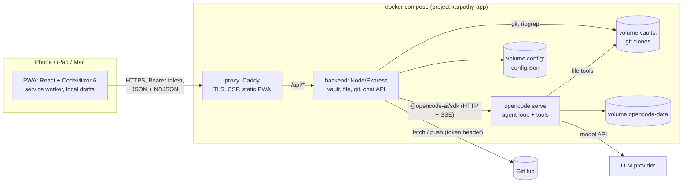
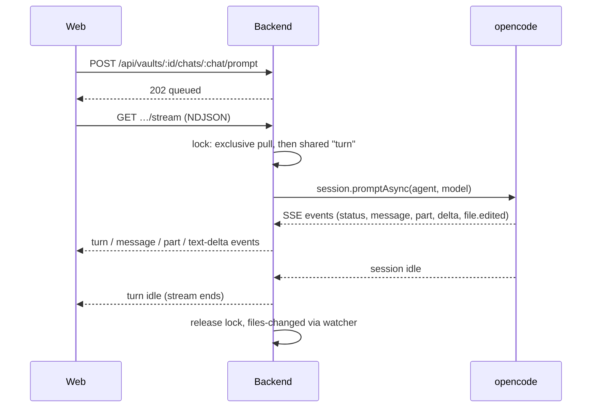
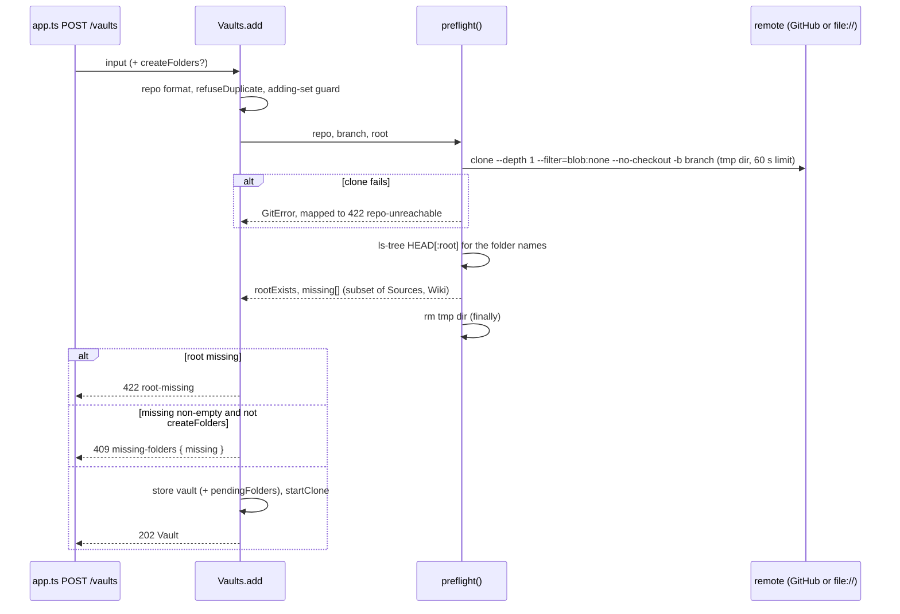

# Architecture: karpathy.app

As built on 2026-10-02. This page describes what exists; the reasons behind it are in
[Design decisions](#design-decisions) and the [ADRs](../../docs/adr/).

## Overview

A thin backend in front of git and an agent harness, a PWA in front of the backend, all in one docker compose
stack. Only the reverse proxy publishes ports.



## Technology stack

| Layer | Technology |
|---|---|
| Web | React 19, Vite 8, TypeScript, CodeMirror 6 (`lang-markdown`, own live-preview decorations), `marked` 18 + DOMPurify, vite-plugin-pwa (Workbox), framework7-icons. No router library (hash routes), no state library (one context hook). |
| Backend | Node 22, Express, TypeScript run with `tsx` (no build step), zod validation, chokidar, `@opencode-ai/sdk` v2, `git` and `ripgrep` binaries. |
| Agent harness | `opencode serve` 1.18.25 (pinned image `ghcr.io/anomalyco/opencode`), provider-agnostic; default model `anthropic/claude-sonnet-5`, Ollama `qwen2.5:3b` in dev and tests. |
| Proxy | Caddy 2.10 built with a `caddy-dns/<provider>` module (GoDaddy) for DNS-01. |
| Shared | `packages/shared`: TypeScript types for the API (no runtime schemas). |
| Tests | Vitest (backend projects `default`, `github`, `llm`; web unit tests for `lib/`), Playwright e2e (desktop, iPad, iPhone in Chromium and WebKit), axe-core. |
| Website | Plain HTML + CSS in `site/`, no framework or dependencies; tests with `node:test`; GitHub Pages. |
| Tooling | npm workspaces (`apps/*`, `packages/*`, `site`), ESLint flat config, `just`, GitHub Actions CI. |

## Components

### Web app (`apps/web`)

- **Shell** with three panes (sidebar, note, chat) laid out per breakpoint: phone ≤ 699 px (tab bar, push navigation),
  tablet 700–1023 px (overlays), wide ≥ 1024 px (columns). On the wide layout the **swap button** (`#main-swap`,
  rendered by `Shell` while the chat is open) toggles the main pane: class `chatmain` on `#app` swaps the two columns
  with CSS `order`/`flex` only, so no DOM node moves (a running stream, typed text, focus, scroll and undo history
  survive). The button is one absolutely positioned 44 px element on the divider (`right: 380px + inset`, the side
  column is always 380 px); the bar ends next to it get 32 px padding. The choice lives in the store (`chatMain`,
  localStorage `karpathy.chatMain`).
- **Chat opens notes** (`lib/chat.ts`, `ChatPane` `useChat`): a pure open tracker per chat view (`seen`, `later`,
  `loaded`). The first history load only marks completed `open_note` calls as seen; later loads (reattach,
  visibility change) and live events open unseen completed calls. Outside the wide layout the last open of the turn
  waits for `idle`. `show(path)` checks `isEditing()` (editor focused or unsaved text) at that moment: open the note,
  or toast "AI opened …". A completed open renders as an "opened" chip that reopens the note.
- **Store** (`store.tsx`): one `useAppState` hook in a React context holds the token, vaults, status, open note, save
  pipeline (autosave 1.5 s, drafts, retries), the vault event stream and routing (`#/<vault>/<path>`).
- **Editor** (`Editor.tsx`, `lib/cm.ts`): CodeMirror 6 with decorations only, so the Markdown text, frontmatter and
  `[[wikilinks]]` round-trip losslessly; CRLF kept; external reloads applied as one minimal change.
- **Renderer** (`lib/markdown.ts`): `marked` with extensions (wikilinks and embeds, highlights, footnotes; callouts and
  task markers via renderer overrides; `%%comments%%` stripped outside code) + DOMPurify for Read mode and chat text. A
  per-call `afterSanitizeAttributes` hook sets link targets: wikilinks and resolved relative links get app routes,
  external links `target="_blank" rel="noopener noreferrer"`.
- **API client** (`lib/api.ts`, `lib/ndjson.ts`): fetch wrapper with Bearer token, typed `ApiError`, NDJSON reader.
- **Admin modal** (`Admin.tsx`): one `Modal` with local view state `list | details | add | settings` (no router;
  `adminOpen` stays a boolean plus an optional vault id). Every view but the list has a "All vaults" back button; closing
  resets to the list. The list opens details on a row click; "Edit vault" in `NotePane` / `ChangesPanel` opens that
  vault's details directly (`setAdminOpen(true, vaultId)`), the sidebar gear and vault switcher open the list. The
  settings view holds the GitHub token form, `SettingsForm` and the versions. A nested help `Modal` ("What is a
  vault?", static, no backend) and a nested confirm `Modal` for missing folders.
- **Service worker**: precaches the app shell; `vault-api` NetworkFirst cache (5 s timeout) for the vault list, file
  tree and opened notes; auto-update with a re-check whenever the app becomes visible.

### Website (`site/`)

Not part of the app or its stack: the public product page at https://karpathy.app, deployed to GitHub Pages
on its own ([deployment.md › Website](deployment.md#website)).

- `index.html` (start page: hero with logo, features, how it works, "Code, not a service" with what self-hosting
  takes, a hosting contact) and `style.css` (the app's `:root` token blocks, copied, plus the page's layout).
- `build.sh` assembles `_site/` from the page files and `assets/icons/`; all paths are relative, so the page also
  works under `tillg.github.io/karpathy.app/`.
- `site.test.mjs` runs the build and checks the output, including token equality with `apps/web/src/styles.css`.

### Backend (`apps/backend`)

| Module | Responsibility |
|---|---|
| `main.ts` | Reads env and `*_FILE` secrets, wires the services, graceful shutdown. |
| `app.ts` | Express routes under `/api`, error mapping, NDJSON writer (15 s keepalive). `/healthz` outside auth; `/api/health` also reports the release version (`APP_VERSION`, `dev` for local builds), which the settings dialog shows next to the PWA's own. |
| `auth.ts` | Bearer token check (hashed, constant-time compare). |
| `vaults.ts` | Vault lifecycle (add with preflight, clone, patch, remove), file API, search, status, events, commit/push/discard, conflict resolution; per-vault runtime state; per-vault token access check (`checkAccess`). Reads the GitHub token through a getter per git operation. |
| `preflight.ts` | `preflight()`: the attach check ([Attach preflight](#attach-preflight)); `REQUIRED_FOLDERS`. |
| `github-token.ts` | `GitHubToken`: the server-wide token (stored over secret), its source, `GET /user` identity check, redaction of every value seen. |
| `repo.ts`, `git.ts` | All git commands for one clone: changes, diff, pull procedure, commit, push, conflict sides and resolution; hardened `runGit`. |
| `files.ts`, `paths.ts` | Tree listing, versions (content hash), ripgrep search; path normalization and symlink-safe resolution. |
| `lock.ts` | Per-vault reader/writer lock with writer preference (shared: `save`, `turn`; exclusive: every git operation). |
| `watcher.ts` | chokidar on the vault root, 300 ms debounce → `files-changed` + status events. |
| `chat.ts` | Chats and turns: per-vault queue (one running turn), pull before each turn, stream fan-out, abort, adoption of busy sessions after a restart. |
| `harness/opencode.ts`, `harness/map.ts` | The only code that knows opencode: an ACP-shaped `Harness` interface and the mapping of opencode events to app events. Tool names live only here: `WRITE_TOOLS` set `ToolCall.writes`, `OPEN_TOOLS` (`open_note`) set `ToolCall.opens`. |
| `commit-message.ts` | Proposes commit messages with a throwaway, tool-less session. |
| `config-store.ts` | Atomic, serialized writes to `/config/config.json`; also holds the GitHub token set in the app. |

### opencode (`deploy/opencode`)

The pinned stock image (`deploy/opencode/Dockerfile`) plus a **managed config** at `/etc/opencode/opencode.json` (merged last, so a vault can't override it):
agents `vault` (edits allowed except `.git` and harness config), `vault-readonly` (default; used during conflicts) and
`commit-message` (no tools); `bash`, `webfetch`, `websearch`, `task`, `question` and `external_directory` denied;
reading `*.env` denied; snapshots, sharing and auto-update off. The image has no git binary, so opencode can't detect
a worktree and stays confined to the session directory (the vault root).

**Custom tool `open_note`** (`deploy/opencode/tools/open_note.ts`, path check in `deploy/opencode/lib/resolve-note.ts`):
checks that `path` resolves inside `context.directory`, exists, is a file and has no dot segment, then returns
`opened <path>`; it reads no content and opens nothing itself — the web app reacts to the completed tool part. It is
loaded from a global config dir that comes only from the image (`XDG_CONFIG_HOME=/opt/opencode-config`), allowed
explicitly for `vault` and `vault-readonly`. opencode writes `package.json` etc. into every config dir and installs
`@opencode-ai/plugin` there on startup, so the Dockerfile pre-bakes the dir with one throwaway `opencode serve`
(each poll bounded by a 2 s `wget` timeout; on failure the build prints opencode's log), then makes it root-owned and
read-only; at runtime it loads offline. Helpers can't live in `tools/` (every export there becomes a tool).

```mermaid
sequenceDiagram
  participant O as opencode (open_note)
  participant H as backend harness/map.ts
  participant C as backend chat.ts
  participant S as web useChat (ChatPane)
  participant A as web store openNote
  O->>O: resolve path in the vault root; missing / outside → tool error
  O-->>H: tool part completed (input.path)
  H->>C: part {call: {path, opens: true, writes: false}}
  C-->>S: NDJSON part event
  S->>S: open tracker: unseen + completed?
  S->>A: wide: now · phone / tablet: on idle · editing: toast instead
```

### Proxy (`deploy/proxy`)

Serves the built PWA from `/srv` with SPA fallback, proxies `/api/*` to the backend unbuffered (`flush_interval -1`),
sets CSP and security headers, and gets its certificate by DNS-01 (`TLS_MODE=dns`; GoDaddy, with a 90 s wait for
GoDaddy's nameservers) or from Caddy's internal CA (`TLS_MODE=internal`: prodtest and the `local` target). A
plain-HTTP site on `127.0.0.1:8081` answers the container healthcheck.

## Communication



- **Request/response** JSON over `fetch`; **streams** as NDJSON over `fetch` (no WebSockets, no SSE to the browser):
  the vault event stream (`status`, `files-changed`; never ends) and the chat stream (ends when the turn is idle).
- Turns outlive connections: a client reattaches to a running turn from any device.

## Attach preflight

`POST /vaults` (`Vaults.add`) checks a repo before anything is stored:



- The preflight clone is blobless, depth 1 and without checkout (commits and trees only, small even for media-heavy
  vaults), made in a random `pre-*` dir under `<vaultsDir>/.preflight/` on the vaults volume, and always removed.
  `Vaults.init()` removes `.preflight/` at startup (leftovers of a crash). The clone is killed after 60 s. It also
  works against `file://` remotes (`GIT_REMOTE_BASE`) in tests and dev.
- **Folder check:** `git ls-tree HEAD[:<root>]`; only entries of type tree count, so a *file* named `Wiki` is missing.
  Names match case-insensitively; missing ones are created as `Sources/` / `Wiki/`. A root that isn't in the tree
  gives `rootExists: false`.
- **Concurrency guard:** an in-memory set of `repo|branch|root` keys whose add is in flight; a second add of the same key
  gets `409 duplicate`. It bounds parallel preflights per repo and closes the window between duplicate check and store.
- **Persisting:** only after the preflight passed. With `createFolders` and missing folders, the stored vault carries
  `pendingFolders`; when the clone has finished, `createFolders()` writes `<root>/<folder>/.gitkeep` (skipping a folder
  that exists after the clone, failing with "a file with that name exists" if a file blocks it) and then `cloned: true`
  is stored and `pendingFolders` removed. A restart mid-clone re-clones and still creates them. The writes are
  uncommitted changes (ADR 0001), outside the AI-touched set. Folders deleted between preflight and clone aren't
  re-checked.
- **Errors** (`HttpError` JSON `{error, code}`): `422 repo-unreachable` (message from `cloneErrorText`, redacted),
  `422 root-missing`, `409 missing-folders` (body adds `missing: string[]`), `409 duplicate`. `clone-failed` remains
  for failures after the preflight. `PATCH /vaults/:id` has no preflight.
- Messages from preflight and clone failures go through `redact()` before they are returned, logged or stored.

## GitHub token

- **Storage:** `ConfigData.githubToken`, a top-level key of `config.json` and deliberately not part of `Settings`,
  because `GET /settings` returns settings verbatim. `GitHubToken.current()` returns the stored token, else the
  `GITHUB_TOKEN` secret read at startup; `source()` is `settings | secret | none`; `clear()` falls back to the secret.
  Existing deployments therefore keep working unchanged.
- **Live getter:** `Vaults` gets `githubToken: () => string | undefined` instead of a startup string and calls it
  per git operation (clone, pull, push, preflight, access check), so a changed token applies to the next one, no restart.
- **Routes:**

  | Route | Body | Reply |
  |---|---|---|
  | `GET /settings`, `PATCH /settings` | | `SettingsView`: settings + `githubToken: { source, last4 \| null }` (last4 of the current token, stored or secret), never the plaintext |
  | `PUT /settings/github-token` | `{ token }` (trimmed, 20–255 chars, no whitespace; else 400) | `204` |
  | `DELETE /settings/github-token` | | `204`; falls back to the secret |
  | `POST /settings/github-token/test` | `{ token? }`, else the current token | `200 TokenTest` |

  The token routes answer 404 when no `GitHubToken` is wired (tests that omit it).
- **Token test:** `TokenTest { ok, login?, scopes?, expiresAt?, error?, vaults: {id, repo, ok, error?}[] }`. Identity is
  `GET {GITHUB_API_BASE}/user` (default `https://api.github.com`, 10 s timeout; `X-OAuth-Scopes`,
  `github-authentication-token-expiration`); it reports 401 as "GitHub rejected the token (401)." and network failure as
  "GitHub is not reachable from the server right now.". In parallel, `Vaults.checkAccess` runs
  `git ls-remote --exit-code --heads <remote><repo>.git <branch>` per configured vault with the tested token, which
  proves repo access (a fine-grained token passes `/user` without it). Nothing is stored. API base and remote base
  come from server env, never from the request.
- **Redaction:** `GitHubToken` remembers every value seen since startup (secret, stored, every set and every tested
  token) and `redact()` masks each as `***`; `Vaults` redacts clone, preflight and access-check messages with it.

## Data

| Store | Content | Owner |
|---|---|---|
| Volume `vaults` → `/vaults/<id>` | Full git clone of each vault repo (no shallow or sparse clone). The notes themselves. | backend (git), opencode (file tools) |
| Volume `config` → `/config/config.json` | `vaults` (config + `cloned` / `cloneError` / `pendingFolders`), `settings`, `githubToken` (plaintext, if set in the app), `aiTouched`, `conflicts`, `queued` turns. | backend only |
| `/vaults/.preflight/` | Short-lived blobless clones of the attach preflight; emptied at startup. | backend |
| Volume `opencode-data` | opencode sessions = chat history. | opencode |
| Volume `caddy-data` | TLS certificates and keys. | proxy |
| Browser localStorage | Token, local drafts, tree expansion state. | web |
| Service worker cache `vault-api` | Vault list, file trees, opened notes (for offline reading); cleared on 401. | web |

No database. Git is the source of truth for notes; GitHub is the sync hub.

## System boundaries

- **Exposed:** one HTTPS origin: the PWA plus `/api/*` (full route list in `apps/backend/src/app.ts`). Every `/api`
  route needs the bearer token; `/healthz` exists only inside the stack.
- **Consumed:** GitHub over HTTPS (clone, fetch, push), the opencode HTTP API on the internal network, the LLM
  provider APIs (from opencode only), and the DNS provider API (DNS-01, from the proxy only).

## External systems

| System | Used for | Status |
|---|---|---|
| GitHub | Vault repos; fine-grained token as an HTTP extra header, never in `.git/config`; `api.github.com/user` for the token test | in use |
| LLM providers (OpenRouter in production, any via opencode) | Model behind opencode; keys only in `opencode.env` | OpenRouter `z-ai/glm-5.3` on zero-data-retention hosts in production |
| Ollama | Dev, local prod test and CI LLM tests | in use |
| Let's Encrypt + GoDaddy DNS | Certificate for `app.karpathy.app` via DNS-01; the A record points at the server's tailnet IP. The apex and `www` point at GitHub Pages | in use |
| GitHub Pages | Hosts the website at `karpathy.app` (with GitHub's own Let's Encrypt certificate) | in use |
| ghcr.io | The app's release images (public) and opencode's base image | in use |
| Docker Hub | Base images; Beszel and Gatus | in use |
| Hetzner Cloud | The production server | in use |
| Tailscale | The only way into the server (SSH, app, monitoring UIs) | in use |
| ntfy.sh, healthchecks.io | Alert delivery to the phone; heartbeat dead-man's switch | in use |

## Infrastructure

- **Runtime = docker compose** in dev and prod (`deploy/compose.yml`). Services `proxy` (networks `edge` +
  `internal`), `backend` and `opencode` (`internal` only); backend and opencode run as uid 1000; all with
  `cap_drop: [ALL]`, `no-new-privileges` and log rotation; no egress restriction (opencode must reach the LLM APIs).
  Secrets are files mounted as compose secrets (`deploy/secrets/` in dev, `shared/secrets/` on a target); provider
  keys come from `opencode.env`.
- **Dev** (`compose.dev.yml`, `just dev`): https://localhost:8443 with Caddy's internal CA, Vite with HMR (`web`
  service), bind-mounted sources, local bare repos as remotes (`GIT_REMOTE_BASE=file:///remotes/`), Ollama.
- **Local prod test** (`compose.prodtest.yml`, `just prodtest`): the prod images on https://localhost:9443 next to
  the dev stack.
- **CI** (`.github/workflows/ci.yml`): lint, typecheck, tests, web build, a compose config check, and
  `ansible-lint` + syntax checks of the playbook on every push and PR; weekly (and on demand) GitHub and LLM test suites.
- **Website** (`.github/workflows/pages.yml`): the site test, then `_site/` to GitHub Pages on every push to `main`
  that touches `site/`, `assets/icons/` or the app's stylesheet.
- **Releases and production:** a tag `vX.Y.Z` builds the images (amd64 + arm64) to GHCR; the Ansible playbook
  deploys a release to a **target**: `local` (a Lima VM on the Mac, https://localhost:9444) or `hetzner` (a
  Hetzner CPX22 reachable only over Tailscale, https://app.karpathy.app, running since 2026-10-02), with
  monitoring (Beszel, Gatus, a healthchecks.io heartbeat, alerts via ntfy). All of it:
  [deployment.md](deployment.md).

## Design decisions

The ones that shape the whole system:

- **Agent harness = opencode** ([ADR 0002](../../docs/adr/0002-opencode-as-agent-harness.md)): neither loop nor
  tools nor skills are reimplemented; the backend only relays. The boundary is ACP-shaped so the harness stays
  swappable.
- **Editor = CodeMirror 6 on raw Markdown** ([ADR 0003](../../docs/adr/0003-codemirror-raw-markdown-editor.md)):
  lossless round trip, clean git diffs, no fight with the AI's raw edits.
- **Vault = GitHub repo, sync = git:** the app holds no content of its own; Obsidian on other devices uses the same
  remote. One GitHub token for all vaults, editable in the app (the deployment secret is the fallback); if vaults
  ever span several owners, the follow-up is one token per owner, not per vault.
- **Checked attach:** a vault is stored only after a preflight (reachable, branch, root, `Sources/` + `Wiki/`), so a typo
  or a missing token scope never leaves a `clone-failed` vault behind. One endpoint answers `409` and is retried with
  `createFolders`, instead of a separate check endpoint that could go stale; git does the check, not the GitHub API,
  so it works against `file://` test remotes. Created folders are `.gitkeep` placeholders, uncommitted (ADR 0001); a
  visible `README.md` would look like a source to ingest skills.
- **The user commits, the AI never does** ([ADR 0001](../../docs/adr/0001-user-triggered-commits.md)).
- **Explicit pull steps instead of `git pull --rebase --autostash`** (diagram in
  [domain.md](domain.md#pull-and-conflict)): unpushed commits are folded back with `reset --mixed`, never rebased, so no
  mid-rebase state can exist and stash pop is the only way into a conflict. If the remote history was replaced (no
  merge base), the pull resets onto the new upstream and everything local becomes uncommitted changes. During a
  conflict the clashing files hold the user's version, not `<<<<<<<` markers, which would leak into the editor,
  search and the AI. The unresolved paths are persisted in the config store, because after "keep theirs" on an
  untracked file git alone can't tell resolved from unresolved.
- **One in-memory lock per vault** (single backend process): saves and AI turns share it, git operations take it
  exclusively. A pull never runs during a turn, so a vault can't enter conflict mid-turn.
- **opencode runs the stock image without git.** Without git it can't detect the worktree, which is what confines
  its tools to a subfolder vault root and keeps session IDs stable (with git discovery, sessions vanished from the
  list once the project ID changed). If git ever goes into the image (e.g. for skill scripts), the git dirs must
  first move off the shared volume (`git clone --separate-git-dir`, a backend-only volume) and the confinement
  check must be re-run. Backend and opencode run as the same uid so files the AI writes stay committable.
- **Commit message proposals go through opencode** (agent `commit-message`, a throwaway session that is deleted
  afterwards), not a second LLM client, because only opencode holds provider keys.
- **Runtime = docker compose in dev and prod**, nothing native in dev. Rancher Desktop bind mounts deliver no
  inotify events, so the dev `web` and `backend` containers poll for source changes.
- **Read-only git commands run with `GIT_OPTIONAL_LOCKS=0`**: status polling raced with Discard on `index.lock`.
- **The AI shows notes through a server-side, check-only tool** (`open_note`), not a client-side function: the agent
  loop runs in opencode on the server, so the browser can't execute tools. The UI learns about it from the existing
  tool part (`ToolCall.opens`), not a new event type, so replay and reattach follow the same rules as every chip. The
  tool is baked into the image; a backend MCP endpoint was rejected because it would need an auth exemption or the
  bearer token inside opencode.
- **Swapping main and side column is CSS only** (`order`/`flex`): a keyed reorder in JSX keeps component state but
  moves DOM nodes, which drops keyboard focus and resets scroll positions. Cost: Tab order doesn't follow the visual
  order when the chat is in main.

## Testing

- **No mocks:** integration tests use real git (local bare repos as remotes, a second clone plays "Obsidian") and
  the real opencode container — built from `deploy/opencode/Dockerfile` (`kai-test-opencode`), so tests load the same
  config and tools as prod; CI builds it once before `npm test`. A scripted fake LLM provider would count as a mock.
- **Three tiers:** *default* (`npm test`, every push: unit + git integration + opencode lifecycle, no secrets; chat
  tests use a model name Ollama doesn't have, so turns fail fast and the lifecycle is tested without an LLM),
  *`@github`* (weekly + locally: against the private throwaway repo `tillg/karpathy-app-test-vault`, pushing only
  to temporary `test-<ts>` branches) and *`@llm`* (weekly + locally: real model turns).
- **Attach and token tests:** test remotes carry `Sources/` and `Wiki/` (backend `makeRemote`, e2e `make-vault.py`, the
  GitHub test vault), so ordinary tests attach without a `409`; preflight tests opt out (`structure: false`). Token
  storage, precedence, masking and redaction run in the default tier; the `/user` identity check and a token changed
  at runtime need real GitHub (`@github`), because `file://` remotes never send the auth header.
- **`@llm` rules:** prompts name the tool explicitly; assertions check tool events and the file system, never answer
  text; a turn without any tool call fails as *inconclusive*, not as passed; at most one retry.
- **Model in dev and CI:** Ollama `qwen2.5:3b` with `OLLAMA_CONTEXT_LENGTH=16384` and a matching context limit in the
  opencode provider config. Ollama otherwise truncates opencode's prompt to about 2k tokens silently, and the model
  then ignores `AGENTS.md` and misuses tools.
- **e2e:** Playwright against the running stack (dev, or the prod images via `E2E_BASE_URL`); every test fails on a
  CSP violation. Offline e2e in WebKit is skipped (Playwright's offline WebKit fails even service-worker-served
  requests).
