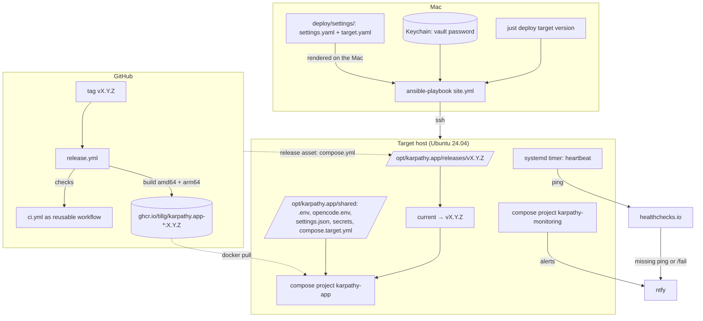
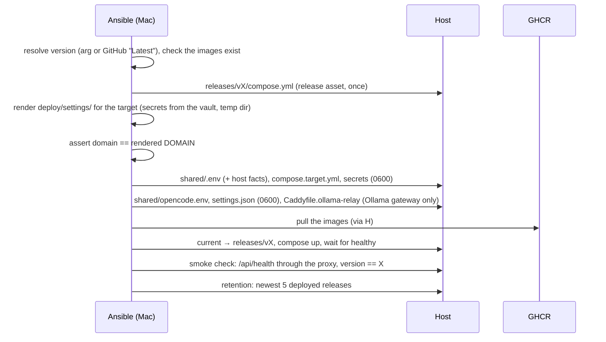
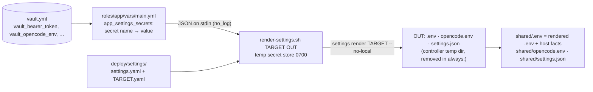
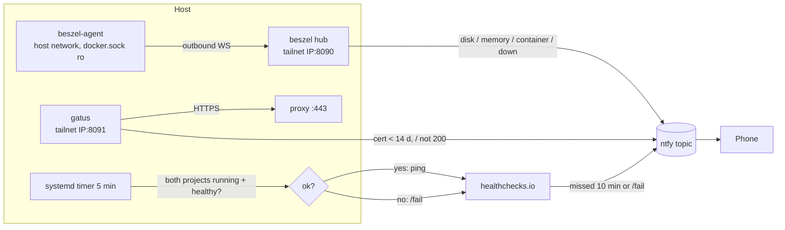
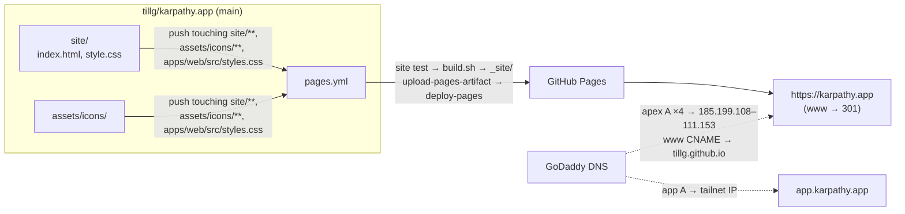

# Deployment: releases, targets and operations

As built on 2026-10-02, production running since then. How a version of the app gets built, put on a
server and watched. The how-to with every `just` recipe is [`deploy/README.md`](../../deploy/README.md);
this page is the system view and the decisions behind it.

## Overview

Three parts, each with one job:

1. **Release workflow** (GitHub Actions) turns a tag into immutable images plus the matching
   `compose.yml`, attached to the GitHub release.
2. **Ansible playbook** (run from the Mac) brings a host to the desired state and switches it to a
   release. Nothing is built on a host, and a host holds no copy of the source.
3. **Monitoring** (on the host, plus a heartbeat to an outside service) tells the operator when it breaks.

The public website at https://karpathy.app has its own, much simpler pipeline: [Website](#website).

## Releases

- A **release** is a tag `vX.Y.Z` on `main`; a **pre-release** is `vX.Y.Z-rc.N` from any commit.
  `just release <version>` tags and pushes; it refuses a dirty tree, and a final version unless HEAD
  is on `main`. The workflow's `guard` job enforces the same.
- `release.yml`: `check` (the CI workflow, reusable) → `build` (matrix image × arch, native
  `ubuntu-24.04` and `ubuntu-24.04-arm` runners, pushed by digest) → `manifest` (`:X.Y.Z`, and
  `:latest` only for the highest final version) → `release` (`gh release create`, `compose.yml` as
  asset; pre-releases never become "Latest"). Permissions are read-only except for the push and release
  jobs.
- **One version string without the `v`:** image tag, `APP_VERSION` (baked into the backend image and
  the PWA build) and what `GET /api/health` reports. Dev and prodtest builds report `dev`. Every tag is
  built on its own; a final release on an RC's commit isn't a retag (the version is in the images).
- **Built and Deployed:** the guard job's time goes into the backend image as `BUILT_AT`; role `app`
  writes `DEPLOYED_AT` to `shared/.env`, keeping it when the same version is redeployed (an unchanged
  `.env` recreates nothing). `GET /api/health` reports both as `built` / `deployed` (`null` locally).
- Images: `ghcr.io/tillg/karpathy.app-{proxy,backend,opencode,egress}`, public (the repo is), pulled
  anonymously. Every version stays in GHCR.

## The compose stack on a target

`deploy/compose.yml` is the one stack definition for dev, prodtest and every target:

- `image: ghcr.io/…:${APP_VERSION:-dev}` per service. Dev stacks reset it, so compose names their images
  per project (`karpathy-app-N-backend`, …) and neither parallel dev stacks nor prodtest share a tag; prodtest
  builds keep `ghcr…:dev`.
- The proxy publishes only `${BIND_IP}:${HTTPS_PORT}:443` (no port 80: DNS-01), and has a healthcheck
  answered by Caddy itself on `127.0.0.1:8081`.
- All services: `cap_drop: [ALL]` (the proxy keeps `NET_BIND_SERVICE`), `no-new-privileges`, json-file
  log rotation (3 × 10 MB). The backend has `init: true`: its PID 1 (`npm exec`) didn't reap orphaned
  git processes.
- `TZ` from the target's settings (`timezone`; `tzdata` in the backend image), so commit times follow it.
- Settings arrive rendered ([Settings on a target](#settings-on-a-target)): compose interpolates `shared/.env`, the
  backend mounts `shared/settings.json` read-only (`SETTINGS_FILE=/etc/karpathy/settings.json`), opencode reads
  `shared/opencode.env`.
- Networks: `edge` (proxy), `internal` (`internal: true`: proxy, backend, opencode, egress) and `egress` (backend
  and the `egress` Squid proxy, the only two with a route out). opencode reaches the internet only through
  `egress:3128`; the backend talks to opencode with the `opencode_password` (HTTP Basic, also in opencode's
  healthcheck).

A target adds `shared/compose.target.yml` (rendered by Ansible): the `vaults` volume as a bind mount
of `/srv/vaults`; on `local` also the e2e bare repos at `/remotes` with `safe.directory` (plus `GIT_REMOTE_BASE` as
env, which only releases from before the settings read), and, when the target's gateway is Ollama, the `ollama-relay`
service (`ollama.internal` on `internal` + `egress`, upstream `${OLLAMA_UPSTREAM}`) with `NO_PROXY=…,ollama.internal`
for opencode.

## Targets

| Target | Host | Reached as | TLS |
|---|---|---|---|
| `local` | Ubuntu 24.04 VM (Lima, `deploy/lima/karpathy-vm.yaml`), sized like the server; https://localhost:9444 | the Lima guest user | Caddy's internal CA |
| `hetzner` | Hetzner CPX22, Nuremberg (CX23 was sold out); https://app.karpathy.app | `ops@karpathy` over Tailscale | Let's Encrypt via DNS-01 at GoDaddy |

Each target is an environment with three homes:

| What | Where |
|---|---|
| App settings (gateway, model, domain, TLS, timezone, git identity, …) | `deploy/settings/settings.yaml` + `deploy/settings/<target>.yaml` ([architecture.md](architecture.md#settings)) |
| Host provisioning (Tailscale, host timezone, `vaults_fs_size`, `bind_ip`, `https_port`, `app_url`, monitoring, users) | `deploy/ansible/inventories/<target>/group_vars/all/main.yml` |
| Secret values | the inventory's encrypted `vault.yml` |

`domain` stays in `group_vars` as well (the monitoring role and the smoke check read it, and `--only monitoring`
runs without role `app`); role `app` asserts it equals the rendered `DOMAIN` and stops on a mismatch.

| Target | Model |
|---|---|
| `local` | The native Ollama on the Mac (`ollama/qwen2.5:3b`, `just ollama install`), the same one the dev stacks use, through the VM stack's `ollama-relay` to `192.168.5.2:11434` (Lima's address for the host, forwarded to the Mac's loopback). Role `app` checks on the controller that Ollama answers and has the model, else stops with "run `just ollama install`". |
| `hetzner` | OpenRouter `z-ai/glm-5.3`, routed to zero-data-retention hosts (the central default). |

Not targets, and not deployed by the playbook: the **dev stacks** on the Mac (stack N, project `karpathy-app-N`,
on https://localhost:80N0, started with `just dev up [N]`) and their **paired prodtest** (the prod images built
locally as `karpathy-app-N-prodtest` on https://localhost:80N5, `just prodtest`). They are the environments `dev`
and `prodtest`; both use the native Ollama on the Mac as the model unless a developer's local overlay picks another
gateway. Details: [architecture.md](architecture.md#dev-stacks).

## The playbook

`site.yml` runs the roles in order; `--only app|monitoring` runs one role (tags) on an already deployed
host.

| Role | Does |
|---|---|
| `base` | Users (below), sshd hardening (no root, no passwords; a marker file forces the restart if an earlier run died before the handler), unattended-upgrades, timezone. |
| `tailscale` | Apt repo, `tailscale up` with a single-use `tag:server` key, refreshes the facts so `bind_ip` (the tailnet IP) is known; stops with a clear message for a used key or a taken tailnet name. `hetzner` only. |
| `docker` | Docker CE + compose plugin; on Tailscale hosts, Docker starts after `tailscaled` and `net.ipv4.ip_nonlocal_bind=1` lets containers bind the tailnet IP before it exists at boot. |
| `vaults_fs` | A loop-mounted ext4 file at `/srv/vaults` (5 G local, 20 G hetzner, inside the backed-up disk), `nofail`; Docker requires the mount. |
| `app` | Downloads the release's `compose.yml` once, renders the target's settings on the controller and writes `shared/` ([Settings on a target](#settings-on-a-target)), checks the Mac's Ollama when the gateway is Ollama, pulls the images before switching `current`, `docker compose up` (recreated when a secret, `opencode.env`, `settings.json` or the relay config changed), smoke check, keeps the 5 most recently deployed releases and their images. |
| `monitoring` | Beszel hub + agent and Gatus as compose project `karpathy-monitoring`, Beszel provisioned through its API, the heartbeat timer. |

- **Smoke check:** `curl --resolve <domain>:<port>:<bind_ip>` with the bearer token: the real name
  (TLS, SNI) on the address the proxy binds, so it works before the DNS record exists; it waits up to
  5 min for a first certificate. A failed smoke check fails the deployment and leaves `current` on the
  new release; there is no automatic rollback.
- **Rollback** = deploying the older version with today's playbook (`just deploy <target> <old>
  --only app`, about 50 s). The playbook supports every release since it shipped; a template change
  that would break an older `compose.yml` must stay backward compatible. That is why the rendered `.env` keeps every
  key the old `env.j2` wrote (`DEFAULT_MODEL`, `GIT_AUTHOR_*`, `TLS_MODE`, …; a golden test pins the set) and
  `compose.target.yml` still sets `GIT_REMOTE_BASE` on `local`: a release from before the settings ignores
  `settings.json` and reads those. Checked on `local` (rollback to 0.0.15 and forward again). Not covered: releases
  older than the egress proxy on `local`.
- **Bootstrap:** `just deploy hetzner <version> --bootstrap <public-ip>` runs the same play once as
  `root` on the public IP (with the temporary `setup-ssh` firewall); it needs exactly one inventory host
  and forgets the IP's old host key. Rebuilding a server is a short procedure in `deploy/README.md`.

## Settings on a target {#settings-on-a-target}

Role `app` renders the target's settings with the same renderer as the dev stacks (`packages/settings`), on the
controller, never on the host (which has no source checkout):

- **Secret names from the vault:** the vault layout is unchanged; `roles/app/vars/main.yml` maps it to the names the
  settings refer to: `bearer_token`, `github_token`, `dns_api_token`, `git_author_name` / `git_author_email` (from
  `vault_git_author_*`) and each key of `vault_opencode_env` lower-cased (`OPENROUTER_API_KEY` →
  `openrouter_api_key`). A stack test checks that every secret a target's settings use (`--list-secrets`) has a
  source there. The opencode password is still generated on the host; the renderer gets a placeholder, since
  `settings.json` only names its file.
- **`render-settings.sh`** takes the secrets as JSON on stdin (never as arguments), writes them to a `mktemp -d` store
  (0700, files 0600, empty values left out) that its `trap` removes, and runs the CLI with `--no-local`. The rendered
  files land in an Ansible temp dir that an `always:` block deletes.
- **`shared/.env`** (0600) is the rendered `.env` plus this host's facts: `APP_VERSION`, `DEPLOYED_AT` (kept on a
  redeploy of the same version), `BIND_IP`, `HTTPS_PORT`, `APP_UID`, `APP_GID`. **`shared/opencode.env`** (0600) and
  **`shared/settings.json`** (0600, owned by `deploy`) are copied as rendered; a change to either recreates the stack.
- **Checks:** `domain` (inventory) must equal the rendered `DOMAIN`; with the Ollama gateway the Mac's Ollama must
  answer on `127.0.0.1:11434` with the default model. The smoke check reads `TLS_MODE` from the rendered `.env`.
- `just settings show <target>` prints what a target runs with (secrets as references); the controller needs the
  checkout's `node_modules` (`tsx`), as for every `just` recipe.

## Users and access on a server

| User | uid | Has | For |
|---|---|---|---|
| `ops` | 1001 | SSH key, passwordless sudo, docker group | Ansible and the operator |
| `deploy` | 1000 | nothing: no login shell, no keys, no sudo, no docker | the app's uid inside the containers, owner of `/srv/vaults` |

A container breakout as uid 1000 doesn't land on a sudoer. The Hetzner firewall `no-inbound` blocks all
inbound traffic; SSH, the app (443), Beszel (8090) and Gatus (8091) are reached only over Tailscale
(the services bind the tailnet IP; sshd relies on the firewall).

## Secrets

| Secret | Used by | On the host |
|---|---|---|
| Bearer token | backend | `shared/secrets/bearer_token` (uid 1000, 0600) |
| GitHub token | backend | `shared/secrets/github_token` (uid 1000, 0600); the fallback: a token set in the app's settings wins and needs no redeploy |
| GoDaddy `<key>:<secret>` | proxy (DNS-01) | `shared/secrets/dns_api_token` (root, 0600: Caddy runs as root without CAP_DAC_OVERRIDE) |
| Provider key of the gateway, optional `EXA_API_KEY` (with the non-secret web caps, model and provider config) | opencode | `shared/opencode.env` (0600), rendered from `deploy/settings/`; vault: `vault_opencode_env` |
| Commit author (`hetzner`: secret references, no personal data in the public repo) | backend | resolved into `shared/settings.json` (uid 1000, 0600) and `shared/.env` (0600); vault: `vault_git_author_name` / `_email` |
| opencode server password | backend, opencode | `shared/secrets/opencode_password` (uid 1000, 0600); generated once on the target by role `app` (`force: false`), no vault entry; a change recreates the stack |
| Tailscale auth key | `tailscale up` | not stored; single-use |
| ntfy topic, healthchecks.io URL, Beszel password / hub key / token | monitoring | monitoring files, 0600 |

- Which secret a component needs is named in `deploy/settings/` (secret references); the values stay in the vault.
- One Ansible Vault per target, encrypted in git; values named `vault_*`, mapped in `group_vars/all/main.yml` and
  `roles/app/vars/main.yml` ([Settings on a target](#settings-on-a-target)). The
  vault password is in the macOS Keychain (`karpathy-ansible-<target>`), read by
  `vault-pass-client.sh`. `just secrets <target>` fills a vault with hidden prompts (taking keys
  already entered for the dev stack as defaults) and generates the token, Beszel secrets and the ntfy
  topic. `vault-get.sh` reads one value for the other scripts.
- Secret files carry no trailing newline (Caddy's `{file.…}` hands the DNS token over verbatim); tasks
  that handle secrets are `no_log`. The `local` vault holds test values only.
- **Logging a device in:** `just token <target>` copies the token; `--qr` prints a QR code of
  `<app url>/#token=…`. The PWA stores a token from that link and removes it from the URL and history;
  the home-screen app on iOS has its own storage, so its token screen can scan the QR code with the
  camera ("Scan QR code").

## Monitoring {#monitoring}

- **Beszel** (hub + agent, v0.20): disk over 80 % (the fullest of `/` and `/srv/vaults`), memory over
  85 % for 10 min, a container unhealthy, the system down. Provisioned through its API with no UI
  clicks: admin role, a permanent universal token from the vault, the ntfy webhook **before** the alert
  rules (a rule already over its threshold fires at once), then the rules; every write is guarded by a
  read, so a rerun changes nothing.
- **Gatus**: `https://<domain>/` is 200 and the certificate has more than 14 days (Caddy renews at 30).
  `hetzner` only.
- **Heartbeat**: every 5 min a ping to healthchecks.io, or `/fail` with the reason when a container of
  `karpathy-app` or `karpathy-monitoring` isn't running or is unhealthy. The only way to notice the
  whole box gone: healthchecks.io raises the alert after 5 min period + 5 min grace.
- **ntfy**: one random topic per target on ntfy.sh, no account; alerts carry system names and numbers,
  never note content. `just ntfy-topic <target>` copies it.
- RAM: about 20 MB for hub and agent. The Beszel agent has the Docker socket, which makes it
  root-equivalent on the host (accepted: official image, connects only to the hub).

## Operations

- **Cheaper server watch:** `just hetzner-watch install` (launchd on the Mac, 08:00 and 14:00) pushes to
  the hetzner topic when a CX23 or CAX11 can be booked again; needs a read-only Hetzner API token in the
  Keychain.
- **Updates:** unattended-upgrades covers Ubuntu's security updates but not the Docker and Tailscale
  packages and doesn't reboot.
- **Backups:** Hetzner's daily server backup (7 slots) includes the vaults filesystem; no off-site copy.

## Website {#website}

The public product page at **https://karpathy.app** is separate from the app: static, no user data, not
versioned with a release, hosted on GitHub Pages, live since 2026-10-02.

- **Source:** `site/` (plain HTML + CSS, its own npm workspace `@karpathy/site`). `site/build.sh` assembles
  `_site/` (gitignored) from the page files and `assets/icons/`. Preview: `just site` (http://localhost:8099).
- **Check:** `site/site.test.mjs` (node:test, part of `npm test`, so `ci.yml` covers it) builds `_site/` and
  checks the title, lang, viewport and repo link, that every local `href`/`src` resolves, that no path is
  root-absolute, the self-hosting section with the hosting contact, and that the `:root` token blocks in
  `site/style.css` equal the app's in `apps/web/src/styles.css` (light and dark).
- **Website deploy:** `.github/workflows/pages.yml` on pushes to `main` that touch the site, the icons or the app's
  stylesheet, and on manual dispatch. Release tags don't deploy it.
- **Pages settings:** source "GitHub Actions" (`build_type=workflow`), custom domain `karpathy.app` set in the
  repo settings (a `CNAME` file is ignored with Actions deploys), HTTPS enforced; GitHub's Let's Encrypt
  certificate covers `karpathy.app` and `www.karpathy.app`.
- **DNS:** the apex and `www` point at GitHub; `app.karpathy.app` keeps pointing at the server's tailnet IP.
  The GoDaddy Website Builder site is an unpublished draft. `.app` is HSTS-preloaded, so the site is reachable
  only over HTTPS.

## Key decisions

| Decision | Why |
|---|---|
| Ansible run from the Mac, push-button, no CD | Covers host setup too; CD would need a Tailscale key in GitHub. |
| Images from GHCR, never built on a target | No builds on a 4 GB box; identical bits on every target; a real version to roll back to. |
| `compose.yml` as a release asset | Images and stack definition always come from the same release, even with a dirty checkout; no git or source on the host. |
| Native arm64 runners, not QEMU | Free for public repos, fast; the `local` VM is arm64. |
| `local` = a Lima VM, kept between runs | Only a VM runs the host roles; `just vm reset` for the from-scratch test. |
| Monitoring: Beszel + Gatus + healthchecks.io, its own compose project | The lowest RAM covering every alert; an app deploy never restarts the monitoring. |
| Secrets in Ansible Vault, password in the Keychain | No extra tool per deploy; one password per target. |
| ntfy.sh with a random topic | Free; a self-hosted ntfy would die with the server it reports on. |
| DNS at GoDaddy | Same place as the operator's other domains; the key can't be limited to one zone. |
| Separate login user `ops` | A breakout of the app's uid must not reach sudo or Docker. |
| Website on GitHub Pages, deployed by Actions (no `gh-pages` branch) | Free, no server, source next to the code; generated files stay out of git history. |
| Website as plain HTML + CSS, no generator | One page; revisit when there are more than ~3 pages or shared markup gets copied. |
| App tokens copied into `site/style.css`, kept equal by a test | Looks like the app without touching the app's build; drift fails CI. |
| Custom domain set only after the first deploy was checked on `tillg.github.io` | A set custom domain redirects the github.io URL to a domain that still pointed elsewhere. |

## Known gaps

- A secret changed in a run that then fails isn't applied by the next run (the recreate triggers only
  on a change in the same run).
- Handlers (Docker restart, systemd reload) are lost when a run fails (`force_handlers` is off).
- No automated test of the `tailscale` role, the bootstrap or the reboot path; `local` runs without
  Tailscale.
- Secrets appear briefly in process lists (the smoke check's curl, `tailscale up`).
- Gatus has no authentication on the tailnet.
- Let's Encrypt allows 5 certificates per name per week: repeated rebuilds can run into it.
- Changing the Beszel password breaks provisioning (the hub reads it only on first start).
- `karpathy.app` isn't verified as a domain in the GitHub account (TXT record), so another account could claim it
  if Pages were ever disabled while DNS still points at GitHub.
- Changing a token in `apps/web/src/styles.css` fails the site test until `site/style.css` gets the same value.
- GitHub didn't start the certificate for a custom domain set before DNS pointed at it; removing and re-setting
  the domain started it.
