# Domain: karpathy.app

As of 2026-10-02 (MVP milestone M4 implemented, deployed to production; milestones in
[functional.md](functional.md#scope)). The canonical glossary for the team is
[`CONTEXT.md`](../../CONTEXT.md); this page restates it with the rules the code enforces and adds the terms the code
uses beyond it.

## Purpose

karpathy.app lets one person read, edit and talk to an AI about their **Markdown notes stored in GitHub repos**, from a
phone, iPad or Mac, in the browser. It brings the Obsidian + Claude Code + wiki-skills setup to devices that have no
terminal. The app keeps no content of its own: the notes stay in git, and Obsidian on other devices syncs through the
same GitHub remote. The motivation is in the [README](../../README.md#problem).

## Vocabulary

| Term | Meaning | In code |
|---|---|---|
| **Vault** | A GitHub repo (optionally a subfolder of it) whose Markdown notes the app works on. *Avoid:* workspace, project, notebook. | `VaultConfig` / `Vault` (`packages/shared`) |
| **Vault root** | The folder inside the repo that the vault starts at; the repo root unless a subfolder was configured. Nothing outside it is visible. | `VaultConfig.root` (`''` = repo root) |
| **Vault structure** | The folders a vault is expected to have under its vault root: `Sources/` and `Wiki/` (required) and `Schema/` (optional, only mentioned in the help). Only the required ones are checked, and only when a vault is attached; existing vaults are never checked or repaired. Names match case-insensitively (`wiki/` counts as `Wiki/`). | `REQUIRED_FOLDERS` (`preflight.ts`) |
| **Sources** | `Sources/`: immutable source documents (articles, mails, PDFs, clips) that humans or ingest skills add and that aren't rewritten afterwards. | |
| **Wiki** | `Wiki/`: the knowledge base the AI maintains from the sources (entities, concepts, topics, syntheses, index, log). | |
| **Schema** | `Schema/`: optional instructions for the AI (e.g. `Schema/CLAUDE.md`, methodology). | |
| **Attach preflight** | The check that runs when a vault is added, before anything is stored or cloned into the vault directory: repo and branch reachable with the GitHub token, vault root exists, required folders present. A vault that fails it was never attached. | `preflight()` |
| **Missing folders** | The required folders absent from the vault root of a repo being attached. The user decides whether to create them. | `409 missing-folders` |
| **Folder placeholder** | An empty `.gitkeep` that makes a created folder exist in git. It is an uncommitted change like any other; nothing is committed for the user. | `Vaults.createFolders` |
| **GitHub token** | The single, server-wide credential for every git operation against GitHub (clone, pull, push, preflight). Set in the app's settings or, as fallback, the deployment's `GITHUB_TOKEN` secret. Never sent to the client in full (last 4 characters only), never given to the AI, never written into a repo. | `GitHubToken`, `config.githubToken` |
| **Token source** | Where the active token comes from: `settings` (set in the app, wins), `secret` (the deployment secret, used while none is set in the app) or `none`. | `SettingsView.githubToken.source` |
| **Token test** | A check of a token, the stored one or one typed but not saved: does GitHub accept it, whose is it, its scopes and expiry, and can it reach each configured vault's repo and branch. Stores nothing. | `TokenTest` |
| **Vaults dialog** | Where the user manages vaults: the vault list, a vault's details (edit, retry, remove), Add vault and "What is a vault?". Opened from the vault menu's **Manage vaults…** or, on one vault's details, from **Edit vault**. Holds nothing that applies to every vault. *Avoid:* admin area, "Vaults & settings". | `adminOpen.view = 'vaults'`, `VaultsDialog` |
| **Settings dialog** | Where the user edits the server-wide settings and the GitHub token and reads the version. Opened from the sidebar gear only. Holds nothing per vault. Rule of thumb: what applies to every vault is a setting; anything with a vault id belongs to the Vaults dialog. | `adminOpen.view = 'settings'`, `SettingsDialog` |
| **Active vault** | The one vault the UI is currently scoped to. | web `store.tsx` |
| **Vault state** | `cloning` → `ready` or `clone-failed`; `ready` ↔ `conflict`. The attach preflight comes before the vault exists, so it is not a state. | `VaultState` |
| **Vault file** | Any file in the vault: a note, a media file or a binary file. The file tree, Delete, the Changes list and commits work on vault files. *Avoid:* note (for anything that isn't text), document, item. | `FileEntry`; web store `note` (identifier kept) |
| **Note** | A vault file that is UTF-8 text, usually `.md`. Only notes can be edited and have a Write/Read mode. | `FileContent.binary === false` |
| **Media file** | A vault file whose extension is in the media table: an image, video or audio file. Shown, never edited; may be created by an upload. Every media file is binary, not every binary file is a media file. *Avoid:* attachment, asset, resource. | `mediaKind(path)` → `image` · `video` · `audio` · `null` |
| **Media kind** | `image`, `video` or `audio`, from the extension alone (case-insensitive), never from content sniffing. Decides the HTML element and the Content-Type the backend sends. | `MEDIA` (`packages/shared/src/media.ts`) |
| **Binary file** | A vault file that isn't text and isn't a media file (`.pdf`, `.zip`, …). Shown as a file card. | `FileContent.binary && !mediaKind(path)` |
| **Embed** | Markdown that asks for a file to be shown inside a note: `![[target]]`, `![[target\|300]]` (width in px) or ``. Showing it never changes the note. *Avoid:* attachment (that's the file), inline image, transclusion (embedding a note's text, not built). | web `lib/media.ts` `parseEmbed` |
| **File card** | What shows instead of a player: name, size and **Download**, plus **Open** for a PDF (browser's PDF viewer in a new tab), plus **Load anyway (N MB)** for a media file over the preview limit. Also for missing embeds (marked missing, no buttons) and offline. *Avoid:* placeholder. | web `lib/embed.ts` |
| **Preview limit** | 50 MB. A media file up to this size loads by itself; a bigger one loads only on **Load anyway**. | `MAX_PREVIEW_BYTES` |
| **Raw file** | The bytes of a vault file as stored, with a Content-Type from the media table. `GET /raw` reads one; `POST /raw` creates one by upload. The same path rules as a note. *Avoid:* download (the user action), blob (the browser object). | `GET`/`POST /vaults/:id/raw` |
| **Upload** | The user putting a file from the device into the vault: a photo or a PDF. It creates a new vault file and never overwrites one; the result is an uncommitted change. *Avoid:* import, add file, attach (that's the button). | `POST /vaults/:id/raw?name=&note=` / `&source=`, `Vaults.upload` |
| **Attach button** | The **+** in the editor's toolbar (Write mode) and in the chat composer: **Take photo** and **Choose file**, both ending in an upload. | web `AttachButton` |
| **Drop** | Dragging files from the device onto the note in Write mode; each becomes an upload, embedded at the drop point. | web `Editor` drop handler |
| **Uploadable file** | A file whose extension is `jpg`, `jpeg`, `png`, `gif`, `webp` or `pdf`: what opencode reads as an image or PDF and model providers accept. HEIC, SVG, video and audio are not uploadable. | `UPLOADABLE`, `isUploadable` |
| **Own folder** | A folder that belongs to one page and holds its attachments. A page is in its own folder when the folder carries its name (`Wiki/foo/foo.md`, case-insensitive) or it is the folder's `index.md`; otherwise it is **flat** (`Wiki/foo.md`). | `attachmentFolder` |
| **Move into own folder** | What the app does to a flat page before its first upload from the editor: `Wiki/foo.md` → `Wiki/foo/foo.md` (into an existing `foo/` folder in any case), plus the link rewrite. The only move the app makes. *Avoid:* rename. | `Vaults.moveIntoOwnFolder` |
| **Path-form link** | A link that names a folder on the way to its target (`[[serien/foo]]`, `[Foo](../serien/foo.md)`), as opposed to a **bare link** (`[[foo]]`). A move breaks path-form links to the page in Obsidian, so the app rewrites them; percent-encoded links keep their encoding. | `rewriteLinks` (`packages/shared`) |
| **Source folder (upload)** | Where a chat message's attachments go: `Sources/upload-YYYY-MM-DD-HHMMSS/` (the device's local time of the first upload, `-2` … if taken), one per message. The AI writes the source page into it when it ingests. | `Vaults.upload` with `source` |
| **Upload name** | The device's file name, cleaned (`<>:"\|?*\#^[]` and control characters → `-`, no leading dot, at most 80 characters), or `photo-YYYYMMDD-HHMMSS.jpg` for a camera photo. A name taken anywhere in the vault (case-insensitive) gets `-2`, `-3` …, so the bare `![[name]]` is unambiguous. | web `uploadName`; server `writeNew` |
| **Photo preparation** | What the browser does to a JPEG or HEIC before upload: at most 2048 px on the long edge, re-encoded as JPEG 0.85, metadata (GPS, camera) dropped. Other formats go as they are. | web `lib/attach.ts` `prepare` |
| **Upload cap / growth warning** | 50 MB per file (413 above); above 10 MB the browser asks first, because the file stays in the git history for good. | `MAX_UPLOAD_BYTES`, `WARN_UPLOAD_BYTES` |
| **Chat attachment** | A vault file sent with a prompt, so the model receives its content (image or PDF), not only its path. Uploaded first; the prompt carries its vault path. Up to 5 per prompt, each at most 20 MB. *Avoid:* attachment for a file in general. | `attachments` in the prompt body; harness file parts |
| **Model input** | What the chat's model reads besides text: images, PDFs, both or neither, from opencode's model list. An attachment the model can't read reaches it only as a note that it couldn't read the file. | `SettingsView.modelInput` |
| **Version (of a file)** | The first 16 hex characters of the SHA-256 of a file's content. Saves, deletes and discards carry the version they started from. | `files.ts` `versionOf` |
| **Chat** | A resumable conversation with the AI, bound to exactly one vault; its reach is that vault's root. *Avoid:* session, thread, conversation. | one opencode session |
| **Turn** | One user prompt in a chat plus everything the AI reads and changes in response. States `idle`, `queued` (waiting for another turn or for the sync), `running`. | `TurnState` |
| **Consulted file / changed file / opened note** | The three tool-chip kinds of a turn: files the AI read (read tools), wrote (edit/write/patch tools), or asked the app to show (`open_note`). An opened note is neither consulted nor changed: opening reads and writes nothing. | `ToolCall.writes`, `ToolCall.opens` |
| **Open request** | One call of the AI's `open_note` tool. It succeeds only for a file the file tree lists inside the chat's vault root; otherwise it fails as a tool error the AI sees, and nothing opens. Only `open_note`: a link offer is not an open request, because it never opens anything by itself. | `open_note` tool |
| **Live event vs. history** | Live events arrive on the chat stream while a turn runs; history is the stored chat loaded on reload or when a chat is opened. Only a live open request moves the UI; history shows the chip and moves nothing. | `ChatEvent` vs. `api.chat` |
| **AI-touched** | The set of paths the AI changed since the last commit. A commit that includes one of them gets the `Co-authored-by: karpathy.app agent` trailer. | `config.aiTouched` |
| **Uncommitted change** | A file that differs from its last commit, whether the user or the AI changed it; both are pooled. *Avoid:* draft, pending edit, dirty file. | `Change` |
| **Unsaved change** | An edit held only in the editor (and in a local draft) that hasn't been written to the vault yet. | web `drafts.ts` |
| **Draft** | The local browser copy of an unsaved change (`{base, text}`), kept until the server has the text. Internal term; to the user it's still an unsaved change. | localStorage `karpathy.draft:*` |
| **Commit** | The user-triggered act of recording all uncommitted changes of a vault and pushing them to GitHub in one step. There is no commit without a push attempt. *Avoid:* sync, save, publish. | `Vaults.commit` |
| **Unpushed commit** | A commit whose push failed; it is pushed again on the next pull, commit or manual retry. If GitHub has moved on meanwhile, the next pull turns it back into uncommitted changes. | `VaultStatus.unpushedCount` |
| **Commit reminder** | A prompt that appears once the number of uncommitted changes passes a threshold (default 4), offering to commit. | `Settings.commitReminderThreshold` |
| **Stale save** | A save rejected because the file changed (by the AI or a pull) since the editor loaded it. *Avoid:* conflict (reserved for git). | HTTP 409 `stale` |
| **Conflict** | A git-level clash between the vault's uncommitted changes and changes pulled from GitHub. It blocks all writes to the vault until the user resolves each clashing file: keep **mine**, **theirs** or **both**. | `VaultState` `conflict`, `conflictPaths` |
| **Busy** | What the vault is doing right now: `none`, `turn` (an AI turn holds it) or `sync` (a git operation holds it or waits for it). | `VaultStatus.busy` |
| **Pull** | The backend's sync with GitHub (fetch, fast-forward, re-apply uncommitted changes). Runs on open, before every commit and push, before every AI turn, and when the user taps the incoming count (pill segment, Changes banner, open-note bar). The same pull every time: a pull never commits. | `Repo.pull`, `POST /vaults/:id/pull` |
| **Incoming change** | A vault file that GitHub's branch changed since the last commit the vault and GitHub share, and that the vault doesn't have yet. Counted in files, not commits; only files inside the vault root count. Known as of the last fetch (at most one fetch interval old). The mirror image of an uncommitted change. *Avoid:* incoming commit, behind, remote change, pending change. | `VaultStatus.incomingCount`, `incomingPaths` |
| **Background fetch** | A `git fetch` of the vault's branch that the backend runs on its own while a browser has the vault open: every 2 minutes and on every connect to the vault's event stream. It only updates the clone's copy of GitHub's branch; files, uncommitted changes and unpushed commits stay as they are. Never shown as "Syncing…". *Avoid:* sync, poll, auto-pull. | `Vaults.fetchRemote` |
| **pullError** | Set when the last contact with GitHub failed: a pull or a background fetch. Cleared by the next one that succeeds, and when the vault's repo changes. Shown as "· offline". | `VaultStatus.pullError` |
| **Main column / side column** | On the wide layout (≥ 1024 px, chat open): the main column is the flexible one in the middle, the side column the fixed 380 px one on the right. | CSS `#app.wide` |
| **Main pane** | Which of note and chat is in the main column: **note in main** (default) or **chat in main**; the other is in the side column. A per-browser preference, not part of a vault or a chat. *Avoid:* focus (taken by keyboard focus), mode, layout. | web `chatMain`; localStorage `karpathy.chatMain` |
| **Swap button** | The round ⇄ button on the divider between main and side column, at the top; toggles the main pane. Icon only; its label says what a click does ("Move chat to main column" / "Move note to main column"). | `data-testid="main-swap"` |
| **Write mode / Read mode** | Write mode: raw Markdown with live preview, editable; the mode of a new browser. Read mode: the rendered, non-editable view. Media and binary files have no mode. *Avoid:* edit mode, source mode, preview. | web `NotePane` |
| **Mode preference** | The Write/Read mode the user last chose. It applies to every note opened afterwards (tree, search, links, chat chips, AI opens) and survives a reload. One per browser, not per vault or note. *Avoid:* default mode. | web store `mode`; localStorage `karpathy.mode` |
| **Hit position** | Where an opened note should land: a line (search hit) or a heading (`[[note#heading]]`). Write mode puts the cursor on the line; Read mode scrolls to the rendered top-level block that contains the line and briefly highlights it. | store `note.goto`; Read-mode blocks carry `data-line` |
| **Place** | Where the user left a note: scroll position and mode. Back to a note seen in this session restores it; switching Write ↔ Read keeps the same source line. In memory only. | store `places`; web `lib/place.ts` |
| **Web access** | The global setting, on by default. On: the AI may web search and web fetch in every vault. Off: it has neither tool. | `Settings.webAccess` |
| **Web search / web fetch** | One call of `websearch` (a query to the search backend, results with titles, URLs and page text) or `webfetch` (one URL downloaded as Markdown, text or an image). Never just "search" (that's the user's vault search) or "fetch". | `ToolCall.query`, `ToolCall.url` |
| **Known URL** | A URL that appears verbatim in the chat as the model saw it: user messages and earlier tool outputs (notes read, results, fetched pages; a truncated output counts as its preview). Only known URLs may be fetched or offered as a link; scheme/host case, default port and fragment don't matter, path and query must match. The hidden instructions of a command turn count as user text, so a URL written in a skill is known. | `deploy/opencode/lib/known-url.ts` |
| **Web caps** | At most N web fetches and N web searches per turn, counted separately (default 20 each, per target). | `WEB_FETCH_CAP`, `WEB_SEARCH_CAP` |
| **Web content** | Search results and fetched pages: untrusted input, like an ingested note. Lives only in the chat; reaches the vault only if the AI writes about it. | tool output |
| **Search backend** | Exa, the one recipient of web search queries; fixed by the release (opencode image env). | `OPENCODE_WEBSEARCH_PROVIDER=exa` |
| **Egress proxy** | The only path from the AI's container to the internet; refuses internal addresses. | compose service `egress` |
| **Web chips** | `searched the web: "<query>"` (label) and `fetched <url>` (link to the page); the fourth and fifth chip kinds next to consulted, changed and opened. | web `toolLabel` |
| **Link offer** | One call of the AI's `open_url` tool: it offers a web page to the user and fetches nothing. It succeeds only for a known http(s) URL (else a tool error the AI sees, no chip), needs no Web access (the user's browser loads the page, not the server), counts against no cap, and opens nothing until the user taps. The AI makes one only when the user asks to see a page. | `open_url` tool, `ToolCall.url` |
| **Open chip** | `open <host/path>`: the chip of a completed link offer, a link that opens the page in a new tab (the user's own browser, cookies and network; the egress proxy isn't involved). The sixth chip kind. | `ToolCall` with `tool: 'open_url'`, `toolHref` |
| **Command** | A skill the chat can start by name with `/name`: a vault skill or an app skill. The UI says "command"; the code says `skill` only where it means opencode's skill. opencode's built-ins `init`, `review` and `customize-opencode` are never commands. | `Command { name, description, source, replaces? }` |
| **Vault skill** | A skill in the vault's skill folder `.agents/skills/<name>/SKILL.md`: written by the vault author, synced by git, only in that vault, also seen by Claude Code on the Mac. Examples: `query`, `lint`, `ingest`. Palette group "This vault", tag `vault`. | `Command.source = 'vault'` |
| **App skill** | A skill that ships in the opencode image, so every vault has it; changes only with an app release; Claude Code on the Mac doesn't see it. Today only `research`. Palette group "karpathy.app", tag `app`. | `Command.source = 'app'` |
| **Replacing vault skill** | A vault skill with the same name as an app skill. The vault skill wins (the backend decides; opencode's own pick isn't stable); the app skill doesn't run as a command in that vault, and the palette says so. | `Command.replaces = true` |
| **Skill folder** | `.agents/skills/` in the vault root: the only place a vault's skills are read from, by the palette and by the AI. Shared with other harnesses (Codex, Cursor, Gemini CLI). | `OPENCODE_DISABLE_CLAUDE_CODE_SKILLS=1` |
| **`.agents` standard** | The open, cross-harness layout a vault follows in this app: instructions in `AGENTS.md`, skills in the skill folder. Anthropic's `CLAUDE.md` / `.claude/` remain only as pointers for Claude Code on the Mac. | |
| **Agents move** | What the app does by itself after every clone, pull and open of a vault that isn't in the `.agents` standard yet: moves `.claude/skills/*` into the skill folder, turns `.claude/commands/*.md` into skills, turns `CLAUDE.md` into `AGENTS.md` with its `@` imports pasted in, rewrites `CLAUDE.md` to `@AGENTS.md` (or writes it when only `AGENTS.md` exists) and leaves the **skill link** `.claude/skills → ../.agents/skills`. Never overwrites (clashes stay and are listed), skipped in conflict, commits nothing. Its result is uncommitted changes, announced by a notice and reviewed like any edit. | `agents-standard.ts`, event `agents-move` |
| **Skill link** | The git symlink `.claude/skills → ../.agents/skills`. On the server (`core.symlinks=false`) it is a plain stub file staged with mode 120000; the Mac checks it out as a real link. | `Repo.stageSymlink` |
| **Command list** | The commands of one vault. Differs per vault; refreshed after a pull or edit changed a skill file. | `GET /vaults/:id/commands` |
| **Command palette** | The popover over the composer while the text is `/` plus a partial name. Filters the command list; picking an entry fills in `/name `. | `ChatPane`, `lib/commands.ts` |
| **Command chip** | One of up to four buttons in an empty chat. A tap puts `/name ` in front of the composer's text (empty or a draft) and focuses it; it sends nothing. Order: last used in this browser and vault first (localStorage), then A–Z. | `lib/commands.ts` |
| **Command turn** | A turn whose text starts with `/name` where `name` is in the vault's command list. The user's text is what the chat shows; the skill's instructions go to the AI as a hidden part of the same message. Any other text (an unknown `/word`) is a plain turn. | `chat.ts`, `harness/command.ts` |
| **Research run** | The work started by `/research <topic>`: a plan turn, then one or more run turns. `/research <plan note or its topic>` resumes a run in any chat, skipping the plan. | `research` skill |
| **Plan note** | The research plan: 3–6 sub-questions as a checklist in `Research/<YYYY-MM-DD>-<slug>.md` (folder per the vault's rules). The user may edit it before confirming; run turns tick off answered questions and link the answering pages, so a run can resume later. It stays after the run as its record. In conflict (read-only) the plan goes into the reply instead. | `research` skill |
| **Plan turn / run turn** | Plan turn: the first turn of a research run; reads the wiki, scouts the web a little (≤ 3 searches, ≤ 2 fetches), writes the plan note and stops for the user's "go". Run turn: any later turn; reads the plan note, searches, fetches, saves source files (≤ 8 per turn), writes cited pages, ticks off the note, and ends by asking to continue when questions remain. The scouting budget and the stop are skill instructions, not a backend rule; the hard bound is the web caps. | `research` skill |
| **Source file** | A file in `Sources/` that a research run saved for one web page: frontmatter `url`, `title`, `fetched`, then a summary with short quotes, never the full page (the vault's own rules may change folder, name and frontmatter only). A URL already in `Sources/` isn't saved again. Wiki pages cite it in `sources:` and with `[[Sources/…]]`. | `research` skill |
| **Harness config** | An `.opencode/`, `opencode.json` or `opencode.jsonc` inside a vault. Its presence disables chat for that vault, because it could override the AI's restrictions. | `HARNESS_CONFIG` |

### Operations

Terms for running the app, not for using it ([deployment.md](deployment.md)).

| Term | Meaning | In code |
|---|---|---|
| **Release** | A git tag `vX.Y.Z` with the four images CI built from it and the `compose.yml` attached to the GitHub release. Never changes once published; a tag whose images failed to build isn't one. *Avoid:* build, deployment. | `.github/workflows/release.yml` |
| **Pre-release** | A release from a `vX.Y.Z-rc.N` tag, from any commit. Deployable by name, never GitHub's "Latest" or `:latest`. | `guard` job |
| **Version (of a release)** | `X.Y.Z`, the tag without the `v`; also the image tag and what `/api/health` reports. Local builds report `dev`. | `APP_VERSION` |
| **Target** | A named place a release is deployed to: `local` (the Lima VM) or `hetzner`. One host with its own settings and secrets. *Avoid:* environment, stage, server. | `deploy/ansible/inventories/<target>` |
| **Deployment** | One `just deploy <target> [version]`: brings the host to the desired state, starts the release, ends with the smoke check. *Avoid:* rollout, ship. | `site.yml` |
| **Current release** | The release a target runs now; earlier ones stay for rollback. | `/opt/karpathy.app/current` |
| **Rollback** | A deployment of an older release, with today's playbook. | — |
| **Smoke check** | The end of every deployment: containers healthy, `/api/health` through the proxy with the token, the requested version. | `roles/app/tasks/smoke.yml` |
| **Alert** | A push to the operator's phone (ntfy) when something needs a person. | Beszel, Gatus, healthchecks.io |
| **Heartbeat** | A ping to healthchecks.io every 5 minutes; when it stops or reports a failure, healthchecks.io raises the alert. *Avoid:* uptime check. | `karpathy-heartbeat` |
| **Website** | The public product page at `https://karpathy.app`; static, no login, no user data. Not the app, which runs at `app.karpathy.app` (or another target). *Avoid:* homepage, landing page, web app. | `site/` |
| **Website deploy** | Publishing the current `site/` from `main` to GitHub Pages. Independent of releases; the website has no version. *Avoid:* release. | `.github/workflows/pages.yml` |
| **Login link** | `<app url>/#token=…`, shown as a QR code by `just token <target> --qr`; logs a device in. | `lib/login-code.ts` |

## Concepts and entities

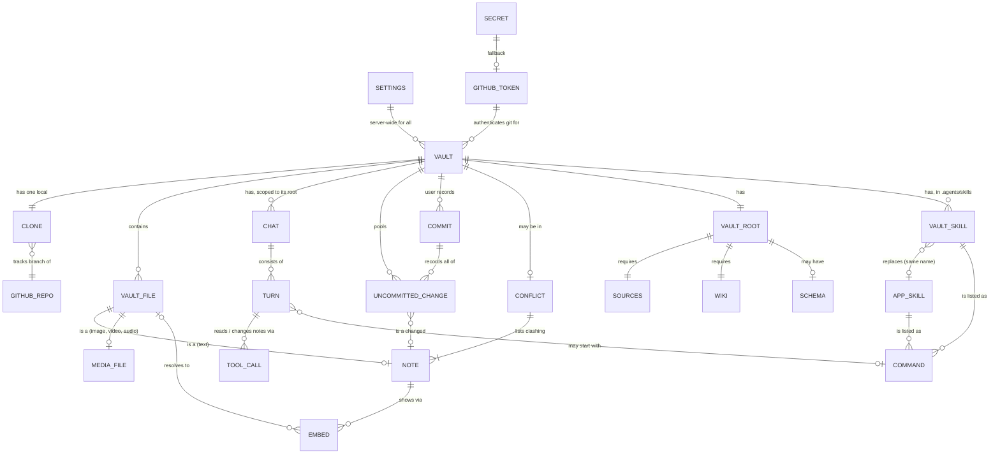

- **Settings** are server-wide: the commit reminder threshold and the **model** (`provider/model`, default
  `anthropic/claude-sonnet-5`). There is no per-chat model. The **GitHub token** is managed next to them but is
  stored separately from them (never part of `Settings`).
- The **GitHub token** is optional in the app: with none set, the deployment's `GITHUB_TOKEN` secret is used.
  Removing the stored token falls back to the secret again. A token changed in the app applies to the next git
  operation without a restart. There is one token for all vaults; one per owner would be the follow-up if vaults ever
  span several owners (a fine-grained token covers one owner's repos).
- A **vault** is identified by a slug `id`, and configured by `name`, `repo` (`owner/name`), `branch` and `root`.
  The same repo + branch + root can't be added twice, also not while the first add's preflight is still running.
  A vault exists in the config only after its attach preflight passed and, if folders were missing, the user agreed
  to create them.
- A **vault file** is identified by its path relative to the vault root; dot-files and `.git` are never listed.

### Media kinds

Modeled on Obsidian's accepted formats, limited to what browsers can play:

| Kind | Extensions | Shown as |
|---|---|---|
| Image | `png` `jpg` `jpeg` `gif` `webp` `avif` `bmp` `svg` | `` (SVG sanitized, only ever inside ``) |
| Video | `mp4` `webm` `mov` `m4v` `ogv` | `<video controls playsinline>` |
| Audio | `mp3` `m4a` `wav` `ogg` `flac` `opus` | `<audio controls>` |
| PDF | `pdf` | File card with **Open** (new tab) and **Download** |
| Anything else non-text | | File card with **Download** |

### Where an upload lands

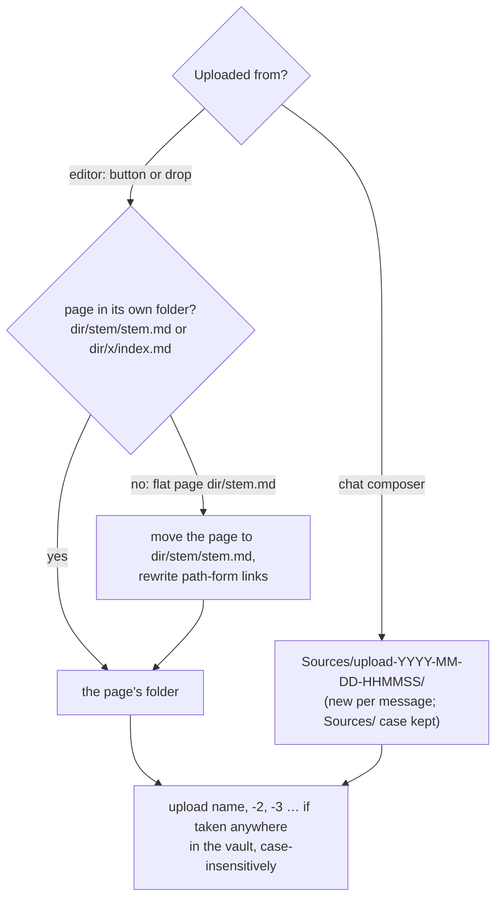

Images a moved page already embeds stay where they are: bare embeds find them by name, relative ones get one `../`
more.

## Actors

| Actor | What it can do |
|---|---|
| **Operator** (the same person as the user, on the Mac) | Cuts releases, deploys them to the targets, holds the vault passwords (Keychain) and gets the alerts. |
| **User** (single person, holds the bearer token) | Manage vaults and settings, read and edit notes, upload photos and PDFs (button or drop; the first upload to a flat page moves it into its own folder), attach them to prompts, search, chat with the AI, review diffs, discard, commit and push, resolve conflicts. Uses the app as a PWA on phone, iPad and desktop. |
| **AI** (opencode agent, on the user's behalf) | Inside one vault root only: read notes; write notes unless the vault is in conflict (then read-only); open one note in the user's editor when the user asks to see it (also in conflict). Receives attached images and PDFs as message content when its model reads them. With Web access on: web search, and web fetch of known URLs (also in conflict). Follows a command's instructions; in a research plan turn it scouts only a little and stops for the user's reply. Offers a known URL to the user as an Open chip when asked to show a page (also with Web access off and in conflict). It can't run shell commands (a skill's shell snippets are never run), fetch or offer URLs it built itself, reach internal hosts, read `.env` files, edit `.git` or harness config, create binary files, commit or push. |
| **Vault author** (whoever pushes to the repo) | Adds commands by adding skills to `.agents/skills/` (or to `.claude/`, which the agents move picks up on the next pull). A skill is instructions for the AI, not code. |
| **User's browser** | Loads a page the user opened from an Open chip, with the user's own cookies and network. |
| **Device (iOS)** | Converts HEIC photos to JPEG when the picker's accepted types are an explicit list without HEIC. |
| **Search backend (Exa)** | Receives the AI's web search queries; returns results. |
| **Public web** | Serves fetched pages; untrusted. |
| **Obsidian / other git clients** | Change the same GitHub repo from other devices; their changes arrive on the next pull and can cause a conflict. |
| **GitHub** | Hosts the vault repos; the backend clones, fetches and pushes with the GitHub token, and asks `GET /user` to test it. |
| **LLM provider** (e.g. Anthropic; Ollama in dev) | Runs the model behind opencode. Sees the prompts, the note content the AI reads, and every image or PDF the user attaches or the AI reads. |

## Processes

### Attach a vault

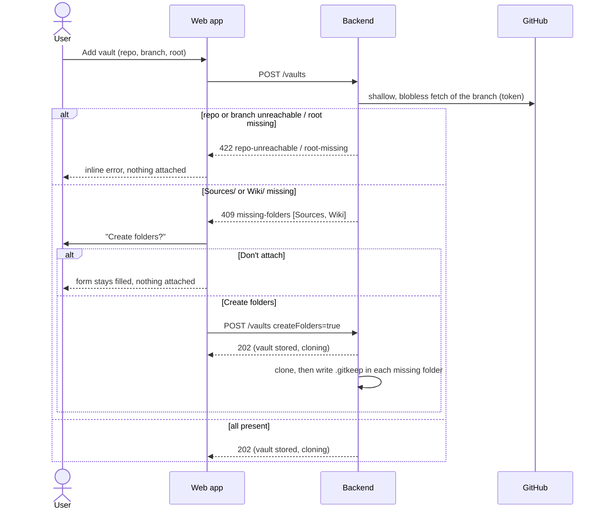

The created folders are uncommitted changes until the user commits (ADR 0001). A failure after the preflight (network
drop, disk full) is a normal `clone-failed` vault with Retry and Edit.

### Edit a note

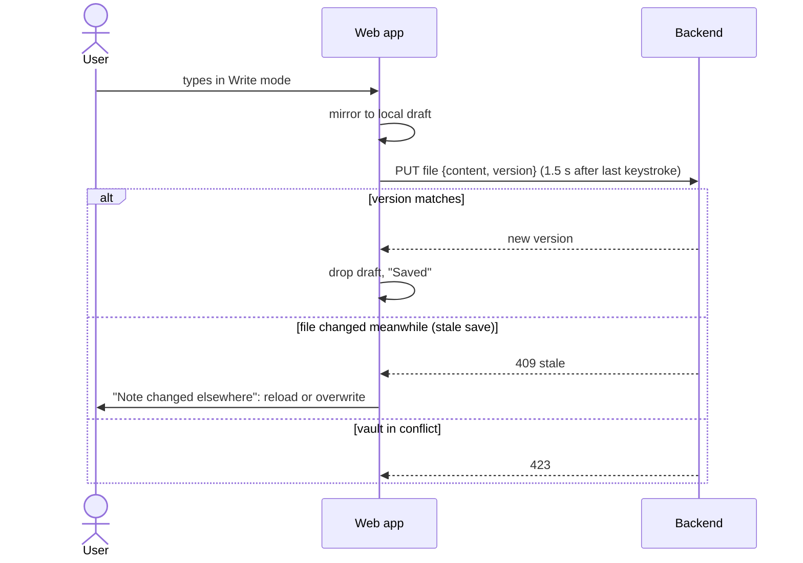

### Resolve an embed

The same rules Obsidian uses. The wikilink form resolves like a `[[link]]` (the target keeps its extension); the
Markdown form is a path relative to the note.

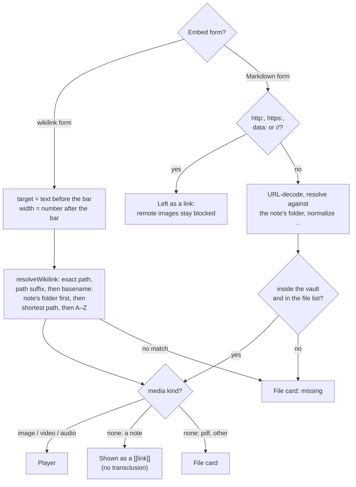

In chat there is no note path: relative paths resolve from the vault root.

### Show a media file

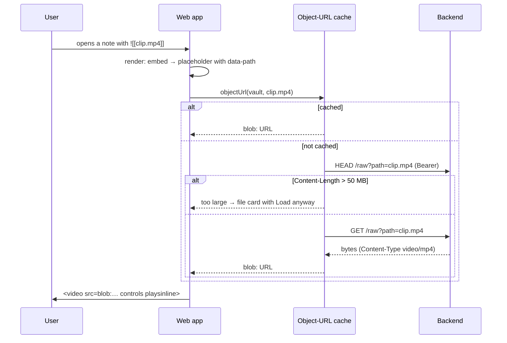

### The mode preference

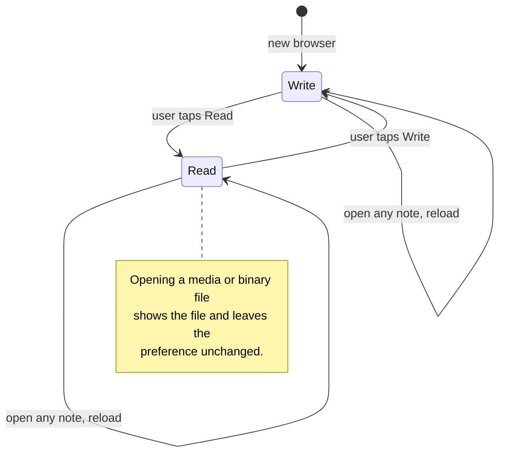

No navigation changes the mode; only the Write/Read toggle does.

### AI turn

1. The user sends a prompt; the backend queues the turn (one running turn per vault; the queue survives restarts).
2. Before the turn starts the backend **pulls** under an exclusive lock, then downgrades to a shared lock without
   letting any other git operation in between.
3. opencode runs the turn with the `vault` agent (or `vault-readonly` while in conflict). Reads and writes stream to
   the UI as tool chips; written paths join the AI-touched set. An **open request** (`open_note`) that completes
   opens the note in the editor: on the wide layout right away, on a phone or in the tablet overlay when the turn
   ends (only the last one of the turn); while the user is editing, a notice and the "opened" chip show it instead.
4. With **Web access** on, the turn may also web search and web fetch known URLs through the egress proxy; each
   call streams as a web chip. A fetch of an unknown URL fails as a tool error and the turn goes on.
5. The lock is released when opencode reports the session idle. Changes stay uncommitted.

A prompt that starts with the name of one of the vault's commands is a **command turn** ([below](#command-turn)); the
`open_url` tool offers a page the same way `open_note` opens a note, but only on a tap ([Link offer](#link-offer)).

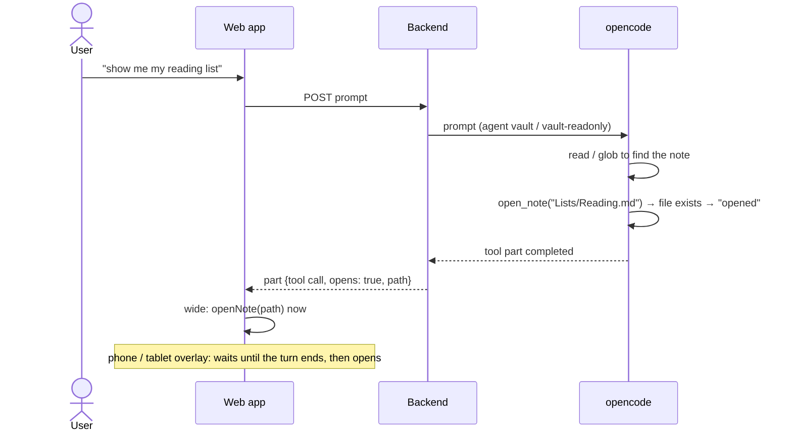

### Command turn

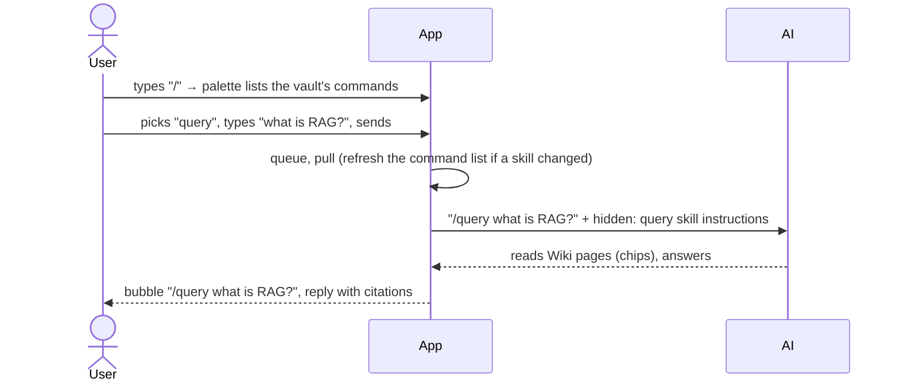

The text must start with `/name` and `name` must be in the vault's command list; `$1`…`$N` and `$ARGUMENTS` in the
skill take the words after the name. The skill's text is sent as written: shell snippets (`` !`…` ``) and `@file`
references in it stay plain text.

### Research run

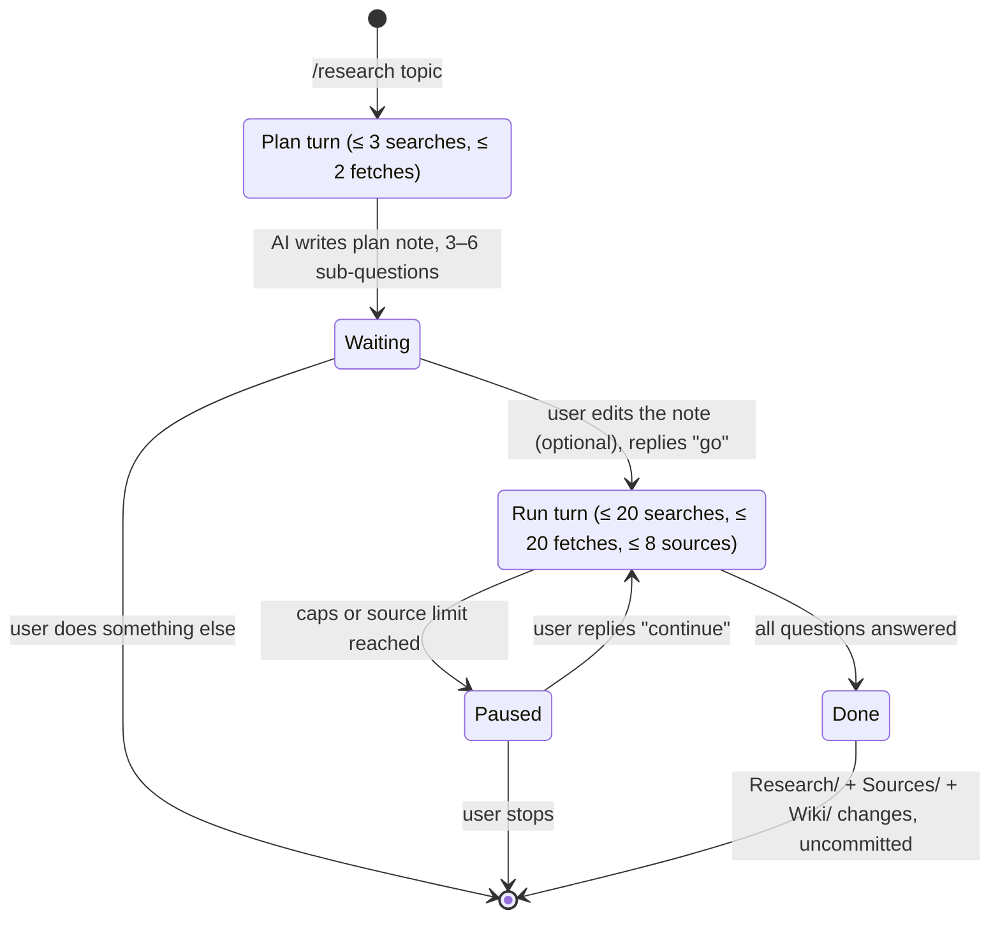

`/research <plan note or its topic>` skips the plan and resumes in any chat. The run leaves a plan note
(`Research/…`, questions ticked, linking the answering pages), source files (`Sources/…`, with `url`) and wiki pages
citing them, all uncommitted for the user's review. The app never asks for approval inside a turn: the user's next
message is the confirmation.

### Agents move

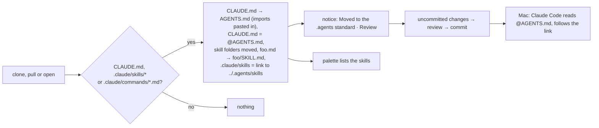

A name present in both places is not moved; the notice lists it. `.claude/commands/` is removed only when every file in
it was moved. Files pasted into `AGENTS.md` stay where they are; the notice offers deleting them. A gitignored file is
never pasted (`AGENTS.md` gets committed). Discarding the changes undoes the move until the next pull.

### Link offer

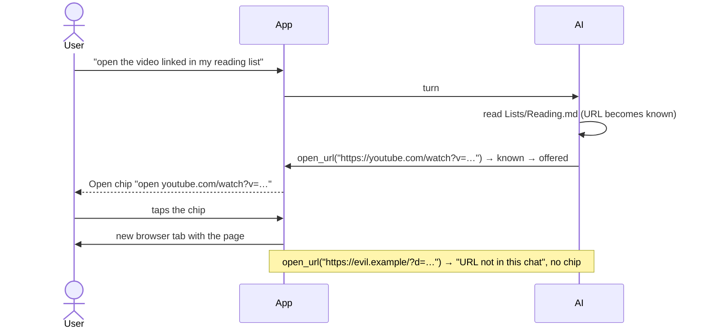

| | Fetched chip (`webfetch`) | Open chip (`open_url`) |
|---|---|---|
| What happens | The server downloads the page into the chat (up to 5 MB) | Nothing is downloaded; the user's browser opens the page on tap |
| Needs Web access | yes | no |
| Counts against the fetch cap | yes | no |
| Pages behind a login, videos, apps | fail or come back empty | open with the user's own browser session |
| URL rule | known URL | known URL |

### Commit

1. The user opens the commit dialog; the app flushes the open note and asks for a proposed message (a tool-less AI
   agent, 15 s timeout, fallback "Update N files").
2. The backend takes the exclusive lock, **pulls**, checks that the set of changed paths is still the one the user
   reviewed (else 409 `changes-moved`), commits everything in the vault root (with the AI trailer if needed) and pushes.
3. A failed push leaves an **unpushed commit**, retried on the next pull or by the user.

### Pull and conflict

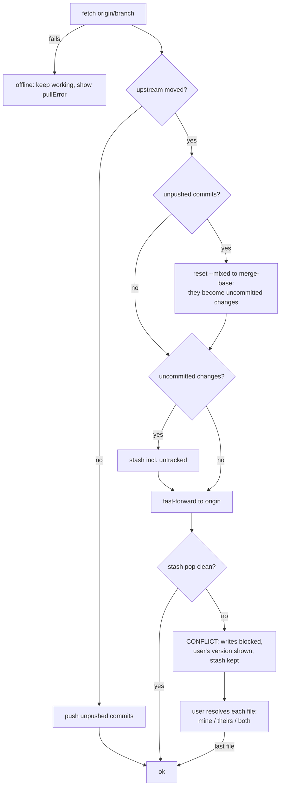

**Counts on both sides.** The pill's three numbers are independent: "N uncommitted" (files, working tree vs HEAD),
"N unpushed" (commits in HEAD, not on GitHub) and "N incoming" (files GitHub changed since the shared commit, as of
the last fetch). Files, not commits, so Obsidian Git's frequent auto-commits to five notes read "5 incoming".

| Situation | Pill | A tap on "incoming" |
|---|---|---|
| Clean, GitHub moved on | `● All committed · 2 incoming` | Fast-forward. |
| Uncommitted changes, GitHub moved on | `● 3 uncommitted · 2 incoming` | Stash, fast-forward, re-apply; a clash → conflict. |
| Unpushed commit, diverged | `● All committed · 1 unpushed · 2 incoming` | The unpushed commit becomes uncommitted changes, then as above. |
| GitHub changed only files outside a subfolder vault root | no segment | Nothing; the next pull brings them in silently. |
| Fetch failed | last count, `· offline` | The pull fails too and keeps `· offline`. |
| Conflict | `● Conflict` | Segment hidden; resolve first. |
| AI turn running | `● AI working… · 2 incoming` | Disabled; the turn's own pull takes them in. |

**Background fetch.**

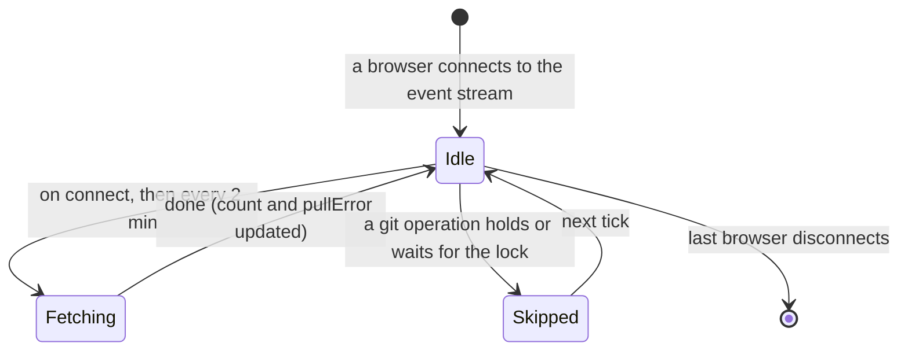

- Only while someone looks: per vault, while at least one browser is connected to its event stream. The app connects
  only to the active vault, and reconnects when it comes to the foreground or back online; each connect fetches once.
- Never in the way: it runs next to saves and AI turns, skips while a git operation holds or waits for the vault, and
  doesn't change `busy`. At most one per vault at a time; a connect during a fetch joins it.

**The user's pull.** A tap on the incoming count first saves the open note's pending text, then runs the same pull as
open, commit and turn (one pull for a double tap). It is refused during a conflict (423) and not offered during an AI
turn. A success toasts "Pulled N changes from GitHub"; changed files reload through the usual file events.

"Both" keeps the user's version at the path and writes GitHub's next to it as `<name>.conflict-YYYY-MM-DD.md`.

## Rules and constraints

- **The AI never commits or pushes** ([ADR 0001](../../docs/adr/0001-user-triggered-commits.md)); only the user's
  commit does, and it records **all** uncommitted changes of the vault root (no partial staging).
- **Everything is scoped to the vault root:** file access, search, git status/diff/add, and the AI's session
  directory. Changes outside the root are invisible.
- **Conflict blocks writes:** saves, deletes, discards, commits, uploads, moves and the user's pull are refused (423);
  AI turns run read-only; repo, branch or root changes and vault removal are refused.
- **A fetch never changes the vault's files,** its uncommitted changes, its unpushed commits or its conflict state;
  only a pull does. **No automatic pull,** not even on a clean tree: a background fetch only updates the incoming
  count, and a file never changes under the reader's eyes without a tap (or open, commit, turn).
- **The incoming count is GitHub's side only:** files inside the vault root that GitHub's branch changed since the last
  commit it shares with HEAD; unpushed commits and uncommitted changes don't change it. Offline keeps the last count.
- **The open note warns when it is incoming** ("Changed on GitHub · Pull" above the editor); editing stays allowed,
  the pull's conflict flow protects the text.
- **Optimistic concurrency everywhere:** saves, deletes and discards carry the file version they started from; a
  commit carries the paths the user reviewed.
- **No data loss on pull:** unpushed commits are folded back into uncommitted changes; during a conflict the stash is
  kept until every file is resolved.
- **A vault is attached only after a passing preflight.** Unreachable repo or branch and a missing vault root are
  refused and nothing is stored. Missing `Sources/` / `Wiki/` are created only with the user's consent, as uncommitted
  placeholders. Changing repo, branch or root of an existing vault (PATCH) has no preflight.
- **Removing a vault deletes only the local clone** (never the GitHub repo) and requires no uncommitted changes and no
  unpushed commits. Changing repo, branch or root has the same precondition.
- **New file names** may not contain `<>:"|?*\` or control characters, may not be Windows-reserved names, end in a dot
  or space, differ from an existing file only by case, or be harness config. Upload names also avoid `#^[]|` (they
  break wikilinks) and leading dots.
- **Chat is disabled** in vaults that contain harness config.
- **The AI opens a note only when the user asks to see it**, never on its own after writing. Any file the file tree
  lists can be opened (media files in the media view, other binaries as a file card); dot-paths and `.git` can't. Opening is not a change: it never
  joins the AI-touched set and works during a conflict.
- **One live open moves the UI once:** a replayed or reloaded call doesn't open again; a call that completed while the
  stream was down still opens when the chat reloads. While the user is editing (editor focused or unsaved text), the
  AI never switches the note; a blocked switch (stale save, deleted note) is not retried.
- **The main pane is a per-browser preference:** swapping only moves the two columns (CSS), so a running turn, typed
  text, focus, scroll and undo history survive; closing the chat or leaving the wide layout keeps the preference.
- **An embed never changes the note text.** Write mode shows the embed as a block below its line and keeps the raw
  `![[…]]` text editable. Note transclusion (`![[Other note]]`) renders as a link.
- **Media kind comes from the extension only.** The backend sends the media table's Content-Type with `nosniff`; any
  other file goes out as `application/octet-stream` (PDF as `application/pdf`) with `Content-Disposition: attachment`,
  so the browser never renders it.
- **SVG is only ever shown inside ``** and is sanitized before it becomes a blob URL; its file card downloads it
  and never opens it as a page. **Open** exists only for `.pdf`, as a blob the app typed `application/pdf`.
- **Remote images stay blocked:** `` renders as a link (no tracking pixels from git-sourced notes).
- **Duplicate names:** a basename match prefers the note's own folder, then the shortest path, then A–Z. Embeds and
  `[[links]]` resolve the same way.
- **The width after the bar** (`|300`, `|300x200`, height ignored) applies to images, videos and audio alike; other
  text after the bar is the caption (`alt`).
- **Tapping an embedded image** (Read or Write mode) opens that media file in the note pane; video and audio keep
  their controls.
- **Place:** Back to a note seen in this session returns to where the user left it; switching Write ↔ Read keeps the
  same source line (per top-level block). A new open lands at the top or its hit position.
- **The user may upload images and PDFs** (uploadable files, at most 50 MB), with the button or by dropping them on
  the note. An upload creates a new file and never overwrites one; existing files that aren't notes can't be
  replaced or edited; the AI creates no binary files; pasting images is not built. Offline, nothing can be uploaded
  and media isn't available.
- **A page with attachments lives in its own folder.** The first editor upload to a flat page moves it there and
  rewrites, in the same step, the path-form links to it and the relative links inside it. The move is refused while
  an AI turn runs, or when the target exists or `dir/stem` is a file; a refused move uploads nothing. Every check runs
  before the first write. The app moves pages only in this case; there is no general rename.
- **Editor uploads go next to an existing page:** the target must be an existing `.md`, outside hidden folders, with a
  name every clone can hold. Chat uploads go into a new `Sources/upload-…/` folder per message (`Sources/` matched
  case-insensitively, its spelling kept).
- **Obsidian's settings are not read:** uploads always go to the own folder and are embedded as `![[name]]`.
- **Uploads, moves and rewritten links are the user's uncommitted changes**, never AI-touched; a moved page that was
  AI-touched keeps the mark under its new path.
- **A chat attachment is a path in the vault root,** checked with the raw-file rules (and uploadable, ≤ 20 MB) when
  its turn starts; a missing or refused one ends the turn with an error before anything reaches opencode.
- **Web access off means invisible:** the model sees neither web tool. The commit-message agent never has them.
- **Only known URLs are fetched;** web content never counts as instructions from the user (a rule for us, not a
  promise about the model; the commit review stays the safety net).
- **Vault skill beats app skill, visibly.** On a name clash the vault skill runs; the palette says it replaces
  karpathy.app's skill of that name. Vault and app skills are always marked as such in the UI.
- **One skill folder.** A vault's commands come from `.agents/skills/` only (`.claude/skills/` and Claude Code plugin
  skills are not read; a plugin skill must be copied into the vault). The app moves skills there automatically,
  never over an existing name, and always as uncommitted changes the user reviews.
- **A command is instructions, not code.** The app sends a skill's text to the AI as written; it never uses
  opencode's command endpoint ([ADR 0004](../../docs/adr/0004-commands-as-prompts-not-command-endpoint.md)).
- **A chip or the palette only fills the composer;** sending is the user's tap. A `/word` that is no command of the
  vault is plain text.
- **Research plans before the main run, by instruction.** The plan turn scouts at most 3 searches and 2 fetches,
  writes the plan note and stops; the backend gives a `/research` turn the same tools as any turn, so this rests on the
  model, and the hard bound is the web caps (20 searches, 20 fetches per turn). A run that needs more asks, and only
  the user's reply starts the next turn.
- **Sources keep their URL** and are summaries with short quotes, never full pages.
- **Link offers follow the known-URL rule and need the user's tap.** The AI offers a page only when the user asked
  to see one.
- **Single user:** one bearer token, one git identity, one server-wide model.
