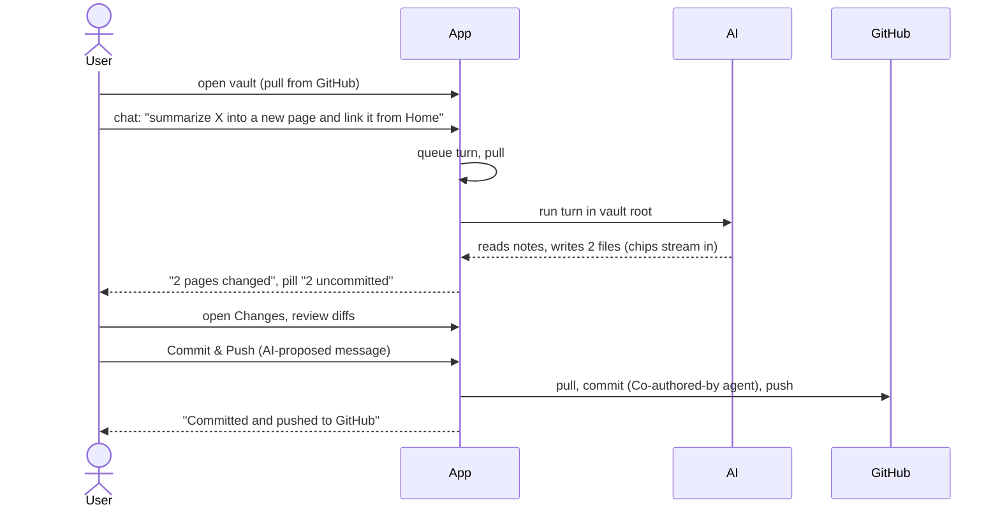
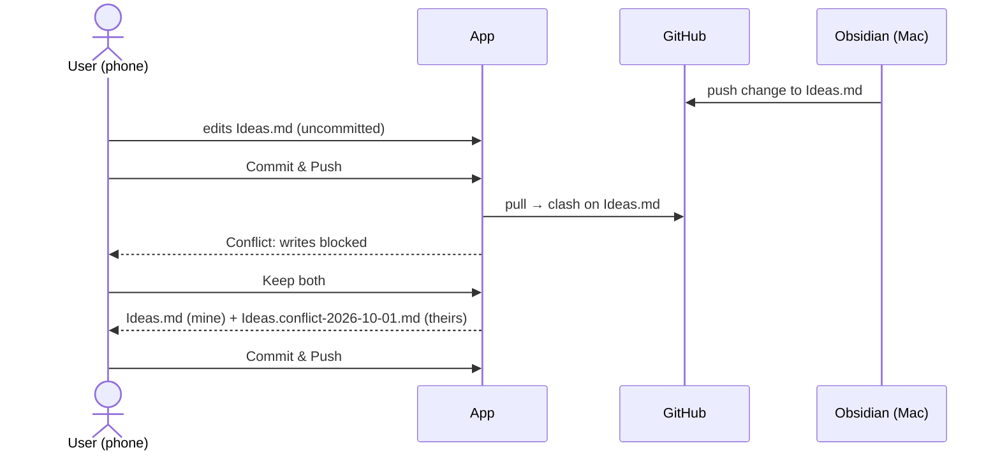
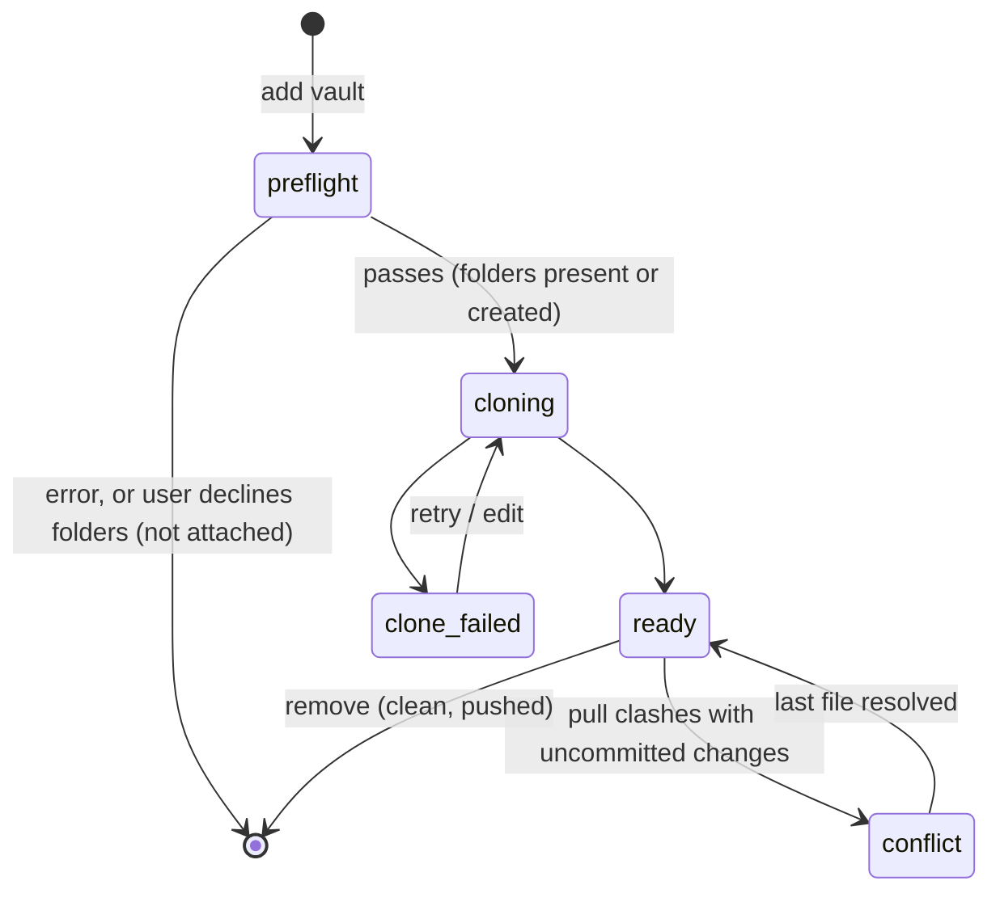
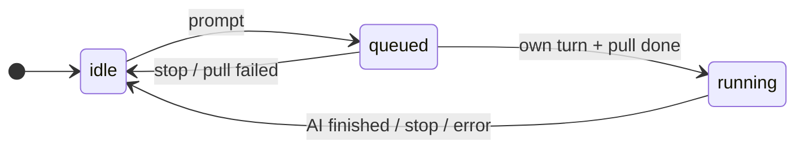

# Functional: karpathy.app

What the user can do, as built on 2026-10-02. What the operator can do (releases, deployments, alerts) is in
[deployment.md](deployment.md). Terms are defined in [domain.md](domain.md).

## Scope

Built up to the MVP milestone **M4**: a chat that reads and writes configured vaults, on mobile, synced through git
(M0 scaffold, M1 vaults and reading, M2 editing and git, M3 AI reads, M4 AI writes). Next is **M5**: the existing
wiki skills usable in the chat ([Skills](#skills)), at least `query` and `lint` on mobile, and at least one
non-Claude model tried.

Next to the app there is a public **website** at https://karpathy.app: one static start page that says what the
app is, that the project ships code and not a running service (self-hosting needs a server, Tailscale and a set of
secrets and keys), and how to ask for a hosted version (mail to the maintainer). It has no login and holds no user
data ([deployment.md › Website](deployment.md#website)).

Deliberately not built: an Obsidian clone (no graph view, plugins or canvas), multiple users or real-time
collaboration, a sync protocol of its own, offline AI, creating GitHub repos from the app.

## Features

### Access

- **Token screen:** one password field; the token is checked against `/api/health` and stored on the device only.
  Any 401 later drops the token and the offline note cache and shows the screen again.
- **Login link and QR code:** opening `<app url>/#token=…` stores the token and removes it from the URL and the
  history before anything else runs. The token screen's **Scan QR code** reads that link with the camera, for the
  home-screen app on iOS, which doesn't share Safari's storage. The operator gets the QR code from
  `just token <target> --qr`.
- **Version:** the settings dialog shows the server's and the loaded PWA's version (`dev` for local builds), so
  after a deploy you see whether the new release and its service worker are live; for a release also when it was
  **Built** and **Deployed** (local date and time).
- **PWA:** installable (standalone, app icons); updates itself when a new version is deployed, re-checking whenever
  the app comes back to the foreground.

### Vaults and settings (admin modal "Vaults & settings")

The modal has four views, switched inside it (no router). Every view but the list has an "All vaults" back button.

- **Vault list** (opens first): one row per vault with name, `repo · branch · /root` and the state badge; a row opens
  its details. Below: **Add vault** and **Settings**. A `(?)` button next to "Vaults" opens **What is a vault?**: a
  short explanation of `Sources/` (immutable source documents), `Wiki/` (the AI-maintained knowledge base) and optional
  `Schema/` (instructions for the AI), with a folder sketch and the note that the app offers to create missing folders.
  "Edit vault" in the note pane and the changes panel (vault not cloned) opens that vault's details directly.
- **Vault details:** the edit fields, **Retry** and **Remove** for one vault.
  - **Edit vault:** name any time; repo, branch or root only when the vault has no uncommitted changes and no unpushed
    commits.
  - **Remove vault:** deletes the local clone only, never the GitHub repo; same precondition. Returns to the list.
- **Add vault:** name, GitHub repo `owner/name`, branch (default `main`), optional vault root. The button reads
  "Checking the repo…" while the backend checks the repo first (see [Checked attach](#checked-attach)); the vault is
  stored and clones in the background only if the check passes (list refreshes every 2 s). A failure after the check
  shows the git error with **Retry** and **Edit**.
- **Switch vault** from the vault menu (shows `name · branch`); the open note is saved first.
- **Settings** view, in three groups:
  - **GitHub:** the server-wide token ([GitHub token](#github-token)).
  - **App:** commit reminder threshold (1–1000 changed files), the model (`provider/model`, server-wide; the
    server rejects models opencode doesn't offer) and the **Web access** switch (on by default, for all vaults: "Lets
    the AI search the web (via Exa) and read pages you or it found. Each search and page is shown in the chat.").
  - **Version:** server and PWA version, Built and Deployed.

#### Checked attach

Adding a vault never leaves a half-attached vault behind. The backend first looks at the repo with the GitHub token:

- **Repo or branch unreachable** (typo, no access, no such branch) or **vault root missing:** an inline error under
  the form with the reason; nothing is stored or cloned.
- **`Sources/` or `Wiki/` missing** (names match case-insensitively; a file with that name counts as missing): a dialog
  "Create folders?" naming the missing ones. **Create folders** attaches the vault and, once cloned, creates each as an
  empty `.gitkeep` placeholder; they show up in the changes list as uncommitted until the next Commit & Push, and the
  empty folders appear in the file tree. **Don't attach** closes the dialog, keeps the form filled and stores nothing.
- **All present:** the vault attaches straight away.
- The same repo + branch + root can't be added twice, also not at the same time ("is being added already").

Not checked: changing repo, branch or root of an existing vault, and the structure of vaults that are already attached.
`Schema/` is never created or required.

#### GitHub token

One token is used for every vault. It is set in Settings, so rotating an expired token needs no SSH and no restart; it
applies to the next git operation. The deployment's `GITHUB_TOKEN` secret stays the fallback.

- **Field:** a password field. Its placeholder shows the state: "No token set", "Using the server’s token •••• abcd"
  (the secret) or "•••• abcd" (set in the app); the token itself is never shown again.
- **Save token** (enabled when the field is non-empty) stores it; **Remove** (only when one is set in the app) deletes it
  and falls back to the server's secret. A token must be 20–255 characters without spaces.
- **Test token** checks the typed token if the field is non-empty, else the stored one, without saving: a line "Works —
  signed in as `login`, expires YYYY-MM-DD" (expiry only if GitHub reports it) or the error ("GitHub rejected the token
  (401).", "GitHub is not reachable from the server right now."), plus one line per vault: the repo with a check mark,
  or why that vault's repo or branch isn't reachable with this token. Typing in the field clears the result.

### Notes

- **File tree:** folders first, alphabetical, collapsed by default, expansion remembered per vault; `.md` hidden in
  names; dot-files never shown. The open note's folders open and its row scrolls into view.
- **Create a note** (path prompt, `.md` added if missing, starts as `# <title>`). Refused for existing names, names
  that differ only by case, and invalid names.
- **Delete a note** (recoverable until the next commit). On a media or binary file the button says "Delete file".
- **Write mode** (default for a new browser): Markdown with live preview, frontmatter shown as a block,
  find-in-note; embeds show as a block below their line, the `![[…]]` text stays editable.
- **Read mode:** rendered, sanitized Markdown of the note's current text; frontmatter as a properties table, where
  `related` / `sources` values that name a note are links. Obsidian syntax: callouts `> [!type] Title`, `==highlight==`,
  `%%comments%%` hidden, footnotes, task markers ☑ / ☐, media embeds (below), `![[note]]` as a link (no
  transclusion).
- **Sticky mode:** the Write/Read mode the user last chose holds for every note opened afterwards (tree, search,
  links, chat chips, AI opens) and after a reload, per browser. Opening a media or binary file doesn't change it.
- **Media embeds** `![[photo.png]]`, `![[clip.mp4|300]]` (width in px, any media kind), ``: images,
  videos (inline, also on iPhone) and audio show in Read mode, in Write mode and in chat replies. PDFs and other files
  show a file card (name, size, Download; Open for a PDF, in the browser's viewer in a new tab). Media over 50 MB shows
  **Load anyway (N MB)**; a missing target shows a "missing" card; offline shows an "offline" card. Remote images
  (`https://…`) stay links. A skeleton holds the space while bytes load. Tapping an image opens it in the note pane.
- **Media view:** opening an image, video or audio file from the tree (or a tapped image) shows it in the note pane;
  a PDF or other binary file shows its file card. No mode toggle, no find-in-note; Delete stays.
- **Search hit and `[[note#heading]]` in Read mode** scroll to the rendered block that holds the line and highlight it
  briefly.
- **Place:** Back returns to where you left a note seen in this session (also after an image or link); switching
  Write ↔ Read keeps the place.
  Wide tables scroll sideways. Links: wikilinks carry the note's route (new tab and copy link work), relative Markdown
  links to vault notes open in the app, external links open in a new tab.
- **Wikilinks** `[[target#heading|alias]]`: click to open (resolved by path, then path suffix, then file name
  anywhere; with duplicate names the note's own folder wins, then the shortest path, then A–Z); links to missing pages
  are marked and say "No page “X” yet".
- **Autosave** 1.5 s after the last edit; local drafts survive reloads and crashes; status footer
  "Saving…" / "● Unsaved changes" / "Saved".
- **Live updates:** a note changed by the AI or a pull reloads silently if it has no unsaved changes; a deleted note
  shows "Keep as new note" / "Close".

### Search

Full-text, case-insensitive, fixed-string search over the vault root (ripgrep), plus file-name matches; results
grouped per note with up to 4 line snippets; capped at 200 hits ("refine your search"); opens the note at the hit, in the current mode.
Several words find notes that contain all of them (in the text or the path) and show the lines of any of them; a
`"quoted phrase"` matches as written (#107). Notes whose file name contains every word come first, the rest in path
order (#99).

### Changes and commits

- **Changes list** with kind (modified, added, deleted, renamed, untracked) and a unified diff per file.
- **Discard** one file's changes (refused if the file changed since the diff was shown).
- **Commit & Push:** proposes a message (AI, falls back to "Update N files"), editable; commits all uncommitted
  changes of the vault root and pushes. If new changes arrived since the review, the commit is refused with the list.
- **Unpushed commits:** "N unpushed commits · retry".
- **Commit reminder** when changes pass the threshold: "Later" brings it back at 2× the threshold, a second "Later"
  silences it until the count drops again.
- **Git status pill:** "Conflict" / "Syncing…" / "AI working…" / "N uncommitted" / "All committed", plus
  "· N unpushed" and "· offline".

### Conflicts

When a pull clashes with uncommitted changes: a banner says writes are blocked; each clashing file shows a line diff
of GitHub's version vs. the app's (or "deleted on GitHub / in this app"), with **Keep mine / Keep theirs / Keep both**
(default both) and a larger compare view. The vault returns to normal after the last file is resolved.

### Chat with the AI

- **Swap note and chat** (wide layout, chat open): the round ⇄ button on the divider at the top puts the chat in the
  large main column and the note in the 380 px side column, and back. Nothing is lost on a swap (streaming, typed
  text, cursor, scroll, undo); the browser remembers the choice across reloads; closing the chat keeps it.
- **Chat list** per vault (full first-prompt title, cut by the column width with the full title as tooltip;
  running/queued marker, time; delete); **new chat**; **resume** any chat, also on
  another device mid-turn.
- **Send** (Enter; Shift+Enter for a newline) and **Stop**. One turn runs per vault at a time; others wait
  ("Waiting for other chat…" / "Waiting for sync…").
- **Streaming reply** with Markdown and wikilinks, collapsible "Thinking", **tool chips** for files read, changed and
  opened (changed and opened ones open the note; long paths end in "…", the full path is the tooltip), and a footer
  listing the changed pages. A chat scrolled to the end stays at the end when its width changes.
- **The AI opens notes** when asked ("show me my reading list"): on the wide layout right away, on a phone or in the
  tablet overlay when the reply is done, never while the user is editing (then a notice "AI opened …" and the chip).
  Reloading a chat never reopens anything; a wrong path goes back to the AI as a tool error. Works in conflict too.
- **Web search and web fetch** (with Web access on): "What's new in X?" searches the web (Exa); "summarize the link
  in this note" or a pasted URL is fetched. Each call is a chip: `searched the web: "<query>"` (a label) and
  `fetched <host/path>` (a link to the page, new tab). The AI may fetch only a URL that already appears in the chat
  (the user's messages, notes it read, earlier results); any other URL fails with "URL not in this chat: paste it into
  the chat first", and the turn goes on. At most 20 searches and 20 fetches per turn. Fetched pages stay in the chat;
  they reach the vault only if the AI writes about them. With Web access off, the AI has neither tool.
- **Read-only while in conflict** ("the AI can only read, not change notes"); web search and fetch still work.
- The AI can read and edit notes in the vault root only; its changes are uncommitted until the user commits.

### Skills

opencode loads the vault's own `AGENTS.md` (or `CLAUDE.md`, walking up from the vault root) and `.claude/skills`, so
wiki skills (`query`, `lint`, `ingest`, …) written for Claude Code are offered in the chat. Whether one works depends
on what it needs:

- **Only file tools** (read, search, write notes): works, within the vault root.
- **Web** (search, reading a URL from a note or the prompt): works with Web access on, within the known-URL rule
  and the per-turn caps.
- **Shell** (Python scripts such as `film-import.py`, `rg` via bash): doesn't work, because `bash` is denied. Making
  it work needs Python in the opencode image and a bash command allowlist re-checked against the leaks in
  [security.md](security.md#confining-the-ai).
- **Credentials** (`ingest-email` with Gmail, the Instagram scraper): need secrets for the opencode service and
  network access; not set up.
- **Steps that commit or push:** never run (the AI can't commit); such steps must be dropped from the skill.
- **Global instructions:** `~/.claude/CLAUDE.md` and hooks such as RTK don't travel; anything a skill relies on must
  be in the vault repo, and every file it reads must lie inside the vault root.
- Skills written for Claude Code may name Claude Code tools or frontmatter fields, and tool calling varies a lot by
  model; each skill needs a check under opencode with the configured model.

## User journeys

### Ask the AI to update notes, then commit

### Edit on the phone while Obsidian changes the same note

## Inputs and outputs

| In | Out |
|---|---|
| Bearer token (once per device) | — |
| Vault config: repo, branch, root, name (+ "create folders" yes/no) | A cloned vault, an inline error, or the missing-folders question; a clone error after the check |
| GitHub token (typed, to save or to test) | Masked state (last 4), token test result per account and vault |
| Note text (Markdown, any UTF-8 text file) | Saved file + new version; rendered HTML in Read mode |
| Media and other files in the vault (read-only) | Images, video and audio players; file cards with Open (PDF) / Download |
| Search query | Grouped hits with line snippets |
| Chat prompt | Streamed reply, tool chips, changed notes |
| Commit message | Commit on GitHub (or an unpushed commit), toast |
| Conflict choice per file | Resolved file(s), possibly a `.conflict-<date>` copy |
| Settings: reminder threshold, model, Web access | — |
| URLs in prompts and notes, web search queries (AI) | Web chips; pages and results in the chat only |

No uploads (also no pasting images), exports, e-mail or push notifications.

## States and transitions

Note save: Saved → Unsaved changes → Saving… → Saved, with side states *retrying*, *stale* (dialog: reload or
overwrite) and *deleted* (banner).

## Permissions and visibility

Single user: whoever has the bearer token can do everything. There are no roles, no sharing and no per-vault
permissions. The AI's permissions are fixed in the managed opencode config ([architecture.md](architecture.md#opencode-deployopencode)).

## Edge cases and known limitations

- **Offline:** read-only. Cached vault list, trees and previously opened notes are shown; edits are kept as local
  drafts and saved when back online; search and chat are unavailable.
- Created `Sources/` / `Wiki/` are never committed for the user, and `Schema/` is never created. A repo where a
  required folder exists only under another name (not just another case) gets a new, empty one.
- The token test shows an expiry only for tokens GitHub reports one for, and scopes only for classic tokens (the app
  doesn't display scopes today). A tested token is not saved.
- **No rename or move** of notes or folders, no explicit folder creation, no manual pull button, no per-chat model,
  no chat rename, no global keyboard shortcuts.
- Native `prompt()` / `confirm()` dialogs for new note, delete, discard, remove vault and delete chat.
- Chat is disabled in vaults that contain `.opencode/`, `opencode.json` or `opencode.jsonc`.
- A save on page exit only works for notes under about 60 KB (browser keepalive limit); the local draft covers the rest.
- Search skips files ignored by `.gitignore` and hidden files; capped at 200 hits.
- Vaults are full clones; there is no disk-space check before adding a vault and no per-file size limit.
- Push failures aren't retried in the background, only on the next pull, commit or "retry".
- The frontmatter properties table understands simple YAML only; other values are shown raw.
- The offline cache has no automated test in WebKit (Playwright's offline WebKit fails even service-worker-served
  requests); on iPhone/iPad it needs a check by hand.
- **Media:** fetched whole before it shows (no streaming; the bearer token can't ride on ``), so seeking
  works only after the download. Not in the offline cache. Some codecs (HEVC `.mov` in Chromium, `.mkv`) don't play;
  the player shows its error. PDFs aren't shown inline. **Open** in the installed iOS home-screen app is checked by
  hand only. Note transclusion (`![[Other note]]`) and remote images aren't shown.
- **Web access:** a URL the AI builds itself (e.g. adds a query) can't be fetched: the user pastes it. A link deep in a
  long, truncated page isn't known either. Without `EXA_API_KEY`, search uses Exa's rate-limited anonymous endpoint.
  Changing the web caps needs an opencode restart or redeploy.
- A retryable provider error is retried by opencode for up to about 2 minutes before the turn fails.
- With the chat in main, Tab still reaches the note before the chat (the swap moves columns visually only). At
  1024–1279 px with the sidebar open, the main column (364 px) is narrower than the side column.
- An AI open that waits for the turn end (phone, tablet overlay) is lost on a page reload or when the user leaves the
  chat view first; the "opened" chip still leads there. A switch blocked by a stale save or a deleted note is not
  retried.
