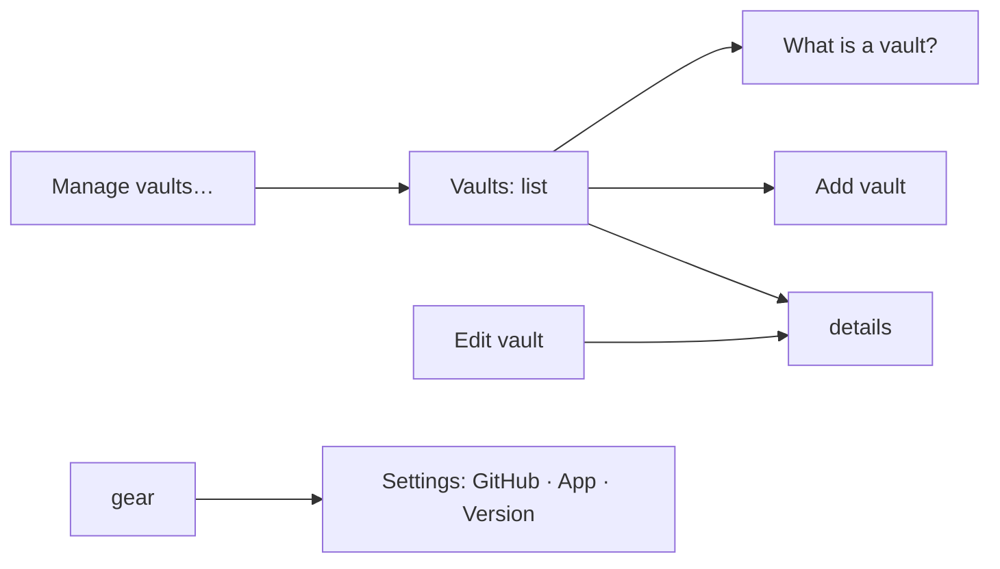
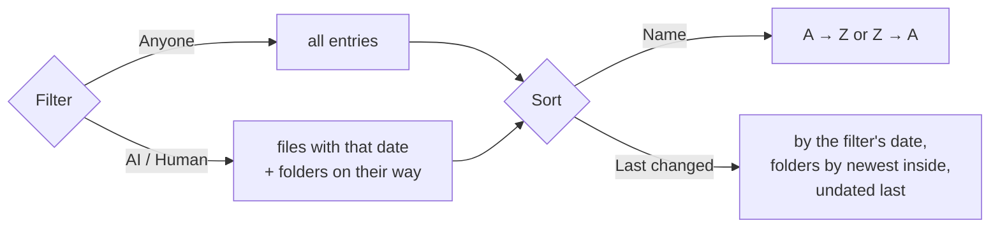
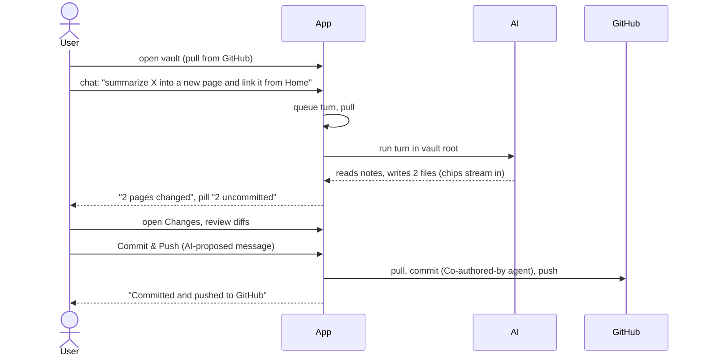
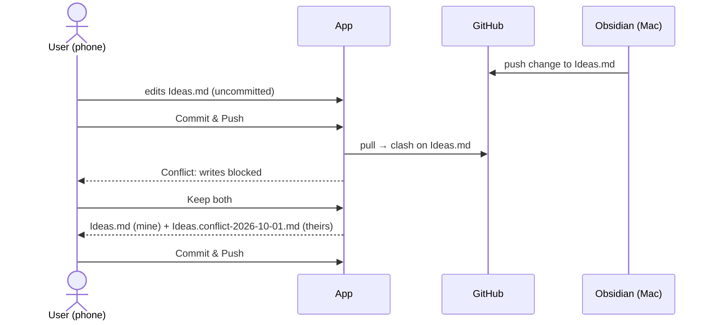
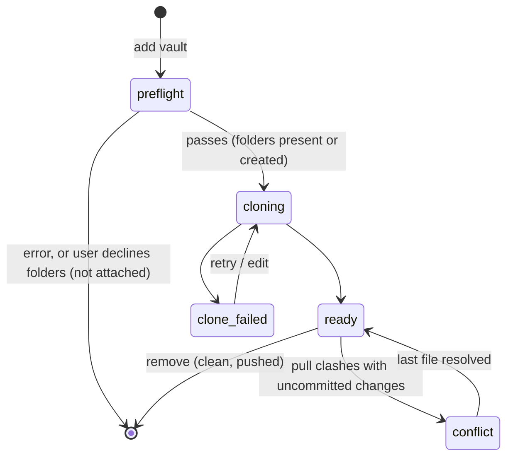
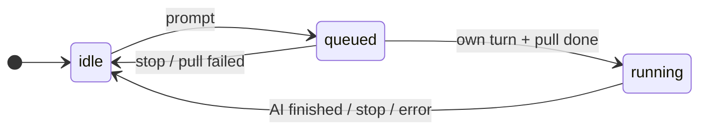

# Functional: karpathy.app

What the user can do, as built on 2026-10-02. What the operator can do (releases, deployments, alerts) is in
[deployment.md](deployment.md). Terms are defined in [domain.md](domain.md).

## Scope

Built up to the MVP milestone **M4**: a chat that reads and writes configured vaults, on mobile, synced through git
(M0 scaffold, M1 vaults and reading, M2 editing and git, M3 AI reads, M4 AI writes). Next is **M5**: the existing
wiki skills usable in the chat ([Skills](#skills)), at least `query` and `lint` on mobile, and at least one
non-Claude model tried. The chat part of it is built: skills in `.agents/skills/` start with `/name` (palette and chips); the
skills that need shell or credentials are not.

Next to the app there is a public **website** at https://karpathy.app: one static start page that says what the
app is, that the project ships code and not a running service (self-hosting needs a server, Tailscale and a set of
secrets and keys), and how to ask for a hosted version (mail to the maintainer). It has no login and holds no user
data ([deployment.md › Website](deployment.md#website)).

Deliberately not built: an Obsidian clone (no plugins or canvas; the graph is a view, not an editor), multiple users or real-time
collaboration, a sync protocol of its own, offline AI, creating GitHub repos from the app.

## Features

### Access

- **Token screen:** one password field; the token is checked against `/api/health` and stored on the device only.
  Any 401 later drops the token and the offline note cache and shows the screen again.
- **Login link and QR code:** opening `<app url>/#token=…` stores the token and removes it from the URL and the
  history before anything else runs. The token screen's **Scan QR code** reads that link with the camera, for the
  home-screen app on iOS, which doesn't share Safari's storage. The operator gets the QR code from
  `just token <target> --qr`.
- **Version:** the settings dialog shows the server's and the loaded PWA's version (`dev` for local builds), so
  after a deploy you see whether the new release and its service worker are live; for a release also when it was
  **Built** and **Deployed** (local date and time).
- **PWA:** installable (standalone, app icons); updates itself when a new version is deployed, re-checking whenever
  the app comes back to the foreground.

### Vaults and settings (two dialogs: "Vaults" and "Settings")

Vault management and settings are separate dialogs, one per entry point:

| Entry point | Opens |
|---|---|
| Vault menu → **Manage vaults…** ("Add / configure GitHub repos") | **Vaults** dialog, on the vault list |
| **Edit vault** (note pane, changes panel) | **Vaults** dialog, on that vault's details |
| Sidebar **gear** (tooltip "Settings") | **Settings** dialog |

The Vaults dialog holds nothing that applies to every vault; the Settings dialog holds nothing per vault.



The **Vaults** dialog has three views, switched inside it (no router). Details and Add vault have an "All vaults" back
button to the list.

- **Vault list** (opens first): one row per vault with name, `repo · branch · /root` and the state badge; a row opens
  its details. Below: **Add vault**. A `(?)` button next to "Vaults" opens **What is a vault?**: a
  short explanation of `Sources/` (immutable source documents), `Wiki/` (the AI-maintained knowledge base) and optional
  `Schema/` (instructions for the AI), with a folder sketch and the note that the app offers to create missing folders.
  "Edit vault" in the note pane and the changes panel (vault not cloned) opens that vault's details directly.
- **Vault details:** the edit fields, **Retry** and **Remove** for one vault.
  - **Edit vault:** name any time; repo, branch or root only when the vault has no uncommitted changes and no unpushed
    commits.
  - **Remove vault:** deletes the local clone only, never the GitHub repo; same precondition. Returns to the list.
- **Add vault:** name, GitHub repo `owner/name`, branch (default `main`), optional vault root. The button reads
  "Checking the repo…" while the backend checks the repo first (see [Checked attach](#checked-attach)); the vault is
  stored and clones in the background only if the check passes (list refreshes every 2 s). A failure after the check
  shows the git error with **Retry** and **Edit**.
- **Switch vault** from the vault menu (shows `name · branch`); the open note is saved first.
- **Settings** dialog (the gear; no back button), in three groups:
  - **GitHub:** the server-wide token ([GitHub token](#github-token)).
  - **App:** commit reminder threshold (1–1000 changed files), the model (`provider/model`, server-wide; the
    server rejects models opencode doesn't offer) and the **Web access** switch (on by default, for all vaults: "Lets
    the AI search the web (via Exa) and read pages you or it found. Each search and page is shown in the chat.").
  - **Version:** server and PWA version, Built and Deployed.

#### Checked attach

Adding a vault never leaves a half-attached vault behind. The backend first looks at the repo with the GitHub token:

- **Repo or branch unreachable** (typo, no access, no such branch) or **vault root missing:** an inline error under
  the form with the reason; nothing is stored or cloned.
- **`Sources/` or `Wiki/` missing** (names match case-insensitively; a file with that name counts as missing): a dialog
  "Create folders?" naming the missing ones. **Create folders** attaches the vault and, once cloned, creates each as an
  empty `.gitkeep` placeholder; they show up in the changes list as uncommitted until the next Commit & Push, and the
  empty folders appear in the file tree. **Don't attach** closes the dialog, keeps the form filled and stores nothing.
- **All present:** the vault attaches straight away.
- The same repo + branch + root can't be added twice, also not at the same time ("is being added already").

Not checked: changing repo, branch or root of an existing vault, and the structure of vaults that are already attached.
`Schema/` is never created or required.

#### GitHub token

One token is used for every vault. It is set in Settings, so rotating an expired token needs no SSH and no restart; it
applies to the next git operation. The deployment's `GITHUB_TOKEN` secret stays the fallback.

- **Field:** a password field. Its placeholder shows the state: "No token set", "Using the server’s token •••• abcd"
  (the secret) or "•••• abcd" (set in the app); the token itself is never shown again.
- **Save token** (enabled when the field is non-empty) stores it; **Remove** (only when one is set in the app) deletes it
  and falls back to the server's secret. A token must be 20–255 characters without spaces.
- **Test token** checks the typed token if the field is non-empty, else the stored one, without saving: a line "Works —
  signed in as `login`, expires YYYY-MM-DD" (expiry only if GitHub reports it) or the error ("GitHub rejected the token
  (401).", "GitHub is not reachable from the server right now."), plus one line per vault: the repo with a check mark,
  or why that vault's repo or branch isn't reachable with this token. Typing in the field clears the result.

### Notes

- **File tree:** folders first, collapsed by default, expansion remembered per vault; `.md` hidden in names;
  dot-files never shown. The open note's folders open and its row scrolls into view, unless a filter hides the note.
- **Sort and filter the tree** (#122): two buttons in the *Notes* header, both remembered per browser for all vaults.
  - **Sort** (⇅): by **Name** (A → Z / Z → A) or by **Last changed** (Newest first / Oldest first). Picking a
    criterion sets its natural direction (A → Z, newest first). The menu stays open, so criterion and direction
    can be set in one visit. Under *Last changed*, folders are ranked by the newest change inside them; ties go by
    name; files without a date go last in both directions.
  - **Filter** (funnel): **Anyone** / **AI** / **Human**. Only files with that author's date show, plus the folders
    on their way; empty folders vanish. The menu closes on choice. A chip under the header ("Changed by AI" ✦ /
    "Changed by human" 👤) has a ✕ that resets to Anyone. Nothing matches: "No notes changed by the AI yet." / "…by
    a human yet."
  - The filter also picks the date *Last changed* uses: anyone → **last modified**, AI → **last modified by AI**,
    human → **last modified by human**. Under *Name* the filter only hides.
  - A button not at its default is tinted. The open note stays open when the filter hides it.
  - While dates are in use the tree updates live (debounced refetch on file changes, once more when an AI turn
    ends); offline it sorts and filters the cached listing.


- **Create a note** (path prompt, `.md` added if missing, starts as `# <title>`). Refused for existing names, names
  that differ only by case, and invalid names.
- **Delete a note** (recoverable until the next commit). On a media or binary file the button says "Delete file".
- **Write mode** (default for a new browser): Markdown with live preview, find-in-note; embeds show as a block below
  their line, the `![[…]]` text stays editable. The frontmatter shows as the properties form (below), or as a block
  of raw lines in the YAML view.
- **Outline and note info** (#79): the list button in the note header (notes only, left of Write/Read) shows the
  note's headings, indented by level, the same in both modes; headings in code, the frontmatter and `%%comments%%`
  aren't listed. A tap jumps there: Write mode scrolls the heading's line to the top without moving the cursor or
  opening the phone keyboard; Read mode scrolls its block to the top and highlights it (a heading inside a callout or
  quote lands on that block). No history entry, so Back still leaves the note. The section at the top of the pane is
  marked while scrolling. Phone: a bottom sheet (closes on a jump, the dimmed note, the grabber or Escape); tablet: a
  panel at the top right of the note pane (closes on a jump, a tap outside or Escape); wide: the same panel, which
  stays open, also across notes, until the button or Escape closes it. Its footer: `2,418 words · 14,902 characters
  · ~11 min read` for the body without the frontmatter (220 words a minute, the browser's word rules), or
  `Selection: 312 words · 1,904 characters` when text is selected (in the editor or the rendered note; frontmatter
  never counted). While typing, the outline and the counts catch up after a short pause.
- **Properties form** (#82, Write mode): the frontmatter as a form between the title and the text, collapsible to one
  line ("Properties · 6 · ⚠ 1"); its lines are hidden in the editor and the cursor, select-all and editing keys can't
  reach them (a key that would shows them instead). Fields by kind: a picker (a value outside the list stays, flagged),
  a date with **Today**, a number field (`inputmode="decimal"`, non-canonical input like `007` kept as typed), a
  switch, a text field (commits on Enter or leaving it), chips with ✕ and an Add field (Enter adds and keeps the
  keyboard; link lists suggest note names and open the note on a tap), read-only text with "Edit in YAML" for block
  scalars, maps, multi-line lists, anchors and tags. **+ Property** adds a property: the schema's missing ones are
  offered, any plain name (letters, digits, spaces, `-`, `_`) can be typed. A change edits only that property's lines,
  is one undo step and autosaves like typing; an edit that can't keep every other byte is refused ("Edit this property
  in YAML") and writes nothing. New `[[…]]` list items are written quoted; a bare list stays bare (`.md` added when
  its items carry it). **YAML** shows the raw lines (remembered per browser); a note whose frontmatter can't be read
  ("Can't read these properties: …"), "Edit in YAML", a refused edit, or a search hit or find-in-note match inside
  the frontmatter shows that note's lines without changing the preference. Disabled when read-only. Phone: 44 px
  targets, no auto-capitalization or correction in names, Enter says "done".
- **Wiki schema:** on pages in `Wiki/` the form flags what doesn't fit, under the field, and never fixes it or blocks
  saving: `type` (entity, concept, topic, source, synthesis), `tags`, `updated` required; `confidence` high, medium or
  low; dates must be calendar dates; values of the wrong kind ("should be a number", "should be true or false",
  "should be a list", "should be a single value"); unquoted `[[…]]` in any list. Unknown properties are shown, not
  flagged. Outside `Wiki/` kinds come from the values and nothing is flagged. A vault's `.karpathy/schema.json`
  (`appliesTo` folders, `fields` with `kind`, `values`, `required`, `linkStyle`) replaces the default schema and
  applies without a reload; a broken one shows "Schema file ignored: …" once and the default applies. It is hidden
  in the tree and doesn't disable chat.
- **Read mode:** rendered, sanitized Markdown of the note's current text; frontmatter as a properties table, where
  `related` / `sources` values that name a note are links. Obsidian syntax: callouts `> [!type] Title`, `==highlight==`,
  `%%comments%%` hidden, footnotes, task markers ☑ / ☐, media embeds (below), `![[note]]` as a link (no
  transclusion).
- **Sticky mode:** the Write/Read mode the user last chose holds for every note opened afterwards (tree, search,
  links, chat chips, AI opens) and after a reload, per browser. Opening a media or binary file doesn't change it.
- **Media embeds** `![[photo.png]]`, `![[clip.mp4|300]]` (width in px, any media kind), ``: images,
  videos (inline, also on iPhone) and audio show in Read mode, in Write mode and in chat replies. PDFs and other files
  show a file card (name, size, Download; Open for a PDF, in the browser's viewer in a new tab). Media over 50 MB shows
  **Load anyway (N MB)**; a missing target shows a "missing" card; offline shows an "offline" card. Remote images
  (`https://…`) stay links. A skeleton holds the space while bytes load. Tapping an image opens it in the note pane.
- **Attach photos and PDFs** (Write mode, online, not in conflict): the **+** in the toolbar offers **Take photo** (the
  back camera on a phone; the file picker elsewhere) and **Choose file** (JPEG, PNG, GIF, WebP, PDF; on iOS library,
  camera or Files). **Drag and drop** from the file system onto the note works too, with a drop outline while dragging.
  Each file is uploaded into the page's own folder and embedded as `![[name]]` on its own line, at the cursor or the
  drop point (typing during the upload doesn't move it). Several files go one after another, in order; a file that
  isn't uploadable is refused with a toast naming it, the others still go in. Photos (JPEG, HEIC) are scaled to
  2048 px and lose their metadata; HEIC that can't be decoded (Chrome) is refused with a message. Over 10 MB the app
  asks first ("adds N MB to the vault's git history for good"); over 50 MB is refused. The footer shows "Uploading…".
  Undo removes the embed text only; the file stays in Changes. An upload that finishes after the user left the note
  (other note, Read mode) still embeds the file, at the end of the note.
- **Move into own folder:** the first upload to a flat page (`Wiki/foo.md`) moves it to `Wiki/foo/foo.md`; the editor
  stays on the page, the address bar shows the new path (no new history entry), the local draft follows, and a toast
  says "Moved to … · updated links in N pages". Path-form links to the page and relative links inside it are
  rewritten; Changes shows the move as the old path deleted and the new one added. Refused while an AI turn runs
  ("The AI is working. Attach again when it's done.") or when the target already exists.
- **Media view:** opening an image, video or audio file from the tree (or a tapped image) shows it in the note pane;
  a PDF or other binary file shows its file card. No mode toggle, no find-in-note; Delete stays.
- **Search hit and `[[note#heading]]` in Read mode** scroll to the rendered block that holds the line and highlight it
  briefly.
- **Place:** Back returns to where you left a note seen in this session (also after an image or link); switching
  Write ↔ Read keeps the place.
  Wide tables scroll sideways. Links: wikilinks carry the note's route (new tab and copy link work), relative Markdown
  links to vault notes open in the app, external links open in a new tab.
- **Wikilinks** `[[target#heading|alias]]`: click to open (resolved by path, then path suffix, then file name
  anywhere; with duplicate names the note's own folder wins, then the shortest path, then A–Z); links to missing pages
  are marked and say "No page “X” yet".
- **Autosave** 1.5 s after the last edit; local drafts survive reloads and crashes; status footer
  "Saving…" / "● Unsaved changes" / "Saved".
- **Live updates:** a note changed by the AI or a pull reloads silently if it has no unsaved changes; a deleted note
  shows "Keep as new note" / "Close".

### Search

Full-text, case-insensitive, fixed-string search over the vault root (ripgrep), plus file-name matches; results
grouped per note with up to 4 line snippets; capped at 200 hits ("refine your search"); opens the note at the hit, in the current mode.
Several words find notes that contain all of them (in the text or the path) and show the lines of any of them; a
`"quoted phrase"` matches as written (#107). Notes whose file name contains every word come first, the rest in path
order (#99).

### Graph

The graph button (sidebar header) opens a 3D graph of the vault's notes (#130): one dot per `.md` file, a line per
link between two notes (wikilinks, embeds and relative Markdown links, resolved like in the editor; links in code
don't count). A dot grows with its number of links; the open note is orange. Drag rotates, pinch or scroll zooms,
hovering shows the note's name, a click opens the note and closes the graph. The graph is read when opened (no live
updates); three.js loads on first open only.

### Changes and commits

- **Changes list** with kind (modified, added, deleted, renamed, untracked) and a unified diff per file.
- **Discard** one file's changes (refused if the file changed since the diff was shown).
- **Commit & Push:** proposes a message (AI, falls back to "Update N files"), editable; commits all uncommitted
  changes of the vault root and pushes. If new changes arrived since the review, the commit is refused with the list.
- **Unpushed commits:** "N unpushed commits · retry".
- **Commit reminder** when changes pass the threshold: "Later" brings it back at 2× the threshold, a second "Later"
  silences it until the count drops again.
- **Git status pill:** "Conflict" / "Syncing…" / "AI working…" / "N uncommitted" / "All committed", plus
  "· N unpushed", "· N incoming" and "· offline".
- **Incoming changes and the one-tap pull:** while the app is open, the backend fetches GitHub every 2 minutes and on
  every return to the app, so a push from Obsidian shows as "· N incoming" within 2 minutes, or right away after
  switching back. Tapping it (its own tap target next to the pill; the rest of the pill still opens Changes) saves the
  open note's pending text and pulls: "Pulled N changes from GitHub"; a clash goes into the conflict flow; unreachable
  GitHub keeps "· offline" and toasts "Couldn't reach GitHub". The Changes panel shows "N incoming changes · pull"
  and lists the incoming files by name (no diff, at most 200, then "…and N more"). The open note shows "Changed on
  GitHub · Pull" above the editor when it is one of them. On the phone the Changes tab badge adds "↓" (`3 ↓`, or `↓`
  alone). Disabled while an AI turn runs (its own pull takes the changes in); hidden during a conflict.

### Conflicts

When a pull clashes with uncommitted changes: a banner says writes are blocked; each clashing file shows a line diff
of GitHub's version vs. the app's (or "deleted on GitHub / in this app"), with **Keep mine / Keep theirs / Keep both**
(default both) and a larger compare view. The vault returns to normal after the last file is resolved.

### Chat with the AI

- **Swap note and chat** (wide layout, chat open): the round ⇄ button on the divider at the top puts the chat in the
  large main column and the note in the 380 px side column, and back. Nothing is lost on a swap (streaming, typed
  text, cursor, scroll, undo); the browser remembers the choice across reloads; closing the chat keeps it.
- **Chat list** per vault (full first-prompt title, cut by the column width with the full title as tooltip;
  running/queued marker, time; delete); **new chat**; **resume** any chat, also on
  another device mid-turn.
- **Send** (Enter; Shift+Enter for a newline) and **Stop**. One turn runs per vault at a time; others wait
  ("Waiting for other chat…" / "Waiting for sync…").
- **Streaming reply** with Markdown and wikilinks, collapsible "Thinking", **tool chips** for files read, changed and
  opened (changed and opened ones open the note; long paths end in "…", the full path is the tooltip), and a footer
  listing the changed pages. A chat scrolled to the end stays at the end when its width changes.
- **The AI opens notes** when asked ("show me my reading list"): on the wide layout right away, on a phone or in the
  tablet overlay when the reply is done, never while the user is editing (then a notice "AI opened …" and the chip).
  Reloading a chat never reopens anything; a wrong path goes back to the AI as a tool error. Works in conflict too.
- **Web search and web fetch** (with Web access on): "What's new in X?" searches the web (Exa); "summarize the link
  in this note" or a pasted URL is fetched. Each call is a chip: `searched the web: "<query>"` (a label) and
  `fetched <host/path>` (a link to the page, new tab). The AI may fetch only a URL that already appears in the chat
  (the user's messages, notes it read, earlier results); any other URL fails with "URL not in this chat: paste it into
  the chat first", and the turn goes on. At most 20 searches and 20 fetches per turn. Fetched pages stay in the chat;
  they reach the vault only if the AI writes about them. With Web access off, the AI has neither tool.
- **Add a picture, video, audio or PDF from the web** (Web access on, not in conflict): "add a picture of X from <URL> to
  this note" makes the AI save the file as a **new** vault file next to the note (`save_url`, a changed chip, stamped as AI
  work, listed in Changes) and edit the note to embed it as `![[name]]`. Only a URL that already appears in the chat works
  (same rule as web fetch), and the download counts as a fetch against the cap. It never overwrites a file (the AI picks
  another name), refuses a file over 50 MB, a page that isn't the file (wrong Content-Type), SVG and any hidden or outside
  path; the failure comes back as a tool error and the turn goes on.
- **Commands:** typing `/` in the composer opens the **command palette**: the vault's skills (`query`, `lint`, `ingest`, …)
  with their descriptions, filtered as you type. Two groups, "This vault" (tag `vault`: the vault's own skills, in
  `.agents/skills/`) and "karpathy.app" (tag `app`: skills that ship with the app, today `research`). A vault skill with the
  name of an app skill wins and says "Replaces karpathy.app's /name; rename it in .agents/skills/ to get both." ↑/↓ move,
  Enter or Tab pick, Escape closes, a tap picks. Picking puts `/name ` in the composer and sends nothing.
  - An **empty chat** shows up to four **command chips** (`/query`, …): the commands last used in this vault in this browser
    first, then A–Z; the tooltip says what it does and where it comes from ("from this vault" / "built into karpathy.app"),
    app chips carry the app icon. A tap puts `/name ` in front of whatever the composer holds and focuses it; add arguments
    and send.
  - Sending `/query what is X` runs the `query` skill: the chat shows what you typed, the skill's text goes to the AI as a
    hidden part of the same message (`$1`…`$N` and `$ARGUMENTS` in the skill take your words). A `/word` that is no command
    of this vault (`/etc/hosts is…`) is sent as plain text.
  - The list is per vault and follows pulls: a skill that came in with a pull or was edited shows up the next time the palette
    opens (not during a running turn). If the list can't be loaded the composer works as before.
- **Deep research** (`/research <topic>`, app skill): the first turn reads the wiki, scouts the web a little (at most 3
  searches and 2 fetches), writes a **plan note** `Research/<YYYY-MM-DD>-<slug>.md` (3–6 sub-questions as a checklist) and
  stops with "Edit the note if you like, then reply **go**." Edit the note in the editor if you want, then reply. The run turn
  searches, saves the useful pages to `Sources/` (one file per page: `url`, `title`, `fetched`, a summary with short quotes,
  never the full page; at most 8 per turn), writes or updates wiki pages that cite them (`sources:` and `[[Sources/…]]`) and
  ticks off the plan note. If questions remain, it says so and waits for "continue". `/research <plan note>` resumes in any chat,
  also days later. Needs Web access (with it off the plan turn says so and still writes the plan); in conflict the plan goes
  into the reply and nothing is saved. The vault's own rules for sources decide folder, name and frontmatter. Everything is
  uncommitted until you commit.
- **Open a web page:** "open the Wikipedia page on X" gives an **Open chip** (`open <host/path>`); tapping it opens the page in
  a new browser tab with your own browser session. Nothing opens by itself, nothing is downloaded, and it works with Web access
  off. The AI may offer only a URL that already appears in the chat; any other fails with "URL not in this chat: paste it into
  the chat first".
- **The vault moves to the `.agents` standard** when it is cloned, pulled or opened and still has `CLAUDE.md`,
  `.claude/skills/*` or `.claude/commands/*.md`: a notice "Moved to the .agents standard" lists what moved, what stayed
  because the name exists ("not moved, name exists: …") and files now pasted into `AGENTS.md` (each with **Delete**), with
  **Review** opening the Changes view. See [Skills](#skills).
- **Chat attachments:** the **+** in the composer (online, not in conflict) uploads up to 5 files per message, each at
  most 20 MB, into a new `Sources/upload-YYYY-MM-DD-HHMMSS/` folder (the device's local time). Each shows as a chip
  (thumbnail, or PDF name and size); ✕ deletes its file, and the folder once it is empty. Unsent chips survive a
  reload; one whose file is gone is dropped. The text may be empty when files are attached. The sent message shows
  its attachments (thumbnail through the vault, or a file card; a deleted file shows the missing card), right away
  while it is pending and also after a reload. If the chat's model can't read images or PDFs, the chip says "`<model>` can't see images: the AI only gets
  the file's path"; the file can still be sent. The settings are read again when a chat opens.
- **Read-only while in conflict** ("the AI can only read, not change notes"); web search and fetch, Open chips and commands still work (a command that writes can't save anything then).
- The AI can read and edit notes in the vault root only; its changes are uncommitted until the user commits.

### Skills

A vault follows the open **`.agents` standard**: instructions in `AGENTS.md`, skills in `.agents/skills/<name>/SKILL.md`
(the layout opencode, Codex, Cursor and Gemini CLI share). opencode reads the vault's `AGENTS.md` (else `CLAUDE.md`, walking
up from the vault root) and the skills in `.agents/skills/` only; `.claude/skills/` is not read, neither by the palette nor by
the AI. Wiki skills (`query`, `lint`, `ingest`, …) are the chat's [commands](#chat-with-the-ai).

- **Automatic move.** After every clone, pull and open (never while the vault is in conflict) the app moves a vault in
  Anthropic's layout: `CLAUDE.md` becomes `AGENTS.md` with its `@path` imports pasted in (whole-line imports of files inside
  the vault, one level, not gitignored), `CLAUDE.md` is rewritten to `@AGENTS.md`, `.claude/skills/*` go to `.agents/skills/`,
  `.claude/commands/*.md` become skills (`foo.md` → `foo/SKILL.md`, body unchanged), and `.claude/skills` becomes a symlink to
  `../.agents/skills`. A vault with `AGENTS.md` but no `CLAUDE.md` gets `CLAUDE.md` = `@AGENTS.md`. So Claude Code on the Mac
  reads the same rules and finds the same skills. It never overwrites: a name that exists stays and is listed in the notice.
  The result is ordinary uncommitted changes (nothing is committed for you); discarding them undoes the move until the next pull.
  Only `.claude/` is migrated, not `.cursor/` or `.codex/`.
- **Vault skills and app skills.** Vault skills are yours (in the vault, synced by git, also in Claude Code on the Mac); app
  skills ship with karpathy.app (every vault, change with app releases, not on the Mac). opencode's own built-ins `init`,
  `review` and `customize-opencode` never show. Skills have no argument hints: the description says what to type after the name.
- **Claude Code plugin skills** aren't in the vault and don't show; copy them into the vault (`.claude/skills/` is fine, the
  move picks them up).

Whether a skill works depends on what it needs:

- **Only file tools** (read, search, write notes): works, within the vault root.
- **Web** (search, reading a URL from a note or the prompt): works with Web access on, within the known-URL rule
  and the per-turn caps.
- **Shell** (Python scripts such as `film-import.py`, `rg` via bash): doesn't work, because `bash` is denied. Making
  it work needs Python in the opencode image and a bash command allowlist re-checked against the leaks in
  [security.md](security.md#confining-the-ai).
- **Credentials** (`ingest-email` with Gmail, the Instagram scraper): need secrets for the opencode service and
  network access; not set up.
- **Steps that commit or push:** never run (the AI can't commit); such steps must be dropped from the skill.
- **Global instructions:** `~/.claude/CLAUDE.md` and hooks such as RTK don't travel; anything a skill relies on must
  be in the vault repo, and every file it reads must lie inside the vault root.
- **Shell snippets** (`` !`cmd` ``) and `@file` references inside a skill are not run or resolved; they stay plain text in
  the instructions the AI reads.
- Skills written for Claude Code may name Claude Code tools or frontmatter fields, and tool calling varies a lot by
  model; each skill needs a check under opencode with the configured model.

## User journeys

### Ask the AI to update notes, then commit



### Research a topic with `/research`

```mermaid
sequenceDiagram
  actor U as User
  participant App
  participant AI
  U->>App: taps the /research chip, types "nanoGPT vs. llm.c", sends
  App->>AI: "/research nanoGPT vs. llm.c" + hidden skill text
  AI-->>App: reads the wiki, ≤ 3 searches, ≤ 2 fetches, writes Research/2026-10-04-nanogpt-vs-llm-c.md
  App-->>U: "Edit the note if you like, then reply go"
  U->>App: edits the plan note (optional), replies "go"
  App->>AI: run turn
  AI-->>App: searches, saves Sources/…, writes cited Wiki/… pages, ticks off the plan
  App-->>U: "saved 6 sources, changed 3 pages"; pill "10 uncommitted"
  U->>App: reviews the diffs, Commit & Push
```

If the AI stops at the caps or after 8 sources, it lists the open questions; "continue" starts the next block.

### Open a vault that still uses `CLAUDE.md` and `.claude/`

The user opens the vault; the app pulls and moves it to `AGENTS.md` and `.agents/skills/`. The notice "Moved to the .agents
standard" appears, the palette lists the vault's skills, and the Changes list holds the move. **Review**, then **Commit &
Push** (or **Discard** to undo until the next pull). On the Mac, Claude Code reads `@AGENTS.md` and follows the skill link.

### Edit on the phone while Obsidian changes the same note

Usually the incoming count prevents this: the phone shows "↓" on the Changes tab and "Changed on GitHub · Pull" on
Ideas.md, and one tap takes the change in before editing. If the user edits anyway:



## Inputs and outputs

| In | Out |
|---|---|
| Bearer token (once per device) | — |
| Vault config: repo, branch, root, name (+ "create folders" yes/no) | A cloned vault, an inline error, or the missing-folders question; a clone error after the check |
| GitHub token (typed, to save or to test) | Masked state (last 4), token test result per account and vault |
| Note text (Markdown, any UTF-8 text file) | Saved file + new version; rendered HTML in Read mode |
| Media and other files in the vault (never edited) | Images, video and audio players; file cards with Open (PDF) / Download |
| Photos and PDFs from the device (Attach button, drop, chat composer) | A new file in the page's own folder or a `Sources/upload-…/` folder; an embed, or a chip sent with the prompt |
| Search query | Grouped hits with line snippets |
| Chat prompt (`/name args` for a command) | Streamed reply, tool chips, changed notes |
| `/` in the composer; a command chip | The command palette; `/name ` in the composer |
| `/research <topic>`, then "go" | A plan note, then source files, cited wiki pages and a ticked-off plan (uncommitted) |
| Tap on an Open chip | The page in a new browser tab |
| Clone, pull or open of a vault in Anthropic's layout | `AGENTS.md`, `.agents/skills/`, the skill link, a notice (uncommitted changes) |
| Commit message | Commit on GitHub (or an unpushed commit), toast |
| Conflict choice per file | Resolved file(s), possibly a `.conflict-<date>` copy |
| Settings: reminder threshold, model, Web access | — |
| URLs in prompts and notes, web search queries (AI) | Web chips; pages and results in the chat only |
| "Add a picture of X from <URL>" (AI) | A new media file or PDF in the vault (changed chip) and an embed in the note |

No pasting of images, no video or audio uploads by the user (the AI may save them from a URL), no exports, e-mail or push notifications.

## States and transitions





Note save: Saved → Unsaved changes → Saving… → Saved, with side states *retrying*, *stale* (dialog: reload or
overwrite) and *deleted* (banner).

## Permissions and visibility

Single user: whoever has the bearer token can do everything. There are no roles, no sharing and no per-vault
permissions. The AI's permissions are fixed in the managed opencode config ([architecture.md](architecture.md#opencode-deployopencode)).

## Edge cases and known limitations

- **Offline:** read-only. Cached vault list, trees and previously opened notes are shown; edits are kept as local
  drafts and saved when back online; search and chat are unavailable.
- Created `Sources/` / `Wiki/` are never committed for the user, and `Schema/` is never created. A repo where a
  required folder exists only under another name (not just another case) gets a new, empty one.
- The token test shows an expiry only for tokens GitHub reports one for, and scopes only for classic tokens (the app
  doesn't display scopes today). A tested token is not saved.
- **No rename or move** of notes or folders (except the move into its own folder on a page's first upload), no
  explicit folder creation, no automatic pull (only the count updates on its own), no per-chat model,
  no chat rename, no global keyboard shortcuts.
- Native `prompt()` / `confirm()` dialogs for new note, delete, discard, remove vault and delete chat.
- Chat is disabled in vaults that contain `.opencode/`, `opencode.json` or `opencode.jsonc`.
- A save on page exit only works for notes under about 60 KB (browser keepalive limit); the local draft covers the rest.
- Search skips files ignored by `.gitignore` and hidden files; capped at 200 hits.
- Vaults are full clones; there is no disk-space check before adding a vault and no per-file size limit.
- Push failures aren't retried in the background, only on the next pull, commit or "retry".
- The frontmatter properties table (Read mode) understands simple YAML only; other values are shown raw.
- **Properties form:** no form in Read mode; no frontmatter is created on a note that has none; nested maps,
  multi-line values, anchors and tags are edited in YAML only; very large numbers show rounded; `updated` is never
  bumped automatically. A form edit that makes the frontmatter longer than 20,000 characters turns it into body text
  in the editor (no bytes lost).
- **Outline:** a heading inside a callout, quote or list lands on its top-level block in Read mode.
- The offline cache has no automated test in WebKit (Playwright's offline WebKit fails even service-worker-served
  requests); on iPhone/iPad it needs a check by hand.
- **Media:** fetched whole before it shows (no streaming; the bearer token can't ride on ``), so seeking
  works only after the download. Not in the offline cache. Some codecs (HEVC `.mov` in Chromium, `.mkv`) don't play;
  the player shows its error. PDFs aren't shown inline. **Open** in the installed iOS home-screen app is checked by
  hand only. Note transclusion (`![[Other note]]`) and remote images aren't shown.
- **Web access:** a URL the AI builds itself (e.g. adds a query) can't be fetched: the user pastes it. A link deep in a
  long, truncated page isn't known either. Without `EXA_API_KEY`, search uses Exa's rate-limited anonymous endpoint.
  Changing the web caps needs an opencode restart or redeploy.
- **Media download:** the AI saves a file next to the note; it can't move a flat note into its own folder (the rule that
  uploads apply to a page with attachments), can't copy a chat attachment into the vault, and can't save SVG. Uploads by the
  user still allow only JPEG, PNG, GIF, WebP and PDF, while the AI may also save other image types, video and audio.
- **Commands and the move:**
  - Only skills are commands: no variables like `{activeNote}`, no argument hints, no command files (opencode reads them only
    from `.opencode/`, which disables chat); a user prompt becomes a small skill instead.
  - A skill added on the Mac shows after the vault pulled it; a skill the AI or the user edits shows the next time the list
    loads while no turn runs.
  - `@imports` of `CLAUDE.md` that point outside the repo (e.g. a symlink `Schema/methodology.md` → `../../llm_wiki/…`), at
    a missing file or at a gitignored file can't be pasted into `AGENTS.md`, so opencode doesn't see that text; the line
    stays as it was.
  - A moved skill folder counts as one deleted plus one added file per file in the uncommitted-changes count. Claude Code
    plugin skills aren't in the vault and don't show.
  - The move is automatic and has no off switch; it is skipped in conflict and runs again after the next pull or open.
- **Research:** the plan step and its scouting budget are instructions to the AI, not enforced; the hard bounds are 20
  searches and 20 fetches per turn and your reply before each block. No cost cap in money. Fetched web content that lands in
  `Sources/` is unreviewed until you review the diff.
- **Links:** the AI's own reply text can still contain links of any URL (not checked); only the Open chip is guarded.
- **Uploads:**
  - Chat attachments are useful only with a model that reads images (and PDFs); the production model is text-only
    today, so the AI gets only an "ERROR: Cannot read …" note and says so.
  - PDFs aren't turned into text for text-only models.
  - opencode keeps attached files in its session store, and loading a chat transfers them in full (bounded by
    5 × 20 MB per prompt).
  - Uploads stay in the git history for good; there is no per-vault quota.
  - PNG, GIF and WebP are uploaded as they are, metadata included.
  - Stopping a queued prompt puts its text back, but not its attachments: their files stay in `Sources/upload-…/`.
  - Images a moved page embeds aren't moved with it.
  - A synthesized drop with files isn't reliable in WebKit's automation: Safari drag and drop is checked by hand.
  - Still to be checked by hand: on a real iPhone, **Take photo** opening the camera, **Choose file** offering
    library, camera and Files, a HEIC library photo arriving as `.jpg`; and in Obsidian, a moved page, its image and
    a rewritten `[[…/…]]` link after a commit and pull. Safari drag and drop on the Mac was checked by hand on
    2026-10-05.
- A retryable provider error is retried by opencode for up to about 2 minutes before the turn fails.
- With the chat in main, Tab still reaches the note before the chat (the swap moves columns visually only). At
  1024–1279 px with the sidebar open, the main column (364 px) is narrower than the side column.
- An AI open that waits for the turn end (phone, tablet overlay) is lost on a page reload or when the user leaves the
  chat view first; the "opened" chip still leads there. A switch blocked by a stale save or a deleted note is not
  retried.
